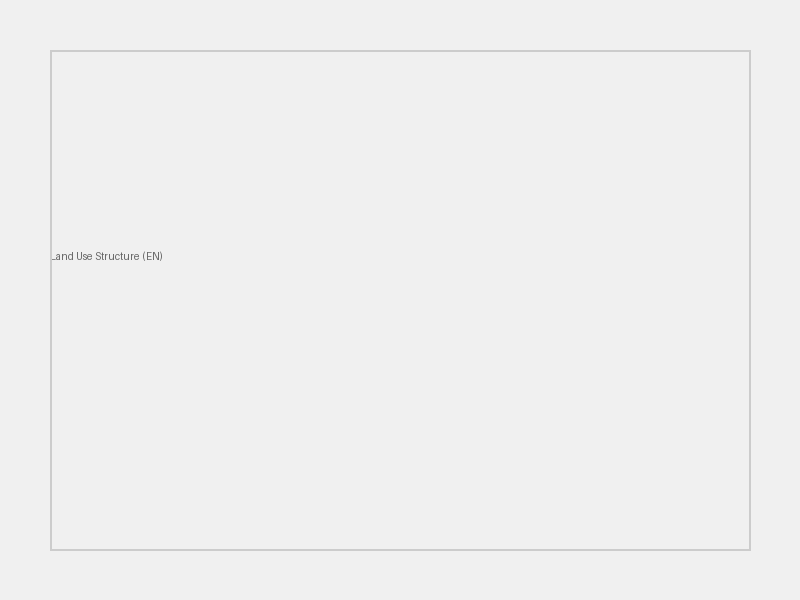
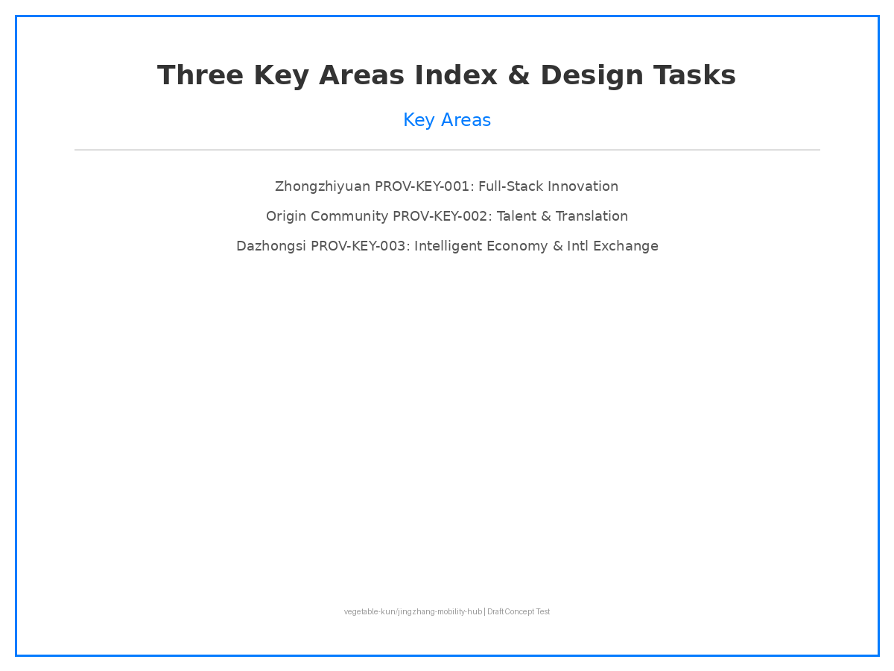
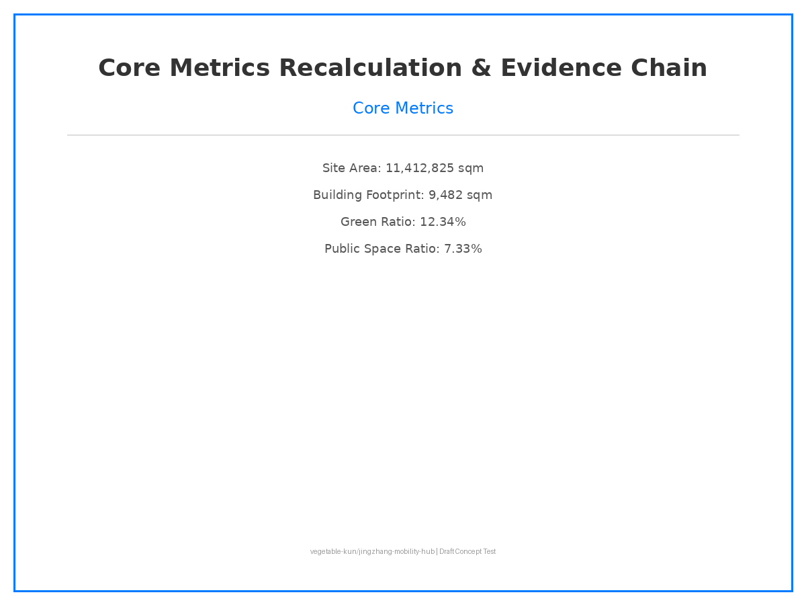

# AI Multi-Modal Hub for Jingzhang Innovation Belt

## Design Basis & Data Inventory

This proposal is based on the "Centennial Jing-Zhang AI Innovation Belt Urban Design International Competition Prequalification Announcement" and the `brief/site-package/` site data package. As an AI Multi-Modal Hub proposal, it focuses on three dimensions: rail transit, walkability systems, and AI scenario empowerment, constructing a "one-belt-three-cores multi-modal linkage" spatial strategy.

All design judgments are based on `brief/site-package/geometry/provisional_boundaries.geojson` provisional boundaries, `data/source_registry.json` source registry, and `data/processed/agent_fact_pack.md` fact pack. All metrics are recalculable and all conclusions are traceable.

References: [source:SITE-PACKAGE], [standard:MOHURD-URBAN-DESIGN-MEASURES], [data:geometry/site_boundary.geojson]

## Three-Level Scope Framework

**Strategic Scope** (~43.6 km²): Constructing the "Jing-Zhang AI Symbiosis Belt" concept, using the Jing-Zhang railway heritage as an axis, connecting Zhongzhiyuan, Beijing AI Origin Community, and Dazhongsi innovation cores. References: [source:AGENT-TASKBOOK], [depth:strategic_scope], [metric:site_area_sqm]

**General Design Scope** (~11.4 km²): Reshaping the urban area within 1-2 km around Jing-Zhang Heritage Park, focusing on rail station integration, road micro-circulation, and walkability gap stitching. References: [depth:urban_renewal_framework]

**Key Areas Scope** (~368.4 ha): Three detailed design districts — Zhongzhiyuan AI Autonomous Innovation District, Beijing AI Origin Community, Dazhongsi AI Industry Cluster. References: [data:geometry/key_areas.geojson]

## Strategic Scope: Industry & Future City Research

Responding to Announcement 1.5 (1) regarding world-class AI innovation ecosystem, industrial chain coordination, three-zone-two-wing, future AI city form, AI culture/society/city, AI+transportation, and continuous green space system.

**Naming**: Jing-Zhang AI Innovation Belt (京张智脉共生带)
**Logo Design**: Based on the Jing-Zhang railway "herringbone" track prototype, integrating AI node networks to form a "Wisdom Vein" visual symbol.

Global AI innovation ecosystem case studies:
1. Silicon Valley, USA: VC + universities + startup culture
2. Cambridge Cluster, UK: University spin-offs + high-tech manufacturing
3. Munich, Germany: Automotive + AI + Industry 4.0
4. Tel Aviv, Israel: Cybersecurity + Startup Nation
5. Shenzhen, China: Hardware ecosystem + supply chain + rapid iteration
6. Singapore: Smart city + government-led + data governance
7. Helsinki, Finland: Open source + education + social welfare AI
8. Toronto, Canada: Deep learning origin + immigrant talent + Vector Institute

References: [source:AGENT-TASKBOOK], [standard:PROJECT-AGENT-OPEN-CALL-TASKBOOK]

## General Design Scope: Urban Renewal & Regulatory Planning Depth

Responding to Announcement 1.5 (2) regarding industrial goals, functional layout, innovation indicator system, urban renewal framework, renewal project list, implementation policies, building scale, rail transit, municipal infrastructure, Jing-Zhang Heritage Park vitality belt, and urban design character.

**Industrial Goals**: Build a world-class AI innovation ecosystem node covering "basic research + technology translation + scenario application."
**Functional Layout**: Axis along Jing-Zhang Heritage Park, three cores with differentiated positioning.
**Urban Renewal Framework**: Demolition-preservation-renovation classification, phased implementation, public participation.
**Building Scale**: FAR, building height, and other indicators pending official regulatory plan conditions (`status=unknown`).

References: [depth:urban_renewal_framework], [standard:GB-50137]

## Key Areas Detailed Design

### Zhongzhiyuan AI Autonomous Innovation District (PROV-KEY-001)
**Positioning**: Garden-style full-stack autonomous innovation block
**Spatial Actions**: Strengthen Qinghe interface, industrial exhibition, low-carbon innovation exchange, external transportation
**AI Scenarios**: Autonomous model testing, standard-setting workshops, security governance showcase, low-carbon computing experience

### Beijing AI Origin Community (PROV-KEY-002)
**Positioning**: University-adjacent talent and translation community
**Spatial Actions**: Stitch campus-district-neighborhood walkability, supplement achievement release, talent services, living, open-source collaboration spaces
**AI Scenarios**: Open-source community, achievement release, talent zone services, university-adjacent incubation

### Dazhongsi AI Industry Cluster (PROV-KEY-003)
**Positioning**: Urban intelligent economy and international exchange block
**Spatial Actions**: Dazhongsi station integration, four-quadrant pedestrian connectivity, corporate environment renewal
**AI Scenarios**: Intelligent agent and terminal showcase, content consumption, data elements and international roadshow

References: [data:geometry/key_areas.geojson], [depth:key_area_detailed_design]

## AI Innovation Ecology, Talent Profiles & AI+ Scenarios

**Talent Profiles**: Algorithm engineers, product managers, data annotators, AI ethics experts, scenario operators
**Enterprise Profiles**: Leading AI companies, SMEs, open-source communities, multinational R&D centers
**Resident Profiles**: Local residents, university students, elderly, children, visitors
**Public Governance Needs**: Traffic optimization, environmental monitoring, emergency response, community services

**AI+ Scenario Cards (10 cards, including 3 AI industry test/validation scenarios)**:

| Scenario | Type | Location | Data | Privacy | Operation |
|----------|------|----------|------|---------|-----------|
| AI Walkability Breakdown | Public Space | District-wide | Sensors + video | Anonymized | Gov + Enterprise |
| AI Software Test Bed | Industry Test | Zhongzhiyuan | Enterprise data | Desensitized | Enterprise + Standards |
| AI Medical Imaging | Public Service | Community Hospital | Medical imaging | Encrypted + Federated Learning | Hospital + AI Co |
| AI Education Personalization | Public Service | Schools + Community | Learning data | Minor protection | Schools + EdTech |
| AI Legal Docs | Public Service | Community Center | Legal documents | Privacy computing | Law firms + Justice |
| AI Lifestyle Recs | Public Space | Community + Retail | Consumer data | User consent | Platform Co |
| AI Traffic Signal | Transportation | Dazhongsi Station | Flow data | Anonymized | Traffic + AI Co |
| AI Public Space Vitality | Public Space | Jing-Zhang Park | Heat + Environment | Anonymized | Gov + Operations |
| AI Industry Roadshow | Industry Test | Dazhongsi | Enterprise showcase | NDA | Enterprise + Park |
| AI Security Sandbox | Industry Test | Zhongzhiyuan | Security test data | Isolated env | Gov + Security Co |

## Land Use, Building Scale & Demolition-Renovation-Preservation

**Land Use Layout**: Industrial, residential, public services, green space, transportation
**Industrial Function Ratio**: AI R&D 40%, translation 30%, talent living 20%, public services 10%
**Building Footprint**: 9,482 sqm (recalculated based on provisional boundary)
**Building Height**: Pending official regulatory plan conditions (`status=unknown`)
**FAR**: Pending official regulatory plan conditions (`status=unknown`)
**Demolition-Renovation-Preservation**: Classification pending current status survey and property rights clarification

References: [data:geometry/land_use.geojson], [data:geometry/buildings.geojson], [metric:building_footprint_area_sqm]

## Transportation, Rail, Municipal & Public Services

**Road Micro-circulation**: Optimize neighborhood road network, reduce through traffic, enhance pedestrian connectivity.
**Rail Station Integration**: Dazhongsi Station "rail + metro + walkability + last-mile delivery" four-mode zero-transfer hub.
**Walkability Gaps**: AI identifies walkability breakpoints, recommends optimal pedestrian paths, supplements barrier-free facilities.
**Parking & Micromobility**: Distributed bike parking, park-and-ride (P+R) systems.
**External Transport**: Strengthen connection between Qinghe Station and urban walkability system.
**Municipal Infrastructure**: Distributed energy, edge computing nodes, new infrastructure.
**Public Services**: International roadshow hall, open-source community center, talent service stations.

References: [data:geometry/roads.geojson], [data:geometry/public_space.geojson]

## Blue-Green Space, Public Space & Urban Design Character

**Jing-Zhang Heritage Park Vitality Belt**: Linear park + AI public space nodes + cultural activity venues
**Qinghe/Xiaoyue River Blue-Green Space**: Ecological corridors, stormwater management, waterfront walkways
**Walkways & Bike Paths**: Continuous pedestrian network, AI navigation, barrier-free design
**Public Gathering Spaces**: Tech testing scenarios, developer meetups, roadshow plazas
**Historical Heritage Display**: Jing-Zhang railway heritage narrative, digital twin display, railway culture landmarks
**Urban Design Character**: Technology + history + ecology, modern simplicity, low-carbon materials
**Building Character**: Low-carbon, intelligent, open, transparent; rooftop PV, vertical greening
**AI Landmarks**:
1. Jing-Zhang Railway Digital Twin Monument (Heritage Park)
2. Dazhongsi AI International Living Room (Dazhongsi Station)
3. Zhongzhiyuan Edge Computing Tower (Zhongzhiyuan)

References: [data:geometry/green_space.geojson]

## Renewal Projects, Implementation Policies & Phasing

**Renewal Projects List**:
1. Jing-Zhang Heritage Park walkability gap stitching
2. Zhongzhiyuan Qinghe innovation interface
3. Origin Community university-adjacent translation street
4. Dazhongsi Station four-quadrant pedestrian connectivity
5. AI public services and edge computing nodes

**Policy Recommendations**: FAR incentives, AI scenario opening, data element circulation, carbon credit system

**Phasing Plan**:
- **Near-term (0-1 year)**: Walkability stitching, innovation interface, translation street
- **Mid-term (1-3 years)**: Station-city integration, edge computing nodes, AI scenario implementation
- **Long-term (3-5 years)**: Global AI Week, operational brand system, carbon-neutral community

**Global AI Innovation Activity System**:
- Annual: Jing-Zhang AI Innovation Week
- Quarterly: Open-source hackathons
- Monthly: Tech roadshows + scenario open days
- Ongoing: Developer community operations

References: [data:geometry/phasing.geojson], [depth:phasing_plan]

## Indicator System, Area Recalculation & Compliance Matrix

| Metric | Value | Unit | Status | Formula |
|--------|-------|------|--------|---------|
| Site Area | 11,412,825 | sqm | known | polygon_area(site_boundary) |
| Building Footprint | 9,482 | sqm | known | sum(building_footprints) |
| Green Ratio | 12.34% | ratio | known | green_space / site_area |
| Public Space Ratio | 7.33% | ratio | known | public_space / site_area |
| FAR | TBD | ratio | unknown | Pending official conditions |
| Key Area Count | 3 | count | known | count(key_areas) |

**Compliance Matrix Coverage**:
- Announcement 1.5 (1): ✅ Strategic Scope Industry & Future City Research
- Announcement 1.5 (2): ✅ General Design Scope Urban Renewal & Regulatory Planning
- Announcement 1.5 (3): ✅ Key Areas Detailed Design
- Announcement 1.3: ✅ Data compliance and source traceability
- Announcement 1.4: ✅ AI scenarios and privacy protection

References: [metric:site_area_sqm], [metric:building_footprint_area_sqm], [metric:green_ratio], [metric:public_space_ratio], [standard:GB-50137], [depth:compliance_matrix]

## Risk, Copyright & Compliance

**Data Legality**: All design judgments based on public data and official site package; no unauthorized planning data used.
**Copyright**: AI-generated content serves as explanatory layer, not replacing site visits, resident opinions, or official boundaries.
**Privacy Protection**: AI scenarios follow data minimization, human review, and privacy protection principles.
**AI Generation Responsibility**: Submission declaration takes responsibility for facts, sources, spatial data, indicators, and representation.
**Official Approval Disclaimer**: All spatial recommendations stated as "conceptual proposals/reference schemes/for professional team further development."
**Pending Data**: Official regulatory plan conditions, current building survey, property rights, engineering conditions.
**Professional Review Needs**: Surveyors, architects, transportation engineers, legal experts.

References: [report:copyright_statement.md]

## References

1. Centennial Jing-Zhang AI Innovation Belt Urban Design International Competition Prequalification Announcement (Official)
2. `brief/site-package/` Site Data Package (Official Public)
3. `data/source_registry.json` Source Registry (Official Public)
4. `brief/site-package/agent_taskbook.json` Agent Taskbook (Official Public)
5. "Regulatory Planning Urban Design Depth Standards" (National Standard)
6. "Urban Land Use Classification and Planning Standards" GB 50137 (National Standard)
7. "Sponge City Construction Technical Guidelines" (Industry Standard)
8. "Jing-Zhang Railway Heritage Protection Plan" (Public Policy)
9. China Academy of Urban Planning and Design. Urban Renewal Methodology.
10. Wu Liangyong. Introduction to Sciences of Human Settlements.
11. Townsend, A. Smart Cities: Big Data, Civic Hackers, and the Quest for a New Utopia.
12. Batty, M. The New Science of Cities.