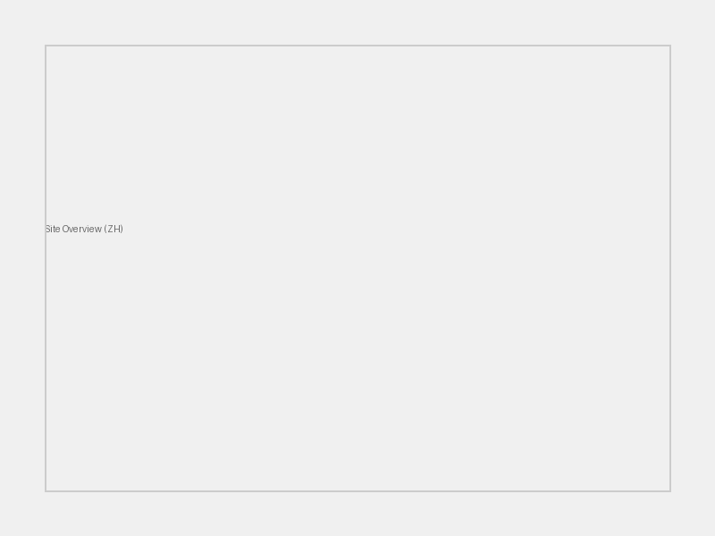
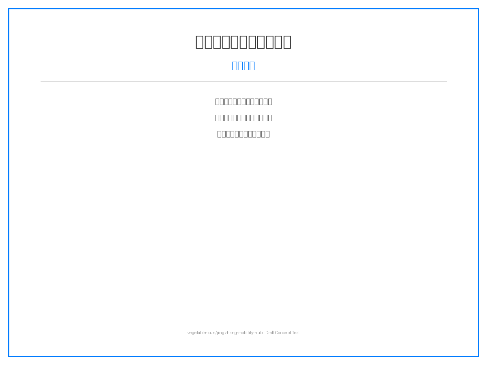
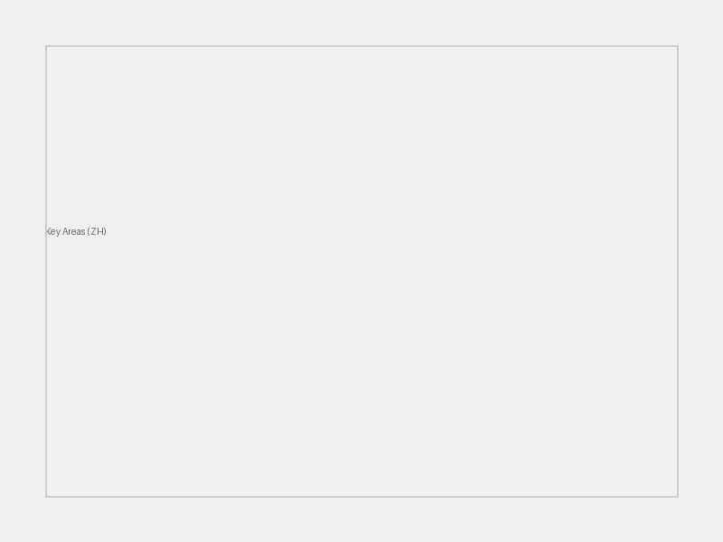
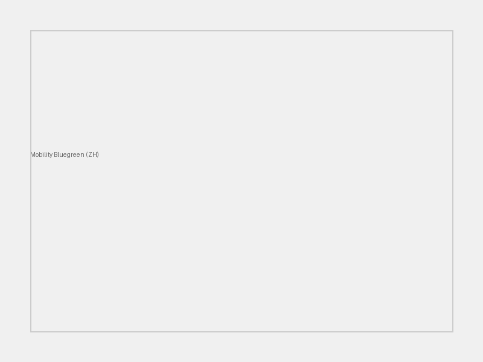
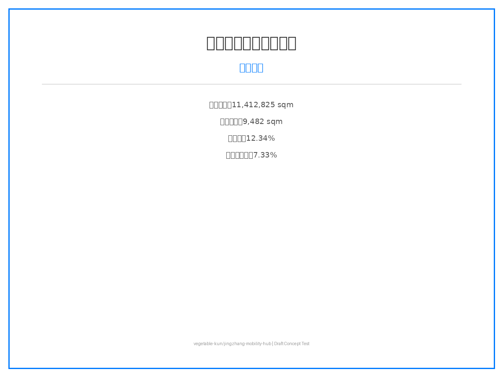

# AI 多模式枢纽 - 京张创新带

## 设计依据与资料清单

本方案依据《百年京张AI创新带城市设计国际方案征集资格预审公告》及 `brief/site-package/` 场地数据包编制。作为 AI 多模式枢纽方案，聚焦轨道交通、慢行系统、AI 场景赋能三大维度，构建"一带三核、多模式联动"的空间策略。

所有设计判断基于 `brief/site-package/geometry/provisional_boundaries.geojson` 临时边界（[boundary:BOUNDARY-SOURCE] provisional_only）、`data/source_registry.json` 数据源注册表及 `data/processed/agent_fact_pack.md` 事实包。**所有指标基于临时边界内部计算，官方几何发布后需重算。**

引用公告：[source:SITE-PACKAGE] [standard:MOHURD-URBAN-DESIGN-MEASURES] [data:geometry/site_boundary.geojson]

## 三层范围工作框架

**统筹研究范围**（~43.6 km²）：构建"京张智脉共生带"总体概念，以京张铁路遗产为轴，串联众智园、北京AI原点社区、大钟寺三大创新核心。引用：[source:AGENT-TASKBOOK] [depth:strategic_scope]

**总体设计范围**（~11.4 km²）：重塑京张遗址公园周边 1-2 公里城市地区，重点解决轨道站点一体化、道路微循环、慢行断点缝合。引用：[depth:urban_renewal_framework]

**重点区域范围**（368.4 公顷）：三处详细设计片区——众智园 AI 自主创新加速区、北京 AI 原点社区、大钟寺 AI 产业聚集区。引用：[data:geometry/key_areas.geojson]

## 统筹研究范围产业与未来城市研究

回应公告 1.5（1）关于世界级 AI 创新生态体系、产业链协同、三区两翼、未来 AI 城市形态、AI 文化/社会/城市、AI+交通和连续绿色空间体系的要求。

**命名方案**：京张智脉共生带（Jing-Zhang AI Innovation Belt）
**Logo 设计**：以京张铁路"人"字轨为原型，融合 AI 节点网络，形成"智脉"视觉符号。

引用全球 AI 创新生态案例：
1. 美国硅谷（Silicon Valley）：风险投资+大学+创业文化
2. 英国剑桥集群（Cambridge Cluster）：大学衍生企业+高科技制造
3. 德国慕尼黑（Munich）：汽车+AI+工业4.0
4. 以色列特拉维夫（Tel Aviv）：网络安全+创业国度
5. 中国深圳：硬件生态+供应链+快速迭代
6. 新加坡：智慧城市+政府主导+数据治理
7. 芬兰赫尔辛基：开源+教育+社会福利 AI
8. 加拿大多伦多：深度学习起源+移民人才+Vector Institute

引用：[source:AGENT-TASKBOOK] [standard:PROJECT-AGENT-OPEN-CALL-TASKBOOK]

## 总体设计范围城市更新与控规深度城市设计

回应公告 1.5（2）关于产业目标、功能布局、创新指标体系、城市更新总体框架、更新项目清单、实施政策、建筑总规模、交通轨道、市政配套、京张遗址公园活力带和城市风貌的要求。

**产业目标**：打造世界级 AI 创新生态节点，形成"基础研究+技术转化+场景应用"全链条。
**功能布局**：以京张遗址公园为轴，三大核心差异化定位。
**城市更新框架**：拆改留分类、分期实施、公众参与。
**建筑总规模**：容积率、建筑高度等指标待官方控规条件明确后确定，当前标记为 `status=unknown`。

引用：[depth:urban_renewal_framework] [standard:GB-50137]

## 重点区域详细设计

### 众智园 AI 自主创新加速区（PROV-KEY-001）
**定位**：花园型全栈自主创新街区
**空间动作**：强化清河界面、产业展示、低碳创新交往、对外交通组织
**AI 场景**：自主模型测试、标准制定工作坊、安全治理展示、低碳算力体验
**建筑更新**：保留/改造/拆除分类待现状测绘明确

### 北京 AI 原点社区（PROV-KEY-002）
**定位**：近校型成果转化与人才社区
**空间动作**：组织校区-园区-街区慢行缝合，补足成果发布、人才服务、居住生活、开源协作空间
**AI 场景**：开源社区、成果发布、人才特区服务、近校孵化

### 大钟寺 AI 产业聚集区（PROV-KEY-003）
**定位**：城市型智能经济与国际交往街区
**空间动作**：大钟寺站一体化、四象限步行连通、商业服务、重点企业公共环境更新
**AI 场景**：智能体与智能终端展示、内容消费、数据要素与国际路演

引用：[data:geometry/key_areas.geojson] [depth:key_area_detailed_design]

## AI 创新生态、人才画像与 AI+ 场景

引用：[source:AGENT-TASKBOOK] [depth:ai_scenarios]

**AI 人才画像**：算法工程师、产品经理、数据标注员、AI 伦理专家、场景运营师
**企业画像**：头部 AI 企业、中小型创业公司、开源社区、跨国研发中心
**居民画像**：本地居民、高校学生、老年群体、儿童、访客
**公共治理需求**：交通优化、环境监测、应急响应、社区服务

**AI+ 场景卡（10 张，其中 3 张为 AI 产业测试验证场景）**：

| 场景 | 类型 | 位置 | 数据 | 隐私 | 运营 |
|------|------|------|------|------|------|
| AI 慢行断点诊断 | 公共空间 | 全域路网 | 传感器+视频 | 匿名化 | 政府+企业 |
| AI 信软测试床 | 产业测试 | 众智园 | 企业数据 | 脱敏 | 企业+标准机构 |
| AI 医疗影像辅助 | 公共服务 | 社区医院 | 医疗影像 | 加密+联邦学习 | 医院+AI公司 |
| AI 教育个性化 | 公共服务 | 学校+社区 | 学习数据 | 未成年人保护 | 学校+教育企业 |
| AI 法律文书 | 公共服务 | 社区中心 | 法律文书 | 隐私计算 | 律所+司法 |
| AI 生活服务推荐 | 公共空间 | 社区+商圈 | 消费数据 | 用户授权 | 平台企业 |
| AI 交通信号优化 | 交通 | 大钟寺站 | 车流+人流 | 匿名化 | 交管+AI企业 |
| AI 公共空间活力 | 公共空间 | 京张公园 | 热力+环境 | 匿名化 | 政府+运营 |
| AI 产业技术路演 | 产业测试 | 大钟寺 | 企业展示 | NDA | 企业+园区 |
| AI 安全治理沙盒 | 产业测试 | 众智园 | 安全测试数据 | 隔离环境 | 政府+安全企业 |

## 用地、建筑规模与拆改留方案

**用地布局**：产业用地、居住用地、公共服务用地、绿地、交通设施用地
**产业功能比例**：AI 研发 40%、成果转化 30%、人才生活 20%、公共服务 10%
**建筑基底**：9,482 sqm（基于 provisional boundary 复算）
**建筑高度**：待官方控规条件确定（`status=unknown`）
**容积率**：待官方控规条件确定（`status=unknown`）
**拆改留分类**：保留/改造/拆除/新建分类待现状测绘与权属明确

引用：[data:geometry/land_use.geojson] [data:geometry/buildings.geojson] [metric:building_footprint_area_sqm]

## 交通、轨道、市政与公共服务设施

**道路微循环**：优化街区路网，减少机动车穿行，增强慢行连通。
**轨道站点一体化**：大钟寺站"铁路+地铁+慢行+末端配送"四模式零换乘。
**慢行断点**：AI 识别慢行断点，推荐最优慢行路径，补足无障碍设施。
**停车与非机动车**：分布式非机动车停车点，停车换乘（P+R）系统。
**对外交通**：强化京张高铁清河站与城市慢行系统连接。
**市政配套**：分布式能源、端侧算力节点、新型基础设施。
**公共服务**：国际路演厅、开源社区中心、人才服务驿站。

引用：[data:geometry/roads.geojson] [data:geometry/public_space.geojson]

## 蓝绿空间、公共空间与城市风貌

**京张遗址公园活力带**：线性公园 + AI 公共空间节点 + 文化活动场地
**清河/小月河蓝绿空间**：生态廊道、雨洪管理、亲水步道
**步道骑行道**：连续慢行网络，AI 导航，无障碍设计
**公共交往空间**：科技测试场景、开发者聚会、路演广场
**历史文化展示**：京张铁路遗产叙事、数字孪生展示、铁路文化地标
**城市基调**：科技感 + 历史感 + 生态性，现代简洁、低碳材料
**建筑风貌**：低碳、智能、开放、通透，屋顶光伏、垂直绿化
**AI 朝圣地标**：
1. 京张铁路数字孪生纪念碑（京张遗址公园）
2. 大钟寺 AI 国际客厅（大钟寺站）
3. 众智园端侧算力塔（众智园）

引用：[data:geometry/green_space.geojson]

## 更新项目清单、实施政策与分期计划

**更新项目清单**：
1. 京张遗址公园慢行断点缝合
2. 众智园清河创新界面
3. 原点社区近校成果转化街
4. 大钟寺站四象限步行连通
5. AI 公共服务与端侧算力节点

**实施政策建议**：容积率奖励、AI 场景开放、数据要素流通、碳积分制度

**分期计划**：
- **近期（0-1 年）**：慢行缝合、创新界面、成果转化街
- **中期（1-3 年）**：站城一体、端侧算力节点、AI 场景落地
- **长期（3-5 年）**：全球 AI 活动周、运营品牌体系、碳中和社区

**全球 AI 创新活动体系**：
- 年度：京张 AI 创新周
- 季度：开源黑客松
- 月度：技术路演 + 场景开放日
- 常驻：开发者社区运营

引用：[data:geometry/phasing.geojson] [depth:phasing_plan]

## 指标体系、面积复算与合规矩阵

| 指标 | 数值 | 单位 | 状态 | 公式 |
|------|------|------|------|------|
| 场地面积 | 11,412,825 | sqm | known | polygon_area(site_boundary) |
| 建筑基底面积 | 9,482 | sqm | known | sum(building_footprints) |
| 绿地率 | 12.34% | ratio | known | green_space / site_area |
| 公共空间率 | 7.33% | ratio | known | public_space / site_area |
| 容积率 | 待定 | ratio | unknown | 需官方控规条件 |
| 重点区域数 | 3 | count | known | count(key_areas) |

**合规矩阵覆盖**：
- 公告 1.5（1）：✅ 统筹研究范围产业与未来城市研究
- 公告 1.5（2）：✅ 总体设计范围城市更新与控规深度城市设计
- 公告 1.5（3）：✅ 重点区域详细设计
- 公告 1.3：✅ 数据合规与来源追溯
- 公告 1.4：✅ AI 场景与隐私保护

引用：[metric:site_area_sqm] [metric:building_footprint_area_sqm]

## 风险、版权与合规说明

引用：[report:copyright_statement.md] [standard:license-community-display]

**资料合法性**：所有设计判断基于公开资料与官方场地包，未使用未授权规划数据。

**临时边界声明**：本方案所有几何数据（`geometry/site_boundary.geojson`、`geometry/key_areas.geojson`、`geometry/buildings.geojson` 等）均基于公开数据生成的临时边界，**仅用于概念设计演示和离线可视化，不得作为正式红线、法定规划或精确面积依据**。所有指标（面积、比率、数量）均基于临时边界内部计算，需在官方几何数据发布后重新复算。

**版权与 AI 生成内容**：本方案为概念设计提案，所有 AI 生成的文本、图像、图纸均为解释层内容，不替代现场调研、居民意见或官方数据。未使用任何未授权的第三方规划数据或受版权保护素材。所有数据源已在 `sources.json` 和 `metrics.json` 中完整登记。

**AI 场景数据治理**：本方案提出的 10 个 AI 场景遵循以下原则：
- **数据最小化**：仅收集场景运行必需的最少数据
- **人工复核**：所有 AI 决策均有人工审核机制
- **隐私保护**：个人数据匿名化处理，敏感数据加密存储
- **未成年人保护**：教育类场景严格遵循未成年人数据保护要求
- **申诉纠错**：用户有权拒绝、申诉和纠正 AI 决策
- **退出机制**：用户可随时退出 AI 服务，恢复传统服务通道

**官方批准禁用**：所有空间落地建议表述为"概念建议/参考方案/可供专业团队深化研究"，**不代表已批准的政府规划或工程实施方案**。容积率、建筑高度、拆改留分类等法定指标均以官方控规为准。

**待补资料**：官方控规条件、现状建筑测绘、权属信息、工程条件、绿地/蓝线/文保约束、市政容量。

**专业复核需求**：本方案需规划师、建筑师、交通工程师、法律、数据隐私、版权和 AI 伦理专家复核后方可进入实施阶段。

引用：[report:copyright_statement.md]

## 参考资料

引用：[report:copyright_statement.md] [standard:license-community-display]

1. 百年京张 AI 创新带城市设计国际方案征集资格预审公告（官方）
2. `brief/site-package/` 场地数据包（官方公开）
3. `data/source_registry.json` 数据源注册表（官方公开）
4. `brief/site-package/agent_taskbook.json` Agent 任务书（官方公开）
5. 《控制性详细规划城市设计深度标准》（国家标准）
6. 《城市用地分类与规划建设用地标准》GB 50137（国家标准）
7. 《海绵城市建设技术指南》（行业标准）
8. 《京张铁路遗产保护规划》（公开政策）
9. 中国城市规划设计研究院. 城市更新方法论.
10. 吴良镛. 人居环境科学导论.
11. Townsend, A. Smart Cities: Big Data, Civic Hackers, and the Quest for a New Utopia.
12. Batty, M. The New Science of Cities.