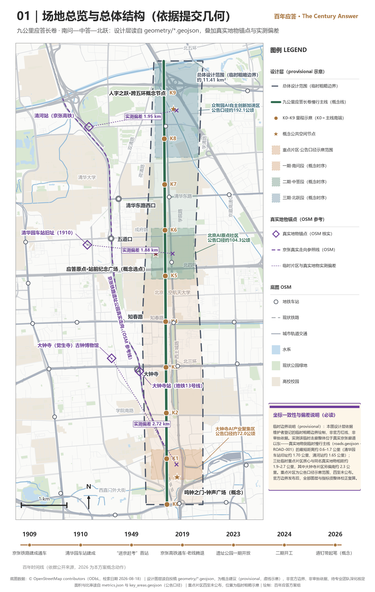
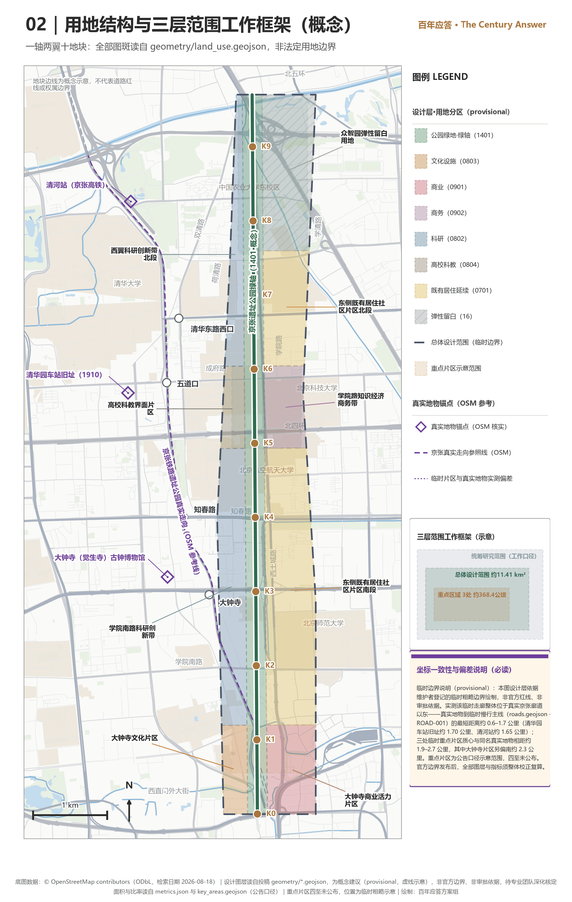
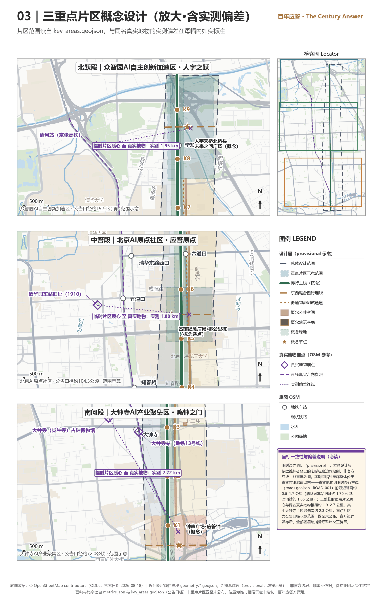
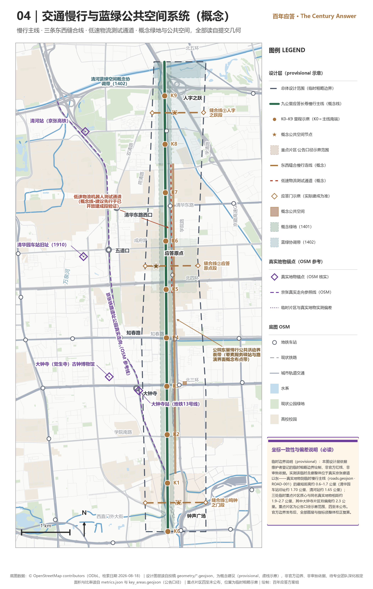
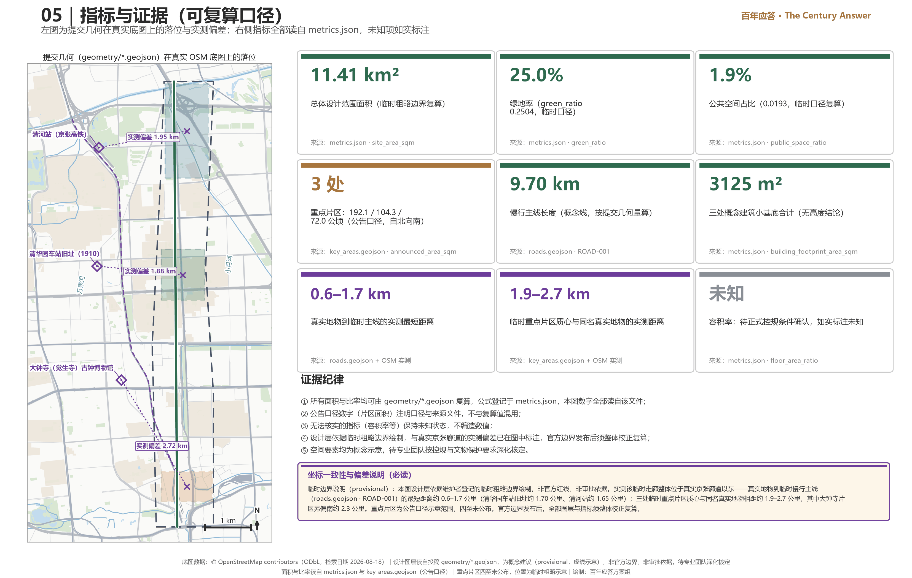

# The Century Answer (百年应答)

In 1909, Zhan Tianyou used the Jing-Zhang Railway to answer a question of the century: could the Chinese people build a railway on their own? Today, beside the roughly 9-kilometre heritage park released by that same railway, more than 2,000 AI enterprises in Haidian are answering a new question: can China build its own AI? This proposal turns the Jing-Zhang Railway Heritage Park into a century-spanning answer sheet laid open on the ground — for every large model independently registered in Haidian, a bronze rail spike is set into the edge of the walkway; when an enterprise inside the belt completes registration or an IPO, it rings the newly cast Answer Bell beside Dazhongsi; and every year on 25 March, Tsinghuayuan Railway Station hosts nothing but a public-interest commemorative open day. Citizens do not come to look at display boards — they crouch down and count the spikes: how far has China's independent innovation been nailed in?

All spatial and development content in this proposal is a conceptual recommendation and reference scheme offered for further study by professional teams; it does not constitute a government-approved conclusion. This proposal makes no conclusive judgement on floor area ratio, building height, road right-of-way lines, or demolish–renovate–retain classification.

## Design Basis and Source List

The design basis of this proposal is first a real century of history, and only second a stack of documents — every design move here grows out of the question asked in 1909. In that year the Jing-Zhang Railway could not climb the sheer grade of the Guangou pass, and Zhan Tianyou drew the character "人" (ren): the train runs into a switch, reverses direction, and two gentle grades replace one grade too steep to climb. Surveyed, designed, and built by Chinese engineers, the line was completed and opened that same year, answering whether the Chinese people could build a railway of their own. In 1910 Tsinghuayuan Railway Station was completed, its name plaque inscribed by Zhan Tianyou; on 25 March 1949 the CPC Central Committee's "march to the examination" reached Beiping, and this small station was its first stop in the Beijing area; on 25 March 2023 the restored station building reopened [source:THU-STATION-2023]. The railway then handed in an answer of its own: the Jing-Zhang high-speed line opened in 2019, the old line was retired, and the tracks gave way to a park — Phase I, 2.4 kilometres and 16.8 hectares, was completed and opened in June 2023 [source:PARK1-YLLHJ-2023]; the park runs about 9 kilometres in total, with 46 entrances planned along Phase II [source:PARK2-PLAN-2024]; Phase II broke ground in December 2024 [source:PARK2-START-2024] and was formally completed and opened to the public on 6 August 2026 — about 53 hectares of land, extending both southward and northward to link Xizhimen with the North Fifth Ring Road, carrying a complete "three lanes and one green" walking-and-cycling system along its whole length, with the separate walking lane, jogging lane, and cycling lane running through end to end without a single break, and directly serving 70 communities and about 450,000 residents along the corridor [source:PARK2-OPEN-2026]. **This means the corridor this proposal addresses is no longer one waiting to be built, but one just completed and waiting to be used and to be told** — so the centre of design effort shifts from "how to get it built" to "how it gets used day by day and told year after year".

On both sides of the park, the candidates have already filled the examination hall: Haidian clusters more than 2,000 AI enterprises with an AI core industry scale of nearly RMB 360 billion [source:BJD-AI-2026]; 122 large models have been registered and launched (the district-government official calibre as of February 2026) [source:HD-PLAN-2026]; and the citywide cumulative total of 209 registered and launched models — close to one third of the national total — has entered the statistical communiqué [source:BJ-STAT-2025]. Lay those two sets of facts on top of each other and the proposal's core image surfaces by itself: 1909 and today are two answers to one question, so this 9-kilometre park should be made into an answer sheet spread open on the ground — the spikes record each act of answering, the bell announces each milestone, and the station preserves the original wording of the question.

The pen stroke is framed by three documents. The Pre-Qualification Announcement of the International Solicitation for the Urban Design of the Centennial Jing-Zhang AI Innovation Belt sets out the three-level scope and the design tasks, and is this proposal's first basis [source:OFFICIAL-ANNOUNCEMENT]; the agent-oriented open-call taskbook sets out six tasks and the unified boundary clause [source:AGENT-TASKBOOK]; and the maintainer-registered provisional boundaries, enumerations, metrics, and source lists under `brief/site-package/` are the direct manuscript behind every layer and every figure in this proposal [source:PROCESSED-FACT-PACK].

The design also has one baseline it must not cross. The regulatory detailed plan for blocks HD00-1601 and others along the Jing-Zhang Railway Heritage Park corridor (AI Innovation District key area, 2024–2035) was approved and published on 11 August 2026, establishing the statutory spatial structure of "one belt, one axis, two centres, multiple nodes" [source:HD-CTRL-PLAN-2026]. This proposal is a conceptual deepening on top of that approved plan: it does not sit parallel to the statutory plan, does not replace it, and does not quote its unpublished control indicators. Its spatial concept aligns with the statutory structure naturally — the 9-kilometre "Answer Scroll" corresponds to the "belt", while the Gate of the Ringing Bell (Dazhongsi) and the Answer Origin (Wudaokou · Tsinghuayuan Station) fall on the "two centres". All spatial statements remain conceptual recommendations awaiting deepening by professional teams inside the statutory framework.

The site extent continues to use the maintainer-registered provisional rough boundary [data:geometry/site_boundary.geojson#SITE-001], fully tagged as a provisional constraint and explicitly not an official boundary; it is used only for proposal generation, self-checking, visualisation, and design discussion, and never as an official planning boundary, an approval basis, or a precise area basis. Once the official boundary is released, every layer and every metric must be recalculated item by item against the registered recalculation checklist [depth:existing_conditions_diagnosis].

## Three-Level Scope Framework

The proposal tells one story and tells it across three scales: the Centennial Jing-Zhang Culture Belt is the question sheet (the question of 1909), the AI Fusion Innovation Belt is the answer sheet (enterprises and models answering), and the Urban AI Life Experience Belt is the marking hall (citizens counting spikes, hearing the bell, and watching showcases along the 9-kilometre walkway). Spatially, that story lands as an overall structure (conceptual recommendation) of "one 9-kilometre Answer Scroll Spine, three segments — Question in the South, Answer in the Middle, Leap in the North — and 46 Answer Gates permeating east and west into nearly 70 communities": Dazhongsi's Gate of the Ringing Bell in the south, the Answer Origin beside Tsinghuayuan Railway Station in the middle, and Zhongzhiyuan's Ren-Shaped Leap in the north [depth:overall_spatial_structure] [depth:three_level_scope_framework].

The three working levels required by the solicitation are three handwritings on the same answer sheet. The Coordinated Research Area (about 43.6 square kilometres) decides "what to write" — naming, ecosystem, narrative, and international benchmarking; the Overall Design Area (about 11.4 square kilometres, the urban area within 1–2 kilometres of the Jing-Zhang Railway Heritage Park) decides "where to write it" — renewal framework, land use, walking and cycling, and public space; the Key-Area Detailed Design Area (three detailed-design districts totalling about 368.4 hectares) decides "how to set pen to paper" — the landmarks, scenarios, and implementation dependencies of each segment. The item-by-item mapping of the three levels against the official requirements is carried by the compliance matrix [standard:PROJECT-OFFICIAL-ANNOUNCEMENT], and the spatial evidence rests on the submitted boundary and the three key-area layers [data:geometry/key_areas.geojson#PROV-KEY-001] [metric:key_area_count].

| Level | Design question | This proposal's answer | Data anchor |
| --- | --- | --- | --- |
| Coordinated Research Area | How to organise the AI industry ecosystem and future urban form | "The Century Answer" naming and narrative system, innovation ecosystem map, international benchmark mechanism prototypes | compliance_matrix.json, standard_matrix.json |
| Overall Design Area | How to map the renewal framework, industrial space, and urban character | Answer Scroll Spine + ten conceptual block zones on two wings, "connect first, then linger" at breakpoints, Factor Service Stations | [data:geometry/land_use.geojson#LU-001] |
| Key-Area Detailed Design Area | How the three districts reach detailed-design depth | Detailed conceptual designs of the Gate of the Ringing Bell, the Answer Origin, and the Ren-Shaped Leap | [data:geometry/key_areas.geojson#PROV-KEY-003] |

Any area or scale that cannot be recalculated from the structured data is not written into formal conclusions; all current conclusions are constrained by the provisional boundary and must be recalculated as a whole package once the official boundary is updated.

## Coordinated Research Area: Industry and Future City Research

The coordinated level does three things for this belt: give it a name, fit it with an ecosystem, and find a set of tested references. The primary name is "The Century Answer (百年应答)", gathering the three grand positionings into a single story that can be told, walked, and counted — Question (the Centennial Jing-Zhang Culture Belt), Answer (the AI Fusion Innovation Belt), Reading (the Urban AI Life Experience Belt). A family of names derives from the primary case: the Answer Scroll (the 9-kilometre spine), the Answer Bell (the newly cast bell at Dazhongsi), the Answer Origin (the Tsinghuayuan Station segment), the Answer Gates (the 46 entrances, subject to actual completion), the Rail-Spike Band (the registered-large-model commemorative band), and the Ren-Shaped Leap (the conceptual node across the Fifth Ring Road). The primary logo motif is "spike cross-section × answering sound rings" — the circle of a bronze rail spike seen from above plus outward-spreading sound-wave rings, the rings echoing both the bell chime and a dialogue bubble; the alternative is an abstracted "人" (ren)-shaped skeleton. Full-library collision screening shows 265 hits for the "人" symbol and an existing competing entry already using "人" as its primary form, so the primary case deliberately avoids both the "人" primary form and the "spike × cursor" composition; "Century Answer / Answer Bell / Rail-Spike Band mechanism" scores only 0–1 hits across the full library, so differentiation rests on the mechanism layer rather than on symbol exclusivity [source:AGENT-TASKBOOK]. The logo carries a version number (starting at v1.0), iterates annually, and is archived each time, turning "able to learn, able to think, able to evolve" from a slogan into a verifiable loop.

The innovation ecosystem map is configured (as a conceptual recommendation) as eight factors — land, space, capital, talent, computing power, data, scenarios, policy — across the "Three Zones and Two Wings", and its configuring logic has only one rule: wire the existing industrial assets to the park belt's public-space supply rather than build another industrial park. Haidian's family assets are thick enough — 122 registered and launched large models (the district-government official calibre as of February 2026, close to sixty percent of the city total) and about 5,000 PCT patent applications per year [source:HD-PLAN-2026]; the citywide cumulative total of 209, close to one third of the national total, already written into the statistical communiqué [source:BJ-STAT-2025]; an AI core industry scale of nearly RMB 360 billion and a cluster of more than 2,000 AI enterprises [source:BJD-AI-2026]; figures such as 12,300 AI scholars and 26 unicorn companies appear in district-level public promotional material and serve as background description only. What is genuinely scarce is scenarios and data: 9 kilometres of continuous public space plus the real demand of nearly 70 communities is a supply unique to the Jing-Zhang belt, while land, capital, and computing power follow an "access and linkage" approach and start nothing new.

Six international benchmark cases are chosen, each explicitly marked comparable or not comparable. King's Cross (London) defines a district through flagship institutions — comparable as railway-land regeneration, not comparable in its single-developer ownership structure. Kendall Square (Cambridge) lowers start-up thresholds with shared laboratories — comparable in its walkable top-university radius, not comparable in its asset-heavy biomedical format. Singapore's one-north directly inspires this proposal's robot-testing path with its graded regime of "start small, open one level after validating the previous" — its city-state unitary ownership is not comparable. Shenzhen's Hetao proves that a small space can host high-level institutional experiments, but its cross-border authorisation logic is not comparable and no authorisation statement may be extrapolated from it. Seoul's DMC shows a "negative-asset reversal + anchor institutions first" path — its government-built-new-district model is not comparable. Sidewalk Toronto is the cautionary counter-example of data-governance failure: large-scale sensor collection lost public trust and the project withdrew, warning this proposal that every digital touchpoint defaults to minimal collection, anonymisation, and published inventories. Together the six say one thing: **districts survive on mechanisms, not on concepts**. What can be borrowed are four mechanism prototypes (anchors defining identity, shared facilities lowering thresholds, graded opening of testing, small spaces concentrating institutional trials) plus one red line (data governance precedes technology deployment), not the spatial form of any single case [standard:PROJECT-AGENT-OPEN-CALL-TASKBOOK]. The three tiers and the red lines map directly onto three duties in the Interim Measures for the Management of Generative AI Services: no collection of unnecessary personal information and no unlawful retention of identifiable input (matching the zero-collection L1 and delete-after-use L3); generated content must be labelled in accordance with the rules (guidance output and model demos reached by scanning a spike always carry an AI-generated label and never pose as real photographs, measured data, or official conclusions); and services with public-opinion or social-mobilisation attributes must complete security assessment and algorithm filing — this proposal presumes no exemption, and every scenario pilot is conditional on obtaining the corresponding administrative permissions [standard:GENERATIVE-AI-INTERIM-MEASURES].

The future-urban-form research answers accordingly: what AI changes is not buildings, but what people are willing to do in the city. This proposal designs "counting spikes, hearing the bell, passing through Answer Gates, climbing the ren-shaped bridge" as everyday urban gestures of the AI era, translating the industry figures in the statistical communiqué into public-space evidence one can crouch down and touch [depth:overall_spatial_structure].

## Overall Design Area: Urban Renewal and Regulatory-Plan-Level Urban Design

The Overall Design Area does one thing: stitch back together the east and west banks that a railway kept apart for a century. The renewal framework is "one spine, two wings, ten blocks" (conceptual recommendation; in the statutory structure "one axis" refers specifically to the Zhongguancun Street Innovation Development Axis, so this proposal's own skeleton is uniformly called the "Scroll Spine" to keep the two apart): the 9-kilometre park green corridor is the Scroll Spine [data:geometry/land_use.geojson#LU-001], and the two wings arrange ten conceptual block zones — culture, commerce, research, residence, education, business, and flexible reserved land — across the Question-South, Answer-Middle, and Leap-North segments, with the northern Leap segment specifically holding flexible reserved land [data:geometry/land_use.geojson#LU-010] so that the "questions of the future" are not filled up by today's answers. The whole framework sits inside the approved statutory structure of "one belt, one axis, two centres, multiple nodes" — the Scroll Spine is the "belt" of that statutory structure, the flanking parcels are organised within the "two centres, multiple nodes" framework, and no statutory control content is changed or replaced [source:HD-CTRL-PLAN-2026].

The problem has to be stated correctly first. With Phase II open, north–south walking and cycling already runs through the whole line on the "three lanes and one green" system [source:PARK2-OPEN-2026], so **the longitudinal direction is no longer the problem; what remains genuinely unsolved is the east–west crossing** — the Line 13 viaduct and the old railway embankment form a natural spatial barrier, walls and fences along the corridor cut the blocks apart, residents moving east to west are held up, and the idle space beneath the viaduct has been taken over by disorderly parking. The stitching therefore uses three kinds of needlework. First, **Breakpoint Living Rooms (connect first, then linger)**: "breakpoint" here means the east–west crossing barrier specifically, never the park's longitudinal walking route — for each east–west barrier a conceptual crossing-optimisation strategy comes first, a scenario is then overlaid, and every crossing space is furnished with a combined set of seating, rain shelter, information screen, and drinking point, turning "waiting to cross" into "willing to stay"; the disorderly parking space beneath the viaduct is the first candidate for retrofit. Second, **46 Answer Gates × 70 community adoption**: relying on the 46 entrances planned in Phase II (subject to actual completion [source:PARK2-PLAN-2024]), each gate is made into "one page of an opened examination paper" — the outer face carries the question of the century, the inner face carries today's answer — adopted by the nearly 70 communities along the line. Third, **Factor Service Stations**: stations for policy consultation, registration coaching, and results matchmaking (no on-the-spot granting) are placed in low-efficiency spaces on both the east and west sides of the park, with sharing intensity rising closer to the park — using functions to manufacture reasons for crossing east and west. Only when people are willing to walk through does it count as stitching [data:geometry/public_space.geojson#PUBLIC-005].

The Rail-Spike Band is the thinnest yet longest through-running element: a continuous bronze-spike band along the walkway edge across the full line, laid out continuously along the walking-and-cycling system already built and running through, letting the "answer sheet" read as written through from end to end. The block zoning passed topology checks in EPSG:4548 projected space (coverage gap below 1 square metre, overlap below 1 square metre), all land-use codes are drawn from the site-package enumerations, and the required depth follows regulatory-detailed-planning-level urban design [standard:MOHURD-CONTROL-DETAILED-PLANNING] [depth:land_use_layout]. The comprehensive carrying capacity, municipal support, and character control of urban renewal are coordinated under the overall urban design method [standard:MOHURD-URBAN-DESIGN-MEASURES]; wherever building height, development intensity, road right-of-way lines, setbacks, or facility standards are involved, this proposal gives no conclusive values, uniformly states "pending confirmation of formal regulatory planning conditions", and lets the corresponding indicators honestly remain unknown in the metrics table [depth:development_intensity_controls].

## Detailed Design of Key Areas

On the 9-kilometre scroll, the three key areas each carry one narrative segment: Dazhongsi is the Question in the South, Tsinghuayuan Station is the Answer in the Middle, and Zhongzhiyuan is the Leap in the North [depth:three_key_area_detailed_design]. The three share the official area calibres — Zhongzhiyuan 192.1 hectares, the Beijing AI Origin Community 104.3 hectares, Dazhongsi 72.0 hectares; the submitted layers continue to use provisional rough extents and are neither official planning boundarys nor precise area bases [data:geometry/key_areas.geojson#PROV-KEY-002].

**Dazhongsi AI Industry Cluster = the Gate of the Ringing Bell (southern Question segment).** The conceptual core is "the Answer Bell and the Bell Chime Plaza": an open circular plaza whose ground paving spreads outward in concentric sound-wave rings (the logo motif enlarged onto the ground); at its centre stands a steel bell frame in the Jing-Zhang truss vocabulary — I-beams, riveted joints, spike-shaped finials — carrying a **newly cast contemporary** bronze Answer Bell. The Dazhongsi historic complex, founded in 1733, stands complete and independent in the distance, held apart from the new frame by a planted buffer and a walking path — one ancient, one present, facing each other across a distance rather than pressed side by side [source:DZS-MUSEUM-2021]. Two iron rules apply. First, the Answer Bell stands in cultural correspondence with the Ancient Bell Museum and its collection only: **no heritage bell is ever struck, ever moved, or ever put to commercial use.** Second, Dazhongsi is a national key cultural-relics protection site, so the bell frame and the plaza withdraw entirely from the heritage protection extent and its construction control zone; **the precise siting, the setback distance, and the massing control are all conceptual recommendations pending consultation with the heritage authorities**, and the frame's height is controlled with the intent of staying below the surrounding street-tree canopy, never competing with the historic buildings for the skyline. Enterprises inside the belt that complete large-model registration or an IPO may book one ring of the bell; ringing eligibility is bound to publicly verifiable events, recording facts without endorsing enterprises. Four "sound-wave paths" radiate from the plaza into the four quadrants around Dazhongsi Station on Subway Line 13, stitching the pedestrian flows severed by roads (the flow organisation is a conceptual recommendation; the traffic scheme awaits professional deepening) [data:geometry/public_space.geojson#PUBLIC-001]. Commercial showcases, bell-ringing ceremonies, and spike-installation ceremonies are all carried by this segment and the Zhongzhiyuan segment.

Where does the land for the plaza come from? That is the most concrete question this segment has to answer. Measurement shows more than 50 buildings with a combined footprint of about 15 hectares within roughly 0.9 × 0.85 kilometres around Dazhongsi — a fully built-out, high-density area with no vacant land standing ready. **The plaza can only come out of urban renewal; it cannot be drawn onto a sheet out of thin air.** That path has already been walked and made public inside this very district: within the Dazhongsi pilot area, a low-efficiency commercial parcel (a home-furnishing and building-materials market) has been brought into urban renewal through the model of "government coordination + social capital participation + listed land transfer", turning from retail formats toward a mix of technology offices, innovation exchange, and public services, with explicit requirements to improve landscaping and complete the pedestrian system, and positioned as an important node on the Jing-Zhang Heritage Park innovation-exchange belt inside the approved regulatory planning system [source:LJLJ-RENEWAL-2026]. What this proposal derives from that is a **mechanism recommendation, not a site designation**: in the low-efficiency land renewal that follows in the Question-South segment, it is suggested that no less than a quarter of a parcel be reserved as one consolidated public open space of about 1 hectare (roughly 100 metres square) to carry the Bell Chime Plaza. Which parcel it eventually falls on, and how it is implemented, are settled by rights holders, competent authorities, and professional teams through statutory procedures; this proposal designates no parcel and disposes of no party's ownership or development arrangements. The dimension also survives arithmetic: a 1-hectare plaza is about a quarter of a renewal parcel in the 3–4 hectare range, and it runs in the same direction as the "add green space, connect walking" renewal goals such projects already carry.

**Beijing AI Origin Community = the Answer Origin (middle Answer segment).** Not one brick or tile of the old Tsinghuayuan Railway Station building (built in 1910, station name inscribed by Zhan Tianyou) is touched; the heritage-protection GIS extent is missing, so every placement is a **conceptual siting pending consultation with the heritage authorities** [source:THU-STATION-2023]. In front of the station a "plain plaza" is kept — low colour, low commerce, low volume — holding only two objects: an "Answer Book" (turnable metal pages, each engraving one year's summary of the city's answer sheet) and the "Kilometre-Zero Post of the Rail-Spike Band" (marker K0+000, with spike No. 0 set at its base, engraved with the event itself: "1909 — the Jing-Zhang Railway completed and opened") [data:geometry/public_space.geojson#PUBLIC-002]. The campus interface follows low-disturbance stitching: walls and ownership boundaries stay untouched, and permeability is achieved through Answer Gates and improved walking interfaces. Every year on 25 March, only a public-interest commemorative open day is held — no corporate naming, no commercial showcase, no on-site spike installation.

**Zhongzhiyuan AI Independent Innovation Acceleration Area = the Ren-Shaped Leap (northern Leap segment).** The "Ren-Character Footbridge" across the Fifth Ring Road is a conceptual node answering the official wording of "a landmark node spanning the ring road" directly, and **contains no engineering conclusion on alignment, span, or structure**: the main span is conceived as a single straight pedestrian span crossing the ring road to link north and south. The character "人" is not drawn as a plan-shape on the bridge deck — it lands in the **switchback ramps** at the two ends. Each side carries a single switchback, laid flat into the green space, buying the clearance height needed to cross the road with the length of one reversal, at a gradient gentle enough to push a wheelchair up; the switchback is itself the technical core of a ren-shaped railway alignment, and the ramp form stays restrained, with no multi-level spiralling [data:geometry/public_space.geojson#PUBLIC-003]. This is exactly the solution the question of 1909 required: the ren-shaped alignment at Qinglongqiao had to trade limited length for height, and today a pedestrian crossing of a ring road has to meet an accessible gradient within limited land — the same problem. From "climbing the mountain" to "crossing the ring", the same character, the same knack of buying height with a reversal: the form is not a symbol pasted on, it is what falls out of solving the problem. Beneath the bridge the Qinghe blue-green space is picked up, so the Scroll Spine narrative and the Qinghe ecology form a cross here. The parapet display screens show only a few core figures updated on the statistical publication cycle (never real-time). Zhongzhiyuan also serves as the "home ground of testing" for robot testing and model-demo integration testing (see the scenarios chapter).

| Key area | Narrative role | Conceptual landmark | Home ground for | Evidence reference |
| --- | --- | --- | --- | --- |
| Dazhongsi (72.0 ha calibre) | South Question · Gate of the Ringing Bell | Answer Bell and Bell Chime Plaza, four-quadrant sound-wave paths | Commercial showcases, bell ceremonies, the March showcase season | [data:geometry/key_areas.geojson#PROV-KEY-003] |
| AI Origin Community (104.3 ha calibre) | Middle Answer · the Answer Origin | Plain plaza, Answer Book, Kilometre-Zero Post (conceptual siting pending heritage consultation) | The 25 March public-interest commemorative open day, graduation rite | [data:geometry/key_areas.geojson#PROV-KEY-002] |
| Zhongzhiyuan (192.1 ha calibre) | North Leap · the Ren-Shaped Leap | Ren-Character Footbridge conceptual node, Qinghe blue-green cross | Testing and validation, Evolution Day, questions of the future | [data:geometry/key_areas.geojson#PROV-KEY-001] |

## AI Innovation Ecosystem, Personas, and AI+ Scenarios

The twelve AI scenario cards all answer one question: when an ordinary person walks into this belt, what can AI do for them? Every scenario is linked to the organiser's standard scenario IDs, with three pre-defined data tiers: L1 fully public (zero collection), L2 anonymous aggregation (aggregate statistics only), and L3 active authorisation (single-use authorisation, deleted after use, revocable). Red lines across all scenarios: no facial recognition, no individual-trajectory tracking, no new surveillance-type collection; every AI output is human-reviewable, stoppable, and rollbackable [standard:PROJECT-AGENT-OPEN-CALL-TASKBOOK].

| # | Scenario card | Official scenario ID | Type | Spatial carrier | Data tier |
| --- | --- | --- | --- | --- | --- |
| S1 | Scan a Spike, Get an Answer: Rail-Spike Band guide agent | ai-cultural-guide | Experience | Full Rail-Spike Band, origin at the Kilometre-Zero Post (conceptual siting pending consultation) | L1 (counting L2) |
| S2 | Answer Gates: community guiding and co-creation | ai-cultural-guide | Experience | 46 entrances (subject to actual completion) × nearly 70 communities | L1 + oral history L3 |
| S3 | 25 March public open-day booking and storytelling | ai-cultural-guide | Experience | Tsinghuayuan Station plain plaza | Booking L3 + on-site L1 |
| S4 | Bell Chime Plaza: four-quadrant transfer walking assistant | ai-traffic-walkability | Service | Four-quadrant sound-wave paths at Dazhongsi Station | L1 |
| S5 | Breakpoint Living Rooms: east–west crossing feedback stations | ai-traffic-walkability | Service | Every east–west crossing point along the full line | L3 anonymous by default |
| S6 | Health-service navigation corner (navigation, not diagnosis) | ai-health-service-navigation | Service | Station navigation corners + community interfaces | L1, zero health-data collection |
| S7 | Factor Service Stations: registration-coaching copilot | enterprise-service-copilot | Service | Stations on both east and west sides (no on-the-spot granting) | L1 + enterprise files L3, deleted after use |
| S8 | Youth curation assistant | ai-cultural-guide | Service | Quarterly curated spots along the full line | Application L3 + archive L1 |
| S9 | Phase-I low-speed delivery-robot test ground | robot-delivery-low-speed | Testing | The opened Phase I segment: 2.4 km, 16.8 ha | Edge-anonymised L2 |
| S10 | Dual-use ramps: robot and wheelchair compatibility testing | robot-delivery-low-speed | Testing | Sample ramps at 2–3 Answer Gates | L2 + volunteers L3 |
| S11 | Scan-a-spike demo integration testing | enterprise-service-copilot | Testing | Zhongzhiyuan test bays → full Rail-Spike Band | L1 test corpus |
| S12 | Event-day walking organisation and accessibility stress test | ai-traffic-walkability | Testing | Dazhongsi-to-Zhongzhiyuan event corridor | L1 + L2 manual counting |

Three design logics run through the matrix: each segment has its home ground (Dazhongsi hosts services and ceremonies, the Origin segment hosts narrative, Zhongzhiyuan hosts testing — consistent with Question-South, Answer-Middle, Leap-North); testing precedes promotion (the progressive chain S9 whole-machine → S10 component → S11 content, all starting from the already-opened Phase I segment and existing spaces [source:PARK1-YLLHJ-2023]); and every scenario is a loop (the handling results of feedback, acceptance, complaints, and joint sign-off are archived together in the Urban Evolution Archive). All four cards of the testing group are **testing-and-validation concepts, not approved operations**; every pilot is conditional on obtaining the relevant administrative permits. The agent mechanism of "Scan a Spike, Get an Answer" links to the municipal policy direction [source:AGENT-POLICY-2026].

Six user personas (all fictional, used to illustrate the service logic): **Chen Yanqiu**, a 78-year-old retired railway worker — the Breakpoint Living Rooms give an elderly walker a dependable resting rhythm on the long walkway, spike No. 0 tells the railway history he knows, and his feedback that "the streetlight is dim" passes human review into the published list; **Lin Xiaoman**, a third-year Beihang student leading a curatorial team — Youth Curatorial Rights let her work land in real urban space with a signed plaque, and the June graduation rite plus the youth spike rite closes her university years on this belt; **Zhao Zhiheng**, an AI start-up founder — the station copilot plus a human double-track turns registration coaching into a coffee-length walk from his desk, and once registration passes, his spike is nailed into the 9-kilometre scroll, decoupled from the company's rise or fall; **Maya Okonkwo**, an overseas AI-policy researcher — the three auditable lists and the statistical-communiqué calibres give her field notes a citable data chain, and the Rail-Spike Band is the first industry KPI she has ever been able to verify on foot; **Wu Huilan**, a wheelchair user working near Dazhongsi — the dual-use ramps turn robot-compliance cost into her passage benefit, "wheelchair first" is a one-vote veto in testing, and she shifts from service recipient to paid acceptance tester; **He Chunzhi**, a deputy Party secretary of a community — gate adoption gives her community a named spatial handle, and residents' oral history enters the gate-side "community page" after three rounds of review [depth:blue_green_public_space].

The overall human-in-the-loop boundary: traffic suggestions are not approved schemes, policy coaching is not legal advice, safety prompts are not safety judgements, and passing a test is not government endorsement; final judgement always rests with human professional teams and statutory procedures.

## Land Use, Building Scale, and Retain-Renovate-Demolish Strategy

The land-use plan makes one claim: keep it light. One park green axis (1401) runs the length of the belt from south to north, ten conceptual parcels sit on the two wings, and the only new construction is three small footprints. The plan is expressed under the public national territorial land-use classification standard [standard:MNR-LAND-USE-CLASSIFICATION-GUIDE]: the ten conceptual block zones fully cover the submitted boundary with seamless topology (EPSG:4548 recalculation shows a coverage gap of 0.398 square metres and a maximum overlap of 0.087 square metres), and the two wings hold culture (0803), commerce (0901), research (0802), residence (0701), education (0804), business (0902), and reserved (16) land, with every code drawn from the site-package enumerations [data:geometry/land_use.geojson#LU-006]. The zoning is a conceptual recommendation and does not replace statutory regulatory detailed planning.

The building scheme is deliberately lightweight: only three small conceptual footprints are proposed — the Answer Bell pavilion (inside the Bell Chime Plaza), the Urban Evolution Archive installation (beside the Rail-Spike Band), and a demonstration Factor Service Station (in low-efficiency space on the east wing) — totalling about 3,125 square metres of building footprint, none carrying height conclusions [data:geometry/buildings.geojson#BLDG-001] [metric:building_footprint_area_sqm]. The proposal's spatial claim never rested on added building volume, but on activating existing public space with the smallest possible physical intervention — spikes, gates, posts, the bell, furniture sets. That is both a design judgement and an honest response to the absence of heritage, ownership, and regulatory-planning conditions [depth:height_massing_character].

The retain–renovate–demolish strategy gives method only, never conclusions [depth:retain_renovate_demolish]: absent data on existing buildings, ownership, regulatory planning, and engineering conditions, this proposal classifies no specific building as demolish, renovate, or retain, and instead offers three classification principles for professional deepening — heritage and historical buildings (such as the old Tsinghuayuan station building) are absolutely retained with the fabric untouched, and any sited activity awaits consultation with the heritage authorities; renewable industrial space along the line prioritises "renovate" and functional substitution, linking to district-level stock-renewal policy research; and micro-renewal is studied only for low-efficiency leftover spaces whose ownership has been clarified (the direction for Factor Service Station siting). Total building scale, floor area ratio, building coverage ratio, and similar indicators lack official conditions, honestly remain unknown in the metrics table with their recalculation preconditions stated [metric:site_area_sqm], and no fixed values are used to manufacture false precision.

## Transport, Rail, Municipal Infrastructure, and Public Services

The transport answer gives the leading role to people on foot [depth:traffic_rail_slow_parking]: the 9-kilometre Answer Scroll walking and cycling main line is a continuous conceptual line across the full length (about 9.7 kilometres) [data:geometry/roads.geojson#ROAD-001], and three east–west Answer Gate stitching demonstration lines serve the Gate of the Ringing Bell, the Answer Origin, and the Ren-Shaped Leap segments respectively [data:geometry/roads.geojson#ROAD-003]; all are tagged conceptual and represent no road right-of-way lines. Rail integration focuses on stitching the four quadrants of Dazhongsi Station: pedestrian flows are reorganised around the Bell Chime Plaza as the centre, with four sound-wave paths radiating into the four quadrants, letting transfer flows, community flows, and campus flows converge on the plaza before dispersing again — the reason for stitching is not "a road was built" but "the plaza is worth the detour" (conceptual recommendation; traffic organisation awaits professional deepening).

Breakpoint connection follows "connect first, then linger": for each east–west crossing barrier (the Line 13 viaduct severance, the walls and fences cutting the blocks apart, the disorderly occupation of space beneath the viaduct) a conceptual crossing-optimisation strategy is given point by point, then the Breakpoint Living Room scenario is overlaid; the Ren-Character Footbridge answers the official wording as a conceptual node spanning the ring road, with engineering feasibility left to a dedicated study. The low-speed delivery-robot testing corridor is a conceptual line [data:geometry/roads.geojson#ROAD-002]; the proposal suggests first delimiting a test loop and time windows within the opened Phase I 16.8-hectare segment (physically separated, safety officers accompanying throughout, instant stop and withdrawal at any time), and only after validation studying extension toward the two wings' communities level by level with regulatory filing, following the graded rhythm of one-north. **Robot ramp = accessibility ramp**: one retrofit at the 46 entrances serves two uses (subject to actual completion) — low-speed delivery robots and wheelchairs share the ramps, turning compliance cost into an innovation selling point; "wheelchair first, robots must stop and yield" is written into the hard conditions for passing a test, and accessibility indicators carry a one-vote veto. This judgement rests on explicit statutory grounds: the Barrier-free Environment Construction Law requires barrier-free facilities to be built together with new and renovated public venues and safeguards accessible information and travel, so this proposal writes “designed together, built together, accepted together” into the pre-construction conditions for the 46 Answer Gates and the resource-service stations, and each guidance post offers voice, large-type, and tactile channels rather than QR codes alone [standard:BARRIER-FREE-ENVIRONMENT-LAW]. For older residents the rule is “walking on two legs”: the national implementation plan on helping older people use smart technology requires traditional service channels to be retained and prohibits removing offline access on the grounds of digitalisation, so every AI scenario keeps an equivalent non-AI human path — staffed counters at the stations, printed booklets on the commemorative day, and offline routes for bell booking and spike adoption; **any scenario that cannot offer a non-AI equivalent may not go live** [standard:ELDERLY-SMART-TECH-PLAN-2020-45].

Municipal and new infrastructure follow the principle of "access and linkage" [depth:municipal_new_infrastructure]: computing power is approached as service access rather than facility siting, linking to municipal computing-power policy; edge computing, distributed energy, and their integration with conventional municipal systems are prototype studies for later deepening. Public services take the Factor Service Stations as the unified interface: policy consultation, registration coaching, results matchmaking (no on-the-spot granting), with an internal health-service navigation corner — navigation and entry guidance only, never diagnostic advice, with the service directory updated monthly by medical, legal, and data-compliance professionals [source:AGENT-POLICY-2026]. Data on pipelines, energy, drainage, flood control, and fire protection are missing and are listed as preconditions for formal deepening.

## Blue-Green Network, Public Space, and Urban Character

The blue-green skeleton crosses: one line runs the length of the belt, one runs across it — the Scroll Spine carries the narrative, the Qinghe carries the ecology, and their intersection carries the scenarios. The park green axis is organised in the Question-South, Answer-Middle, and Leap-North segments [data:geometry/green_space.geojson#GREEN-001], and at its northern end it overlaps the Qinghe blue-green conceptual coordination belt in a cross [data:geometry/green_space.geojson#GREEN-004]. Green space accounts for about 25% and public space for about 1.93% of the submitted extent (provisional-boundary calibre; full recalculation in the metrics chapter) [depth:blue_green_public_space].

The public-space system consists of five conceptual nodes: the Bell Chime Plaza (four-quadrant stitching), the Tsinghuayuan Station forecourt commemorative plaza with the Kilometre-Zero Post (conceptual siting pending heritage consultation), the "Questions of the Future" plaza at the northern bridgehead of the Ren-Character Footbridge, the demonstration Answer Gate community micro-plaza, and the east-wing walking public-activity interface belt [data:geometry/public_space.geojson#PUBLIC-004]. The full line shares one standardised kit of ten components: the standard bronze spike, the Answer Gate set, the dual-use ramp, the Breakpoint Living Room furniture set, the Factor Service Station module, the sound-ring bench, the evolution archive column, the youth curation frame, the digital scoreboard screen (updated on the statistical publication cycle, no real-time, no advertising), and the guide answering post — all sharing the spike-bronze colour, the sound-wave-ring geometry, and the examination-paper layout as one vocabulary, so that the 9 kilometres read "recognisable at a glance, never the same twice".

The honours display system follows "spikes instead of steles": it inherits the core of China's stele-inscription tradition — engrave verifiable facts for later generations to check — but flips the form. No tall stele, no celebrity wall; honour is made into "the smallest possible monument" laid flat on the ground, not for looking up at, but for crouching down to count. Five tiers of carriers: the model-tier bronze spike (engraving registration event and date), the milestone-tier single ring of the Answer Bell (sound archived), the annual-tier single page of the Answer Book (summary of the three auditable lists), the community-tier gate-adoption plaque, and the youth-tier signed curation plaque. Three iron rules run through: engrave facts only, never rankings; record events only, never endorse entities; decouple from the entity's continued existence — if an enterprise exits, its spike is not pulled, because the spike records the historical fact that "in a given month of a given year a given model completed registration". That is the exit logic.

Whether this honours system holds up depends on whether the words cast into each spike can be independently checked by anyone, so the data chain has to be stated plainly. **Only four auditable fields are cast**: model name, filing entity, filing number, and filing date — all four are published in batches by the Cyberspace Administration of China in its filing-information announcements for generative AI services, where a single announcement page has carried more than ten attachments covering April 2024 to the present, with nationally continuous serial numbers and filing numbers that are themselves unique and reverse-checkable [source:CAC-FILING-LIST]. Anyone can download the attachments and verify every spike without taking this proposal's word for anything. **Attribution is separated from casting**: the locality field in the public filing information resolves only to municipality level, carries no district granularity, and records no address for the filing entity, so “which ones belong to Haidian” is not for this proposal to decide — it is recommended that the district competent authority determine attribution by the filing entity's registered address and publish it together with the three auditable lists in the annual Century Answer Report; the proposal defines only the mechanism and the disclosure duty, builds no statistics of its own, and does not substitute for government determination. **Dual-calibre cross-checking, and better absent than invented**: the total number of spikes is anchored to the district's annual official figure (such as 122 models, updated at each annual review) [source:HD-PLAN-2026], while each spike's cast text must be verified line by line against the national announcement attachments before installation — what cannot be verified is not cast. **Maintenance loop** (anchored entirely to existing public actions, adding no new institution): batched incremental announcements by the national regulator → attribution determined and published by the district competent authority → batch installation in the annual examination season → numbers, positions, and images archived by the Urban Evolution Archive and made publicly checkable in the annual report. The fallback is stated in the open as well: if district attribution cannot be publicly verified over time, the spike belt may fall back to the municipal filing calibre backed by the statistical communiqué [source:BJ-STAT-2025], trading local specificity for complete verifiability — **better to shrink the mechanism than to soften the evidence**.

The cultural narrative braids the centennial Jing-Zhang culture, Zhongguancun culture, and the new AI culture into one timeline: the 1909 opening is the question sheet and the first answer; the 1910 station building is the answer sheet's physical receipt [source:THU-STATION-2023]; the 2019 opening of the Jing-Zhang high-speed railway and the retirement of the old line is the old paper handed in and a new sheet spread open; the 2023 opening of Phase I is the first page of the answer sheet unfolded [source:PARK1-YLLHJ-2023]; the 2024 start of Phase II and its completion and opening on 6 August 2026 is the whole sheet unfolded [source:PARK2-OPEN-2026]; today the Rail-Spike Band sets down the first line of the new answer. Three narrative claims: Jing-Zhang culture is not decorative background for AI, nor is AI a modern footnote to Jing-Zhang — they are two answers to one question; Zhongguancun's "dare to be first, tolerate failure" is the methodological bridge from question to answer, and the Urban Evolution Archive publicly archives the proposal's iteration history and public feedback, making tolerance of failure a visitable loop; honour is granted only to verifiable facts, which is the deepest respect available to the engineering culture of Zhan Tianyou. For urban character, the proposal suggests a "Jing-Zhang tricolour" conceptual palette (spike bronze, bronze-patina green, station-brick grey) and a mileage-vocabulary wayfinding system (K0+000-style markers), bilingual throughout and oriented toward open-licence typefaces; character coordination follows the urban design administrative measures [standard:MOHURD-URBAN-DESIGN-MEASURES], and the character around heritage sites defers to heritage-authority determination.

## Renewal Projects, Implementation Policy, and Phasing

The proposal breaks itself into eight projects that can each be started on their own, advances them in a three-stage conceptual sequence, and keeps them beating with a calendar of four seasons (all conceptual recommendations; implementation requires approval by competent authorities) [depth:renewal_project_list]:

| No. | Project | Type | Key dependencies | Evidence reference |
| --- | --- | --- | --- | --- |
| JZ-01 | Rail-Spike Band and Kilometre-Zero Post (with spike No. 0) | Cultural installation / guiding | Heritage consultation, annual review of registration calibre | [data:geometry/roads.geojson#ROAD-001] |
| JZ-02 | Answer Bell and Bell Chime Plaza | Public space / ceremony | Ownership clarification, station-city relationship deepening | [data:geometry/public_space.geojson#PUBLIC-001] |
| JZ-03 | 46 Answer Gates and community adoption (the number of entrances actually built is subject to on-site survey) | Interface / co-governance | Survey of existing entrances, community mobilisation | [data:geometry/public_space.geojson#PUBLIC-004] |
| JZ-04 | Breakpoint Living Rooms (east–west crossing · connect first, then linger) | Walking / lingering | Professional deepening of the crossing-optimisation strategy | [data:geometry/roads.geojson#ROAD-004] |
| JZ-05 | Factor Service Stations along the line | Industry services | Low-efficiency-space ownership, operator determination | [data:geometry/buildings.geojson#BLDG-003] |
| JZ-06 | Phase-I robot test loop | Testing and validation | Administrative permits, safety-plan approval | [data:geometry/roads.geojson#ROAD-002] |
| JZ-07 | Ren-Character Footbridge conceptual node | Walking / landmark | Dedicated engineering feasibility study | [data:geometry/public_space.geojson#PUBLIC-003] |
| JZ-08 | Urban Evolution Archive | Governance / archive | Operator determination, archiving rules | [data:geometry/buildings.geojson#BLDG-002] |

Phasing is a three-stage conceptual sequence (not a government commitment) [depth:phasing_implementation] [data:geometry/phasing.geojson#PHASE-001]: Stage One, the southern Question segment, starts scenarios and ceremonies on the existing built interface (the first stretch of the Rail-Spike Band, the Bell Chime Plaza study, the Phase-I test loop); Stage Two, the middle Answer segment, advances gate adoption and the consultation on the origin commemorative space on the strength of the park body already completed and open; Stage Three, the northern Leap segment, carries the dedicated study of the Ren-Character Footbridge and the Qinghe blue-green linkage. Content that can start soon with lightweight facilities, operations, and service platforms is clearly separated in the list from content that must await regulatory-planning, municipal, and ownership conditions.

The annual event system runs on the academic calendar (a mechanism suggestion; specific dates and scales are subject to regulatory filing): **Spring, March** — the 25 March Century Answer commemorative open day (Tsinghuayuan Station, public-interest commemorative, no corporate naming, no commercial showcase, no on-site spike installation), while the same season's Examination-Season spike rite and spring showcase season are held in the Dazhongsi and Zhongzhiyuan segments, on different days, at different sites, under different narratives from the commemorative day; **Summer, June** — the graduation rite plus the youth spike rite, presenting the year's Youth Curatorial Rights results with signatures, students as protagonists and enterprises as supporters only; **Autumn, September** — the term-opening departure ceremony, releasing the multilingual Century Answer Report (the three auditable lists: registrations, open source, open scenarios) and hosting the annual dialogue of the "Global AI District Narrative Alliance" (an initiative in nature); **Winter, December** — Evolution Day: the archive's annual exhibition, the logo version-number release, and the annual ringing of the Answer Bell (single event-driven corporate rings accepted year-round). Developer-community operation includes spike-guardian volunteering, quarterly hackathons tied to the open-scenario list, and quarterly bidding for Youth Curatorial Rights; the co-governance council is suggested to be government-led with participation of sub-district offices, operators, enterprises, universities, and resident representatives, with public comments archived by the Archive and answered publicly [source:AGENT-TASKBOOK].

The talent-to-enterprise conversion path nails the growth curve of "student — founder — registered enterprise — listed company" onto physical anchors along the 9 kilometres: contact (curation bidding) → identification (graduation rite) → landing (station coaching) → first order (open-scenario loop) → spike (registration equals a spike, using the district-government calibre of 122 [source:HD-PLAN-2026]) → bell (IPO and milestones). Every node on the path corresponds to a checkable public fact (curation signature, registration number, list entry, listing announcement), so the whole path can enter the three auditable lists — conversion is counted in spikes, not claimed in publicity.

## Metrics, Area Recalculation, and Compliance Matrix

Every figure on this answer sheet can be computed again: all spatial metrics are recalculated from the submitted geometry in EPSG:4548 projected space, consistent with the review-script calibre [depth:metrics_recalculation]. Core metrics: submitted extent area about 11.4128 million square metres [metric:site_area_sqm], green-space ratio about 25.04% [metric:green_ratio], public-space ratio about 1.93% [metric:public_space_ratio], total conceptual building footprint about 3,125 square metres, and three key areas [metric:key_area_count]. All values rest on the provisional boundary; once the official planning boundary is released the whole package must be recalculated, and none of these are precise area conclusions.

Floor area ratio honestly stays unknown: both approved intensity controls and the official boundary are missing, so `floor_area_ratio` is marked unknown in the metrics table with its reason and recalculation path stated — this is not a missing item but the honest expression of "unknown is a legitimate terminal state". The spatial self-check passed: the spatial_review result is PASS, all new features fall within the submitted boundary (polygon overrun below 1 square metre, conceptual-line overrun zero), land-use topology shows a coverage gap of 0.398 square metres and a maximum overlap of 0.087 square metres, and the only three minor notes are the existing declarations that the key areas continue to use the provisional boundary [data:geometry/site_boundary.geojson#SITE-001].

The proposal's distinctive third class of indicators is **auditable narrative metrics**: spike count = registered large-model count (the district-government official calibre, with registration statistics already in the Beijing Municipal Statistical Communiqué [source:BJ-STAT-2025]), bell-ring count = publicly verifiable corporate milestone events, and gate-adoption count = publicly checkable community adoption relationships. Their common trait is that none depends on a statistics system built by this proposal — all anchor to existing government public calibres — which makes the Rail-Spike Band the most auditable urban KPI on site, and the annual Examination-Season addition of new spikes turns the public space into a living memorial. The three classes of indicators enter, respectively, the metrics table (geometric recalculation), the assumptions register (pending official conditions), and the annual report (operational performance), preventing operational vision from being miswritten as approved planning conditions. The compliance matrix covers the announcement's three-level tasks and the agent taskbook's six tasks item by item [standard:PROJECT-OFFICIAL-ANNOUNCEMENT], each linked to sections, layers, metrics, drawings, and HTML evidence; no task without locatable evidence counts as complete.

## Risk, Copyright, and Compliance

**Boundary of use for the revolutionary narrative (a dedicated iron rule of this proposal).** The historical fact of the 25 March 1949 "march to the examination" arrival in Beiping is presented only at Tsinghuayuan Railway Station and only in a public-interest commemorative manner [source:THU-STATION-2023]: 25 March each year is a public-interest commemorative open day with no corporate naming, no commercial showcase, and no on-site spike installation; commercial showcases, bell-ringing ceremonies, and spike-installation ceremonies all move to the Dazhongsi and Zhongzhiyuan segments and are never phrased in parallel with the revolutionary narrative; "Examination Season" as an event-calendar term points only to the public meaning of "accepting examination, handing in an answer sheet", and its activities never enter Tsinghuayuan Station; related interpretive content goes live only after review by cultural-history professionals, and only the approved version is played during open days.

**Data-calibre discipline.** The body text uniformly uses the district-government official calibre of 122 registered large models as of February 2026 [source:HD-PLAN-2026]; the Beijing Daily calibre of 128 reported in mid-February 2026 is a statistical-timing difference, footnoted honestly in parallel [source:BJD-AI-2026]; a later, higher calibre also circulates but has not been verified verbatim in this package's registered sources, so this proposal does not cite it. Pre-emptive disclosure of data dynamism: the registration count grows month by month, and any "spike No. N" statement follows the government calibre at the time of installation.

**Honest disclosure of symbol collisions.** Full-library screening results: 29 hits for the rail-spike image, 265 for the "人" symbol, 26 for "march to the examination", 26 for "bell ringing" — these symbols are public heritage vocabulary and this proposal claims no exclusivity over them; its differentiation claim is limited to the mechanism layer (the Rail-Spike Band's KPI-bound living mechanism, the Examination Day, the Answer Bell, the Answer Gates, the Evolution Archive, the curation rights — each scoring only 0–1 hits in the full library). This proposal uses no scarcity figure that full-library screening does not support.

**Heritage and engineering risk.** The heritage-protection GIS extent of Tsinghuayuan Station is missing, so every forecourt placement is a conceptual siting pending consultation with the heritage authorities; the Answer Bell is a newly cast contemporary bell, strictly separated from the Dazhongsi heritage bells [source:DZS-MUSEUM-2021]; the Ren-Character Footbridge contains no engineering conclusion; robot testing is conditional on administrative permits. **Data-governance risk** absorbs the Sidewalk Toronto lesson: every digital touchpoint defaults to minimal collection, anonymisation, and published inventories, adds no surveillance-type collection, and data rules are suggested to be government-led, published, and open to feedback [depth:risk_missing_data].

**Boundary and recalculation risk.** The submitted boundary and the three key areas are provisional constraints [data:geometry/constraints.geojson] (the constraints layer is deliberately kept an empty collection with a declared data gap — better empty than fabricated); missing items on official planning boundarys, regulatory planning, ownership, municipal systems, and heritage conditions have entered the assumptions register and the missing-data checklist, and all conclusions are constrained by them. **Bilingual and copyright.** This proposal fulfils the bilingual contract (`proposal.en.md` as the complete counterpart translation); the licence status of all images, drawings, and data assets is stated in the source registry and the copyright statement; the HTML loads no remote resources and tracks no reviewers. This proposal claims no official approval, no approved regulatory planning, and no guarantee of implementation; maintainers and professional reviewers may request revisions or reject it based on self-check results.

**Writing and citation discipline (the body-format contract).** The body follows the v2 readable-format contract: the narrative layer carries a design argument that can be read on its own, with citations gathered at the ends of paragraphs and only key anchors kept beside specific judgements; the complete machine index is carried by `sources.json`, `metrics.json`, `compliance_matrix.json`, `standard_matrix.json`, and `design_depth_matrix.json`. The `data/processed/` layer serves only as reading navigation and is never treated as a new authoritative source [source:PROCESSED-FACT-PACK]; the availability boundary of all materials is constrained by the central registry, and background_only and provisional_only materials are never upgraded into official boundaries, statutory regulatory detailed planning, or government commitments [source:SOURCE-REGISTRY]. This content-deepening round added ten officially published sources, each re-fetched and verified item by item, covering every load-bearing fact in the body; dead-link replacements and missing calibres found during source verification are disclosed honestly in the source report. Any figure not verified verbatim in a registered source is not cited in this body text; these disciplines are also registered in `assumptions.json`.

## References

Every load-bearing fact in the body corresponds to a source registered in `sources.json` and re-verified item by item as reachable; this section lists the human-readable entries, while full URLs, access dates, and licence statuses follow the structured registration [source:SOURCE-REGISTRY].

- Official solicitation basis: the Pre-Qualification Announcement of the International Solicitation for the Urban Design of the Centennial Jing-Zhang AI Innovation Belt; the agent-oriented open-call taskbook (six tasks, three grand positionings, five functions, Three Zones and Two Wings, and the unified boundary clause).
- District- and municipal-level official calibres: the Haidian District 2025 plan-execution and 2026 plan report (122 registered large models, about 5,000 PCT patent applications per year); the Beijing Municipal 2025 Statistical Communiqué (209 registered and launched large models citywide, close to one third of the national total); the Haidian District 2025 Statistical Communiqué (district-level base calibres).
- Official media and institutional history: Beijing Daily online, "Why Haidian Leads" (core industry scale of nearly RMB 360 billion, footnote on the registration-count timing); the Tsinghua Alumni Association, "Walking the First Station of the 'March to the Examination' — the Reopening of the Tsinghuayuan Station Site" (built in 1910, first Beijing-area station on 25 March 1949, reopened 25 March 2023).
- Heritage-park official calibres: the Beijing Municipal Forestry and Parks Bureau (Phase I: 2.4 kilometres, 16.8 hectares, opened June 2023); Beijing municipal government portal departmental news (about 9 kilometres in total, 46 entrances planned along Phase II); Beijing Daily online (Phase II started December 2024); Qianlong.com / China News of Overseas Chinese / Beijing Business Today (Phase II completed and opened on 6 August 2026, about 53 hectares, the "three lanes and one green" system running through the full line, serving 70 communities and about 450,000 residents).
- Policy and heritage basis: the Beijing Measures for Accelerating Agent-Led Development (agent-mechanism linkage, not a commitment to this proposal); the Beijing municipal government portal entry on the Dazhongsi Ancient Bell Museum (founded 1733, national key cultural-relics protection site).
- Site package and registered files: `brief/site-package/` (taskbook, enumerations, allowed design space, provisional boundaries), `data/source_registry.json`, and the `data/processed/` navigation files.
- Machine index of this package: `sources.json`, `metrics.json`, `assumptions.json`, `compliance_matrix.json`, `standard_matrix.json`, `design_depth_matrix.json`, and all layers under `geometry/`.
