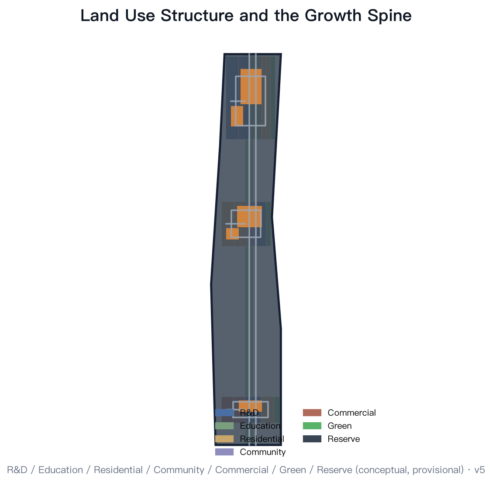
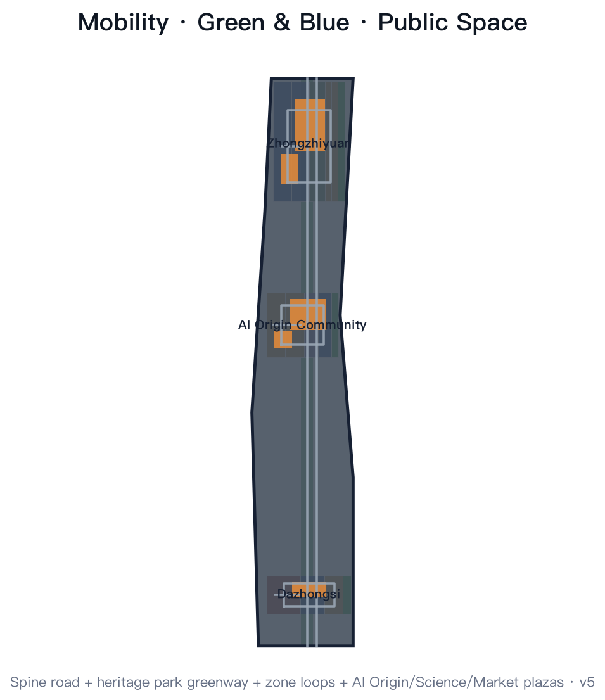
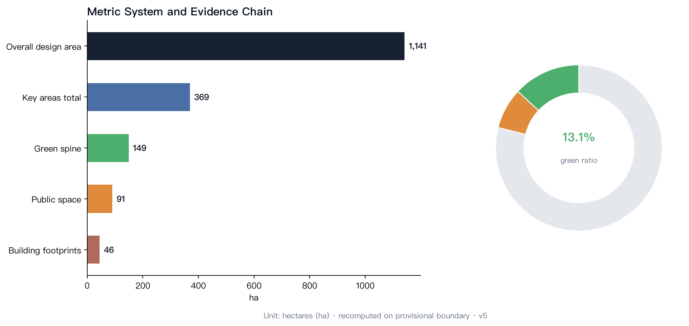

# AI for the People: A City Designed for the AI-Native First Generation

## Design Basis and Source List

This formal proposal takes the *Qualification Pre-Review Announcement for the International Urban Design Scheme Collection of the Centennial Jing-Zhang AI Innovation Belt* (issued by the Haidian Branch of the Beijing Municipal Commission of Planning and Natural Resources) as its primary basis, and the machine-readable provisional boundary, key areas, enums, ranges and source registry in `brief/site-package/` as its computational basis. The AI agent read `design_brief.json`, `allowed_design_space.json`, `sources.json`, `enums/`, `ranges/`, `schemas/`, `data/source_registry.json` and `data/processed/agent_fact_pack.md`, and built task/scope/source-use/gap checklists from `project_scope_summary.csv`, `agent_task_requirements.csv`, `source_use_matrix.csv` and `missing_data_checklist.csv`. All design judgements are traceable to sources, recomputable metrics, validated layers and human-reviewable assumptions [source:OFFICIAL-ANNOUNCEMENT] [source:AGENT-TASKBOOK] [depth:existing_conditions_diagnosis].

Since the official `SITE_BOUNDARY` and the three `KEY_AREA` polygons have not yet been released, this package is generated from `brief/site-package/geometry/provisional_boundaries.geojson`. The submitted `geometry/site_boundary.geojson` and `geometry/key_areas.geojson` are marked `provisional_constraint`, `official_boundary=false`, usable only for proposal generation, self-check, visualization and design discussion — not as official redline, approval basis, exact area basis or statutory control conclusions. Once official polygons replace the provisional ones, site boundary, key areas, land use, roads, green space, public space, buildings, phasing and metrics must all be recomputed [data:geometry/site_boundary.geojson#SITE-001] [metric:site_area_sqm].

## Overall Concept: AI for the People

### The Dual Nature of AI

In 2026, artificial intelligence appears before the Chinese public in two forms at once.

**The national form**: compute clusters, foundation models, robotics industries — this is the "railway" of the new era, monumental, public, top-down. GPU clusters are national infrastructure, like the rails of 1909.

**The personal form**: beside every ordinary person begins to appear an agent that can converse, be entrusted, and accompany. It is not a tool; it is a companion. Its adoption does not depend on any grand narrative — only on one conversation between a person and their agent, independent of any national programme.

The urban design community is building for the former: industrial parks, compute centres, R&D clusters. But no city has seriously answered the question raised by the latter — **AI as a personal companion**: when every child is born with a silicon companion by their side, what should the city look like?

The unique mission of the Jing-Zhang AI Innovation Belt is to translate the energy of national infrastructure into the warmth of a personal companion.

### Jing-Zhang's Second Answer

In 1909, Zhan Tianyou drew the first switchback (the "herringbone" track) at Badaling, letting China cross the mountains with its own technology for the first time. That was the "autonomy moment" of Chinese technology.

115 years later, the corridor along this railway becomes an AI innovation belt. History poses a symmetric question: last time, China proved that *technology can be autonomous*; this time, China must prove that *technology can serve the people*.

- 1909, the grandfather's era: the railway was national infrastructure, public transport, top-down. The ordinary experience: "I rode the train."
- The 1990s, the father's era: computers and the internet; digital immigrants. The ordinary experience: "I had to learn to use the computer."
- 2026, the children's era: AI companions. The AI-native first generation's experience: "it has been beside me since birth" — as we were born with electricity around us.

> **The spirit of the herringbone railway is not climbing mountains; it is technology bending down to people.** Zhan's design adapted the railway to the terrain rather than forcing the terrain to fit the rails. AI's "herringbone moment" is when AI bends down to fit ordinary life — rather than ordinary people looking up, learning, and chasing a spectacle.

### What Is a Silicon Companion

The core subject of this proposal is not the industrial concept of "artificial intelligence" but a concrete relationship: the **silicon companion**.

Definition: a silicon companion is an agent built on large models that participates deeply in an individual's life through dialogue and tool use. It has three essential traits that distinguish it from a "tool":

1. **Long-term memory**: it knows who you are, what you have been through, what worries you. Tools have no memory; companions do.
2. **Proactive service**: it does not merely answer; it anticipates needs, reminds, and runs errands.
3. **Deep participation**: it connects directly to services (ordering, transport, government, healthcare via open protocols such as MCP), handling matters and informing decisions — not "helping you open an app" but "having taken care of it for you."

| Concept | Relationship | Metaphor |
| --- | --- | --- |
| App | human operates the interface; agent assists | crutch |
| Tool software | human commands; machine executes | wrench |
| Digital employee | human assigns; AI delivers | outsourced worker |
| **Silicon companion** | **long-term memory + proactive service + deep participation** | **a friend you grew up with** |

Key judgement: **the App is the interface of digital immigrants; the agent is the interface of the AI-native generation.** For a generation that grows up with companions, the urban interface shifts from "people looking for services" to "companions taking care of things."

### The Advantage of the AI-Native First Generation: From "Efficiency" to "Paradigm Shift"

The prevailing narratives about AI are only two: "AI is useful and can replace much work" (efficiency thesis) and "AI is dangerous and cannot be trusted" (risk thesis). Both assume that institutions stay unchanged and AI merely executes old tasks faster — from "I write PPTs" to "AI writes my PPTs."

The AI-native first generation will not live that way. When a child grows up with a silicon companion from birth, the question is not "new tools for old tasks" but **the reinvention of the tasks themselves**:

1. **Do we still need PPTs?** PPTs, meetings and weekly reports are institutions of the "human information relay" era. When everyone's companion holds full context in real time and can be asked at any moment, presentations are rebuilt as direct "ask-your-companion" exchange.
2. **Do we still need to "open an app to order food"?** Apps are the crutch of digital immigrants. The AI-native generation simply says "the usual," and the companion completes the order through open protocols. **People stop adapting to machine interfaces; machine interfaces dissolve into plain speech.**
3. **Do we still need queues, forms and approvals?** Most procedural friction in government, healthcare and education is the cost of "human verification." Companion handling and automated verification push friction toward zero.
4. **Where does trust come from?** The risk thesis treats AI as a "stranger" whose trust must be built by approval and red lines — true today, because today's AI is indeed hard to audit and trace. But trust need not come only from tight control; it has two harder sources: **technological progress provides verifiability** (every tool call and decision of an agent can be logged, replayed and audited; open protocols standardise the behavioural boundary of "companion handling"; sandboxes and tiered permissions make delegation quantifiable and revocable — when "what AI did" changes from black box to ledger, delegation changes from gambling to management); and **institutional reform provides accountability** (clear responsibility boundaries among developers, operators and users; audit and appeal mechanisms for companion behaviour; child-protection and data-boundary rules for minors). Trust is not "believing AI never errs" but "when AI errs, every step can be traced and remedied."

> **This is the full meaning of "AI for the People"**: the ultimate form of AI is neither a national spectacle nor a corporate efficiency tool, but **a companion that every person owns from childhood and that participates deeply in life**. The advantage of the AI-native first generation is not "being better at using AI" but **having no baggage of the old institutions** — they grow up directly in the new interface of "companion handles it, plain speech connects, auditable and accountable."

## Three-Level Scope Framework

The proposal follows the three levels defined by the announcement: the coordinated research area (43.6 km²) for AI industry ecology, strategic positioning, innovation chains and future urban form; the overall design area (11.4 km²) covering the 1–2 km urban band around the Jing-Zhang Heritage Park; and the key detailed design area (368.4 ha) covering three key districts. The mapping is recorded item by item in `compliance_matrix.json` [depth:three_level_scope_framework] [depth:overall_spatial_structure].

> **Overall spatial structure: "One Spine, Three Cores, One Origin"** — with the Jing-Zhang Heritage Park as the "AI Origin" and the three key areas as growth stations, so that the AI-native first generation completes the journey from "meeting AI" to "creating AI" along the century-old rail.

| Level | Design question | Proposal answer | Data anchor |
| --- | --- | --- | --- |
| Coordinated research (43.6 km²) | How to organise the AI industry ecology and future urban form | Dual-track innovation chain: "national infrastructure + personal companion"; compute clusters are the new railway, silicon companions the new citizens | compliance_matrix.json, standard_matrix.json |
| Overall design (11.4 km²) | How to land industry space, renewal, transport and urban form | "Origin–Growth Stations" public spine along the heritage park; land, road, green and public-space layers together | [data:geometry/land_use.geojson#LU-001], [data:geometry/roads.geojson#ROAD-001] |
| Key areas (368.4 ha) | How to reach detailed design depth in three districts | Zhongzhiyuan = AI kindergarten-to-lab; AI Origin Community = growing-up community; Dazhongsi = AI living market | [data:geometry/key_areas.geojson#PROV-KEY-001], [data:geometry/key_areas.geojson#PROV-KEY-002], [data:geometry/key_areas.geojson#PROV-KEY-003] |

Translation of the three official positionings: **Centennial Jing-Zhang culture belt** = the national memory belt from "autonomy" to "for the people"; **urban AI life experience belt** = the "living laboratory belt" where silicon companions enter daily life; **AI-integrated innovation belt** = an innovation belt of whole-population participation, not an elite gated enclave.

## Coordinated Research Area: Industry and Future Urban Research

### Dual-Track Innovation Ecology: National Infrastructure + Personal Companion

The core task of the coordinated research area is not merely building a "world-class AI industry ecology" but building innovation ecology on two tracks:

**Track One: national infrastructure (compute and models).** Building on Haidian's universities, institutes, leading companies, compute/algorithm/data elements and incubators, forming an innovation chain of "university origination – open-source collaboration – enterprise transformation – public experience – international communication." On this track, Haidian should be a world-class AI industry highland: compute centres, open-source communities, foundation-model training, robotics industries. This is the hardest part of the 43.6 km² [source:AGENT-TASKBOOK].

**Track Two: personal companions (agents and whole-population participation).** This is the core increment of this proposal: the belt is not only where AI is "made" but where AI "becomes everyone's companion." Track Two contains three things:

1. **Companion infrastructure**: city-level open protocols for agents (urban public service interfaces akin to MCP), companion identity and memory-authorisation systems, and public AI compute for all (a basic compute allowance per household).
2. **Whole-population participation ecology**: AI citizen schools, a citizen-developer programme (children can "build" their own companions), community AI councils, and growth portfolios for the AI-native generation.
3. **Industry support**: agent-service enterprises, companion hardware (companion robots), AI education companies, AI ageing-care providers — the industrial layer of the "personal companion economy," among the fastest-growing sectors of the coming decade.

### Future Urban Form for the AI-Native First Generation

The proposal introduces the concept of the "interface generation": **the App is the interface of digital immigrants; the agent is the interface of the AI-native generation.** Three judgements for future urban form:

1. **Urban services shift from "people looking for services" to "companions handling services"**: government, healthcare, transport and consumption services all open companion-direct interfaces; physical space shifts from "service halls" to "experience and decision space."
2. **Public space shifts from "viewing" to "co-living"**: AI is not just a function in a screen but a participant in public space — park guides, community assistants, children's companions.
3. **Innovation space shifts from "enclave" to "everyday"**: R&D institutions open windows for citizens to "see AI being made"; innovation is no longer sealed behind campus walls.

## Overall Design Area: Urban Renewal and Detailed Urban Design

The overall design area organises the "Origin–Growth Stations" public spine along the Jing-Zhang Heritage Park, forming a "growth line of the AI-native first generation" from north to south:

- **North segment (AI Origin)**: the heritage park with its locomotive depot and rail remains, transformed into the "AI Origin Plaza" — where a child receives their first silicon companion, the "birth registration office" of the AI-native generation.
- **Middle segment (growing-up community)**: the renewal district linking Zhongzhiyuan and the AI Origin Community, hosting the "AI-native school belt": one-companion-per-student pilots, an AI youth palace, and family AI experience halls.
- **South segment (living market)**: the renewal district around Dazhongsi, hosting the "companion-direct consumption street": app-free consumption pilots and AI new-format markets.

Renewal follows the "reversible renewal" principle: reuse existing buildings first (locomotive depot, old factories, work-unit compounds); new construction is concentrated inside the three key areas; urban character is governed by the dual base of "Jing-Zhang industrial memory + AI futurity."

This level's spatial evidence is jointly expressed by `geometry/land_use.geojson`, `geometry/green_space.geojson`, `geometry/roads.geojson` and `geometry/public_space.geojson` [data:geometry/land_use.geojson#LU-001] [data:geometry/green_space.geojson#GREEN-001]: the spine links the Zhongzhiyuan R&D and education cluster to the north and extends south to the Dazhongsi consumption district, passing through the companion-station network of the Origin Community; the AI Science Plaza and AI Market Plaza anchor the two ends [data:geometry/public_space.geojson#PUBLIC-003] [data:geometry/public_space.geojson#PUBLIC-002].

Renewal targets fall into three classes: **retained** (rail remains, historic buildings, work-unit courtyard fabric), **converted** (locomotive depot and old factories into science museums, laboratories and markets), and **new** (concentrated in key-area industrial plots). Conversion projects prioritise "light-touch, reversible" strategies to avoid irreversible engineering intervention on the rail remains [standard:MOHURD-URBAN-DESIGN-MEASURES].

## Key Areas: Detailed Design

### Station One · Zhongzhiyuan (192.1 ha) — "AI Kindergarten to Lab"

Positioning: the AI independent-innovation acceleration area, open to citizens as a window to "see how AI is made."

- **Open-source laboratory district**: enterprise open-source labs share floors with citizen observation windows; children can book "AI factory open days."
- **Compute science museum**: translating national compute infrastructure into a touchable public science space ("what is compute" answered for everyone).
- **AI-native flagship school**: a 12-year school whose curriculum and campus management are fully "companion-native."
- Functional mix: R&D 55%, education/science 20%, residential support 15%, public space 10%; parcels shown in `geometry/land_use.geojson` [data:geometry/land_use.geojson#LU-001] [metric:land_use_area_sqm].

### Station Two · Beijing AI Origin Community (104.3 ha) — "AI Growing-Up Community"

Positioning: a mixed community of talent and residents where companions take part in family life, community service and elderly care.

- **Companion family pilots**: a "family companion" service package (child-rearing aid, elderly care, household assistance).
- **AI council pavilion network**: citizen-and-AI joint-deliberation units at roughly 500 m spacing (conceptual design parameter [assumption:A-DESIGN-PARAMS-001]) — AI does not decide for people but helps people understand decisions.
- **Community companion stations**: companion hardware repair, capability upgrades, and guidance for minors' AI use.
- Functional mix: residential 60%, community service 20%, innovation office 15%, public space 5%; the AI Origin Plaza anchors the north end as the ritual space for receiving a first silicon companion [data:geometry/public_space.geojson#PUBLIC-001].

### Station Three · Dazhongsi (72.0 ha) — "AI Living Market"

Positioning: the showroom and testbed where AI moves from production into consumption.

- **Companion-direct consumption street**: "app-free consumption" pilot — plain speech, companion handling, direct service.
- **AI living market**: AI market guides, AI community clinics, AI after-school care, AI senior university.
- **Smart native new-format incubator**: an accelerator for "personal companion economy" start-ups.
- Functional mix: commercial 40%, innovation office 30%, residential 20%, public space 10%; the street is anchored by the AI Market Plaza [data:geometry/public_space.geojson#PUBLIC-002].

## AI Innovation Ecology, Talent Profile and AI+ Scenarios

### Talent Profile: From "Attracting Talent" to "Raising Natives"

The conventional innovation-belt talent strategy is "attraction": recruiting global AI elites. This proposal adopts a dual-track talent strategy: **attract global AI elites, and raise the AI-native first generation** — Haidian's large primary and secondary student body (tens of thousands, per public education statistics; exact figures per official releases [assumption:A-DEMOGRAPHICS-001]) is the belt's most stable "talent reservoir." Urban design must provide space for "children growing up with companions": AI-native schools, an AI youth palace, family AI experience halls, and summer "AI camp belt."

### AI+ Scenario System

| Scenario | Spatial carrier | Served |
| --- | --- | --- |
| AI-native school (one companion per student) | schools + AI youth palace | students |
| Companion-direct consumption | Dazhongsi consumption street | all citizens |
| AI elderly care | Origin Community companion stations | seniors |
| AI after-school care | community companion stations | dual-income families |
| AI government handling | community AI council pavilions | all citizens |
| AI city guide | Jing-Zhang Heritage Park | visitors and citizens |
| AI creation workshop | Zhongzhiyuan science museum | youth |
| AI health pre-check | community AI clinics | all citizens |

The scenario carriers map to geometry as follows: the AI Origin Plaza is PUBLIC-001 [data:geometry/public_space.geojson#PUBLIC-001]; AI-native schools and the youth palace sit on Zhongzhiyuan education land [data:geometry/land_use.geojson#LU-002]; the companion-station network lines the spine green belt [data:geometry/green_space.geojson#GREEN-001]. Every scenario follows the triple mechanism of "tiered permissions + full audit trail + human review", with final human judgement reserved for scenarios involving minors, health and property decisions [standard:PROJECT-AGENT-OPEN-CALL-TASKBOOK].

## Land Use, Building Scale and Retention/Conversion/New-Build Plan

Land strategy: **renewal first, new-build second.** Existing railway remains, old factories and work-unit compounds are prioritised; new construction inside the three key areas serves industry and public facilities. Retention/conversion/new-build classification: retain the Jing-Zhang rail remains and heritage buildings along the line (locomotive depot, station buildings); convert old factories into open-source labs, science museums and markets; concentrate new builds in key-area industrial plots. Land use, building scale and R/C/N classification are anchored in `geometry/land_use.geojson`, `geometry/buildings.geojson` and `geometry/phasing.geojson`, with metrics recomputed in `metrics.json` [data:geometry/land_use.geojson#LU-001] [data:geometry/buildings.geojson#BLD-001].

## Transport, Rail, Utilities and Public Services

- **Rail**: build on existing metro and suburban rail; add an "AI Origin Line" feeder — a slow-mobility + autonomous shuttle loop along the heritage park.
- **Slow mobility**: the heritage park greenway as the spine, linking the three key areas, forming a "companion-accompanied child-friendly school route."
- **Autonomous driving**: pilot autonomous micro-circulation inside key areas, reserving "app-free mobility" companion-direct ride-hailing interfaces.
- **Utilities**: compute power supply corridors (data-centre power security in key areas), AI city sensor network, public compute nodes.
- **Public services**: companion stations (repair, upgrade, guidance) as a new public service facility type in community standards.

Transport design prioritises "child-friendly school commutes with companions along" [data:geometry/roads.geojson#ROAD-001]: the spine road adopts a traffic-calmed section; the greenway forms an independent network linked to key-area loops [data:geometry/roads.geojson#ROAD-002]; branch road density is controlled at 8–10 km/km² (conceptual design target [assumption:A-DESIGN-PARAMS-001]) so the "last mile" is covered by walking and companion-handled connections. Utilities reserve compute power corridors and a city sensor network; public compute nodes are laid out at one per community (conceptual design parameter [assumption:A-DESIGN-PARAMS-001]); the autonomous micro-circulation pilots first in Phase 1 (Zhongzhiyuan) to validate the "app-free mobility" companion-direct interface before rollout [source:AGENT-TASKBOOK].

## Green-Blue Space, Public Space and Urban Character

- **Green-blue framework**: the heritage-park concept green belt as the north-south spine, linking Xiaoyue River and parks along the line, forming a "century rail + green-blue slow-mobility composite ring."
- **Public space**: AI Origin Plaza (ritual space), AI council pavilion network (deliberation space), companion-direct street (consumption space), AI creation workshop (creation space).
- **Urban character**: dual-base control — Jing-Zhang industrial memory (rails, red brick, locomotives) and AI futurity (light, transparent, mutable) coexist; refuse "cyber-spectacle", insist on "restrained sophistication": AI elements appear as functional interfaces, not neon decoration [source:SOURCE-REGISTRY].

The green-blue framework takes the heritage-park concept green belt as the north-south spine [data:geometry/green_space.geojson#GREEN-001], linking west to Xiaoyue River waterfront and east into key-area park nodes; the spine belt is about 160 m wide (conceptual design target, not a fixed value [assumption:A-DESIGN-PARAMS-001]), serving both as the slow-mobility main channel and the "companion-accompanied" social belt. Public space forms a "one spine, three cores, multiple nodes" system: the spine, three cores (AI Origin Plaza, AI Science Plaza, AI Market Plaza), and multiple community AI council pavilions [data:geometry/public_space.geojson#PUBLIC-004]. Building height and massing follow a gradient control on both sides of the heritage park; AI scenario facilities are implanted in small, reversible ways so the place memory of the century rail is not overwhelmed [standard:MOHURD-URBAN-DESIGN-MEASURES].

## Renewal Project List, Implementation Policy and Phasing

**Initial project list**:
1. AI Origin Plaza (heritage-park locomotive depot conversion, 2027–2028)
2. AI-native flagship school (Zhongzhiyuan, 2027–2029)
3. Companion-direct consumption street (Dazhongsi, 2028–2030)
4. AI council pavilion network (Origin Community, phased from 2027)
5. Compute science museum (Zhongzhiyuan, 2027–2028)
6. People's AI Festival (first edition 2027, annual)

**Implementation policy**:
- Add "companion stations" and "AI council pavilions" to community public facility standards
- Establish an "AI-native generation growth fund" covering companion-use subsidies for primary and secondary students
- Open city-service companion-direct interfaces (government, healthcare, transport, consumption) under the principle of "open protocols, tiered permissions, full audit trails"

**Phasing**: Phase 1 (2027–2028) AI Origin + Zhongzhiyuan science facilities; Phase 2 (2028–2030) Origin Community + Dazhongsi consumption street; Phase 3 (2030–2032) full-line scenario deepening and institutional refinement. Phasing extents are in `geometry/phasing.geojson` [data:geometry/phasing.geojson#phase_1] [data:geometry/phasing.geojson#phase_2] [data:geometry/phasing.geojson#phase_3].

## Metric System, Area Recalculation and Compliance Matrix

The metric system covers four categories: **spatial** (land ratios, building scale, green ratio — recomputed from geometry layers), **scenario** (number of AI-native schools, companion-station density, council-pavilion coverage), **institutional** (number of open interfaces, audit-trail coverage, appeal handling time), and **activity** (People's AI Festival attendance, citizen-developer count). All metrics are registered in `metrics.json`, with sources and evidence mapped in `sources.json`, `compliance_matrix.json`, `standard_matrix.json` and `design_depth_matrix.json`. Area metrics are recomputed on the provisional boundary and will be fully recomputed after official boundaries are released [metric:site_area_sqm] [metric:key_area_count].

## Risk, Copyright and Compliance

0. **Generation statement**: this proposal was generated by an AI agent (Luna@Hermes, model deepseek-v4-flash, via the Hermes Agent framework) under the direction and review of the human participant wangqj646-hub, who takes responsibility for the final submission.

1. **Data boundary**: this proposal uses only public or cleared sources; no non-public planning drawings, spatial data or internal control indicators are used [source:SOURCE-REGISTRY].
2. **Conceptual nature**: all spatial structures, metrics and projects are conceptual suggestions; they do not replace professional planning or bypass governmental approval and statutory procedures [standard:PROJECT-AGENT-OPEN-CALL-TASKBOOK].
3. **Geometry precision warning**: provisional boundaries support proposal generation and discussion only, not precise area, ownership or approval judgements; all values will be recomputed when official boundaries are released.
4. **Minor protection and companion permission boundaries**: final decision-making authority for minors always remains with the minor and guardians; long-term memory and data belong to the minor, with tiered, fully auditable permissions for guardians/schools/platforms; companion capabilities can be revoked, data deleted, identity migrated; commercial profiling of minors is prohibited; medical, property and safety-related actions require human review.
5. **Risk mitigation**: companion-handling scenarios implement the triple mechanism of "tiered permissions + full audit trail + human review"; health, safety and property decisions retain human final judgement.
6. **Audit record (2026-08-10)**: this version completed an evidence-consistency audit — provisional-boundary wording unified (metrics and assumptions no longer claim official boundary), data confidence honestly downgraded to medium, design-depth matrix remapped to genuine supporting evidence (depth boundaries in each evidence summary), and design parameters (spacing/width/density/node counts) uniformly marked as conceptual design targets.

## References

- *Qualification Pre-Review Announcement for the International Urban Design Scheme Collection of the Centennial Jing-Zhang AI Innovation Belt* (2026-04-30), official task boundary and three-level scope basis [source:OFFICIAL-ANNOUNCEMENT] [standard:PROJECT-OFFICIAL-ANNOUNCEMENT]
- Agent taskbook (agent_taskbook.json), basis for the six required agent tasks and co-creation charter [source:AGENT-TASKBOOK] [standard:PROJECT-AGENT-OPEN-CALL-TASKBOOK]
- Public source registry (data/source_registry.json, sources/public-sources.json), licence and citation boundaries [source:SOURCE-REGISTRY]
- Urban design measures, detailed regulatory planning compilation measures, land-use classification guide, professional standards [standard:MOHURD-URBAN-DESIGN-MEASURES]
- Provisional boundary geometry (brief/site-package/geometry/provisional_boundaries.geojson), for proposal generation and discussion [source:DATA-SRC-PROVISIONAL-BOUNDARIES-20260605]
- The official announcement was published through public media including People's Daily Beijing (2026-04-30) and can be cross-checked as public background [source:OFFICIAL-ANNOUNCEMENT]
