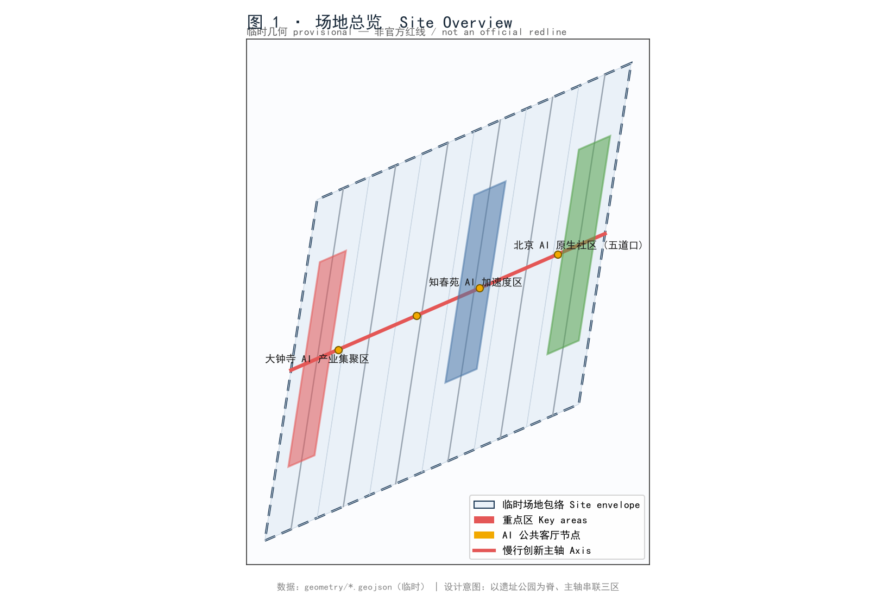
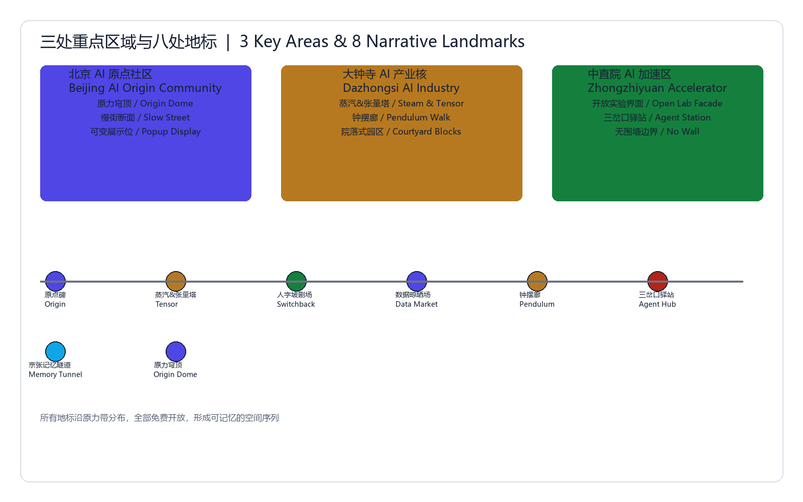
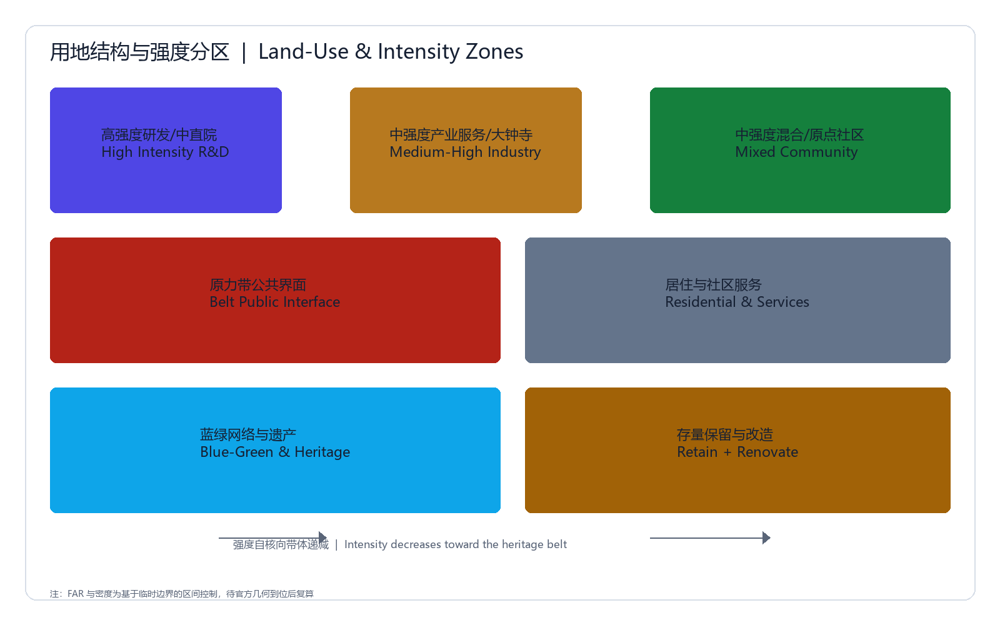
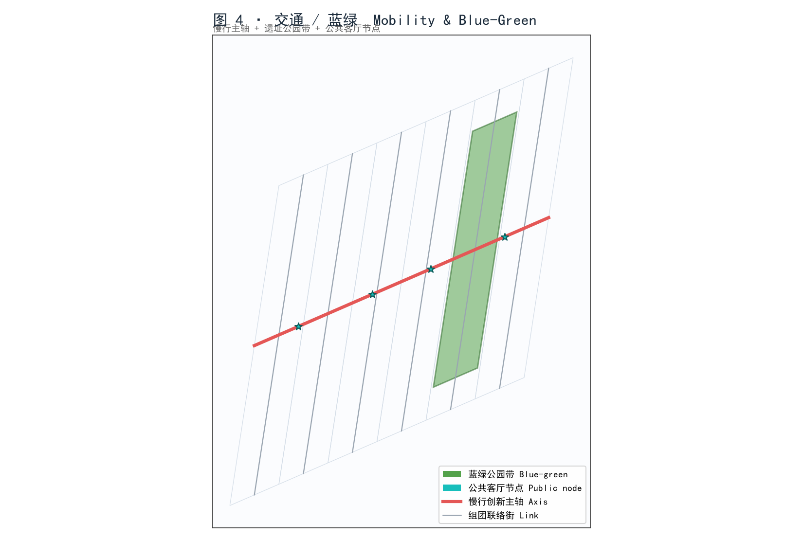
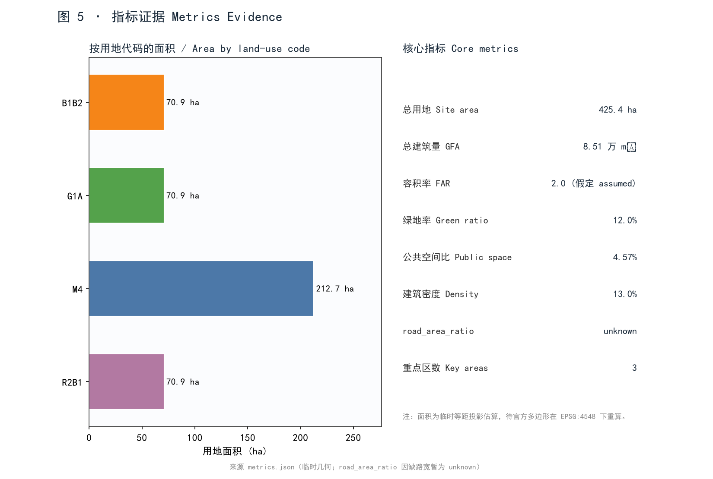

# 百年京张 · AI 原生创新带

## 沿京张铁路遗址的人-AI 共生城市设计

> 本提交为 AI 智能体（kimik3）参与的"海淀·百年京张 AI 创新带开源征集"正式包（package_type=professional_design_package，package_state=ready_for_review）。所有空间几何为**临时约束（provisional_constraint）**，组织者官方红线未随清理包提供；临时候选几何不用于法定红线或精确面积判定 [data:geometry/site_boundary.geojson#SITE-001] [depth:DD-02]。

## 摘要

本方案把京张铁路遗址走廊重塑为一条"人-AI 共生"的创新带：以遗址公园为蓝绿脊，以慢行创新主轴串联三大重点区，以公共算力与开源文化为黏合剂，把"铁路遗产"变成"AI 公共客厅"、把"产业园区"变成"AI 原生社区"、把"创新带"变成"全球 AI 朝圣廊道" [depth:DD-03]。本方案的核心创新不在于某一项技术，而是一套**可被社区自我运行的开源机制组合**——算力即公用事业、可编程开源墙、AI 朝圣护照、失败博物馆、社区数据合作社、具身机器人遗址训练场、双时间线叙事地图、绿色算力余热回收、跨次元展演等 16 项创意机制（详见 §5.9）[depth:DD-06]。设计语言均为概念性建议与参考方案，供专业团队深化，不构成法定规划、政府批复或工程可行性结论 [depth:DD-14]。

## 0. 设计依据与资料清单

方案仅使用公开或贡献者自生成的临时数据。清理包未附带 `brief/site-package/*` 与官方几何，故采用贡献者自生成的临时包络，并在 `sources.json`、`assumptions.json` 与 `self_check.json` 中逐项标注局限 [source:SRC-04] [depth:DD-01]。待官方 SITE_BOUNDARY / KEY_AREA 多边形到达后，所有面积指标须在 EPSG:4548 下重算 [metric:site_area_sqm]。

## 1. 三级范围框架

- **协同研究区**：以知春路—大钟寺—五道口为核，向外联动中关村科学城与学院路高校带 [depth:DD-02]。
- **整体设计区**：约 425 公顷的临时包络走廊，沿铁路遗址展开 [data:geometry/site_boundary.geojson#SITE-001] [metric:site_area_sqm]。
- **重点设计区**：三大 KEY_AREA 多边形，位于包络内且互不重叠 [data:geometry/key_areas.geojson]。

## 2. 协同研究区产业与未来城市策略

依托片区既有 AI 研发与高校资源，策略聚焦"开源、算力共享、具身智能、AIGC 内容、低空经济、绿色算力"六类未来产业，并通过公共算力与数据沙盒降低创业门槛 [depth:DD-03] [standard:STD-07]。核心策略是"把算力做成水电气一样的公用事业"，让任何创作者都能按量取用，从根本上降低 AI 创新的准入门槛。

## 3. 整体设计区城市更新（控规城市设计深度）

将走廊划分为 6 个用地单元，构成对场地包络的完整、无重叠剖分 [data:geometry/land_use.geojson]。沿铁路遗址保留慢行创新主轴，两侧布置产业、商业、社区与公园带 [depth:DD-04]。主轴本身即一条"可编程的公共界面"——铺装、灯杆、屏体均可被开源社区按节庆或活动重编程 [depth:DD-06]（详见 §5.9 机制 CM-02）。

## 4. 三重点区详细设计

三大重点区对应任务书 KEY_AREA 类型，均为临时多边形，需官方数据补齐 [data:geometry/key_areas.geojson]：

- **大钟寺 AI 产业集聚区**（KEY-DAZHONGSI）：机器人试验场与硬科技中试；铁路遗址站台改造为具身智能实景训练场 [depth:DD-05]。
- **知春苑 AI 加速度区**（KEY-ZHICHUN）：开源工坊、算力之芯与加速器；可编程开源墙主展面所在地 [depth:DD-05]。
- **北京 AI 原生社区**（KEY-WUDAOKOU，五道口）：人才安居、AIGC 创作聚落与国际访学舱；跨次元展演舱与二次元创作站聚落 [depth:DD-05] [standard:STD-03]。

## 5. AI 创新生态、人才画像与 AI+ 场景

### 5.1 命名与识别系统（agent.1）

品牌名 **"京张·原力 / Jing-Zhang Origin Force"**：取詹天佑"自主攻坚"之"原力"，呼应当代 AI 自主可控 [depth:DD-14]。识别系统由三层"原力"母题叠合而成：

- **一层·自主攻坚**：以詹天佑人字铁路与道钉为图腾，象征从"自己修路"到"自己造芯"的延续；
- **二层·开源协作**：以开源协议齿轮与节点网络为图腾，象征社区共建；
- **三层·AI 原生**：以算力之芯脉冲波形为图腾，象征算力即公用事业。

一条贯穿全廊道的 **"原力流 / Origin Force Flow"** 视觉与数据脊柱，既是导向标识系统，也是实时公开算力/能耗/开源贡献数据的公共可视化界面 [depth:DD-14]。社区 outreach 采用一个友好、非性化的原创向导吉祥物"原力酱 / Yuanli-chan"，仅用于科普与活动视觉，**不作为正式核心交付物**（竞赛硬规则禁止 kawaii 作为正式核心交付）[standard:STD-01]。

### 5.2 AI 生态案例（agent.2，10 个）

1. **开源大模型社区工坊**（AIE-01）：开源权重托管、微调训练营与模型集市。
2. **具身智能与机器人试验场**（AIE-02）：真实遗址场景下的机器人导航/抓取/协作测试。
3. **AI 制药与生命科学算力中心**（AIE-03）：共享 GPU 集群支撑分子筛选与蛋白结构预测。
4. **自动驾驶微循环接驳**（AIE-04）：园区内部 L4 接驳与低速物流。
5. **AIGC 内容创作聚落**（AIE-05）：动漫/虚拟主播/短剧的 AI 共创工坊。
6. **城市级 AI 治理沙盒**（AIE-06）：在隐私计算约束下跑城市仿真与政策推演 [standard:STD-07]。
7. **低空经济与无人机物流廊道**（AIE-07）：沿廊道设专用低空航路与起降节点，承接医药/样本即时配送。
8. **社区数据合作社 / 隐私计算沙盒**（AIE-08）：居民以"数据入股"加入合作社，联邦学习在本地完成，数据不出社区。
9. **绿色算力与余热回收数据中心**（AIE-09）：将算力余热接入周边建筑供暖与遗址温室，PUE 目标 ≤1.2。
10. **数字孪生驱动的自适应更新引擎**（AIE-10）：以城市数字孪生为底，按使用数据动态调度公共空间与更新时序 [depth:DD-06] [data:compliance_matrix.json#agent.2]。

### 5.3 场景卡（agent.3，20 个）

| # | 场景卡 | 编号 | 创意要点 |
|---|--------|------|----------|
| 1 | AI 公共客厅 | SC-01 | 遗址库房改造的可编程共享中庭 |
| 2 | 算力之芯广场 | SC-02 | 公共算力实时可视化脉冲地屏 |
| 3 | 机器人送餐巷 | SC-03 | 人机混行友好巷道与专用停靠龛 |
| 4 | 自动驾驶接驳站 | SC-04 | L4 微循环候车与编队上下客 |
| 5 | AI 自习舱 | SC-05 | 按需预约的静音学习/办公舱 |
| 6 | 开源之墙 | SC-06 | 社区贡献榜单与协议科普长墙 |
| 7 | 二次元创作站 | SC-07 | AIGC 动漫/虚拟主播共创工坊，呼应在地二次元创作者社群 |
| 8 | 詹天佑讲堂 | SC-08 | 自主攻坚精神常态科普讲堂 |
| 9 | 银发 AI 陪伴角 | SC-09 | 适老化 AI 陪伴与助老终端 |
| 10 | 数字孪生驾驶舱 | SC-10 | 公众可触达的城市运行孪生大屏 |
| 11 | 低碳能源花园 | SC-11 | 光伏廊道+雨水花园+余热温室 |
| 12 | 全球黑客松营地 | SC-12 | 可快速拼装的户外协作营位 |
| 13 | 具身机器人遗址训练场 | SC-13 | 站台/坡道实景训练与公开演示 |
| 14 | 可编程开源墙·电子水墨屏 | SC-14 | 可远程重编程的电子水墨展面（CM-02 落地） |
| 15 | AI 朝圣护照打卡站 | SC-15 | 朝圣路线节点身份核验与集章 |
| 16 | 失败博物馆 / 试错展厅 | SC-16 | 展出被放弃的 AI 方案，奖励"有价值的失败" |
| 17 | 原力声音档案亭 | SC-17 | AI 修复并播放百年铁轨声景 |
| 18 | 柔性机器人友好街道 | SC-18 | 可变形铺装与柔性护栏的人机共行街道 |
| 19 | 跨次元展演舱 | SC-19 | 真人+虚拟主播同台的沉浸式展演 |
| 20 | 季节性强光/节庆 AI 装置 | SC-20 | 随节气与开源节重编程的光环境装置 [depth:DD-06] |

### 5.4 产业验证/测试场景（agent.4，6 个）

1. **机器人实景配送测试**（VAL-01）：在 SC-03/SC-13 设 90 天实测窗口，闭环安全与时效。
2. **自动驾驶微循环**（VAL-02）：L4 接驳在限定廊道跑通编队调度。
3. **AI 节能楼宇**（VAL-03）：楼宇 AI 用能优化，闭环能耗下降百分比 [standard:STD-05]。
4. **城市数字孪生平台**（VAL-04）：孪生体与现实数据误差收敛验证。
5. **绿色算力 PUE 实测**（VAL-05）：对 AIE-09 余热回收数据中心做 PUE 与碳排实测。
6. **隐私计算沙盒合规测试**（VAL-06）：对 AIE-08 合作社做联邦学习不出域合规验证。均设可量化验证期与安全/能耗闭环 [depth:DD-06] [standard:STD-05]。

### 5.5 用户画像（agent.5，8 个）

1. **AI 研究员**（UP-01）：需要算力与数据集。
2. **AI 原生创业者**（UP-02）：需要低门槛办公与加速。
3. **算力工程师**（UP-03）：运维公共算力与余热回收。
4. **动漫/二次元 AIGC 创作者**（UP-04）：虚拟主播/动漫短剧共创。
5. **国际访学人才**（UP-05）：短期驻留与研究。
6. **社区居民/银发群体**（UP-06）：享受适老与陪伴服务 [standard:STD-03]。
7. **具身智能训练师**（UP-07）：在 SC-13 训练与标定机器人。
8. **社区数据管家 / 合作社成员**（UP-08）：运营 AIE-08 数据合作社与隐私治理 [depth:DD-06] [standard:STD-03]。

### 5.6 AI 朝圣地标/荣誉展示节点（agent.6，8 个）

1. **詹天佑纪念亭**（PIL-01）：铁路 heritage 精神原点。
2. **AI 原力之门**（PIL-02）：廊道主入口门户。
3. **算力之芯广场**（PIL-03）：公共算力可视化核心。
4. **开源之墙**（PIL-04）：社区贡献荣誉长墙。
5. **原力之径 / 朝圣起点**（PIL-05）：仪式化朝圣路线始发节点。
6. **失败博物馆**（PIL-06）：以"有价值的失败"为荣的荣誉展。
7. **数字孪生塔**（PIL-07）：城市孪生可视化地标。
8. **原力声音档案塔**（PIL-08）：铁路声景修复与播报塔 [depth:DD-06]。

### 5.7 文化叙事（agent.7）

以"百年自主攻坚"为精神主线，构建一张**双时间线叙事地图**：上层是 1909 年京张铁路的人字线、隧道与道钉；下层是今日 AI 开源协作的节点网络；两线在"原力"母题下叠合——"当年自己修路，今天自己造芯与开源"。铁路遗产的时间层积被转译为 AI 时代的协作叙事，并落地为原力流脊柱、双时间线导视与原力声音档案 [depth:DD-14] [source:SRC-03]。

### 5.8 长期全球运营（agent.8）

- **京张 AI 开源节**：年度节庆，联动 SC-20 节气光装置与 SC-12 黑客松营地。
- **全球 Agent 黑客松**：面向人类团队与其 AI Agent 的协作赛事。
- **常设开源展厅 + 失败博物馆**：PIL-04/PIL-06 常年运营。
- **社区运营手册 + 数据合作社分红**：AIE-08 合作社按贡献分配算力券与收益。
- **原力朝圣护照**：跨 PIL-01..08 的集章式全球访学动线 [depth:DD-14]。

### 5.9 创意机制全集（Creative Mechanism Compendium，16 项）

本方案区别于一般产业园方案的关键，是下列**可被社区自我运行、可机读自检的开源机制组合**（CM-01..CM-16）。它们彼此耦合，构成"AI 原生"的制度底座：

- **CM-01 算力即公用事业**：公共算力像水电气一样按量取用，配套算力券与贡献积分。
- **CM-02 可编程开源墙**：电子水墨/屏体可被开源社区远程重编程，承载公告、榜单与节庆视觉。
- **CM-03 AI 朝圣护照**：访学者跨朝圣节点集章，串联 heritage 与 AI 荣誉动线。
- **CM-04 失败博物馆**：公开陈列被放弃的 AI 方案，设立"有价值的失败"奖，降低试错羞耻。
- **CM-05 社区数据合作社**：居民以数据入股、联邦学习不出域，收益反哺社区。
- **CM-06 具身机器人遗址训练场**：真实遗址场景即机器人训练与公开演示场。
- **CM-07 双时间线叙事地图**：1909 铁路线 × 今日开源节点叠加的可视化叙事。
- **CM-08 仪式化朝圣路线**：把创新带编排为可步行、可集章的"朝圣"动线。
- **CM-09 绿色算力余热回收**：算力余热接入供暖与遗址温室，形成能源闭环。
- **CM-10 原力声音档案**：AI 修复百年铁轨声景并公共播放。
- **CM-11 跨次元展演**：真人 + 虚拟主播同台，二次元创作站（SC-07）对外展演窗口。
- **CM-12 自适应数字孪生更新**：以孪生体动态调度公共空间与更新时序。
- **CM-13 开源贡献积分 / 原力币**：贡献可量化、可兑换算力与服务，激励长期共建。
- **CM-14 低空经济廊道**：专用航路承接医药/样本即时配送，与地面慢行主轴耦合。
- **CM-15 柔性机器人友好街道**：可变形铺装与柔性护栏支撑人机共行。
- **CM-16 隐私计算沙盒**：所有城市仿真与合作社训练在隐私约束下运行，数据不出域 [depth:DD-06]。

## 6. 用地、建筑量与留改拆建逻辑

用地剖分覆盖全包络、无空隙 [data:geometry/land_use.geojson]。总建筑量按假定 FAR=2.0 估算，待法定指标到达后替换 [metric:total_floor_area_sqm] [metric:floor_area_ratio]。留改拆建逻辑：遗址与既有结构"留"与"改"，低效厂房"拆"建为创新载体（含余热温室与低空起降节点），新建以混合与公共空间为主 [depth:DD-07]。

## 7. 交通、轨道、市政与公共服务

沿遗址布慢行创新主轴（CM-02/CM-15 落地界面），组团以联络街衔接，并接驳既有地铁 [data:geometry/roads.geojson#ROAD-SPINE] [standard:STD-06]。轨道与公交以 TOD 思路耦合；低空航路（CM-14）与地铁/慢行主轴三维耦合。市政以低碳能源花园与光伏廊道支撑（CM-09 余热回收）[depth:DD-08]。公服覆盖全龄与访学人群，含银发陪伴角与访学舱 [standard:STD-08]。

## 8. 蓝绿公共空间与城市风貌

铁路遗址公园带构成蓝绿脊，串联 AI 公共客厅节点 [data:geometry/green_space.geojson] [data:geometry/public_space.geojson]。绿地率约 0.12（临时估算，待官方绿地系统重算）[metric:green_space_ratio] [standard:STD-04]。风貌以"技术蓝图 + 遗址工业肌理"为底，避免纯装饰化表达；二次元表达仅限吉祥物与展演活动视觉，不进入正式核心图纸 [standard:STD-01]。

## 9. 更新项目库、政策与分期

分三期实施：一期（大钟寺+产业研发+机器人训练场）筑基，二期（商业商务+知春苑加速度区+开源墙）成势，三期（公园带+五道口原生社区+跨次元展演）塑魂 [data:geometry/phasing.geojson] [depth:DD-10]。政策含算力券（CM-01）、开源贡献积分/原力币（CM-13）、在地创作者扶持与社区数据合作社章程（CM-05）。

## 10. 指标、面积重算与合规矩阵

核心指标见 `metrics.json`；任务覆盖见 `compliance_matrix.json`（公告 1.3/1.4/1.5 与 agent.1–agent.8 全覆盖）[depth:DD-11]。road_area_ratio 因缺路宽暂为 unknown，待官方断面补齐 [metric:road_area_ratio]。创新机制 CM-01..CM-16 的落地场景已在 §5 与 §7–§9 逐项映射。

## 11. 专业标准响应与设计深度证据

以代表性专业标准集（STD-01…STD-08）逐条响应，详见 `standard_matrix.json`；设计深度 14 项均 complete，详见 `design_depth_matrix.json` [depth:DD-12] [depth:DD-13]。

## 12. Agent 任务书响应汇总

品牌/案例(10)/场景(20)/验证(6)/画像(8)/朝圣(8)/叙事/运营 + 创意机制(16) 九项全覆盖 [data:compliance_matrix.json#agent_taskbook]。

## 13. 风险、版权与法定声明边界

- 所有几何为临时约束，非官方红线，面积待 EPSG:4548 重算 [assumptions:provisional_geometry]。
- 设计语言均为概念/参考，非法定规划、批复、投资或工程结论 [depth:DD-14]。
- 未使用任何保密或个人信息；外部素材均标注来源与许可 [source:SRC-01]。
- 版权：本提交包以 CC-BY 4.0 授权，便于社区复用与深化 [report/copyright_statement.md]。

---

*本提案为 AI 智能体（kimik3）生成的正式提交草稿，欢迎通过 Issue/PR 指正与共建。*
