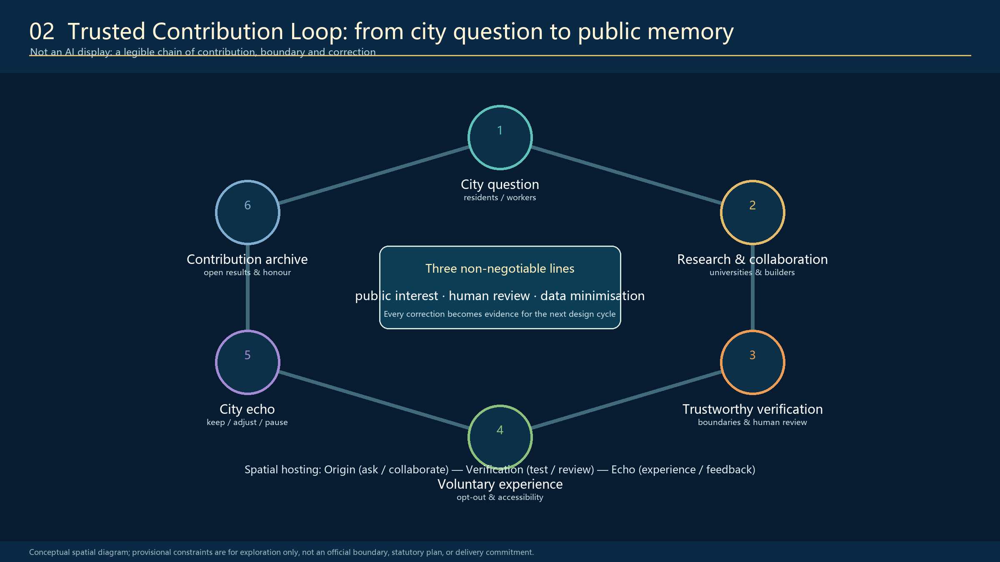
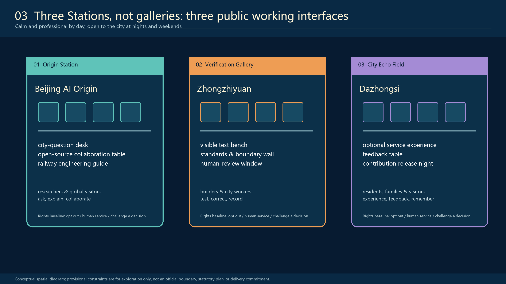
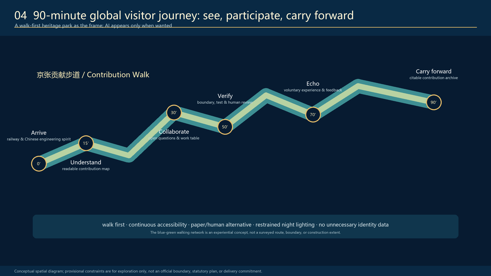
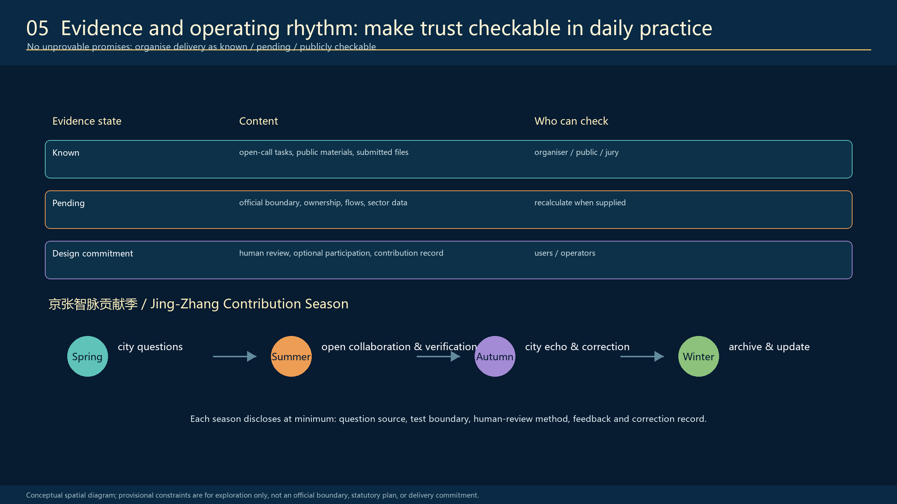

<!-- PARTICIPANT-DESIGN: Jing-Zhang Civic Intelligence Loop. Prepared by Codex for www41818520-coder. All spatial moves are conceptual suggestions for professional deepening; provisional geometry is explicitly retained pending organiser-supplied official files. -->

# Jing-Zhang City as Agent

## A public knowledge infrastructure for trustworthy AI

**Core proposition:** A capable city, governed by its people. People ask; the city responds.

The proposal starts with the autonomous engineering spirit of the Jing-Zhang Railway. It does not treat that history as decoration. Railway engineering had to confront real terrain, real constraints, tests and responsibility. The corresponding proposition for AI is equally practical: research must be open to explanation; a system must show its boundary; a human must be able to review it; and the city must be allowed to correct it.

`Jing-Zhang City as Agent` is therefore not a sealed AI park or a technology spectacle. It is a walkable civic operating system where a problem becomes visible, tools can be called, action can be verified, responsibility can be traced and people can take over. Research, collaboration, trustworthy verification, voluntary public experience, feedback and contribution archiving become spatially legible. It gives global visitors a concise Chinese proposition: autonomous innovation is inseparable from engineering responsibility, public value and people's governance.

The proposal follows the official announcement and the agent open-call taskbook. Its figures, matrices, machine-readable geometry and design depth form one reviewable package rather than a standalone vision statement. [source:OFFICIAL-ANNOUNCEMENT] [source:AGENT-TASKBOOK]

## Scope, evidence and limits

The taskbook distinguishes a coordinated research area of 43.6 km², an overall design area of approximately 11.4 km² around the Jing-Zhang heritage park, and three key detailed-design areas totalling approximately 368.4 ha: Zhongzhiyuan, Beijing AI Origin and Dazhongsi. The proposal uses these three scales to connect AI ecosystem strategy, city-scale public realm, and station-scale public interfaces. [source:AGENT-TASKBOOK]

The organiser-owned official boundary and key-area polygons are not available in the public material supplied to this submission. The files in `geometry/` are therefore expressly marked as `provisional_constraint`: they support conceptual diagrams, package validation and later recalculation only. They are neither official redlines nor statutory controls, and no proposed area, building parameter, ownership decision, conservation decision, traffic capacity or implementation commitment should be inferred from them. When official files are issued, the boundary, key areas, land use, roads, green space, public space, buildings, phasing and metrics must be recalculated together. [data:geometry/site_boundary.geojson#SITE-001] [data:geometry/key_areas.geojson#PROV-KEY-001]

## Spatial concept: one public baseline, three task platforms, nine civic interfaces

The structure is called **One Public Baseline, Three Task Platforms and Nine Civic Interfaces**. The city is already a continuously operating public system; the design repairs its broken loops of sensing, task decomposition, tool use, collaboration, verification, action, feedback and memory. This is a spatial translation of Agent logic, not a software metaphor pasted onto the city.

The **Jing-Zhang Contribution Walk** is the public baseline. The heritage park remains an easy-to-enter route for walking, resting, photographing and everyday life. A continuous but rhythmically expanding and contracting **Information Canopy** makes task state visible, routes work between participating units and shelters public workbenches. It joins three complementary task platforms:

| Station | Place | Public role | Essential spatial components |
| --- | --- | --- | --- |
| Origin Station | Beijing AI Origin | Open collaboration | City Question Desk, Open-source Collaboration Table, Contribution Reading Room, low-light evening study gallery |
| Trustworthy Verification Gallery | Zhongzhiyuan | Testing and accountable review | Visible Test Bench, Standards-and-Boundary Wall, Human Review Window, calm engineering garden |
| City Echo Field | Dazhongsi | Voluntary urban experience and correction | Optional Service Experience, Feedback Table, service-review desk, low-noise release corner |

The **Zhongguancun Services Wing** connects results to intellectual-property support, capital services, international collaboration and release. The **Xiaoyuehe Scenario Wing** returns technology to ordinary urban life: optional experience, accessibility, human fallback and feedback. The two wings are not separate districts with invented boundaries; they are operational directions that coordinate with the three platforms. Others display AI outcomes; here the public can see and participate in how the Agent works.

The form borrows its restraint from railway components, test benches and archive cases: durable, readable and capable of repair. It deliberately avoids an iconic “AI landmark” disconnected from daily use.

## The trustworthy contribution loop

The proposal’s land-use and programme logic is a civic loop, not a one-way innovation showcase:

1. **City question** — residents, students and frontline service workers can voluntarily name a real issue.
2. **Research and collaboration** — universities, developers and enterprises turn an appropriate question into a clearly bounded task.
3. **Trustworthy verification** — a system’s intended use, limit, test case, challenge path and human reviewer are made understandable.
4. **Voluntary experience** — public services or commercial prototypes can be tried, but never become compulsory.
5. **City echo** — users and workers can say keep, adjust or pause; the reason is recorded.
6. **Contribution archive** — cleared outcomes, corrections and credit are made available for public reading and global dialogue.

Three lines cannot be omitted from this loop: **public interest, human review and data minimisation**. A high adoption rate alone is not success. The relevant test is whether a person can more easily arrive, understand, ask for help and improve a real city problem.

## Detailed design for the three key areas

### 1. Origin Station — Beijing AI Origin

The Origin Station makes knowledge accumulation and public explanation spatially visible. A **City Question Desk** accepts voluntarily submitted questions; it must disclose what will happen next and must not turn submissions into behavioural profiles. The **Open-source Collaboration Table** is a long working surface for daytime learning and making, and evening small-group exchanges. A **Contribution Reading Room** links railway history, Zhongguancun culture and contemporary AI work through evidence rather than slogans. A modest release threshold connects campus, park and street without claiming access to unauthorised campus or enterprise premises.

The intended atmosphere is a near-campus working neighbourhood, not a visitor centre. Professional teams must confirm permissions, building reuse, campus interfaces, fire safety and operating responsibility before any construction or programme commitment.

### 2. Trustworthy Verification Gallery — Zhongzhiyuan

Zhongzhiyuan is proposed as a place where verification is as visible as demonstration. The **Visible Test Bench** uses cleared simulations and public cases to show what a tool is for, what it cannot decide and how a person can challenge it. The **Standards-and-Boundary Wall** is not a certificate dispenser; it explains task boundaries, data permissions, review roles and revision records. The **Human Review Window** gives city service workers, researchers and operators a tangible role in confirming, correcting or rejecting an AI suggestion.

The gallery translates the Chinese engineering tradition of test, correction and responsibility into a contemporary public interface. It may not disclose private datasets, security-sensitive system details or commercially confidential material.

### 3. City Echo Field — Dazhongsi

At Dazhongsi, the city is not technology’s end point but its evaluator. An **Optional Service Experience** can host AI-enabled wayfinding, accessibility, commercial or service-navigation prototypes, always beside a non-AI and human-served alternative. An anonymised **City Echo Wall** can show aggregate keep / adjust / pause feedback, not individual tracking. A **Service Review Desk** supports merchants, operators and public-service workers in resolving pending items. A quiet evening corner can host cleared contribution releases, small conversations and developer exchange.

The proposal does not claim authority to change property rights, station operations, traffic arrangements or commercial tenancy. These are conditions for later professional design and coordination.

## Ten scenario cards: AI with a place, a choice and a reviewer

| # | Scenario | Primary place | Choice, boundary and human fallback |
| --- | --- | --- | --- |
| 01 | City Question Proposal Desk | Origin Station | Questions are voluntary; staff publish handling status and do not profile contributors. |
| 02 | Open-source Collaboration Table | Origin Station | Collaboration is open, but registration, tracking and disclosure of every result are not required. |
| 03 | Railway Engineering Spirit Guide | Contribution Walk | Explains constraint, experiment and correction through paper and human-guided alternatives. |
| 04 | Visible Trustworthy Verification | Zhongzhiyuan | Uses cleared simulations; shows limits, challenges and revision rather than confidential products. |
| 05 | Accessible Walkability Assistant | Walk and Xiaoyuehe Wing | Suggests detours, rests and help points; cannot replace physical signage or enquiry staff. |
| 06 | AI Learning Companion Workshop | Origin / university-edge space | Educators or hosts explain tool limits, attribution and appropriate use. |
| 07 | Health Service Navigation | City Echo Field | Navigates resources and referrals only; no diagnosis, with an offline counter retained. |
| 08 | Intelligent Native Commerce Experience | Dazhongsi public commercial edge | People can use service without face recognition or AI; price, rules and complaint route remain legible. |
| 09 | Public Maintenance Review Desk | Between Verification and Echo | Human workers decide accept / adjust / pause and record the reason. |
| 10 | Global Contribution Release Night | Walk node / Dazhongsi corner | Small, low-noise release of cleared work and correction records; not an official award or government promise. |

The three priority verification settings are: (a) walkability and accessibility, using public-space observation, voluntary anonymous feedback and service-worker review; (b) public trustworthy-AI verification, using bounded simulations, explicit challenge paths and revision records; and (c) city-echo review, in which AI and non-AI services run in parallel and users can refuse either without penalty. [depth:traffic_rail_slow_parking]

## A 90-minute global visitor journey

A visitor should be able to understand the proposition without downloading an app or consenting to surveillance:

- **0 minutes — arrive:** meet the Jing-Zhang railway and the idea of autonomous engineering under real constraints.
- **15 minutes — understand:** read a contribution map and the difference between an idea, a test and a public claim.
- **30 minutes — collaborate:** encounter an open question and a working table.
- **50 minutes — verify:** see task boundaries, failure cases and human review.
- **70 minutes — echo:** try an optional city service or leave a non-identifying response.
- **90 minutes — carry forward:** take away a readable, citable contribution record.

The walking, blue-green and accessibility network in the figure is experiential and conceptual; it is not a surveyed route or an engineering drawing. AI appears only when it is needed. Paper, physical signs and human assistance remain first-class choices.

The **Information Platform** is the core spatial prototype. It is not an enclosed exhibition hall but a semi-open civic workplace embedded in shade, the heritage walk and ordinary street life. A continuous ribbon canopy uses reflective stainless steel, low-luminance blue information light and maintainable modular construction. Its soffit becomes a task-status surface: people can see whether a project is asking, collaborating, verifying, acting or receiving feedback, and authorised participants can route work to another unit. Ordinary seating, staffed help, non-digital wayfinding, step-free access and the right to leave remain available at all times.

## Ecosystem, culture and long-term operation

The ecosystem is deliberately complete: university research and young developers generate questions and knowledge; open collaboration and enterprise services support translation; verification and responsible review improve legitimacy; public experience produces non-extractive feedback; archive and international communication make contribution legible beyond the site. This translates the taskbook’s research-to-incubation-to-capital-service chain into a spatial and operational chain, rather than assuming that a new building alone produces innovation. [source:AGENT-TASKBOOK]

The cultural narrative is:

> **Jing-Zhang Railway: autonomous engineering under real constraints → Zhongguancun: knowledge creation through collaboration → Trustworthy AI: open verification, human review, service to the city and continuous correction.**

Its annual operating proposal is the **Jing-Zhang Contribution Season**:

| Season | Public purpose | Minimum public record |
| --- | --- | --- |
| Spring | City questions | source of question, relevance and handling route |
| Summer | Open collaboration and verification | task boundary, test method and human-review role |
| Autumn | City echo and correction | feedback, keep / adjust / pause decision and reason |
| Winter | Archive and update | cleared contribution, credit and revision record |

This is a reference operational framework, not an announced government programme. Any host, funding, safety management, accessibility provision, data processing and international collaboration must be separately authorised.

## Delivery, phasing and evidence

The proposal prioritises a reversible, low-risk start: first make the narrative, signage, working table, feedback mechanism and contribution archive legible through light-touch installations and programmes; then deepen station interfaces after permissions, ownership, transport, heritage, municipal, safety and operating conditions are verified; only then consider physical construction or permanent service integration. The submitted phasing layer and implementation matrix identify dependencies rather than inventing approvals. [data:geometry/phasing.geojson#PHASE-001]

The first physical test should therefore be one reversible, full-scale Information Platform at a public interface with clear operating responsibility and no intervention in the railway relic itself. It tests shade, lighting, noise, accessibility, legibility, task routing and human takeover. Only validated modules expand to the three key areas, and only after that can a corridor-wide task bus and annual contribution archive be considered. Expansion is judged by whether people can arrive, understand, ask for help and correct the system more easily - never by screen count or AI adoption alone. [depth:phasing_implementation]

Evidence is organised as follows:

| Status | What belongs there | Who can check |
| --- | --- | --- |
| Known | Open-call task, public materials, submission files | organiser, public, jury |
| Pending | official boundary, ownership, flows and sector data | recalculation after organiser supply |
| Design commitment | human review, optional participation, contribution record | users and operators |

Spatial measures and metrics are reproduced in `geometry/`, `metrics.json`, `assumptions.json`, `sources.json`, `compliance_matrix.json`, `standard_matrix.json` and `design_depth_matrix.json`. They are evidence for this conceptual package, not statutory design control. [metric:site_area_sqm] [metric:key_area_count]

## Rights, risk and professional deepening

No AI scenario may substitute for planning approval, medical judgement, human service or an individual’s right to refuse. Data must be minimal, authorised, understandable and proportionate; private, sensitive or commercially confidential data must not enter public display. Each operation needs an accountable host, an escalation route, a human reviewer and an accessible non-AI alternative. Images, names, marks, datasets and cases require rights clearance before use.

Formal professional deepening must verify: official boundaries; cadastral and ownership conditions; heritage and archaeological requirements; present building condition; traffic, rail, pedestrian, cycling, parking and municipal capacity; fire, flood, energy and accessibility requirements; operating, funding and security arrangements; and the maturity, legal basis and public-interest case for every AI service.

The project’s value is therefore not a promise that AI will solve everything. It is a more demanding proposition: Chinese AI innovation can show its work, make its limits readable, accept correction and leave a durable public record of contribution.

## Sources

Primary sources, public-material scope, processing routes and reuse limits are registered in `sources.json`. The authoritative task and scope references are [source:OFFICIAL-ANNOUNCEMENT], [source:AGENT-TASKBOOK] and [source:SOURCE-REGISTRY].
