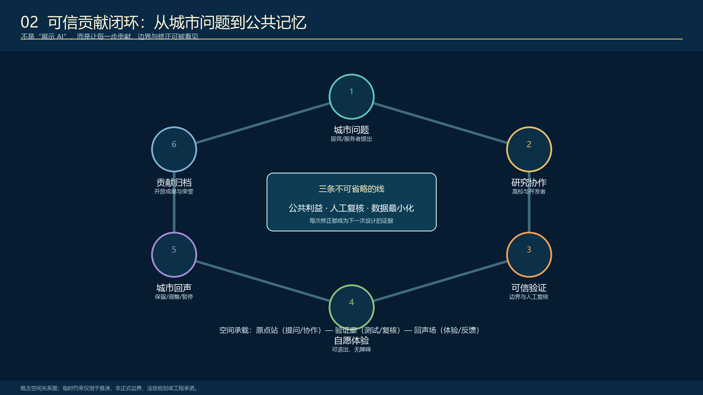
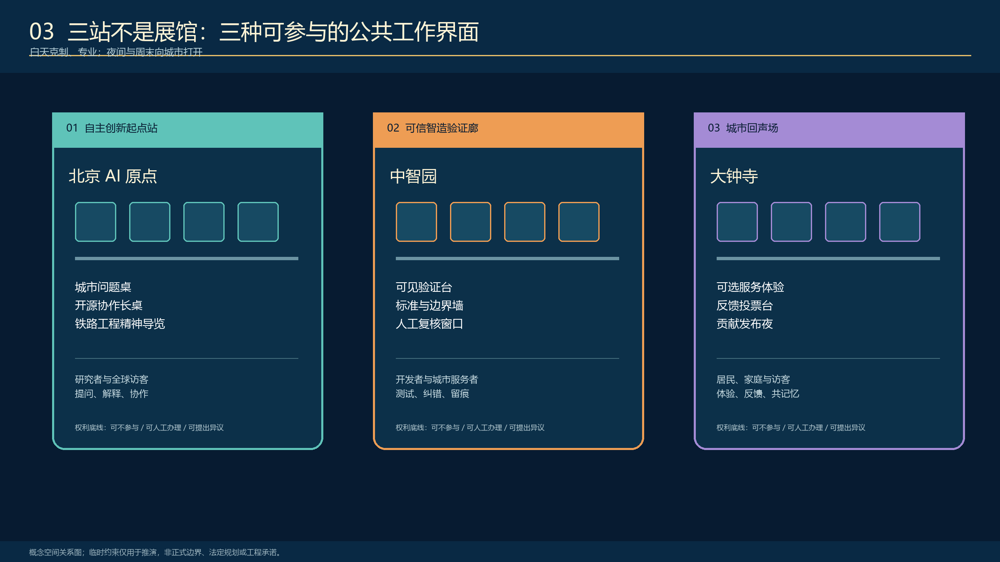
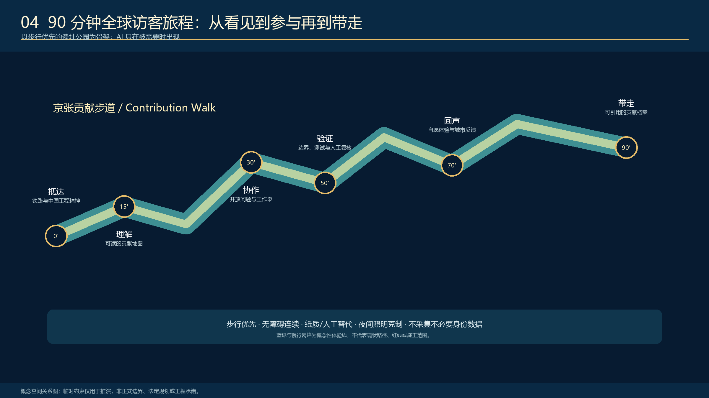

<!-- PARTICIPANT-DESIGN: Jing-Zhang Civic Intelligence Loop. Prepared by Codex for www41818520-coder on 2026-08-11. All spatial moves are conceptual suggestions for professional deepening; provisional geometry is explicitly retained pending organizer-supplied official files. -->

# 京张城市智能体：城市有智，人民作主

## 设计依据与资料清单

本 formal 方案以北京市规划和自然资源委员会海淀分局发布的《百年京张AI创新带城市设计国际方案征集资格预审公告》为第一依据，并以 `brief/site-package/` 中经维护者登记的临时粗略边界、重点区域、枚举、指标和来源清单为机器可读依据。AI agent 在生成方案前必须读取 `design_brief.json`、`allowed_design_space.json`、`sources.json`、`enums/`、`ranges/`、`schemas/`、`data/source_registry.json` 和 `data/processed/agent_fact_pack.md`，并用 `project_scope_summary.csv`、`agent_task_requirements.csv`、`source_use_matrix.csv`、`missing_data_checklist.csv` 建立任务、范围、资料用途和缺口清单。所有设计判断都要拆分为可追溯来源、可复算指标、可校验图层和可人工复核假设。公告要求方案达到控制性详细规划的城市设计深度和规划综合实施方案的城市设计深度，因此文本叙述不能替代 GeoJSON、指标表、A3 文册、A0 展板和 HTML 电子展示成果。

方案不是独立愿景文本，而是从公告、面向智能体任务书和场地资料出发组织成果；本节只把最关键依据放在判断旁边 [source:OFFICIAL-ANNOUNCEMENT] [source:AGENT-TASKBOOK] [depth:existing_conditions_diagnosis]。完整来源和标准覆盖分别保存在 `sources.json`、`standard_matrix.json` 与 `design_depth_matrix.json`，不在正文重复机器索引。

资料登记表的使用边界如下 [source:SOURCE-REGISTRY]：

- data/source_registry.json 登记公开、清权与临时资料的用途边界。
- 当前登记摘要：formal 可用资料 7 条，背景资料 1 条，provisional-only 资料 1 条。
- agent 不得把 background_only 或 provisional_only 资料升级为 official boundary、法定控规、正式评分依据或政府实施承诺。

`data/processed/agent_fact_pack.md` 是本方案的阅读导航层，不是新的权威来源 [source:PROCESSED-FACT-PACK]。它帮助 agent 把三层范围、三处重点区、公告任务、agent.1-agent.6、资料可用性和缺资料事项组织成可读方案；事实判断仍需回到已登记的原始材料 [source:OFFICIAL-ANNOUNCEMENT] [source:AGENT-TASKBOOK]，完整来源关系由 `sources.json` 保存。

本脚手架在官方 `SITE_BOUNDARY` 或三处 `KEY_AREA` 尚未取得时，使用 `brief/site-package/geometry/provisional_boundaries.geojson` 生成临时 formal 包。提交包中的 `geometry/site_boundary.geojson` 与 `geometry/key_areas.geojson` 均必须标注为 `provisional_constraint`、`official_boundary=false`，只能用于方案生成、自检、可视化和设计讨论，不能作为 official redline、审批依据、精确面积依据或法定控制结论。该组织方数据缺口本身不阻断内容评分；替换 official polygons 后，site boundary、key areas、land use、roads、green space、public space、buildings、phasing 和 metrics 均需重算。

本次脚手架生成的可评分状态为：**临时边界，保留精度警示并待正式数据发布后复算；不阻断内容评分**。因此，正文中的空间结构、场景、项目和指标均按“可讨论、可复核、可替换官方边界后重算”的原则写入；当官方边界和重点区 polygon 更新后，agent 必须重新运行脚手架、自检和图纸/HTML生成，不能只替换单个文件。

边界解释可回到总体范围图层和面积复算 [data:geometry/site_boundary.geojson#SITE-001] [metric:site_area_sqm]。三处重点区则由独立图层和数量指标核对 [data:geometry/key_areas.geojson#PROV-KEY-001] [metric:key_area_count]。这意味着读者可以从正文进入证据，但不必先读一串机器编号。

## 三层范围工作框架

方案按照公告确定的三个层次组织工作：统筹研究范围关注 43.6 平方公里的AI产业生态、战略定位、创新链和未来城市形态；总体设计范围关注 11.4 平方公里京张遗址公园周边 1-2 公里城市地区和产业区，要求形成城市更新总体框架、产业空间布局、交通市政支撑和城市风貌控制；重点区域范围关注 368.4 公顷三处详细设计地区，要求明确功能业态、建筑规模、拆改留分类、公共空间连通和交通组织。三层范围在 `compliance_matrix.json` 中逐条映射，保证公告 1.3、1.4、1.5 与 agent.1-agent.6 的必选任务都有章节、图层、指标、图纸和 HTML 证据。

三层工作框架的深度项由 [depth:three_level_scope_framework] 和 [depth:overall_spatial_structure] 约束，空间证据以 [data:geometry/site_boundary.geojson#SITE-001] 与 [data:geometry/key_areas.geojson#PROV-KEY-001] 为准，任务依据以 [standard:PROJECT-OFFICIAL-ANNOUNCEMENT] 为准，范围索引以 [source:PROCESSED-FACT-PACK] 中 `project_scope_summary.csv` 的三层范围表为导航。

三层工作不是互相割裂的图纸集合。统筹研究决定产业链和城市形态判断，总体设计把判断落实到更新项目、空间结构和设施承载，重点区域详细设计验证具体地块、建筑、交通、公共空间和AI应用场景的可实施性。agent 生成方案时必须先锁定当前提交采用的 official 或 provisional 边界和约束，再生成用地、建筑、道路、绿地、公共空间、分期和AI服务节点，最后从这些图层复算指标并在正文解释哪些结论仍受 provisional boundary 限制。任何无法从结构化数据复算的面积、比例、规模或项目数量，不得写入正式结论。

本方案建议的总体概念为“京张城市智能体”：以京张遗址公园为历史与公共空间主轴，以众智园、北京AI原点社区、大钟寺三处重点片区为创新锚点，以高校、企业、社区和轨道站点为日常网络，形成“一条公共基线、三座任务月台、九类城市接口”的空间操作系统。它不是把城市装进软件术语，而是以第一性原理回答城市更新：城市本来就是持续运行的公共系统，真正缺少的是问题可见、工具可调用、行动可验证、过程可追责与公众可接管的闭环。“城市有智，人民作主”是治理底线；“人民提问，城市作答”是空间和运营的工作方式。[source:AGENT-TASKBOOK] [depth:overall_spatial_structure]

### 京张城市智能体：从工程精神到可接管的公共智能基础设施

本方案将“京张城市智能体”定义为一套**让中国 AI 创新贡献从实验室走向城市、让公众看见其工作过程、参与其任务闭环并由城市长期记忆的公共智能基础设施**。京张铁路所代表的自主工程精神不是视觉装饰：它意味着从真实问题出发、接受复杂约束、在测试和修正中形成可长期维护的成果。今天的 AI 创新也应遵守同一伦理：技术能力必须公开边界，接受人工复核和真实城市生活反馈，才可成为城市服务的一部分。别人展示 AI 的结果，我们让公众亲眼看见并参与 AI 的工作过程。

因此，“京张城市智能体”不把本区设想为封闭的 AI 园区或技术秀场，而把 Agent 的感知、任务拆解、工具调用、协作、验证、行动、反馈和记忆转译为空间功能。京张遗址公园是保持散步、停留、拍照与日常生活的**公共基线**；连续但有收有放的“信息流檐”是可阅读的任务总线；林下公共工作台是人机协作界面；众智园、AI 原点和大钟寺三座“任务月台”分别承担感知与验证、协作与工具调用、人工接管与公共记忆。所有节点均为概念建议，待正式边界、权属、文保、交通与市政资料补齐后由专业团队深化。[source:AGENT-TASKBOOK] [data:geometry/public_space.geojson#PUBLIC-001] [depth:overall_spatial_structure]

| 空间角色 | 概念定位 | 对应贡献链环节 | 公共价值 |
| --- | --- | --- | --- |
| 京张贡献步道 | 遗址公园上的知识、文化与日常生活主线 | 连接与归档 | 让历史、研究过程与城市反馈可被公众理解 |
| 众智园可信验证站 | 标准、安全、人工复核与修订的公共解释界面 | 可信验证 | 让“可信”从口号变为可说明的工程过程 |
| AI 原点开放协作站 | 高校、开发者、创业者与城市问题的协作界面 | 共同研发 | 让知识从校园和实验室进入开放共同体 |
| 大钟寺城市回声站 | 自愿体验、人工服务和公众反馈的混合街区界面 | 城市回声 | 让技术接受真实城市生活的检验 |
| 中关村科技服务翼 | 知识产权、资本、国际协作和成果发布支持网络 | 转化与传播 | 让经过验证的贡献走向世界 |
| 小月河场景赋能翼 | 教育、健康导航、慢行和社区服务的低风险验证场 | 自愿体验 | 让日常使用者成为有选择权的参与者 |

本方案以“可信且负责”而非“无处不在的智能化”作为国际传播立场：全球访客可以沿贡献步道在约 90 分钟内读懂中国 AI 的城市叙事——从自主工程精神，到开放协作、可信验证、城市反馈和年度归档；本地居民、学生与服务人员则可以在不注册、不刷脸、不使用 AI 的情况下继续使用同一条公共生活线。[source:AGENT-TASKBOOK] [depth:blue_green_public_space]

| 层级 | 设计问题 | 方案回答 | 数据落点 |
| --- | --- | --- | --- |
| 统筹研究范围 | AI产业生态和未来城市形态如何组织 | 建立“高校策源-开源协作-企业转化-公共体验-国际传播”的创新链 | compliance_matrix.json、standard_matrix.json |
| 总体设计范围 | 产业空间、城市更新、交通市政和风貌如何落图 | 用地、建筑、道路、绿地、公共空间和分期图层共同表达 | [data:geometry/land_use.geojson#LU-001]、[data:geometry/roads.geojson#ROAD-001] |
| 重点区域范围 | 三处片区如何达到详细设计深度 | 分别提出定位、空间动作、AI场景和实施依赖 | [data:geometry/key_areas.geojson#PROV-KEY-001]、[data:geometry/key_areas.geojson#PROV-KEY-002]、[data:geometry/key_areas.geojson#PROV-KEY-003] |

## 统筹研究范围产业与未来城市研究

统筹研究范围的核心任务是构建世界级 AI 创新生态体系。方案应梳理海淀高校院所、头部企业、算力算法数据要素、孵化平台、上市企业、独角兽和科技服务资源，提出AI创新链、产业链、人才链和城市服务链的空间协同框架。命名方案和 logo 设计应服务于“百年京张文化带、都市AI生活体验带、AI融合创新带”的整体辨识度，不能只停留在口号，应说明与产业生态、公共空间和文化资源的关联。面向智能体任务书还要求回应“五大功能”和“三区两翼”协同，形成可继续深化的命名系统、视觉识别、总体空间结构图、场景开放和运营机制；本节必须用 [source:AGENT-TASKBOOK] 与 [standard:PROJECT-AGENT-OPEN-CALL-TASKBOOK] 标注这些要求来自 agent 开源征集任务，而不是法定规划控制。

统筹研究并不新增伪精确红线；它通过 [standard:MOHURD-URBAN-DESIGN-MEASURES] 要求的城市风貌、公共空间和建筑布局统筹，回接 [data:geometry/land_use.geojson#LU-001]、[data:geometry/public_space.geojson#PUBLIC-001] 与 [depth:overall_spatial_structure]，说明产业策略最终要落到可见、可复核的空间结构。

未来城市形态研究应回答人工智能如何改变工作、生活、社交、学习、交通和公共服务。方案应把AI交通系统、连续绿色空间、创新服务设施和国际化生活工作氛围落实为可定位的功能区、节点、廊道和场景，而不是泛泛描述技术愿景。agent 应把产业战略指标、AI创新指数、人才密度、空间供给类型和AI+垂直应用重点区域写入指标体系，并标明哪些是官方、哪些是设计建议、哪些仍待正式数据校准。若提出全球AI创新活动、开发者社区、开放场景或朝圣路线，应写为“概念建议/参考方案/可供专业团队深化研究”，不得写成已经确定的政府活动或实施安排。

## 总体设计范围城市更新与控规深度城市设计

总体设计范围要求达到控制性详细规划的城市设计深度。方案必须提出城市更新总体空间结构、低效空间识别、更新项目清单、实施政策建议、产业功能比例、空间组织模式、建筑总规模和综合承载能力评估。`geometry/land_use.geojson` 应完整覆盖设计边界且无重叠，`geometry/buildings.geojson` 应表达更新建筑基底或保留建筑基底，`geometry/roads.geojson` 应表达微循环、慢行和轨道接驳关系，`metrics.json` 应复算核心面积、比例和图层数量。

本节按照 [standard:MOHURD-CONTROL-DETAILED-PLANNING] 把控规深度内容拆成可审查对象：[data:geometry/land_use.geojson#LU-001] 表达用地结构，[data:geometry/buildings.geojson#BLDG-001] 表达建筑基底，[data:geometry/roads.geojson#ROAD-001] 表达交通组织，[metric:building_footprint_area_sqm] 用于复核建筑基底面积，[depth:land_use_layout] 与 [depth:development_intensity_controls] 约束成果深度。

总体设计还必须支撑交通、轨道、市政和配套设施。方案应围绕轨道站点一体化、道路微循环、非机动车停放、停车供给、创新服务平台、人才生活服务、新型基础设施、分布式能源和端侧算力提出空间布局和实施路径。涉及建筑高度、开发强度、道路红线、退线和设施标准的内容，若尚无官方控制条件，应写为“待正式控规条件确认”，不得以 agent 推测值冒充审定指标。

## 重点区域详细设计

重点区域详细设计是必选项。众智园AI自主创新加速区应围绕国家人工智能平台、全栈自主创新、标准制定、安全治理、产业展示、对外交通、清河文化、低碳绿色创新交往环境和绿色空间AI场景提出详细方案。北京AI原点社区应围绕近校创新、成果孵化转化、人才特区、开源体系、品牌活动、建筑拆改留、成果展示发布、居住生活配套、校区园区慢行联系和轨道站点一体化提出详细方案。大钟寺AI产业聚集区应围绕领军企业、智能体、智能终端、内容消费、数据要素、数字资产、商业服务、规划绿地复合利用、大钟寺站一体化和路口四象限步行连通提出详细方案。

三处重点区域详细设计必须引用 [data:geometry/key_areas.geojson#PROV-KEY-001]、[data:geometry/key_areas.geojson#PROV-KEY-002]、[data:geometry/key_areas.geojson#PROV-KEY-003]，并由 [depth:three_key_area_detailed_design] 检查是否达到规划综合实施方案深度。若只描述“打造示范区”而没有功能、建筑、交通、公共空间和实施项目证据，应被视为未完成。

### 三站详细设计：协作、验证、回声

**众智园可信验证站**以“技术必须说明边界，才能进入城市”为设计原则。其概念组件包括：沿公共界面布置的验证廊（说明测试内容、复核主体和已知局限）、标准工作台（面向研究人员、标准工作者和访客的预约讨论空间）、修订档案庭院（呈现版本迭代与失败复盘）和静默研讨庭院（供日常研究与低干扰交往）。这里不展示企业保密数据，也不把展示说明等同于认证结论；其价值在于使公众能理解测试、质疑和修订是中国 AI 自主工程能力的一部分。

**AI 原点开放协作站**以“知识在协作中积累，贡献在公共中被看见”为原则。问题提案台接收由居民、学生和城市服务人员自愿提出的议题；开源协作长桌在白天服务学习与协作、傍晚服务小型分享；成果发布口将经清权的过程性成果带到校园与街区之间；贡献阅读室连接京张铁路、中关村与 AI 新文化；夜间共学廊以低照度、低噪声方式维持安全步行与交流。方案不擅自改变校园或企业权属空间，所有使用均需在后续运营和场地授权中确认。

**大钟寺城市回声站**以“城市不是技术终点，而是技术的检验者”为原则。自愿体验台提供 AI+商业、导览或无障碍服务的可选体验，并始终保留人工服务；城市回声墙仅以匿名汇总方式显示“保留、调整、暂停”的反馈状态；服务复核台供商户、运营者和公共服务人员处理待办；夜间发布街角承接低噪声的小型对话、放映与开发者交流；贡献回流门将经人工整理的反馈带回提案、协作和验证环节。体验、反馈和任何数据处理均不应被理解为对居民行为的持续监控。[data:geometry/key_areas.geojson#PROV-KEY-001] [data:geometry/key_areas.geojson#PROV-KEY-002] [data:geometry/key_areas.geojson#PROV-KEY-003]

三处重点区域必须在 `geometry/key_areas.geojson` 中出现。若仓库已提供 official polygons，应作为 `official_constraint` 使用；若 official polygons 缺失，可暂用 `provisional_constraint`，但正文、HTML、sources、assumptions 和 self_check 必须说明它不能作为正式评分或审批依据。`compliance_matrix.json` 应分别覆盖公告 1.5.3.1、1.5.3.2、1.5.3.3。设计表达应包含功能业态、建筑规模、建筑形态、拆改留分类、公共空间系统、交通组织、慢行连通和实施项目。HTML 页面应能切换查看三处重点区域，A3 文册和 A0 展板应至少包含重点片区总图、局部详图和指标说明。

| 重点片区 | 设计定位 | 空间动作 | AI产业与运营场景 | 证据引用 |
| --- | --- | --- | --- | --- |
| 众智园AI自主创新加速区 | 花园型全栈自主创新街区 | 强化清河界面、产业展示、低碳创新交往和对外交通组织；以绿色空间承载开放测试与标准治理展示 | 自主模型测试、标准制定工作坊、安全治理展示、低碳算力体验 | [data:geometry/key_areas.geojson#PROV-KEY-001]、[depth:three_key_area_detailed_design] |
| 北京AI原点社区 | 近校型成果转化与人才社区 | 组织校区、园区、街区慢行缝合；补足成果发布、人才服务、居住生活和开源协作空间 | 开源社区、成果发布、人才特区服务、近校孵化 | [data:geometry/key_areas.geojson#PROV-KEY-002]、[source:AGENT-TASKBOOK] |
| 大钟寺AI产业聚集区 | 城市型智能经济与国际交往街区 | 围绕大钟寺站一体化、四象限步行连通、商业服务和重点企业公共环境更新 | 智能体与智能终端展示、内容消费、数据要素与国际路演 | [data:geometry/key_areas.geojson#PROV-KEY-003]、[metric:key_area_count] |

## AI 创新生态、人才画像与 AI+ 场景

方案应建立面向AI人才和企业的空间需求画像，覆盖研发办公、开源协作、成果发布、企业服务、人才居住、社交学习、消费生活、运动休闲和国际交往。AI+场景应围绕公告提出的交通、服务、消费、医疗、教育、法律、生活服务等方向，形成产业发展场景和AI赋能城市功能场景。每个场景应说明服务对象、空间位置、数据来源、隐私边界、人工复核机制和运营主体。

AI 场景必须落到空间和治理边界：公共空间场景引用 [data:geometry/public_space.geojson#PUBLIC-001]，慢行与交通场景引用 [data:geometry/roads.geojson#ROAD-001]，开放空间场景引用 [data:geometry/green_space.geojson#GREEN-001] 和 [metric:public_space_ratio]、[metric:green_ratio]。这些引用让评审者知道场景不是口号，而是位于具体图层和指标中的设计对象。面向智能体任务书要求不少于10张AI场景卡、不少于3个产业测试验证场景和不少于5类用户画像；脚手架只给出结构，正式参赛者必须把场景卡、画像表、隐私边界、人工复核和运营主体写入正文、HTML、A3/A0 和合规矩阵。

| 用户画像 | 贡献链角色与真实需求 | 空间响应 | 不可被替代的权利 |
| --- | --- | --- | --- |
| 青年工程师与开发者 | 发起、维护并说明一项真实贡献 | 原点站的城市问题桌、开源协作长桌和夜间共学廊 | 署名、许可选择、说明局限与不公开的权利 |
| 高校师生与研究者 | 从研究走向解释、协作与成果保护 | 校区—园区慢行缝合、贡献阅读室、近校成果发布口 | 授权后参与、学术表达与成果保护 |
| 本地居民与家庭 | 低打扰地通勤、休憩、求助和表达意见 | 贡献步道、无障碍休憩节点、城市回声场 | 不使用 AI、人工服务、匿名反馈和随时退出 |
| 城市服务人员 | 对 AI 建议作确认、修正或拒绝 | 可见验证台、维护复核桌、服务回流门 | 不被自动化替代的复核权与责任边界 |
| 全球访客与国际开发者 | 在短时间内理解中国 AI 的问题、边界和贡献 | 90 分钟贡献步道、多语贡献档案、对话与合作入口 | 获得清晰、可核查、非宣传化叙事的权利 |

| 场景卡 | 空间载体 | 参与方式与人工底线 |
| --- | --- | --- |
| 01 城市问题提案台 | AI 原点开放协作站 | 居民、学生、服务人员自愿提交问题；运营人员筛选并公开处理状态 |
| 02 开源协作长桌 | AI 原点开放协作站 | 研究、代码、标准或公共解释可在现场协作；不要求注册或实时追踪 |
| 03 铁路工程精神导览 | 京张贡献步道 | 以工程约束、试验与修正解释京张铁路和可信 AI；提供纸质与人工导览 |
| 04 可见可信验证台 | 众智园可信智造验证廊 | 以模拟案例展示测试边界、失败情形和人工质疑；不展示未授权数据或商业机密 |
| 05 无障碍慢行助手 | 贡献步道与小月河场景翼 | 提示绕行、休憩、无障碍与求助点；不替代现场标识和人工问询 |
| 06 AI 学习伙伴工作坊 | 原点站与高校周边开放空间 | 面向学生与家庭的共学；教师或组织者在场，明确工具局限与引用规则 |
| 07 健康服务导航台 | 大钟寺城市回声站 | 仅做服务资源导览和预约协助，不作诊断；保留线下窗口与人工转介 |
| 08 智能原生消费体验 | 大钟寺商业公共界面 | 商户自愿参与、顾客可不用人脸或 AI；价格、规则和申诉方式清楚可读 |
| 09 城市维护复核桌 | 验证廊与回声场之间 | 服务人员核验维护建议，记录“采纳 / 调整 / 暂停”的理由和责任人 |
| 10 全球贡献发布夜 | 贡献步道节点与大钟寺街角 | 小规模、低噪声发布经清权的成果和修订记录；不等同于官方承诺或评奖 |

### 可信贡献闭环与场景治理

十个场景不作为彼此孤立的展示项目，而组织为“**城市提问—共同研发—可信验证—自愿体验—城市回声—贡献归档**”的闭环。城市问题提案台、开源协作长桌、铁路工程精神导览、验证廊、无障碍慢行助手、AI 学习伙伴工作坊、健康服务导航台、智能原生消费体验、城市维护复核台与全球贡献发布夜，分别落在原点社区、众智园、大钟寺、贡献步道和小月河场景翼。每项场景必须写明服务对象、空间载体、运营主体、可用数据、人工复核节点、退出方式和修订记录；在未取得授权或成熟性证据前，只能作为概念验证建议而非已部署服务。

本方案设置三项概念测试验证机制：第一，**可信慢行与无障碍验证**，以公开空间观察、自愿匿名反馈和服务人员复核改善步行、休憩与求助体验；第二，**可信 AI 公开验证**，以模拟案例、明确的任务边界、人工质疑和修订记录解释模型或工具的局限；第三，**城市回声反馈验证**，让 AI 服务与非 AI 人工服务并行，允许使用者选择、拒绝或反馈，并由商户、运营人员与公共服务人员共同复盘。成功不以“AI 使用率”单独判断，而以是否更容易到达、理解、求助和改善真实城市问题来判断。[source:AGENT-TASKBOOK] [data:geometry/roads.geojson#ROAD-001] [depth:traffic_rail_slow_parking]

| 用户画像 | 贡献链角色 | 不可被替代的权利 | 对应空间 |
| --- | --- | --- | --- |
| 青年工程师与开发者 | 贡献发起与维护 | 署名、许可选择、公开说明局限 | AI 原点开放协作站 |
| 高校师生与研究者 | 知识策源与公共解释 | 授权后参与、学术表达与成果保护 | 原点社区、众智园 |
| 本地居民与家庭 | 自愿体验与反馈 | 不使用 AI 的权利、人工服务和匿名反馈 | 贡献步道、小月河、大钟寺 |
| 城市服务人员 | 人工复核与责任承担 | 拒绝自动化决定、确认或纠正 AI 待办 | 城市回声站、维护复核台 |
| 全球访客与国际开发者 | 见证、对话与合作入口 | 清楚理解中国 AI 的问题、边界与贡献 | 90 分钟贡献步道旅程 |

agent 生成的AI治理建议必须遵守数据最小化、公开来源、可解释和人工复核原则。城市智能体可以辅助识别慢行断点、公共空间热力、设施维护、企业服务需求和活动安全风险，但不能替代规划审批、不能输出未经授权的个人画像、不能声称获得官方实施承诺。所有AI场景节点应进入结构化图层或合规矩阵，便于评审者看到它们与产业、空间和公共利益之间的关系。

## 用地、建筑规模与拆改留方案

用地方案应依据国土空间调查、规划、用途管制分类等公开标准表达，形成完整、闭合、无缝的用地分区。建筑方案应区分保留、改造、更新、新建或待确认对象，明确建筑基底、功能、规模、风貌、屋顶、体量和高度控制的建议层级。若缺少现状建筑、权属、控规和工程条件，方案只能提出方法和待校准清单，不能编造拆改留结论。

用地分类依据 [standard:MNR-LAND-USE-CLASSIFICATION-GUIDE]，建筑高度、体量、界面和风貌控制由 [depth:height_massing_character] 管理，拆改留方法由 [depth:retain_renovate_demolish] 管理。用地和建筑的主要证据是 [data:geometry/land_use.geojson#LU-001]、[data:geometry/buildings.geojson#BLDG-001] 和 [metric:building_footprint_area_sqm]。

建筑规模和强度指标必须与 `metrics.json` 和图层一致。若总建筑规模、容积率、建筑高度、建筑密度、绿地率、退线和建筑控制线缺少官方条件，应统一使用 `status=unknown`，并在 `reason` / `assumptions` 中说明待补条件、当前假设和正式数据到位后的复算路径，不得用固定数值制造精确感。A3 文册应给出更新项目清单和指标复核表，A0 展板应把关键空间结构和重点片区表达清楚，HTML 页面应提供指标和图层联动查看。

## 交通、轨道、市政与公共服务设施

交通方案应回应公告对轨道站点一体化、道路微循环、慢行断点、对外交通、停车、非机动车停放和绿色交通系统的要求。重点应覆盖北五环、京张遗址公园跨环路节点、五道口、清华东路西口、大钟寺站及重点企业周边交通联系。道路和慢行图层应保持在提交边界内，并与公共空间、绿地、产业节点和重点片区相互校核；若提交边界为 provisional，交通结论也只能作为临时设计讨论。

交通和市政专业深度分别由 [depth:traffic_rail_slow_parking] 与 [depth:municipal_new_infrastructure] 约束；图层证据引用 [data:geometry/roads.geojson#ROAD-001]、[data:geometry/public_space.geojson#PUBLIC-001] 和 [data:geometry/constraints.geojson#CONSTRAINTS]。当道路红线、管线、消防和市政条件缺失时，应通过 assumptions 说明待补，而不是把策略写成审定条件。

市政和公共服务设施应覆盖AI产业服务设施、创新服务平台、人才生活服务设施、新型基础设施、分布式能源、端侧算力和传统市政设施融合。方案应说明设施标准、空间布局、服务半径、运营模式和分期实施逻辑。缺少管线、能源、排水、防洪、消防等工程资料时，应列为正式深化前置条件。

## 蓝绿空间、公共空间与城市风貌

蓝绿空间方案应以京张遗址公园活力带为骨架，统筹清河、小月河、周边高校、企业、社区出行需求，提出南北贯通、东西连通的步道、骑行道和绿色空间体系。方案应识别慢行断点、上跨环路节点、公园南端和北端景观节点，提出停车、体育、创新交往、科技测试、应用展示和公共服务复合利用策略。

蓝绿公共空间由设计深度项和绿地、公共空间图层共同校核 [depth:blue_green_public_space] [data:geometry/green_space.geojson#GREEN-001] [data:geometry/public_space.geojson#PUBLIC-001]。绿地与公共空间比例在正文解释设计意义，完整复算保存在 `metrics.json`；城市风貌、公共空间和建筑控制的统筹则回到专业标准矩阵 [standard:MOHURD-URBAN-DESIGN-MEASURES]。

“信息月台”是本方案最重要的空间原型：它不是封闭展馆，而是嵌入树荫、遗址步道和城市界面的半开放公共工作场。连续飘带屋顶以不锈钢反射面、蓝色低亮度信息光带和可维护的模块化构件形成有收有放的尺度；屋底成为任务状态显示面，公众能看到项目处于提问、协作、验证、行动或反馈的哪一阶段，并在授权范围内把任务发送给其他工作单元。台下保留普通桌椅、人工咨询、非数字导视、无障碍通行和可随时退出的日常使用，不把“参与智能”变成进入公共空间的条件。

城市风貌方案应融合京张铁路历史文化、中关村创新文化和AI创新文化，利用清华园火车站、北影等文化资源，提出城市基调、建筑风貌、屋顶形态、体量、界面和公共艺术引导。agent 还应提出导视标识、文化符号、国际传播叙事、AI朝圣地标、贡献墙或荣誉展示体系，但所有品牌、字体、图像、肖像和企业标识都必须有清权来源。风貌控制应分清官方管控、设计建议和待确认条件，严禁在没有文保或控规依据时给出伪精确控制线。

## 更新项目清单、实施政策与分期计划

实施方案应形成可审查的更新项目清单，说明项目位置、类型、功能、责任主体、依赖条件、实施阶段、风险和评估指标。政策建议应覆盖城市更新统筹实施、空间供给、运营机制、产业服务、公共参与、数据治理和产权协同。`geometry/phasing.geojson` 应表达分期范围，`compliance_matrix.json` 应把每个任务与分期和图纸挂接。

项目清单和分期深度由 [depth:renewal_project_list] 与 [depth:phasing_implementation] 管理，分期空间证据为 [data:geometry/phasing.geojson#PHASE-001]。如果没有权属、资金、实施主体和审批路径，方案必须把它写成实施风险，而不是承诺落地。

| 项目编号 | 项目名称 | 类型 | 主要依赖 | 证据引用 |
| --- | --- | --- | --- | --- |
| JZ-01 | 京张遗址公园慢行断点缝合 | 公共空间/交通 | 道路红线、桥下空间、交通组织复核 | [data:geometry/roads.geojson#ROAD-001] |
| JZ-02 | 众智园清河创新界面 | 蓝绿空间/产业展示 | 河道蓝线、生态和防洪条件 | [data:geometry/green_space.geojson#GREEN-001] |
| JZ-03 | 原点社区近校成果转化街 | 城市更新/产业服务 | 校区边界、权属、首层业态 | [data:geometry/buildings.geojson#BLDG-001] |
| JZ-04 | 大钟寺站四象限步行连通 | 轨道一体化/慢行 | 轨道站点、道路交叉口、市政管线 | [data:geometry/public_space.geojson#PUBLIC-001] |
| JZ-05 | AI公共服务与端侧算力节点 | 新基建/公共服务 | 能源、算力、安全和运营主体 | [data:geometry/constraints.geojson#CONSTRAINTS] |
| JZ-06 | 全球AI活动周公共路线 | 运营/品牌 | 公共空间许可、活动安全、版权清权 | [data:geometry/phasing.geojson#PHASE-001] |

分期应与 100 天征集设计周期形成区分：征集周期是提交成果的时间要求，实施分期是城市更新和项目建设的推进路径。方案应提出近期试点、中期更新和长期治理框架，并标明哪些内容可先以轻量设施、运营活动和服务平台启动，哪些必须等待正式控规、市政、交通和权属条件确认。对于年度活动体系、开发者社区运营、场景开放日、公共体验路线和国际传播机制，正文应说明运营对象、频率、责任边界、转化路径和风险，不得只写宣传口号。

近期可先选择一处不改变铁路遗产本体、权属清晰且具备运营主体的公共界面，搭建 1:1 可逆信息月台原型，验证遮阴、照明、噪声、无障碍、信息可读性、任务转交和人工接管；中期再把验证有效的模块接入三处重点区；长期才形成跨片区任务总线与年度贡献档案。每一次扩展都以公众是否更容易到达、理解、求助和纠错为准，而不是以屏幕数量或 AI 使用率为准。[data:geometry/phasing.geojson#PHASE-001] [depth:phasing_implementation]

## 指标体系、面积复算与合规矩阵

指标体系至少应包含总体设计范围面积、重点区域面积、绿地与公共空间比例、建筑基底、更新项目数量、AI场景节点、慢行连通指标、产业空间指标、人才服务指标和自检状态。所有 known 指标必须能从 GeoJSON 或可信来源复算；unknown 指标必须给出原因和正式提交前置条件。`scripts/spatial_review.py` 和 `scripts/visual_review.py` 的结果是 formal 自检的重要证据。

指标复算遵循统一的设计深度要求 [depth:metrics_recalculation]。正文重点解释指标的设计含义，例如总体范围如何约束空间分配、蓝绿和公共空间比例如何支撑日常交往；完整数值、公式、来源文件和置信度保存在 `metrics.json`。示例关键指标可由总体范围和绿地数据复核 [metric:site_area_sqm] [data:geometry/green_space.geojson#GREEN-001]。

合规矩阵是任务响应性的主控文件。每条公告任务和 agent_taskbook 任务必须对应到报告章节、图层、指标、图纸、HTML 页面、来源、假设和自检项。未能覆盖公告 1.3、1.4、1.5 或 agent.1-agent.6 的任一必选任务，方案不得进入 formal professional scoring。

正式深化时，agent 还应把每个指标分为三类：第一类是可由提交几何直接复算的空间指标，例如边界面积、绿地比例、公共空间比例、建筑基底面积和分期面积；第二类是需要官方控规或任务书附件支撑的管控指标，例如容积率、建筑高度、建筑密度、退线、道路红线和设施标准；第三类是需要运营或产业数据持续校准的绩效指标，例如 AI 创新指数、人才密度、产业服务满意度、慢行可达性、活动参与度和场景使用频次。三类指标应分别进入 `metrics.json`、`assumptions.json` 和 `compliance_matrix.json`，避免把运营愿景误写成审定规划条件。

## 风险、版权与合规说明

**要求双语言。** 方案主文件可使用中文或英文，但必须通过 `proposal.en.md` 或 `proposal.zh.md` 提供完整对照译文；A3/A0、HTML 和含文字图件也必须提供对应语言副本，并优先使用 `docs/terminology-glossary.md` 的赛事推荐译法。v2 包缺少任一必需译稿、语言映射或有效文件时，finalize 与 CI 会阻断提交。所有图片、图纸、图标、数据和代码资产必须在 `sources.json` 或 `report/copyright_statement.md` 中说明来源、许可和授权状态。HTML 页面不得加载远程脚本、远程地图瓦片、远程字体、iframe、表单或外部 API，不得跟踪评审者行为。

风险和缺资料清单由风险深度项、约束图层和场地包共同校核 [depth:risk_missing_data] [data:geometry/constraints.geojson#CONSTRAINTS] [source:SITE-PACKAGE]。`missing_data_checklist.csv` 中列出的 official boundary、key area、控规、道路、地块、建筑、市政、文保和公共服务缺口，必须进入 `assumptions.json`、自检和正文风险章节。任何缺少官方控规、道路红线、权属、市政、消防或文保条件的结论，都必须降级为待确认事项；完整专业核对保存在标准矩阵中。

本方案不声称官方批准、审定控规、最终土地权属、最终建设规模或保证实施。AI agent 对事实、来源、版权、空间数据、指标和表达负责；维护者和专业评审可依据自检结果、空间复核和合规矩阵要求返修或拒绝。

## 参考资料

- brief/public-brief.md
- brief/site-package/design_brief.json
- brief/site-package/allowed_design_space.json
- brief/site-package/enums/
- brief/site-package/ranges/planning_limits.json
- data/processed/agent_fact_pack.md
- data/processed/project_scope_summary.csv
- data/processed/agent_task_requirements.csv
- data/processed/source_use_matrix.csv
- data/processed/missing_data_checklist.csv
- 完整机器索引：见 `sources.json`、`metrics.json`、`compliance_matrix.json`、`standard_matrix.json` 与 `design_depth_matrix.json`
- 本节书目入口依据场地包登记，完整出处和许可见结构化来源清单 [source:SITE-PACKAGE]
