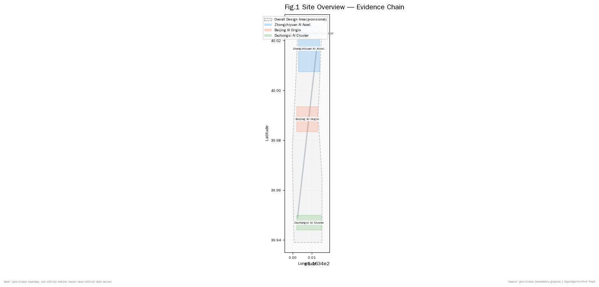
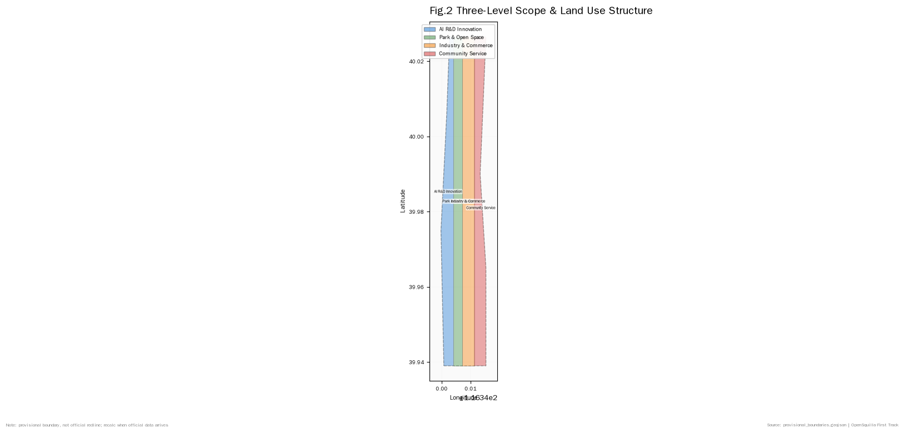
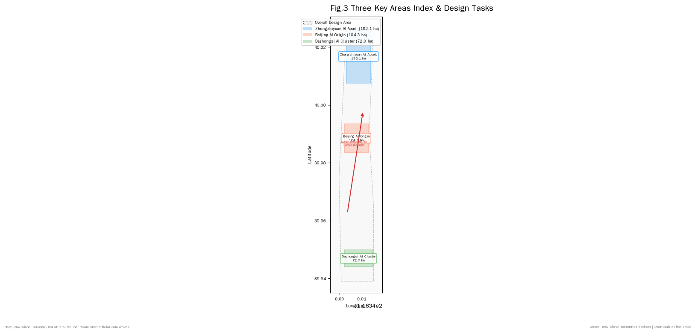
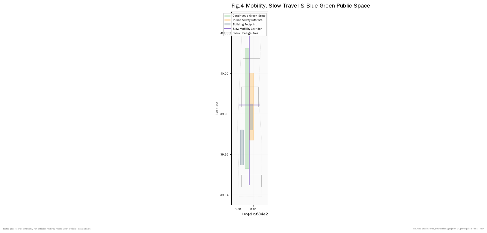
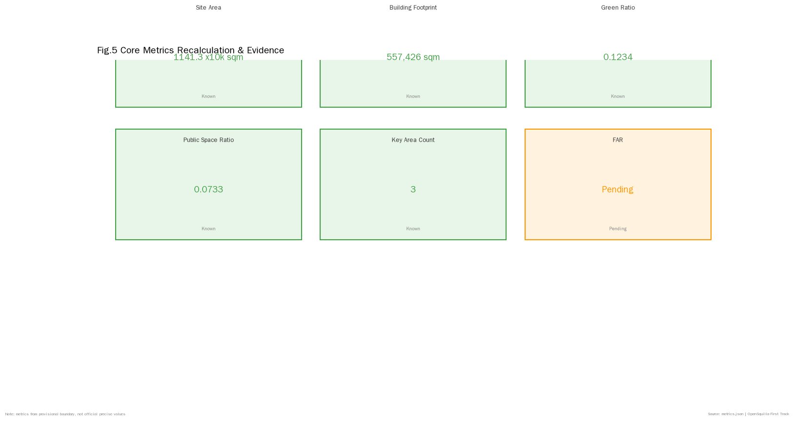

# Centennial Jingzhang · First Track — From Self-Reliant Railway to Self-Reliant AI Urban Spine

## Design Basis and Source Inventory

This formal package takes the *Centennial Jing-Zhang AI Innovation Belt Urban Design International Call for Proposals Qualification Pre-announcement* issued by the Haidian Branch of the Beijing Commission of Planning and Natural Resources as its first authority, with machine-readable constraints derived from the curated provisional boundary, key areas, enums, metrics and source registry maintained under `brief/site-package/`. Before generating the package, the agent reads `design_brief.json`, `allowed_design_space.json`, `sources.json`, `enums/`, `ranges/`, `schemas/`, `data/source_registry.json` and `data/processed/agent_fact_pack.md`, and uses `project_scope_summary.csv`, `agent_task_requirements.csv`, `source_use_matrix.csv` and `missing_data_checklist.csv` to organize the task, scope, source-usability and gap inventory. Every design judgment is split into traceable sources, reproducible metrics, verifiable layers and human-reviewable assumptions. The announcement requires regulatory-plan urban-design depth and planning-comprehensive-implementation urban-design depth, so narrative text cannot replace GeoJSON, metric tables, A3 booklets, A0 boards or HTML display outputs.

The package is not a standalone vision document but is organized from the announcement, agent taskbook and site-package materials. This section anchors only the most critical basis to each judgment [source:OFFICIAL-ANNOUNCEMENT] [source:AGENT-TASKBOOK] [depth:existing_conditions_diagnosis]. Full source and standard coverage is preserved in `sources.json`, `standard_matrix.json` and `design_depth_matrix.json` and is not duplicated inline.

The source registry boundary is as follows [source:SOURCE-REGISTRY]:

- `data/source_registry.json` registers formal-ready, background-only, provisional-only and needs-review material.
- Current summary: 7 formal-ready, 1 background, 1 provisional-only entries.
- Background-only and provisional-only materials must not be upgraded into official boundaries, statutory controls, formal scoring evidence or government implementation commitments.

`data/processed/agent_fact_pack.md` is a reading navigation layer, not a new authority [source:PROCESSED-FACT-PACK]. It organizes the three scope levels, three key areas, announcement tasks, agent.1-agent.6, source usability and missing-data items into readable form; factual judgments still refer back to the registered primary materials [source:OFFICIAL-ANNOUNCEMENT] [source:AGENT-TASKBOOK], and the complete source relations are preserved in `sources.json`.

When the official `SITE_BOUNDARY` or the three `KEY_AREA` polygons are not yet available in the site package, this package uses `brief/site-package/geometry/provisional_boundaries.geojson` to produce a temporary formal package. The submitted `geometry/site_boundary.geojson` and `geometry/key_areas.geojson` are declared as `provisional_constraint`, `official_boundary=false`, and may only be used for package generation, self-check, visualization and design discussion. They must not be presented as official redlines, approval basis, precise-area basis or statutory control conclusions. The organizer's data gap itself does not block content scoring; once official polygons are published, site boundary, key areas, land use, roads, green space, public space, buildings, phasing and metrics must be re-derived.

The current reviewable state of this package is: **provisional boundary, precision warning retained, recalculation on hold for official data release — not blocking content scoring.** Therefore the spatial structure, scenarios, projects and metrics in the narrative are written under the principle of "discussable, reproducible, re-derivable when the official boundary arrives"; once official boundary and key-area polygons update, the agent must rerun scaffold, self-check and figure/HTML generation rather than replacing a single file.

Boundary interpretation can return to the scope layer and area recalculation [data:geometry/site_boundary.geojson#SITE-001] [metric:site_area_sqm]. The three key areas are independently verified by their own layer and count metric [data:geometry/key_areas.geojson#PROV-KEY-001] [metric:key_area_count]. This means readers can move from narrative into evidence without first reading a string of machine identifiers.

## Three-Level Scope Framework

The package organizes work along the three scope levels defined by the announcement: the coordinated research scope (43.6 sq km) focuses on AI industry ecosystem, strategic positioning, innovation chain and future urban form; the overall design scope (11.4 sq km, the 1-2 km corridor around Jingzhang Heritage Park) focuses on the urban renewal framework, industry space layout, transport and municipal support, and urban character control; the key detailed design scope (368.4 ha, three districts) requires explicit functional mix, building scale, retain/renovate/demolish classification, public-space connectivity and transport organization. The three scopes are mapped line-by-line into `compliance_matrix.json` to guarantee that each announcement 1.3, 1.4, 1.5 and agent.1-agent.6 mandatory task has a corresponding chapter, layer, metric, drawing and HTML evidence.

The three-level depth items are governed by [depth:three_level_scope_framework] and [depth:overall_spatial_structure]; spatial evidence follows [data:geometry/site_boundary.geojson#SITE-001] and [data:geometry/key_areas.geojson#PROV-KEY-001]; task authority follows [standard:PROJECT-OFFICIAL-ANNOUNCEMENT]; scope indexing follows [source:PROCESSED-FACT-PACK] `project_scope_summary.csv`.

The three levels are not three disconnected drawing sets. Coordinated research determines the industry chain and urban form judgments, overall design materializes them into renewal projects, spatial structure and facility capacity, and key-area detailed design verifies feasibility at the level of specific plots, buildings, transport, public space and AI scenarios. When the agent generates the package, it must first lock the currently adopted official or provisional boundary and constraints, then generate land use, buildings, roads, green space, public space, phasing and AI service nodes, and finally derive metrics from these layers and explain in prose which conclusions remain provisional-boundary limited. Any area, ratio, scale or project count that cannot be re-derived from the structured data must not be written as a formal conclusion.

The overall concept proposed by this package is **"First Track"**: in 1909 the Jingzhang Railway that Zhan Tianyou led was China's first self-designed trunk railway. The spiritual origin of that railway — *self-reliance* — is exactly the cultural origin of the Haidian AI Innovation Belt a century later. The package transforms the Jingzhang Heritage Park corridor into an urban spine *"from self-reliant railway to self-reliant AI,"* using Zhongzhiyuan, Beijing AI Origin Community and Dazhongsi as innovation anchors, with universities, enterprises, communities and rail stations as the everyday network, forming a *"one-track three-core, multi-point scenario, blue-green slow-mobility composite ring"* spatial organization. The "one track" is not an additional redline but translates the announcement's Heritage Park corridor into a culture-innovation-life composite spine; the "three cores" correspond to the three key areas; the "multi-point scenarios" correspond to operable AI+public-service, industry-service and city-life nodes; the "composite ring" corresponds to the slow-mobility, green-space, public-space and activity-route linkage [source:AGENT-TASKBOOK] [standard:PROJECT-AGENT-OPEN-CALL-TASKBOOK].

On naming: the main name "First Track" refers both to the Jingzhang Railway as China's first self-built trunk track and to the starting line of autonomous innovation in the AI era; the English name "First Track" preserves the double meaning. On visual identity direction: the 1435 mm standard-gauge track gauge is used as the motif, with Zhan Tianyou's engineering drawings as a watermark; the primary palette transitions from the grey of the old Jingzhang stations to the tech-blue of the AI belt; the Logo direction is an isomorphic figure combining a rail cross-section with a circuit trace. All fonts, images and identifiers are conceptual directions and require clearance before formal use [source:AGENT-TASKBOOK] [standard:PROJECT-AGENT-OPEN-CALL-TASKBOOK].

| Level | Design Question | Package Response | Data Landing |
| --- | --- | --- | --- |
| Coordinated research | How is the AI industry ecosystem and future urban form organized? | Build an innovation chain of university-source, open-source collaboration, enterprise transfer, public experience and international communication | compliance_matrix.json, standard_matrix.json |
| Overall design | How do industry space, urban renewal, transport/municipal and character land on layers? | Land use, buildings, roads, green, public space and phasing layers express it together | [data:geometry/land_use.geojson#LU-001], [data:geometry/roads.geojson#ROAD-001] |
| Key area | How do the three districts reach detailed-design depth? | Separate positioning, spatial moves, AI scenarios and implementation dependencies | [data:geometry/key_areas.geojson#PROV-KEY-001], [data:geometry/key_areas.geojson#PROV-KEY-002], [data:geometry/key_areas.geojson#PROV-KEY-003] |

## Coordinated Research: Industry and Future-City Research

The coordinated research scope's core task is to build a world-class AI innovation ecosystem. The package surveys Haidian's universities, institutes, leading enterprises, compute/algorithm/data factor endowments, incubation platforms, listed companies, unicorns and tech-service resources, and proposes a spatial synergy framework for the AI innovation chain, industry chain, talent chain and urban service chain. The naming scheme and logo direction serve the overall recognition of the "Centennial Jing-Zhang Cultural Belt, Metropolitan AI Life Experience Belt, AI Integration Innovation Belt," not as a slogan but as a system linked to industry ecosystem, public space and cultural resources. The agent taskbook further requires responding to the "five functions" and "three-area two-wing" synergy, forming a continuable naming system, visual identity, overall spatial structure, scenario-opening and operating mechanism; this section must be anchored by [source:AGENT-TASKBOOK] and [standard:PROJECT-AGENT-OPEN-CALL-TASKBOOK] to make clear these requirements come from the agent open call, not statutory planning controls.

Coordinated research does not fabricate pseudo-precise redlines; through the [standard:MOHURD-URBAN-DESIGN-MEASURES] requirements on urban character, public space and building layout it reconnects to [data:geometry/land_use.geojson#LU-001], [data:geometry/public_space.geojson#PUBLIC-001] and [depth:overall_spatial_structure], so that industry strategy ultimately lands on visible, reproducible spatial structure.

The future-city-form study should answer how AI reshapes work, life, social interaction, learning, transport and public service. The package translates AI transport systems, continuous green space, innovation-service facilities and international work-live atmosphere into locatable functional zones, nodes, corridors and scenarios rather than generic technology visions. The agent should write AI industry metrics, AI innovation index, talent density, space-supply types and AI+vertical-focus areas into the metric system, and mark which are official, which are design proposals and which await official calibration. Where global AI innovation events, developer communities, open scenarios or pilgrimage routes are proposed, they are written as "conceptual proposals / reference schemes / material for professional teams to deepen," not as confirmed government arrangements.

## Overall Design Scope: Urban Renewal and Regulatory-Plan Depth Urban Design

The overall design scope must reach regulatory-plan urban-design depth. The package must propose an overall urban-renewal spatial structure, low-efficiency space identification, renewal project list, implementation policy suggestions, industry function ratio, spatial organization mode, total building scale and comprehensive capacity assessment. `geometry/land_use.geojson` must completely cover the design boundary without overlap, `geometry/buildings.geojson` must express the retained or updated building footprints, `geometry/roads.geojson` must express micro-circulation, slow-mobility and rail-station interface, and `metrics.json` must re-derive core areas, ratios and layer counts.

This section follows [standard:MOHURD-CONTROL-DETAILED-PLANNING] to decompose the regulatory-plan depth into reviewable objects: [data:geometry/land_use.geojson#LU-001] expresses land-use structure, [data:geometry/buildings.geojson#BLDG-001] expresses building footprint, [data:geometry/roads.geojson#ROAD-001] expresses transport organization, [metric:building_footprint_area_sqm] for footprint review, [depth:land_use_layout] and [depth:development_intensity_controls] govern deliverable depth.

The overall design must also support transport, rail, municipal and ancillary facilities. The package should propose spatial layout and implementation path around rail-station integration, road micro-circulation, non-motorized parking, parking supply, innovation service platforms, talent-life services, new-type infrastructure, distributed energy and edge compute. Where building height, development intensity, road redlines, setbacks or facility standards are not yet officially controlled, they are written as "pending regulatory-plan conditions to be confirmed" rather than presented as agent-inferred approved metrics.

## Key Area Detailed Design

Key-area detailed design is mandatory. Zhongzhiyuan AI Acceleration Area must present a detailed scheme around the national AI platform, full-stack self-innovation, standard-setting, safety governance, industry display, external transport, Qinghe culture, low-carbon green innovation environment and green-space AI scenarios. Beijing AI Origin Community must present a detailed scheme around campus-adjacent innovation, result incubation and transfer, talent special zone, open-source system, brand activities, building retain/renovate/demolish, result publishing and display, living-supporting facilities, campus-park slow-mobility connection and rail-station integration. Dazhongsi AI Industry Cluster must present a detailed scheme around leading enterprises, agents, intelligent terminals, content consumption, data elements, digital assets, commercial services, planned-green mixed use, Dazhongsi Station integration and four-quadrant intersection pedestrian connectivity.

The three key-area detailed designs must reference [data:geometry/key_areas.geojson#PROV-KEY-001], [data:geometry/key_areas.geojson#PROV-KEY-002], [data:geometry/key_areas.geojson#PROV-KEY-003], and [depth:three_key_area_detailed_design] checks whether they reach planning-comprehensive-implementation depth. A description that only says "build a demonstration zone" without functional, building, transport, public-space and implementation project evidence is incomplete.

The three key areas must appear in `geometry/key_areas.geojson`. Where official polygons are provided by the repository they are used as `official_constraint`; where official polygons are missing, `provisional_constraint` is allowed, but the narrative, HTML, sources, assumptions and self-check must all explain that they cannot be used as formal scoring or approval basis. `compliance_matrix.json` covers announcement 1.5.3.1, 1.5.3.2 and 1.5.3.3 respectively. The design expression must include functional mix, building scale, building character, retain/renovate/demolish classification, public-space system, transport organization, slow-mobility connectivity and implementation projects. The HTML page must allow switching among the three key areas; the A3 booklet and A0 boards must include at least the key-area master plan, partial detail and metric explanation.

| Key Area | Design Positioning | Spatial Moves | AI Industry and Operating Scenarios | Evidence Reference |
| --- | --- | --- | --- | --- |
| Zhongzhiyuan AI Acceleration | Garden-type full-stack self-innovation block | Strengthen Qinghe interface, industry display, low-carbon innovation exchange and external transport organization; use green space to host open testing and standard-governance display | Self-developed model testing, standard-setting workshops, safety-governance display, low-carbon compute experience | [data:geometry/key_areas.geojson#PROV-KEY-001], [depth:three_key_area_detailed_design] |
| Beijing AI Origin Community | Campus-adjacent transformation and talent community | Organize campus-park-block slow-mobility stitching; supplement result publishing, talent services, living and open-source collaboration space | Open-source community, result publishing, talent-zone services, campus-adjacent incubation | [data:geometry/key_areas.geojson#PROV-KEY-002], [source:AGENT-TASKBOOK] |
| Dazhongsi AI Industry Cluster | Urban smart-economy and international exchange block | Focus on Dazhongsi Station integration, four-quadrant pedestrian connectivity, commercial services and leading-enterprise public-environment renewal | Agent and intelligent-terminal display, content consumption, data elements and international roadshows | [data:geometry/key_areas.geojson#PROV-KEY-003], [metric:key_area_count] |

## AI Innovation Ecosystem, Talent Profile and AI+ Scenarios

The package should build spatial-demand profiles for AI talent and enterprises covering R&D offices, open-source collaboration, result publishing, enterprise services, talent housing, social learning, consumption life, sports and leisure and international exchange. AI+ scenarios should follow the announcement's transport, service, consumption, healthcare, education, legal and life-service directions to form both industry-development scenarios and AI-empowered city-function scenarios. Each scenario should specify service target, spatial location, data source, privacy boundary, human review mechanism and operating entity.

AI scenarios must land on space and governance boundaries: public-space scenarios reference [data:geometry/public_space.geojson#PUBLIC-001], mobility scenarios reference [data:geometry/roads.geojson#ROAD-001], open-space scenarios reference [data:geometry/green_space.geojson#GREEN-001] and [metric:public_space_ratio], [metric:green_ratio]. These references let reviewers know that scenarios are design objects on specific layers and metrics, not slogans. The agent taskbook requires at least 10 AI scenario cards, of which at least 3 are AI industry test-validation scenarios, and at least 5 user persona categories; the scaffold only provides the structure, and a formal participant must write the scenario cards, persona tables, privacy boundaries, human-review and operating entities into the narrative, HTML, A3/A0 and compliance matrix.

| User Persona | Typical Needs | Spatial Response | Self-Check Boundary |
| --- | --- | --- | --- |
| Open-source developer | Publishing, collaboration, testing, community reputation | Origin-community open-source release hall, public code wall, late-night collaboration space | No personal-behavior tracking; activity data only in aggregated statistics |
| Startup team | Low-cost office, compute entry, product playground | Zhongzhiyuan shared test field, edge-compute service points, standard-governance consultancy | Compute and data services require separate authorization |
| Leading-enterprise visitor | Display, business, international reception, talent recruitment | Dazhongsi international roadshow lounge, rail-station shuttle, surrounding public space of key enterprises | Enterprise identifiers and cases must be cleared |
| Neighborhood resident | Commute, leisure, community services, low-disruption renewal | Jingzhang Heritage Park slow-mobility ring, embedded community services, graded night lighting and activities | Resident personas must not be used for commercial recommendation |
| University faculty/student | Result transfer, cross-campus collaboration, daily slow mobility | Campus-park slow-mobility stitching, result-transfer stations, AI education experience points | Campus data and research outputs require authorization |

| Scenario Card | Spatial Carrier | Design Note |
| --- | --- | --- |
| 01 Open-Source Release Hall | Beijing AI Origin Community | For universities, open-source communities and startups: result publishing, code-contribution display and small roadshow space |
| 02 Safety Governance Sandbox | Zhongzhiyuan | Translate standard-setting, safety testing and model red-team testing into visitable, bookable, supervised display and collaboration nodes |
| 03 Edge Compute Station | Overall-design-scope nodes | Combined with public service, enterprise service and low-carbon energy strategies as a deepenable new-infrastructure prototype |
| 04 AI Slow-Mobility Navigation | Jingzhang Heritage Park vitality belt | Use explainable wayfinding and low-intrusion sensing to identify slow-mobility gaps, crowding and accessibility needs |
| 05 Dazhongsi International Roadshow Lounge | Dazhongsi AI Industry Cluster | Serve agent, intelligent-terminal and content-consumption enterprises for display, negotiation, media publishing and international exchange |
| 06 Qinghe Low-Carbon Innovation Corridor | Zhongzhiyuan Qinghe interface | Combine green space, stormwater, walking/cycling and AI display as the park's public living room |
| 07 Campus-Adjacent Transfer Street | Beijing AI Origin Community | For university result transfer: organize incubation, display, legal, IP and investment services |
| 08 Data Element Lounge | Dazhongsi district | Display data-element and digital-asset circulation as a city service interface under compliance, authorization and auditability |
| 09 AI Life-Service Sample Street | Community and commercial intersection | Place healthcare, education, legal and life-service AI+ scenarios into operable small-scale block space |
| 10 Global AI Week Route | Belt-wide public-space system | Form a walkable, transmissible experience route from heritage culture, open-source community and industry display to international roadshow |

The AI governance recommendations must follow data-minimization, open-source, explainability and human-review principles. City agents can assist in identifying slow-mobility gaps, public-space heat, facility maintenance, enterprise-service demand and event safety risks, but cannot replace planning approval, cannot output unauthorized personal profiles, and cannot claim official implementation commitments. All AI scenario nodes should enter structured layers or the compliance matrix so reviewers can see their relationship to industry, space and public interest.

## Land Use, Building Scale and Retain/Renovate/Demolish

The land-use scheme should express a complete, closed, seamless zoning partition using the national spatial-survey land-use classification standard. The building scheme should distinguish retained, renovated, updated, newly-built or pending-confirmation objects, clarifying building footprint, function, scale, character, roof, massing and height-control recommendation levels. Where current-building, ownership, regulatory-plan and engineering conditions are missing, the package can only propose methods and a pending-calibration checklist, not fabricate retain/renovate/demolish conclusions.

Land-use classification follows [standard:MNR-LAND-USE-CLASSIFICATION-GUIDE]; building height, massing, interface and character control are governed by [depth:height_massing_character]; retain/renovate/demolish method by [depth:retain_renovate_demolish]. Primary evidence for land use and buildings is [data:geometry/land_use.geojson#LU-001], [data:geometry/buildings.geojson#BLDG-001] and [metric:building_footprint_area_sqm].

Building-scale and intensity metrics must be consistent with `metrics.json` and layers. Where total building scale, FAR, building height, building density, green ratio, setback and building control line lack official conditions, they should uniformly use `status=unknown` with `reason` / `assumptions` explaining pending conditions, current assumptions and the recalculation path when official data arrives; the package may retain concept massing or design quantities recomputed from its own geometry, but must label them as concept-proposal/low-confidence design quantities that do not equal statutory control values.

## Transport, Rail, Municipal and Public Service Facilities

The transport scheme should respond to the announcement's requirements on rail-station integration, road micro-circulation, slow-mobility gaps, external transport, parking and non-motorized parking. Focus should cover the North Fifth Ring Road, Jingzhang Heritage Park cross-ring-road nodes, Wudaokou, Qinghua East Road West Exit, Dazhongsi Station and key-enterprise周边 transport connections. Road and slow-mobility layers should remain within the submitted boundary and cross-check against public space, green space, industry nodes and key districts; if the submitted boundary is provisional, transport conclusions can only serve as temporary design discussion.

Transport and municipal professional depth are governed by [depth:traffic_rail_slow_parking] and [depth:municipal_new_infrastructure]; layer evidence references [data:geometry/roads.geojson#ROAD-001], [data:geometry/public_space.geojson#PUBLIC-001] and [data:geometry/constraints.geojson#CONSTRAINTS]. When road redlines, pipelines, fire and municipal conditions are missing, they should be noted as pending via assumptions rather than written as approved conditions.

Municipal and public-service facilities should cover AI industry-service facilities, innovation service platforms, talent-life service facilities, new-type infrastructure, distributed energy, edge compute and traditional municipal facility integration. The package should specify facility standards, spatial layout, service radius, operating model and phased implementation logic. Where pipeline, energy, drainage, flood, fire and other engineering data are missing, they should be listed as formal-deepening prerequisites.

## Blue-Green Space, Public Space and Urban Character

The blue-green space scheme should use the Jingzhang Heritage Park vitality belt as the skeleton, coordinating Qinghe, Xiaoyue River, surrounding universities, enterprises and community travel demand, proposing a north-south penetrating and east-west connecting system of walkways, cycle paths and green space. The package should identify slow-mobility gaps, cross-ring-road nodes, park north-end and south-end landscape nodes, and propose parking, sports, innovation exchange, technology testing, application display and public-service mixed-use strategies.

Blue-green public space is checked by depth items and green/public-space layers [depth:blue_green_public_space] [data:geometry/green_space.geojson#GREEN-001] [data:geometry/public_space.geojson#PUBLIC-001]. Green and public-space ratios are explained in the narrative for their design significance; complete recalculation is preserved in `metrics.json`; urban-character, public-space and building-control coordination returns to [standard:MOHURD-URBAN-DESIGN-MEASURES].

The urban-character scheme should fuse Jingzhang Railway historical culture, Zhongguancun innovation culture and AI new culture, using Qinghuayuan Station, Beijing Film Academy and other cultural resources to propose urban tone, building character, roof form, massing, interface and public-art guidance. The agent should also propose signage, cultural symbols, international communication narrative, AI pilgrimage landmarks, contribution walls or honor-display systems, but all brand, font, image, portrait and enterprise identifiers must have cleared sources. Character control should distinguish official controls, design proposals and pending conditions; pseudo-precise control lines without heritage or regulatory-plan basis are prohibited.

## Renewal Project List, Implementation Policy and Phasing

The implementation scheme should form an auditable renewal project list specifying project location, type, function, responsible entity, dependencies, implementation phase, risk and evaluation metrics. Policy proposals should cover urban-renewal coordinated implementation, space supply, operating mechanisms, industry services, public participation, data governance and property-rights coordination. `geometry/phasing.geojson` should express phasing ranges, and `compliance_matrix.json` should link each task to phasing and drawings.

Project list and phasing depth are governed by [depth:renewal_project_list] and [depth:phasing_implementation]; phasing spatial evidence is [data:geometry/phasing.geojson#PHASE-001]. If ownership, funding, implementation entity and approval path are unavailable, the package must write them as implementation risks rather than landing commitments.

| Project ID | Project Name | Type | Key Dependencies | Evidence |
| --- | --- | --- | --- | --- |
| JZ-01 | Heritage Park slow-mobility gap stitching | Public space/Transport | Road redline, under-bridge space, transport review | [data:geometry/roads.geojson#ROAD-001] |
| JZ-02 | Zhongzhiyuan Qinghe innovation interface | Blue-green/Industry display | River blue line, ecology and flood conditions | [data:geometry/green_space.geojson#GREEN-001] |
| JZ-03 | Origin-community campus-adjacent transfer street | Urban renewal/Industry service | Campus boundary, ownership, ground-floor mix | [data:geometry/buildings.geojson#BLDG-001] |
| JZ-04 | Dazhongsi Station four-quadrant pedestrian connectivity | Rail integration/Slow mobility | Rail station, intersection, municipal pipelines | [data:geometry/public_space.geojson#PUBLIC-001] |
| JZ-05 | AI public-service and edge-compute nodes | New infrastructure/Public service | Energy, compute, security and operating entity | [data:geometry/constraints.geojson#CONSTRAINTS] |
| JZ-06 | Global AI Week public route | Operation/Brand | Public-space permit, event safety, copyright clearance | [data:geometry/phasing.geojson#PHASE-001] |

Phasing should distinguish the 100-day call design cycle from implementation phasing: the call cycle is the time requirement for submitting deliverables, while implementation phasing is the advancement path for urban renewal and project construction. The package should propose near-term pilots, mid-term renewal and long-term governance frameworks, noting which items can start with lightweight facilities, operating events and service platforms, and which must wait for formal regulatory-plan, municipal, transport and ownership confirmation. For annual event systems, developer-community operations, scenario open days, public experience routes and international communication mechanisms, the narrative should specify operating targets, frequency, responsibility boundaries, conversion paths and risks, not just promotional slogans.

## Metrics, Area Recalculation and Compliance Matrix

The metric system should at minimum include overall design scope area, key-area area, green and public-space ratios, building footprint, renewal project count, AI scenario nodes, slow-mobility connectivity, industry-space metrics, talent-service metrics and self-check status. All known metrics must be reproducible from GeoJSON or credible sources; unknown metrics must state reasons and formal-submission prerequisites. `scripts/spatial_review.py` and `scripts/visual_review.py` results are important evidence for formal self-check.

Metric recalculation follows [depth:metrics_recalculation]. The narrative explains each core metric's design significance; complete values, formulas, source files and confidence are preserved in `metrics.json`. Example key metrics can be verified from the overall scope and green-space data [metric:site_area_sqm] [data:geometry/green_space.geojson#GREEN-001].

The compliance matrix is the master file for task responsiveness. Each announcement task and agent_taskbook task must correspond to report sections, layers, metrics, drawings, HTML pages, sources, assumptions and self-check items. Failure to cover any mandatory task in announcement 1.3, 1.4, 1.5 or agent.1-agent.6 means the package cannot enter formal professional scoring.

For formal deepening, the agent should also classify each metric into three categories: first, spatial metrics directly recomputable from submitted geometry, such as boundary area, green ratio, public-space ratio, building footprint area and phasing area; second, control metrics requiring official regulatory-plan or taskbook-attachment support, such as FAR, building height, building density, setback, road redline and facility standards; third, performance metrics requiring continuous calibration from operational or industry data, such as AI innovation index, talent density, industry-service satisfaction, slow-mobility accessibility, event participation and scenario-use frequency. The three categories should enter `metrics.json`, `assumptions.json` and `compliance_matrix.json` respectively, to avoid mistaking operational vision for approved planning conditions.

## Risk, Copyright and Compliance

**Bilingual requirement.** The main proposal file may use Chinese or English, but must provide a complete counterpart translation via `proposal.en.md` or `proposal.zh.md`; A3/A0, HTML and text-bearing figures must also provide corresponding language counterparts, preferably using the competition's recommended terminology from `docs/terminology-glossary.md`. A v2 package missing any required translation, language mapping or valid file will be blocked by finalize and CI. All images, drawings, icons, data and code assets must state source, license and authorization status in `sources.json` or `report/copyright_statement.md`. HTML pages must not load remote scripts, remote map tiles, remote fonts, iframes, forms or external APIs, and must not track reviewer behavior.

Risk and missing-data checklists are verified by risk depth items, constraint layers and the site package [depth:risk_missing_data] [data:geometry/constraints.geojson#CONSTRAINTS] [source:SITE-PACKAGE]. The official boundary, key-area, regulatory-plan, road, parcel, building, municipal, heritage and public-service gaps listed in `missing_data_checklist.csv` must enter `assumptions.json`, self-check and the narrative risk section. Any conclusion lacking official regulatory-plan, road redline, ownership, municipal, fire or heritage conditions must be downgraded to a pending-confirmation item; complete professional verification is preserved in the standard matrix.

This package does not claim official approval, approved regulatory plan, final land ownership, final construction scale or guaranteed implementation. The AI agent is responsible for facts, sources, copyright, spatial data, metrics and expression; maintainers and professional reviewers may request rework or rejection based on self-check results, spatial review and the compliance matrix.

## References

- brief/public-brief.md
- brief/site-package/design_brief.json
- brief/site-package/allowed_design_space.json
- brief/site-package/enums/
- brief/site-package/ranges/planning_limits.json
- data/processed/agent_fact_pack.md
- data/processed/project_scope_summary.csv
- data/processed/agent_task_requirements.csv
- data/processed/source_use_matrix.csv
- data/processed/missing_data_checklist.csv
- Complete machine indexes: see `sources.json`, `metrics.json`, `compliance_matrix.json`, `standard_matrix.json` and `design_depth_matrix.json`
- The bibliography entry for this section is based on the site-package registry; complete provenance and license are in the structured source list [source:SITE-PACKAGE]
