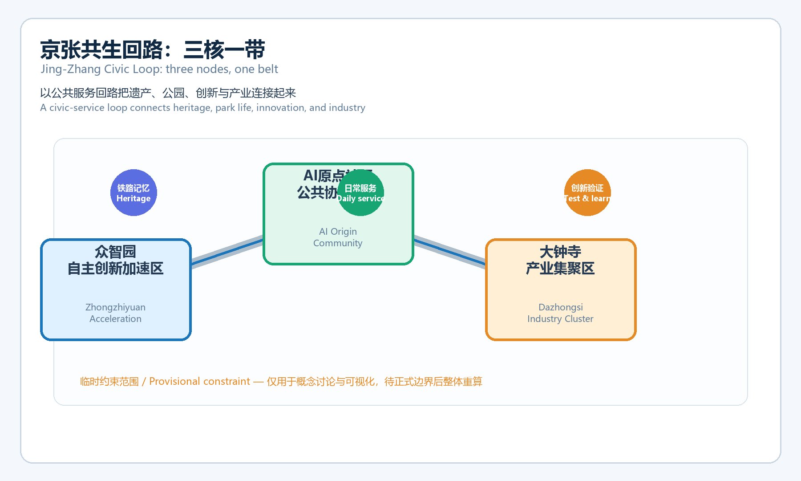
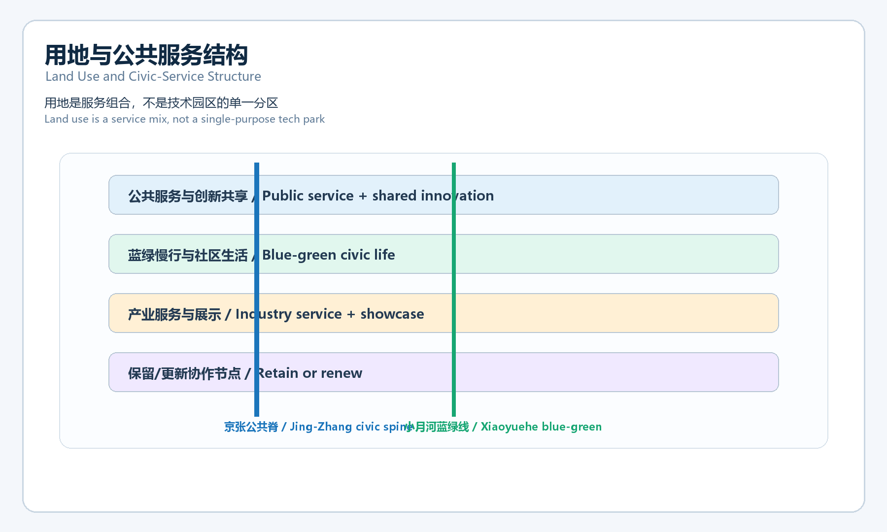
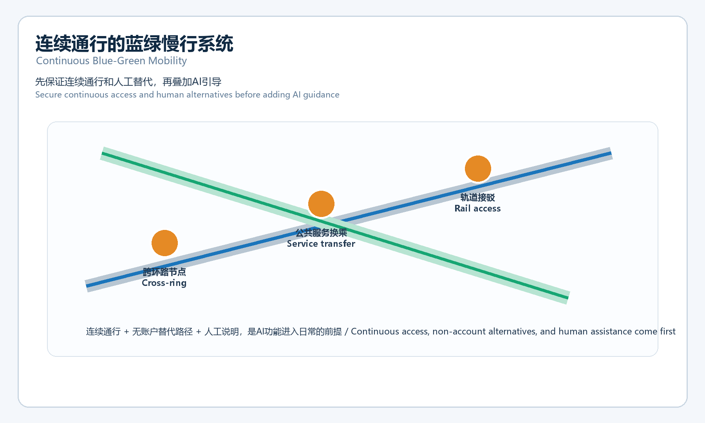
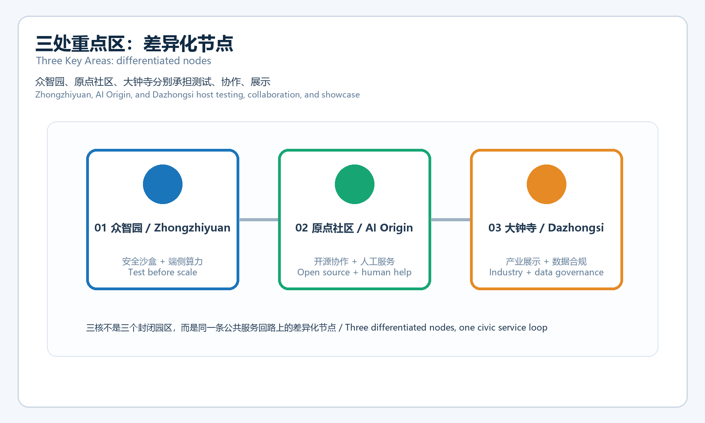
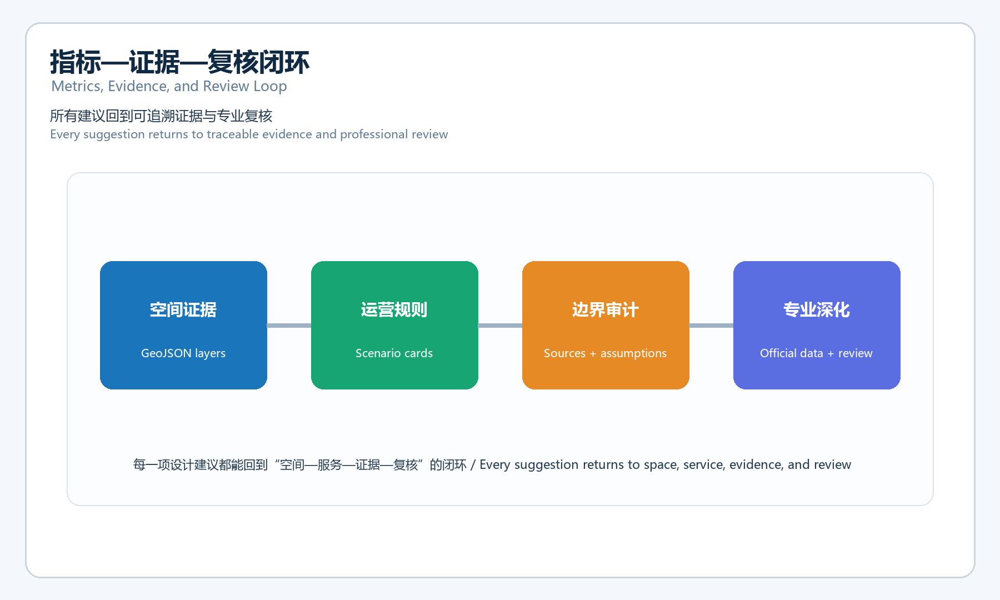

---
title: "Jing-Zhang Civic Loop: an AI innovation belt for everyday public services"
author_github: "wyq2722084642"
language: "zh"
proposal_format_version: "2"
bilingual_contract_version: "1"
translation_file: "proposal.en.md"
license: "COMMUNITY-DISPLAY-ONLY"
summary: "把百年铁路的自主建造精神转译为可进入、可退出、可复核的AI公共服务回路。"
tracks: ["ai-traffic-walkability", "enterprise-services-ecosystem", "civic-agent-governance"]
scenarios: ["ai-traffic-walkability", "enterprise-service-copilot", "public-safety-operations-review"]
---

# Jing-Zhang Civic Loop: an AI innovation belt for everyday public services

## 0. 一句话判断

本方案不把 AI 当成城市的装饰性“智能层”，而把它组织成一条可被普通人使用的公共服务回路：先保证连续通行、人工说明、无账户替代、退出和申诉，再叠加可解释的 AI 辅助。京张遗址公园是公共脊，众智园、北京 AI 原点社区、大钟寺 AI 产业集聚区是三个差异化节点；三核之间由蓝绿慢行和公共服务换乘串联。[source:OFFICIAL-ANNOUNCEMENT] [source:AGENT-TASKBOOK] [depth:overall_spatial_structure]

这是概念建议与参考方案，不是法定规划、政府审定、建设许可、招商承诺、采购方案或运营授权。公开资料没有提供正式 SITE_BOUNDARY 与 KEY_AREA 多边形，本包使用临时约束范围；正式数据到位后，所有几何、指标、图纸和网页必须整体重算。[data:geometry/site_boundary.geojson#SITE-001] [data:geometry/key_areas.geojson#PROV-KEY-001] [metric:site_area_sqm]

## 1. 设计依据、资料边界与三层范围

方案依据项目公告、智能体任务书、公开来源登记、站点资料包、临时边界和专业标准快照编制。正式可用的事实只来自已登记的公开或清权材料；临时几何只用于方案生成、空间讨论和自检，不用于法定红线、精确面积或控规结论。[source:SITE-PACKAGE] [source:SOURCE-REGISTRY] [standard:PROJECT-OFFICIAL-ANNOUNCEMENT]

三层范围采用同一套“公共服务回路”方法：

| 层级 | 公开资料中的尺度 | 本方案的空间判断 | 需要补齐的证据 |
| --- | --- | --- | --- |
| 统筹研究范围 | 约 43.6 km² | 用高校、企业、算力、人才、文化和公共服务建立创新网络 | 正式研究边界、现状产业与交通底数 |
| 总体设计范围 | 约 11.4 km² | 以京张遗址公园为公共脊，组织城市更新、产业服务、蓝绿慢行和新型基础设施 | 正式规划边界、权属、市政和道路资料 |
| 重点区域 | 约 368.4 ha，三处重点区 | 三核分别承担安全测试、开放协作、产业展示 | 三处正式 polygon、文保与控规条件 |

## 2. 总体概念、命名体系与视觉识别

主名称为“京张共生回路”，英文为 “Jing-Zhang Civic Loop”。“京张”保留铁路、工程和跨区域连接的记忆；“共生”强调人、社区、企业、专业团队与智能体共同校正；“回路”强调服务必须有入口、替代路径、人工接力、停止和反馈，而不是单向推送。

建议形成三层命名：

- 品牌层：京张共生回路 / Jing-Zhang Civic Loop；
- 空间层：一条京张公共脊、三核、两翼、多点场景；
- 服务层：开源发布厅、可信测试沙盒、公共服务换乘、数据治理展厅、AI 慢行导览等概念节点。

Logo 方向是“一条可回到原点的折线 + 三个开放节点”：折线引用铁路线路和回路，三个节点以不同颜色区分测试、协作、展示；不使用第三方字体、企业标识、人物肖像或未经授权的铁路图像。视觉基调采用深蓝、青绿、暖橙和纸白，表达工程理性、公共性和历史连续性。[source:AGENT-TASKBOOK]

三大定位是“百年京张文化带、都市 AI 生活体验带、AI 融合创新带”；五大功能是“AI 全栈自主创新体系、世界级 AI 创新生态、AI+ 场景赋能新范式、智能化 AI 活力城市、AI 治理全球话语权”。三区两翼协同为：北京 AI 原点社区负责开放协作，众智园负责自主创新与治理测试，大钟寺负责产业展示与服务接口；中关村科技服务翼提供高校、资本、知识产权、专业服务的连接，小月河场景赋能翼把实验转成日常公共体验。[depth:three_level_scope_framework] [data:geometry/key_areas.geojson#PROV-KEY-002]

## 3. 统筹研究范围：AI 创新生态与未来城市

生态不按企业名单或投资额做未经核实的排名，而按“能力要素—空间载体—公共回报”组织：高校与研究、开源协作、算力与数据、产品和产业服务、人才生活、公共场景、国际传播。可参考的全球生态类型包括研究型园区、开发者社区、产业测试区、城市服务实验室、数字公共基础设施、创客与教育网络；本方案不把案例中的制度、企业或资金直接移植为海淀事实。[source:AGENT-TASKBOOK] [standard:MOHURD-URBAN-DESIGN-MEASURES]

总体结构是“1 条公共脊 + 3 个创新核 + 2 条协同翼 + 10 类可复用场景”。空间上，把公共服务节点布置在轨道接驳、遗产公园、社区日常路径和产业展示接口的交汇处；运营上，用同一套证据卡片记录服务对象、数据边界、人工替代、停止条件和复核责任。

## 4. 总体设计范围：城市更新、用地、建筑和市政

### 4.1 用地与更新逻辑

用地结构是“公共服务与创新共享、蓝绿慢行与社区生活、产业服务与展示、保留/更新协作节点”的组合，而不是新增一个封闭园区。`land_use.geojson` 覆盖提交的临时边界，采用可校验用地分类表达；其面积、比例和分类仅是设计层复算，不替代法定规划。[data:geometry/land_use.geojson#LU-001] [standard:MNR-LAND-USE-CLASSIFICATION-GUIDE] [depth:land_use_layout]

建筑采用“保留优先、改造可逆、新建谨慎、拆除待核”的分类：有历史、社区或公共服务价值的建筑优先保留并改善首层可达性；改造建议先做轻量、可撤回的公共界面；新建只作为待专业团队深化的容量选项；没有权属、结构、文保和控规资料时，不作具体拆除或高度结论。[data:geometry/buildings.geojson#BLDG-001] [depth:retain_renovate_demolish]

容积率、总建筑面积、建筑高度、退线、道路红线、停车配建和工程管线均标为待正式数据补齐。城市设计深度用于说明空间关系、风貌导则和复核路径，不把概念指标写成已批准控制条件。[metric:floor_area_ratio] [standard:MOHURD-CONTROL-DETAILED-PLANNING] [depth:development_intensity_controls]

### 4.2 交通、轨道、慢行和蓝绿公共空间

交通策略是“连续通行优先”：围绕轨道接驳、京张遗址公园跨环路节点、社区入口、产业服务节点形成步行和骑行的连续网络；AI 导航只提供可解释的建议，不替代标识、人工询问和无障碍通行。停车、消防和市政管线待正式资料核验。[data:geometry/roads.geojson#ROAD-001] [depth:traffic_rail_slow_parking]

蓝绿系统把遗产公园、小月河、社区公共空间和产业开放界面连成复合环；设置遮阴、休息、夜间照明、低刺激导视和人工服务点。公共空间不是“屏幕广场”，而是可停留、可观察、可不使用 AI 的日常场所。[data:geometry/green_space.geojson#GREEN-001] [data:geometry/public_space.geojson#PUBLIC-001] [depth:blue_green_public_space]

### 4.3 市政与新型基础设施

提出“端侧优先、分级算力、公共接口、可断网运行”的参考原则：对低风险导览和公共信息采用本地缓存与端侧能力；对需要数据交换的服务建立最小化、可审计接口；不在未授权场地部署摄像、语音采集或生产系统接入。能源、消防、通信、排水、算力和机房条件均需专业核验。[depth:municipal_new_infrastructure]

## 5. 三处重点区域详细设计

### 5.1 众智园 AI 自主创新加速区：先测再扩

概念角色是可信测试与端侧算力的“安全沙盒”。空间建议包括可预约的测试房、低干扰展示廊、设备维护与人工服务台、面向高校和初创团队的共享验证空间。所有测试都要有授权、时间范围、数据清单、故障停止和人工复核；不承诺算力供给、招商、投资或政府采购。[data:geometry/key_areas.geojson#PROV-KEY-001] [depth:three_key_area_detailed_design]

### 5.2 北京 AI 原点社区：让普通人能参与

概念角色是开源发布、居民反馈和跨代协作的“公共客厅”。建议配置开源发布厅、无账户公共终端、人工解释台、社区工作坊、安静空间和可撤回的试用点。居民可以不使用 AI，或要求人工说明；任何原型都应先说明用途、数据和退出方式，不以个人行为轨迹做商业推荐。[data:geometry/key_areas.geojson#PROV-KEY-002] [depth:three_key_area_detailed_design]

### 5.3 大钟寺 AI 产业集聚区：把产业展示变成公共接口

概念角色是产业服务、数据治理展示和国际交流的“接口”。建议以可审计案例展廊、企业服务前台、人才会客厅和公共交通接驳空间形成首层开放界面；企业案例、商标、产品、数据和国际合作均须逐项清权，不写成已入驻企业或招商结果。[data:geometry/key_areas.geojson#PROV-KEY-003] [depth:three_key_area_detailed_design]

## 6. AI+ 场景卡、用户画像与产业验证

### 6.1 十张场景卡

1. **开源发布厅**：发布代码、模型说明和失败复盘；不采集身份轨迹。
2. **可信测试沙盒**：展示测试协议、红队结果和暂停条件；不连接生产系统。
3. **端侧算力驿站**：提供低风险本地推理体验；断网仍可使用普通信息服务。
4. **AI 慢行导览**：提供多语言、低刺激路线建议；保留纸质图和人工问路。
5. **遗产口述工作坊**：由授权参与者提供故事；不把合成声音当作历史原声。
6. **清河低碳创新廊**：解释雨洪、遮阴、骑行和能源关系；不虚构环境绩效。
7. **成果转化驿站**：连接高校成果与专业服务；不承诺融资、专利或转化结果。
8. **数据要素会客厅**：展示授权、用途和审计链；不展示个人或敏感数据。
9. **社区服务样板街**：把生活服务做成可人工办理的小尺度接口；不强制扫码。
10. **全球 AI 公共路线**：以开放活动和公共展陈串联三核；活动日期与参与者待确认。

### 6.2 五类用户画像

开源开发者需要发布、协作和可复现实验；初创团队需要低成本测试、人工合规咨询和端侧算力入口；周边居民需要通勤、休闲、社区服务和不使用 AI 的选择；高校师生需要成果转化、跨校协作和安静学习空间；头部企业与国际访客需要可审计展示、轨道接驳、人工接待和公共规则说明。画像是设计工具，不是对真实人口的统计结论。[depth:overall_spatial_structure]

### 6.3 三个产业测试/验证场景

- **T1 公共服务可达性测试**：在原点社区比较 AI 导览、纸质导视和人工说明三条路径，记录完成任务所需的匿名汇总，不记录个体轨迹；任一群体无法完成即暂停。
- **T2 端侧模型与低碳运行测试**：在众智园比较本地运行、延迟、能耗和故障恢复，结果只作为概念验证；不形成部署许可或性能承诺。
- **T3 数据授权与产业展示测试**：在大钟寺用清权的合成数据演示授权链、撤回和审计；不展示真实个人信息，不将演示结果写成合规认证。

## 7. AI 公共空间、朝圣地标与文化叙事

三个 AI 朝圣地标是概念性公共节点：**“第一条路”京张开工记忆门**，讲自主建造与公共工程；**“共同校正”原点代码墙**，展示经授权的开源贡献和失败复盘；**“可回到原点”共生环广场**，把三核、蓝绿线和年度公共活动汇成可步行路线。地标不是纪念设施批复或企业荣誉墙，具体形式须经文保、风貌、公共艺术和权利审查。[source:AGENT-TASKBOOK] [depth:blue_green_public_space]

文化叙事采用“詹天佑的自主建造—中关村的开放创新—AI 时代的公共共创”三段式，不把历史人物、铁路设施、企业和社区故事做未经授权的再现。所有展陈内容应能被普通人理解，并允许不观看、不扫码、不提供数据。

## 8. 全球活动体系、社区运营与分期

建议形成四类长期活动：季度“问题季”公开真实公共问题；季度“开源季”发布可复用工具和失败记录；年度“城市 Beta 季”进行经授权的低风险体验；年度“Proof Week”展示证据链而非广告。无活动日、普通日、静音时段和故障状态同样被设计，公共服务不能只在节庆时存在。

分期采用“先公开、后测试、再深化”：

- **P0 资料与授权**：补齐正式边界、重点区、权属、文保、交通、市政和运营责任；不满足条件不进入现场。
- **P1 轻量公共体验**：先做纸质导视、人工服务、可撤回的展陈和开放讨论，验证连续通行与可理解性。
- **P2 受控验证**：由专业团队和权利主体确认后，在三核分别开展 T1-T3，设置暂停、申诉、退出和事故复盘。
- **P3 深化与退役**：只有在证据充分且公共价值明确时，才研究长期空间与基础设施；无法证明价值的功能保留公共知识并退役。

`phasing.geojson` 只表达参考顺序，不构成时间、预算、责任主体或实施承诺。[data:geometry/phasing.geojson#PHASE-001] [depth:phasing_implementation]

## 9. 指标、面积复算、标准响应与合规

当前提交范围复算面积约 11,412,825 平方米；绿地比例约 12.34%，公共空间比例约 7.33%，重点区数量为 3。这些数值来自临时设计层，只能说明包内几何关系，不能代替法定规划指标；容积率等控制指标保持“待正式数据补齐”。所有已知指标、公式、来源文件、置信度和假设均在 `metrics.json`，专业标准逐条映射在 `standard_matrix.json`，深度项在 `design_depth_matrix.json`。[metric:green_ratio] [metric:public_space_ratio] [depth:metrics_recalculation]

本包的合规矩阵覆盖公告 1.3、1.4、1.5 及 `agent.1`—`agent.6`：命名与总体结构、AI 生态、场景卡和用户画像、公共空间与地标、文化叙事、全球活动与长期运营均有正文、图层、指标或图纸落点。标准响应区分公告要求、城市设计管理、控规深度、用地分类和资料缺口；建筑工程设计深度文件当前仅作待补资料，不伪装成正式依据。[source:AGENT-TASKBOOK] [standard:MOHURD-ARCH-DESIGN-DEPTH-2016] [depth:risk_missing_data]

## 10. 风险、版权、法律边界与下一步

最大风险是临时边界和基础资料不足导致的精度误读；其次是把概念 AI 场景误认为已部署服务，把生成图像误认为现状或建成效果，把企业或活动建议误认为承诺。处理方式是低对比显示临时范围、明确“待正式数据补齐”、保存可重算公式、保留人工和非 AI 路径，并要求专业团队核验道路、管线、权属、文保、消防、无障碍、数据安全和运营责任。[data:geometry/constraints.geojson#CONSTRAINTS] [depth:risk_missing_data]

本包不使用个人数据、私密地图、未经授权的企业标识、人物肖像、声音、音乐或第三方图片。图件、HTML、GeoJSON 和 PDF 为本次投稿的概念表达；它们不代表政府、规划机构、企业或居民的正式意见。下一步是建立 fork、运行完整自检、提交只包含本方案目录的 PR，并根据维护者与专业团队反馈迭代；任何现实落地都必须重新取得正式资料、专业判断、权利授权和法定审批。

## 11. 提交状态

本地包目标为 `package_type=professional_design_package`、`package_state=ready_for_review`、`proposal_format_version=2`、`bilingual_contract_version=1`。正式自检前不宣称通过；GitHub PR 合并也不等于专业批准、公共服务上线或工程实施。[source:SITE-PACKAGE]
