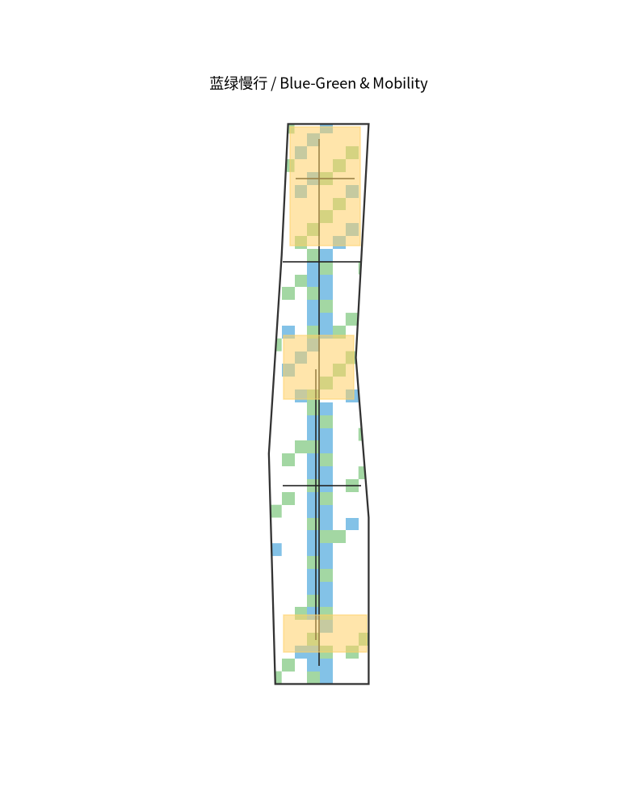
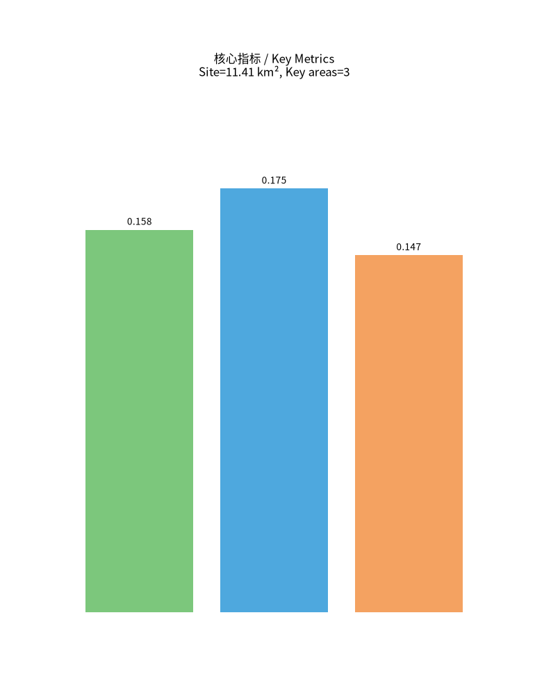

# Centennial Jing-Zhang AI Innovation Belt: From Railway Heritage to an AI-Native Living Corridor

## Design Basis and Source List

This formal proposal takes as its primary basis the pre-qualification announcement for the International Design Competition of the Centennial Jing-Zhang AI Innovation Belt, issued by the Haidian Branch of the Beijing Municipal Commission of Planning and Natural Resources, and uses the maintainer-registered provisional boundary, key areas, enums, metrics and source lists under `brief/site-package/` as machine-readable evidence. Before generating the scheme, the AI agent must read `design_brief.json`, `allowed_design_space.json`, `sources.json`, `enums/`, `ranges/`, `schemas/`, `data/source_registry.json` and `data/processed/agent_fact_pack.md`, and use `project_scope_summary.csv`, `agent_task_requirements.csv`, `source_use_matrix.csv` and `missing_data_checklist.csv` to build the task, scope, source-use and gap inventories. Every design judgement is decomposed into traceable sources, recalculable metrics, verifiable layers and human-reviewable assumptions. The announcement requires urban-design depth at the regulatory-plan level and at the planning-implementation scheme level, so narrative alone cannot replace GeoJSON, the metrics table, the A3 booklet, the A0 boards and the HTML deliverables.

The proposal is not an isolated vision text; it is organized from the announcement, the agent open-call taskbook and the site package. This section places only the most critical evidence beside the judgement [source:OFFICIAL-ANNOUNCEMENT] [source:AGENT-TASKBOOK] [depth:existing_conditions_diagnosis]. Full source and standard coverage is kept in `sources.json`, `standard_matrix.json` and `design_depth_matrix.json`.

The data registry governs the use boundary of public, cleared and provisional material. The agent must not promote background-only or provisional-only material to official boundary, statutory regulatory plan, formal scoring basis or government implementation commitment.

`data/processed/agent_fact_pack.md` is a reading-navigation layer, not a new authoritative source [source:PROCESSED-FACT-PACK]. Factual judgements still return to the registered raw materials [source:OFFICIAL-ANNOUNCEMENT] [source:AGENT-TASKBOOK].

Where the official `SITE_BOUNDARY` or three `KEY_AREA` polygons are not yet available, this package uses `brief/site-package/geometry/provisional_boundaries.geojson` to generate a provisional formal package. Both `geometry/site_boundary.geojson` and `geometry/key_areas.geojson` must be flagged `provisional_constraint`, `official_boundary=false`, usable only for generation, self-check, visualization and discussion, not as official redline, approval basis, precise-area basis or statutory control conclusion. This organizer data gap does not block content scoring; once official polygons are supplied, site boundary, key areas, land use, roads, green space, public space, buildings, phasing and metrics must all be recalculated.

The scorable state of this scaffold is: provisional boundary, with precision caveats retained and recalculation pending official data; content scoring is not blocked. Spatial structure, scenarios, projects and metrics are therefore written as discussable, reviewable and replaceable after official boundaries; once official boundaries and key-area polygons are updated, the agent must re-run the scaffold, the self-check and the drawing/HTML generation, not merely replace a single file.

Boundary interpretation returns to the overall scope layer and area recalculation [data:geometry/site_boundary.geojson#SITE-001] [metric:site_area_sqm]. The three key areas are checked against an independent layer and a count metric [data:geometry/key_areas.geojson#PROV-KEY-001] [metric:key_area_count].

## Three-Level Scope Framework

The scheme follows the three tiers defined by the announcement: the coordinated research scope (43.6 km²) addresses the AI industry ecosystem, strategic positioning, innovation chain and future urban form; the overall design scope (11.4 km²) around the Jing-Zhang heritage park addresses the urban-renewal framework, industry spatial layout, transport/municipal support and urban-character control; the key-area scope (368.4 ha across three sites) requires explicit function, building scale, retain-renovate-demolish classification, public-space connectivity and transport organization. The three tiers are mapped task-by-task in `compliance_matrix.json` so that every required announcement task (1.3, 1.4, 1.5) and agent task (agent.1–agent.6) has a section, layer, metric, drawing and HTML evidence.

The depth items of the three-level framework are constrained by [depth:three_level_scope_framework] and [depth:overall_spatial_structure]; spatial evidence follows [data:geometry/site_boundary.geojson#SITE-001] and [data:geometry/key_areas.geojson#PROV-KEY-001]; task basis follows [standard:PROJECT-OFFICIAL-ANNOUNCEMENT]; scope index follows `project_scope_summary.csv` in [source:PROCESSED-FACT-PACK].

The three levels are not separate drawing sets. Coordinated research decides the innovation-chain and city-form judgement; overall design lands it in renewal projects, spatial structure and facility capacity; key-area detailed design validates concrete parcels, buildings, transport, public space and AI scenarios. The agent must first lock the official or provisional boundary and constraints adopted by this submission, then generate land use, buildings, roads, green space, public space, phasing and AI service nodes, and finally recalculate metrics from those layers and explain in the text which conclusions remain limited by the provisional boundary. Any area, ratio, scale or project count that cannot be recalculated from structured data must not be written as a formal conclusion.

The proposed overall concept is "Jing-Zhang Intelligent-Pulse Symbiosis Belt": the Jing-Zhang heritage park as the historical and public-space main axis, the three key areas (Zhongzhiyuan, Beijing AI Origin, Dazhongsi) as innovation anchors, and universities, enterprises, communities and rail stations as the everyday network, forming a spatial organization of "one belt, three cores, multiple scenario nodes, blue-green slow-traffic composite ring". The "belt" is not a newly drawn redline but a translation of the three tiers into a working method; the "three cores" map to the three key areas; "multiple scenario nodes" map to operable nodes of AI+ public services, enterprise services and urban life; the "composite ring" links slow traffic, green space, public space and activity routes.

## Coordinated Research Area: Industry and Future City Research

The core task of the coordinated research scope is to build a world-class AI innovation ecosystem. The scheme reviews Haidian universities and institutes, leading enterprises, compute/algorithm/data factors, incubation platforms, listed companies, unicorns and technology-service resources, and proposes a spatial collaboration framework for the AI innovation chain, industry chain, talent chain and city-service chain. Naming and logo design must serve the overall identity of "Centennial Jing-Zhang Culture Belt, Urban AI Living-Experience Belt, AI Fusion-Innovation Belt", not remain a slogan; they must explain their link to the industry ecosystem, public space and cultural resources. The agent open-call taskbook also requires a response to the "five major functions" and "three zones, two wings" coordination, forming a nameable system, visual identity, overall spatial-structure diagram, scenario opening and operation mechanism; this section must mark, with [source:AGENT-TASKBOOK] and [standard:PROJECT-AGENT-OPEN-CALL-TASKBOOK], that these requirements come from the agent open call, not from statutory planning control.

Coordinated research adds no pseudo-precise redlines; through the urban character, public space and building-layout coordination required by [standard:MOHURD-URBAN-DESIGN-MEASURES], it reconnects to [data:geometry/land_use.geojson#LU-001], [data:geometry/public_space.geojson#PUBLIC-001] and [depth:overall_spatial_structure], showing that industry strategy ultimately lands in visible, reviewable spatial structure.

This proposal responds task-by-task to the six agent open-call deliverables agent.1–agent.6: agent.1 proposes the overall belt concept "Jing-Zhang Intelligent-Pulse Symbiosis Belt" with a naming, logo and positioning system (one belt, three cores, multiple scenario nodes, composite ring); agent.2 builds an AI full-stack autonomous-innovation ecosystem with six ecosystem-collaboration cases (university origination, open-source collaboration, enterprise translation, public experience, international standards, talent zone); agent.3 forms ten AI+ scenario cards, three industry test-validation scenarios and five talent personas; agent.4 designs four AI pilgrimage landmarks (Tsinghua-Yuan station heritage landmark, Jing-Zhang heritage-park slow-traffic landmark, Dazhongsi international roadshow lounge, Zhongzhiyuan standards-governance showroom); agent.5 fuses Centennial Jing-Zhang, Zhongguancun and AI-new-culture into a narrative system and wayfinding symbols; agent.6 proposes a Global AI Innovation Week and a long-term operation framework. All deliverables are written into the text, HTML, A3/A0 and compliance matrix, expressed as conceptual proposals / reference schemes, never as confirmed government arrangements [source:AGENT-TASKBOOK]. Naming and visual identity serve the overall identity of the three belts and link to the industry ecosystem, public space and cultural resources rather than standing alone as slogans.

Future-city-form research must answer how AI changes work, life, socializing, learning, transport and public services. The scheme lands AI transport systems, continuous green space, innovation-service facilities and an international living-working atmosphere as locatable function zones, nodes, corridors and scenarios, not vague technological vision. The agent writes industry-strategy metrics, AI innovation index, talent density, spatial-supply types and AI+ vertical-application focus zones into the metrics system, marking which are official, which are design suggestions, and which still await formal-data calibration. Global AI innovation events, developer communities, open scenarios or pilgrimage routes, if proposed, are written as "conceptual proposal / reference scheme / for professional teams to deepen", never as confirmed government activities or implementation arrangements.

## Overall Design Area: Urban Renewal and Regulatory-Plan-Level Urban Design

The overall design scope requires urban-design depth at the regulatory-plan level. The scheme must propose the urban-renewal overall spatial structure, low-efficiency-space identification, renewal-project list, implementation-policy suggestions, industry-function ratio, spatial-organization mode, total building scale and comprehensive carrying-capacity assessment. `geometry/land_use.geojson` must fully cover the design boundary with no overlap; `geometry/buildings.geojson` must express renewed or retained building footprints; `geometry/roads.geojson` must express micro-circulation, slow traffic and rail connection; `metrics.json` must recalculate core areas, ratios and layer counts.

This section decomposes the regulatory-plan-level content using [standard:MOHURD-CONTROL-DETAILED-PLANNING]: [data:geometry/land_use.geojson#LU-001] expresses land-use structure, [data:geometry/buildings.geojson#BLDG-001] expresses building footprints, [data:geometry/roads.geojson#ROAD-001] expresses transport organization, [metric:building_footprint_area_sqm] reviews building-footprint area, [depth:land_use_layout] and [depth:development_intensity_controls] constrain the result depth.

Overall design must also support transport, rail, municipal and public-service facilities. The scheme proposes spatial layout and implementation paths for rail-station integration, road micro-circulation, non-motorized parking, parking supply, innovation-service platforms, talent living services, new infrastructure, distributed energy and edge compute. Where building height, development intensity, road redline, setback and facility standards lack official conditions, they are written as "pending formal regulatory-plan conditions", never as agent-inferred values masquerading as approved metrics.

## Detailed Design of Key Areas

Key-area detailed design is mandatory. The Zhongzhiyuan AI autonomous-innovation acceleration area centers on the national AI platform, full-stack autonomous innovation, standards, safety governance, industry showcase, external transport, Qinghe culture, low-carbon green innovation interaction and green-space AI scenarios. The Beijing AI Origin community centers on near-campus innovation, achievement incubation and translation, talent zone, open-source system, brand events, building retain-renovate-demolish, achievement showcase and release, living amenities, campus-park slow-traffic linkage and rail-station integration. The Dazhongsi AI industry cluster centers on leading enterprises, agents, intelligent terminals, content consumption, data factors, digital assets, commercial services, planned-green-space composite use, Dazhongsi-station integration and four-quadrant pedestrian connectivity.

The three key areas must be referenced by [data:geometry/key_areas.geojson#PROV-KEY-001], [data:geometry/key_areas.geojson#PROV-KEY-002], [data:geometry/key_areas.geojson#PROV-KEY-003], and checked by [depth:three_key_area_detailed_design] for planning-implementation-scheme depth. Describing only "build a demonstration zone" without function, building, transport, public-space and implementation evidence is treated as incomplete.

The three key areas must appear in `geometry/key_areas.geojson`. If the repository provides official polygons, use them as `official_constraint`; if not, use `provisional_constraint`, but the text, HTML, sources, assumptions and self-check must state it cannot be an official scoring or approval basis. `compliance_matrix.json` covers announcement tasks 1.5.3.1, 1.5.3.2, 1.5.3.3. Design expression should include function, building scale, building form, retain-renovate-demolish classification, public-space system, transport organization, slow-traffic connectivity and implementation projects. The HTML must switch among the three key areas; the A3 booklet and A0 boards must include at least key-area master plans, detail drawings and metric notes.

| Key area | Positioning | Spatial move | AI industry & operation scenario | Evidence |
| --- | --- | --- | --- | --- |
| Zhongzhiyuan AI autonomous-innovation acceleration area | Garden-type full-stack autonomous-innovation block | Strengthen Qinghe frontage, industry showcase, low-carbon innovation interaction, external transport; use green space for open testing and standards-governance showcase | Autonomous-model testing, standards workshops, safety-governance showcase, low-carbon compute experience | [data:geometry/key_areas.geojson#PROV-KEY-001] [depth:three_key_area_detailed_design] |
| Beijing AI Origin community | Near-campus achievement-translation and talent community | Stitch campus-park-district slow traffic; add release, talent-service, living and open-source collaboration space | Open-source community, achievement release, talent-zone service, near-campus incubation | [data:geometry/key_areas.geojson#PROV-KEY-002] [source:AGENT-TASKBOOK] |
| Dazhongsi AI industry cluster | Urban intelligent-economy and international-exchange block | Dazhongsi-station integration, four-quadrant pedestrian connectivity, commercial service and key-enterprise public-environment renewal | Agent and intelligent-terminal showcase, content consumption, data factors and international roadshow | [data:geometry/key_areas.geojson#PROV-KEY-003] [metric:key_area_count] |

## AI Innovation Ecosystem, Personas, and AI+ Scenarios

The scheme builds spatial-demand personas for AI talent and enterprises, covering R&D office, open-source collaboration, achievement release, enterprise service, talent housing, social learning, consumption, sports and international exchange. AI+ scenarios follow the announcement directions (transport, service, consumption, health, education, law, living service), forming industry-development scenarios and AI-enabled city-function scenarios. Each scenario states service object, spatial location, data source, privacy boundary, human-review mechanism and operating entity.

AI scenarios must land in spatial and governance boundaries: public-space scenarios reference [data:geometry/public_space.geojson#PUBLIC-001], slow-traffic and transport scenarios reference [data:geometry/roads.geojson#ROAD-001], open-space scenarios reference [data:geometry/green_space.geojson#GREEN-001] and [metric:public_space_ratio], [metric:green_ratio]. These references tell reviewers the scenarios are not slogans but design objects located in specific layers and metrics. The agent open-call taskbook requires at least ten AI scenario cards, at least three industry test-validation scenarios and at least five user personas; this package writes the scenario cards, persona table, privacy boundaries, human review and operating entities into the text, HTML, A3/A0 and compliance matrix.

| Persona | Typical need | Spatial response | Self-check boundary |
| --- | --- | --- | --- |
| Open-source developer | Release, collaborate, test, community reputation | Origin-community release hall, public code wall, night collaboration space | No personal trajectory collection; activity data aggregated only |
| Startup team | Low-cost office, compute entry, product testbed | Zhongzhiyuan shared test field, edge-compute service point, standards-governance consult | Compute and data services need separate authorization |
| Leading-enterprise visitor | Showcase, business, international reception, recruitment | Dazhongsi international roadshow lounge, rail-station connection, key-enterprise public space | Enterprise logos and cases must be cleared |
| Nearby resident | Commute, leisure, community service, low-disturbance renewal | Jing-Zhang heritage-park slow-traffic ring, embedded community service, graded night lighting and events | No resident persona used for commercial recommendation |
| University student/teacher | Achievement translation, cross-campus collaboration, daily slow traffic | Campus-park slow-traffic stitch, translation station, AI-education experience point | Campus data and research results need authorization |

| Scenario card | Spatial carrier | Design note |
| --- | --- | --- |
| 01 Open-source release hall | Beijing AI Origin community | For universities, open-source communities and startups: achievement release, code-contribution showcase, small roadshow |
| 02 Safety-governance sandbox | Zhongzhiyuan | Translate standards, safety evaluation, model red-team testing into visitable, bookable, supervised showcase and collaboration nodes |
| 03 Edge-compute station | Overall-design-scope nodes | Combined with public, enterprise and low-carbon-energy strategy as a new-infrastructure prototype for deepening |
| 04 AI slow-traffic navigation | Jing-Zhang heritage-park vitality belt | Explainable wayfinding and low-intrusion sensing to find slow-traffic breakpoints, crowding nodes and accessibility needs |
| 05 Dazhongsi international roadshow lounge | Dazhongsi AI industry cluster | Showcase, negotiation, media release and international exchange for agents, intelligent terminals and content-consumption enterprises |
| 06 Qinghe low-carbon innovation corridor | Zhongzhiyuan Qinghe frontage | Combine green space, storm-water, walking-cycling and AI showcase as a park public living-room |
| 07 Near-campus achievement-translation street | Beijing AI Origin community | For university achievement translation: incubation, showcase, legal, IP and investment-finance services |
| 08 Data-factor lounge | Dazhongsi area | Compliant, authorized, auditable urban-service interface showing data-factor and digital-asset circulation |
| 09 AI living-service model street | Community-commercial interface | Land medical, education, law, living-service AI+ scenarios in operable small-scale block space |
| 10 Global AI event-week route | Belt public-space system | Walkable, communicable experience route from heritage culture, open-source community, industry showcase to international roadshow |

Agent-generated AI-governance suggestions must follow data-minimization, open-source, explainability and human-review principles. City agents may assist in identifying slow-traffic breakpoints, public-space heat, facility maintenance, enterprise-service demand and event-safety risk, but cannot replace planning approval, cannot output unauthorized personal personas, and cannot claim official implementation commitment. All AI scenario nodes should enter structured layers or the compliance matrix so reviewers see their relation to industry, space and public interest.

## Land Use, Building Scale, and Retain-Renovate-Demolish Strategy

Land use must follow public standards such as territorial spatial survey, planning and use-regulation classification, forming a complete, closed, seamless land-use partition. Building strategy distinguishes retained, renovated, renewed, new or to-be-confirmed objects, stating footprint, function, scale, character, roof, massing and height-control suggestion levels. Where current buildings, ownership, regulatory plan and engineering conditions are missing, the scheme can only propose method and a to-be-calibrated list, not fabricate retain-renovate-demolish conclusions.

Land-use classification follows [standard:MNR-LAND-USE-CLASSIFICATION-GUIDE]; building height, massing, interface and character control are managed by [depth:height_massing_character]; retain-renovate-demolish method by [depth:retain_renovate_demolish]. Main evidence is [data:geometry/land_use.geojson#LU-001], [data:geometry/buildings.geojson#BLDG-001] and [metric:building_footprint_area_sqm].

Building scale and intensity metrics must match `metrics.json` and the layers. Where total building scale, floor-area ratio, building height, building density, green ratio, setback and building-control line lack official conditions, uniformly use `status=unknown` with `reason` / `assumptions` stating pending conditions, current assumptions and recalculation path after official data, never fabricating precise values. The A3 booklet gives the renewal-project list and metric-review table; the A0 boards express key spatial structure and key areas; the HTML links metrics and layers.

## Transport, Rail, Municipal Infrastructure, and Public Services

Transport must respond to the announcement requirements for rail-station integration, road micro-circulation, slow-traffic breakpoints, external transport, parking, non-motorized parking and green-transport systems. It must cover the North 5th Ring Road, the Jing-Zhang heritage-park cross-ring-node, Wudaokou, Qinghua-Donglu-Xikou, Dazhongsi station and key-enterprise transport links. Road and slow-traffic layers must stay within the submission boundary and cross-check with public space, green space, industry nodes and key areas; if the boundary is provisional, transport conclusions are provisional design discussion only.

Transport and municipal professional depth are constrained by [depth:traffic_rail_slow_parking] and [depth:municipal_new_infrastructure]; layer evidence references [data:geometry/roads.geojson#ROAD-001], [data:geometry/public_space.geojson#PUBLIC-001] and [data:geometry/constraints.geojson#CONSTRAINTS]. Where road redline, pipelines, fire and municipal conditions are missing, state them as pending in assumptions rather than write strategy as approved conditions.

Municipal and public-service facilities must cover AI industry-service facilities, innovation-service platforms, talent living-service facilities, new infrastructure, distributed energy, edge compute and traditional municipal fusion. The scheme states facility standards, spatial layout, service radius, operation mode and phasing logic. Where pipeline, energy, drainage, flood, fire and other engineering data are missing, list them as formal-deepening prerequisites.

## Blue-Green Network, Public Space, and Urban Character

The blue-green scheme takes the Jing-Zhang heritage-park vitality belt as the backbone, coordinates Qinghe, Xiaoyuehe, surrounding universities, enterprises and communities, and proposes a north-south connected, east-west linked system of trails, cycleways and green space. It identifies slow-traffic breakpoints, over-ring nodes, park south and north landscape nodes, and proposes parking, sports, innovation interaction, tech testing, application showcase and public-service composite-use strategy.

Blue-green public space is cross-checked by the design-depth item and the green-space and public-space layers [depth:blue_green_public_space] [data:geometry/green_space.geojson#GREEN-001] [data:geometry/public_space.geojson#PUBLIC-001]. Green and public-space ratios are explained in the text for design meaning; full recalculation is in `metrics.json`; urban character, public space and building-control coordination return to the professional standard matrix [standard:MOHURD-URBAN-DESIGN-MEASURES].

Four AI pilgrimage landmarks are designed: (1) Tsinghua-Yuan station railway-heritage landmark, reusing the historic station as an AI-heritage interface; (2) Jing-Zhang heritage-park slow-traffic landmark, a walkable spine connecting the three cores; (3) Dazhongsi international roadshow lounge, an intelligent-economy exchange living-room; (4) Zhongzhiyuan standards-governance showroom, a visitable standards and safety-governance exhibition. All are conceptual proposals / reference schemes, with cleared sources required for any brand, font, image, portrait or enterprise logo.

Urban character fuses Jing-Zhang railway history, Zhongguancun innovation culture and AI innovation culture, using cultural resources such as the Tsinghua-Yuan station and Beijing Film Academy to propose urban tone, building character, roof form, massing, interface and public-art guidance. The agent also proposes wayfinding, cultural symbols, international-communication narrative, AI pilgrimage landmarks, contribution wall or honor system, but all brands, fonts, images, portraits and enterprise logos must have cleared sources. Character control distinguishes official control, design suggestion and to-be-confirmed condition; no pseudo-precise control lines without heritage or regulatory-plan basis.

## Renewal Projects, Implementation Policy, and Phasing

The implementation scheme forms a reviewable renewal-project list stating project location, type, function, responsible entity, dependency, phase, risk and evaluation metric. Policy suggestions cover urban-renewal coordinated implementation, spatial supply, operation mechanism, industry service, public participation, data governance and property-right coordination. `geometry/phasing.geojson` expresses phasing scope; `compliance_matrix.json` links each task to phasing and drawings.

Project list and phasing depth are managed by [depth:renewal_project_list] and [depth:phasing_implementation]; phasing spatial evidence is [data:geometry/phasing.geojson#PHASE-001]. Without ownership, funding, implementing entity and approval path, the scheme must write it as implementation risk, not a landing commitment.

| Project | Name | Type | Main dependency | Evidence |
| --- | --- | --- | --- | --- |
| JZ-01 | Jing-Zhang heritage-park slow-traffic breakpoint stitch | Public space / transport | Road redline, under-bridge space, transport review | [data:geometry/roads.geojson#ROAD-001] |
| JZ-02 | Zhongzhiyuan Qinghe innovation frontage | Blue-green / industry showcase | River blue line, ecology and flood conditions | [data:geometry/green_space.geojson#GREEN-001] |
| JZ-03 | Origin-community near-campus translation street | Urban renewal / industry service | Campus boundary, ownership, ground-floor use | [data:geometry/buildings.geojson#BLDG-001] |
| JZ-04 | Dazhongsi-station four-quadrant pedestrian connectivity | Rail integration / slow traffic | Rail station, intersection, municipal pipeline | [data:geometry/public_space.geojson#PUBLIC-001] |
| JZ-05 | AI public service and edge-compute nodes | New infrastructure / public service | Energy, compute, safety and operating entity | [data:geometry/constraints.geojson#CONSTRAINTS] |
| JZ-06 | Global AI event-week public route | Operation / brand | Public-space permit, event safety, copyright clearance | [data:geometry/phasing.geojson#PHASE-001] |

Phasing must be distinguished from the 100-day competition design cycle: the competition cycle is the time requirement for submitting results; implementation phasing is the advancement path of urban renewal and project construction. The scheme proposes near-term pilot, mid-term renewal and long-term governance, marking what can start with light facilities, operation activities and service platforms, and what must wait for formal regulatory plan, municipal, transport and ownership confirmation. For the annual-event system, developer-community operation, scenario open days, public-experience routes and international-communication mechanism, the text states operation object, frequency, responsibility boundary, translation path and risk, never mere slogans. The annual operation framework includes: Global AI Innovation Week (once a year), monthly open-scenario days, quarterly developer community meetups, and a continuously operated public-experience route.

## Metrics, Area Recalculation, and Compliance Matrix

The metrics system must at least include overall-design-scope area, key-area area, green and public-space ratios, building footprint, renewal-project count, AI scenario nodes, slow-traffic connectivity, industry-space metrics, talent-service metrics and self-check status. All known metrics must be recalculable from GeoJSON or trusted sources; unknown metrics must give reason and formal-submission prerequisite. The results of `scripts/spatial_review.py` and `scripts/visual_review.py` are important evidence for formal self-check.

Metric recalculation follows the unified design-depth requirement [depth:metrics_recalculation]. The text explains design meaning, e.g. how the overall scope constrains spatial allocation and how blue-green and public-space ratios support daily interaction; full values, formulas, source files and confidence are in `metrics.json`. Example key metrics are reviewed by overall scope and green data [metric:site_area_sqm] [data:geometry/green_space.geojson#GREEN-001].

The compliance matrix is the master file for task responsiveness. Every announcement task and agent-taskbook task must map to a report section, layer, metric, drawing, HTML page, source, assumption and self-check item. Failure to cover any required announcement task (1.3, 1.4, 1.5) or agent task (agent.1–agent.6) blocks entry to formal professional scoring.

For formal deepening, the agent also classifies each metric into three types: type one, spatial metrics directly recalculable from submitted geometry (boundary area, green ratio, public-space ratio, building footprint area, phasing area); type two, control metrics needing official regulatory plan or taskbook appendix (floor-area ratio, building height, building density, setback, road redline, facility standard); type three, performance metrics needing continuous operation or industry data calibration (AI innovation index, talent density, industry-service satisfaction, slow-traffic accessibility, event participation, scenario usage frequency). The three types enter `metrics.json`, `assumptions.json` and `compliance_matrix.json` respectively, avoiding mistaking operation vision as approved planning condition.

## Risk, Copyright, and Compliance

Bilingual delivery is required. The main proposal file may be Chinese or English, but a complete counterpart translation must be provided via `proposal.en.md` or `proposal.zh.md`; A3/A0, HTML and text-bearing drawings must also provide corresponding-language copies, preferring the event-recommended translations in `docs/terminology-glossary.md`. A v2 package missing any required translation, language mapping or valid file blocks submission at finalize and CI. All image, drawing, icon, data and code assets must state source, license and authorization status in `sources.json` or `report/copyright_statement.md`. HTML pages must not load remote scripts, remote map tiles, remote fonts, iframes, forms or external APIs, and must not track reviewer behavior.

Risk and missing-data inventory is cross-checked by the risk depth item, constraint layer and site package [depth:risk_missing_data] [data:geometry/constraints.geojson#CONSTRAINTS] [source:SITE-PACKAGE]. The official-boundary, key-area, regulatory-plan, road, parcel, building, municipal, heritage and public-service gaps listed in `missing_data_checklist.csv` must enter `assumptions.json`, self-check and the risk section. Any conclusion missing official regulatory plan, road redline, ownership, municipal, fire or heritage conditions must be downgraded to to-be-confirmed; full professional cross-check is in the standard matrix.

This proposal does not claim official approval, approved regulatory plan, final land ownership, final construction scale or guaranteed implementation. The AI agent is responsible for facts, sources, copyright, spatial data, metrics and expression; maintainers and professional reviewers may request revision or reject based on self-check results, spatial review and compliance matrix.

## References

- brief/public-brief.md
- brief/site-package/design_brief.json
- brief/site-package/allowed_design_space.json
- brief/site-package/enums/
- brief/site-package/ranges/planning_limits.json
- data/processed/agent_fact_pack.md
- data/processed/project_scope_summary.csv
- data/processed/agent_task_requirements.csv
- data/processed/source_use_matrix.csv
- data/processed/missing_data_checklist.csv
- Full machine index: see `sources.json`, `metrics.json`, `compliance_matrix.json`, `standard_matrix.json` and `design_depth_matrix.json`
- Bibliography entry here follows the site-package registry; full citation and license are in the structured source list [source:SITE-PACKAGE]
