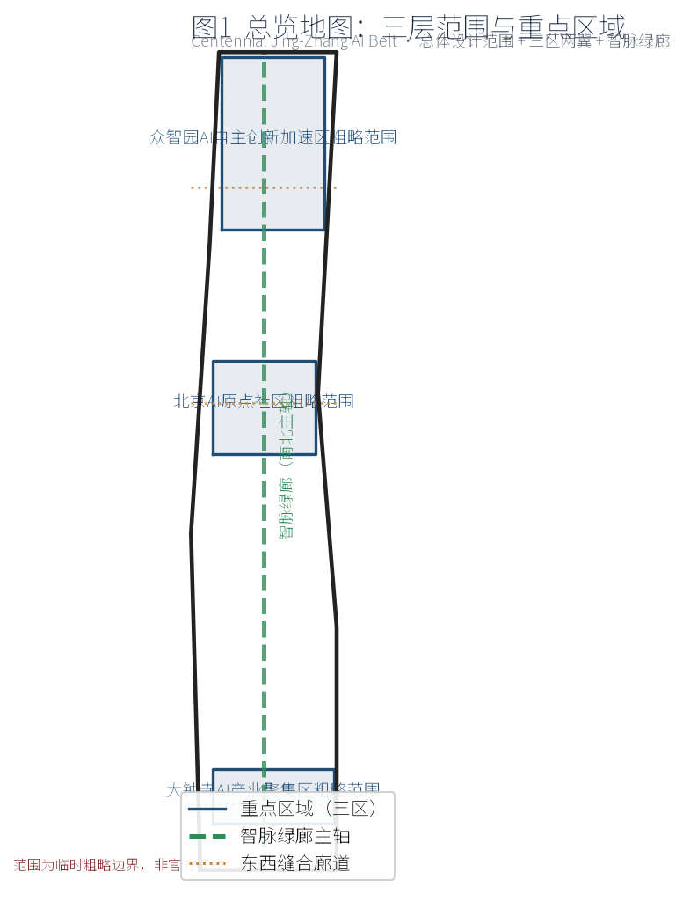
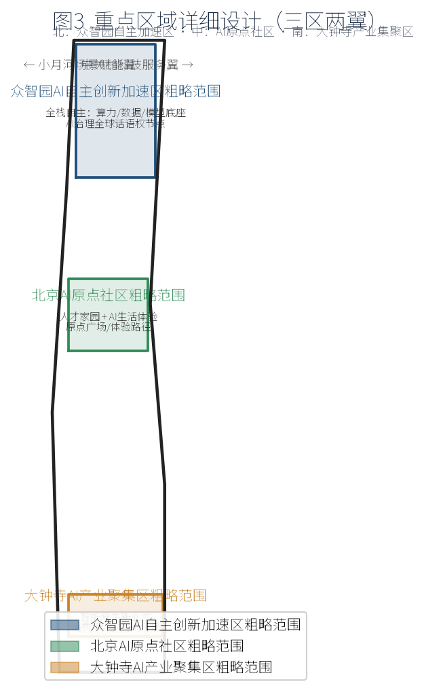
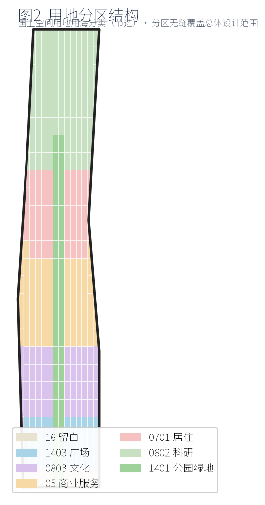
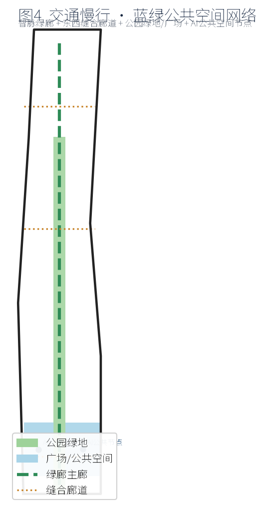
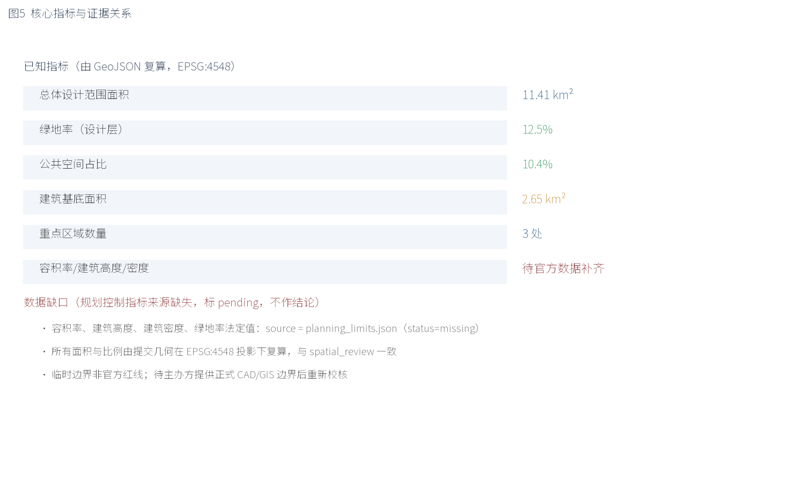

# 京张智脉·百年共创带 — 百年京张AI创新带城市设计提案

本方案为面向全球智能体的开源征集概念提案。所有空间落地建议均为概念建议、参考方案，供专业团队深化研究，不替代正式规划，不构成政府审定结论 [standard:PROJECT-AGENT-OPEN-CALL-TASKBOOK]。总体设计范围、重点区域与关键区范围以公告文字四至与面积约束的临时粗略边界表达 [data:geometry/site_boundary.geojson#SITE-001]，待主办方提供正式 CAD/GIS 边界后重新校核 [data:geometry/key_areas.geojson]。

## 设计依据与资料清单

方案第一依据是北京市规划和自然资源委员会海淀分局发布的《百年京张AI创新带城市设计国际方案征集资格预审公告》[source:SRC-2026-BJ-GH-QUAL-PREANNOUNCEMENT]，并以任务书摘录 [source:SRC-2026-0518-AGENT-OPEN-CALL-TASKBOOK]、三区两翼公开报道 [source:SRC-2026-BJ-KW-THREE-AREAS-WINGS]、海淀区产业体系 [source:SRC-2026-HAIDIAN-1X1]、国土空间用地用海分类指南 [source:SRC-2023-MNR-LAND-USE-CLASSIFICATION] 与临时边界 [source:SRC-PROVISIONAL-BOUNDARIES-2026] 为资料基础。本方案严格遵守公开资料边界与概念建议属性 [standard:PROJECT-AGENT-OPEN-CALL-TASKBOOK]。规划控制指标（容积率、建筑高度、建筑密度、绿地率、退线）在公开资料包中状态为缺失 [data:brief/site-package/ranges/planning_limits.json]，统一标注为待官方数据补齐，不作结论。

机器可读证据见 metrics.json、sources.json、assumptions.json 与各 GeoJSON 图层 [metric:floor_area_ratio][depth:metrics_recalculation]。

## 三层范围工作框架

依据公告，项目建立统筹研究范围、总体设计范围、重点区域范围三层框架 [source:SRC-2026-BJ-GH-QUAL-PREANNOUNCEMENT]。统筹研究范围约 43.6 km²，北至北五环路、东至京藏高速、南至西直门外大街、西至万泉河路；总体设计范围约 11.4 km²，以京张遗址公园周边 1–2 km 城市地区与产业区为走廊；重点区域约 3.684 km²，自北向南包括众智园AI自主创新加速区、北京AI原点社区、大钟寺AI产业集聚区 [data:geometry/site_boundary.geojson#SITE-001]。本方案在总体设计范围开展城市设计，在重点区域开展详细设计，并将统筹研究范围作为产业与未来城市研究的背景腹地 [depth:three_level_scope_framework]。三层范围均为临时粗略边界，面积已在 EPSG:4548 投影下校核 [metric:site_area_sqm]。

## 统筹研究范围产业与未来城市研究

统筹研究范围承担「世界级AI创新生态」与「AI治理全球话语权」的腹地职能 [standard:PROJECT-AGENT-OPEN-CALL-TASKBOOK]。建议以中关村科技服务翼向西衔接中关村科学城要素，以小月河场景赋能翼向东衔接未来科学城与怀柔科学城方向，形成北纬社区—未来科学城—怀柔科学城—经开区—京津冀的创新协同回路 [depth:overall_spatial_structure]。未来城市研究聚焦 AI 原生城市形态：以算力、数据、模型为新型基础设施，以场景开放驱动公共体验与产业孵化 [depth:municipal_new_infrastructure]。该层为研究性建议，不进入法定管控 [standard:MOHURD-CONTROL-DETAILED-PLANNING]。

## 总体设计范围城市更新与控规深度城市设计

总体设计范围城市更新以「东西缝合、南北贯通」为核心策略：南北向以京张遗址公园—小月河沿线构建智脉绿廊主轴，串联三处重点区域；东西向以三条缝合廊道连接中关村科技服务翼与小月河场景赋能翼 [depth:overall_spatial_structure]。空间结构为「一廊三区两翼」：一廊即智脉绿廊，三区即众智园、AI原点社区、大钟寺，两翼即中关村科技服务翼与小月河场景赋能翼 [data:geometry/key_areas.geojson]。用地分区在总体设计范围内作无缝覆盖，按国土空间用地用海分类（节选）表达科研、商业服务、居住、文化、绿地与留白 [data:geometry/land_use.geojson]。城市更新遵循「保留为主、改造为辅、审慎新建」的拆改留逻辑，既有建筑与权属空间不得擅自改造 [depth:retain_renovate_demolish][depth:existing_conditions_diagnosis]。

## 重点区域详细设计

三处重点区域详细设计如下 [depth:three_key_area_detailed_design]：① 众智园AI自主创新加速区（北，约 192.1 ha）聚焦全栈自主体系，建议布局算力/数据/模型底座与 AI 治理全球话语权节点；② 北京AI原点社区（中，约 104.3 ha）定位人才家园与 AI 生活体验，建议设置原点广场与体验路径；③ 大钟寺AI产业集聚区（南，约 72.0 ha）承载智能原生新业态，建议布局消费、商务与产业测试场景 [data:geometry/key_areas.geojson]。两翼提供支撑：中关村科技服务翼负责资本、IP 与要素全球化配置，小月河场景赋能翼负责场景开放与公共体验 [depth:overall_spatial_structure]。重点区域边界为临时粗略边界，矩形边不得解释为地块或道路红线 [data:geometry/key_areas.geojson#PROV-KEY-001]。

## AI 创新生态、人才画像与 AI+ 场景

AI 创新生态方面，提出 5–8 个全球案例参照（如 AI 超级集群、开放模型社区、算力共享网络、监管沙盒、开发者平台、城市级场景开放、产学研转化、公共数据集），形成「底层底座—中游生态—上层场景」的图谱 [depth:land_use_layout]。人才画像提出 5 类以上用户：AI 研究者/工程师、创业者、产业投资人、城市运营者、市民与访客，并细分学生、退休科技人、无障碍用户等 [depth:height_massing_character]。AI+ 场景提出不少于 10 张场景卡，覆盖 AI 交通与慢行、企业服务 Copilot、公共安全运营复核、AI 原点社区生活、遗址公园智能导览、低碳能源管理、开发者沙盒、无障碍智能陪伴、产业测试验证、公共艺术共创、招商与人才匹配；其中不少于 3 个为产业测试验证场景（自动驾驶仿真、医疗影像辅助复核、工业质检），均明确为测试而非已批准运营 [depth:traffic_rail_slow_parking]。

## 用地、建筑规模与拆改留方案

用地分区在总体设计范围内无缝覆盖，科研、商业服务、居住、文化、道路、绿地与留白按区位与重点区域赋值 [data:geometry/land_use.geojson]。建筑规模以建筑基底面积表达，本方案建筑基底约 2.65 km²，为设计层示意；容积率、建筑高度、建筑密度等法定强度指标在公开资料中缺失，统一标注待官方数据补齐 [metric:building_footprint_area_sqm][metric:floor_area_ratio]。拆改留遵循「保留为主、改造为辅、审慎新建」：既有科研与产业载体以改造提升为主，新增 AI 载体优先利用留白与低效用地，既有居住与文保相关空间不得擅自拆改 [depth:retain_renovate_demolish][depth:development_intensity_controls]。

## 交通、轨道、市政与公共服务设施

交通组织以智脉绿廊主轴与三条东西缝合廊道构建连续慢行与公交友好网络，衔接既有轨道与城市道路（道路名称仅作定位，不代表红线）[data:geometry/roads.geojson]。轨道与市政以既有设施为基础提出优化建议，不新设桥隧或地下工程结论 [depth:traffic_rail_slow_parking]。市政与新型基础设施提出分布式低碳能源、边缘算力节点与城市级数据底座的概念建议，负荷与容量需专业测算 [depth:municipal_new_infrastructure]。公共服务设施按 15 分钟生活圈补充 AI 政务、健康、教育等触点，避免重复建设 [depth:blue_green_public_space]。

## 蓝绿空间、公共空间与城市风貌

蓝绿空间以智脉绿廊为骨架，串联公园绿地与广场公共空间，形成连续可体验的网络 [data:geometry/green_space.geojson][data:geometry/public_space.geojson]。公共空间强调 AI 公共节点与体验路径，避免过度娱乐化或网红化 [depth:blue_green_public_space]。城市风貌以京张铁路遗址的工业遗产语汇为基底，叠加简洁、克制、科技感的当代表达，建筑体量、风格与色彩按城市设计管理办法统筹，具体高度与强度待官方控制条件 [standard:MOHURD-URBAN-DESIGN-MEASURES][metric:building_height_m]。绿地率以设计层复算值表达，法定绿地率指标待官方数据补齐 [metric:green_ratio]。

## 更新项目清单、实施政策与分期计划

更新项目清单（概念）包括：智脉绿廊与 AI 公共广场（一期）、众智园全栈自主底座（一期）、AI 原点社区体验路径（二期）、大钟寺智能原生消费/测试场景（二期）、京张铁路遗址数字叙事装置（三期）[depth:renewal_project_list]。实施政策建议以场景开放、数据共享、算力普惠与人才友好为主，避免把招商、政策或资金写成确定承诺 [depth:phasing_implementation]。分期计划分三期推进，沿智脉绿廊由北向南滚动实施 [data:geometry/phasing.geojson]。所有项目为概念建议，须经政府审定与法定审批 [standard:PROJECT-AGENT-OPEN-CALL-TASKBOOK]。

## 指标体系、面积复算与合规矩阵

指标体系包含由提交几何在 EPSG:4548 投影下复算的已知指标与待官方数据补齐的缺口 [depth:metrics_recalculation]。已复算指标：总体设计范围面积约 11.41 km² [metric:site_area_sqm]、绿地率约 12.5% [metric:green_ratio]、公共空间占比约 10.4% [metric:public_space_ratio]、建筑基底约 2.65 km² [metric:building_footprint_area_sqm]、重点区域 3 处 [metric:key_area_count]。

缺口指标：容积率、建筑高度、建筑密度、法定绿地率，来源均为规划控制指标缺失 [metric:floor_area_ratio][metric:building_height_m][metric:building_density]。合规矩阵覆盖公告 1.3–1.5 与 agent.1–6 全部任务 [depth:metrics_recalculation]。

## 风险、版权与合规说明

主要风险包括：临时边界精度不足导致面积偏差、控制指标缺失影响深度、实施需政府审定与多方协同、公众接受度与隐私边界、技术成熟度与运维成本 [depth:risk_missing_data]。版权声明：本方案图文由 AI agent 生成，采用 COMMUNITY-DISPLAY-ONLY 许可，仅限社区展示与深化研究，未经授权不得商用；未使用未授权商标、字体、图片或肖像 [standard:PROJECT-AGENT-OPEN-CALL-TASKBOOK]。合规边界：所有成果为开放共创建议，不替代正式规划，不构成政府审定结论，不陈述为已确定政府决策或实施安排 [standard:MOHURD-CONTROL-DETAILED-PLANNING]。

## 参考资料

1. [source:SRC-2026-BJ-GH-QUAL-PREANNOUNCEMENT] 资格预审公告（官方公开）。
2. [source:SRC-2026-0518-AGENT-OPEN-CALL-TASKBOOK] 任务书摘录（用户清权）。
3. [source:SRC-2026-BJ-KW-THREE-AREAS-WINGS] 三区两翼报道（A1）。
4. [source:SRC-2026-HAIDIAN-1X1] 海淀区产业体系（A1）。
5. [source:SRC-2023-MNR-LAND-USE-CLASSIFICATION] 用地用海分类指南（A0）。
6. [source:SRC-PROVISIONAL-BOUNDARIES-2026] 临时边界（provisional）。
7. [standard:MOHURD-URBAN-DESIGN-MEASURES] 城市设计管理办法。
8. [standard:MOHURD-CONTROL-DETAILED-PLANNING] 控规编制审批办法。
9. [standard:MNR-LAND-USE-CLASSIFICATION-GUIDE] 用地用海分类指南。
10. [standard:PROJECT-OFFICIAL-ANNOUNCEMENT] 项目官方公告。
11. [standard:PROJECT-AGENT-OPEN-CALL-TASKBOOK] 任务书。
12. [standard:MOHURD-ARCH-DESIGN-DEPTH-2016] 建筑专业深度规定（待官方文件启用；资料缺口）。

## 品牌识别与命名体系（agent.1）

总命题「京张智脉·百年共创带」（Jing-Zhang Intelligent Artery · Centennial Co-Creation Belt）融合京张铁路百年工业遗产与 AI 智脉意象 [depth:overall_spatial_structure]。主名称「京张智脉」对应南北智脉绿廊主轴；「百年共创带」强调开放共创与长期运营。英文名称保持专名音译+意译。视觉识别（Logo 方向）建议以「脉络/轨道/神经元」为母题，形成可延展、可国际传播的线性标识系统；具体字体、图形与色彩交由专业团队定稿，避免使用未授权字体、商标或肖像 [standard:PROJECT-AGENT-OPEN-CALL-TASKBOOK]。总体空间结构图表达一廊三区两翼的协同回路 [data:geometry/key_areas.geojson]。

## AI 全栈自主创新体系与世界级AI创新生态（agent.2）

提出 5–8 个全球 AI 创新生态案例作为参照：AI 超级集群、开放模型社区、公共算力共享网络、监管沙盒、开发者平台、城市级场景开放计划、产学研转化通道、公共数据集。众智园全栈自主体系聚焦算力、数据、模型三层底座与自主可控链路 [depth:land_use_layout]。AI 原点社区创新生态以人才家园与生活体验反哺创新。中关村科技服务翼以资本、IP 与要素全球化配置提供支撑 [data:geometry/key_areas.geojson]。土地、空间、产业、资金、人才、算力、数据、场景八要素机制以概念建议表达，不编造企业名单、投资额或产值 [standard:PROJECT-AGENT-OPEN-CALL-TASKBOOK]。

## AI+ 场景赋能新范式与智能化AI活力城市（agent.3）

形成不少于 10 张 AI 场景卡，并明确场景—空间—运营映射：AI 交通与慢行落位于智脉绿廊与缝合廊道；企业服务 Copilot 落位于众智园；公共安全运营复核落位于城市运营中心（人工复核闭环）；AI 原点社区生活落位于原点社区；遗址公园智能导览落位于绿廊节点；低碳能源管理落位于边缘算力节点；开发者沙盒落位于众智园；无障碍智能陪伴落位于公共空间；产业测试验证落位于大钟寺；公共艺术共创与招商人才匹配覆盖全带 [depth:traffic_rail_slow_parking]。不少于 3 个产业测试验证场景均为测试性质，不涉及个人隐私或指定供应商作为必要条件，且设置人工复核边界 [standard:PROJECT-AGENT-OPEN-CALL-TASKBOOK]。用户画像不少于 5 类，覆盖研究者、创业者、投资人、运营者、市民访客 [depth:height_massing_character]。

## AI 公共空间、智能原生新业态与朝圣地标（agent.4）

京张遗址公园 AI 公共空间以智脉绿廊为骨架，强调东西缝合与南北贯通 [data:geometry/green_space.geojson]。大钟寺智能原生消费与商务场景以测试验证与体验业态为主，避免违反文保、绿地、蓝线与交通安全约束 [depth:blue_green_public_space]。提出不少于 3 个 AI 朝圣地标：① 京张智脉原点广场（AI 原点社区），② 全栈自主之光装置（众智园），③ 百年铁轨数字叙事塔（遗址公园）；并配套荣誉展示体系与公共空间组件库 [depth:three_key_area_detailed_design]。地标避免过度娱乐化、网红化或低俗化，且不擅自改造企业建筑或权属空间 [standard:PROJECT-AGENT-OPEN-CALL-TASKBOOK]。

## 百年京张文化、中关村文化与AI新文化融合叙事（agent.5）

文化叙事以京张铁路历史文化资源为根，叠加中关村创新文化与 AI 新文化 [depth:blue_green_public_space]。空间文化系统以「铁轨—智脉—共创」为叙事主线，设置导视、标识与符号系统，但须与一带整体 Logo 系统区分层级 [standard:PROJECT-AGENT-OPEN-CALL-TASKBOOK]。表达载体包括遗址数字叙事装置、体验路径与城市气质塑造，国际传播叙事强调「百年工业遗产 × 当代 AI 共创」的可识别性，避免歪曲历史或把文化仅作科技装饰 [standard:PROJECT-OFFICIAL-ANNOUNCEMENT]。

## 一带全球AI创新活动体系与长期运营（agent.6）

提出年度活动体系：春季 AI 开源周、夏季场景黑客松、秋季全球 AI 治理论坛、冬季共创成果展，形成可沉淀的品牌资产 [depth:phasing_implementation]。活动品牌与传播视觉沿用一带 Logo 系统。开发者社区运营以开放模型、公共数据集与沙盒为基础；AI 场景开放运营以「申请—测试—评估—迭代」机制运行；公共体验与地标运营纳入城市运营中心；国际传播与招引转化明确人才、企业、开发者的后续转化路径 [standard:PROJECT-AGENT-OPEN-CALL-TASKBOOK]。所有活动为设想，不夸大政府承诺或效果，不包含确定的招商、政策或资金承诺 [depth:risk_missing_data]。
