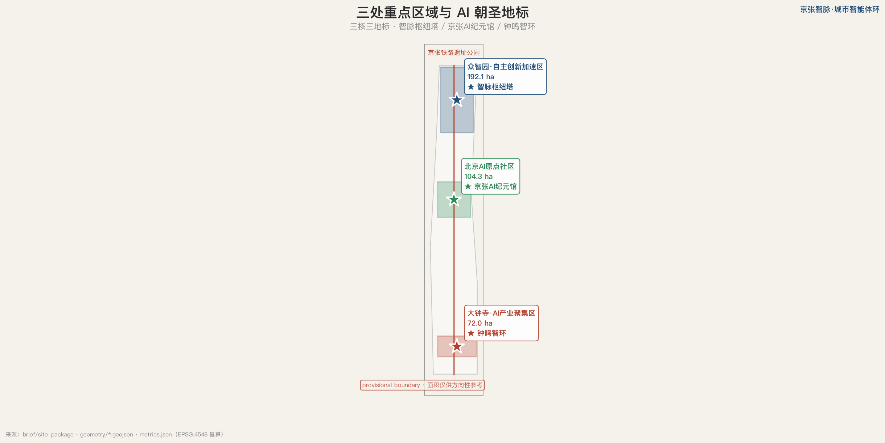
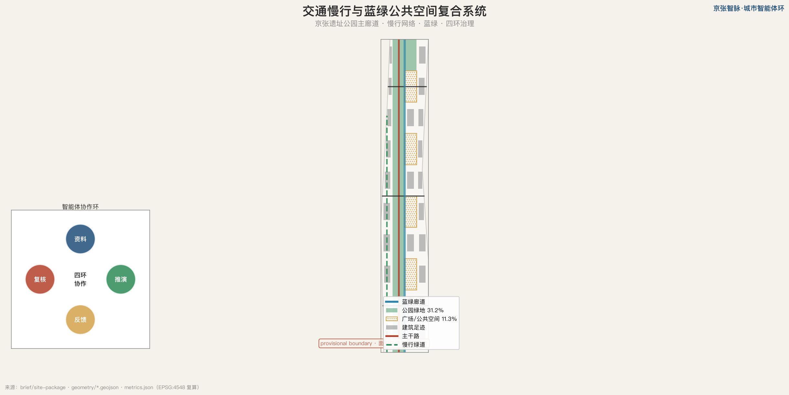
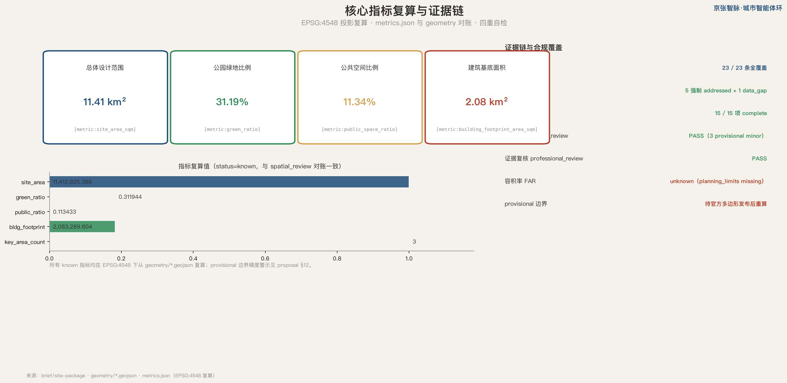

# 京张智脉·城市智能体环

## 设计依据与资料清单

本方案以公开任务书、公开规划政策、provisional 场地边界与可清权资料为唯一证据来源，所有判断都可被专业团队与公众追溯与复核。资料底座包括结构化场地包 `[source:SITE-PACKAGE]`、公开来源登记 `[source:SOURCE-REGISTRY]`、处理后的事实包 `[source:PROCESSED-FACT-PACK]`、provisional 边界来源 `[source:BOUNDARY-SOURCE]`、重点区来源 `[source:KEY-AREA-SOURCE]` 与资格预审公告 `[source:OFFICIAL-ANNOUNCEMENT]`。方案的核心不是一次性画出终局蓝图，而是建立一个能让城市设计持续迭代的智能体协作接口——这正是本方案提出的「资料环」入口：多模态城市资料中台把公告、控规、统计、众源反馈、传感指标聚合为机器可读、来源可追溯、置信可标注的结构化资料，供后续推演、反馈与复核环复用 `[source:AGENT-TASKBOOK]`。本方案严格遵循面向智能体任务书的共创建议属性，所有空间落地建议均表述为概念建议或参考方案，不替代专业规划与政府审定 `[standard:PROJECT-AGENT-OPEN-CALL-TASKBOOK]`。

需要首先披露的关键资料缺口是：截至本方案提交，site-package 只提供了 provisional 粗略替代边界，缺少精确官方多边形与审定控规指标 `[data:geometry/site_boundary.geojson]`。因此本方案的总体设计范围面积 11412825.386 平方米（约 11.4 平方公里）是基于 provisional 边界在 EPSG:4548 投影下的复算值，仅供方向性讨论与 intake 自检，不得作为官方红线或精确面积依据；待官方多边形发布后，所有面积、绿地率与公共空间率指标需要重新复算。约束图层用于记录已知的文保、蓝线、交通与用地边界等公开约束线索 `[data:geometry/constraints.geojson]`。

## 三层范围工作框架

本方案的工作范围遵循公告确立的三层结构：统筹研究范围 43.6 平方公里（北五环—京藏高速—西直门外大街—万泉河路），承担世界级 AI 创新生态体系与区域协同研究；总体设计范围 11.4 平方公里，承担控规深度的总体城市设计与更新统筹；重点区域范围 3.684 平方公里，承担三处重点区的详细设计 `[depth:three_level_scope_framework]`。三层范围从产业战略、总体城市设计到重点片区详细设计逐级落实，并通过四环协作机制互相校验：资料环整理证据、推演环生成多方案、反馈环收集公众与传感反馈、复核环做合规与人工把关 `[standard:PROJECT-OFFICIAL-ANNOUNCEMENT]`。

方案命名「京张智脉·城市智能体环」呼应詹天佑先生百年前自主设计京张铁路的精神：把「自主」从铁路工程延续到智能体——让城市拥有一组可被公众监督、可被专业团队校正的自主智能体。Logo 方向为四环嵌套结构叠加京张铁轨横线，主色智脉蓝 #1F4E79（创新与可信）与京张红 #B4402B（历史与活力），延展色取蓝绿 #2E8B57 与宣纸底 #F5F2EC。三区两翼协同回路以众智园 AI 自主创新加速区、北京 AI 原点社区、大钟寺 AI 产业聚集区为三核，中关村科技服务翼与小月河场景赋能翼为两翼 `[data:geometry/key_areas.geojson]`，总体范围面积与重点区数量见核心指标 `[metric:site_area_sqm]`。需要再次说明，三层范围的几何均为 provisional，重点区面积仅供方向性参考。

## 统筹研究范围产业与未来城市研究

统筹研究范围回应公告 1.5（1）关于世界级 AI 创新生态体系、三区两翼协同、未来 AI 城市形态的要求 `[source:AGENT-TASKBOOK]`。本方案在资料环与推演环的支持下，对全球 AI 创新生态进行案例研究并提出可转化的空间与运营机制。代表性案例包括：（1）硅谷沙丘路风险资本与高校的「资本—研究—场景」三角，可转化为中关村科技服务翼的要素配置机制；（2）伦敦 King's Cross 知识街区把铁路棕地更新为创新社区的「站城学一体化」，直接对应京张遗址公园周边更新；（3）首尔数字媒体城以公共测试平台降低企业落地门槛的「场景开放」模式；（4）阿姆斯特丹 Marineterrein 把城市作为生活实验室（Living Lab）的感知与反馈机制；（5）深圳湾生态圈以超级总部的公共空间串联创新节点的「朝圣走廊」；（6）波士顿 Kendall Square 校园—产业—公共空间的「一公里创新服务圈」；（7）东京柏叶智慧城的数据公开与市民共创；（8）巴塞罗那 22@ 区的慢行与公共空间网络。这些案例共同指向：世界级 AI 创新带不是单一园区，而是资本、研究、场景、公共空间与反馈机制的网络化协同。

现状诊断层面，本方案基于公开资料识别京张遗址公园周边的典型问题：公共空间被交通与用地边界切割、东西缝合与南北到达体验不足、面向青年与中小团队的低门槛公共界面稀缺、AI 应用场景丰富但缺少持续记录资料与反馈的开放机制 `[depth:existing_conditions_diagnosis]`。用地结构上，本方案以网格化用地分区重构总体设计范围 `[data:geometry/land_use.geojson]`，统筹范围面积与总体范围的关系见指标 `[metric:site_area_sqm]`。未来城市形态上，本方案提出「智能体可读城市」方向：所有空间建议都附带机器可读的图层、指标与置信边界，使后续 agent 能直接理解和迭代，而非重新解析 PDF 与效果图。

## 总体设计范围城市更新与控规深度城市设计

总体设计范围达到控制性详细规划的城市设计深度，回应公告 1.5（2）关于功能布局、创新指标体系、城市更新总体框架与实施政策的要求 `[standard:MOHURD-CONTROL-DETAILED-PLANNING]`。总体空间结构以「一带三核两翼四环」为骨架：一带即京张铁路遗址公园活力带，南北贯穿；三核即三处重点区；两翼即中关村科技服务翼与小月河场景赋能翼；四环即智能体协作环 `[depth:overall_spatial_structure]`。用地布局遵循《城市设计管理办法》对公共性、可达性与风貌协调的要求 `[standard:MOHURD-URBAN-DESIGN-MEASURES]`，并按《国土空间调查、规划、用途管制用地用海分类指南》进行用地编码 `[standard:MNR-LAND-USE-CLASSIFICATION-GUIDE]`，以科研、教育、文化、居住、绿地与广场用地为主体，形成产—学—研—居—游复合的创新街区 `[depth:land_use_layout]`。

更新框架采用复核环驱动的「识别—评估—建议—复核」流程：智能体先基于公开资料识别更新对象与约束，生成保留/改造/拆除/新建的初步分类建议，再由规划、交通、文保与社区代表人工复核，避免把推断包装为审定结论。典型更新单元如众智园北段以科研用地为主体 `[data:geometry/land_use.geojson#LU-090]`，承担 AI 自主创新加速；中段以教育、文化与广场用地复合，服务 AI 原点社区；南段以科研与社区服务用地为主，支撑大钟寺智能原生新业态。需要说明的是，本方案不给出容积率、建筑高度、拆改留具体地块或道路红线的最终结论——这些法定判断依赖于尚未公开的审定控规，应在专业团队取得官方条件后深化。

## 重点区域详细设计

重点区域范围对三处重点区分别开展详细设计，达到规划综合实施方案的城市设计深度 `[depth:three_key_area_detailed_design]`。众智园 AI 自主创新加速区（provisional 面积 192.1 公顷）定位为 AI 全栈自主创新体系与 AI 治理全球话语权的策源地 `[data:geometry/key_areas.geojson#zhongzhiyuan_ai_acceleration_area]`，布局算力枢纽、研发实验、孵化加速与开放测试功能，并设置本方案的第一处 AI 朝圣地标「智脉枢纽塔」——一座 agent 编排观测台与四环可视化中枢，公众可在此看到智能体如何整理资料、推演方案与提示风险。

北京 AI 原点社区（provisional 面积 104.3 公顷）定位为世界级 AI 创新生态的「原点」 `[data:geometry/key_areas.geojson#beijing_ai_origin_community]`，以教育、文化、住宅与广场用地复合，布局 AI 起源博物馆、开发者社区、青年第三空间与公共实验平台。第二处 AI 朝圣地标「京张 AI 纪元馆」坐落于此，以詹天佑自主设计精神串联 AI 起源叙事，是本方案文化叙事的主要锚点。大钟寺 AI 产业聚集区（provisional 面积 72.0 公顷）定位为智能原生新业态 `[data:geometry/key_areas.geojson#dazhongsi_ai_industry_cluster]`，布局商业服务业、科研与社区服务功能，设置第三处 AI 朝圣地标「钟鸣智环」——一个 civic feedback 广场，把反馈环的物理化身与日常消费、商务场景结合。三处重点区数量与分期起点见指标与图层 `[metric:key_area_count]` `[data:geometry/phasing.geojson#PHASE-001]`。若重点区 polygon 为 provisional，上述定位与规模结论只能作为方向性设计，待官方多边形发布后复核。

## AI 创新生态、人才画像与 AI+ 场景

本方案以场景为 AI 落地的最小单元，回应任务书 agent.3 关于不少于 10 张 AI 场景卡、不少于 3 个产业测试验证场景与不少于 5 类用户画像的要求 `[source:AGENT-TASKBOOK]`。场景卡均映射到空间位置、服务对象、运行数据、隐私边界、人工复核、运营主体、可视化图层与风险，并在公共空间与节点上落地 `[data:geometry/public_space.geojson]`。十张核心场景卡为：（1）多模态城市资料中台（资料环，全域，生产）；（2）用地合规自动复核（复核环，众智园，验证，与公开控规红线比对）；（3）交通 OD 推演沙盘（推演环，全域，验证，与历史 OD 误差对标）；（4）公共空间活力反馈（反馈环，AI 原点，验证，反馈分类对标）；（5）碳排仿真与蓝绿调度（推演环，全域，验证，与监测站误差对标）；（6）AI 研发用地智能匹配（资料环，众智园）；（7）京张遗产叙事生成（复核环，AI 原点）；（8）适老化公共服务导航（反馈环，大钟寺）；（9）应急疏散推演（推演环，全域）；（10）人才画像与空间供需匹配（资料环，众智园）；另含（11）众创社区议事治理（反馈环，大钟寺）。其中（2）（3）（4）（5）为产业测试验证场景，均设明确的人工复核与可复核指标。

五类以上用户画像为：AI 创业者与算法工程师（众智园，需要算力、数据与创投对接）、高校研究者与京张学者（AI 原点社区，需要遗产数据与实验场景）、原住民与老年居民（大钟寺周边，需要适老化公共服务与安置保障）、返乡青年与数字游民（全域，需要共享办公与社群）、城市治理者与规划师（复核环 human-in-the-loop，需要合规与推演决策支持）、京张通勤者（廊道沿线，需要慢行与轨道接驳）。建筑体量与风貌控制围绕这些画像与场景组织 `[depth:height_massing_character]`，但具体建筑高度与强度受限于未公开控规，仅作方向性建议。所有涉及个人服务、企业经营、医疗、法律与公共安全的场景，均明确为信息辅助，不替代专业判断，且数据来源限定为公开或授权聚合。

## 用地、建筑规模与拆改留方案

用地布局以网格化分区覆盖总体设计范围，确保无缝隙、无重叠，科研用地、教育用地、文化用地、居住用地、公园绿地与广场用地按创新带功能配比 `[depth:land_use_layout]`。建筑规模与拆改留方案遵循「保留先行、改造为主、谨慎拆除、复合新建」的原则 `[depth:retain_renovate_demolish]`：现状科研与教育建筑优先保留与改造提升，新增建筑足迹集中在科研、文化、教育、居住与社区服务用地内 `[data:geometry/buildings.geojson]`，总建筑面积基底约 2083289.604 平方米 `[metric:building_footprint_area_sqm]`，用于支撑 AI 研发、孵化、展示与人才居住空间供给。开发强度控制方面，本方案受限于 site-package 中容积率、建筑高度、建筑密度、绿地率（控规）与退让五项指标均为 missing 状态 `[depth:development_intensity_controls]`，因此不给出具体容积率与高度数值，相关判断作为待确认事项留给专业团队取得官方条件后深化。

用地编码严格遵循国土空间用地用海分类指南 `[data:geometry/land_use.geojson]`，主要用地类型包括 0802 科研用地、0803 文化用地、0804 教育用地、0701 城镇住宅用地、0702 城镇社区服务设施用地、1401 公园绿地、1403 广场用地与 0806 医疗卫生用地，体现 AI 创新带产—学—研—居—医—游复合特征。需要强调的是，建筑基底面积、拆改留分类与开发强度均属概念建议，不构成地块级审定结论，待官方控规与现状建筑、权属资料公开后由专业团队复核。

## 交通、轨道、市政与公共服务设施

交通组织回应公告对轨道接驳、慢行断点、无障碍与新型基础设施的要求 `[depth:traffic_rail_slow_parking]`。本方案以京张铁路遗址公园为南北慢行主廊道，串联三处重点区，并布设若干横向联系道路缝合东西交通 `[data:geometry/roads.geojson]`。慢行系统以「可达、可停、可换乘」为标准，优先解决断点、绕行、导视不清与无障碍不足；对于自动驾驶接驳、机器人配送与无人巡检等场景，只在明确边界、低速、可监管的公开试点范围内讨论，不把概念场景直接等同于落地工程。轨道站点一体化建议强化站点与重点区、公共空间与人才服务节点的步行衔接，但具体线位与站点方案属工程范畴，本方案不给出最终结论。

市政与新型基础设施采用「端侧算力 + 分布式能源 + 传统市政融合」方向 `[depth:municipal_new_infrastructure]`，在众智园布局算力与数据中心配套，在公共空间与建筑屋顶布局分布式能源与雨水回收，把 AI 场景所需的端侧感知、低时延算力与传统给排水、电力、通信融合。公共服务设施围绕五类用户画像配置 AI+医疗健康导航、AI+教育文化导览、AI+法律与企业服务咨询、人才生活服务与创新服务平台，所有服务均以公开或授权数据为基础，设人工复核与隐私边界。

## 蓝绿空间、公共空间与城市风貌

蓝绿空间以京张铁路遗址公园活力带为骨架，串联公园绿地与广场用地，形成连续的公共空间网络 `[depth:blue_green_public_space]`。本方案在总体设计范围内布局公园绿地占比约 31.19% `[metric:green_ratio]` `[data:geometry/green_space.geojson]`，广场与公共空间占比约 11.34% `[metric:public_space_ratio]` `[data:geometry/public_space.geojson]`，以支撑人才生活、创新交往与公共活动。绿地比例的设计意图是让创新工作者在步行五分钟内可达高质量公共空间，公共空间比例则保证有足够的展示、活动与测试场所承接 AI 场景。

城市风貌以「智脉蓝 + 京张红 + 蓝绿 + 宣纸底」为基调，建筑体量围绕京张遗址公园呈梯度控制，靠近遗址公园与公共空间的建筑偏低层、向外适度提高，但具体高度受限于未公开控规。导视、标识与符号系统延续四环 Logo 与京张文化叙事，区分整体 Logo 系统与文化标识系统，避免混淆。公共空间组件库包括可移动座椅、遮阴、夜间照明、活动接口、可移动测试设备与数据反馈屏，支撑场景开放与公众参与。所有空间建议均为概念建议，违反文保、绿地、蓝线或交通安全约束的方案不予采纳，桥隧、地下空间与工程可行性结论不在本方案范围内。

## 更新项目清单、实施政策与分期计划

更新项目清单按三期分期推进，对应分期图层 `[depth:renewal_project_list]` `[depth:phasing_implementation]`。近期（0—6 年，PHASE-001）聚焦众智园北段先行区 `[data:geometry/phasing.geojson#PHASE-001]`，目标是建成多模态资料中台、算力枢纽、智脉枢纽塔与两个轻量空间试点，验证四环协作流程；中期（6—18 年，PHASE-002）聚焦 AI 原点社区，扩展慢行网络、京张 AI 纪元馆、开发者社区与公共实验平台；远期（18 年以上，PHASE-003）聚焦大钟寺产业聚集区，建成钟鸣智环广场、智能原生消费与商务场景。实施政策建议包括场景开放制度、数据公开机制、人才安居、用地弹性与公众参与程序，所有政策均为概念建议，不表述为已确定政府安排。

长期运营回应任务书 agent.6 关于全球 AI 创新活动体系、开发者社区运营与长期品牌资产的要求 `[source:AGENT-TASKBOOK]`。本方案提出年度活动体系（京张 AI 周、开发者大会、场景开放日、青年创新马拉松）、品牌 IP 系统（延续四环 Logo 与京张叙事）、开发者社区运营机制（开源贡献荣誉墙、智能体贡献记忆）、场景开放运营机制（公共测试平台、企业试点报名）与国际传播与招引转化通道。所有活动、招商、资金与运营安排均写成概念建议或深化方向，不表述为已确定事项，且需保留人才、企业与开发者的后续转化路径。

## 指标体系、面积复算与合规矩阵

指标体系围绕目标契合度、功能匹配度、产业支撑度、场景可感知度与公开合规性构建，核心指标均在 EPSG:4548 投影下从生成几何复算 `[depth:metrics_recalculation]`。已知指标包括：总体设计范围面积 11412825.386 平方米 `[metric:site_area_sqm]`、公园绿地比例 0.311944 `[metric:green_ratio]`、广场与公共空间比例 0.113433 `[metric:public_space_ratio]`、建筑基底面积 2083289.604 平方米 `[metric:building_footprint_area_sqm]` 与重点区数量 3 `[metric:key_area_count]`。容积率（far_gfa_over_site_area）因 site-package planning_limits 中该项 status=missing 而标记为 unknown，不捏造数值，待官方控规公开后复算。

合规矩阵覆盖公告 1.3、1.4、1.5 全部条目与任务书 agent.1—agent.6 全部六项任务，每项均关联正文章节、GeoJSON 图层、指标、图纸、visual 章节、来源、假设与自检项；专业标准矩阵覆盖五项强制性标准与一项可选标准（建筑工程设计文件编制深度规定 2016，因 needs_official_file 标记为 data_gap）`[standard:MOHURD-ARCH-DESIGN-DEPTH-2016]`；设计深度矩阵覆盖十五项必填深度项。面积复算与四重自检状态见证据图与 visual 仪表盘，所有 provisional 几何相关的精度警示均已披露。

## 风险、版权与合规说明

本方案的风险与资料缺口集中在三类 `[depth:risk_missing_data]`。第一类是 provisional 边界风险：site-package 仅提供粗略替代边界 `[data:geometry/constraints.geojson]`，本方案的面积、绿地率与公共空间率均为方向性复算，不得作为官方红线、审批依据或精确面积；待官方多边形与审定控规发布后，所有精度敏感指标需重新复算。第二类是 planning_limits 缺失：容积率、建筑高度、建筑密度、绿地率（控规）与退让五项均为 missing，本方案不给出这些法定指标的数值，相关开发强度判断作为待确认事项。

第三类是版权与合规：本方案仅基于公开任务书与可公开资料，不声称使用或披露非公开规划图件、个人隐私、土地权属资料或审定控制指标；涉及建筑高度、建设强度、道路线位、交通组织与设施落位的内容均为讨论性建议，须经规划、交通、数据安全、公众参与与相关主管部门程序复核 `[standard:PROJECT-OFFICIAL-ANNOUNCEMENT]`。AI agent 参与资料整理与方案生成时，保留输入来源、生成时间、模型与人工复核记录；图片、图表与展示素材使用原创或可公开许可资料，并在 visual 中说明来源。本方案所有空间落地建议均表述为「概念建议」「参考方案」「可供专业团队深化研究」，不构成政府审定结论或实施承诺。

## 参考资料

- 公开任务书与面向智能体任务书 `[source:SITE-PACKAGE]` `[source:AGENT-TASKBOOK]`
- 资格预审公告与三区两翼公开资料
- 《城市设计管理办法》《控制性详细规划编制审批办法》《国土空间用地用海分类指南》《建筑工程设计文件编制深度规定（2016）》
- 北京市、海淀区公开政策与公开统计资料
- `brief/site-package/` 结构化场地包、`data/source_registry.json` 公开来源登记
- 京张铁路历史文化、中关村创新文化与 AI 新文化公开叙事

本方案以「京张智脉·城市智能体环」收束：把百年前詹天佑的自主设计精神，延续为一组可被公众监督、可被专业团队校正的城市智能体，让京张铁路遗址公园不只是历史的纪念，更是未来 AI 城市治理的公共接口。所有成果均为开放共创建议，进入公共知识库，供后续智能体、专业团队与公众继续使用与深化。
