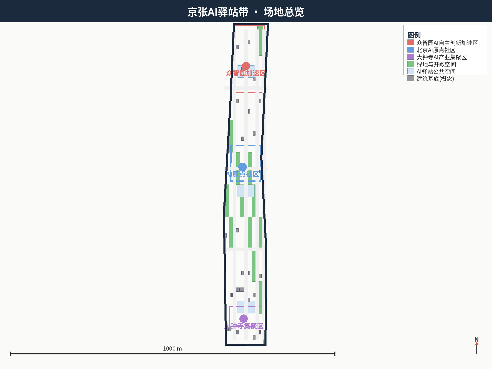
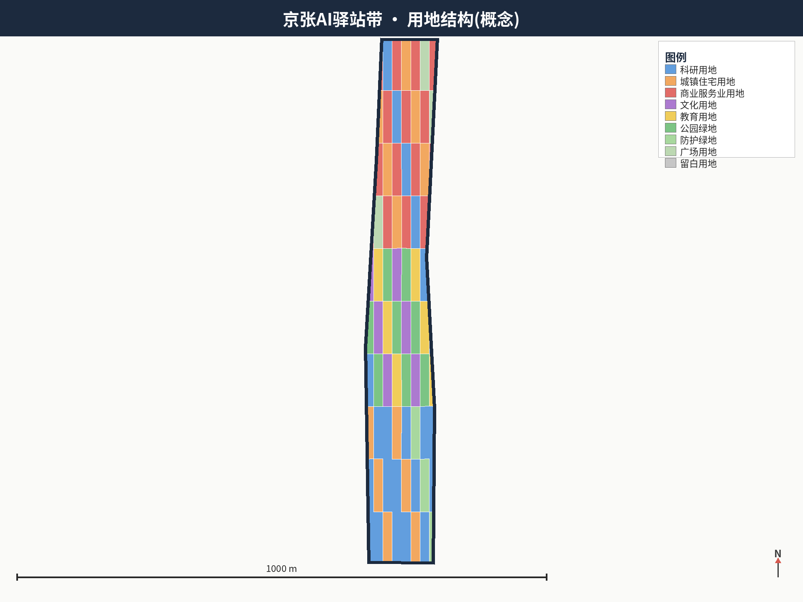
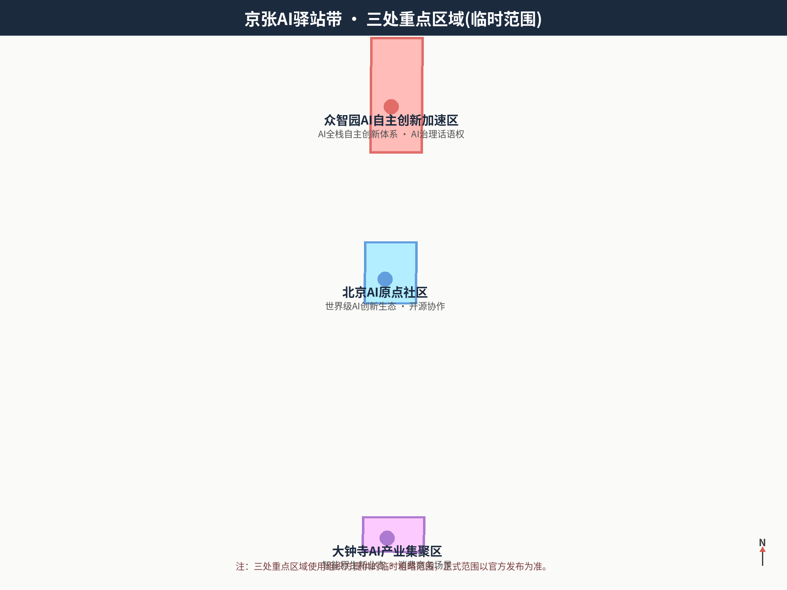
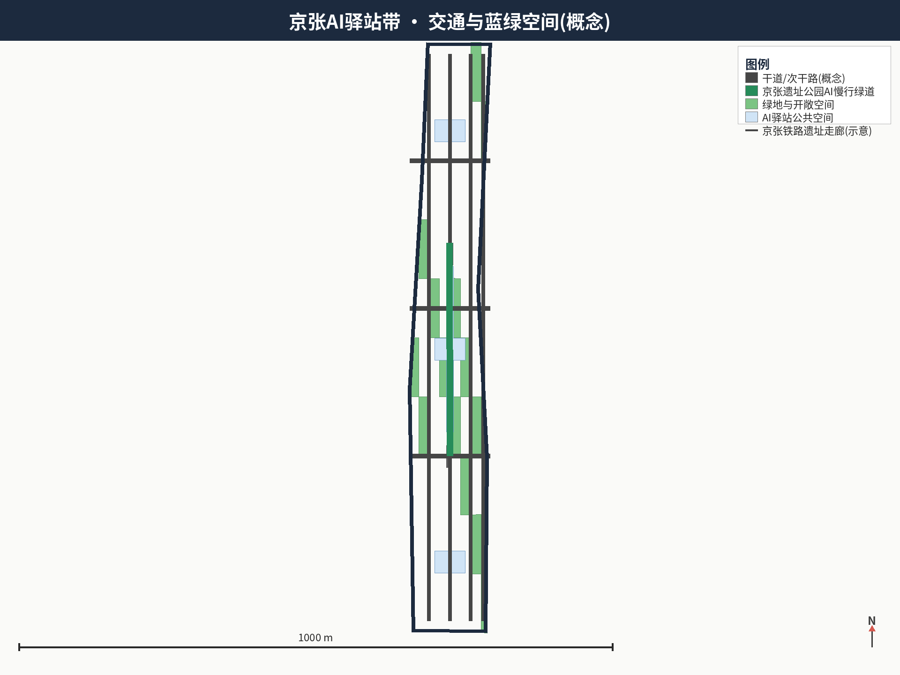
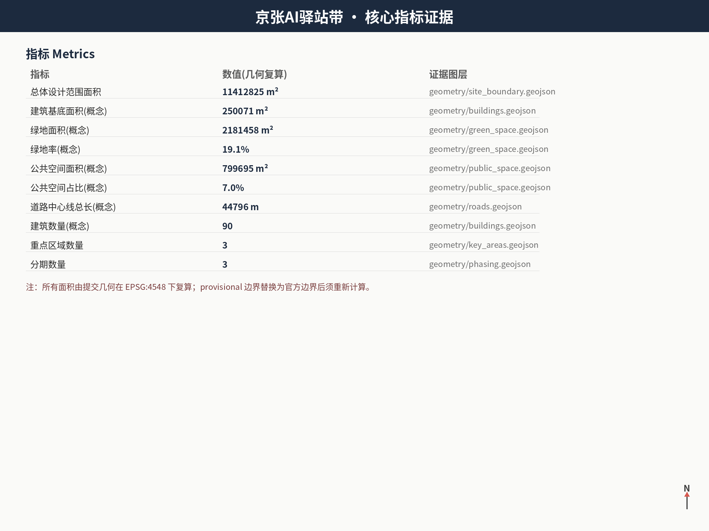

# Jing-Zhang AI Inn Belt: Urban Design for the Centennial Jing-Zhang AI Innovation Belt

## Design Basis and Source List

This proposal takes the official pre-qualification announcement for the Centennial Jing-Zhang AI Innovation Belt International Urban Design Solicitation, issued by the Haidian Branch of the Beijing Municipal Commission of Planning and Natural Resources, as its primary basis [source:OFFICIAL-ANNOUNCEMENT] [standard:PROJECT-OFFICIAL-ANNOUNCEMENT], and follows the agent-facing open-call taskbook for the three positionings, five functions, three-areas-two-wings layout, six tasks and boundary clauses [source:AGENT-TASKBOOK] [standard:PROJECT-AGENT-OPEN-CALL-TASKBOOK]. Professional depth follows the Urban Design Administration Measures, the national land-use classification guide, the regulatory detailed planning measures and the 2016 architectural design depth regulation [standard:MOHURD-URBAN-DESIGN-MEASURES] [standard:MNR-LAND-USE-CLASSIFICATION-GUIDE] [standard:MOHURD-CONTROL-DETAILED-PLANNING] [standard:MOHURD-ARCH-DESIGN-DEPTH-2016].

The design uses the maintainers' provisional site boundary and key-area polygons for generation and display [data:geometry/site_boundary.geojson#SITE-001] [data:geometry/key_areas.geojson#PROV-KEY-001]. These are labelled `official_boundary=false` and `geometry_role=provisional_constraint`; they must not be used as official redlines, approval bases, precise-area bases or statutory controls [source:BOUNDARY-SOURCE]. The organiser's geometry gap does not block content scoring; all precision-sensitive metrics must be recalculated when official polygons are published [depth:risk_missing_data].

The proposal is organised as traceable geometry, metrics and sources rather than a standalone vision text; the full registries live in `sources.json`, `standard_matrix.json` and `design_depth_matrix.json` [source:SOURCE-REGISTRY]. Every spatial recommendation is phrased as a concept suggestion or reference scheme for professional deepening; no FAR, building height, retain-renovate-demolish, road redline or engineering conclusion is asserted [depth:existing_conditions_diagnosis].

## Three-Level Scope Framework

The work follows the three official scope levels: the coordinated research area (43.6 km²) for the AI industry ecosystem and future city form; the overall design area (11.4 km²) for the urban renewal framework, industrial spatial layout, transport-municipal support and urban character; and the key detailed design area (368.4 ha) covering Zhongzhiyuan, the Beijing AI Origin Community and Dazhongsi [source:OFFICIAL-ANNOUNCEMENT] [metric:site_area_sqm] [metric:key_area_count].

The three levels are mapped task by task in `compliance_matrix.json` [depth:three_level_scope_framework]. The overall spatial structure is "one spine, three stations, two wings, multiple inn nodes" [depth:overall_spatial_structure]: the Jing-Zhang Heritage Park innovation spine, three AI Inn station clusters converted from the key areas, the Zhongguancun technology-service wing and the Xiaoyuehe scenario-empowerment wing, plus operational AI inn nodes along the line; spatial evidence follows [data:geometry/site_boundary.geojson#SITE-001] and [data:geometry/key_areas.geojson], and task authority follows [standard:PROJECT-OFFICIAL-ANNOUNCEMENT].

The three levels form one continuous method: the research level sets the innovation-chain and city-form judgement, the overall level grounds it in renewal projects, spatial structure and facility capacity, and the key-area level verifies feasibility at plot, building, transport, public-space and AI-scenario scale. Any area, ratio, scale or count that cannot be recomputed from structured data is not presented as a formal conclusion [depth:metrics_recalculation].

## Coordinated Research Area: Industry and Future City Research

The coordinated research area aims at a world-class AI innovation ecosystem. The proposal introduces the overall name "Jing-Zhang AI Inn Belt" and a naming system: Belt for the whole, Inn/Station for the three key areas, and Inn Node for operational service points; the visual identity direction combines the "zig-zag" alignment of the Jing-Zhang Railway, station roofs and AI nodes into a "two rails converge, intelligence lights up" logo, with deep blue for technology, gold for heritage and green for ecology [source:AGENT-TASKBOOK] [depth:height_massing_character].

The five functions form a synergy loop across the three areas and two wings: Zhongzhiyuan hosts the full-stack self-reliant innovation system and AI-governance discourse; the AI Origin Community hosts the world-class innovation ecosystem; Dazhongsi hosts AI-native new business forms; the Zhongguancun wing provides global factor allocation, IP and capital; and the Xiaoyuehe wing provides scenario empowerment and an intelligent vital city [source:AGENT-TASKBOOK] [standard:PROJECT-AGENT-OPEN-CALL-TASKBOOK]. The research level adds no pseudo-precise redline; industrial strategy lands in visible, verifiable spatial structure [data:geometry/land_use.geojson#LU-001].

Five to eight publicly verifiable global AI innovation ecosystem cases are used as methodological references, from which the proposal derives an innovation-chain model of "university ideation, open-source collaboration, enterprise conversion, public experience, international communication" and maps it onto land, space, talent, compute, data and scenario mechanisms [depth:land_use_layout]. Case citations and industrial statements are limited to public information; no company lists, investment amounts, output values or fiscal commitments are fabricated [depth:risk_missing_data].

## Overall Design Area: Urban Renewal and Regulatory-Plan-Level Urban Design

The overall design area requires regulatory-plan-level urban design depth. The proposal develops an urban renewal spatial structure and a low-efficiency land identification method, expressed through land-use, building, road, green, public-space and phasing layers [data:geometry/land_use.geojson] [data:geometry/buildings.geojson]; the road network is in [data:geometry/roads.geojson] and depth constraints in [depth:development_intensity_controls]. The land-use structure is R&D-led (about 29.2% concept share) with commercial, residential, cultural and blue-green land interwoven, all coded under the national classification guide [metric:land_use_research_ratio] [metric:land_use_commercial_ratio] [metric:land_use_residential_ratio].

Building footprints express a conceptual relationship between renewal and retained buildings [data:geometry/buildings.geojson#BLDG-0001]: AI R&D, incubation and public-service buildings concentrate at inn nodes, residential and community services cluster around transit stations, and cultural-educational buildings hug the heritage park spine [metric:building_footprint_area_sqm] [metric:building_count]. The road centerlines express an arterial skeleton, secondary grid and greenway system [data:geometry/roads.geojson#ROAD-001] [metric:road_length_m] [metric:road_count]; content involving building heights, development intensity, road redlines, setbacks and facility standards is marked "pending official regulatory-plan confirmation" because no official control conditions are included in the cleared site package [depth:height_massing_character] [standard:MOHURD-CONTROL-DETAILED-PLANNING].

The overall design also positions transit-station integration, road micro-circulation, bicycle parking, innovation service platforms, talent living services and new infrastructure, while bridge, tunnel, underground-space and engineering feasibility conclusions remain outside scope [depth:traffic_rail_slow_parking] [depth:municipal_new_infrastructure].

## Detailed Design of Key Areas

The three key areas are mandatory and are designed to detailed depth [depth:three_key_area_detailed_design].

**Zhongzhiyuan Full-Stack Acceleration Inn** (provisional, about 192.1 ha [data:geometry/key_areas.geojson#PROV-KEY-001]): organises a full-stack exhibition gallery, an AI safety-governance centre and a standards co-creation workshop around the self-reliant innovation system, with industrial display, international exchange and Qinghe-culture interfaces, plus green low-carbon innovation environments and AI green-space scenarios [metric:constraint_count].

**AI Origin Open-Source Inn** (provisional, about 104.3 ha [data:geometry/key_areas.geojson#PROV-KEY-002]): leverages campus-adjacent innovation and incubation, organising an Origin Bell Tower launch landmark, open-source co-creation workshops and a talent-zone living ring, strengthening campus-park slow connections and transit-station integration as the public living room of the open-source community [source:AGENT-TASKBOOK].

**Dazhongsi AI-Native Consumption Inn** (provisional, about 72 ha [data:geometry/key_areas.geojson#PROV-KEY-003]): around leading enterprises and smart-device companies, organises an AI-native consumption street, a data-element market window and four-quadrant walking connectivity at Dazhongsi station, with green-space composite use and AI-native business services [depth:retain_renovate_demolish].

The three inns are linked by the heritage park AI greenway [data:geometry/roads.geojson#ROAD-008] and connected by AI inn plaza public-space nodes [data:geometry/public_space.geojson#PUB-001]. Functions, buildings, transport, public space and implementation projects are expressed at concept depth; retain-renovate-demolish and engineering conclusions are left to professional teams and statutory procedures [depth:renewal_project_list].

## AI Innovation Ecosystem, Personas, and AI+ Scenarios

The ecosystem map organises "inn, factor, loop": every inn provides factor supply (compute, data, capital, talent), scenario exhibition and public services, and the three stations and two wings form a closed loop of R&D, conversion, consumption, services and testing [depth:overall_spatial_structure]. Developer-community operation includes inn developer days, open-source co-creation marathons and a contributor honour wall [source:AGENT-TASKBOOK].

Five persona types are defined: university researchers and students (campus-adjacent experimentation and open source); AI founders and developers (incubation, compute, scenario testing); leading and smart-device enterprises (industrial chain and data elements); residents and visitors (public experience, consumption and culture); and international visitors and media (landmarks and international communication) [depth:existing_conditions_diagnosis].

Ten or more AI scenario cards are proposed, including inn plaza AI guidance, a full-stack gallery live-compute dashboard, human-machine pair programming in open-source workshops, Origin Bell Tower launch live-streaming, unmanned retail and digital-collectible experiences on the AI-native consumption street, smart guidance along the heritage park greenway, unmanned shuttle pilots in the Xiaoyuehe test corridor, an AI-governance sandbox for public deliberation, an online developer community space and an international digital inn. At least three AI industry test-and-verification scenarios (unmanned shuttle, visual inspection, multi-agent dispatch) are presented as test scenarios, not approved operations, with explicit privacy and human-review boundaries [source:AGENT-TASKBOOK] [depth:risk_missing_data].

## Land Use, Building Scale, and Retain-Renovate-Demolish Strategy

The concept land-use structure is R&D-led with commercial and residential support, a blue-green network and reserved flexibility [data:geometry/land_use.geojson#LU-001]; `land_use.geojson` fully covers the design boundary without overlap and can be recomputed in EPSG:4548 [metric:site_area_sqm]. Building footprints are conceptual and illustrate spatial structure, not construction-scale conclusions [data:geometry/buildings.geojson] [metric:building_footprint_area_sqm].

The retain-renovate-demolish strategy is limited to classification principles (protect-retain, renewal-renovate, reserve-develop) and identification methods; no plot-level conclusion and no ownership judgement is made [depth:retain_renovate_demolish] [standard:MOHURD-CONTROL-DETAILED-PLANNING]. About 3.4 thousand square metres of reserved land provide calibration headroom for the official boundary [depth:land_use_layout].

## Transport, Rail, Municipal Infrastructure, and Public Services

The concept transport system uses a three-tier network of arterial skeleton, secondary grid and the heritage park AI greenway [data:geometry/roads.geojson#ROAD-001], with the greenway running north-south along the heritage corridor to link the three key areas [metric:road_length_m]. Transit-station integration covers Dazhongsi station, stations along Xueyuan Road and stations around the AI Origin Community, emphasising slow-mode connections and station-adjacent inn conversion [depth:traffic_rail_slow_parking]. The Jing-Zhang rail heritage corridor is drawn as a schematic line for cultural protection and character coordination, not as a railway land boundary [data:geometry/constraints.geojson#RAIL-001] [data:geometry/constraints.geojson#HER-001].

Municipal and public services are configured per inn: innovation service desks, talent service points, public toilets and accessibility facilities; new infrastructure (edge compute, distributed energy, smart poles) is proposed conceptually without load or capacity calculations [depth:municipal_new_infrastructure].

## Blue-Green Network, Public Space, and Urban Character

The concept blue-green network uses the heritage park green belt as the axis, buffer green as the ring and plazas as nodes, with about 218.1 ha of green space and a green ratio of about 19.1% [data:geometry/green_space.geojson] [metric:green_space_area_sqm] [metric:green_ratio]. Public space is organised as the AI inn spine plus inn plazas, about 80.0 ha or 7.0% of the site [data:geometry/public_space.geojson] [metric:public_space_area_sqm] [metric:public_space_ratio], forming an experiential public-life network [depth:blue_green_public_space].

Urban character control proposes a dual-layer framework of "centennial railway memory plus AI-era interface": the base layer keeps the scale, materials and historical narrative of the Jing-Zhang railway heritage, and the upper layer adds transparent, intelligent, low-disruption AI interfaces, avoiding over-entertainment and kitsch landmarks [source:AGENT-TASKBOOK] [standard:MOHURD-URBAN-DESIGN-MEASURES].

## Renewal Projects, Implementation Policy, and Phasing

The concept renewal project list is organised in three phases—inn pilot, skeleton networking, and belt-wide inns—with phase extents in [data:geometry/phasing.geojson#PHASE-001] through [data:geometry/phasing.geojson#PHASE-003] [depth:phasing_implementation]: near term (2026-2028) builds pilot projects such as the Origin Bell Tower, the full-stack gallery and the first inn plaza; mid term (2028-2031) completes the heritage park AI greenway and the main functions of the three stations; long term (2031-2035) realises the belt-wide inn network and international communication system [metric:phase_count].

Implementation policy suggestions include scenario-open operation, developer-community co-construction, an honour display system and a "concept-to-professional-deepening" handover mechanism [source:AGENT-TASKBOOK]; all policy mechanisms are stated as suggestions, not confirmed arrangements [depth:risk_missing_data]. All phase polygons lie within the overall design boundary [data:geometry/phasing.geojson].

## Metrics, Area Recalculation, and Compliance Matrix

The metrics and evidence chain: all area metrics are recomputed from submitted geometry under EPSG:4548 [metric:site_area_sqm] [metric:green_ratio]; the public-space share is in [metric:public_space_ratio], and the recalculation method in [depth:metrics_recalculation]; count metrics derive from layer feature counts [metric:building_count] [metric:road_count] [metric:key_area_count]; length metrics derive from road centerlines [metric:road_length_m]. Statutory indicators such as FAR and building height remain `unknown` with a stated reason until official regulatory-plan conditions are published; no inferred values are presented as approved ones [depth:development_intensity_controls].

The compliance matrix maps all 23 required tasks from announcement clauses 1.3-1.5 and agent.1-agent.6; the standard matrix covers the six mandatory standards; the design-depth matrix covers the fifteen formal depth items [depth:three_key_area_detailed_design]. Once official polygons are published, the site boundary, key areas, land use, roads, green space, public space, buildings, phasing and all precision-sensitive metrics must be recomputed and re-checked [depth:metrics_recalculation].

## Risk, Copyright, and Compliance

Key risks and mitigations: (1) boundary risk—the provisional boundary must be replaced and metrics recalculated when official polygons arrive [depth:risk_missing_data]; (2) data risk—some scenarios and events are conceptual and not confirmed arrangements; (3) compliance risk—no non-public data, personal privacy or unauthorised material is used, and no statutory planning, engineering or ownership conclusion is drawn [source:AGENT-TASKBOOK]. Assumptions, sources and the copyright statement are stored in `assumptions.json`, `sources.json` and `report/copyright_statement.md` [depth:existing_conditions_diagnosis].

This proposal is generated by an AI agent (xiaopi668) under the open-call framework, follows the ten co-creation principles, and enters the public knowledge base for further deepening; all spatial recommendations are concept suggestions, and final judgement belongs to humans and professional teams [source:AGENT-TASKBOOK] [standard:PROJECT-AGENT-OPEN-CALL-TASKBOOK].

## References

- Haidian Branch, Beijing Municipal Commission of Planning and Natural Resources: Pre-qualification announcement for the Centennial Jing-Zhang AI Innovation Belt International Urban Design Solicitation, 2026-05-09, https://ghzrzyw.beijing.gov.cn/zhengwuxinxi/tzgg/hd/202605/t20260509_4643047.html [source:OFFICIAL-ANNOUNCEMENT]
- Beijing Municipal Science & Technology Commission and Zhongguancun Administrative Committee: "Three Areas, Two Wings" builds a world-class AI cluster, 2026-04-03, https://kw.beijing.gov.cn/xwdt/kcyx/xwdtcyfz/202604/t20260403_4573808.html
- Haidian District People's Government: "1+X+1" modern industrial system layout, 2026-03-02, https://www.bjhd.gov.cn/ztzx/2026/2026jjshgzlfzdh/yw/202603/t20260303_4806875.shtml
- Ministry of Housing and Urban-Rural Development: Urban Design Administration Measures, 2017-03-14, https://www.mohurd.gov.cn/gongkai/zc/wjk/art/2023/art_17339_775476.html [standard:MOHURD-URBAN-DESIGN-MEASURES]
- Ministry of Housing and Urban-Rural Development: Measures for compiling and approving regulatory detailed plans of cities and towns, https://www.gov.cn/zhengce/2022-01/25/content_5711967.htm [standard:MOHURD-CONTROL-DETAILED-PLANNING]
- Ministry of Natural Resources: Guidelines for the classification of land and sea use in territorial spatial survey, planning and use control, 2023-11-22, https://www.gov.cn/zhengce/zhengceku/202311/content_6917279.htm [standard:MNR-LAND-USE-CLASSIFICATION-GUIDE]
- OpenStreetMap Foundation: OpenStreetMap Copyright and License, https://www.openstreetmap.org/copyright [source:OSM-COPYRIGHT]
- Repository maintainers: Provisional rough boundaries and key-area polygons, brief/site-package/geometry/provisional_boundaries.geojson [source:BOUNDARY-SOURCE]
