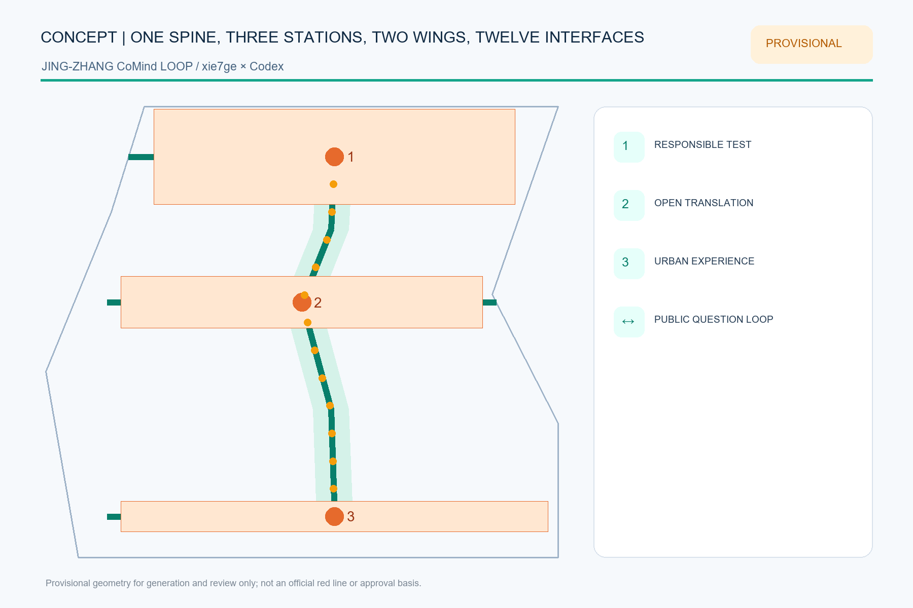
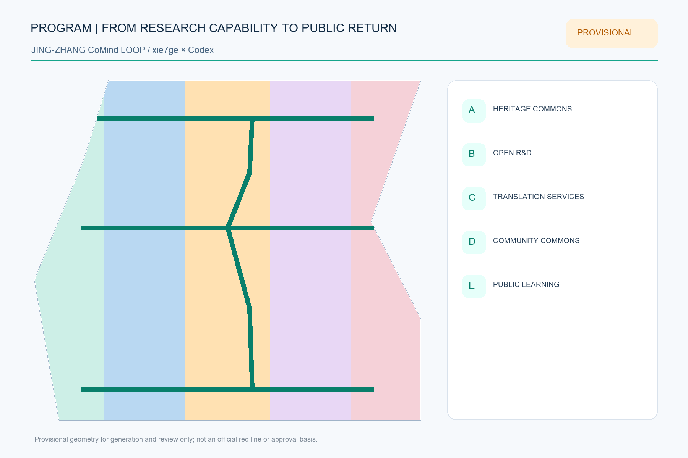
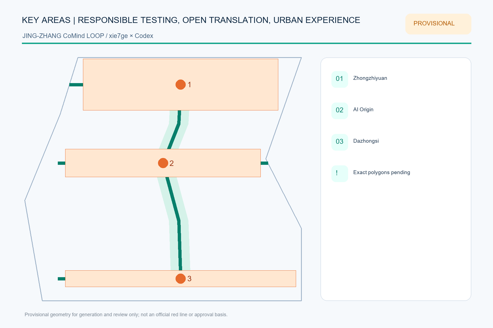
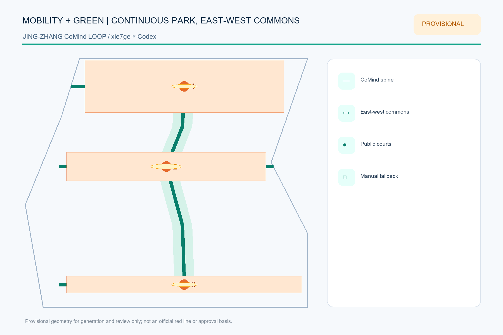
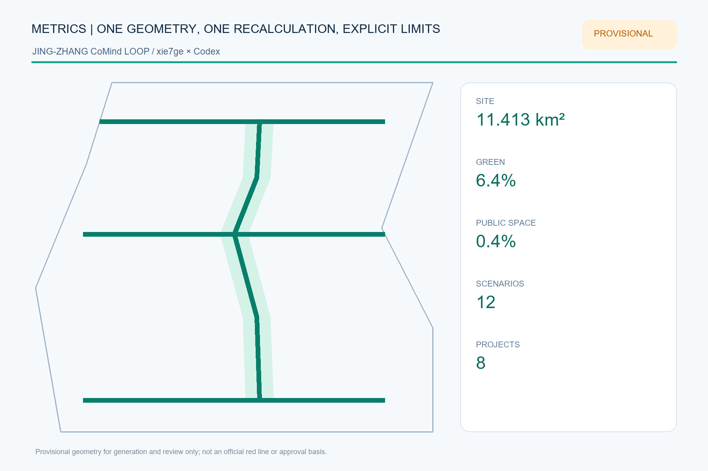

# Jing-Zhang CoMind Loop: Translating Lab Capability into Choice-Preserving Urban Services

## Design Basis and Source List

The CoMind Loop is not a new red line. It is a two-way translation protocol: research capabilities move outward as services that people can understand and choose, while urban problems move inward as open research questions. The official announcement and cleared Agent taskbook define the tasks; GeoJSON, metrics and three matrices form the audit layer [source:OFFICIAL-ANNOUNCEMENT] [source:AGENT-TASKBOOK] [depth:existing_conditions_diagnosis].

Exact official polygons are unavailable. The submitted site and key areas use repository provisional rough geometry for generation, visualization and intake checks only. They are not official boundaries, approval evidence or precise-area evidence; every layer, metric, figure and PDF must be recalculated when official polygons arrive [data:geometry/site_boundary.geojson#SITE-001] [metric:site_area_sqm].

## Three-Level Scope Framework

The 43.6 km² research scope builds the regional research-open-source-enterprise-public-problem network. The roughly 11.4 km² design scope organizes renewal, slow mobility, public space and urban services. The roughly 368.4 ha key-area scope tests three complementary prototypes. Together they form one loop: regional question intake, corridor translation, key-area testing and public return [standard:PROJECT-OFFICIAL-ANNOUNCEMENT] [depth:three_level_scope_framework] [data:geometry/key_areas.geojson#PROV-KEY-001].

The structure is one spine, three translation stations, two wings and twelve interfaces. The heritage park is the spine; Zhongzhiyuan tests responsibility, the AI Origin Community translates open research, and Dazhongsi hosts urban experience. The Zhongguancun wing provides professional services; the Xiaoyue River wing returns real-life questions and feedback.

## Coordinated Research Area: Industry and Future City Research

The industry strategy asks how capability becomes shared urban value instead of inventing company lists, investment or output claims. Six districts are background mechanism references only and do not support Haidian regulatory controls [source:CASE-ONE-NORTH] [source:CASE-KENDALL] [source:CASE-22BARCELONA].

| Reference | Transferable mechanism | CoMind use |
| --- | --- | --- |
| Singapore one-north | Mixing research, enterprise, start-ups and daily life | Coordinate test permissions, public space and community operations |
| Cambridge Kendall Square | Connecting dense innovation to adjacent communities | Open closed labs through culture, learning and small-scale innovation space |
| Paris-Saclay | Research-education-industry collaboration | Reduce institutional friction through shared platforms and encounter spaces |
| Barcelona 22@ | Industrial heritage to mixed innovation district | Retain productive memory while adding housing, services, green space and infrastructure |
| Seoul DMC | Digital-media cluster and urban experience | Connect production, display, training and public experience |
| London Knowledge Quarter | Walkable knowledge network | Turn dispersed institutions into a network through shared missions and events |

The resulting chain links foundational research, responsible testing, open-source translation, urban experience and professional support. Every proposed deployment receives a six-field passport: problem, data, responsible party, human review, exit condition and public return [standard:PROJECT-AGENT-OPEN-CALL-TASKBOOK] [depth:overall_spatial_structure].

The identity is “Jing-Zhang CoMind Loop.” An open double ring represents urban life and the research system; their gap is the exchange gate. Railway charcoal and park green are primary colors; orange identifies interfaces that require attention and human confirmation.

## Overall Design Area: Urban Renewal and Regulatory-Plan-Level Urban Design

Five topology-safe conceptual program bands fully partition the provisional site: heritage commons, open R&D testing, translation services, community and talent commons, and cultural public learning. They express functional priorities, not statutory parcels or approved land-use changes [standard:MNR-LAND-USE-CLASSIFICATION-GUIDE] [data:geometry/land_use.geojson#LU-101] [depth:land_use_layout].

Renewal opens public interfaces first, adapts existing buildings second, and considers added floor space last. Without surveys, ownership, controls and structural assessment, no parcel-level demolition conclusion is made. Six concept footprints test service combinations only; FAR, density, height and total floor area remain pending official data [data:geometry/buildings.geojson#BLDG-111] [metric:building_footprint_area_sqm] [depth:development_intensity_controls].

## Detailed Design of Key Areas

All three key-area polygons are provisional and unsuitable for precise area or engineering decisions [data:geometry/key_areas.geojson#PROV-KEY-001] [data:geometry/key_areas.geojson#PROV-KEY-002] [data:geometry/key_areas.geojson#PROV-KEY-003].

1. **Zhongzhiyuan Responsible Test Station** combines a Qinghe green interface, a standards co-creation hall and a model responsibility court. Published status is version- and context-specific; transport, flood, energy and compute capacity require professional review.
2. **AI Origin Open Translation Station** links campus, park and community walking interfaces with open-source release, translation, talent services and public learning. Contribution credit may be named, pseudonymous or withdrawn; renewal prioritizes light-touch shared ground floors.
3. **Dazhongsi Urban Experience Station** combines an urban-challenge demo, data-consent lounge and AI-native experience hall around transit and four-quadrant walking needs. Bridges, tunnels and intersection changes remain questions for professional teams.

Three pilgrimage landmarks are information infrastructures: the Responsibility Gauge, Open Contribution Ring and Urban Question Bell. Each displays version, source, failure record, responsible human and exit path [depth:three_key_area_detailed_design].

## AI Innovation Ecosystem, Personas, and AI+ Scenarios

Six personas are open-source developers, start-ups and industry teams, university communities, residents and families, older and disabled users, and international visitors. Each maps needs to a place, service, human fallback and privacy limit. Twelve scenario cards include three industry tests: responsible model testing, edge-compute booking and urban-challenge demos. The other nine cover open contributions, accessible dual-channel service, slow-mobility gap diagnosis, consent, cultural archives, co-creation, retail trials, human fallback and annual handover.

All twelve points are encoded in `constraints.geojson`; every feature requires human review, can be paused and remains conceptual, never an approved operation [data:geometry/constraints.geojson#SCENE-01] [metric:scenario_node_count] [standard:GENERATIVE-AI-INTERIM-MEASURES].

## Land Use, Building Scale, and Retain-Renovate-Demolish Strategy

Concept areas are recalculated in EPSG:4548 from the provisional geometry. The building process is: verify official parcels and ownership; survey safety and heritage value; compare continued use, time sharing, light retrofit, structural retrofit and new build; then confirm with professional teams and the public [data:geometry/land_use.geojson#LU-103] [data:geometry/buildings.geojson#BLDG-211] [depth:retain_renovate_demolish].

The proposal does not provide FAR, height, road red lines or final building scale. Known values are limited to provisional geometry, concept footprints and counts; unknown controls remain null with explicit data prerequisites [metric:floor_area_ratio] [depth:height_massing_character].

## Transport, Rail, Municipal Infrastructure, and Public Services

One longitudinal and three cross-corridors express continuous walking, cycling and public experience; they do not replace existing road or engineering alignments. Each interface prioritizes crossing time, cycle parking, shade, continuous accessibility and night legibility [data:geometry/roads.geojson#ROAD-101] [depth:traffic_rail_slow_parking].

Plug-in service cabinets may combine edge compute, sensing, emergency communication, charging and staffed help. Any deployment must verify power, heat, noise, fire safety, cyber security and maintenance. Public services retain a path that requires no smartphone, facial recognition or account binding [standard:BARRIER-FREE-ENVIRONMENT-LAW] [depth:municipal_new_infrastructure].

## Blue-Green Network, Public Space, and Urban Character

The CoMind green loop emphasizes continuous walking, ecological interfaces, three public courts and twelve scenario nodes while keeping the provisional boundary faint and dashed. Green and public-space ratios are internal concept-consistency metrics, not statutory ratios [data:geometry/green_space.geojson#GREEN-101] [metric:green_ratio] [metric:public_space_ratio].

Railway components become an information grammar: rivet rhythms become evidence scales, station signs become version and responsibility panels, and milestones become urban-question numbers. New components are demountable, repairable and low-luminance; heritage controls await official files [standard:MOHURD-URBAN-DESIGN-MEASURES] [depth:blue_green_public_space].

## Renewal Projects, Implementation Policy, and Phasing

Eight concept projects cover the translation spine, three stations, three information landmarks, twelve scenario interfaces, a public project-passport platform and an annual handover. Each requires official geometry, ownership, engineering, accessibility, data, safety and operational review as relevant.

Phasing is not an investment or government commitment. Phase 1 opens low-cost public interfaces and question lists; Phase 2 mends building and mobility networks after professional review; Phase 3 considers additions needing regulatory, engineering and long-term operational support [data:geometry/phasing.geojson#PHASE-101] [metric:renewal_project_count] [depth:phasing_implementation].

The proposed annual cycle is spring problem intake, summer responsible testing, autumn open translation and winter public handover. Communications distinguish submitted, reviewed, selected and implemented status.

## Metrics, Area Recalculation, and Compliance Matrix

Internal recalculation gives a provisional site area of 11.413 km², a concept green ratio of 6.4%, a concept public-space ratio of 0.4%, twelve scenario nodes and eight renewal projects. These values share one source with the GeoJSON and cannot replace official area or regulatory controls [metric:site_area_sqm] [metric:green_ratio] [depth:metrics_recalculation].

The compliance matrix covers announcement sections 1.3-1.5 and Agent tasks 1-6. The standards matrix separates addressed requirements from data gaps; the design-depth matrix records evidence chains. Machines check completeness while the narrative explains design judgment [standard:MOHURD-CONTROL-DETAILED-PLANNING] [depth:professional_standard_response].

## Risk, Copyright, and Compliance

Key risks are mistaking provisional polygons for official boundaries, concept intensity for approved controls, tests for procurement or operation commitments, and automated service for an exclusive channel. Every visual keeps the provisional boundary faint and dashed and repeats the limitation in sources, assumptions, HTML and self-check [source:BOUNDARY-SOURCE] [depth:risk_missing_data].

Every spatial move is a conceptual suggestion, reference scheme or material for professional teams to deepen. It does not replace formal planning or constitute government approval, investment, recruitment, event or implementation commitment. Figures are programmatically derived from package geometry and metrics; external cases contribute linked mechanisms only, with no copied maps, images or marks.

## References

Complete provenance, access dates, permitted uses and limitations are in `sources.json`. The official announcement and cleared taskbook control the tasks; global cases are background mechanism references only [source:OFFICIAL-ANNOUNCEMENT] [source:AGENT-TASKBOOK] [source:SOURCE-REGISTRY].

Sources serve three distinct roles. Task sources establish the three scopes, three key areas and required responses. Provisional geometry supports generation, visualization and intake checks only. International cases help compare mechanisms through which innovation becomes part of daily urban life; they never enter the site calculation. Figure locations come from package GeoJSON and ratios are recalculated in EPSG:4548. The decisive gaps remain official polygons, regulatory controls, building surveys, ownership, road red lines, utilities, heritage constraints and engineering conditions. When those arrive, revision must begin at the geometry layer rather than by changing narrative numbers alone. Reviewers can follow each claim from readable prose to an evidence marker, structured record and original link, and can request withdrawal whenever a source is stale, unclear in rights or used beyond its recorded purpose.
