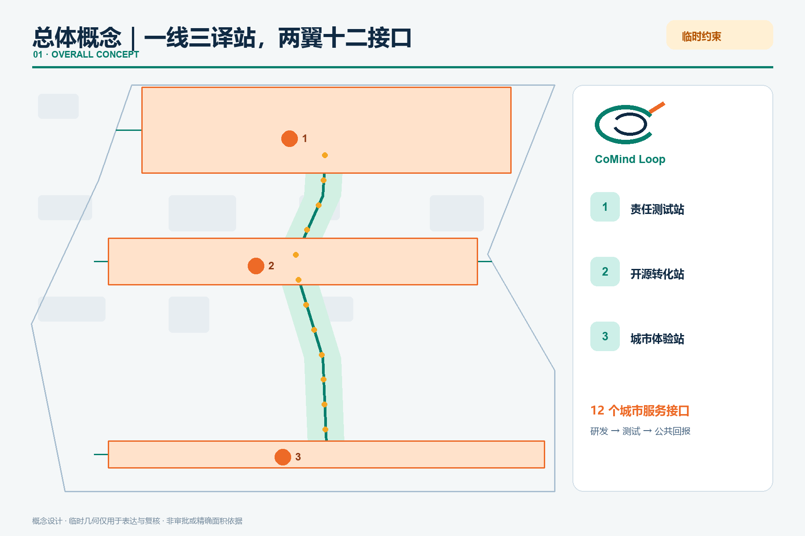
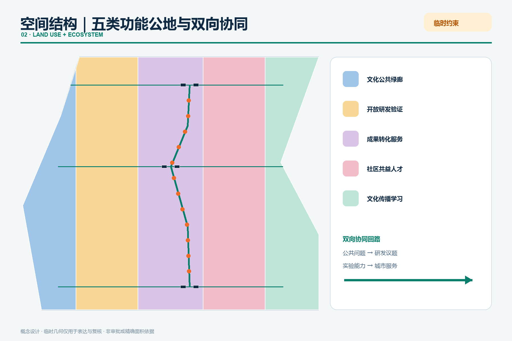
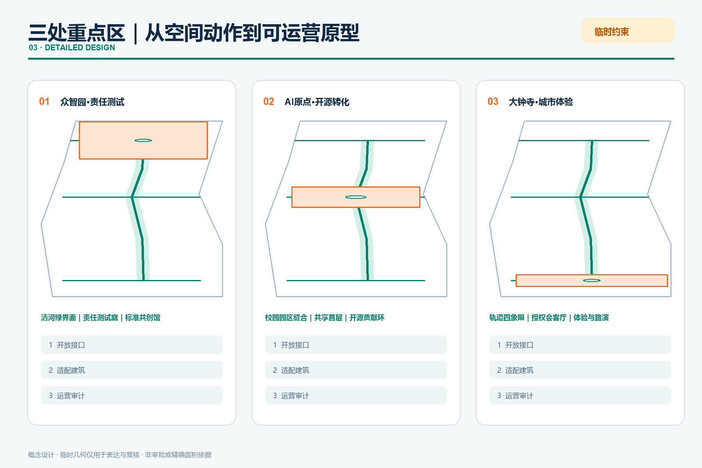
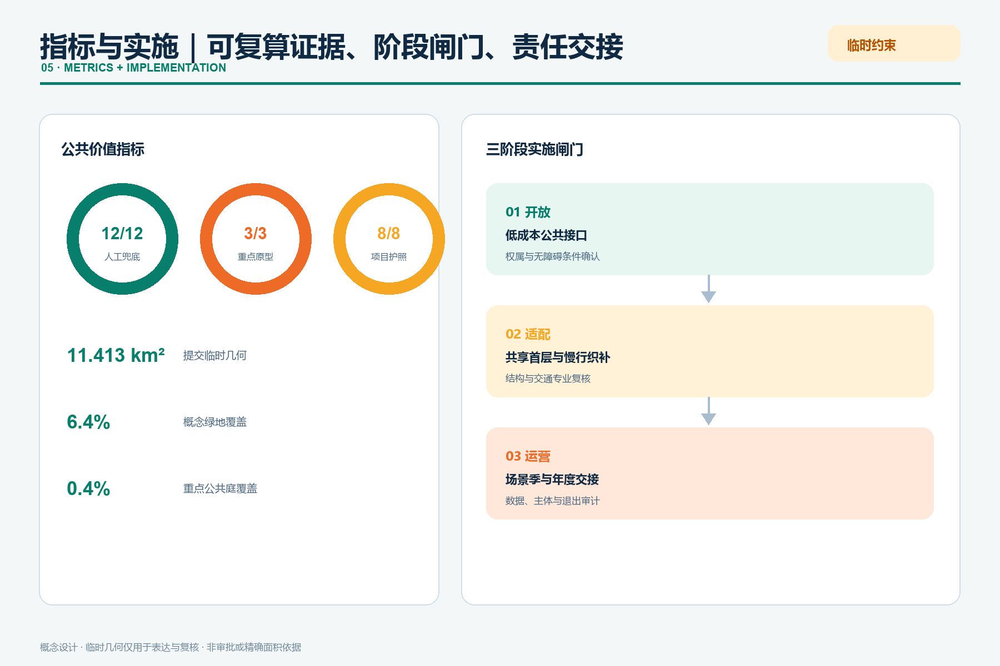

# 京张共智环：把实验室能力翻译成可选择的城市服务

## 设计依据与资料清单

“共智环”不是一条新红线，而是一套双向翻译机制：科研能力向外被翻译成普通人能理解、能选择的服务；居民、开发者和企业遇到的真实问题向内被翻译成公开研发议题。方案以官方公告和面向智能体任务书为任务依据，以仓库 GeoJSON、指标、三类矩阵作为审计层 [source:OFFICIAL-ANNOUNCEMENT] [source:AGENT-TASKBOOK] [depth:existing_conditions_diagnosis]。

当前未取得官方精确总体边界和三处重点区 polygon。`site_boundary.geojson` 与 `key_areas.geojson` 均来自仓库临时粗略边界，仅用于生成、可视化和入口自检，不是官方红线、审批依据或精确面积依据；官方数据到位后，全部用地、建筑、道路、绿地、公共空间、分期、图件和指标必须统一复算 [data:geometry/site_boundary.geojson#SITE-001] [metric:site_area_sqm]。

## 三层范围工作框架

43.6 平方公里统筹研究范围用于建立“科研-开源-企业-公共问题”协同网络；约 11.4 平方公里总体设计范围用于组织更新、慢行、公共空间和城市服务；约 368.4 公顷重点区域用于验证三个互补原型。三层不是三份互不相干的图，而是“区域议题进入-沿线翻译-重点区验证-公共结果返回”的闭环 [standard:PROJECT-OFFICIAL-ANNOUNCEMENT] [depth:three_level_scope_framework] [data:geometry/key_areas.geojson#PROV-KEY-001]。

总体结构为“一线、三译站、两翼、十二接口”：京张遗址公园是共智翻译主线；众智园是责任测试站，AI 原点社区是开源转化站，大钟寺是城市体验站；中关村科技服务翼提供知识、资本与专业服务，小月河场景赋能翼提供真实问题和公共反馈；十二个场景节点贯穿从试验到退出的完整链条。

## 统筹研究范围产业与未来城市研究

产业策略不以虚构企业名单、投资额或产值为起点，而以“能力怎样通过城市被共同使用”为问题。六个全球创新区只作为机制参照，不支撑海淀控规或规模判断 [source:CASE-ONE-NORTH] [source:CASE-KENDALL] [source:CASE-22BARCELONA]。

| 案例 | 可转化机制 | 京张应用 |
| --- | --- | --- |
| 新加坡 one-north | 科研、企业、创业与生活混合 | 把试验许可、公共空间和社区运营放在同一园区系统 |
| 剑桥 Kendall Square | 高密创新与周边社区连接 | 用公共文化、学习和可负担创新空间打开封闭实验室 |
| Paris-Saclay | 科研教育与产业协作 | 以多机构共享平台和开放交流空间降低跨组织摩擦 |
| Barcelona 22@ | 工业遗产更新为混合创新城区 | 保留产业记忆，同时织入住宅、服务、绿地与先进基础设施 |
| Seoul DMC | 数字媒体集群与城市体验 | 把内容生产、展示、培训和公众体验连接成可见链条 |
| London Knowledge Quarter | 步行尺度知识网络 | 通过共同议题和活动把分散机构变成协作网络 |

由此形成五段生态链：基础研究与开源工具在原点社区被解释；模型、芯片、算力和安全能力在众智园被测试；企业服务与智能原生业态在大钟寺被体验；中关村科技服务翼提供法务、知识产权、资本和国际连接；小月河场景翼把城市问题与使用反馈送回研发端。它以北京“三区两翼”和海淀“1+X+1”产业体系为地方政策背景，但不把政策方向误写成已批准项目。每一次场景开放均配“问题、数据、责任人、人工复核、退出条件、公共回报”六栏护照 [source:SRC-2026-BJ-KW-THREE-AREAS-WINGS] [source:SRC-2026-HAIDIAN-1X1] [depth:overall_spatial_structure]。

命名使用“京张共智环 / Jing-Zhang CoMind Loop”。标志采用一枚未闭合双环：外环象征城市日常，内环象征研发系统，橙色缺口形成交换门；它已进入总体概念图、导视牌和项目护照的示意应用。主色“铁路炭灰+公园青绿”，橙色只标识需要公众注意和人工确认的接口；不使用企业商标和未经授权字体。这个识别系统把“可选择、可追溯、可退出”变成同一套视觉语法，而不只是一句口号 [depth:overall_spatial_structure]。

## 总体设计范围城市更新与控规深度城市设计

用地层采用五个共享边界的概念功能带，完整覆盖临时总体边界：文化公共绿廊、开放研发验证、成果转化服务、社区共益人才服务、文化传播公共学习。它们表达功能优先级，不是法定地块或用途调整 [standard:MNR-LAND-USE-CLASSIFICATION-GUIDE] [data:geometry/land_use.geojson#LU-101] [depth:land_use_layout]。

更新遵循“先开放接口、再适配建筑、最后讨论增量”的顺序。没有现状测绘、权属、控规和结构鉴定时，不作具体地块拆除判断；仅把既有建筑分为可继续使用、可轻改共享、待专业评估三类方法。六个概念建筑基底用于说明服务组合，建筑总规模、容积率、密度和高度保持待正式数据补齐 [data:geometry/buildings.geojson#BLDG-111] [metric:building_footprint_area_sqm] [depth:development_intensity_controls]。

## 重点区域详细设计

三处重点区均以临时范围表达，不能用于精确面积或工程判断 [data:geometry/key_areas.geojson#PROV-KEY-001] [data:geometry/key_areas.geojson#PROV-KEY-002] [data:geometry/key_areas.geojson#PROV-KEY-003]。

1. **众智园·责任测试站**：形成清河绿色测试界面、标准共创馆和模型责任测试庭。测试结果以红黄绿三段状态公开，但任何“通过”只代表限定版本与限定场景；对外交通、河道、防洪、能耗和算力容量待专业复核。
2. **AI 原点社区·开源转化站**：以校区-园区-社区步行接口串联开源发布、成果转化、人才服务和公共学习。贡献墙允许实名、化名或撤回；空间更新优先轻改首层和共享时段，不预设拆迁。
3. **大钟寺·城市体验站**：围绕轨道站点与四象限步行需求，提出城市问题路演、数据授权会客厅和智能原生体验厅。桥隧、地下和路口改造仅作为待交通与工程团队深化的问题清单。

三个重点区采用同一套“开放接口—适配建筑—运营审计”方法，但空间动作和验收问题不同：

| 重点区 | 空间结构与公共空间 | 建筑更新与慢行 | AI 场景与运营 | 主要实施风险 |
| --- | --- | --- | --- | --- |
| 众智园 | 清河绿界面串联责任测试庭、标准共创馆和可见失败记录 | 优先复用首层与庭院；跨河、交通及防洪条件待核 | 模型责任测试、端侧算力预约；限定版本、人工复核、公开暂停 | 河道、防洪、能耗、消防和测试责任边界 |
| AI 原点社区 | 校园—园区—社区缝合界面形成开源发布、学习与人才服务环 | 共享首层和分时开放优先，不预设拆迁；连续无障碍接口待测 | 开源贡献译站、文化档案导览；实名/化名/撤回并行 | 校园开放、知识产权、夜间扰动与维护主体 |
| 大钟寺 | 轨道四象限步行网络组织授权会客厅、体验厅和城市问题路演 | 先改善地面过街、遮阴和停留；桥隧地下仅作深化议题 | 数据授权、AI 消费试验、数字内容共创；测试不等于采购 | 轨道接驳、商业误读、数据授权与人流安全 |

每区都以项目护照记录位置、责任主体、版本、开放时段、人工负责人、暂停条件和下一次复核日期；官方 polygon、现状建筑、权属和工程条件到位后，专业团队从几何和建筑调查开始深化，而不是只替换图面标题 [data:geometry/key_areas.geojson#PROV-KEY-002] [depth:three_key_area_detailed_design]。

三座朝圣地标分别是“责任刻度塔”“开源贡献环”“城市问题钟”。它们首先是公共信息设施：显示版本、来源、失败记录、人工负责人和退出方式，不以巨型造型或商业打卡替代内容 [depth:three_key_area_detailed_design]。

## AI 创新生态、人才画像与 AI+ 场景

| 画像 | 核心诉求 | 空间与服务回应 |
| --- | --- | --- |
| 开源开发者 | 协作、测试、贡献被看见 | 原点社区开源译站；只公开自愿署名贡献 |
| 初创与产业团队 | 低成本验证、合规咨询、客户反馈 | 众智园责任测试庭；阶段闸门和人工复核 |
| 高校师生 | 成果转化、跨校协作、夜间学习 | 校区-园区慢行接口与成果转化馆 |
| 周边居民与亲子家庭 | 低扰动休闲、可理解服务、非数字选择 | 共智绿廊、人工服务台、亲子解释路线 |
| 老年人与残障使用者 | 连续无障碍、语音大字、现场协助 | 双通道服务组件；实体导视与人工兜底 |
| 国际访客与投资者 | 快速理解、可信证据、双语接待 | 大钟寺城市体验厅与可核验项目护照 |

| 卡片 | 类型 | 空间 | 人工与退出边界 |
| --- | --- | --- | --- |
| 01 模型责任测试 | 产业测试 | 众智园 | 红队结果由人审；不通过即可撤回 |
| 02 端侧算力预约 | 产业测试 | 众智园 | 公开能耗口径；人工调度可覆盖算法 |
| 03 城市问题路演 | 产业测试 | 大钟寺 | 测试不等于采购或政府承诺 |
| 04 开源贡献译站 | 公共创新 | 原点社区 | 自愿署名；允许匿名与撤回 |
| 05 无障碍双通道 | 公共服务 | 沿线驿站 | 所有智能入口保留现场人工方式 |
| 06 慢行断点诊疗 | 出行 | 公园节点 | 仅用匿名计数；不追踪个人轨迹 |
| 07 数据授权会客厅 | 治理 | 大钟寺 | 逐项同意、用途到期、可撤回 |
| 08 文化档案导览 | 文化 | 清华园站与沿线 | 史实与生成内容分层标识 |
| 09 数字内容共创 | 文化产业 | 大钟寺 | 素材清权、作者署名、人工发布 |
| 10 AI 消费试验橱窗 | 生活服务 | 大钟寺 | 先小规模试用；现金与人工渠道并行 |
| 11 公共服务人工兜底 | 包容服务 | 社区接口 | 不要求下载应用或提交生物识别 |
| 12 年度共智交接礼 | 运营 | 全线 | 公开问题、失败和下一年责任人 |

十二个节点已经写入 `constraints.geojson`，其中三项为产业测试场景；每项都要求人工复核、可暂停和概念状态，不得被表述为已批准运营 [data:geometry/constraints.geojson#SCENE-01] [metric:scenario_node_count] [standard:GENERATIVE-AI-INTERIM-MEASURES]。

## 用地、建筑规模与拆改留方案

概念功能带面积由临时边界投影至 EPSG:4548 后复算；建筑基底仅用于检验“测试-转化-体验”服务是否能被空间承载。拆改留流程为：先核对官方地块与权属，再做建筑安全和历史价值调查，随后比较继续使用、分时共享、轻改、结构改造和新建，最后由专业团队与公众确认 [data:geometry/land_use.geojson#LU-103] [data:geometry/buildings.geojson#BLDG-211] [depth:retain_renovate_demolish]。

本方案不提供容积率、建筑高度、道路红线或最终建筑规模。已知值仅包括临时边界派生面积、概念建筑基底面积和节点数量；未知指标在 `metrics.json` 中保持空值并列出补数条件 [metric:floor_area_ratio] [depth:height_massing_character]。

## 交通、轨道、市政与公共服务设施

“一线三横”慢行骨架连接三译站并提供东西接口；它表达步行、骑行和公共体验的连续意图，不替代现状道路或工程线位。每个接口优先处理过街等待、非机动车停放、遮阴休息、无障碍连续和夜间可辨识五件小事 [data:geometry/roads.geojson#ROAD-101] [depth:traffic_rail_slow_parking]。

市政策略采用可插拔服务柜：边缘算力、传感、应急通信、充电与人工服务可按需求组合；任何部署须先核实供电、散热、噪声、消防、网络安全和维护责任。公共服务保留不用手机、不刷脸、不绑定账户的人工路径 [standard:BARRIER-FREE-ENVIRONMENT-LAW] [depth:municipal_new_infrastructure]。

## 蓝绿空间、公共空间与城市风貌

共智绿廊把临时边界淡化为背景，把连续步行、清河/小月河生态界面、三座公共庭和十二场景节点作为主叙事。绿地和公共空间比例由提交几何复算，只是概念方案内部一致性指标，不是法定绿地率 [data:geometry/green_space.geojson#GREEN-101] [metric:green_ratio] [metric:public_space_ratio]。

风貌使用“铁路构件语法”：铆钉节奏转为信息刻度，站牌转为版本与责任牌，里程牌转为城市问题编号。新设施采用可拆、可修、低亮度和不遮挡历史视线的轻量组件；清华园站等历史资源的保护范围待正式文保资料确认 [standard:MOHURD-URBAN-DESIGN-MEASURES] [depth:blue_green_public_space]。

## 更新项目清单、实施政策与分期计划

| 编号 | 概念项目与位置 | 建议牵头/协作主体 | 阶段闸门 | 公共 KPI 与退出条件 |
| --- | --- | --- | --- | --- |
| C01 | 共智翻译主线·遗址公园沿线 | 公园运营方 / 街道、交通、无障碍代表 | 近期：现状慢行、权属和照明核查 | 断点清单闭环；不连续或不可维护则暂停扩展 |
| C02 | 众智园责任测试庭 | 园区产权运营方 / 测试、安全、河务团队 | 近期试点：河道、交通、能耗、消防复核 | 100% 测试显示版本、人工负责人和暂停状态 |
| C03 | 原点开源译站 | 校园园区协作平台 / 社区、开源维护者 | 近期试点：共享时段与知识产权规则确认 | 贡献可署名、化名、撤回；无维护者则不开放 |
| C04 | 大钟寺城市体验厅 | 属地与空间运营方 / 轨道、商业、数据责任方 | 中期：地面接驳和人流安全评估 | 测试、采购、正式运营三种状态明确分离 |
| C05 | 三座公共信息地标·三译站 | 公共空间运营方 / 文保、景观、内容编辑 | 中期：视线、文保、结构与内容审查 | 信息更新率和无障碍可读性达标；内容失效即下线 |
| C06 | 十二场景接口·沿线节点 | 各场景责任单位 / 数据、安全、用户代表 | 分批开放：每项通过数据与人工复核 | 12/12 保留人工和非数字路径；投诉可触发暂停 |
| C07 | 共智项目护照平台·线上线下 | 联合运营秘书处 / 项目责任人、公众观察员 | 与首批试点同步：公开字段与维护预算确认 | 版本、来源、责任、退出、复核日期五项完整 |
| C08 | 年度共智交接礼·全线 | 社区运营联盟 / 开发者、居民、国际伙伴 | 长期：活动许可与年度审计完成 | 公开失败、反馈、下一责任人；无交接记录则不续期 |

分期不是投资或政府承诺：第一阶段先开放低成本公共接口与问题清单；第二阶段在专业核查后织补建筑和慢行网络；第三阶段才讨论需要控规、工程和长期运营支撑的增量。三段范围保存在 `phasing.geojson` [data:geometry/phasing.geojson#PHASE-101] [metric:renewal_project_count] [depth:phasing_implementation]。

年度运营建议包括春季“城市问题征集”、夏季“责任测试季”、秋季“开源转化周”、冬季“共智交接礼”；开发者社区以 issue、开放日和维护轮值运行；国际传播只发布可追溯材料，并明确“投稿、评审、入选、实施”四种状态。

## 指标体系、面积复算与合规矩阵

内部复算得到：临时总体边界约 11.413 平方公里，概念绿地覆盖 6.4%，三个重点公共庭覆盖 0.4%，场景节点 12 个、概念更新项目 8 项。这些比例描述当前提交图层的覆盖，不是规划目标或法定绿地率。为把指标从“面积展示”转向公共价值，方案同时承诺 12/12 场景保留人工兜底、3/3 重点区采用项目护照、8/8 概念项目设置阶段闸门；它们是可由后续运营团队继续核验的设计验收指标 [metric:site_area_sqm] [metric:green_ratio] [depth:metrics_recalculation]。

任务覆盖矩阵逐项对应公告 1.3、1.4、1.5 与 agent.1-agent.6；专业标准矩阵区分已响应、资料缺口和非适用；设计深度矩阵记录每项证据链。矩阵完整性由机器检查，正文只解释设计判断 [standard:MOHURD-CONTROL-DETAILED-PLANNING] [depth:professional_standard_response]。

## 风险、版权与合规说明

主要风险是临时边界被误读为官方、概念强度被误读为控规、场景测试被误读为政府采购或正式运营，以及自动服务排除不会使用智能设备的人。图面统一以淡色虚线标注临时边界，并在正文、来源、假设、HTML 和自检中重复披露 [source:BOUNDARY-SOURCE] [depth:risk_missing_data]。

所有空间落地内容均为概念建议、参考方案或可供专业团队深化研究，不替代正式规划，不构成政府审定、投资、招商、活动或实施承诺。图件由本包 GeoJSON 和指标程序化生成；字体仅嵌入系统微软雅黑/Arial；外部案例只引用文字机制和链接，不复制图片、地图或标识。

## 参考资料

完整来源、访问日期、许可用途和限制见 `sources.json`。正式任务依据为官方公告与清权任务书；全球案例均是背景机制参照，不支撑海淀空间控制 [source:OFFICIAL-ANNOUNCEMENT] [source:AGENT-TASKBOOK] [source:SOURCE-REGISTRY]。

来源在本方案中承担三种不同角色。第一类是任务依据，用于确认三层范围、三处重点区和必答任务；第二类是临时空间约束，只允许生成、可视化和入口自检；第三类是国际案例背景，只帮助比较“创新能力怎样进入城市日常”的机制。任何来源都不能越过登记的用途边界。图面位置来自本包 GeoJSON，面积和比例来自 EPSG:4548 复算，案例文字不参与空间计算。当前最重要的数据缺口仍是官方精确 polygon、控规、现状建筑、权属、道路、市政、文保和工程条件；它们补齐后，应从几何层开始重算，而不是只修改正文数字。评审者可沿“正文判断—证据标记—结构化记录—原始链接”的路径复核每项主张，并在发现来源过期、许可不清或用途越界时要求撤回相关结论。
