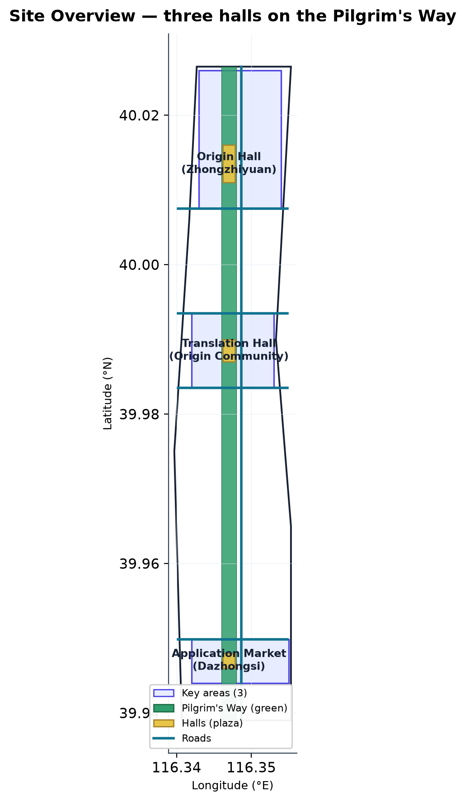
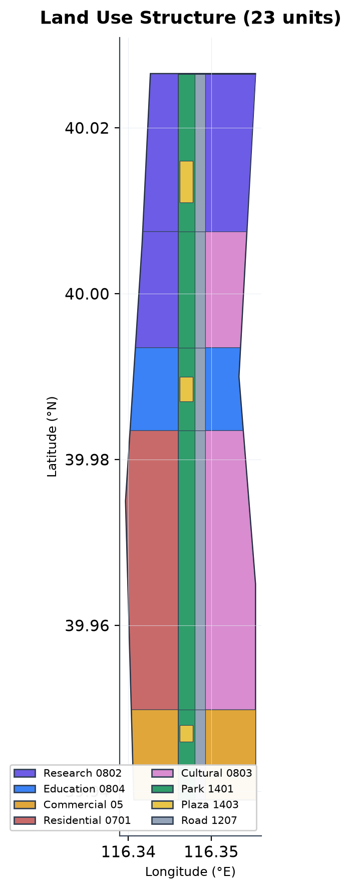
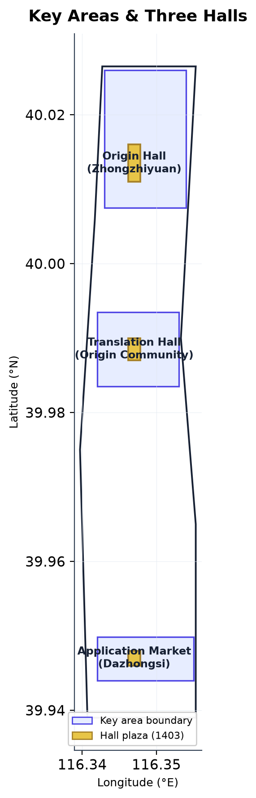
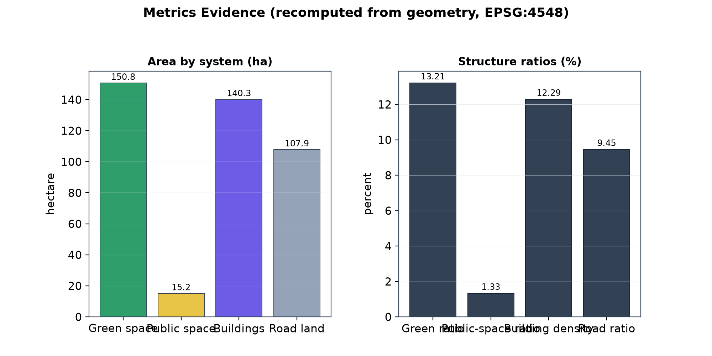

# Jing-Zhang Pilgrimage Belt · 京张朝圣带

## Design Basis and Data Inventory

This formal proposal takes the Haidian District announcement for the Centennial Jing-Zhang AI Innovation Belt international urban design open call as its primary basis, with the machine-readable provisional boundaries, key areas, enums, metrics, and source inventory under `brief/site-package/` as the data basis [source:OFFICIAL-ANNOUNCEMENT] [source:SITE-PACKAGE]. Every design judgment is decomposed into traceable sources, recomputable metrics, verifiable layers, and human-reviewable assumptions; prose never substitutes for GeoJSON, metric tables, A3 booklets, A0 boards, and HTML displays.

The proposal is organized from the announcement, the agent taskbook, and site materials, with the most critical evidence placed beside each claim [source:AGENT-TASKBOOK] [depth:existing_conditions_diagnosis]. The source registry distinguishes formal-ready from provisional-only material, and the agent must not upgrade background-only or provisional-only material into official redlines, statutory controls, scoring evidence, or implementation commitments [source:SOURCE-REGISTRY].

This submission is generated from the provisional boundaries in `brief/site-package/geometry/provisional_boundaries.geojson`; `geometry/site_boundary.geojson` and `geometry/key_areas.geojson` are marked `provisional_constraint`, `official_boundary=false`, and may only be used for generation, self-check, visualization, and discussion — never as official redline, approval basis, precise area basis, or statutory conclusion [data:geometry/site_boundary.geojson#SITE-001] [metric:site_area_sqm]. This data gap does not block content scoring; replacing the official polygons requires recomputing all layers and metrics.

## Design Concept: Three Halls, One Way, One Inscription Belt, One Passport

The proposal translates the abstract arc of AI innovation into a walkable "pilgrimage". The Jing-Zhang Railway Heritage Park runs north–south through the three core areas and forms a natural linear public-space spine; the proposal names it the **Pilgrim's Way** and recasts the three key areas as three landmark halls for distinct innovation stages [source:AGENT-TASKBOOK] [depth:overall_spatial_structure]:

- **Origin Hall · Zhongzhiyuan** — where AI innovation goes "from 0 to 1", corresponding to national AI platforms, full-stack autonomy, and safety governance [data:geometry/key_areas.geojson#PROV-KEY-001] [data:geometry/public_space.geojson#PUBLIC-001].
- **Translation Hall · Beijing AI Origin Community** — where research is "translated" into products and community, corresponding to near-campus commercialization, open-source collaboration, and talent zones [data:geometry/key_areas.geojson#PROV-KEY-002] [data:geometry/public_space.geojson#PUBLIC-002].
- **Application Market · Dazhongsi** — the marketplace where AI "enters everyday life", corresponding to agents, smart devices, content consumption, and data elements [data:geometry/key_areas.geojson#PROV-KEY-003] [data:geometry/public_space.geojson#PUBLIC-003].

The three halls are connected by a north–south green skeleton. This Pilgrim's Way is drawn as park green space (code 1401), roughly 9.7 km long, forming about 150.8 ha of continuous blue-green public space [data:geometry/green_space.geojson#GREEN-001] [metric:green_space_area_sqm]. Along it runs the **Inscription Belt** — a contribution and honor display system for developers, enterprises, universities, and residents — together with the **Pilgrim's Passport** — a lightweight check-in and recognition experience supported by AI wayfinding and walkability assessment [depth:blue_green_public_space]. The three landmark plazas total about 15.2 ha and form the spatial climax and public-activity anchors of the belt [data:geometry/public_space.geojson#PUBLIC-001] [metric:public_space_area_sqm].

This concept adds no new redline; it translates the three-tier scope and the brief's call for a recognizable "Centennial Jing-Zhang Cultural Belt, Urban AI Experience Belt, and AI Fusion Innovation Belt" into a start-to-finish, ceremonial, operable public-space narrative [standard:PROJECT-OFFICIAL-ANNOUNCEMENT].

## Three-Level Scope Framework

The proposal is organized across the three announced levels: the coordinated research scope covers roughly 43.6 km² of AI ecology and future urban form; the overall design scope covers roughly 11.4 km² around the heritage park; the key-area scope covers roughly 368.4 ha of detailed design [source:AGENT-TASKBOOK] [depth:three_level_scope_framework]. All three levels are mapped item by item in `compliance_matrix.json`, so every mandatory task under 1.3, 1.4, 1.5, and agent.1–agent.6 has sections, layers, metrics, drawings, and HTML evidence.

The three levels are not separate drawing sets: coordinated research determines industrial and urban-form judgments, overall design converts those into renewal projects and spatial structure, and key-area detailed design verifies implementability [depth:overall_spatial_structure]. Any area, ratio, scale, or project count that cannot be recomputed from structured data is not written as a formal conclusion.

| Level | Design question | Proposal answer | Data anchor |
| --- | --- | --- | --- |
| Coordinated research | How AI ecology and future urban form are organized | "University sourcing → open-source collaboration → enterprise commercialization → public experience → international dissemination" chain | compliance_matrix.json, standard_matrix.json |
| Overall design | How industrial space, renewal, transport and character are drawn | Pilgrim's Way green skeleton + Jing-Zhang Avenue + three halls + land/building/road layers | [data:geometry/land_use.geojson#LU-001], [data:geometry/roads.geojson#ROAD-001] |
| Key areas | How three districts reach detailed-design depth | Origin Hall / Translation Hall / Application Market with respective programs | [data:geometry/key_areas.geojson#PROV-KEY-001], [metric:key_area_count] |

## Coordinated Research Scope: Industrial and Future-Urban Studies

The core task of the coordinated research scope is to build a world-class AI innovation ecosystem. The proposal organizes Haidian's universities, leading enterprises, computing/algorithm/data elements, incubators, listed companies, and unicorns into a spatial chain of "university sourcing → open-source collaboration → enterprise commercialization → public experience → international dissemination" [source:AGENT-TASKBOOK]. The name "Jing-Zhang Pilgrimage Belt" directly serves the three identity goals: the Centennial Jing-Zhang Cultural Belt (railway heritage and pilgrimage narrative), the Urban AI Experience Belt (passport and public scenarios), and the AI Fusion Innovation Belt (three-hall industrial chain) [standard:PROJECT-OFFICIAL-ANNOUNCEMENT].

Future urban-form research addresses how AI changes work, life, socializing, learning, transport, and public services. The proposal places AI transport systems, continuous green space, innovation services, and an international atmosphere into locatable districts, nodes, and corridors [depth:overall_spatial_structure]. Performance indicators such as AI innovation indices and talent density are uniformly marked as awaiting official calibration, never fabricated.

## Overall Design Scope: Renewal and Control-Plan-Depth Urban Design

The overall design scope reaches control-plan depth. The proposal sets a spatial structure of "one way, three halls, a blue-green slow-mobility composite": the Pilgrim's Way green skeleton as the longitudinal axis, Jing-Zhang Avenue as the service road, and three halls as public-space anchors [standard:MOHURD-CONTROL-DETAILED-PLANNING] [depth:land_use_layout]. `geometry/land_use.geojson` covers the boundary with no overlap; `geometry/buildings.geojson` expresses building footprints; `geometry/roads.geojson` expresses micro-circulation and slow-mobility connections [data:geometry/land_use.geojson#LU-001] [data:geometry/buildings.geojson#BLDG-001] [data:geometry/roads.geojson#ROAD-001].

Where official controls for height, intensity, road redlines, setbacks, and facility standards are missing, content is uniformly written as "pending official control-plan confirmation" rather than agent-inferred values [standard:MOHURD-CONTROL-DETAILED-PLANNING].

## Key-Area Detailed Design (Three Halls)

Detailed design of the key areas is mandatory; the proposal locates the three halls respectively [depth:three_key_area_detailed_design]:

| Key area | Hall | Spatial action | AI industrial and operational scenario | Evidence |
| --- | --- | --- | --- | --- |
| Zhongzhiyuan AI Autonomous Innovation Acceleration Area | Origin Hall | Strengthen the Qing River interface, industrial display, and low-carbon exchange; carry autonomous-model testing and standards-governance display in the plaza | Autonomous model testing, standards workshops, safety governance display | [data:geometry/key_areas.geojson#PROV-KEY-001], [data:geometry/public_space.geojson#PUBLIC-001] |
| Beijing AI Origin Community | Translation Hall | Stitch campus, park, and district slow mobility; carry achievement release, open-source collaboration, and talent services in the plaza | Open-source community, achievement release, near-campus incubation | [data:geometry/key_areas.geojson#PROV-KEY-002], [data:geometry/public_space.geojson#PUBLIC-002] |
| Dazhongsi AI Industry Cluster | Application Market | Four-quadrant pedestrian connectivity around Dazhongsi station; carry agents, content consumption, and international roadshows in the plaza | Agent and device display, content consumption, data elements | [data:geometry/key_areas.geojson#PROV-KEY-003], [data:geometry/public_space.geojson#PUBLIC-003] |

Each key area cites its layer evidence and is checked by `design_depth_matrix.json` for plan-implementation depth [metric:key_area_total_area_sqm].

## AI Innovation Ecosystem, Personas, and AI+ Scenarios

The proposal builds spatial-demand personas for AI talent and enterprises, covering R&D offices, open-source collaboration, achievement release, enterprise services, talent housing, social learning, consumption, recreation, and international exchange. Each scenario states its users, location, data source, privacy boundary, human-review mechanism, and operating body [source:AGENT-TASKBOOK].

| Persona | Core needs | Spatial response | Self-check boundary |
| --- | --- | --- | --- |
| Open-source developer | Release, collaborate, test, community reputation | Translation Hall release hall, public code wall, night collaboration space | No individual behavior tracking; activity data aggregated only |
| Startup team | Low-cost office, compute entry, product proving ground | Origin Hall shared test field, edge-compute service point, standards consultation | Compute and data services require separate authorization |
| Enterprise visitor | Display, business, international reception, recruitment | Application Market international lounge, station interchange, public space near enterprises | Enterprise marks and cases must be cleared |
| Resident | Commute, recreation, community services, low-disturbance renewal | Pilgrim's Way slow-mobility loop, embedded community services, night lighting and event grading | Resident personas not used for commercial recommendation |
| University member | Commercialization, cross-campus collaboration, daily slow mobility | Campus-park stitch, commercialization station, AI education experience point | Campus data and research require authorization |

AI scenarios land on spatial and governance boundaries: the passport references public space, walkability references roads, open space references green and metrics [data:geometry/public_space.geojson#PUBLIC-001] [data:geometry/roads.geojson#ROAD-001] [metric:green_ratio].

## Land Use, Building Scale, and Retain-Renovate-Demolish

The land-use plan follows public land-survey, planning, and use-control classification standards to form a complete, closed, gapless partition [standard:MNR-LAND-USE-CLASSIFICATION-GUIDE]. The partition includes park green space (1401) for the Pilgrim's Way, road land (1207) for Jing-Zhang Avenue, research (0802), education (0804), commercial (05), residential (0701), cultural (0803), and plaza (1403) for the three halls — 23 units in total [data:geometry/land_use.geojson#LU-001].

The building plan distinguishes retain, renovate, renew, new-build, and to-confirm objects. The conceptual layout has 60 building footprints totaling about 140.3 ha [data:geometry/buildings.geojson#BLDG-001] [metric:building_footprint_area_sqm]. Because current buildings, ownership, control plans, and engineering conditions are missing, floor-area ratio, height, and density are recorded as `status=unknown` in `metrics.json`, never fabricated [depth:retain_renovate_demolish].

## Transport, Rail, Municipal, and Public Service Facilities

The transport plan responds to station integration, micro-circulation, slow-mobility gaps, external transport, parking, and bicycle parking [depth:traffic_rail_slow_parking]. The road centerline layer takes Jing-Zhang Avenue as the main line with four east-west stitching streets, all within the boundary [data:geometry/roads.geojson#ROAD-001]. Coverage includes Dazhongsi station, Qinghua East Road West, Wudaokou, and the heritage-park ring-road crossing.

Municipal and public-service facilities cover AI industry services, innovation platforms, talent services, new infrastructure, distributed energy, and edge compute [depth:municipal_new_infrastructure]. Missing utility, energy, drainage, flood, and fire data are listed as preconditions for deepening, not approved conditions [data:geometry/constraints.geojson#CONSTRAINT-001].

## Blue-Green Space, Public Space, and Urban Character (Way and Halls)

The blue-green plan takes the heritage-park vitality belt as its skeleton, coordinating the Qing River, Xiaoyue River, universities, enterprises, and community needs into a north-south continuous, east-west connected walking and cycling system [depth:blue_green_public_space]. The Pilgrim's Way comprises 5 park segments totaling about 150.8 ha, a green ratio of about 13.2% [data:geometry/green_space.geojson#GREEN-001] [metric:green_ratio]. The three hall plazas total about 15.2 ha, a public-space ratio of about 1.3% [data:geometry/public_space.geojson#PUBLIC-001] [metric:public_space_ratio].

Urban character fuses railway heritage, Zhongguancun innovation culture, and AI innovation culture, drawing on Tsinghuayuan Station and BFA cultural resources for city tone, architectural character, roofline, and public art [standard:MOHURD-URBAN-DESIGN-MEASURES]. The Inscription Belt (contribution and honor display) and Pilgrim's Passport (wayfinding and recognition) form the bridge between character and operation; all brands, fonts, images, portraits, and enterprise marks require cleared sources.

## Renewal Projects, Implementation Policy, and Phasing

The implementation plan forms a reviewable project list with location, type, function, responsible body, dependencies, phase, risk, and evaluation indicators [depth:renewal_project_list].

| Project | Name | Type | Key dependencies | Evidence |
| --- | --- | --- | --- | --- |
| JZ-01 | Pilgrim's Way green skeleton continuity | Public space / transport | Road redlines, under-bridge space, traffic review | [data:geometry/green_space.geojson#GREEN-001] |
| JZ-02 | Origin Hall (Zhongzhiyuan) plaza and innovation interface | Blue-green / industrial display | River blue-line, ecology and flood conditions | [data:geometry/public_space.geojson#PUBLIC-001] |
| JZ-03 | Translation Hall (Origin Community) commercialization street | Renewal / industry service | Campus boundary, ownership, ground-floor program | [data:geometry/buildings.geojson#BLDG-001] |
| JZ-04 | Application Market (Dazhongsi) four-quadrant pedestrian link | Rail integration / slow mobility | Station, intersection, utilities | [data:geometry/public_space.geojson#PUBLIC-003] |
| JZ-05 | Inscription Belt and Pilgrim's Passport system | New infrastructure / operation | Public-space permits, copyright, operator | [data:geometry/roads.geojson#ROAD-001] |

Phasing is distinct from the 100-day submission cycle: the cycle is a submission deadline, phasing is the renewal path [depth:phasing_implementation]. Near-term (PHASE-001) launches the green skeleton and lightweight hall facilities; mid-term (PHASE-002) advances the three core-area renewals; long-term (PHASE-003) stitches the transition areas and transitions to operation [data:geometry/phasing.geojson#PHASE-001].

## Indicators, Area Recalculation, and Compliance Matrix

The indicator system includes overall scope area, key-area area, green and public-space ratios, building footprint, renewal project count, AI scenario nodes, slow-mobility connectivity, industrial-space, talent-service, and self-check status [depth:metrics_recalculation]. All known indicators are recomputable from GeoJSON or trusted sources; unknown indicators state their reason and submission precondition.

Core recomputed indicators: overall scope about 1,141.3 ha [metric:site_area_sqm], key areas about 369.3 ha [metric:key_area_total_area_sqm], green ratio 13.2% [metric:green_ratio], public-space ratio 1.3% [metric:public_space_ratio], building density 12.3% [metric:building_density], road ratio 9.5% [metric:road_ratio]. Full values, formulas, source files, and confidence are stored in `metrics.json`.

The compliance matrix is the master file for task responsiveness. Every announcement and agent-taskbook task maps to sections, layers, metrics, drawings, HTML, sources, assumptions, and self-check items [depth:compliance_coverage]. Missing any mandatory task under 1.3, 1.4, 1.5, or agent.1–agent.6 excludes the proposal from formal professional scoring.

## Risk, Copyright, and Compliance

**Bilingual required.** The primary file is Chinese, with a complete translation in `proposal.en.md`; A3/A0, HTML, and text-bearing figures also provide counterparts [source:SITE-PACKAGE]. HTML pages load no remote scripts, tiles, fonts, iframes, forms, or external APIs, and do not track reviewers.

This proposal claims no official approval, approved control plan, final ownership, final scale, or guaranteed implementation. Gaps in provisional boundaries, key areas, control plans, roads, parcels, buildings, utilities, heritage protection, and public services are entered into `assumptions.json`, self-check, and the risk section [depth:risk_missing_data]. The AI agent is responsible for facts, sources, copyright, spatial data, metrics, and expression; maintainers and professional reviewers may request revision or rejection based on self-check, spatial review, and the compliance matrix.

## References

- brief/public-brief.md
- brief/site-package/design_brief.json
- brief/site-package/allowed_design_space.json
- brief/site-package/enums/
- brief/site-package/ranges/planning_limits.json
- data/processed/agent_fact_pack.md
- data/processed/project_scope_summary.csv
- data/processed/agent_task_requirements.csv
- data/processed/source_use_matrix.csv
- data/processed/missing_data_checklist.csv
- Full machine index: see `sources.json`, `metrics.json`, `compliance_matrix.json`, `standard_matrix.json`, and `design_depth_matrix.json`
- Section bibliography entries follow the site-package registry; full provenance and licensing are in the structured source list [source:SITE-PACKAGE]
