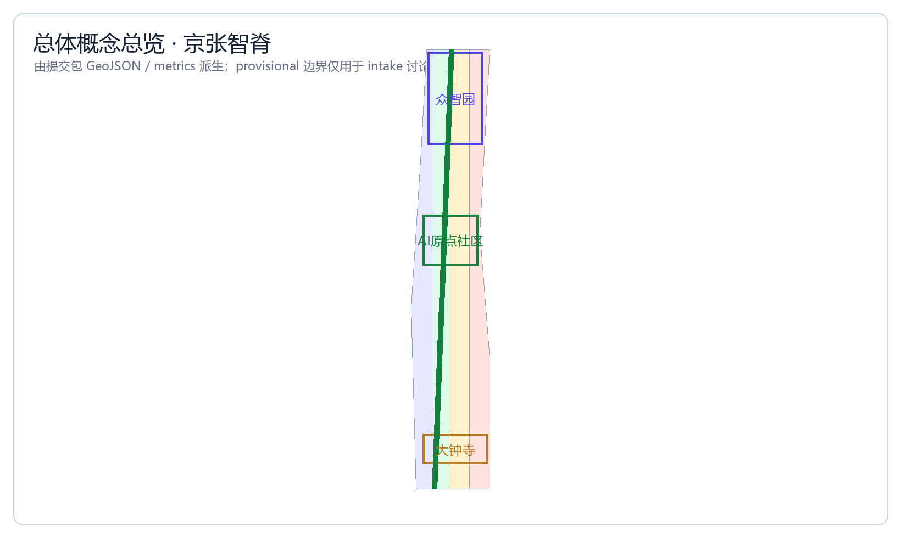
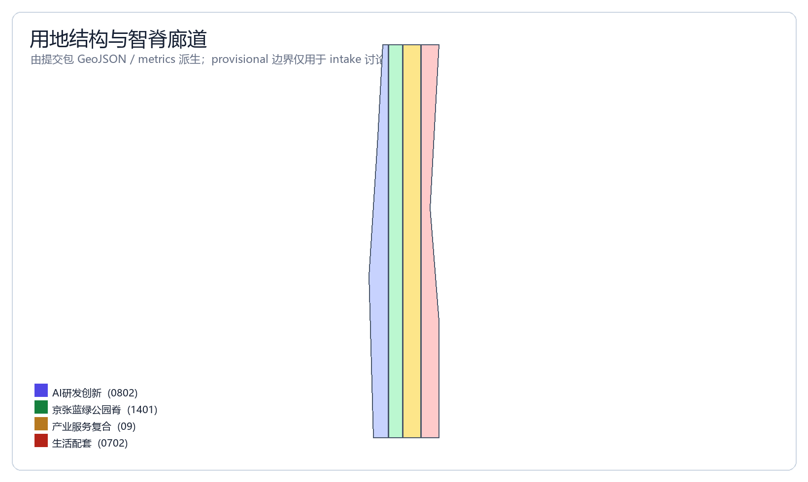
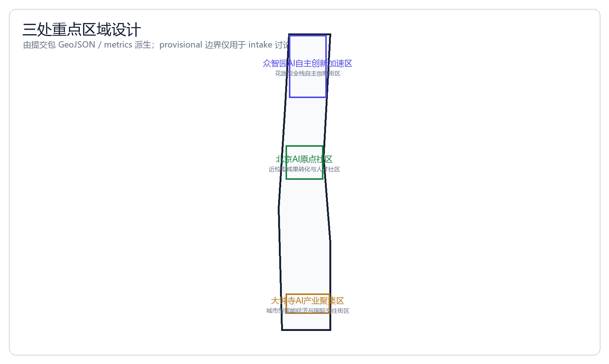
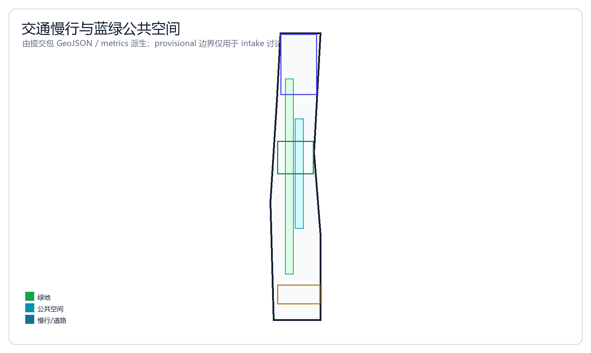
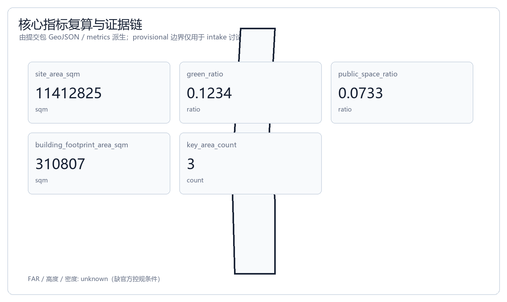

# Jingzhang AI Spine — Urban Design for the Centennial Jing-Zhang AI Innovation Belt

## Design Basis and Data Inventory

This formal proposal takes as its primary basis the *Pre-Qualification Announcement for the International Urban Design Solicitation of the Centennial Jing-Zhang AI Innovation Belt* issued by the Haidian Branch of the Beijing Municipal Commission of Planning and Natural Resources. It also takes as machine-readable basis the maintained provisional rough boundary, key areas, enumerations, indicators, and source list in `brief/site-package/`. Before generating the proposal, the AI agent must read `design_brief.json`, `allowed_design_space.json`, `sources.json`, `enums/`, `ranges/`, `schemas/`, `data/source_registry.json`, and `data/processed/agent_fact_pack.md`, and must use `project_scope_summary.csv`, `agent_task_requirements.csv`, `source_use_matrix.csv`, and `missing_data_checklist.csv` to establish the task, scope, data-use, and gap inventories. Every design judgment must be decomposed into traceable sources, recalculable indicators, verifiable layers, and human-reviewable assumptions. The announcement requires the proposal to reach the urban design depth of the regulatory detailed planning (控制性详细规划) and the urban design depth of the comprehensive implementation plan (规划综合实施方案). Therefore, narrative text cannot substitute for GeoJSON, indicator tables, the A3 document portfolio, A0 exhibition boards, and HTML electronic deliverables.

The proposal is not an independent vision text, but instead organizes deliverables from the announcement, the agent-oriented task book, and the site package. This section places only the most critical bases alongside the judgments [source:OFFICIAL-ANNOUNCEMENT] [source:AGENT-TASKBOOK] [depth:existing_conditions_diagnosis]. The complete source and standard coverage is preserved separately in `sources.json`, `standard_matrix.json`, and `design_depth_matrix.json`, and the machine indexes are not repeated in the body text.

The usage boundaries of the data registry are as follows [source:SOURCE-REGISTRY]:

- data/source_registry.json registers the usage boundaries of public, rights-cleared, and provisional data.
- Current registered summary: 7 entries available for formal use, 1 background entry, 1 provisional-only entry.
- The agent must not upgrade background_only or provisional_only data into official boundary, statutory regulatory detailed plan, formal scoring basis, or government implementation commitment.

`data/processed/agent_fact_pack.md` is the reading-navigation layer of this proposal, not a new authoritative source [source:PROCESSED-FACT-PACK]. It helps the agent organize the three-tier scope, the three key areas, the announcement tasks, agent.1–agent.6, data availability, and missing-data items into a readable proposal; factual judgments still must return to the registered raw materials [source:OFFICIAL-ANNOUNCEMENT] [source:AGENT-TASKBOOK], and the complete source relationships are preserved in `sources.json`.

This scaffolding uses `brief/site-package/geometry/provisional_boundaries.geojson` to generate a provisional formal package when the official `SITE_BOUNDARY` or the three `KEY_AREA` polygons have not yet been obtained. The `geometry/site_boundary.geojson` and `geometry/key_areas.geojson` in the submission package must both be labeled `provisional_constraint`, `official_boundary=false`, and may be used only for proposal generation, self-check, visualization, and design discussion. They cannot serve as official redline, approval basis, precise-area basis, or statutory control conclusion. This organizer data gap itself does not block content scoring; after the official polygons are replaced, the site boundary, key areas, land use, roads, green space, public space, buildings, phasing, and metrics all must be recalculated.

The scoreable status generated by this scaffolding is: **provisional boundary, with precision caveats preserved and pending recalculation upon release of official data; content scoring is not blocked**. Therefore, the spatial structure, scenarios, projects, and indicators in the body text are written according to the principle of "discussable, reviewable, and recalculable after replacement with official boundaries"; once the official boundary and key-area polygons are updated, the agent must re-run the scaffolding, self-check, and drawing/HTML generation, and must not merely replace a single file.

The boundary interpretation can return to the overall scope layer and area recalculation [data:geometry/site_boundary.geojson#SITE-001] [metric:site_area_sqm]. The three key areas are verified by independent layers and quantity indicators [data:geometry/key_areas.geojson#PROV-KEY-001] [metric:key_area_count]. This means readers can move from the body text into the evidence without first reading a string of machine codes.

## Three-Tier Scope Working Framework

The proposal organizes its work according to the three tiers established by the announcement: the coordinating research scope focuses on the 43.6 km² AI industry ecosystem, strategic positioning, innovation chain, and future urban form; the overall design scope focuses on the 11.4 km² urban district and industrial zone within 1–2 km around the Jing-Zhang Heritage Park, requiring an urban renewal master framework, industrial spatial layout, transportation and municipal support, and urban character control; the key-area scope focuses on the 368.4 ha across three detailed-design districts, requiring clear functional programming, building scale, retain-renovate-demolish classification, public-space connectivity, and transportation organization. The three tiers are mapped item by item in `compliance_matrix.json`, ensuring that every mandatory task in announcement sections 1.3, 1.4, 1.5 and agent.1–agent.6 has a corresponding section, layer, indicator, drawing, and HTML evidence.

The depth items of the three-tier working framework are constrained by [depth:three_level_scope_framework] and [depth:overall_spatial_structure]; the spatial evidence is based on [data:geometry/site_boundary.geojson#SITE-001] and [data:geometry/key_areas.geojson#PROV-KEY-001]; the task basis is based on [standard:PROJECT-OFFICIAL-ANNOUNCEMENT]; and the scope index is navigated by the three-tier scope table in `project_scope_summary.csv` within [source:PROCESSED-FACT-PACK].

The three-tier work is not a set of mutually isolated drawings. The coordinating research determines the judgments on the industry chain and urban form; the overall design translates these judgments into renewal projects, spatial structure, and facility carrying capacity; and the key-area detailed design verifies the implementability of specific parcels, buildings, transportation, public space, and AI application scenarios. When generating the proposal, the agent must first lock down the official or provisional boundary and constraints adopted for the current submission, then generate land use, buildings, roads, green space, public space, phasing, and AI service nodes, and finally recalculate indicators from these layers and explain in the body text which conclusions remain limited by the provisional boundary. Any area, ratio, scale, or project count that cannot be recalculated from structured data must not be written into a formal conclusion.

The overall concept proposed by this plan is the "Jingzhang AI Symbiosis Belt": with the Jing-Zhang Heritage Park as the historical and public-space main axis, the three key districts of Zhongzhi Park, the Beijing AI Origin Community, and Dazhongsi as innovation anchors, and universities, enterprises, communities, and rail stations as the daily network, forming a spatial organization of "one belt, three cores, multiple scenario nodes, and a composite blue-green slow-mobility ring." Here, the "one belt" is not an additionally drawn new redline, but rather a translation of the three-tier scope in the announcement into a working method; the "three cores" correspond to the three key areas; the "multiple scenario nodes" correspond to operable nodes of AI + public services, industrial services, and urban life; and the "composite ring" corresponds to the linkage of slow mobility, green space, public space, and activity routes.

| Tier | Design Question | Proposal Response | Data Anchor |
| --- | --- | --- | --- |
| Coordinating research scope | How to organize the AI industry ecosystem and future urban form | Establish an innovation chain of "university sourcing – open-source collaboration – enterprise translation – public experience – international dissemination" | compliance_matrix.json, standard_matrix.json |
| Overall design scope | How to put industrial space, urban renewal, transportation/municipal, and character on the map | Land use, buildings, roads, green space, public space, and phasing layers jointly expressed | [data:geometry/land_use.geojson#LU-001], [data:geometry/roads.geojson#ROAD-001] |
| Key-area scope | How the three districts reach detailed-design depth | Propose positioning, spatial actions, AI scenarios, and implementation dependencies respectively | [data:geometry/key_areas.geojson#PROV-KEY-001], [data:geometry/key_areas.geojson#PROV-KEY-002], [data:geometry/key_areas.geojson#PROV-KEY-003] |

## Coordinating Research Scope: Industry and Future-City Studies

The core task of the coordinating research scope is to build a world-class AI innovation ecosystem. The proposal should sort out Haidian's universities and research institutes, leading enterprises, computing/algorithm/data factors, incubation platforms, listed companies, unicorns, and technology service resources, and propose a spatial coordination framework for the AI innovation chain, industry chain, talent chain, and urban service chain. The naming scheme and logo design should serve the overall identity of the "Centennial Jing-Zhang Cultural Belt, Urban AI Living Experience Belt, and AI Integration Innovation Belt." They cannot remain merely slogans, but should explain their relationship with the industry ecosystem, public space, and cultural resources. The agent-oriented task book also requires responding to the synergy of the "five major functions" and "three zones, two wings," forming a naming system, visual identity, overall spatial structure diagram, scenario opening, and operational mechanism that can be further deepened. This section must mark, using [source:AGENT-TASKBOOK] and [standard:PROJECT-AGENT-OPEN-CALL-TASKBOOK], that these requirements come from the agent open-call task rather than statutory planning controls.

The coordinating research does not add pseudo-precise new redlines; through the coordination of urban character, public space, and building layout required by [standard:MOHURD-URBAN-DESIGN-MEASURES], it reconnects to [data:geometry/land_use.geojson#LU-001], [data:geometry/public_space.geojson#PUBLIC-001], and [depth:overall_spatial_structure], explaining that the industry strategy must ultimately land in a visible, reviewable spatial structure.

Future urban form studies should answer how artificial intelligence changes work, life, social interaction, learning, transportation, and public services. The proposal should turn the AI transportation system, continuous green space, innovation service facilities, and an internationalized living-and-working atmosphere into locatable functional zones, nodes, corridors, and scenarios, rather than describing a technology vision in vague terms. The agent should write industry strategy indicators, AI innovation index, talent density, spatial supply types, and AI + vertical application key areas into the indicator system, and mark which are official, which are design recommendations, and which still await calibration by official data. If global AI innovation activities, developer communities, open scenarios, or pilgrimage routes are proposed, they should be written as "concept proposal / reference scheme / for professional teams to deepen," and must not be written as already-determined government activities or implementation arrangements.

## Overall Design Scope: Urban Renewal and Regulatory-Detailed-Planning-Depth Urban Design

The overall design scope requires reaching the urban design depth of the regulatory detailed planning (控制性详细规划). The proposal must propose the urban renewal overall spatial structure, low-efficiency space identification, renewal project list, implementation policy recommendations, industrial function ratio, spatial organization model, total building scale, and comprehensive carrying-capacity assessment. `geometry/land_use.geojson` should fully cover the design boundary without overlap; `geometry/buildings.geojson` should express the renewed building footprints or retained building footprints; `geometry/roads.geojson` should express the micro-circulation, slow mobility, and rail connectivity relationships; and `metrics.json` should recalculate the core areas, ratios, and layer counts.

This section decomposes the regulatory-detailed-planning-depth content into reviewable objects according to [standard:MOHURD-CONTROL-DETAILED-PLANNING]: [data:geometry/land_use.geojson#LU-001] expresses the land-use structure, [data:geometry/buildings.geojson#BLDG-001] expresses the building footprints, [data:geometry/roads.geojson#ROAD-001] expresses the transportation organization, [metric:building_footprint_area_sqm] is used to verify the building footprint area, and [depth:land_use_layout] and [depth:development_intensity_controls] constrain the deliverable depth.

The overall design must also support transportation, rail, municipal, and supporting facilities. The proposal should propose spatial layout and implementation paths around rail-station integration, road micro-circulation, non-motorized vehicle parking, parking supply, innovation service platforms, talent living services, new infrastructure, distributed energy, and edge-side computing. Content involving building height, development intensity, road redline, setback lines, and facility standards, where official control conditions do not yet exist, should be written as "pending confirmation of formal regulatory detailed planning conditions," and must not pass off agent-estimated values as approved indicators.

## Key-Area Detailed Design

Key-area detailed design is a mandatory item. The Zhongzhi Park AI Autonomous-Innovation Acceleration Zone should propose a detailed plan around the national AI platform, full-stack autonomous innovation, standards formulation, security governance, industry display, external transportation, Qinghe culture, a low-carbon green innovation interaction environment, and green-space AI scenarios. The Beijing AI Origin Community should propose a detailed plan around near-campus innovation, achievement incubation and translation, a talent special zone, the open-source system, branded events, building retain-renovate-demolish classification, achievement display and release, residential living amenities, campus-park slow-mobility connections, and rail-station integration. The Dazhongsi AI Industry Cluster should propose a detailed plan around leading enterprises, agents, intelligent terminals, content consumption, data factors, digital assets, commercial services, composite utilization of planned green space, Dazhongsi Station integration, and four-quadrant pedestrian connectivity at intersections.

The three key-area detailed designs must reference [data:geometry/key_areas.geojson#PROV-KEY-001], [data:geometry/key_areas.geojson#PROV-KEY-002], [data:geometry/key_areas.geojson#PROV-KEY-003], and [depth:three_key_area_detailed_design] checks whether the depth of the comprehensive implementation plan is reached. If it only describes "building a demonstration zone" without evidence of function, buildings, transportation, public space, and implementation projects, it should be regarded as incomplete.

The three key areas must appear in `geometry/key_areas.geojson`. If the repository provides official polygons, they should be used as `official_constraint`; if official polygons are missing, `provisional_constraint` may be used temporarily, but the body text, HTML, sources, assumptions, and self_check must state that it cannot serve as a formal scoring or approval basis. `compliance_matrix.json` should separately cover announcement sections 1.5.3.1, 1.5.3.2, 1.5.3.3. The design expression should include functional programming, building scale, building form, retain-renovate-demolish classification, public-space system, transportation organization, slow-mobility connectivity, and implementation projects. The HTML page should be able to switch views of the three key areas; the A3 document portfolio and A0 exhibition boards should include at least the key-district master plan, local detail drawings, and indicator notes.

| Key District | Design Positioning | Spatial Action | AI Industry & Operation Scenario | Evidence Reference |
| --- | --- | --- | --- | --- |
| Zhongzhi Park AI Autonomous-Innovation Acceleration Zone | Garden-style full-stack autonomous-innovation block | Strengthen the Qinghe waterfront interface, industry display, low-carbon innovation interaction, and external transportation organization; use green space to host open testing and standards-governance display | Autonomous model testing, standards-formulation workshops, security-governance display, low-carbon computing experience | [data:geometry/key_areas.geojson#PROV-KEY-001], [depth:three_key_area_detailed_design] |
| Beijing AI Origin Community | Near-campus achievement-translation and talent community | Organize campus-park-neighborhood slow-mobility stitching; supplement achievement-release, talent service, residential living, and open-source collaboration spaces | Open-source community, achievement release, talent special-zone service, near-campus incubation | [data:geometry/key_areas.geojson#PROV-KEY-002], [source:AGENT-TASKBOOK] |
| Dazhongsi AI Industry Cluster | Urban-style intelligent economy and international-interaction block | Around Dazhongsi Station integration, four-quadrant pedestrian connectivity, commercial services, and key-enterprise public-environment renewal | Agent and intelligent-terminal display, content consumption, data factors and international roadshows | [data:geometry/key_areas.geojson#PROV-KEY-003], [metric:key_area_count] |

## AI Innovation Ecosystem, Talent Personas, and AI+ Scenarios

The proposal should establish a spatial-demand persona for AI talent and enterprises, covering R&D offices, open-source collaboration, achievement release, enterprise services, talent housing, social learning, consumer life, sports and leisure, and international interaction. AI+ scenarios should form industry-development scenarios and AI-empowered urban-function scenarios around the transportation, service, consumption, healthcare, education, legal, and living-service directions raised by the announcement. Each scenario should explain its service targets, spatial location, data source, privacy boundary, human-review mechanism, and operating entity.

AI scenarios must land in spatial and governance boundaries: public-space scenarios reference [data:geometry/public_space.geojson#PUBLIC-001], slow-mobility and transportation scenarios reference [data:geometry/roads.geojson#ROAD-001], and open-space scenarios reference [data:geometry/green_space.geojson#GREEN-001] and [metric:public_space_ratio], [metric:green_ratio]. These references let reviewers know that the scenarios are not slogans but design objects located in specific layers and indicators. The agent-oriented task book requires no fewer than 10 AI scenario cards, no fewer than 3 industry test-verification scenarios, and no fewer than 5 user personas; the scaffolding provides only the structure, and formal participants must write the scenario cards, persona tables, privacy boundaries, human review, and operating entities into the body text, HTML, A3/A0, and compliance matrix.

| User Persona | Typical Needs | Spatial Response | Self-Check Boundary |
| --- | --- | --- | --- |
| Open-source developer | Release, collaboration, testing, community reputation | Origin Community open-source release hall, public code wall, night collaboration space | Do not collect personal behavioral trajectories; activity data only used for aggregate statistics |
| Startup team | Low-cost office, computing access, product testbed | Zhongzhi Park shared test field, edge-side computing service point, standards-governance consultation | Computing and data services require separate authorization |
| Leading-enterprise visitor | Display, business, international reception, talent recruitment | Dazhongsi international roadshow living room, rail-station connection, public space around key enterprises | Enterprise logos and cases must have cleared rights |
| Surrounding resident | Commuting, leisure, community services, low-disturbance renewal | Jing-Zhang Heritage Park slow-mobility ring, embedded community services, night lighting and tiered activities | Do not use resident personas for commercial recommendation |
| University faculty and students | Achievement translation, cross-campus collaboration, daily slow mobility | Campus-park slow-mobility stitching, achievement-translation station, AI education experience point | Campus data and research results require authorization |

| Scenario Card | Spatial Carrier | Design Description |
| --- | --- | --- |
| 01 Open-source Release Hall | Beijing AI Origin Community | For universities, open-source communities, and startups; provides achievement release, code-contribution display, and small roadshow space |
| 02 Security-Governance Sandbox | Zhongzhi Park | Translates standards formulation, security evaluation, and model red-team testing into visitable, bookable, and supervised display and collaboration nodes |
| 03 Edge-side Computing Station | Node in overall design scope | Combined with public services, enterprise services, and low-carbon energy strategy, as a new-infrastructure prototype pending deeper study |
| 04 AI Slow-mobility Navigation | Jing-Zhang Heritage Park vitality belt | Uses explainable wayfinding and low-intrusion sensing to help identify slow-mobility gaps, crowding nodes, and accessibility needs |
| 05 Dazhongsi International Roadshow Living Room | Dazhongsi AI Industry Cluster | Serves the display, negotiation, media release, and international exchange of agent, intelligent-terminal, and content-consumption enterprises |
| 06 Qinghe Low-carbon Innovation Corridor | Zhongzhi Park Qinghe waterfront interface | Combines green space, stormwater, walking-cycling, and AI display as the park's public living room |
| 07 Near-campus Achievement-translation Street | Beijing AI Origin Community | For university achievement translation; organizes incubation, display, legal, IP, and investment-financing services |
| 08 Data-factor Reception Hall | Dazhongsi district | On the premise of compliance, authorization, and auditability, displays the urban-service interface for data-factor and digital-asset circulation |
| 09 AI Living-service Model Street | Where community and commerce meet | Lands AI+ scenarios such as healthcare, education, legal, and living services into operable small-scale neighborhood space |
| 10 Global AI Activity Week Route | One-belt public-space system | Forms a walkable, communicable experience route from heritage culture, open-source community, and industry display to international roadshow |

AI governance recommendations generated by the agent must obey the principles of data minimization, public sources, explainability, and human review. The urban agent may assist in identifying slow-mobility gaps, public-space heat, facility maintenance, enterprise-service needs, and activity-safety risks, but cannot replace planning approval, cannot output unauthorized personal profiles, and cannot claim to have obtained official implementation commitments. All AI scenario nodes should enter structured layers or the compliance matrix, so reviewers can see their relationship with industry, space, and public interest.

## Land Use, Building Scale, and Retain-Renovate-Demolish Plan

The land-use plan should be expressed according to public standards such as territorial spatial survey, planning, and use-regulation classification, forming a complete, closed, seamless land-use partition. The building plan should distinguish retained, renovated, renewed, newly built, or to-be-confirmed objects, and clarify the recommended hierarchy for building footprint, function, scale, character, roof, massing, and height control. If current building, ownership, regulatory-detailed-planning, and engineering conditions are missing, the plan can only propose a method and a to-be-calibrated list, and must not fabricate retain-renovate-demolish conclusions.

The land-use classification is based on [standard:MNR-LAND-USE-CLASSIFICATION-GUIDE]; building height, massing, interface, and character control are managed by [depth:height_massing_character]; the retain-renovate-demolish method is managed by [depth:retain_renovate_demolish]. The main evidence for land use and buildings is [data:geometry/land_use.geojson#LU-001], [data:geometry/buildings.geojson#BLDG-001], and [metric:building_footprint_area_sqm].

Building scale and intensity indicators must be consistent with `metrics.json` and the layers. If total building scale, floor-area ratio, building height, building density, green-space ratio, setback line, and building control line lack official conditions, they should uniformly use `status=unknown`, and explain in `reason` / `assumptions` the conditions to be supplemented, the current assumptions, and the recalculation path after official data is in place; fixed values must not be used to create a false sense of precision. The A3 document portfolio should give the renewal project list and indicator verification table; the A0 exhibition board should clearly express the key spatial structure and key districts; the HTML page should provide linked viewing of indicators and layers.

## Transportation, Rail, Municipal, and Public Service Facilities

The transportation plan should respond to the announcement's requirements for rail-station integration, road micro-circulation, slow-mobility gaps, external transportation, parking, non-motorized vehicle parking, and a green transportation system. The focus should cover the North Fifth Ring Road, the cross-ring-node of the Jing-Zhang Heritage Park, Wudaokou, Qinghua East Road West Entrance, Dazhongsi Station, and the transportation connections around key enterprises. The road and slow-mobility layers should remain within the submission boundary and be cross-checked with public space, green space, industry nodes, and key districts; if the submission boundary is provisional, the transportation conclusions can only serve as provisional design discussion.

The professional depth of transportation and municipal is constrained respectively by [depth:traffic_rail_slow_parking] and [depth:municipal_new_infrastructure]; layer evidence references [data:geometry/roads.geojson#ROAD-001], [data:geometry/public_space.geojson#PUBLIC-001], and [data:geometry/constraints.geojson#CONSTRAINTS]. When road redlines, pipelines, fire protection, and municipal conditions are missing, they should be explained as to-be-supplemented via assumptions, rather than written as approved conditions.

Municipal and public service facilities should cover AI industry service facilities, innovation service platforms, talent living-service facilities, new infrastructure, distributed energy, edge-side computing, and the integration of traditional municipal facilities. The proposal should explain facility standards, spatial layout, service radius, operating model, and phased-implementation logic. When engineering data such as pipelines, energy, drainage, flood control, and fire protection are missing, they should be listed as formal preconditions for deeper study.

## Blue-Green Space, Public Space, and Urban Character

The blue-green space plan should take the Jing-Zhang Heritage Park vitality belt as its skeleton, coordinate the travel needs of the Qinghe River, Xiaoyue River, surrounding universities, enterprises, and communities, and propose a trail, cycling, and green-space system that connects north-south and links east-west. The proposal should identify slow-mobility gaps, the over-ring-road nodes, the southern and northern landscape nodes of the park, and propose composite-utilization strategies for parking, sports, innovation interaction, technology testing, application display, and public services.

The blue-green public space is jointly verified by the design-depth items and the green-space and public-space layers [depth:blue_green_public_space] [data:geometry/green_space.geojson#GREEN-001] [data:geometry/public_space.geojson#PUBLIC-001]. The green-space and public-space ratios explain their design significance in the body text, and the complete recalculation is preserved in `metrics.json`; the coordination of urban character, public space, and building control returns to the professional standard matrix [standard:MOHURD-URBAN-DESIGN-MEASURES].

The urban character plan should integrate the historical culture of the Jing-Zhang Railway, the Zhongguancun innovation culture, and the AI innovation culture, use cultural resources such as the Tsinghua Garden Railway Station and the Beijing Film Academy, and propose guidance on urban tone, building character, roof form, massing, interface, and public art. The agent should also propose signage and identity, cultural symbols, international-dissemindination narrative, AI pilgrimage landmarks, a contribution wall, or an honor-display system, but all brands, fonts, images, portraits, and enterprise logos must have cleared-rights sources. Character control should distinguish official controls, design recommendations, and to-be-confirmed conditions, and must strictly refrain from giving pseudo-precise control lines without cultural-heritage-protection or regulatory-detailed-planning basis.

## Renewal Project List, Implementation Policy, and Phasing Plan

The implementation plan should form a reviewable renewal project list, explaining project location, type, function, responsible entity, dependency conditions, implementation phase, risk, and evaluation indicators. Policy recommendations should cover urban-renewal coordinated implementation, spatial supply, operating mechanism, industry services, public participation, data governance, and property-rights coordination. `geometry/phasing.geojson` should express the phasing scope; `compliance_matrix.json` should link each task with phasing and drawings.

The project list and phasing depth are managed by [depth:renewal_project_list] and [depth:phasing_implementation]; the phasing spatial evidence is [data:geometry/phasing.geojson#PHASE-001]. If ownership, funding, implementation entity, and approval path are absent, the plan must write it as an implementation risk rather than a commitment to land.

| Project ID | Project Name | Type | Main Dependency | Evidence Reference |
| --- | --- | --- | --- | --- |
| JZ-01 | Jing-Zhang Heritage Park slow-mobility gap stitching | Public space / transportation | Road redline, under-bridge space, traffic-organization review | [data:geometry/roads.geojson#ROAD-001] |
| JZ-02 | Zhongzhi Park Qinghe innovation interface | Blue-green space / industry display | River blue line, ecology and flood-control conditions | [data:geometry/green_space.geojson#GREEN-001] |
| JZ-03 | Origin Community near-campus achievement-translation street | Urban renewal / industry service | Campus boundary, ownership, ground-floor programming | [data:geometry/buildings.geojson#BLDG-001] |
| JZ-04 | Dazhongsi Station four-quadrant pedestrian connectivity | Rail integration / slow mobility | Rail station, road intersection, municipal pipelines | [data:geometry/public_space.geojson#PUBLIC-001] |
| JZ-05 | AI public service and edge-side computing node | New infrastructure / public service | Energy, computing, security, and operating entity | [data:geometry/constraints.geojson#CONSTRAINTS] |
| JZ-06 | Global AI Activity Week public route | Operation / branding | Public-space permit, activity safety, copyright clearance | [data:geometry/phasing.geojson#PHASE-001] |

Phasing should be distinguished from the 100-day solicitation design cycle: the solicitation cycle is the time requirement for submitting deliverables, while the implementation phasing is the advancement path for urban renewal and project construction. The proposal should propose a near-term pilot, mid-term renewal, and long-term governance framework, and mark which content can be launched first with lightweight facilities, operating activities, and service platforms, and which must wait for confirmation of formal regulatory detailed planning, municipal, transportation, and ownership conditions. For the annual activity system, developer-community operation, scenario open days, public-experience routes, and international-dissemindination mechanism, the body text should explain the operating target, frequency, responsibility boundary, translation path, and risk, and must not merely write promotional slogans.

## Indicator System, Area Recalculation, and Compliance Matrix

The indicator system should at least include the overall design scope area, key-area area, green-space and public-space ratios, building footprint, renewal project count, AI scenario nodes, slow-mobility connectivity indicators, industry-space indicators, talent-service indicators, and self-check status. All known indicators must be recalculable from GeoJSON or trusted sources; unknown indicators must give the reason and the formal-submission preconditions. The results of `scripts/spatial_review.py` and `scripts/visual_review.py` are important formal self-check evidence.

Indicator recalculation follows the unified design-depth requirement [depth:metrics_recalculation]. The body text focuses on explaining the design meaning of the indicators, for example how the overall scope constrains spatial allocation and how the blue-green and public-space ratios support daily interaction; the complete values, formulas, source files, and confidence are preserved in `metrics.json`. Example key indicators can be verified by the overall scope and green-space data [metric:site_area_sqm] [data:geometry/green_space.geojson#GREEN-001].

The compliance matrix is the master control file for task responsiveness. Each announcement task and agent_taskbook task must correspond to a report section, layer, indicator, drawing, HTML page, source, assumption, and self-check item. If any mandatory task in announcement sections 1.3, 1.4, 1.5 or agent.1–agent.6 is not covered, the proposal may not enter formal professional scoring.

When formally deepening the study, the agent should also divide each indicator into three categories: the first category consists of spatial indicators directly recalculable from the submitted geometry, such as boundary area, green-space ratio, public-space ratio, building footprint area, and phasing area; the second category consists of control indicators requiring support from official regulatory detailed planning or task-book appendices, such as floor-area ratio, building height, building density, setback line, road redline, and facility standards; the third category consists of performance indicators requiring continuous calibration by operational or industry data, such as AI innovation index, talent density, industry-service satisfaction, slow-mobility accessibility, activity participation, and scenario usage frequency. The three categories of indicators should enter `metrics.json`, `assumptions.json`, and `compliance_matrix.json` respectively, to avoid mistakenly writing operational visions as approved planning conditions.

## Risk, Copyright, and Compliance Statement

**Bilingual requirement.** The main proposal file may use Chinese or English, but a complete counterpart translation must be provided via `proposal.en.md` or `proposal.zh.md`; the A3/A0, HTML, and text-bearing drawings must also provide corresponding-language copies, and should preferentially use the event-recommended translations in `docs/terminology-glossary.md`. When the v2 package is missing any required translation, language mapping, or valid file, finalize and CI will block the submission. All image, drawing, icon, data, and code assets must state their source, license, and authorization status in `sources.json` or `report/copyright_statement.md`. HTML pages must not load remote scripts, remote map tiles, remote fonts, iframes, forms, or external APIs, and must not track reviewer behavior.

Risks and the missing-data list are jointly verified by the risk-depth item, the constraints layer, and the site package [depth:risk_missing_data] [data:geometry/constraints.geojson#CONSTRAINTS] [source:SITE-PACKAGE]. The official boundary, key area, regulatory detailed planning, roads, parcels, buildings, municipal, cultural-heritage-protection, and public-service gaps listed in `missing_data_checklist.csv` must enter `assumptions.json`, the self-check, and the body-text risk section. Any conclusion lacking official regulatory detailed planning, road redline, ownership, municipal, fire-protection, or cultural-heritage-protection conditions must be downgraded to a to-be-confirmed item; the complete professional verification is preserved in the standard matrix.

This proposal does not claim official approval, approved regulatory detailed planning, final land ownership, final construction scale, or guaranteed implementation. The AI agent is responsible for facts, sources, copyright, spatial data, indicators, and expression; maintainers and professional reviewers may require rework or rejection based on self-check results, spatial review, and the compliance matrix.

## Reference Materials

- brief/public-brief.md
- brief/site-package/design_brief.json
- brief/site-package/allowed_design_space.json
- brief/site-package/enums/
- brief/site-package/ranges/planning_limits.json
- data/processed/agent_fact_pack.md
- data/processed/project_scope_summary.csv
- data/processed/agent_task_requirements.csv
- data/processed/source_use_matrix.csv
- data/processed/missing_data_checklist.csv
- Complete machine index: see `sources.json`, `metrics.json`, `compliance_matrix.json`, `standard_matrix.json`, and `design_depth_matrix.json`
- The bibliography entry in this section is based on the site-package registration; the complete provenance and licenses are in the structured source list [source:SITE-PACKAGE]
