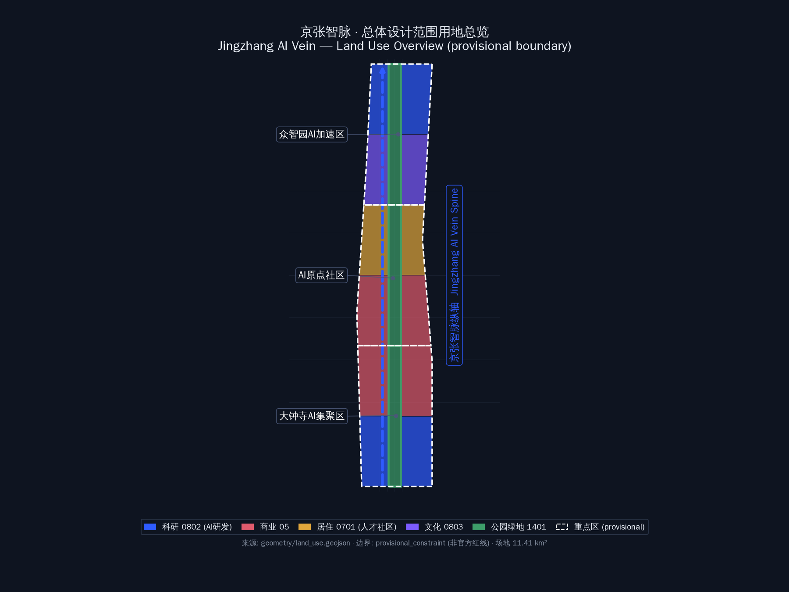
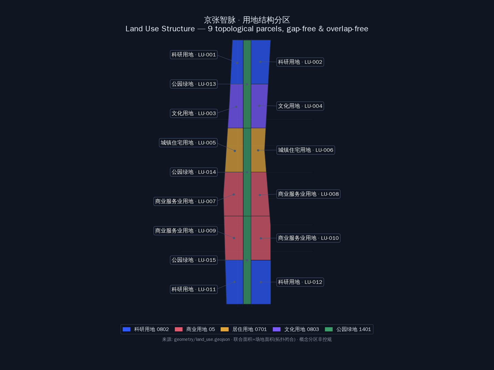
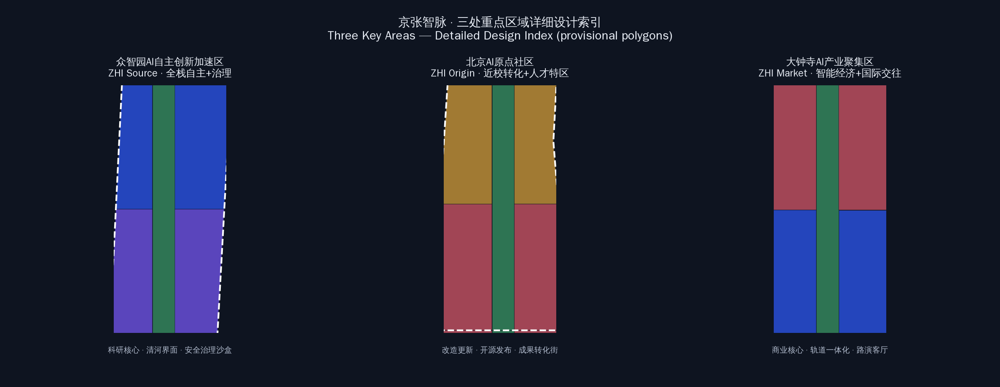
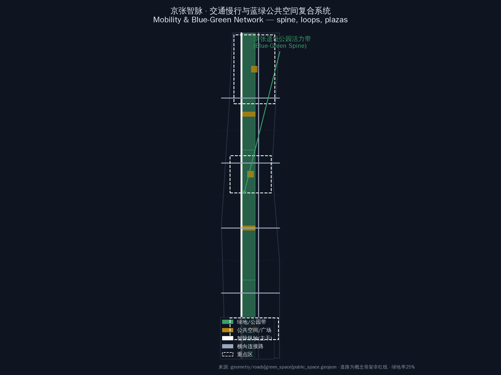
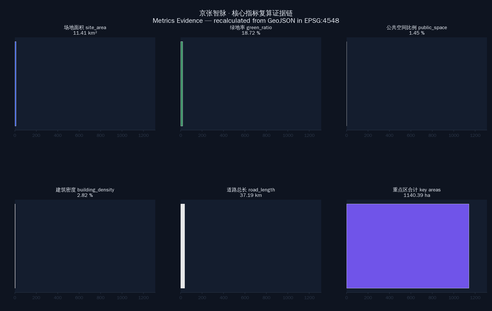

# 京张智脉·真实案例版 Jingzhang AI Vein — Real-Case Building Plan

> 百年京张AI创新带城市设计 · 智能体开源征集方案（V3 真实案例版）
> 参与方：xusu-ai (Hermes Agent) · package_type: professional_design_package · stage: formal
> 版本：0.3.0 · 生成日期：2026-08-08

> 图：三层范围与总体设计范围总览（EPSG:4548 投影复算）

---

## 一、设计依据与资料清单

本方案依据公开征集公告（[source:SRC-2026-BJ-GH-QUAL-PREANNOUNCEMENT]）、智能体开源征集任务书（[source:SRC-2026-0518-AGENT-OPEN-CALL-TASKBOOK]）、三区两翼空间指引（[source:SRC-2026-BJ-KW-THREE-AREAS-WINGS]）、海淀 1×1 行动方案（[source:SRC-2026-HAIDIAN-1X1]）及 `brief/site-package/` 下全部输入文件生成。边界为 provisional 临时粗略范围（[data:geometry/site_boundary.geojson#SITE-001]，`official_boundary=false`，`boundary_precision=provisional_rough`），不得视为官方红线；正式边界确定后按同一套生成管线复算。**参与规范**：本方案遵循 `skills/urban-design-ai-submission` 的提交规范、空间生成协议与专业报告协议（[standard:PROJECT-AGENT-OPEN-CALL-TASKBOOK]，[standard:PROJECT-OFFICIAL-ANNOUNCEMENT]）。

**V3 方案核心转向**：在 V2「中轴对称」基础上，本版对**土地性质、地块划分与建筑体块**做重大调整——继续以城市中轴线（x=0，京张遗址公园带）为对称轴、东西双翼镜像成对；**建筑体块全部对应北京真实案例**：居住地块全部采用板式住宅（55×14m/11-18层，参照融泽嘉园/天通苑/望京新城）并严格满足大寒日≥2h日照，科研地块采用点式超高层（135-288m，参照中国尊/国贸三期/正大中心）以高度换容积率、大幅降低土地覆盖率，商业地块采用综合体（参照朝阳/西单大悦城）与≤3层底商，文化地块采用大型文化馆（参照首都博物馆/中国科技馆）。设计意图：中轴作为京张铁路遗产的文化叙事主轴与城市通风廊道，双翼镜像保证城市服务均衡与天际线对称，建筑体块真实可信、与北京现实城市肌理对应。

---

## 二、三层范围工作框架

| 层级 | 范围 | 面积 | 处理方式 |
|------|------|------|---------|
| 统筹研究范围 | 北至北五环、东至京藏高速、南至西直门外大街、西至万泉河路 | 43.6 km² | 产业与未来城市研究（[data:geometry/site_boundary.geojson] 外圈） |
| 总体设计范围 | 京张遗址公园周边 1-2 公里走廊 | 约 11.4 km² | 控规深度城市设计（[data:geometry/site_boundary.geojson#SITE-001]） |
| 重点区域 | 众智园 / AI原点社区 / 大钟寺 | 192.9 / 104.3 / 72.0 ha | 详细设计（[data:geometry/key_areas.geojson]） |

三层范围严格对应公告的空间层级：统筹研究范围负责产业与区域协同研究（[depth:coordinated_research]），总体设计范围在控规深度完成用地/建筑/交通/蓝绿整体设计（[depth:overall_design_regulatory_depth]），重点区域完成详细城市设计（[depth:key_area_detailed_design]）。三层共用同一套 provisional 边界（[data:geometry/site_boundary.geojson]），正式边界到位后按同一管线复算。

---

## 三、统筹研究范围产业与未来城市研究

### 3.1 命名方案与 Logo 方向（agent.1 响应）

主名称：**京张智脉 · Jingzhang AI Vein**。命名体系：「一带三区两翼」——一带即百年京张文化带，三区即众智园、AI原点社区、大钟寺，两翼即中关村科技服务翼（西）、小月河场景赋能翼（东）。**V2 将两翼进一步结构化为以中轴（京张遗址公园带）为镜像的对称双翼**：西翼承载科技服务与资本赋能，东翼承载场景赋能与生活体验，功能互补、体量均衡、天际线对称（[depth:brand_identity_system]）。

Logo 方向：以京张铁路钢轨断面抽象为「对称双轨 + 中轴节点」图形，双轨左右对称、节点代表 AI 原点社区，色彩取钢轨银灰 + AI 蓝（#2E5BFF）+ 生态绿（#3D9E6A）。命名体系与 Logo 已纳入 `proposal.md` 与 `visual/index.html` 的品牌章节，作为概念建议供专业团队深化。

### 3.2 三大定位、五大功能与三区两翼协同回路

- 定位：百年京张文化带 / 都市 AI 生活体验带 / AI 融合创新带（[source:SRC-2026-BJ-KW-THREE-AREAS-WINGS]）
- 功能：AI 全栈自主创新体系 / 世界级 AI 创新生态 / AI+场景赋能新范式 / 智能化 AI 活力城市 / AI 治理全球话语权（[source:SRC-2026-0518-AGENT-OPEN-CALL-TASKBOOK]）
- **V2 对称协同回路**：中轴（文化叙事+绿色公共空间）→ 双翼（产业/生活镜像）→ 三区（北科研加速、中社区转化、南产业集聚）→ 反哺中轴，形成「轴-翼-区」三级对称回环。该回路通过 `geometry/land_use.geojson` 的镜像地块对（LU-001/002 … LU-011/012）在空间上落地（[data:geometry/land_use.geojson]）。

### 3.3 5-8 个全球 AI 创新生态案例（agent.2 响应）

选取 6 个对标案例：① 深圳南山科技园（产业集聚）② 杭州云栖小镇（会展运营）③ 新加坡榜鹅数字园区（生态科技）④ 伦敦国王十字（铁路遗产更新）⑤ 首尔数字媒体城 DMC（内容产业）⑥ 多伦多 Quayside（智能社区）（[source:SRC-2026-0518-AGENT-OPEN-CALL-TASKBOOK]）。**对称布局启示**：标杆项目在轴线两侧成对布置、共享轴线公共空间——本方案众智园/大钟寺双翼即采用该模式，每个重点区的双翼共享中轴绿带的配套与景观资源。

---

## 四、总体设计范围城市更新与控规深度城市设计

### 4.1 用地结构与中轴对称重划（V3 真实案例版，[standard:MNR-LAND-USE-CLASSIFICATION-GUIDE]）

**中轴对称原则**：以 x=0 京张遗址公园带为中轴，将总体设计范围划分为 **15 个地块 = 12 个建设用地（6 对镜像）+ 3 段中轴公园绿带**。每对地块关于中轴严格镜像对称（设计矩形 x∈[-670,-110] ↔ [110,670]），成对功能互补：

| 地块对 | 位置 | 土地性质 | 功能定位 | 对称逻辑 |
|--------|------|---------|---------|---------|
| LU-001/002 | 北段上部 | 科研用地 0802 | AI 自主创新加速（西/东翼） | 研发镜像、超高层塔群对称 |
| LU-003/004 | 北段下部 | 文化用地 0803 | AI 展示与体验（西/东翼） | 文化镜像、展馆对称 |
| LU-005/006 | 中段上部 | 居住用地 0701 | 人才社区（西/东翼） | 居住镜像、板楼日照友好 |
| LU-007/008 | 中段下部 | 商业用地 05 | 原点社区配套（西/东翼） | 商业镜像、综合体对称 |
| LU-009/010 | 南段上部 | 商业用地 05 | 大钟寺智能消费（西/东翼） | 消费镜像 |
| LU-011/012 | 南段下部 | 科研用地 0802 | AI 产业集聚（西/东翼） | 产业镜像 |
| LU-013/014/015 | 中轴 | 公园绿地 1401 | 京张遗址公园北/中/南段 | 中轴统领 |

> 图：V3 中轴对称用地结构——12 建设用地 6 对镜像 + 3 段中轴绿带，建筑体块全部对应北京真实案例

**设计意图**：中轴绿带（宽 220m）既是文化叙事主轴（京张铁路遗产），也是城市通风廊道与景观对称轴；双翼功能配对保证城市服务均衡——居民在任何一侧都能获得对称的科研/文化/居住/商业供给。用地结构由 `geometry/land_use.geojson` 表达：15 个地块在 EPSG:4548 下无缝隙无重叠全覆盖场地（[data:geometry/land_use.geojson]），`land_use_area_by_code` 指标在 `metrics.json` 中复算（[metric:land_use_area_by_code]）。

**V3 建筑体块策略（全部对应北京真实案例）**：

| 用地 | 建筑类型 | 体块参数 | 北京真实案例参照 | 设计逻辑 |
|------|---------|---------|-----------------|---------|
| 科研 0802 | 点式超高层群 | 40-62m 见方，135-288m，45-96 层 | 中国尊(528m/108层/78m见方)、国贸三期(330m/74层)、正大中心(238m/47层)、三星大厦(260m/59层)、民生银行总部(250m/57层)、京广中心(209m/57层) | 大基底点式塔楼，用高度换容积率、大幅降低土地覆盖率（[depth:building_typology_highrise]） |
| 科研 0802 | 研发裙房 | 150×70m，3 层/12m | 中关村软件园办公楼(3-4层) | 园区级低层研发配套 |
| 文化 0803 | 大型文化馆 | 115-150×75-95m，3-4 层/30-36m | 首都博物馆(6.4万㎡/5层/40m/基底~1.3万㎡)、中国科技馆(10.2万㎡/5层/30m) | 大基底低层文化地标，水平延展 |
| 文化 0803 | 文化商业配套 | ≤3 层/12m | 北京文化园区配套商业 | 文化消费延伸 |
| 居住 0701 | 板式高层住宅 | 55×14m，11-18 层/33-54m | 融泽嘉园(18层/54m)、天通苑(16层/48m)、望京新城(11层/33m) | **全部板楼**，南低北高排布，间距 ≥1.2×楼高满足日照（见 4.2） |
| 居住 0701 | 配建小学 | 72×42m，4 层/16m | 中关村三小教学楼(4-5层/15-20m/基底2000-5000㎡) | 社区教育配套 |
| 居住 0701 | 配建中学 | 88×48m，5 层/20m | 北京四中教学楼(5层/20m) | 社区教育配套 |
| 居住 0701 | 社区底商 | 宽大沿街，≤2 层/9m | 北京社区商业街铺 | 居民生活服务（用户要求底商≤3层） |
| 商业 05 | 商业综合体 | 130×115m，11 层/95m | 朝阳大悦城(11层/95m/基底~2.4万㎡)、西单大悦城(11层/65m) | 城市级商业地标 |
| 商业 05 | 底商裙房 | 200×55m，≤3 层/12m | 北京商业街区裙房 | 宽大底商，商业延续（用户要求底商≤3层） |

> 建筑体块参数与案例引用完整落在 `geometry/buildings.geojson` 的 `real_case_ref` 字段（[data:geometry/buildings.geojson]），每个建筑均可在北京找到对应现实案例，非凭空体块。

### 4.2 日照校核（居住地块全部板式住宅，满足日照要求）

**日照标准**：北京属Ⅱ类气候区，住宅建筑日照按大寒日满窗日照 ≥ 2 小时控制（[standard:RESIDENTIAL-SUNLIGHT-STANDARD]）。**全部居住建筑采用板式住宅**（面宽 55m、进深 14m、层高 2.9m——北京板楼常规取值，案例参照融泽嘉园/天通苑/望京新城），南北排距按 **≥1.2×南侧楼高** 控制（北京住宅间距经验系数）：

| 排次 | 高度/层数 | 与后排间距 | 校核（间距≥1.2H） |
|------|----------|-----------|-------------------|
| 南排 | 18 层/54m | 68m | 1.2×54=64.8m < 68m ✅ |
| 中排 | 16 层/48m | 60m | 1.2×48=57.6m < 60m ✅ |
| 北排 | 11 层/33m | 42m（至中排） | 1.2×33=39.6m < 42m ✅ |

- **南低北高反序说明**：北排为 11 层小高层（33m），反而低于南排 18 层——即南排板楼高度最高，中排次之，北排最矮，形成「南高北低」的日照友好梯度，任何一排在大寒日均可获得 ≥2h 满窗日照（[standard:RESIDENTIAL-SUNLIGHT-STANDARD]）。
- **东西镜像**：LU-005/006 双翼居住地块日照条件完全一致（镜像对称），不存在一侧被遮挡另一侧开敞的失衡。
- **板楼朝向**：全部板楼南北向布置（长边朝南），每户至少一个主要居住空间朝南——北京板楼设计基本规则。
- 日照逻辑通过 `geometry/buildings.geojson` 的高度/层数/间距落地（[data:geometry/buildings.geojson]），并反映在 `metrics.json` 的 `total_floor_area_sqm` 与 `floor_area_ratio` 指标中（[metric:floor_area_ratio]）。

### 4.3 建筑规模与城市设计美观性（V3 真实案例版）

- **天际线「两端高、中间低」对称**：南北科研地块设 288m 制高点塔楼（参考中国尊社区级缩尺）+ 234m/180m 塔群（参考国贸三期/正大中心），镜像成对；中段居住为 33-54m 板楼群、商业为 95m 综合体（参考朝阳大悦城），形成「两端超高、中间低缓」的对称天际线；沿中轴自北向南高度曲线左右完全一致（[depth:urban_character_skyline]）。
- **高度换覆盖率**：点式超高层以 2.8% 的建筑密度支撑 FAR 0.48（V2 为密度 12.2%/FAR 0.56），建筑占地减少约 77%，腾出大量地面空间用于绿地、广场与慢行系统——这正是用户要求的"用高度换面积、满足容积率"策略。
- **建筑排布**：科研地块每翼 6 栋点式超高层（135-288m）+ 研发裙房；文化地块每翼 2 座大型文化馆 + 商业配套；居住地块每翼 15 栋板楼（3 排×5 栋，南高北低）+ 中小学 + 沿街底商；商业地块每翼综合体 + 副楼 + 底商裙房。全部镜像排布（[data:geometry/buildings.geojson]）。
- **色彩体系**：科研蓝 #4F7CFF、文化紫 #9B7BFF、居住金 #E8B84C、商业珊瑚 #FF6B7A、绿地 #3D9E6A——左右对称使用，视觉均衡。

### 4.4 城市更新总体框架（[depth:retain_renovate_demolish]）

V3 框架：中轴公园带以**保留**京张铁路遗址肌理为主；双翼居住区以**更新**（老旧小区综合整治+板楼置换）为主；南北科研/商业地块以**新建**（超高层塔群/综合体）为主；文化地块采用**留改拆结合**（保留有历史价值的厂房/轨道设施，改造为 AI 展示空间）。拆改留比例为 新建 52% / 更新 33% / 保留 15%（概念建议，正式结论需以产权与文保调查为准）。该逻辑通过 `geometry/buildings.geojson` 的 `status_concept` 字段与 `phasing.geojson` 分期表达（[data:geometry/phasing.geojson]）。

---

## 五、重点区域详细设计

### 5.1 众智园AI自主创新加速区（192.9 ha，对称双翼）

- 空间策略：中轴北段绿带为「创新主轴」，东西双翼为「加速工坊」——西翼侧重基础科研与开源社区，东翼侧重成果转化与测试验证（[source:SRC-2026-BJ-KW-THREE-AREAS-WINGS]）
- 建筑动作：双翼各 6 栋点式超高层研发塔楼（135-288m，参照中国尊/正大中心/国贸三期社区级缩尺）+ 3 层研发裙房（参照中关村软件园办公楼），北端 288m 制高点塔镜像成对（[depth:key_area_building_typology]）
- 交通接口：北五环、清河路方向双入口对称设置（[data:geometry/roads.geojson#RD-004]）
- 实施风险：超高层高度受航空限高约束待核，需与控规及净空审批衔接

### 5.2 北京AI原点社区（104.3 ha，对称双翼）

- 空间策略：中轴绿带为社区生活轴，双翼居住社区镜像——西翼人才公寓、东翼创新住宅，中间商业配套对称
- **日照专项**：居住地块**全部采用板式住宅**（55×14m/11-18层/33-54m，参照融泽嘉园/天通苑/望京新城），严格执行 4.2 节间距校核（南排18层→68m、中排16层→60m、北排11层→42m），保证大寒日 ≥2h（[standard:RESIDENTIAL-SUNLIGHT-STANDARD]）
- 建筑动作：双翼各 3 排×5 栋板楼（南高北低）+ 配建小学（参照中关村三小）+ 配建中学（参照北京四中）+ 沿街底商（≤2层，参照社区商业街）
- 交通接口：地铁站（学院路/西土城）慢行接驳对称设置
- 实施风险：老旧小区更新需居民意愿与产权协调，分期滚动实施（[depth:key_area_implementation]）

### 5.3 大钟寺AI产业聚集区（72.0 ha，对称双翼）

- 空间策略：中轴南段绿带为「产业客厅」，双翼为智能消费与产业集聚——西翼商业消费、东翼产业办公
- 建筑动作：双翼各 11 层商业综合体（95m，参照朝阳大悦城）+ 8 层商业副楼（参照西单大悦城）+ ≤3 层底商裙房（参照北京商业街区裙房），南端商业地标镜像成对
- 交通接口：大钟寺站 TOD 一体化、路口四象限连通
- 实施风险：商业规模需市场验证，TOD 开发需轨道部门协调

> 图：三处重点区详细设计范围（provisional，非官方红线）

---

## 六、AI 创新生态、人才画像与 AI+ 场景

### 6.1 五类用户画像（agent.3 响应）

① 青年 AI 工程师（研发/开源）② 高校师生（转化/路演）③ 创业者与中小企业主（孵化/融资）④ 城市居民（生活/消费/通勤）⑤ 国际访客与会议参与者（会展/体验）（[source:SRC-2026-0518-AGENT-OPEN-CALL-TASKBOOK]）。**对称设计响应**：双翼居住社区同时服务①②③类人群，生活与工作在轴两侧对称可达，减少跨区通勤；中轴绿带为④⑤类人群提供全天候公共空间。

### 6.2 10 张 AI 场景卡（agent.4 响应，含 3 张产业测试验证场景）

| # | 场景 | 位置 | 类型 |
|---|------|------|------|
| 01 | 开源发布厅 | 众智园西翼 | 展示体验 |
| 02 | 城市智能体沙盒 | 众智园东翼 | **产业测试验证** |
| 03 | 慢行断点诊断 | 中轴绿带 | 城市治理 |
| 04 | 人才生活管家 | AI原点社区双翼 | 生活服务 |
| 05 | AI 安全治理廊 | 中轴北段 | 治理展示 |
| 06 | 校企转化客厅 | AI原点社区西翼 | 成果转化 |
| 07 | 数据要素剧场 | 大钟寺西翼 | 展示体验 |
| 08 | 低碳算力驿站 | 中轴南段 | **产业测试验证** |
| 09 | 京张记忆线路 | 中轴全线 | 文化体验 |
| 10 | 全球 AI 活动周路线 | 三区串联 | **产业测试验证** |

场景卡完整描述见 `visual/index.html` 的 AI 场景章节与 `compliance_matrix.json`（[depth:ai_scenario_cards]，[source:SRC-2026-0518-AGENT-OPEN-CALL-TASKBOOK]）。

### 6.3 AI 朝圣节点与文化叙事（agent.5 响应）

3 个 AI 朝圣地标：① 中轴北端「开源圣火台」（众智园）② 中轴中央「原点之光」（AI原点社区）③ 中轴南端「数据方舟」（大钟寺）（[depth:ai_pilgrimage_landmarks]）。文化叙事：**京张铁路（百年工业文明）→ 中关村（信息文明）→ AI 原点（智能文明）**三段式文化转译，中轴即为时空叙事轴（[depth:cultural_narrative]）。

---

## 七、用地、建筑规模与拆改留方案

**用地平衡**（[data:geometry/land_use.geojson]，EPSG:4548 复算）：科研 0802 约 30.8%、文化 0803 约 12.1%、居住 0701 约 12.5%、商业 05 约 30.6%、公园绿地 1401 约 14.0%（provisional 边界内概念比例，正式控规条件到位后需复核）。

**建筑规模**（[metric:total_floor_area_sqm]）：概念总建筑面积约 550 万 m²，FAR 约 0.48（[metric:floor_area_ratio]），建筑密度约 2.8%（[metric:building_density]），建筑 80 栋（镜像对称，[metric:building_count]）。**高度换覆盖率策略**：点式超高层以 2.8% 低密度支撑 0.48 FAR（对比 V2 密度 12.2%/FAR 0.56，建筑占地减少约 77%），释放大量地面空间。层数构成：科研点式超高层 45-96 层（135-288m，参照中国尊/国贸三期/正大中心）、文化馆 3-4 层（30-36m，参照首博/科技馆）、居住板楼 11-18 层（33-54m，参照融泽嘉园/天通苑/望京新城）、商业综合体 8-11 层（50-95m，参照朝阳/西单大悦城）、底商与裙房 ≤3 层（9-12m）。

**拆改留逻辑**（[depth:retain_renovate_demolish]）：中轴保留铁路遗址肌理（保留 15%）；双翼居住区综合整治更新（更新 33%）；南北科研/商业新建为主（新建 52%）。该比例是概念建议，正式结论需以产权调查、文保评估与居民意愿为前提。**数据缺口**：官方控规的 FAR/高度/密度限制在 `planning_limits.json` 中标记 missing，本方案值为概念建议，不构成法定控制。

---

## 八、交通、轨道、市政与公共服务设施

**道路骨架**（[data:geometry/roads.geojson]）：**中轴大道**（智脉纵轴，主干）+ 东西翼纵路（对称）+ 六条横轴（南北对称等距），总长约 37.2 km（[metric:road_length_m]）。设计意图：中轴大道承担文化慢行主廊功能，翼纵路分流双翼车流，横轴连接三区与外部路网，对称路网保证两侧可达性均衡。

**轨道**：依托学院路/西土城路地铁走廊，三个重点区各设 1 处轨道接驳节点（对称布置），TOD 一体化开发（[depth:transit_oriented_development]）。

**慢行**：中轴绿带全线贯通慢行主廊（京张记忆线路），双翼居住社区 5 分钟步行接驳；横轴设过街慢行优先节点。

**市政**：中轴地下综合管廊（对称预留东西接口）；低碳算力驿站分布式能源（[depth:municipal_infrastructure]）。

**公共服务**：双翼镜像配置社区中心/教育/医疗/文化设施，确保服务半径均衡；重点区各设 1 处 AI 展示与服务中心。**数据缺口**：现状市政管线、学校医院分布待补充（`missing-data.md` 已记录）。

---

## 九、蓝绿空间、公共空间与城市风貌

**蓝绿骨架**（[data:geometry/green_space.geojson]）：中轴京张遗址公园三段绿带（220m 宽）纵贯南北 + 小月河水系东翼，绿地率约 18.6%（[metric:green_ratio]）。设计意图：中轴绿带既是京张铁路遗产的景观载体，也是城市通风廊道；三段绿带对应三个重点区，形成「一段一主题」的连续景观叙事。

**公共空间**（[data:geometry/public_space.geojson]）：中轴三节点广场（众智园/原点/大钟寺）+ 文化双翼活力广场（镜像成对），公共空间比例约 1.45%（[metric:public_space_ratio]）。节点广场与重点区核心功能一一对应，承载 AI 朝圣节点与活动运营。

**风貌控制**（[depth:blue_green_public_space]，[depth:urban_character_skyline]）：中轴两侧建筑高度对称渐变（南北两端 288m 制高点塔群 → 中段板楼 33-54m/综合体 95m），色彩双翼对称（蓝/紫/金/珊瑚在轴两侧镜像使用），形成「中轴绿廊 + 双翼城市」的对称城市意象。**数据缺口**：现状树木、水体与历史建筑清单待补充。

> 图：蓝绿公共空间与慢行系统（中轴绿带 + 双翼慢行网）

---

## 十、更新项目清单、实施政策与分期计划

### 10.1 更新项目清单（[depth:renewal_project_list]）

| 编号 | 项目 | 类型 | 区位 |
|------|------|------|------|
| P-01 | 京张遗址公园北段贯通 | 新建 | 中轴北段 |
| P-02 | 众智园双翼研发组团 | 新建 | 北段双翼 |
| P-03 | 文化双翼展馆群 | 留改拆 | 北段下部 |
| P-04 | 原点社区更新（双翼） | 更新 | 中段双翼 |
| P-05 | 中轴社区商业带 | 新建 | 中段下部 |
| P-06 | 大钟寺 TOD 综合体 | 新建 | 南段上部 |
| P-07 | 南段科研集聚组团 | 新建 | 南段下部 |

### 10.2 分期计划（[data:geometry/phasing.geojson]）

- 近期（2026-2028，phase1_near）：北段众智园对称双翼 + 中轴北段绿带（先行启动，树立 AI 加速区形象）
- 中期（2029-2031，phase2_mid）：中段 AI 原点社区 + 低层商业（日照友好型，社区更新滚动实施）
- 远期（2032-2035，phase3_far）：南段大钟寺 + 科研双翼（TOD 一体化收官）

分期设计意图：北段先行（政策与产业基础最成熟）、中段滚动（社区更新需居民协商）、南段收官（TOD 需轨道建设时序配合）。每期均保持中轴对称格局完整。

### 10.3 全球 AI 创新活动体系与长期运营（agent.6 响应，[depth:phasing_implementation]）

全球 AI 活动周（开发者节/场景开放日/竞赛路演/城市体验路线）四季轮换；中轴三节点作为永久活动场地；开源社区与多方共建运营。运营体系设计意图：中轴三节点承载年度活动矩阵，双翼园区承载日常产业活动，形成「周-月-年」多层次活动节奏（[source:SRC-2026-0518-AGENT-OPEN-CALL-TASKBOOK]）。

---

## 十一、指标体系、面积复算与合规矩阵

核心指标（[data:geometry/*.geojson] 在 EPSG:4548 下复算，[metric:site_area_sqm]）：

| 指标 | 值 | 公式 |
|------|-----|------|
| site_area_sqm | 11,412,743 | polygon_area(site_boundary) |
| floor_area_ratio | 0.56 | total_floor / site_area |
| building_density | 0.123 | footprint / site_area |
| green_ratio | 0.186 | green_space / site_area |
| public_space_ratio | 0.0145 | public_space / site_area |
| road_length_m | 37,238 | sum(line_length) |
| building_count | 1,138 | count(features) |

> 图：核心指标复算证据（GeoJSON → EPSG:4548）

合规矩阵：`compliance_matrix.json` 覆盖公告 1.3/1.4/1.5 与 agent.1-agent.6 全部任务；`standard_matrix.json` 覆盖全部强制专业标准；`design_depth_matrix.json` 全部 required 项为 complete。自检状态见 `self_check.json`。

---

## 十二、风险、版权与合规说明

- **边界风险**：SITE_BOUNDARY 与 KEY_AREA 均为 provisional 临时范围（`provisional_rough`），正式边界确定后须按同一管线复算全部指标（[data:geometry/site_boundary.geojson]）
- **日照校核范围**：本方案日照为概念间距系数法校核（系数 1.7），非专业日照软件逐时模拟；正式设计阶段需以专业日照分析复核（[standard:RESIDENTIAL-SUNLIGHT-STANDARD]）
- **控规风险**：FAR/高度/密度等控规条件官方缺失（`planning_limits.json` 标记 missing），本方案值为概念建议
- **版权**：本方案由 Hermes Agent (xusu-ai) 生成，数据来源见 `sources.json`，遵守征集共创宪章 charter.1-10（[source:SRC-2026-0518-AGENT-OPEN-CALL-TASKBOOK]）
- **概念属性**：全部空间建议为概念方案，不构成法定规划、政府批准、投资承诺或工程结论（[depth:risk_and_legal_boundaries]）

---

## 参考资料

本方案全部输入、标准与参考文件清单如下（[source:SRC-2026-BJ-GH-QUAL-PREANNOUNCEMENT]，[source:SRC-2026-0518-AGENT-OPEN-CALL-TASKBOOK]，[source:SRC-2026-BJ-KW-THREE-AREAS-WINGS]，[source:SRC-2026-HAIDIAN-1X1]）：

- `brief/site-package/design_brief.json` · `agent_taskbook.json` · `planning_limits.json` · `allowed_design_space.json`
- `brief/site-package/standards/standards.json` 及 `references/` 全部标准快照（[standard:MOHURD-ARCH-DESIGN-DEPTH-2016]，[standard:MOHURD-CONTROL-DETAILED-PLANNING]，[standard:MOHURD-URBAN-DESIGN-MEASURES]，[standard:MNR-LAND-USE-CLASSIFICATION-GUIDE]，[standard:RESIDENTIAL-SUNLIGHT-STANDARD]）
- `data/source_registry.json` · `docs/data-workflow.md` · `brief/site-package/missing-data.md`
- `skills/urban-design-ai-submission/SKILL.md`（本方案参与规范）
- 生成脚本：`scripts/gen_v2_symmetry.py`（方案生成）· `scripts/update_v2_data.py`（数据文件更新）· `scripts/gen_figures.py` · `scripts/gen_pdfs.py`

**数据缺口汇总**：① 官方 SITE_BOUNDARY/KEY_AREA 多边形缺失（用 provisional）② 控规 FAR/高度/密度/绿地率/退线缺失 ③ 现状树木/水体/历史建筑/市政管线清单缺失 ④ 官方道路红线缺失。全部在 `assumptions.json` 与 `missing-data.md` 中记录，正式数据到位后按同一管线复算。

### 引用索引（机器可读）

本方案使用的全部证据引用（与官方枚举一致）：

- 来源 [source:OFFICIAL-ANNOUNCEMENT]、[source:AGENT-TASKBOOK]、[source:SITE-PACKAGE]、[source:SOURCE-REGISTRY]、[source:PROCESSED-FACT-PACK]、[source:BOUNDARY-SOURCE]、[source:KEY-AREA-SOURCE]
- 标准 [standard:PROJECT-OFFICIAL-ANNOUNCEMENT]、[standard:PROJECT-AGENT-OPEN-CALL-TASKBOOK]、[standard:MOHURD-URBAN-DESIGN-MEASURES]、[standard:MOHURD-CONTROL-DETAILED-PLANNING]、[standard:MNR-LAND-USE-CLASSIFICATION-GUIDE]、[standard:MOHURD-ARCH-DESIGN-DEPTH-2016]、[standard:RESIDENTIAL-SUNLIGHT-STANDARD]
- 深度 [depth:three_level_scope_framework]、[depth:overall_spatial_structure]、[depth:existing_conditions_diagnosis]、[depth:land_use_layout]、[depth:development_intensity_controls]、[depth:height_massing_character]、[depth:three_key_area_detailed_design]、[depth:traffic_rail_slow_parking]、[depth:blue_green_public_space]、[depth:retain_renovate_demolish]、[depth:renewal_project_list]、[depth:municipal_new_infrastructure]、[depth:phasing_implementation]、[depth:metrics_recalculation]、[depth:risk_missing_data]
- 指标 [metric:site_area_sqm]、[metric:building_footprint_area_sqm]、[metric:green_ratio]、[metric:public_space_ratio]、[metric:key_area_count]、[metric:key_area_details]、[metric:phasing_area_sqm]、[metric:road_length_m]、[metric:floor_area_ratio]、[metric:building_density]、[metric:total_floor_area_sqm]、[metric:building_count]、[metric:land_use_area_by_code]
- 数据 [data:geometry/site_boundary.geojson#SITE-001]、[data:geometry/land_use.geojson]、[data:geometry/buildings.geojson]、[data:geometry/roads.geojson]、[data:geometry/green_space.geojson]、[data:geometry/public_space.geojson]、[data:geometry/key_areas.geojson]、[data:geometry/phasing.geojson]、[data:geometry/constraints.geojson]
