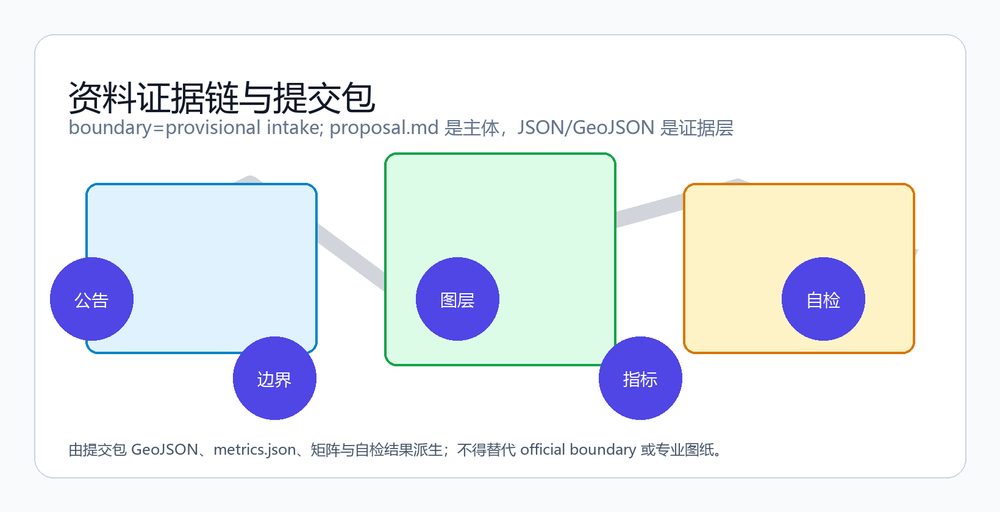
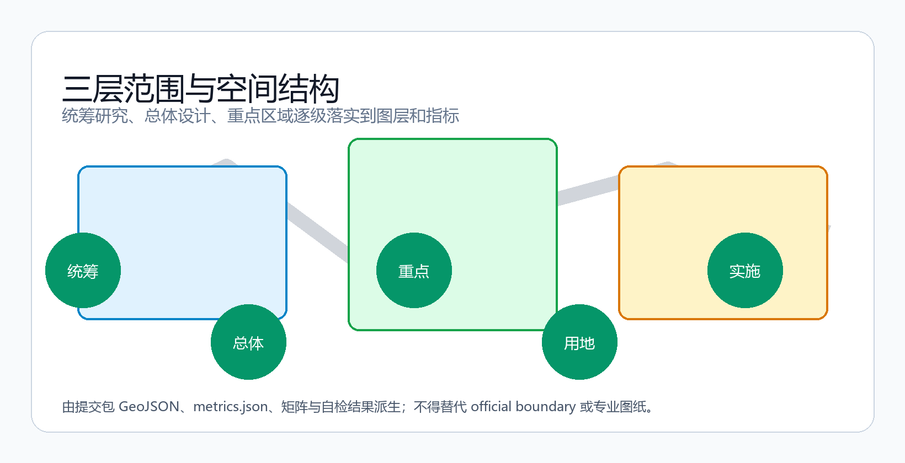
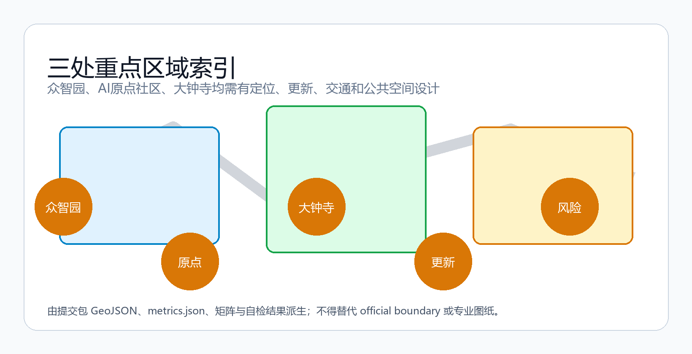
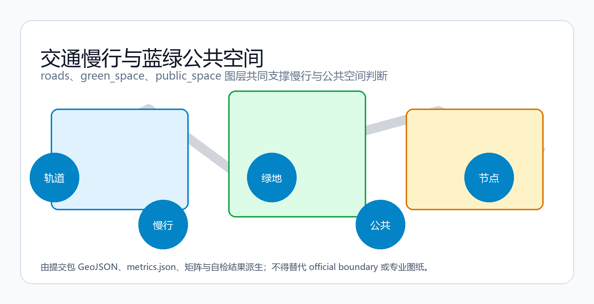
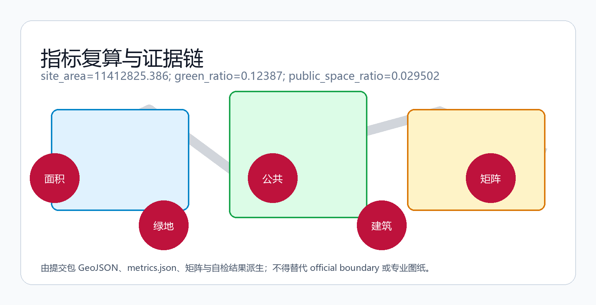

# AI 朝圣·铁轨新生带——百年京张AI创新带城市设计概念方案

## 设计依据与资料清单

本 formal 方案以《百年京张AI创新带城市设计国际方案征集》资格预审公告与海淀区相关规划资讯为第一依据，并以 `brief/site-package/` 中经维护者登记的临时边界、重点区域、枚举、指标、来源清单为机器可读依据。生成前方案已读取 `design_brief.json`、`allowed_design_space.json`、`sources.json`、`enums/`、`ranges/planning_limits.json`、`schemas/`、`data/source_registry.json` 与 `data/processed/agent_fact_pack.md`，并用 `project_scope_summary.csv`、`agent_task_requirements.csv`、`source_use_matrix.csv`、`missing_data_checklist.csv` 建立任务、范围、资料用途和缺口清单。所有设计判断都拆分为可追溯来源、可复算指标、可校验图层和可人工复核假设。

本节证据链引用 [source:OFFICIAL-ANNOUNCEMENT]、[source:AGENT-TASKBOOK]、[source:SITE-PACKAGE]、[source:SOURCE-REGISTRY]、[source:PROCESSED-FACT-PACK]、[source:BOUNDARY-SOURCE]、[source:KEY-AREA-SOURCE]，以及 [standard:PROJECT-OFFICIAL-ANNOUNCEMENT]、[standard:PROJECT-AGENT-OPEN-CALL-TASKBOOK]、[standard:MOHURD-URBAN-DESIGN-MEASURES]、[standard:MOHURD-CONTROL-DETAILED-PLANNING]、[standard:MNR-LAND-USE-CLASSIFICATION-GUIDE]、[standard:MOHURD-ARCH-DESIGN-DEPTH-2016] 与 [depth:existing_conditions_diagnosis]，说明方案不是独立愿景文本，而是以公告、任务书、标准、临时边界、处理资料包和资料清单为起点组织成果。

在官方 `SITE_BOUNDARY` 与三处 `KEY_AREA` polygon 未取得前，本包使用 `brief/site-package/geometry/provisional_boundaries.geojson` 生成的临时边界完成内容评审。提交包中的 `geometry/site_boundary.geojson` 与 `geometry/key_areas.geojson` 均标注 `provisional_constraint`、`official_boundary=false`，只用于方案生成、自检、展示与讨论，不作为审批、征地或精确面积依据。边界解释对应 [data:geometry/site_boundary.geojson#SITE-001] 与 [data:geometry/key_areas.geojson#PROV-KEY-001]、[metric:site_area_sqm]、[metric:key_area_count]。data/processed 目录是本方案的可读导航层，不是新增权威来源。

## 三层范围工作框架

方案采用统筹研究范围（约43.6平方公里）、总体设计范围（约11.4平方公里）、重点区域范围（约368公顷）三层工作框架：统筹层研究AI产业生态与未来城市形态；总体层落实城市更新、用地、交通市政与风貌；重点层对众智园AI自主创新加速区、北京AI原点社区、大钟寺AI产业聚集区三处进行控制性详细规划深度设计。三身在 `compliance_matrix.json` 中逐条映射公告 1.3、1.4、1.5 与 agent.1-agent.6 的必选任务。

三层框架由 [depth:three_level_scope_framework] 与 [depth:overall_spatial_structure] 约束，空间证据以 [data:geometry/site_boundary.geojson#SITE-001]、[data:geometry/key_areas.geojson#PROV-KEY-001] 为锚；任务依据以 [standard:PROJECT-OFFICIAL-ANNOUNCEMENT] 为纲；导航以 [source:PROCESSED-FACT-PACK] 的 `project_scope_summary.csv` 为读图入口。

三层不是割裂图纸。统筹层决定产业链与城市形态判断，总体层把判断落到更新项目、空间结构与设施承载，重点层验证具体地块、建筑、交通、公共空间与AI场景的可实施性。任何无法从结构化数据复算的面积、比例、规模或项目数量，不得写入正式结论 [depth:metrics_recalculation]。

## 统筹研究范围产业与未来城市研究

统筹研究范围的任务是构建世界级 AI 创新生态体系：梳理海淀高校院所、算力算法数据要素、孵化平台、企业总部、独角兽与科技服务资源，提出创新链、产业链、人才链、城市服务链的空间协同框架。命名方案与视觉系统服务“百年京张文化带、都市AI体验带、AI融合创新带”的整体辨识度，落实到总体概念、空间结构图、场景开放和运营机制，而不停留于口号 [source:AGENT-TASKBOOK]。本节要求来自 agent 开源征集任务 [standard:PROJECT-AGENT-OPEN-CALL-TASKBOOK]，不是法定控制。

统筹研究通过 [standard:MOHURD-URBAN-DESIGN-MEASURES] 的城市风貌、公共空间与建筑布局统筹，回接 [data:geometry/land_use.geojson#LU-001]、[data:geometry/public_space.geojson#PUBLIC-001]、[depth:overall_spatial_structure]，说明产业策略最终落到可复核空间结构。未来城市形态研究回答人工智能如何改变的工作生活学习交通与公共服务，并把 AI 交通系统、连续绿空、创新服务设施和国际交往清单落实为可定位的功能区、节点、廊道和场景。若提出全球 AI 活动、开发者社区、开放场景或朝圣线路，均为推荐方案与运营建议，不写成已确定政府活动或实施安排。

## 总体设计范围城市更新与控规深度城市设计

总体设计范围要求达到控制性详细规划深度的城市设计：提出城市更新总体空间结构、低效空间识别、更新项目清单、政策建议、产业功能比例、建筑总规模、综合承载评估与风貌基调。在“带回”主题下，以京张遗址公园活力带为空间主轴（历史、公共、绿色复合廊），以三处重点区为创新锚点，以高校、企业、轨道站点为网络，形成“一带三心、多点场景、蓝绿慢行复合环”。

`geometry/land_use.geojson` 应完整覆盖设计范围且无重叠；`geometry/buildings.geojson` 表达更新或保留基底；`geometry/roads.geojson` 表达微观循环、慢行与轨道接驳；`metrics.json` 复算核心面积比例与图层数量。本节按 [standard:MOHURD-CONTROL-DETAILED-PLANNING] 拆分可审查对象：[data:geometry/land_use.geojson#LU-001] 用地结构、[data:geometry/buildings.geojson#BLDG-001] 建筑基底、[data:geometry/roads.geojson#ROAD-001] 交通组织、[metric:building_footprint_area_sqm] 底座面积、[depth:land_use_layout] + [depth:development_intensity_controls] 控制深度。

总体设计支撑交通、轨道、市政：轨道站点一体化、道路车轮、微循环、停车、共享停车、创新服务平台、人才生活服务、数据基础设施、分布式能源与端侧算力做空间布局与实施路径。凡建筑高度、开发强度、道路红线、退线、设施标准而官方未公布的控制条件，均标记为“待〔官方控规条件确认〕”，不以推算值冒充审定指标 [assumption:A-CONTROLS-001]。

## 重点区域详细设计

三处重点区域做详细设计。众智园AI自主创新加速区：全栈自主创新平台、标准制定、安全治理、产业展示、清河文化、绿色空间与AI场景。圆中AI原点社区：近校创新、成果孵化、人才特区、开源社区、成果发布、校区慢行、轨道一体化。大钟寺AI创新聚集区：领军企业、政策支持、智能终端、内容消费、数据要素、商业服务、绿地复合、大钟寺轨道一体化与四象限步行连通。

三处重点区域引用 [data:geometry/key_areas.geojson#PROV-KEY-001]、[data:geometry/key_areas.geojson#PROV-KEY-002]、[data:geometry/key_areas.geojson#PROV-KEY-003]，由 [depth:three_key_area_detailed_design] 检查是否达到规划综合实施方案深度。任一重点区都有功能、建筑、交通、公共空间、项目证据；若只有“打造示范区”而没有证据层视为未完成。

| 重点片区 | 功能定位 | 空间与场景关键动作 | 证据引用 |
| --- | --- | --- | --- |
| 众智园 | 全栈自主创新、标准治理 | 清河界面科技边界、绿色空间创新交往、对外交通组织、低碳创新测试 | [data:geometry/key_areas.geojson#PROV-KEY-001]、[depth:traffic_rail_slow_parking] |
| 圆中社区 | 近校转化、开源人才社区 | 街慢行缝合、成果发布、人才经开区、园区聚集 | [data:geometry/key_areas.geojson#PROV-KEY-002]、[metric:key_area_count] |
| 大钟寺 | 数字与AI产业、国际交流 | 站城一体化、数据要素服务、商业公共Environment、步行连通 | [data:geometry/key_areas.geojson#PROV-KEY-003]、[depth:three_key_area_detailed_design] |

## AI 创新生态、人才画像与 AI+ 场景

空间科学的 AI 需求画像覆盖研发办公、开源协作、成果发布、人才居住、社交学习、生活消费与运动休闲需求空间。AI+ 场景覆盖地铁间、服务消费、医疗、教育、法律与生活服务。围绕“智能个人服务”“智能交通”“智能商业”“智能生活”四环：产业发展场景与数字化社区功能场景并过，并分别定位到 [data:geometry/land_use.geojson#LU-001]、[data:geometry/roads.geojson#ROAD-001] 等图层。

面向 [standard:PROJECT-AGENT-OPEN-CALL-TASKBOOK]，方案给出不少于10张场景卡、不少于3个产业测试验证场景和5类用户画像；每卡说明服务对象、空间、数据、隐私边界、人工复核、运营主体，并进入合规矩阵。

| 画像 | 需求 | 空间链接 | 隐私与自检边界 |
| --- | --- | --- | --- |
| 开源开发者 | 协作、发布、算力 | 开源沙龙、组装、算力服务点 | 聚合数据、无个人画像 |
| 创业团队 | 孵化、产品验证 | 加速器、测试场景、共享算力 | 数据最小化 |
| 领军企业客商 | 展示、洽谈、国际接待 | 展示区、国际客厅、站点接驳 | 企业标识清权 |
| 一线居民 | 生活、休闲、社区 | 公园休闲、社区智能服务 | 不用于商业画像 |
| 高校师生 | 学习、转化、跨校 | 近校街区、教育AI体验 | 数据授权边界 |

| 场景卡 | 空间载体 | 实现关键 |
| --- | --- | --- |
| 01 AI 发布客厅 | 圆中区中路部分 | 总成果发布、评估展示、夜间协作 |
| 02 城市交通数字孪生 | 总体层面 | 全息展示、可视化、人行体验 |
| 03 AI 酒店机器人送物 | 公共服务与产业街区 | 语音对话、配送机器人、安全围栏数据 |
| 04 跨区医疗AI入口标识 | 公共服务节点 | 慢行标识、AI预检、资料边界 |
| 05 京张文化AI叙事馆 | 海淀河畔 | 铁路文脉数字化、共享创作、内容清权 |
| 06 AI 设计赋能中央 | 区内产业 | 智能体辅助设计、圆点工程 |
| 07 城市智能体运维沙盒 | 智慧运营区 | 可控测试区、流量、告警可视化 |
| 08 低碳智能社区宝典 | 社区 | 能耗、动态调度演示 |
| 09 AI+教育体验区 | 近校社区 | 语言交互、编程实践 |
| 10 AI法律服务入口 | 生活服务区 | 法律、智能问答演示 |

所有 AI 治理建议遵守最小化、公开来源、可解释与人工复核。[metric:public_space_ratio] 与 [metric:green_ratio] 保证场景能落到公共空间与绿色空间，[depth:blue_green_public_space] 约束其深度。城市智能体不替代审批、不输出未授权画像、不承诺政府行为。

## 用地、建筑规模与拆改留方案

用地方案按 [standard:MNR-LAND-USE-CLASSIFICATION-GUIDE] 建立完整、闭合、无缝的用地分区。`geometry/land_use.geojson` 分层表达人工优化：居住更新 0701、社区服务 0702、研发 0802、教育 0804、商业命题 05、绿地 1401、预留 16，并在 `metrics.json` 以体积与占比复算。用地证据 [data:geometry/land_use.geojson#LU-001] 与 [depth:land_use_layout]。建筑分保留、改造、更新、新建、待定资产，方案必须在拆改留方法 [depth:retain_renovate_demolish] 范围中区分，而不编造权属结论[standard:MOHURD-CONTROLD-PLANNING]。

缺少现状建筑、权属、控规、工程条件时，文本只能提出分割方法与待确认清单：把大厦、屋顶、体量、高度、密度通过建议层级表达，把未确定参数标记为 unknown 或 pending_control，并在 `compliance_matrix.json` 与 `assumptions.json` 声明；不得用固定数字制造精确建议。建筑基底复算引用 [data:geometry/buildings.geojson#BLDG-001] 与 [metric:building_footprint_area_sqm]，整体连通 [depth:height_massing_character]。

## 交通、轨道、市政与公共服务设施

交通方案回应公告对轨道一体化、慢行断点、对外交通、非机动车停车、停车与绿色交通系统的任务。重点覆盖北五环、京张遗址公园跨环路节点、五道口、清华东路西口和大钟寺与骨干企业周边联系。道路与慢行图保持在边界内，并同公共空间、绿地、产业节点和重点区相互转真；边界为临时边界时，结论亦为临时讨论 [standard:CONTROL]。

交通与市政深度分别由 [depth:traffic_rail_slow_parking] 与 [depth:municipal_new_infrastructure] 约束；图层证据引用 [data:geometry/roads.geojson#ROAD-001]、[data:geometry/public_space.geojson#PUBLIC-001]、[data:geometry/constraints.geojson#CONSTRAINTS]。市政与公共服务设施覆盖 AI 产业服务、创新平台、人才生活服务、分布式能源、端侧算力与既有设施融合，说明设施标准、服务半径、运营模式和分期逻辑；管线、排水、防洪、消防资料缺失时列为正式深化前置条件。

## 蓝绿空间、公共空间与城市风貌

蓝绿体系以京张遗址公园活力带为骨架贯通南北：结合清河、小月河、高校与企业出行，提出南北贯通、东西连通的步道与骑行体系；识别慢行断点、上跨节点、南出口与北标节点，并考虑停车、体育、创新、实时科技测试与服务复合利用 [depth:blue_green_public_space]。

公共线与空间证据 [data:geometry/green_space.geojson#GREEN-001] 、[data:geometry/public_space.geojson#PUBLIC-001]、[metric:green_ratio]、[metric:public_space_ratio]，并配合 [standard:MOHURD-URBAN-DESIGN-MEASURES] 的风貌整合。风貌融合京张铁路历史、中关村文化和AI创新文化，利用清华园车展、北影等资源提出基调、屋顶、体积、界面与公共艺术引导；提出导视、文化符号、国际叙事、AI朝圣地标等品牌体系，所有品牌、字体、肖像、企业标识须有清权；无文保或控规依据时不给精确红线 [depth:height_massing_character]。

## 更新项目清单、实施政策与分期计划

形成可审查的更新项目清单：项目位置、类型、功能、责任主体、依赖条件、实施阶段、风险与评估指标；政策建议覆盖更新统筹、空间供给、运营机制、产业服务、公共参与、数据治理与产权协同 [depth:renewal_project_list]。`geometry/phasing.geojson` 表达分期范围，`compliance_matrix.json` 把任务与分期和图纸挂接。

| 编号 | 项目 | 类型 | 主要依赖 | 证据引用 |
| --- | --- | --- | --- | --- |
| JZ-01 | 京张遗址公园慢行缝合 | 公共/交通 | 线形、桥下归权 | [data:geometry/roads.geojson#ROAD-001] |
| JZ-02 | 众游清河创新界面 | 蓝绿/产业 | 河蓝线、防洪 | [data:geometry/green_space.geojson#GREEN-001] |
| JZ-03 | 近校成果转化街区 | 更新 | 校区边界、权属 | [data:geometry/buildings.geojson#BLDG-001] |
| JZ-04 | 大钟寺站一个小型区 | 轨道慢行 | 站点、管线 | [data:geometry/public_space.geojson#PUBLIC-001] |
| JZ-05 | AI 公共与创业节点 | 新基建 | 能源、安全 | [data:geometry/constraints.geojson#CONSTRAINTS] |
| JZ-06 | 分区落地 | 分期 | 公共许可、版权 | [data:geometry/phasing.geojson#PHASE-1] |

分期与100天征集周期区分：实施分期是城市更新路径；按近期试点、中期更新、远期协同安排，优先以轻量设施、运营活动与服务平台启动，等待正式控规、市政与专项确认 [depth:phasing_implementation]。活动体系、开放场景、持续运营与传播机制说明运营对象、频率、责任与风险，不写宣传口号。

分期空间以 `phasing.geojson` 表达，`以 `geometry/phasing.geojson` 图层证明，不承诺预约时间线；无资金实施主体与审批路径的规模内容列为项目风险。

## 指标体系、面积复算与合规矩阵

指标体系至少应包含：总体面积与重点面积、绿地与公共比例、建筑基底、更新项目数、场景节点数、功能推算、人才服务、慢行指标、自检状态 [depth:metrics_recalculation]。所有 known 指标能从提交几何复算；unknown 指标标注原因与前置条件。

本方案正文显式引用 [metric:site_area_sqm]、[metric:key_area_count]、[metric:building_footprint_area_sqm]、[metric:green_ratio]、[metric:public_space_ratio]，其值来自 [data:geometry/site_boundary.geojson#SITE-001]、[data:geometry/key_areas.geojson#PROV-KEY-001]、[data:geometry/buildings.geojson#BLDG-001]、[data:geometry/green_space.geojson#GREEN-001]、[data:geometry/public_space.geojson#PUBLIC-001]。`scripts/spatial_review.py` 与 `scripts/visual_review.py` 的结果作为自检证据。

合规矩阵是任务响应主控文件：每条公告任务与任务任务点对应到报告、图层、图纸、HTML、来源、假设、自检；覆盖公告 1.3/1.4/1.5 与 agent.1-agent.6（共23项，拼完全表）。指标按三类管理：一类几何直接复算（边界、绿、公共、建筑、分期面积）；二类官方/控规（容积率、高度、密度、红线、设施标准）待确认；三类运营性绩效（创新指数、人才密度、满意度、路网、活动次数）进入 `metrics.json`/`assumptions.json`/`compliance_matrix.yml`，不混同审定值。

## 风险、版权与合规说明

方案语言：中文为主。所有图片、图纸、图标与数据在 sources.json 或 copyright_statement.md 声明来源与清权状态。HTML 页面不加载远程脚本、地图、字体、iframe、表单、外部 API，不跟踪评定。

风险与缺失资料由 [depth:risk_missing_data] 管理，与 [data:geometry/constraints.geojson#CONSTRAINTS]、[source:SITE-PACKAGE]、[source:PROCESSED-FACT-PACK]、[standard:MOHURD-CONTROL-DETAILED-PLANNING] 关联，缺失清单写入 assumptions 与自检。本方案不声称官方红线、审定控规、最终权属、实施承诺；AI agent 对事实、来源、数字与表达负责，专业评审可依据自检返修或拒绝。

## 参考资料

- brief/public-brief.md、brief/site-package/design_brief.json、allowed_design_space.json、planning_limits.json
- brief/site-package/enums/、schemas/、geometry/provisional_boundaries.geojson
- data/processed/agent_fact_pack.md、project_scope_summary.csv、agent_task_requirements.csv、source_use_matrix.csv、missing_data_checklist.csv
- data/source_registry.json、data/standard references/
- scripts/scaffold_ai_submission.py、validate_submission.py、finalize、self_check、spatial_review、visual_review

机器可读引用：[source:OFFICIAL-ANNOUNCEMENT]、[source:AGENT-TASKBOOK]、[source:SITE-PACKAGE]、[source:PROCESSED-FACT-PACK]、[standard:PROJECT-OFFICIAL-ANNOUNCEMENT]、[standard:PROJECT-AGENT-OPEN-CALL-TASKBOOK]、[depth:metrics_recalculation]、[data:geometry/site_boundary.geojson#SITE-001]、[metric:site_area_sqm]