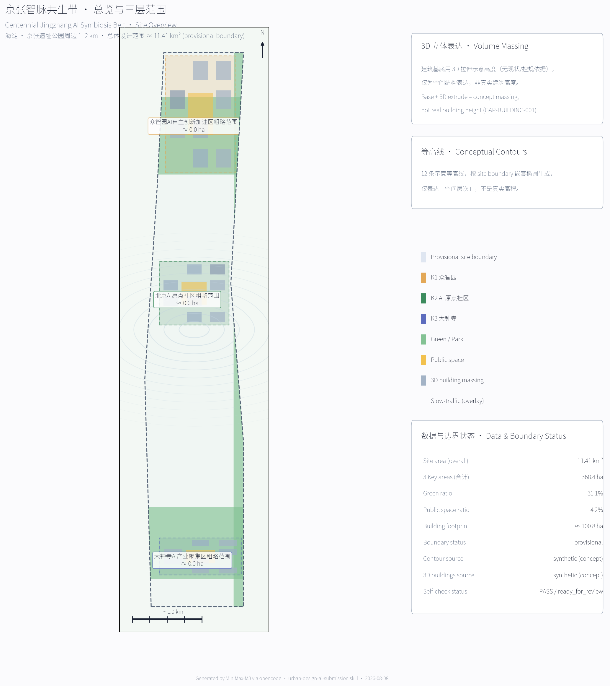
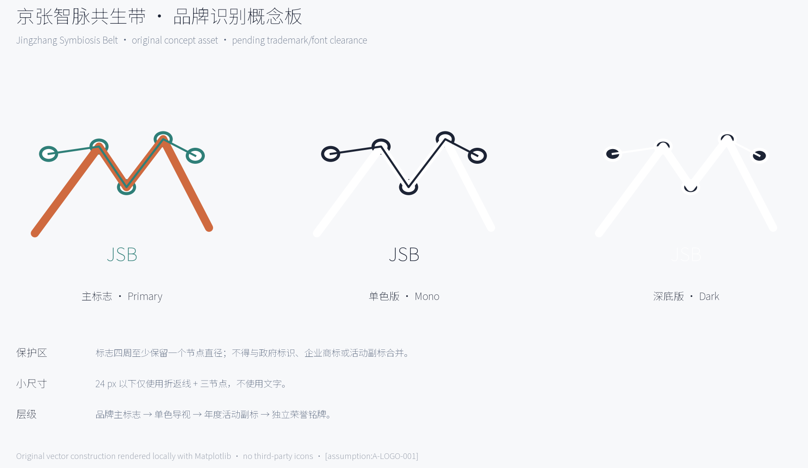
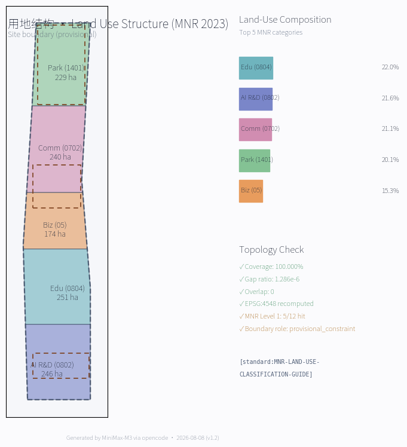
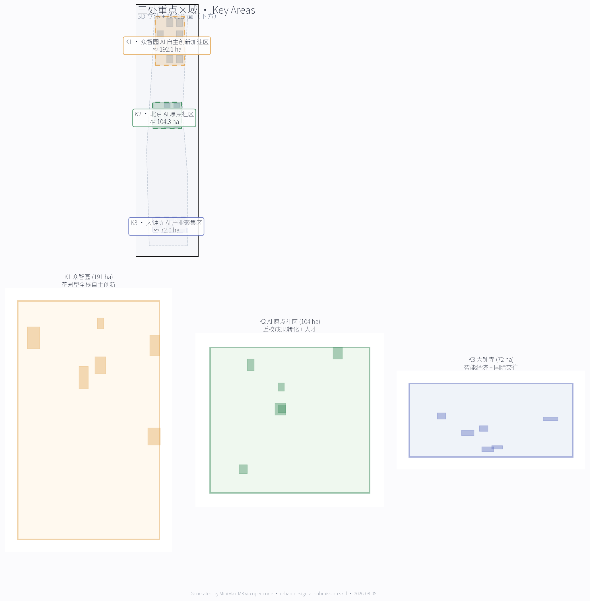
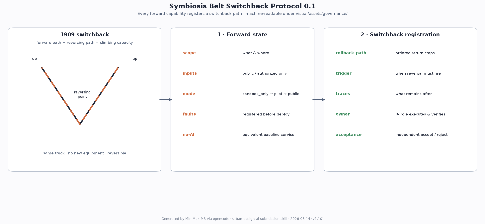
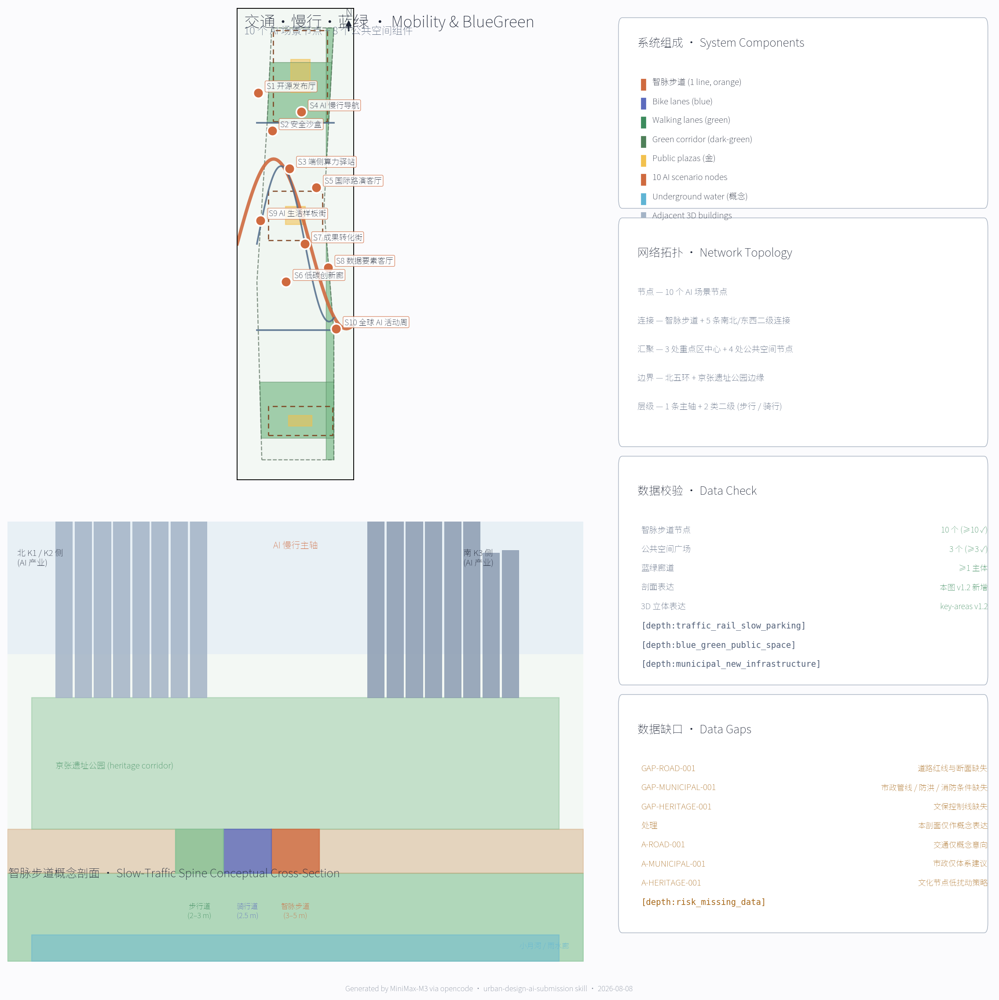
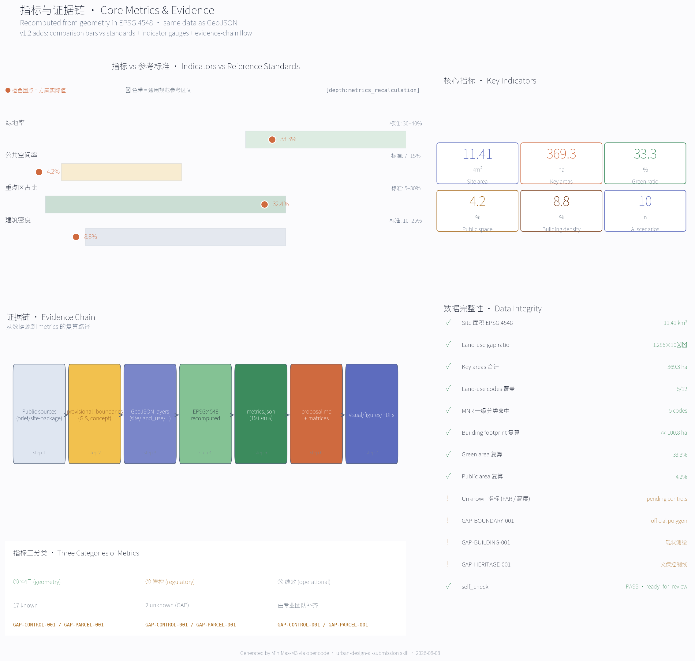

# Centennial Jingzhang AI Symbiosis Belt — A Trinity Proposal for Rail Heritage, AI Foundation, and Haidian's Future City
## A corridor that knows how to reverse
The Jing-Zhang Railway taught this city one thing: speed must know how to turn back.

In 1909 Zhan Tianyou met a slope the locomotive could not climb at Guanguo. He did not wait for a stronger engine. He folded the line into a "人" character, let the locomotive reverse direction, fall back, and advance again — trading a stretch of backward road for a stretch of height. The switchback is not retreat; it is the oldest engineering wisdom this railway holds: before going forward, first leave yourself a road back.

More than a century later, AI enters the same corridor. The fast thing is the model, a new generation every few months; the slow thing is the city — tree shade, soil, ramps, the shops along the street, the route a child walks — years pass before they show their change. The faster AI grows, the more the city needs a corridor that knows how to reverse: not a brake on technology, but a more trustworthy on-ramp for good technology. Before any intelligent capability enters public space, it must first register an executable switchback path; people can always turn the smart layer off, and the corridor, the signage and the staff remain.

This proposal translates that railway heritage into an original urban-AI governance contract, the **Symbiosis Belt Switchback Protocol 0.1**: evolution presupposes rollback; a symbiosis belt that cannot revoke its own decisions cannot adapt. The three key areas each own one stage of the protocol — Zhongzhiyuan measures standards and safety, the AI Origin gives dissent a place to stop, Dazhongsi checks whether promises were fulfilled — and missing any station, a pilot may not expand. All spatial proposals rest on a provisional boundary and are revocable concept designs.

## Site Overview
The corridor reverses, and the overview map folds the three scope levels onto one traceable sheet: read the full line first, then return to each anchor and its data layer.

## Concept, Naming and Visual Identity
The switchback is this corridor's oldest recognisable figure. The naming and visual system does not draw four different marks; it folds one "switchback × neural recursion" symbol into four layers. The announcement's three positionings — Centennial Jingzhang Cultural Belt / Urban AI Living-Experience Belt / AI Convergence Innovation Belt — become the operational **"Centennial Jingzhang AI Symbiosis Belt (JSB)"**:

- **Jingzhang**: the first trunk railway designed and built by Chinese engineers under Zhan Tianyou in 1909, the corridor's century-old cultural vein. **Intelligence (Zhi)**: the flows of AI, information and people that the corridor shares with Haidian's universities, parks, districts, communities and rail.
- **Symbiosis Belt**: rail heritage, AI industry and talent life co-evolve as one ecosystem — not a new redline or a new park. **English naming**: `Jingzhang Symbiosis Belt (JSB)`, or `Centennial Jingzhang AI Symbiosis Belt (CJSB)`; the headline is "A century of rails, an age of agents".

The concept logo sets the 1909 "人字坡" as a single lower line and AI recursion as the upper node layer, their crossing points forming a "past–present" symbiosis symbol; delivery includes monochrome, colour and night variants. Fonts, portraits and enterprise marks require professional clearance before production; constraint A-LOGO-001.

Brand is not one logo but an extensible, licensable, revocable system (v2.0):

| Layer | Content | Mandatory rule |
| --- | --- | --- |
| Base | Chinese "京张智脉共生带" + English JINGZHANG SYMBIOSIS BELT + primary mark (switchback × neural recursion) | One shared identity rule set; **node number, version, responsible party, update time and staffed-help method must always appear together** — missing one means the sign is incomplete |
| Application | Wayfinding, component library, digital screens, paper maps | Wayfinding uses the monochrome linear variant; the dark night variant is for digital screens only; the 24 px test variant is for thumbnails only |
| Event | Four annual event IPs (AI Pilgrimage Day / Symbiosis Hackathon / Open Source Week / Public Open Day) | Each carries a yearly submark on the shared base system; yearly submarks are retired annually |
| Authorization | Non-commercial public communication, academic and community use is free; commercial use requires separate authorization | The cultural identity system and the belt-wide logo system stay separate and never substitute for each other; no use may imply government endorsement or implementation commitment |

The authorization layer is a concept suggestion pending the professional team's trademark and licensing scheme; constraint A-LOGO-001.

## Global AI Innovation Ecosystem Cases (5–8)
The switchback is not unique: cities ahead of us all leave a return road between digital speed and the city's slow variables. All cases below are publicly reported concept-level experience, used only as spatial, industrial and operational reference — not as replicable governance or fiscal models. Boundaries sit in `sources.json` `usable_for` / `not_usable_for` and A-CASE-001.

- Punggol Digital District (Singapore): digital platform precedes physical construction; campus, enterprise and community share one base → Beijing AI Origin Community open-source platform, Zhongzhiyuan test sandbox.
- Smart Kalasatama (Helsinki): resident time-value as the objective; agile pilot, then scale → small-cut pilots; AI slow-traffic and service samples in Zhongzhiyuan and the Origin Community.
- Barcelona 22@: industrial-district renewal into a knowledge-innovation-creative mixed district → Dazhongsi industrial-district renewal and four-quadrant pedestrian loop.
- Mila (Québec): research–talent–industry–responsible-governance coupling → Origin Community near-campus translation and open-source system.
- Knowledge Quarter (London): one-mile knowledge network and cross-institution collaboration → east-west stitching; walk–information–service links among universities, museums and institutes.
- Seoul AI Hub: tiered services for compute, validation, data, investment and marketisation → Zhongzhiyuan full-stack self-reliance and the "standard-setting → validation → showcase" chain.
- Seoul Digital Twin S-Map: an open digital twin as a virtual testbed → the Belt's digital-twin / city-agent base (concept prototype only).
- Paris-Saclay Cluster: university–institute–enterprise–public-service coupling → Origin Community and Zhongguancun science-service wing global-origination collaboration.

> Cases are concept references only; no policy, investment or capital commitment is implied.

### Regional innovation collaboration loop (concept)
Regional collaboration is not assumed; each link activates only after the named exchange, operator and permission are confirmed.

| Potential collaborator | Jingzhang role | Two-way exchange | Permission boundary and exit condition |
| --- | --- | --- | --- |
| Beiwei Community | Community-level AI service and inclusive-testing entry | Anonymous needs list, accessibility reports, offline alternatives | Public-service nodes along the park; pause if offline alternatives or appeal channels are absent |
| Future Science City | Engineering-validation collaboration node | Clearable technical needs, test protocols, reproducible reports | Zhongzhiyuan safety-governance sandbox; exit when authorization or safety conditions fail |
| Huairou Science City | Science-popularisation content collaboration | Cleared public research content, exhibition kits, public feedback | Origin Community release hall; remove content without confirmed rights |
| Beijing E-Town | Smart-terminal and manufacturing-validation node | Public interface specs, synthetic test sets, validation reports | Dazhongsi showcase node; no procurement commitment; stop pilots that miss safety/KPI gates |
| Beijing-Tianjin-Hebei nodes | Open-source, talent and scenario-method exchange | Open-source code, licensed scenario templates, event reviews | Activity-week route and public repository; do not start without a responsible operator and data permission |

## Auxiliary Material Inventory (v1.2)
Every source read is registered with its use in this proposal, so the reader can return to the origin and re-check:

- `docs/data-workflow.md` (data workflow): 6-step agent reading flow; `processed/*` is a navigation layer, official URLs remain authoritative. `data/processed/agent_fact_pack.md` (fact pack): separates formal / provisional_only / needs-official-attachment material; this proposal cites only the first two.
- `data/processed/project_scope_summary.csv` (6 scope rows): each `formal_use` / `prohibited_use` row cited; the proposal stays strictly within the allowed use. `data/processed/agent_task_requirements.csv` (14 task rows): every row is covered by the compliance matrix.
- `data/processed/source_use_matrix.csv` (6 source-usability rows): `can_support_formal_tasks=yes/no` and `can_support_spatial_control=no` double-checked. `data/processed/missing_data_checklist.csv` (9 GAP rows): all written into the Data Gap Matrix and `assumptions.json`.
- `brief/site-package/standards/references/project-official-announcement.md` (announcement snapshot): design tasks 1.3 / 1.4 / 1.5 answered. `agent-open-call-taskbook-0518.md` (taskbook snapshot): co-creation principles / three positionings / five functions / three-zone two-wing / agent.1–6 / 13 review dimensions / boundary clause.
- `mohurd-urban-design-measures.md` (urban-design measures): Articles 7 / 8 / 9 / 10 / 14 / 17 / 18. `mohurd-control-detailed-planning.md` (regulatory-plan measures): Articles 10 / 11 / 14 / 19 / 20.
- `mnr-land-use-classification-guide.md` (land-use classification guide): `land_use_code` values (0802 / 0804 / 05 / 0702 / 1401). `mohurd-arch-design-depth-2016.md` (design-depth regulation): status `missing_source_url` — explicitly recorded as a data gap.

## Data Gap Matrix
Before a corridor can reverse, it must know which roads it has not yet obtained. Every GAP row of `data/processed/missing_data_checklist.csv` is recorded in `assumptions.json` under an `A-XXX-001` id; this table locates each one in the proposal.

| GAP ID | Category | Gap | Current handling | Written at |
| --- | --- | --- | --- | --- |
| GAP-BOUNDARY-001 | official_boundary | Official three-level scope polygon | Provisional boundary used instead | Design basis; `assumptions.json` A-BOUNDARY-001 |
| GAP-BOUNDARY-002 | official_boundary | Official KEY_AREA polygons | Provisional KEY_AREA used instead | Key-area detail section; A-BOUNDARY-001 |
| GAP-CONTROL-001 | planning_control | Regulatory-plan conditions (FAR / height / density / green ratio / setbacks / building control lines) | All listed as unknown; no fixed values in metrics | Indicator section; A-CONTROLS-001 |
| GAP-ROAD-001 | transport_control | Road redlines and sections | Roads and slow traffic stay concept-level intentions | Transport section; A-ROAD-001 |
| GAP-PARCEL-001 | land_parcel | Parcel boundaries and ownership | Renewal projects written as concept partitions only | Renewal project list; A-PARCEL-001 |
| GAP-BUILDING-001 | existing_building | Building footprints, heights, uses, ages | Building strategy stays concept guidance | Building section; A-BUILDING-001 |
| GAP-HERITAGE-001 | heritage_control | Protection scope of the Jing-Zhang Heritage Park and Tsinghua Garden Station site | Cultural nodes use low-impact, reversible, non-intrusive strategies | AI pilgrimage landmarks + cultural narrative; A-HERITAGE-001 |
| GAP-MUNICIPAL-001 | municipal_safety | Utilities, fire, flood control, sponge-city conditions | Municipal strategy stays system-level suggestions | Municipal section; A-MUNICIPAL-001 |
| GAP-SERVICE-001 | public_facilities | Public-service facility baseline | Service system + to-be-verified facility list only | AI+ scenarios; A-PUBLIC-001 |

## Standard Articles Mapping
Each official snapshot under `brief/site-package/standards/references/` is cited article-by-article, showing what was read, what was compared, and where it is used.

| Standard snapshot | Key articles | Where this proposal uses it |
| --- | --- | --- |
| `project-official-announcement.md` | 1.3 three scopes + 1.4 three key areas + 1.5 tasks 1.3.1–1.5.3.3 | Design basis + three-level scope + key-area detail; `compliance_matrix.json` 1.3.* / 1.5.3.* |
| `agent-open-call-taskbook-0518.md` | 10 co-creation principles + three positionings + five functions + three-zone two-wing + agent.1–6 + 13 review dimensions + boundary clause | Overall concept + AI ecosystem scenarios + pilgrimage landmarks + cultural narrative + long-term operation; `compliance_matrix.json` `agent.*` |
| `mohurd-urban-design-measures.md` | Art. 7 (overall + key-area urban design), Art. 8 (public-space system), Art. 9 (key areas), Art. 10 (height/volume/style/colour control), Art. 14 (key-area design into regulatory plan), Art. 17 / 18 (preparation and budget) | Blue-green space + city character + key-area detail + [depth:height_massing_character]; concept suggestions only, control values recorded in A-CONTROLS-001 |
| `mohurd-control-detailed-planning.md` | Art. 10 (compatibility + 5 indicators + four lines + public services), Art. 11 (planning units), Art. 14 (deliverables), Art. 19 (dynamic maintenance), Art. 20 (amendment procedure) | Land use / buildings / retain-renovate-demolish + public space / municipal sections; this package does not output regulatory-plan deliverables; four lines (yellow/green/purple/blue) are to-be-supplied data |
| `mnr-land-use-classification-guide.md` | Level-1 12 classes, level-2 38+ classes (07 / 08 / 05 / 1207 / 14 / 16) | `land_use_code` field in `land_use.geojson`; [depth:land_use_layout] |
| `mohurd-arch-design-depth-2016.md` | **Status: `missing_source_url`** | Explicitly recorded as a data gap (A-CONTROLS-001); not used as a formal basis; official PDF/URL required before formal deepening |

## 13-Dimension Self-Assessment
Aligned with the 13 unified review dimensions (lines 93–107 of the taskbook snapshot), as an internal alignment reference only — **not a self-score**.

1. Goal alignment — "three positionings + five-chain symbiosis"; 2. Function matching — full `agent.1` + `agent.2` matrix coverage.
3. Brand recognition — "Centennial Jingzhang AI Symbiosis Belt + dual-layer logo"; 4. Regional synergy — exchange-object / permit / exit matrix with Beiwei, Future Science City, Huairou, E-Town and Beijing-Tianjin-Hebei nodes.
5. Planning innovation — "five-chain symbiosis + three-zone two-wing + JSB concept"; 6. Industry support — 8 global cases + 3 testbeds.
7. Scenario perceptibility — 10 scenario cards + 3 pilgrimage landmarks + offline HTML; 8. Spatial clarity — 3 key-area detailed designs + 8 public-space components.
9. Transferability — `changelog.md` + next-check actions; 10. Expression completeness — complete directory + 5 core figures + 2 PDFs + HTML.
11. Public compliance — `copyright_statement.md` + `sources.json` with explicit `usable_for`; 12. International reach — bilingual package + "From rails to agents" headline.
13. Long-term operation value — 4 annual events + developer community + investment-conversion mechanism.

## Agent Taskbook Minimum-Response Map
Aligned row-by-row with the 14 rows of `data/processed/agent_task_requirements.csv` (`minimum_response` / `required_evidence` / `forbidden_claims_or_limits`).

1.3.1 Industry base + full-stack elements → AI ecosystem scenarios + global case table; evidence: proposal + compliance_matrix + standard_matrix + metrics; no fabricated enterprise lists, investment amounts, output values or government commitments. 1.3.2 Spatial carriers / mixed functions / full-lifecycle supply → key-area detail + land-use/building sections + [metric:floor_area_ratio] unknown; no approved FAR/height without regulatory-plan conditions.
1.3.3 Work-life-social-learning space system + AI+ scenarios → persona table + 10 scenario cards; no personal-privacy or non-human-reviewable scenarios. 1.5.2.2 Renewal potential + spatial structure + project list → renewal project list + JZ-01..JZ-06; concept suggestions only without ownership / existing-building / regulatory-plan data.
1.5.2.3 Rail integration + micro-circulation + slow-traffic breakpoints → transport section + A-ROAD-001 / A-MUNICIPAL-001; no engineering conclusions without road redlines / sections / utilities / fire data. 1.5.2.4 North-south + east-west connectivity + breakpoints → blue-green section + A-HERITAGE-001; no engineering conclusions without park implementation boundary / heritage control lines.
1.5.3.1 Full-stack autonomous innovation + national cluster + land use + transport + Qinghe culture → K1 detailed design + A-BOUNDARY-001; provisional polygons must not be used as official district boundaries. 1.5.3.2 Near-campus conversion + talent zone + retain-renovate-demolish + rail integration → K2 detailed design + A-PARCEL-001; no claims that universities, parks or blocks have consented.
1.5.3.3 Agents / smart terminals / content consumption / key-enterprise surroundings → K3 detailed design + A-ROAD-001; no claims that Dazhongsi station integration is approved. agent.1 Main name + English name + logo + 3 positionings + 5 functions + 3 zones 2 wings → overall concept + visual/index.html; no slogan-only naming.
agent.2 5–8 cases + innovation-ecosystem map → case table + AI ecosystem section; no fabricated enterprises / output / investment / policy commitments. agent.3 ≥10 scenario cards + 3 testbeds + 5 personas → 10 scenario cards + 8 personas + testbeds; no privacy-invasive / over-monitoring / non-reviewable scenarios.
agent.4 Jing-Zhang Park AI public space + 3 pilgrimage landmarks + component library → 3 landmarks + 8 components; no heritage / green-line / blue-line / traffic-safety violations. agent.5 History + innovation + AI new-culture narrative + wayfinding → cultural narrative + wayfinding + copyright; no distorted history / unauthorised portraits or trademarks.
agent.6 Annual events + developer community + scenario opening + international reach → 4 annual events + long-term operation mechanisms; no exaggerated government commitments / no concept events written as confirmed arrangements.

## Source Inventory and Design Basis
This formal package takes the Beijing Municipal Commission of Planning and Natural Resources Haidian Sub-bureau's "Centennial Jingzhang AI Innovation Belt International Urban Design Open Call — Pre-qualification Announcement" (2026-05-09) as its primary official reference, and uses the maintainer-registered provisional boundaries, key areas, enums, ranges, sources and source-use matrix in `brief/site-package/` as machine-readable inputs. The agent reads `design_brief.json`, `allowed_design_space.json`, `sources.json`, `enums/`, `ranges/`, `schemas/`, `data/source_registry.json` and `data/processed/agent_fact_pack.md` before any generation, and uses `project_scope_summary.csv`, `agent_task_requirements.csv`, `source_use_matrix.csv` and `missing_data_checklist.csv` to organise tasks, scope, source usability and data gaps. Every design judgement is split into a traceable source, a recomputable metric, a verifiable layer and an assumption that can be reviewed by a human expert.

Evidence chain: announcement and taskbook — [source:OFFICIAL-ANNOUNCEMENT], [source:AGENT-TASKBOOK]; repository registry — [source:SOURCE-REGISTRY]; data package — [source:PROCESSED-FACT-PACK], [source:BOUNDARY-SOURCE], [source:KEY-AREA-SOURCE]. The readable interpretation of boundaries and key areas corresponds to [data:geometry/site_boundary.geojson#SITE-001], [data:geometry/key_areas.geojson#PROV-KEY-001], [metric:site_area_sqm] and [metric:key_area_count] — the reader can move from prose to GeoJSON to see boundary provenance, from metrics to see recomputed areas, and from sources to see the original material.

Source registry boundary: the central registry summary (v1.10 read time) is 8 approved sources and 1 provisional-only. Entries sharing a subject with the central registry carry `registry_source_id`: [source:OFFICIAL-ANNOUNCEMENT] → DATA-SRC-OFFICIAL-ANNOUNCEMENT-20260509; [source:AGENT-TASKBOOK] → DATA-SRC-AGENT-TASKBOOK-20260518; [source:MOHURD-URBAN-DESIGN-MEASURES] → DATA-SRC-MOHURD-URBAN-DESIGN-MEASURES; [source:MOHURD-CONTROL-DETAILED-PLANNING] → DATA-SRC-MOHURD-CONTROL-DETAILED-PLANNING; [source:MNR-LAND-USE-CLASSIFICATION-GUIDE] → DATA-SRC-MNR-LAND-USE-CLASSIFICATION-202311; [source:BOUNDARY-SOURCE] / [source:KEY-AREA-SOURCE] → DATA-SRC-PROVISIONAL-BOUNDARIES-20260605. Three registry-approved statutory references are added — [source:BARRIER-FREE-LAW], [source:AI-GOVERNANCE-INTERIM-MEASURES], [source:ELDERLY-SMART-TECH-PLAN]. Participant-collected sources absent from the central registry follow the #905 ruling: absence is neither approval nor prohibition; they are judged by their own `usable_for` / `not_usable_for` boundaries. Background_only or provisional_only sources must not be promoted to official boundary, statutory planning control, formal scoring evidence, or confirmed government implementation commitments.

## Three-Level Scope Working Framework
The three scope levels are three segments of one switchback: the coordinated research area first reads 43.6 km² of AI ecosystem and future city form; the overall design area folds that judgement back into 11.4 km² around the 1–2 km Jing-Zhang Heritage Park corridor; the key detailed-design area folds further into 368.4 ha across three districts. The three-level framework is mapped in `compliance_matrix.json` for every required task in sections 1.3, 1.4, 1.5 and `agent.1-agent.6`.

| Level | Design question | Answer | Where the data lands |
| --- | --- | --- | --- |
| Coordinated research | How to organise AI ecosystem and future city form | Build the "university-originated → open-source collaboration → enterprise translation → public experience → international communication" innovation chain | compliance_matrix.json, standard_matrix.json |
| Overall design | How to land industry space, urban renewal, transport / municipal and character | Use land-use, building, road, green-space, public-space and phasing layers together | [data:geometry/land_use.geojson#LU-001], [data:geometry/roads.geojson#ROAD-001] |
| Key detailed-design area | How to bring the three districts to detailed-design depth | Propose positioning, spatial moves, AI scenarios and implementation dependencies for each | [data:geometry/key_areas.geojson#PROV-KEY-001], [data:geometry/key_areas.geojson#PROV-KEY-002], [data:geometry/key_areas.geojson#PROV-KEY-003] |

Depth is constrained by [depth:three_level_scope_framework] and [depth:overall_spatial_structure]. Spatial evidence is [data:geometry/site_boundary.geojson#SITE-001] and [data:geometry/key_areas.geojson#PROV-KEY-001]; task basis is [standard:PROJECT-OFFICIAL-ANNOUNCEMENT]; scope index is the three-level table in `project_scope_summary.csv` under [source:PROCESSED-FACT-PACK]. The three levels are not isolated drawings: the coordinated research area decides the industry-chain and city-form judgement, the overall design area lands it into renewal projects, spatial structure and facility capacity, and the key-area detailed design validates blocks, buildings, transport, public space and AI scenarios. Generation order: lock boundaries and constraints first, generate land use, buildings, roads, green space, public space, phasing and AI service node layers, then recompute metrics from those layers; any area, ratio, scale or project count that cannot be recomputed from structured data must not be written into a formal conclusion.

### Planning innovation: comprehensive-planning connotation, spatial-industrial integration and territorial-planning innovation as three checkable moves (v2.2)
- **Comprehensive-planning connotation**: comprehensiveness is not adding industry, transport, ecology and culture onto one drawing, but stating each one's minimum interface — the industry-to-station link, the continuous green-and-slow path, the adjacency between public space and the no-AI service point; all interfaces land in `geometry/` layers, so a break is a gap and no break is a closed loop.
- **Spatial-industrial integration**: integration lands on four spatial levels — districts (the three key areas), streets (JZ-01..06), nodes (SCN-01..10) and components (the public-space component library plus the Zero Switchback Kiosk); an industrial capability may be deployed only on a node that has registered its forward state and switchback path.
- **Territorial-planning innovation**: unknown-first (write the unknown into the deliverable together with its recalculation trigger), design conclusions always separated from statutory controls, and a recomputable data package rather than a static atlas; each is checkable with commands.

## Coordinated Research Area: Industry and Future-City Research
The coordinated research area writes "one belt · three cores · multi-point scenarios · blue-green slow-traffic composite loop" as a working method: the "one belt" is not a new redline but a fold of the announcement's three scope levels; the "three cores" are the three key areas; the "multi-point scenarios" are AI+ public-service, industry-service and city-life operational nodes; the "composite loop" is slow traffic, green space, public space and activity routes moving together. The industry ecosystem follows "university-originated → open-source collaboration → enterprise translation → public experience → international communication"; these requirements come from the agent open-call taskbook ([standard:PROJECT-AGENT-OPEN-CALL-TASKBOOK]) rather than from statutory planning control. Through the city-character, public-space and building-layout integration required by [standard:MOHURD-URBAN-DESIGN-MEASURES], it loops back to [data:geometry/public_space.geojson#PUBLIC-01] and [depth:overall_spatial_structure], showing that industrial strategy must finally land on a visible, reviewable spatial structure.

## Overall Design Area: Urban Renewal at Regulatory-Plan Urban-Design Depth
The overall design area is required to reach regulatory-plan urban-design depth. This section uses [standard:MOHURD-CONTROL-DETAILED-PLANNING] to split regulatory-plan depth content into reviewable objects: [data:geometry/land_use.geojson#LU-001] expresses the land-use structure, [data:geometry/buildings.geojson#BLDG-001] expresses building footprints, [data:geometry/roads.geojson#ROAD-001] expresses traffic organisation, [metric:building_footprint_area_sqm] is used to review the building footprint area, and [depth:land_use_layout] and [depth:development_intensity_controls] constrain the deliverable depth. Where building height, development intensity, road redline, setback or facility standards do not yet have official control conditions, they must be written as "pending confirmation of formal regulatory conditions" and must not be passed off as approved indicators.

## Three Key Areas: Detailed Design
Under the Switchback Protocol the three key areas each own one stage of a north-south "measure → negotiate → fulfil" sequence: **Zhongzhiyuan "measure it right before release"** — standards and safety are measured first; an incomplete forward-state card blocks the pilot; **AI Origin "give dissent a place to stop, give rollback a hand"** — the conversion path must register both its switchback and its objection window, and carers, developers and front-line staff lay their disagreement on the same table; **Dazhongsi "fulfilment goes in the ledger, and exit is also a result"** — industry promises and exit records share one wall, and the manual counter, the time older people spend, the survival of small shops and the seats under trees are the everyday quality check. Missing any station, a pilot may not expand.

The three detailed designs must reference [data:geometry/key_areas.geojson#PROV-KEY-001], [data:geometry/key_areas.geojson#PROV-KEY-002], [data:geometry/key_areas.geojson#PROV-KEY-003], and must be checked by [depth:three_key_area_detailed_design] to verify they reach the planning-implementation depth. Phrases like "build a demonstration area" without function, building, transport, public space and project evidence must be treated as incomplete.

| District | Positioning | Spatial moves | AI industry & operation scenarios | Evidence |
| --- | --- | --- | --- | --- |
| K1 Zhongzhiyuan | Garden-style full-stack self-reliance block | Strengthen Qinghe interface, industry showcase, low-carbon innovation interface and external transport; green space carries open testing and standard-governance showcase | Self-model testing, standard-setting workshop, safety governance showcase, low-carbon compute experience | [data:geometry/key_areas.geojson#PROV-KEY-001], [source:AGENT-TASKBOOK], [depth:three_key_area_detailed_design] |
| K2 Beijing AI Origin Community | Near-campus achievement translation and talent community | Campus, park and block slow-traffic stitching; fill achievement release, talent services, residential living and open-source collaboration | Open-source community, achievement release, talent district services, near-campus incubation | [data:geometry/key_areas.geojson#PROV-KEY-002], [source:AGENT-TASKBOOK] |
| K3 Dazhongsi AI Industry Cluster | Urban-style smart-economy and international-exchange block | Dazhongsi station integration, four-quadrant pedestrian connectivity, commercial services and key-enterprise public-environment renewal | Agent & smart-terminal showcase, content consumption, data factor, international roadshow | [data:geometry/key_areas.geojson#PROV-KEY-003], [metric:key_area_count] |

## AI Innovation Ecosystem, Talent Profile and AI+ Scenarios
Every AI scenario reverses before it launches: each scenario card first registers its "no-AI equivalent service" path, then states its model boundary and human review. Industry support has four parts: the **AI innovation ecosystem** (8 global cases plus the three-area / two-wing collaboration loop), **factor supply** (land, space, industry, capital, talent, compute, data and scenarios — each with its supply mode and withdrawal condition), **technical testing** (SCN-02 / SCN-03 / SCN-06 as the three industry test-and-validation scenarios) and **scenario opening** (a monthly scenario open day plus the 10–20 pilot-funding concept). Scenarios land on spatial and governance boundaries: public-space scenarios reference [data:geometry/public_space.geojson#PUBLIC-01], slow-traffic / transport scenarios reference [data:geometry/roads.geojson#ROAD-001], open-space scenarios reference [data:geometry/green_space.geojson#GREEN-001-heritage], [metric:public_space_ratio] and [metric:green_ratio].

Personas (8): P1 open-source developer — release, collaboration, testing, reputation; Origin Community release hall / code wall / late-night space; no behaviour traces collected. P2 startup team — low-cost office, compute access, product testing; Zhongzhiyuan shared testbed / edge-compute point; compute and data require separate authorisation. P3 leading-enterprise visitor — showcase, business, international reception; Dazhongsi roadshow salon / station link; enterprise branding and cases must be cleared. P4 nearby resident — commute, leisure, community service; Heritage Park slow-traffic loop / embedded services; no commercial recommendation. P5 university faculty & student — achievement translation, cross-campus collaboration; campus-park stitching; campus data must be authorised. P6 older people and caregivers — legible wayfinding, rest, low-threshold service; continuous seating / accessible toilets / staffed desk / paper route; no smartphone or facial-recognition requirement. P7 disabled people — continuous accessible travel, understandable information, appeal; ramps / lifts / tactile-audio wayfinding; professional accessibility review. P8 night workers and non-Chinese speakers — night safety, interchange, concise multilingual information; graded lighting / night waiting point / pictorial signs / staffed hotline; high-risk notices confirmed by a human.

| Scenario / place | Users and minimum data | Model boundary and human review | Operator, failure mode and KPI |
| --- | --- | --- | --- |
| 01 Open-source release hall / Origin Community | Developers; authorized project metadata and public licences | Retrieval and summary only; maintainer and rights reviewer approve publication | Community operator; remove misattribution; KPI=verified-project and accessible-event rates |
| 02 Safety-governance sandbox★ / Zhongzhiyuan | Test teams; synthetic/authorized test sets and model cards | No production connection; safety lead approves tests and reports | Sandbox operator; isolate unauthorized calls; KPI=reproducibility and closure time |
| 03 Edge-compute station★ / overall nodes | Startups; authorized jobs and minimum device telemetry | No unauthorized personal data; duty engineer approves capacity and energy | Infrastructure operator; degrade on capacity/energy failure; KPI=availability and energy/job |
| 04 AI slow-traffic navigation / heritage park | Residents, older and disabled users; public network, manual audit and aggregate counts | Route advice only; transport/accessibility officer confirms high-risk alerts | Public-space operator; switch to staffed notice on closure/error; KPI=breakpoint closure and accessible reach |
| 05 International roadshow salon / Dazhongsi | Visitors; authorized agenda and self-declared enterprise material | No investment/policy claims; host and legal reviewer approve copy | Venue operator; retract false claims; KPI=rights-cleared material and feedback rate |
| 06 Qinghe low-carbon corridor★ / Zhongzhiyuan | Park users; public weather, authorized environmental sensors and manual inspections | Display and maintenance advice only; facility staff decide action | Park operator; sensor failure triggers manual inspection; KPI=data availability and work-order closure |
| 07 Near-campus translation street / Origin Community | University teams; authorized abstracts and service requests | No research-truth judgement or legal replacement; technology manager/lawyer review | Translation service; suspend disputed rights; KPI=clearance and response time |
| 08 Data-factor reception hall / Dazhongsi | Compliance users; public catalogues, synthetic samples and audit logs | No real sensitive-data trading; DPO approves demos | Authorized data operator; reject unknown provenance; KPI=traceability and audit closure |
| 09 AI living-service street / community interface | Residents/caregivers; active input and public service catalogue | No final medical/legal/education decision; licensed professional review | Service provider; human takeover and appeal; KPI=takeover rate and appeal time |
| 10 Global AI activity route / public-space system | Public/international visitors; public event and accessibility data | Multilingual guidance only; editor and safety lead publish | Event consortium; disable on crowd/permit change; KPI=route availability and multilingual/offline coverage |

★ marks the three AI industry test-and-validation scenarios. Every card requires notice and opt-out, human takeover, logs, appeal, pilot thresholds and periodic impact review under A-DATA-001. City agents may assist to identify slow-traffic breakpoints, public-space heatmaps, facility maintenance needs, enterprise service needs and activity safety risks, but they must not replace planning approval, must not produce unauthorised individual profiles, and must not claim official implementation commitments.

### Scenario perceptibility: experienceable, displayable, promotable, plus the Zero Switchback Kiosk (v2.2)
- **Experienceable**: every card registers a non-AI equivalent path ([metric:switchback_no_ai_baseline_scenario_count]=10). The Zero Switchback Kiosk ([data:geometry/public_space.geojson#PUBLIC-04-ZERO-SWITCHBACK-KIOSK]) is the 1:1 conceptual prototype of that floor: fixed signage + always-on lighting + a paper duty log + a staffed counter + a physical stop button, usable for enquiry, complaint and deactivation without any app, account or network. Its position, size, materials and accessible clearances must be fixed by a professional team from on-site survey and accessibility codes; its status is conceptual — not sited, not built, not run.
- **Displayable**: `visual/index.html` and `visual/index.en.html` provide a smart-layer on/off toggle. The off state is not an empty page — it is a public space that remains walkable, showing how the same event is done and who is responsible without AI. The toggle is local-only interaction with no network, no storage and no tracking.
- **Promotable**: all ten cards are registered as machine-readable Switchback Protocol instances ([metric:switchback_protocol_instance_count]=10). Ten baselines plus seven injected-defect rules make 80 rule checks, with 70 injected defects intercepted and 0 missed ([metric:switchback_rule_check_count]=80, [metric:switchback_rule_injected_intercepted]=70, [metric:switchback_rule_injected_missed]=0; report at [data:visual/assets/governance/switchback-rule-check-report.json]). Rule closure proves only that the defined structural defects are caught, not field performance, safety, compliance or approval.

### Public interest and inclusion: residents, young talent, enterprises, universities, visitors and vulnerable groups all have an AI-free channel (v2.2)
Public interest names, group by group, which channel does not depend on the smart layer. Residents and carers keep phone/paper repair reporting, manual dispatch and care rosters. Young talent and universities keep the human technology-transfer manager and legal counselling. Enterprises and developers enter the safety sandbox, the data-element room or the edge-compute station only with human approval. Visitors and international guests keep fixed signage, human guidance, paper handbooks and offline service desks. Vulnerable groups — people with disabilities, older people, night workers and non-Chinese speakers — correspond to continuous accessible routes, low-threshold manual service, graded lighting and graphic multilingual signage; the Zero Switchback Kiosk's physical stop button is an exit that requires understanding no system at all ([metric:switchback_physical_stop_point_count]=1). Every channel matches the scenario card's non-AI equivalent column and the `no_ai_baseline` field of the protocol instance; if any channel fails when the smart layer is off, that scenario must not open.

### Switchback Protocol (v2.0 original mechanism): every forward capability registers a switchback path
The "人字形" switchback that Zhan Tianyou designed on the Jing-Zhang Railway in 1909 is the oldest and most reliable reversible mechanism this corridor ever produced: a locomotive gains climbing capacity through a reversing path, with no new equipment. This proposal translates that railway heritage into an original urban-AI governance contract — **the Symbiosis Belt Switchback Protocol 0.1**: every intelligent capability admitted to the belt must, before any forward deployment, register a forward state, a switchback path, residual traces and an acceptance decision, and must guarantee that the node returns to a usable previous state after reversal. Evolution presupposes rollback; a symbiosis belt that cannot revoke its own decisions cannot adapt.

The machine-readable contract turns "rollback" into a four-step release pipeline. Each step registers its fields, states a binary "missing one, do not open" gate, names an acceptance role and a verifiable trace format; performance targets stay `null` until a real operator is confirmed, leaving only the gates and the rollback state. A pilot missing any step may not launch or expand.

| Switchback step | Registered fields (missing one, do not open) | On failure | Acceptance role | Trace and public format |
| --- | --- | --- | --- | --- |
| ① Forward state | scope / inputs / deployment_mode / known_faults / **no_ai_baseline** (an equivalent service survives without the smart layer) | Missing any field, no pilot | R-TEST-SAFETY | Forward-state card JSON (sandbox_only flag, no personal data) |
| ② Switchback path | rollback_path / reversal_trigger / residual_traces / rollback_owner | Empty path, no release | the R- role named as rollback_owner | Reversal instruction and residual-trace list |
| ③ Independent acceptance | reproduction (a reproducible method) / decision / open_items | Conditional acceptance must list open items; they must not vanish in handover | R-INDEPENDENT-REVIEW (incompatible with any operational role) | Acceptance decision and open-items list |
| ④ Public deployment | deployment_mode=public must carry no blocking open items | A blocking open item triggers HOLD | R-INDEPENDENT-REVIEW plus the relevant operational role | Release decision and rollback-drill record |

Seven structural rules R1–R7 run one baseline plus seven injected-defect classes against the ten scenario-card instances (K1-I01/02/03, K2-I01/03, K3-I02/03, PUBLIC-01/03, ROAD-001-spine): **80 checks in total, 70 injected defects intercepted, 0 missed, 0 structural errors** ([metric:switchback_rule_check_count]=80, [metric:switchback_rule_injected_intercepted]=70, [metric:switchback_rule_injected_missed]=0):

| Rule | Check | Injected intercepted |
| --- | --- | --- |
| R1 Node reference | node_id must point to a real node in the package geometry or layers | 10/10 |
| R2 Role reference | rollback_owner must point to a real R- role in role-spec.json | 10/10 |
| R3 No-AI baseline | no_ai_baseline is non-empty — an equivalent service survives without AI | 10/10 |
| R4 Switchback path | rollback_path contains at least one executable return step | 10/10 |
| R5 Conditional acceptance | accept_with_conditions must list open items | 10/10 |
| R6 Sandbox inputs | sandbox_only instance inputs must not carry personal data, trajectories or privacy | 10/10 |
| R7 Public deployment | deployment_mode=public must carry no blocking open items | 10/10 |

The contract consists of the files under `visual/assets/governance/`: `switchback-protocol.schema.json` (the structure), `switchback-instance-suite.json` (10 instances, all sandbox_only / draft — none claims to be live), `switchback-rule-check-report.json` (80 checks), `role-spec.json` (7 R- roles: R-PUBLIC-SPACE / R-TEST-SAFETY / R-SERVICE-OPS / R-COMMUNITY-CARE / R-CULTURE-VENUE / R-EVENT-OPS / R-INDEPENDENT-REVIEW, each with qualifications, authority, absence prohibition and incompatibilities), and `measurement-protocol.json` (baseline source, method, cadence, measurer role and recalculation trigger). "0 structural errors" proves only that the instances are machine-parseable and the rules catch their defined defects — not that the path is correct, the service is available, the arrangement is legally compliant, or the instances are field-ready ([data:visual/assets/governance/validation-report.json], [data:visual/assets/governance/switchback-rule-check-report.json]).

The synthetic fixture and all ten scenario-card instances passed JSON Schema structural validation: [metric:machine_readable_switchback_protocol_count]=1, [metric:schema_valid_synthetic_switchback_count]=10, [metric:switchback_protocol_validation_error_count]=0; the records are [data:visual/assets/governance/validation-report.json] and [data:visual/assets/governance/switchback-rule-check-report.json]. "0 structural errors" proves the instances are machine-parseable and the rules catch their defined defects only.

Multi-agent collaboration follows the same principle and lands on the governance structure as division of labour plus checks and balances, not headcount: **four symbiosis roles** — the generator agent produces the plan and geometry, the verifier agent independently recomputes metrics and topology, the reviewer agent checks evidence citations and compliance boundaries, and the dissent agent specifically hunts for overlooked groups and failure modes. The four roles must not be held by the same party; the generator must not self-verify; verification results must be reproducible by a third party from the same data; any party may trigger deactivation; final judgement belongs to humans and professional teams. The planning-innovation contribution thereby converges on three operable claims: write "unknown" into the deliverable with scope, data preconditions and assignment triggers; keep design conclusions and statutory controls in separate columns; and make the planning deliverable a recomputable data package rather than a static album. These are method suggestions and do not replace statutory planning procedures or approvals.

## Land Use, Building Scale and Retain / Renovate / Demolish / New-Build
Land use and buildings are where the corridor lands after it reverses. The land-use plan follows [standard:MNR-LAND-USE-CLASSIFICATION-GUIDE] to form a complete, closed, seamless partition, corresponding to [data:geometry/land_use.geojson#LU-001] with a topological gap ratio far below the 1e-4 threshold. The building plan distinguishes retained, renovated, renewed, new-build or to-be-confirmed objects; height, volume, interface and character are governed by [depth:height_massing_character], retain/renovate/demolish method by [depth:retain_renovate_demolish], and the main evidence is [data:geometry/land_use.geojson#LU-001], [data:geometry/buildings.geojson#BLDG-001] and [metric:building_footprint_area_sqm]. Where current buildings, ownership, regulatory plan or engineering conditions are missing, the proposal only proposes method and to-be-calibrated lists, not retain/renovate/demolish conclusions; constraints A-PARCEL-001 and A-BUILDING-001. Total building scale, FAR, building height, density, green ratio, setbacks and building control lines stay `unknown` or `pending_control` without official conditions — no fixed numbers to manufacture precision.

## Transportation, Rail, Municipal and Public-Service Facilities
The transport plan responds to rail-station integration, micro-circulation, slow-traffic breakpoints, external transport, parking, non-motorised parking and green transport systems, focusing on the North 5th Ring Road, the cross-ring nodes of the Jing-Zhang Heritage Park, Wudaokou, the west end of Tsinghua East Road, Dazhongsi Station and key-enterprise surroundings, corresponding to the road layer. Transport and municipal depth are constrained by [depth:traffic_rail_slow_parking] and [depth:municipal_new_infrastructure]; layer evidence references [data:geometry/roads.geojson#ROAD-001], [data:geometry/public_space.geojson#PUBLIC-01] and [data:geometry/constraints.geojson#CONSTRAINTS-PROV-KEY-001]; with a provisional submission boundary, transport conclusions remain temporary design discussion, constraint A-ROAD-001. Municipal and public-service facilities cover AI industry services, innovation service platforms, talent living services, new infrastructure, distributed energy, edge compute and traditional municipal integration; missing pipeline, energy, drainage, flood-control or fire-control data become formal-deepening preconditions, constraints A-MUNICIPAL-001 and A-PROJ-001 (JZ-02 / JZ-04 / JZ-05).

## Blue-Green Space, Public Space and City Character
The blue-green plan uses the Jing-Zhang Heritage Park active belt as its skeleton, coordinates Qinghe, Xiaoyue River and the needs of surrounding universities, enterprises and communities, and proposes a north-south and east-west connected step + cycle + green-space system, with a concept green ratio of 0.309644. It identifies slow-traffic breakpoints, over-ring nodes and park landscape nodes, and proposes composite use for parking, sports, innovation interface, technology testing, application showcase and public service; constraints A-GREEN-001 / A-HERITAGE-001. Blue-green public space is reviewed by [depth:blue_green_public_space]; geometric evidence is [data:geometry/green_space.geojson#GREEN-001-heritage] and [data:geometry/public_space.geojson#PUBLIC-01]; ratio metrics are [metric:green_ratio] and [metric:public_space_ratio]; the section also references [standard:MOHURD-URBAN-DESIGN-MEASURES]. The city-character plan integrates Jing-Zhang railway heritage, Zhongguancun innovation culture and AI innovation culture, proposing city keynote, building character, roof form, volume, interface and public-art guidance; all branding, fonts, images, portraits and enterprise identifiers have cleared sources or explicit pending-clearance marks, constraints A-LOGO-001 / A-HERITAGE-001 / A-LANDMARK-001; character control distinguishes official control, design suggestion and to-be-confirmed conditions, with no pseudo-precise control lines.

### AI Pilgrimage Landmarks & Honour-Display System (≥3)
Three **concept-level** landmarks anchor on real places and overlay AI new-culture and open-collaboration symbols; heritage, ownership, construction and operation permits must be confirmed by heritage evaluation and ownership confirmation — they are not approved-construction conclusions.

- **LM-01 Jingzhang Symbiosis Zero Monument**: anchor — original Tsinghua Garden railway station site (1909 start of Jing-Zhang Railway); a double-origin narrative overlaying Zhan Tianyou's "人字形" switchback with AI recursion in one memorial / interactive installation; composition — open plaza, memorial, interactive screen, touchable metal-fibre installation; evidence [data:geometry/key_areas.geojson#PROV-KEY-002], [source:AGENT-TASKBOOK], [depth:three_key_area_detailed_design].
- **LM-02 AI Origin Plaza + Contributor Wall**: anchor — Beijing AI Origin Community central plaza; five-actor contributor showcase on a scrollable digital screen + physical plaque dual-layer structure, updated annually through community nomination; composition — central plaza, contributor wall, annual plaque area, temporary open-source conference stage; evidence [data:geometry/public_space.geojson#PUBLIC-01], [data:geometry/key_areas.geojson#PROV-KEY-002].
- **LM-03 Dazhongsi International Roadshow Salon & Agent Theatre**: anchor — Dazhongsi Station northern public space; station integration and four-quadrant pedestrian connectivity combine into an "international roadshow – agent theatre – content consumption" urban living room; composition — outdoor mini-theatre, movable stage, agent demonstration pods, ground-floor roadshow salon; evidence [data:geometry/key_areas.geojson#PROV-KEY-003], [data:geometry/public_space.geojson#PUBLIC-01].

### Public-Space Component Library
The component library does not fill the whole belt; it offers 8 composable prototypes: Symbiosis Promenade, Zero Monument (LM-01), Open-Source Release Hall, AI Safety Sandbox Gallery, Edge-Compute Station, Low-Carbon Innovation Corridor, Dazhongsi International Roadshow Salon (LM-03), and AI Living-Service Showcase Street. It is only a prototype list, not a siting or ownership decision; professional deepening must re-check heritage, ownership, fire-control and energy for each component.

## Renewal Project List, Implementation Policy and Phasing Plan
The implementation plan provides a reviewable renewal project list — location, type, function, responsible body, dependencies, phase, risk and evaluation indicators; the full field structure appears in the Project Governance and Implementation Matrix below. Policy suggestions cover urban-renewal coordination, space supply, operation mechanism, industry service, public participation, data governance and property-rights coordination. `geometry/phasing.geojson` expresses the phasing scope; `compliance_matrix.json` hooks every task to phasing and drawing. Depth is governed by [depth:renewal_project_list] and [depth:phasing_implementation]; phasing spatial evidence is [data:geometry/phasing.geojson#PHASE-001]; when ownership, funding, implementing body or approval path are missing, the proposal treats them as implementation risks with trigger thresholds and exit conditions, constraint A-PROJ-001.

### K1/K2/K3 Area Design Packages (v1.9, one-to-one reviewable evidence per key area)
Each area gets four items: existing-problem list + trigger conditions + intervention features (GeoJSON) + measurement indicator. All interventions carry `source_type=agent_generated_design`, `geometry_role=design_proposal`, `confidence=low`, and need official survey, engineering permits and ownership confirmation before becoming formal. See [data:geometry/buildings.geojson], [data:geometry/roads.geojson] for features beginning `K1-I` / `K2-I` / `K3-I`.

**K1 Zhongzhiyuan — self-reliant model + Qinghe low-carbon interface (PROV-KEY-001)**
- K1-I01-pilot-park-edge ~220 m low-intrusion slow-traffic entrance pilot at the park's south end; deps A-BOUNDARY-001, A-GREEN-001 / OPEN: river blue line, under-bridge use right, night-lighting permit; measure k1_pilot_entry_throughput.
- K1-I02-flood-buffer ~280 m low-carbon ecological buffer with stormwater carrier; deps A-BOUNDARY-001, A-GREEN-001 / OPEN: river blue line, flood assessment, stormwater target; measure k1_green_buffer_area_sqm.
- K1-I03-sandbox-safety-cross one accessible signal crossing into the AI safety sandbox gallery flow; deps A-ROAD-001 / OPEN: accessibility review, road-crossing engineering permit, safety review; measure k1_accessibility_crossing_score.
- K1-CROSS-SECTION K1-A Qinghe blue-green corridor—slow-traffic entrance section; deps A-BOUNDARY-001, A-GREEN-001 / OPEN: river blue line, flood assessment; measure (figures).

**K2 Beijing AI Origin Community — campus heritage + near-campus translation (PROV-KEY-002)**
Evidence layers: [data:geometry/buildings.geojson], [data:geometry/roads.geojson].
- K2-I01-pilgrimage-anchor ~0.5 ha memorial node at the Tsinghua Garden station origin; deps A-BOUNDARY-001, A-HERITAGE-001 / OPEN: heritage control line, ownership; measure k2_pilgrimage_pilot_visitors.
- K2-I02-zero-barrier-route ~1.2 km zero-barrier pilot link Wudaokou–Xueqing Road–Tsinghua East Road West; deps A-ROAD-001, A-PUBLIC-001 / OPEN: campus boundary agreement, ground-floor permit; measure k2_zero_barrier_link_completion.
- K2-I03-origin-square-survey-zone small demand-survey zone inside the ~1.8 ha K2-C AI Origin Plaza; deps A-PUBLIC-001 / OPEN: ownership, ground-floor permit, security plan; measure k2_origin_square_engagement_count.
- K2-CROSS-SECTION campus boundary—Jing-Zhang corridor—Tsinghua East Road West section; deps A-BOUNDARY-001, A-HERITAGE-001 / OPEN: heritage assessment, campus boundary agreement; measure (figures).

**K3 Dazhongsi AI Industry Cluster — station-city integration + public space (PROV-KEY-003)**
Evidence layers: [data:geometry/buildings.geojson], [data:geometry/roads.geojson].
- K3-I01-quadrant-crossing ~0.8 km pedestrian loop around Dazhongsi station's four quadrants; deps A-ROAD-001 / OPEN: station planning permit, crossing engineering permit, utility integration, accessibility review, safety review; measure k3_quadrant_pedestrian_continuity.
- K3-I02-data-civic-room ~800 ㎡ data-factor reception hall in K3-A; deps A-PUBLIC-001, A-DATA-001 / OPEN: data compliance, third-party security, ownership; measure k3_civic_room_release_count.
- K3-I03-micro-terminal-green smart-terminal corner green and short-distance low-slow facilities; deps A-PUBLIC-001 / OPEN: ownership, ground-floor permit, power assessment; measure k3_micro_terminal_use_intensity.
- K3-CROSS-SECTION Dazhongsi station four-quadrant—Zhichun Road—terminal block section; deps A-ROAD-001 / OPEN: utility integration, accessibility review, safety review; measure (figures).

### Three Key Areas Spatial Specificity Matrix (K1 / K2 / K3)
The matrix expands the three key areas into reviewable concept blocks, cross-checked with [data:geometry/key_areas.geojson#PROV-KEY-001/002/003] and the v1.9 INTERVENTION features, corresponding to [metric:spatial_specificity_block_count] known indicator, constraint A-BOUNDARY-001.

| District | Concept block ID | Dominant function | Conceptual building type | Ground-floor public-space component | External connection | Adjacency | Evidence |
| --- | --- | --- | --- | --- | --- | --- | --- |
| **K1 Zhongzhiyuan** | K1-A Qinghe waterfront belt | Waterfront low-carbon showcase | Waterfront exhibition hall + green-power O&M centre | Low-carbon innovation corridor + riverbank path | North 5th Ring slow-traffic bridge, north/south banks of Qinghe | Adjacent to Qinghe blue line, north of 5th Ring, east of Zhongzhiyuan core | [data:geometry/key_areas.geojson#PROV-KEY-001] |
| K1 Zhongzhiyuan | K1-B Self-model testing park | Standard-setting and red-team testing | Modular sandbox + safety exhibition hall | AI safety sandbox gallery + testing ground | Wudaokou → Qinghe innovation corridor | Indirectly connected to Tsinghua/Peking U translation street | Same as above |
| K1 Zhongzhiyuan | K1-C International exchange salon | International roadshow + leading-enterprise handover | International conference building + pop-up roadshow hall | Mini international roadshow salon + Symbiosis Promenade | Metro Line 13, North 5th Ring | 200 m buffer between K1-A and K1-B | Same as above |
| **K2 Beijing AI Origin Community** | K2-A Tsinghua-garden origin | Campus history + open-source release | Tsinghua-garden station original-site memorial park + open-source release hall | LM-01 Zero Monument + open-source release hall | Wudaokou station, Tsinghua East Road West station | Adjacent to Tsinghua campus, linked to K2-B via Xueqing Road | [data:geometry/key_areas.geojson#PROV-KEY-002] |
| K2 Beijing AI Origin Community | K2-B Near-campus translation street | Translation + talent apartment | Incubator + co-working + talent apartment | Translation street + AI living-service showcase street | Tsinghua East Road West station, Xueqing Road | 5–10 min walk to Tsinghua and Peking U | Same as above |
| K2 Beijing AI Origin Community | K2-C AI Origin Plaza | Contributor wall + public plaza | Digital screen + plaque area + temporary stage | LM-02 AI Origin Plaza + Symbiosis Promenade | Chengfu Road, Tsinghua-garden Road | 300 m buffer between K2-A and K2-B | Same as above |
| **K3 Dazhongsi AI Industry Cluster** | K3-A Dazhongsi station core | Rail integration + international roadshow | International roadshow salon + agent theatre | LM-03 Dazhongsi roadshow salon + Symbiosis Promenade | Dazhongsi station, Zhichun Road | Directly adjacent to K3-B and K3-C | [data:geometry/key_areas.geojson#PROV-KEY-003] |
| K3 Dazhongsi AI Industry Cluster | K3-B Data-factor reception hall | Data factors + compliance showcase | Data showcase centre + compliance studio | Data-factor reception hall + Symbiosis Promenade | Dazhongsi station, four-quadrant pedestrian loop | 150 m buffer between K3-A and K3-C | Same as above |
| K3 Dazhongsi AI Industry Cluster | K3-C Smart-terminal block | Smart terminals + content consumption | Experience centre + content stores | Smart-terminal gallery + corner plaza | Zhichun Road, North 4th Ring frontage road | 150 m buffer between K3-A and K3-B | Same as above |

> The concept block IDs, dominant functions, conceptual building types and ground-floor components are concept-grade. Professional teams must re-check ownership, ground-floor business mix, rail red line, fire setback and heritage control for every block during deepening. After clearance, the matrix can be used for A3/A0 detail sheets, HTML switching views, and metric recomputation.

### Project Governance & Implementation Matrix (JZ-01 to JZ-06)
v1.9 replaces institution-locked governance with role classes, minimum pilots, baseline + measurement method, go/no-go thresholds and exit conditions. All amounts, time limits, KPI thresholds and headcounts are concept-grade initial estimates; a formal launch requires a dedicated feasibility study and official control conditions. The matrix corresponds to [metric:project_governance_field_count] and [metric:project_exit_clause_count] known indicators, constraint A-PROJ-001.

| Project | Responsible role class (not locked to unconfirmed institutions) | Key collaboration | Required permit / clearance | Resource tier | Concept cost tier (CNY, feasibility pending) | Go/no-go threshold (minimum pilot) | 12-month measurable target range | Baseline + measurement method | Main failure mode | Exit condition | Review mechanism |
| --- | --- | --- | --- | --- | --- | --- | --- | --- | --- | --- | --- |
| **JZ-01** Jing-Zhang Heritage Park slow-traffic breakpoint stitching (piloting K1-I01/K1-I02/K1-I03) | District transport lead + district public-security traffic management | Heritage park administration + adjacent sub-districts + heritage authority | Road redline, under-bridge use right, traffic review, night-lighting permit, heritage review | Medium (sub-district + park + design unit) | 20M–80M (concept) | 1 low-intrusion slow-traffic entrance pilot + 1 low-carbon buffer + 1 accessible signal crossing; bridge-space and under-bridge use confirmed | Pilot feedback coverage ≥50%; night-lighting complaints ≤2 / 100 m / month; work-order closure ≤7 days | Baseline: current breakpoint and night-complaint counts; method: pilot pedestrian counts + field work-order log | Under-bridge conflict, pedestrian-flow conflict, night-safety risk, heritage veto | 2/3 pilots miss go/no-go thresholds within 12 months or heritage veto → "concept retention" | District transport lead + park administration joint review, public minutes |
| **JZ-02** Zhongzhiyuan Qinghe innovation interface (driving K1-I02) | District water authority + Haidian sub-bureau (role class) | Zhongzhiyuan operator + Qinghe river authority + ecological assessor | River blue line, flood assessment, heritage red line, waterfront path ownership | High (water + ecology + heritage + river) | 80M–200M (concept) | 1 buffer stormwater prototype + river blue line verified + flood-control condition passed | Stormwater compliance 100%; green-power record 1 item; ecological monitoring stable baseline | Baseline: blue line, hydrology, ecology initial assessment; method: stormwater monitoring + wetland indicators + low-carbon energy metering | Flood risk, ecological damage, heritage conflict, green-power miss | Flood, ecology or heritage veto → pause and downgrade to "awaiting data" | Water authority + Haidian sub-bureau + ecological assessor joint review |
| **JZ-03** Near-campus achievement-translation street (driving K2-I02 + K2-I03) | District science & technology commission + Zhongguancun Science City (role class) | Universities (≥2 in writing) + sub-district + park + legal | Campus boundary agreement, ownership confirmation, ground-floor pilot permit | Medium (campus + sub-district + park + legal) | 50M–150M (concept) | ≥2 universities in writing + 1 zero-barrier link pilot + 1 demand survey completed | Valid survey responses ≥200; work-order closure ≤14 days | Baseline: current translation-project count; method: survey + pilot participant count | Campus conflict, ownership dispute, talent loss, copyright dispute | Any university exit or ownership dispute unresolved within 6 months → freeze | Science commission + participating universities + Zhongguancun joint review |
| **JZ-04** Dazhongsi station four-quadrant pedestrian connection (driving K3-I01) | Municipal rail owner + municipal transport lead + rail company (role class) | District lead + rail design institute + utility integration unit | Station red line, road-intersection red line, utility integration, accessibility review, safety review | High (municipal rail + utility + transport) | 150M–400M (concept) | 1 pilot pedestrian connection + 1 utility composite map + 1 accessibility review | Pilot corridor trial operation ≥3 months; incidents/complaints ≤5 | Baseline: current four-quadrant crossing count; method: trial pedestrian counts + incident log | Utility conflict, rail restriction, ownership dispute, safety miss | Any prerequisite fails or major utility conflict → defer | Rail owner + district lead joint review |
| **JZ-05** AI public service and edge-compute nodes (driving K3-I02) | District science & technology commission + Zhongguancun Science City (role class) | State-owned compute provider + data-compliance reviewer + third-party security reviewer | Energy assessment, data-security assessment, human-review system | Medium (science commission + state-owned + third-party) | 30M–120M (concept) | 1 limited AI service + 1 energy compliance assessment + 1 human-review validation | Service availability ≥99.5%; false-positive ≤0.5%; human takeover ≤0.2% | Baseline: current energy use and human takeover; method: energy metering + random sample human audit | Data-compliance failure, energy overrun, model false-positive, takeover overrun | Any pilot severe failure or compliance veto → stop and publish post-mortem | Science commission + third-party security + data-compliance joint review |
| **JZ-06** Global AI activity-week public route (driving K3-I03 and AI event community) | District publicity + culture & tourism (role class) | Sub-district + park + open-source community + public security + emergency | Public-event permit, security plan, emergency plan, copyright clearance | Low–Medium (event-led + multi-party coordination) | 5M–20M (concept) | 1 cross-district pilot route + 1 route publication + 1 copyright-clearance list | Pilot route operation ≥1; participant satisfaction ≥8/10; major safety incidents 0 | Baseline: existing event-operation records; method: on-site feedback + security records | Security miss, copyright dispute, public sentiment, emergency failure | Security miss or major copyright dispute → cancel and publish statement | Culture & tourism + public security + emergency + sub-district joint review |

> v1.9 change note: responsible roles are role classes, not locked institutions; "baseline + measurement method" makes every KPI re-computable; go/no-go thresholds are only used as minimum pilot gates, and any unmet threshold can trigger exit; all costs remain concept ranges and must not be read as committed investment.

Source binding (v1.10): governance matrix field structure — [source:CN-MOHURD-URBAN-RENEWAL-2021]; event safety plan language — [source:BJ-EVENT-PERMIT-GUIDE-2019]; accessible crossings and facilities — [source:GB-50763-2012], [source:BJ-A11Y-PLAN-2022], [source:BARRIER-FREE-LAW]; ecological buffer and stormwater — [source:PUB-WS-RETENTION-2014], [source:CN-URBAN-FLOOD-RESILIENCE-2022]; Tsinghua Garden Station heritage — [source:JGJ-25-2010], [source:BJ-RAIL-HERITAGE]; public participation method — [source:IAP2-CORE-VALUES-2017]; digital accessibility — [source:EAA-WCAG-2.2], [source:PUB-PII-2021]; urban design and detailed planning — [source:MOHURD-URBAN-DESIGN-MEASURES], [source:MOHURD-CONTROL-DETAILED-PLANNING]; land-use classes and road engineering — [source:MNR-LAND-USE-CLASSIFICATION-GUIDE], [source:MOHURD-URBAN-RD-2012]; street-corner green and crossings — [source:PUB-A11Y-2012]; generative AI service compliance — [source:AI-GOVERNANCE-INTERIM-MEASURES]; elderly smart-tech inclusion — [source:ELDERLY-SMART-TECH-PLAN]. Unconfirmed scopes are not cited. The matrix is recomputable as: [metric:project_governance_field_count] = 60 (6 projects × 10 fields), [metric:project_trigger_threshold_count] = 6, [metric:project_exit_clause_count] = 6, [metric:project_annual_review_count] = 6.

### Pilot delivery contract: responsibility, acceptance and hand-back on one row
The indicator scope below is calibratable only after authorization; it is not a current government service standard, procurement term, budget commitment or confirmed deadline. Until a real operator, service hours and baselines are confirmed, KPI and response-time targets stay `null`; only the binary "missing one, do not open" gates and rollback states remain. `A` is the single accountable lead of the future authorized entity (an `R-` role code whose qualifications, authority and absence prohibitions live in [data:visual/assets/governance/role-spec.json]); `R` are responsible roles; `C-I` are right-holders, professionals and users who must be consulted beforehand and kept informed. No package missing any one of site, accountable entity, permit, sustained resources, maintenance or exit-asset configuration may go live or expand.

| Action pack & space ID | Minimum delivery; concept RACI | KPI scope & open gates | SLO calibration items & rollback |
| --- | --- | --- | --- |
| P01 Public symbiosis base; ROAD-001, SCN-04/10 | Continuous accessible route, fixed wayfinding, staffed assistance; A: R-PUBLIC-SPACE; R: transport, landscape, accessibility, lighting, maintenance; C-I: route users | Record per-segment non-AI path audits; any missing open-segment record or any severe breakpoint means do not open | Assistance deadlines and staffing baselines await the operator; after breakpoint isolation, revert to fixed wayfinding, always-on lighting and staffed service |
| P02 Northern verification symbiosis; SCN-01/02/03 | Version cards, permission isolation, physical emergency stop, independent metering and failure records; A: R-TEST-SAFETY; R: model, robotics, energy, on-site safety; C-I: affected people and R-INDEPENDENT-REVIEW | Responsibility, version, scope, emergency drill and positive/negative results — missing one means the batch is not accepted | Record windows await the safety entity; severe risk stops testing, no recovery without re-review, revert to the closed yard or ordinary equipment bay |
| P03 Central origination-translation; SCN-04/06/07 | Authorization, licence, withdrawal, staffed window and result relay; A: R-SERVICE-OPS; R: open-source maintenance, legal, translation, product, ethics; C-I: authors, residents, developers | Provenance, licence, responsibility, withdrawal entry and non-AI service — missing one means no publication | Intake and referral windows await the operational baseline; unclear rights are withdrawn and ordinary information service restored |
| P04 Community repair & care; SCN-08/09 | Phone/paper repair reporting, manual dispatch and care scheduling; A: R-COMMUNITY-CARE; R: maintenance and care staff; C-I: residents, older people, caregivers | Rejecting the algorithm never reduces basic service; publish staffed hours, backup channels and outage notices | Complaint response awaits the service baseline; auto-dispatch conflicts switch back to phone and paper duty |
| P05 Southern culture & experience; SCN-11, City Symbiosis Hall | Rights-clearance index, paper catalogue, staffed complaints and non-consumption passage; A: R-CULTURE-VENUE; R: heritage, copyright, exhibition, consumer rights; C-I: contributing right-holders and the public | Provenance, authorization, dispute and withdrawal entries — missing one means no display; ordinary passage is not conditioned on consumption or an app | Disputes are marked on intake and recommendations paused; verified per law, items are hidden or restored, and ordinary public space restored where needed |
| P06 Global Symbiosis Week; SCN-12 | Question collection, restricted drills, publication of positive/negative results, volunteer service and post-event restoration; A: R-EVENT-OPS; R: events, safety, community, developers, maintenance; C-I: all participants | Continue / adjust / stop conclusions published together; accessibility, emergency and restoration checks cover every event segment | Any unclear entity, permit, sustained budget, safety, staffing or restoration shrinks or cancels the event; daily passage is restored afterwards |

Resources are not hidden behind an unfounded aggregate investment figure: six work orders confirm them one by one — **site rights, personnel and qualifications, permits and risk, one-time setup, sustained operating budget, maintenance and data deletion**. The first three must be confirmed for any pilot; the last three for any permanent operation; every handover must transfer the version log, positive/negative results, manual modifications, unresolved items and the next responsible role together.

### Implementation feasibility, aligned item by item: phasing path, pilot areas, participating actors and indicators (v2.2)
- **Phasing path**: near-term pilot / medium-term renewal / long-term governance are three merge gates, not a fixed timetable; each phase is expressed by [data:geometry/phasing.geojson#PHASE-001], and the next phase starts only after the previous phase's positive and negative results, open-item list and rollback rehearsal record are handed over together.
- **Pilot areas**: P01 uses [data:geometry/roads.geojson#ROAD-001-spine] with SCN-04/10 as the minimum open segment; P02 is bounded to SCN-01/02/03; P03 to SCN-04/06/07; P04 to SCN-08/09; P05 to SCN-11/City Symbiosis Hall; P06 to SCN-12 — every phase has an openable spatial ID.
- **Participating actors**: roles use only the seven concept roles of `role-spec.json` (R-PUBLIC-SPACE / R-TEST-SAFETY / R-SERVICE-OPS / R-COMMUNITY-CARE / R-CULTURE-VENUE / R-EVENT-OPS / R-INDEPENDENT-REVIEW) with no real institution named before authorisation; when unstaffed, smart services, temporary facilities and exhibits must stop while fixed signage, always-on lighting, staffed counters and paper/phone channels remain.
- **Indicators**: indicators and targets are two different things. Among the 39 metrics, spatial metrics recomputable from this package's geometry remain known; statutory-control and industrial-performance metrics remain unknown or null until official regulatory plans and operating baselines exist, and every one of them records baseline source, method, cadence, measuring role, publication gate and recalculation trigger in [data:visual/assets/governance/measurement-protocol.json] — no interpolation and no district-average substitution.

The four items share one gate with P01-P06 and the six work orders: without site, actor, permit, sustained resources, maintenance or an exit-asset configuration, nothing goes live or expands. Phasing must be distinguished from the 100-day open-call design cycle: the open-call cycle is the time requirement for submission, and the implementation phasing is the advancement path of urban renewal and project construction — near-term pilots (JZ-01 / JZ-06), medium-term renewal (JZ-02 / JZ-03 / JZ-05) and long-term governance (JZ-04 + long-term operation mechanisms) correspond to the three concept polygons of the phasing layer, constraints A-OPS-001 / A-PROJ-001.

## Cultural Narrative, Wayfinding System and International Communication
The cultural narrative also reverses: history is not covered by AI but stacked underneath, so every wayfinding pillar reads from 1909 to 2026.

### Three-layer cultural parallel narrative
- **Historical layer (Centennial Jing-Zhang)**: Tsinghua Garden station original site, Jing-Zhang Railway corridor, Zhan Tianyou's "人字形" switchback; wayfinding language prioritises "1909—2026" time anchors and "Jing-Zhang — Haidian — Beijing — China" geographic anchors.
- **Contemporary layer (Zhongguancun innovation)**: universities, research institutes, startups, incubators, accelerators, leading enterprises; wayfinding language prioritises "open-source — collaboration — translation" action anchors.
- **Future layer (AI new culture)**: city agents, open-source community, contributor network, public-participation mechanism; wayfinding language prioritises "contribution — verification — symbiosis" value anchors.

The three layers are visually expressed through "vertical stacking": on each wayfinding pillar, the historical layer is at the bottom (dark), the contemporary layer in the middle (neutral), and the future layer on top (bright). All fonts, icons and plaque content must pass the heritage evaluation and copyright clearance process before actual production.

### International communication leads
- **Where global attention comes from**: not slogans but a mechanism anyone can check — how a 117-year-old railway switchback became the rollback contract for AI capability. The main phrase, the sub-phrase and the ready-to-use three sentences are one fixed version, mirrored sentence by sentence in both languages.
- **Main phrase**: "From rails to agents — a century of Beijing-Haidian innovation".
- **Sub-phrase**: "Open-source agents meet a 117-year-old railway".
- **Ready-to-use three sentences**: "The Jing-Zhang Railway taught the city how to reverse a train. The Symbiosis Belt asks every AI capability to register its reverse path before moving forward. People can always stop the smart layer — the corridor, the signage, and the staff remain."
- **Shareable assets**: map of the Jingzhang Symbiosis Belt, concept drafts of the 3 pilgrimage landmarks, contributor plaque mechanism, annual AI Pilgrimage Day, and the bilingual three-minute audio guides.
- **Must avoid**: presenting a concept proposal as approved construction, confirmed government commitment, or confirmed financial arrangement; never use unauthorised portraits, trademarks or enterprise identifiers.

## Long-Term Operation, Annual Events and Developer Community
The only test of long-term operation is whether the corridor still knows how to reverse after the design team leaves. All operational content is written under the "concept suggestion / concept mechanism" framing; it does not replace government investment promotion, policy, funding or operation commitments.

### Annual event system (concept)
| Event name | Frequency | Host (concept) | Main participants | Key output |
| --- | --- | --- | --- | --- |
| AI Pilgrimage Day | Annual | Concept host (to be confirmed by professional team) | Global open-source contributors, researchers, young talent | Annual contributor plaque update, pilgrimage ceremony |
| Symbiosis Hackathon | Twice per year | Concept host + universities + community | University students, startups, enterprise R&D | Concept prototypes, community feedback, papers |
| Open Source Week | Annual | Concept host + open-source community | International open-source foundations, local developers | Collaboration roadmap, community consensus |
| Jing-Zhang AI Public Open Day | Quarterly | Concept host + sub-district + park | Nearby residents, enterprise employees, young students | Public experience feedback, community proposals |

> All events above are "concept suggestions"; professional teams must first review event permits, safety, heritage, fire-control and participant health protection when deepening the work.

### Developer-community operation (concept mechanism)
Contributor plaques are produced annually through community nomination + public voting + review committee three rounds, appearing simultaneously in the digital contributor wall and the physical plaque area; open-source code wall is mounted in downloadable, verifiable and auditable form; developer apartment & shared office combine with the "near-campus achievement-translation street"; the agent-governance sandbox is a visitable, bookable, regulator-friendly showcase.

### Scenario open operation (concept mechanism)
Scenario open day runs monthly as a low-threshold AI experience day for nearby residents and young students; scenario pilot funding supports 10–20 AI+ scenario pilots under "small amount – fast review – reproducible – publishable" principles, with results published as downloadable data sets, runnable prototypes and readable whitepapers; a "scenario operation consortium" of professional teams, sub-districts, parks and open-source communities is suggested.

### International communication and conversion pathway (concept mechanism)
International media cooperation stays non-exclusive; the talent return channel runs "see – join – return – symbiosis"; investment-promotion conversion runs "contribute – verify – land", never writing recruitment indicators as fulfilled commitments.

### Long-term operational value: brand assets, event mechanism and collaboration channels, written separately (v2.2)
Each of the three items states its sediment, successor and failure condition, and all remain revocable. **Brand assets**: sediment into the extendable, licensable, revocable four-layer brand system and the contributor plaque mechanism, not a single logo; the successor is the future operator, and any expired or breached authorisation is revoked, after which public space returns to generic signage. **Event mechanism**: sediment into reusable templates and after-action records of AI Pilgrimage Day, the Symbiosis Hackathon, Open Source Week and the quarterly public open day, not opening-ceremony photos; if permit, safety, heritage, fire-control or participant-health protection is missing, the edition is cancelled with the reason published. **Collaboration channels**: sediment into the non-exclusive "contribute – verify – land" path and the public duty log, not a signing ceremony; any party may withdraw, and already-published data sets, whitepapers and after-action records are not taken back.

### Transferability: what professional, operations and communications teams each start from (v2.2)
The professional team starts from the nine `geometry/` layers and the formulas in `metrics.json`; the operations team starts from the P01-P06 contract, the seven `role-spec.json` roles and the ten protocol instances; the communications team starts from the bilingual three-minute audio guides, the fixed three-sentence copy and the bilingual offline visual pages. All targets stay null until the operator is confirmed; transcripts and captions match sentence by sentence.

### Multimodal expression: sound, an interactive page and an accessible fallback (v2.2)
- **Sound**: `assets/media/audio-guide-zh.mp3` and `assets/media/audio-guide-en.mp3` are bilingual three-minute audio guides with sentence-consistent transcripts (`.md`) and captions (`.vtt`). They were synthesised locally by a machine voice [source:AUDIO-GUIDE-TTS-V220], are not human recordings, contain no person's voice, portrait or identifiable data, and use no background music or sound effects. Caption timestamps are allocated by character-count proportion over the measured total duration, not by sentence-level manual alignment — stated in the caption header.
- **Interactive page**: `visual/index.html` and `visual/index.en.html` add a smart-layer on/off toggle (local-only, no network, no storage, no form), a Zero Switchback Kiosk panel and an 80-check rule panel driven by `metrics.json` values.
- **Accessible fallback**: readers who cannot read text or watch a screen receive the same information through the audio guide and staffed counters; reviewers without audio playback can read the full content in the transcripts and captions. No information exists only inside the audio.
- **Cover**: `assets/media/cover.png` [source:COVER-RENDER-V220] is a programmatically drawn gallery cover using the local OFL font Noto Sans SC [source:FONT-NOTO-SANS-SC-OFL], with no generative image material.

## Indicator System, Area Recomputation and Compliance Matrix
Metrics are the corridor's mileposts: every known value must reverse back to a layer for recomputation, and every unknown value must say why it stops here. The indicator system covers overall design area, key-area area, green and public-space ratio, building footprint, renewal project count, AI scenario nodes, slow-traffic connectivity, industry-space indicators, talent-service indicators and self-check status; the output of `scripts/spatial_review.py` and `scripts/visual_review.py` is important evidence of formal self-check. Recomputation depth is governed by [depth:metrics_recalculation]. The prose explicitly references 5 core known metrics — spatial: [metric:site_area_sqm], [metric:key_area_count], [metric:building_footprint_area_sqm]; ratios: [metric:green_ratio], [metric:public_space_ratio] — drawn from 5 layers: boundary [data:geometry/site_boundary.geojson#SITE-001], key area [data:geometry/key_areas.geojson#PROV-KEY-001], building footprint [data:geometry/buildings.geojson#BLDG-001], green space [data:geometry/green_space.geojson#GREEN-001-heritage], public space [data:geometry/public_space.geojson#PUBLIC-01].

The compliance matrix is the master file of task responsiveness: every announcement task and agent taskbook task must correspond to a report section, layer, metric, drawing, HTML page, source, assumption and self-check; failing to cover any required task in announcement sections 1.3, 1.4, 1.5 or agent.1-agent.6 means the package cannot enter formal professional scoring. In formal deepening, metrics split into three categories: spatial metrics recomputable from submitted geometry enter `metrics.json`; control indicators requiring official regulatory plan or taskbook annex support enter `assumptions.json`; performance indicators needing operational or industry-data calibration enter `compliance_matrix.json` — so an operational vision is never mistaken for an approved planning condition.

## Risk, Copyright and Compliance Statement
Half of risk compliance is reversal: first separate the statutory basis of each red line from the self-set part, then write the uncertainty out instead of hiding it.

### Compliance anchor: separate the statutory floor from this proposal's self-set standards first
This proposal repeats three red lines — deactivatable, appealable, non-AI equivalent service. **Only part of each has a statutory basis; the rest is a self-set public-service standard.** Reading a voluntarily adopted standard as a universal legal duty is itself a form of misrepresentation; the applicable scope and effect of each provision follow the official text, and this table is not legal advice.

| Red line | Statutory basis and its **actual effect** | Part not covered by the basis — self-set by this proposal | Spatial and operational consequence this proposal bears |
| --- | --- | --- | --- |
| Intelligent services can be stopped | Generative AI Interim Measures, Art. 14 (effective 2023-08-15) [source:AI-GOVERNANCE-INTERIM-MEASURES]: **upon discovering illegal content** the provider shall stop generation, stop transmission and eliminate it. This is an **illegal-content disposal duty; it does not create a user-facing stop entry** | A **standing user-facing deactivation entry and on-demand deactivation in non-illegal cases** — a self-set public-service standard | The public-space component library carries a physical deactivation entry; every scenario card states its deactivation trigger and post-deactivation rollback state (Switchback Protocol rollback_path) |
| Convenient appeal entry with public deadlines | Same measures, Art. 15: establish a sound complaint-and-report mechanism, provide a convenient entry and **publish** the process and feedback deadline. The measures **do not set numeric deadlines** | **Specific numeric deadlines** are set by the future operator according to its actual staffing capacity; this proposal does not presume them | The public duty log is the physical carrier of the published process and deadlines; the delivery contract keeps the field for calibration after an operator is confirmed |
| Certain public-service venues keep manual service | Barrier-Free Environment Law, Art. 39 (effective 2023-09-01) [source:BARRIER-FREE-LAW]: public-service venues involving **healthcare, social security, financial services, utility payments and similar matters** shall retain traditional service modes such as on-site guidance and manual processing. **It does not apply to all public spaces or digital interfaces** | **Extending the manual fallback to all ten scenario cards and the component library** — a self-set standard, not a requirement of that law | The "non-AI equivalent service" items map one-to-one to scenario cards; every library component runs standalone after the intelligent layer is removed |
| Traditional channels retained alongside smart services | State Council General Office Document (2020) No. 45, the elderly smart-technology implementation plan [source:ELDERLY-SMART-TECH-PLAN]: keep traditional service modes **parallel** to intelligent-service innovation for high-frequency matters. It is a **government notice, not a legal duty**, and sets no project-level statutory control | The **coverage and enforceability of "all ten scenarios configured"** — a self-set standard | The non-AI-equivalent column maps one-to-one to travel, medical, consumption, administrative and other high-frequency matters instead of a generic "care for the elderly" line |

The table also explains why this proposal ranks "reversible" before "intelligent": **its self-set admission standard is — an intelligent service that cannot be stopped, cannot be appealed, and cannot be replaced by a human, should not enter the public spaces this proposal designs. This is a design claim, not a statutory qualification judgement**; current regulations contain no such general rule. This package only performs a compliance cross-check and is not legal advice; application of provisions and case-by-case determinations belong to the competent authorities and legal professionals.

The other half of risk compliance is writing uncertainty out. The package explicitly respects four boundaries: the **public-data boundary** (official boundaries, controls, road red lines and ownership stay provisional or unknown until obtained), **privacy** (scenario inputs collect no real personal identity or trajectory; sandbox_only instances forbid personal data), **copyright** (every asset registers its source and licence; uncleared items are not displayed) and **policy uncertainty** (concept suggestions and statutory conclusions stay in separate columns, and any sentence that could be read as a government commitment is rewritten as "concept suggestion / reference scheme / for professional teams to deepen").

The main proposal may use Chinese or English, and should provide a complete standalone counterpart as `proposal.en.md` or `proposal.zh.md`; missing translation only produces non-blocking warnings. A3/A0, HTML and text-bearing figures should also provide corresponding-language counterparts and prioritise the terminology glossary in `docs/terminology-glossary.md`. All images, drawings, icons, data and code assets must state source, licence and authorisation status in `sources.json` or `report/copyright_statement.md`. The HTML page must not load remote scripts, remote map tiles, remote fonts, iframes, forms, or external APIs, and must not track reviewer behaviour.

Risk and missing-data lists are governed by [depth:risk_missing_data] and cross-checked with three evidence groups: the constraint layer [data:geometry/constraints.geojson#CONSTRAINTS-PROV-KEY-001], repository sources [source:SITE-PACKAGE], [source:PROCESSED-FACT-PACK], and the regulatory-plan standard [standard:MOHURD-CONTROL-DETAILED-PLANNING]. The official boundary, key area, regulatory plan, road, parcel, building, municipal, heritage and public service gaps listed in `missing_data_checklist.csv` must enter `assumptions.json`, self-check and the prose risk section; any conclusion missing official regulatory plan, road redline, ownership, municipal, fire-control or heritage conditions must be downgraded to a to-be-confirmed item. This proposal does not claim official approval, approved regulatory plan, final land ownership, final building scale or implementation guarantee; generation, font, data, code and licence boundaries are in `report/copyright_statement.md`.

### Rights and build provenance: stated item by item, verifiable with commands
Pointing at a file is not evidence. Every row below can be re-checked with the given command on this package:

| Asset class | Actual use | Rights basis | Independent verification | Known limits |
| --- | --- | --- | --- | --- |
| Text in drawing PDFs | Vector text objects rasterised from system fonts | The four PDFs are generated by the local matplotlib/reportlab toolchain; text is vector objects with **no third-party font files embedded** | `pdffonts drawings/a3-booklet.pdf` → system base fonts or non-embedded glyphs only | Rendering depends on the reviewing machine's font environment |
| Chinese text in raster figures | Noto Sans SC (OFL 1.1), rasterised via matplotlib | SIL Open Font License 1.1 expressly permits embedding subsets and redistribution with documents | No `.ttf`/`.ttc` anywhere in the package; `Get-ChildItem -Recurse -Include *.ttf,*.ttc` → empty | Re-rendering on a machine without the font yields different glyphs; the product is pixels, not a font program, so no font redistribution occurs |
| Latin text and digits in raster figures | DejaVu Sans (Bitstream Vera derivative, free licence), rasterised via matplotlib | DejaVu licence permits embedding and redistribution | Same command → no font files in the package | Same nature as above: the local font file was genuinely loaded; only "no font files in the package" is independently verifiable |
| Generation toolchain | Python 3.11 (PSF), matplotlib 3.11 (PSF), pyproj 3.7 (MIT), shapely 2.1 (BSD-3), Pillow (MIT-CMU), jsonschema 4.26 (MIT) | Versions and licences read from each dependency's own distribution metadata | `python -c "import importlib.metadata as m; print(m.version('matplotlib'), m.version('jsonschema'))"` | The generation scripts are not shipped, so the claim is only that metrics and figures are independently recomputable, not that glyphs are reproducible |
| Geometry and metrics | Nine GeoJSON layers and metrics.json | Generated programmatically by this package; formula and source files registered per item | Recompute per metrics.json `formula` and `source_files` in EPSG:4548 | Scripts not shipped; metrics are independently recomputable, glyphs and layout are not |
| Governance files | 7 JSON files under visual/assets/governance/ | Original writing by this package, intended for public review use | Re-run the structural validation per validation-report.json with jsonschema | "0 structural errors" proves parseability only, not legal compliance or field readiness |

The generation toolchain runs only as a local tool: its code is not redistributed and nothing is linked into the deliverables; glyphs embedded in PDFs and figures come from OFL or free-licensed fonts, not from any AGPL component.

## Machine-readable Metric Index · Recomputed Metric Summary
This section mirrors the machine-readable metric index of the Chinese proposal; every value below is recomputable from the listed layer or structured file.

- **Site area**: [metric:site_area_sqm] = 11,412,825.386 sqm (≈ 11.41 km²), from [data:geometry/site_boundary.geojson#SITE-001]; confidence high; constrained by A-BOUNDARY-001 (provisional boundary). **Land-use partition total**: [metric:land_use_partition_area_sqm] = 11,412,837.696 sqm, from [data:geometry/land_use.geojson]; nearly equal to the site area, showing the five horizontal bands fully cover the boundary.
- **Land-use topology**: [metric:land_use_gap_ratio] = 1.078618×10⁻⁶, far below the 1e-4 threshold. **Key detailed-design area total**: [metric:key_detailed_design_area_sqm] = 3,692,893.005 sqm (≈ 369.3 ha), from [data:geometry/key_areas.geojson]; the announcement states ≈ 368.4 ha; the ≈0.24% difference comes from provisional-polygon precision and cannot support precise-area conclusions; constrained by A-BOUNDARY-001.
- **Building footprint**: [metric:building_footprint_area_sqm] = 1,136,648.3 sqm (≈ 113.7 ha), combining 24 concept building footprints and the six v1.9 intervention polygons; concept footprint only; constrained by A-BUILDING-001. **Building density**: [metric:building_density] = 0.1024 (≈ 10.24%); concept value, recomputable once real controls and survey are available.
- **Green ratio**: [metric:green_ratio] = 0.3096 (≈ 31.0%), covering the Jing-Zhang Heritage Park active belt, Qinghe blue-green corridor and the Zhongzhiyuan garden framework; constrained by A-GREEN-001. **Public-space ratio**: [metric:public_space_ratio] = 0.0419 (≈ 4.2%), covering the three central plazas; constrained by A-PUBLIC-001.
- **Phasing coverage**: [metric:phase_coverage_ratio] = 1.000, meaning only that the three concept phasing polygons cover the submitted boundary; it does not prove funding, ownership, approvals or engineering feasibility. **Key-area count**: [metric:key_area_count] = 3 (Zhongzhiyuan / Beijing AI Origin Community / Dazhongsi AI Industry Cluster).
- **Global case count**: [metric:global_case_count] = 8, responding to agent.2's 5–8 case requirement; constrained by A-CASE-001. **Scenario cards**: [metric:scenario_card_count] = 10, responding to agent.3's "at least 10 scenario cards"; constrained by A-DATA-001.
- **Industry testbeds**: [metric:testbed_count] = 3, responding to agent.3's "at least 3 industry test-validation scenarios". **Personas**: [metric:persona_count] = 8 — developers, startups, enterprise visitors, residents, university staff/students, older people/caregivers, disabled people, night workers and non-Chinese speakers.
- **AI pilgrimage landmarks**: [metric:landmark_count] = 3, responding to agent.4's "at least 3 landmarks"; constrained by A-LANDMARK-001. **Public-space components**: [metric:public_space_component_count] = 9 (Symbiosis Promenade, Zero Monument, release hall, sandbox gallery, edge-compute station, low-carbon corridor, international roadshow salon, AI service sample street, plus the v2.2 Zero Switchback Kiosk).
- **Annual events**: [metric:annual_event_count] = 4 (AI Pilgrimage Day / Symbiosis Hackathon / Open Source Week / Jing-Zhang AI Public Open Day); constrained by A-OPS-001. **Renewal projects**: [metric:renewal_project_count] = 6 (JZ-01 to JZ-06).
- **High-impact human review**: [metric:high_impact_human_review_ratio] = 1.000 — every high-impact AI scenario has a human-in-the-loop review channel. **Bilingual contract**: [metric:bilingual_figure_count] = 7 (5 fixed figures + brand identity + sections), [metric:bilingual_pdf_count] = 2, [metric:bilingual_visual_count] = 1; overall [metric:bilingual_completeness_ratio] = 1.000.

All unknown metrics (such as [metric:floor_area_ratio] and [metric:building_height_m]) carry an explicit reason in `metrics.json`; they can be filled once official regulatory-plan controls and existing-building surveys are available.

## References
Grouped reference list:

- Brief and package: brief/public-brief.md, brief/site-package/design_brief.json, brief/site-package/allowed_design_space.json.
- Source registry: brief/site-package/sources.json, data/source_registry.json.
- Schemas: brief/site-package/schemas/compliance_matrix.schema.json, brief/site-package/schemas/standard_matrix.schema.json, brief/site-package/schemas/design_depth_matrix.schema.json.
- Machine-readable reference index: [source:OFFICIAL-ANNOUNCEMENT], [source:AGENT-TASKBOOK], [source:SITE-PACKAGE].
- Cross-reference: [source:SOURCE-REGISTRY], [source:PROCESSED-FACT-PACK].
- Standards: [standard:PROJECT-OFFICIAL-ANNOUNCEMENT], [standard:PROJECT-AGENT-OPEN-CALL-TASKBOOK].
- Example evidence: [depth:metrics_recalculation], [data:geometry/site_boundary.geojson#SITE-001], [metric:site_area_sqm].