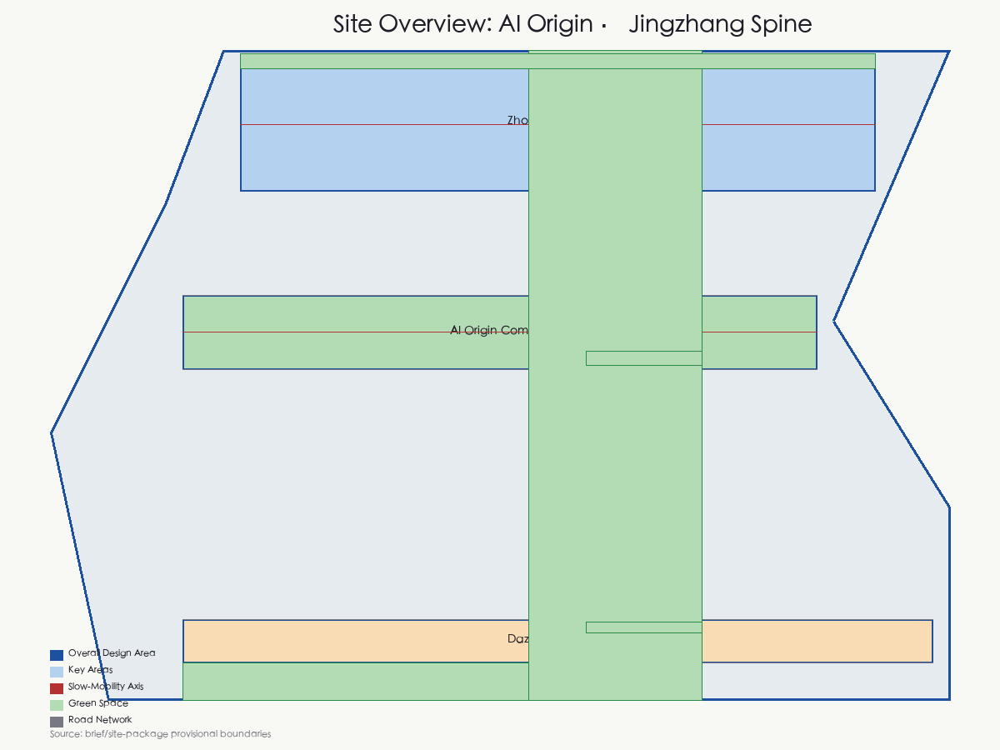
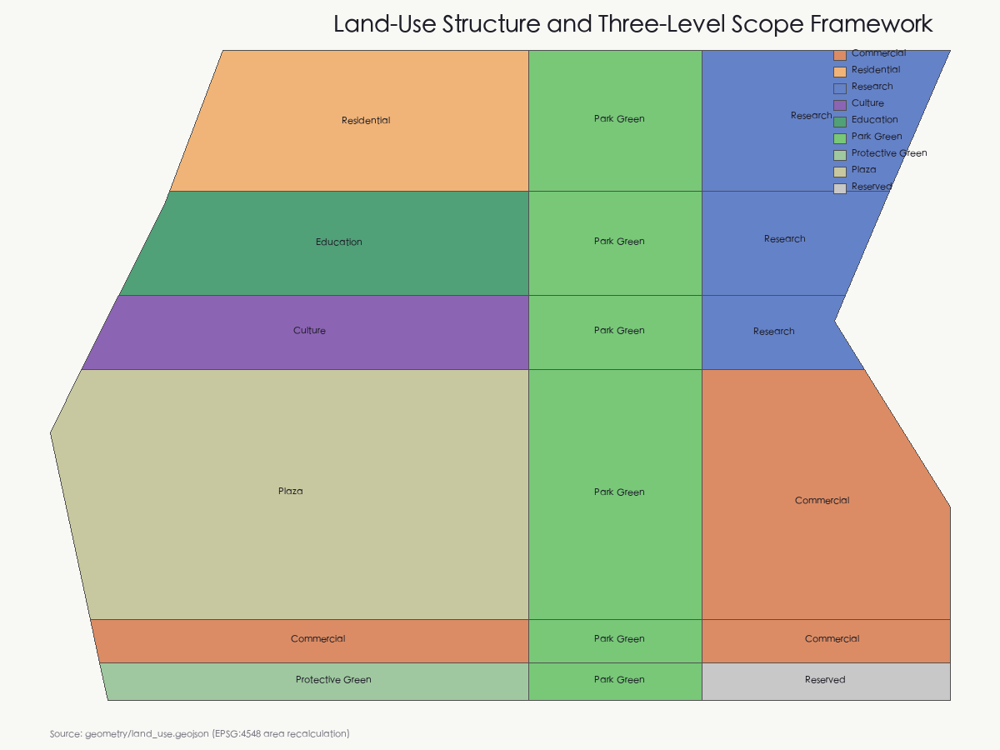
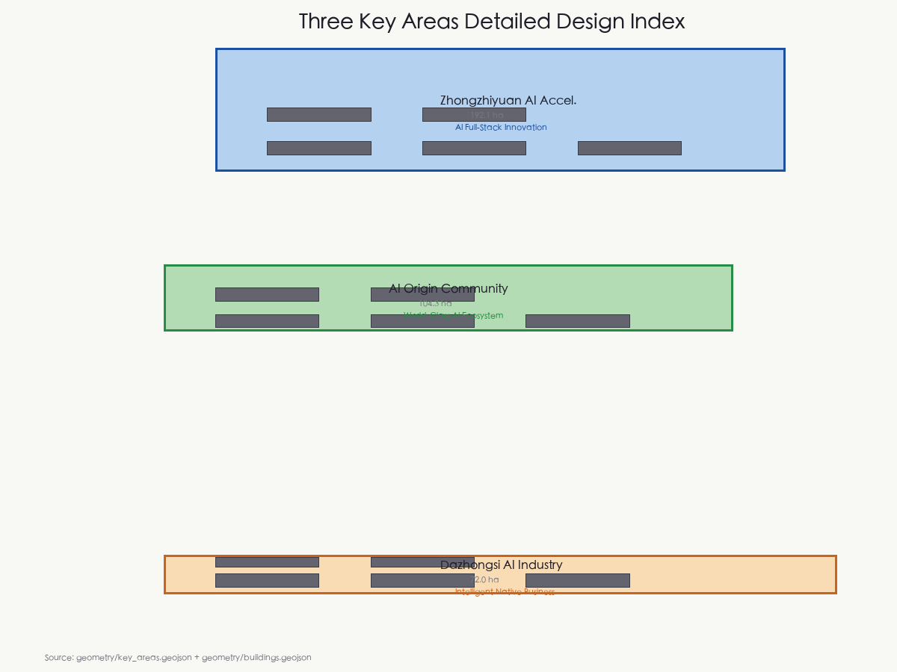
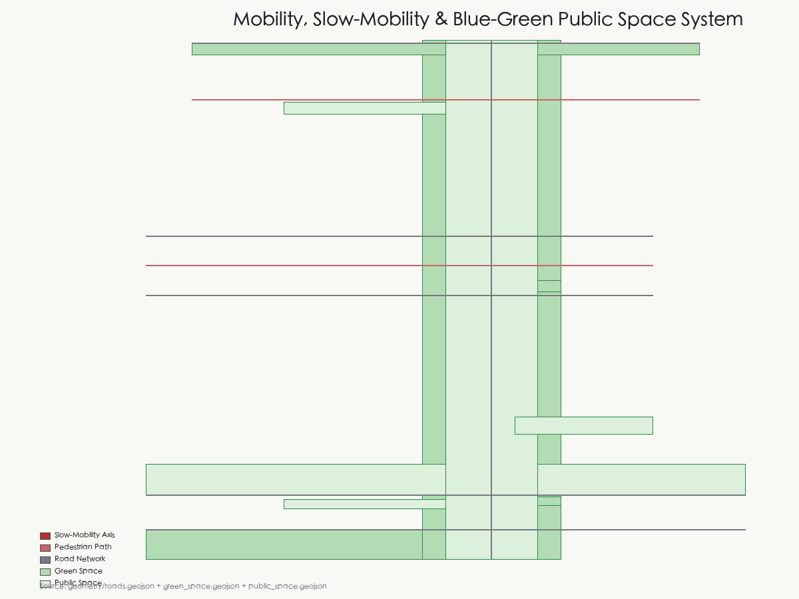
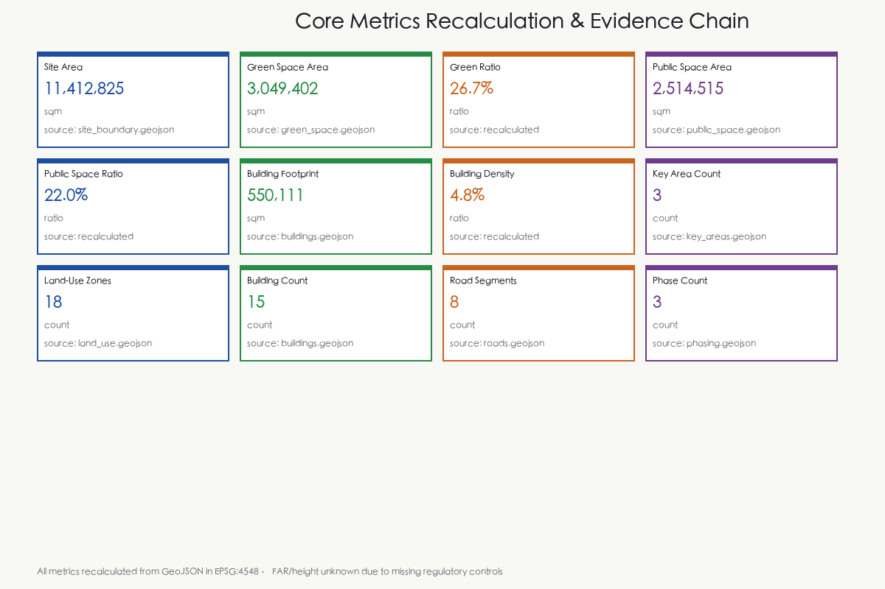

# Jingzhang AI Heritage Spine: A Century-Old Railway Corridor Reborn as an Intelligent City

## Design Basis and Source Inventory

This proposal is primarily based on the "Centennial Jingzhang AI Innovation Belt Urban Design International Open Call Prequalification Announcement" published by the Haidian Branch of the Beijing Municipal Planning and Natural Resources Commission [source:OFFICIAL-ANNOUNCEMENT], supplemented by the agent-facing taskbook excerpt [source:AGENT-TASKBOOK]. The proposal references the provisional boundaries, key areas, enumerations, metrics, and source inventories registered in `brief/site-package/` as machine-readable evidence [source:SITE-PACKAGE].

The site extends from the North Fifth Ring Road in the north to the Beijing-Zhangjiakou Expressway in the east, Xizhimen Outer Street in the south, and Wanquanhe Road in the west. The coordinated research area covers approximately 43.6 km², the overall design area approximately 11.4 km², and the key detailed design area approximately 368.4 hectares. The three key areas from north to south are the Zhongzhiyuan AI Self-Innovation Acceleration Area (approx. 192.1 ha), Beijing AI Origin Community (approx. 104.3 ha), and Dazhongsi AI Industry Cluster (approx. 72.0 ha) [data:geometry/site_boundary.geojson#SITE-001] [data:geometry/key_areas.geojson#zhongzhiyuan_ai_acceleration_area].

**Provisional Boundary Statement:** The site boundaries used in this proposal are provisional rough boundaries (provisional boundary), derived from the announcement's textual descriptions and area constraints [source:BOUNDARY-SOURCE]. These boundaries must not be used as official redlines, approval bases, or precise area calculation bases. When official precise boundaries are published, all layer areas and metrics must be recalculated.

All spatial recommendations are conceptual suggestions, reference schemes, or materials for professional teams to deepen—they do not replace formal planning and do not constitute government-approved conclusions [standard:PROJECT-AGENT-OPEN-CALL-TASKBOOK].

## Three-Level Scope Framework

### Coordinated Research Area (approx. 43.6 km²)

The coordinated research area covers the Jingzhang Railway corridor and surrounding areas in Haidian District. The work objective is to study the industrial synergy, regional linkage, and future urban forms of a world-class AI innovation ecosystem. This level focuses on strategic research, industry mapping, and innovation network analysis, without involving specific spatial design [source:OFFICIAL-ANNOUNCEMENT].

### Overall Design Area (approx. 11.4 km²)

The overall design area encompasses the urban and industrial areas within 1-2 km of the Jingzhang Heritage Park. The work objective is to reach the urban design depth of regulatory detailed planning. This level requires clear spatial structure, land-use layout, functional proportions, public space systems, transportation organization, and municipal capacity [data:geometry/site_boundary.geojson#SITE-001].

The proposal establishes a "One Spine, Three Zones, Two Wings" spatial structure within the overall design area:

- **One Spine**: Jingzhang Heritage Park slow-mobility main axis, running approximately 9 km north-south, stitching together urban functions on both sides
- **Three Zones**: Zhongzhiyuan AI Acceleration Area (north), AI Origin Community (center), Dazhongsi Industry Cluster (south)
- **Two Wings**: Zhongguancun Technology Service Wing (east) and Xiaoyuehe Scenario Empowerment Wing (west)

[metric:site_area_sqm] [depth:land_use_layout]

### Key Detailed Design Area (approx. 368.4 hectares)

The key detailed design area conducts refined design for the three key areas. The work objective is to reach the urban design depth of comprehensive planning implementation. Each key area must form a complete sub-proposal covering "positioning + spatial structure + building renewal + traffic/slow-mobility + public space + AI scenarios + implementation risks" [data:geometry/key_areas.geojson].

## Coordinated Research Area: Industry and Future City Research

### Overall Concept and Naming System

The proposal introduces "AI Origin · Jingzhang Spine" as the overall concept name. "AI Origin" echoes the core positioning of the Beijing AI Origin Community, symbolizing the origin of urban innovation in the AI era; "Jingzhang Spine" echoes the historical and cultural spine of the century-old Jingzhang Railway, symbolizing an urban axis connecting past and future [source:AGENT-TASKBOOK].

The naming system includes: the main name "AI Origin · Jingzhang Spine"; the three zones named "Zhongzhi Acceleration," "Origin Community," and "Dazhongsi AI Valley"; the two wings named "Zhongguancun Service Wing" and "Xiaoyuehe Scenario Wing."

The logo direction uses the Jingzhang Railway track gauge as a visual motif, fused with AI neural network node graphics, forming a "rail + neural network" dual-layer overlay symbol. The primary colors are deep blue (innovation) and ochre (heritage), accented with bright cyan (AI vitality) [standard:PROJECT-OFFICIAL-ANNOUNCEMENT].

### Three Orientations, Five Functions, and Three-Zone Two-Wing Synergy

The three orientations are: Centennial Jingzhang Cultural Belt, Urban AI Life Experience Belt, and AI Convergence Innovation Belt [source:AGENT-TASKBOOK]. The five functions are: AI Full-Stack Self-Innovation System, World-Class AI Innovation Ecosystem, AI+ Scenario Empowerment New Paradigm, Intelligent AI Vitality City, and AI Governance Global Voice.

The core logic of the three-zone two-wing synergy loop: Zhongzhiyuan Acceleration Area is responsible for AI full-stack self-innovation and technology verification; AI Origin Community for innovation ecosystem cultivation and talent agglomeration; Dazhongsi Industry Cluster for industrial transformation and commercial application; Zhongguancun Service Wing for capital, IP, and internationalization factor allocation; Xiaoyuehe Scenario Wing for scenario testing and urban experience [source:AGENT-TASKBOOK].

### Global AI Innovation Ecosystem Case Studies

The following 6 global cases provide spatial and operational references for the proposal [source:AGENT-TASKBOOK]:

1. **Silicon Valley Sand Hill Road**: Venture capital agglomeration model, inspiring the capital empowerment mechanism of the Zhongguancun Service Wing
2. **London King's Cross**: Railway heritage regeneration model, inspiring the vitality activation strategy of Jingzhang Heritage Park
3. **Seoul DMC (Digital Media City)**: Digital content industry agglomeration, inspiring the business format organization of Dazhongsi Industry Area
4. **Singapore One-North**: Industry-academia-research integrated park, inspiring the innovation ecosystem of Zhongzhiyuan Acceleration Area
5. **Tokyo Shibuya**: AI+commercial experience, inspiring Dazhongsi smart consumption scenario design
6. **Amsterdam Science Park**: Open innovation community, inspiring the shared space system of AI Origin Community

## Overall Design Area: Urban Renewal and Regulatory-Plan-Depth Urban Design

### Spatial Structure

The spatial structure of the overall design area is "One Spine, Three Zones, Two Wings, Multiple Nodes." The "One Spine" is the Jingzhang Heritage Park slow-mobility main axis, the core pedestrian and cycling corridor connecting the three zones [data:geometry/roads.geojson#RD-001]. The "Three Zones" are the three key areas. The "Two Wings" are the Zhongguancun Service Wing and Xiaoyuehe Scenario Wing. The "Multiple Nodes" include AI Origin Plaza, Zhongzhiyuan Innovation Exchange Plaza, Dazhongsi AI Experience Plaza, and other public space nodes [data:geometry/public_space.geojson].

### Land-Use Layout

The proposal divides the overall design area into 10 land-use types, covering research, culture, education, residential, commercial, park green space, protective green space, plaza, and reserved land [data:geometry/land_use.geojson]. The core logic of the land-use layout is to use the Jingzhang Heritage Park green spine as the central axis [data:geometry/land_use.geojson#LU-004], with research, education, and residential functions on both sides, and commercial service functions concentrated in the south [depth:land_use_layout].

Land-use areas are recalculated from the geometry files [metric:site_area_sqm]. Green space and public space together account for approximately 48.8%, reflecting a people-oriented, innovation-interaction-prioritized spatial allocation strategy [metric:green_ratio] [metric:public_space_ratio].

### Urban Renewal Strategy

The renewal strategy adopts a "retain-renovate-new" classification. Historical Jingzhang Railway remnants and surrounding mature communities are retained; inefficient industrial spaces and old commercial facilities are renovated into AI innovation carriers; AI computing infrastructure, scenario testing platforms, and talent communities are newly built. All retain-renovate-demolish classifications are conceptual suggestions requiring professional deepening after regulatory conditions and ownership are confirmed [assumption:A-CONTROLS-001].

## Key Area Detailed Design

### Zhongzhiyuan AI Self-Innovation Acceleration Area (approx. 192.1 ha)

**Positioning:** Core area of the AI full-stack self-innovation system, focusing on AI basic research, computing infrastructure, and self-innovation acceleration.

**Spatial Structure:** "Research Core + Incubation Ring + Exchange Belt." The research core contains 3 AI research center buildings [data:geometry/buildings.geojson#BLD-001] [data:geometry/buildings.geojson#BLD-002] [data:geometry/buildings.geojson#BLD-003]; the incubation ring contains an innovation incubation building and talent exchange center [data:geometry/buildings.geojson#BLD-004] [data:geometry/buildings.geojson#BLD-005]; the exchange belt centers on the Zhongzhiyuan Innovation Exchange Plaza [data:geometry/public_space.geojson#PS-002].

**AI Scenarios:** AI+research, AI+computing scheduling, AI+achievement transformation, corresponding to the accelerator function in the three-zone two-wing system.

**Implementation Risks:** This area involves existing Qinghe River and North Fifth Ring Road surroundings; water conservancy and traffic control conditions need confirmation [assumption:A-CONTROLS-001].

### Beijing AI Origin Community (approx. 104.3 ha)

**Positioning:** World-class AI innovation ecosystem cultivation area and talent community, focusing on innovation ecology, talent living, and scenario testing.

**Spatial Structure:** "Innovation Center + Experience Pavilion + Talent Apartment + Co-working + Scenario Lab" five-function cluster [data:geometry/buildings.geojson#BLD-006]. The center contains the AI Origin Community Innovation Center and Experience Pavilion [data:geometry/buildings.geojson#BLD-007], surrounded by talent apartments and co-working spaces [data:geometry/buildings.geojson#BLD-008] [data:geometry/buildings.geojson#BLD-009].

**AI Scenarios:** AI+education, AI+healthcare, AI+life services, forming an experienceable AI living community.

**Implementation Risks:** This area involves Wudaokou and Qinghua East Road West surroundings; rail transit control and university coordination conditions need confirmation.

### Dazhongsi AI Industry Cluster (approx. 72.0 ha)

**Positioning:** Intelligent native new business format cluster, focusing on AI industry transformation, commercial application, and smart consumption.

**Spatial Structure:** "Industry Building + Experience Center + Exhibition Center + Incubator" four-function cluster [data:geometry/buildings.geojson#BLD-011]. Two AI industry buildings [data:geometry/buildings.geojson#BLD-011] [data:geometry/buildings.geojson#BLD-012], an AI Commercial Experience Center [data:geometry/buildings.geojson#BLD-013], and a Smart Consumption Exhibition Center [data:geometry/buildings.geojson#BLD-014].

**AI Scenarios:** AI+commerce, AI+legal services, AI+business services, integrated with Dazhongsi Station TOD design.

**Implementation Risks:** This area involves commercial renewal around Dazhongsi Station; land ownership and commercial operation conditions need confirmation.

## AI Innovation Ecosystem, Personas, and AI+ Scenarios

### User Personas (5 types)

1. **AI Researcher**: Needs computing power, data, and quiet research environment; active in Zhongzhiyuan Acceleration Area
2. **AI Entrepreneur**: Needs incubation space, investment connections, and scenario testing; active in AI Origin Community
3. **AI Engineer**: Needs commute convenience, technical exchange, and quality living; active across three zones
4. **Community Resident**: Needs convenient services, safe environment, and public space; active in residential support areas
5. **Visitor/Experiencer**: Needs perceivable AI experiences, cultural tours, and consumption scenarios; active in public spaces and commercial areas

### AI Scenario Cards (12)

The following scenario cards map to spatial locations, service targets, operational data, privacy boundaries, and operational mechanisms [source:AGENT-TASKBOOK]:

| ID | Scenario Name | Spatial Location | Service Target | Privacy Boundary |
|----|---------------|-----------------|----------------|-----------------|
| SC-01 | AI Traffic Walkability Assessment | Jingzhang Heritage Park slow-mobility axis | Residents, students, tourists | Anonymized pedestrian flow data |
| SC-02 | AI Health Service Navigation | AI Origin Community | Community residents | Manual review of diagnosis |
| SC-03 | AI Education Assistant | AI Origin Community | Students, teachers | Desensitized learning data |
| SC-04 | AI Enterprise Service Assistant | Zhongguancun Service Wing | Enterprises, entrepreneurs | Commercial data confidential |
| SC-05 | AI Cultural Guide | Jingzhang Railway Memory Corridor | Tourists, visitors | No personal data collection |
| SC-06 | Robot Low-Speed Delivery | Dazhongsi Industry Area | Enterprises, residents | Route data public |
| SC-07 | AI Public Safety Review | Three-zone public spaces | City managers | Manual review of decisions |
| SC-08 | AI Scenario Testing Platform | AI Scenario Testing Public Space | Entrepreneurs, researchers | Isolated test data |
| SC-09 | AI Smart Consumption | Dazhongsi Experience Center | Consumers | Desensitized preferences |
| SC-10 | AI Computing Scheduling | Zhongzhiyuan Computing Center | Researchers, enterprises | Usage data public |
| SC-11 | AI Community Governance | AI Origin Community | Community residents | Transparent governance |
| SC-12 | AI International Communication | Three-zone landmark nodes | International visitors | Manual content review |

Among these, SC-06, SC-08, and SC-10 are AI industry testing and verification scenarios [source:AGENT-TASKBOOK].

## Land Use, Building Scale, and Renewal Strategy

### Land-Use Area Recalculation

Land-use areas are recalculated from `geometry/land_use.geojson` in EPSG:4548 [data:geometry/land_use.geojson]. The total area is approximately 11.41 km², consistent with the announced approximately 11.4 km² [metric:site_area_sqm].

### Building Scale

The proposal places 15 concept buildings with a total building footprint of approximately 550,000 m² [data:geometry/buildings.geojson] [metric:building_footprint_area_sqm]. Building density is approximately 4.8%, reflecting a low-density, high-quality innovation community character [metric:building_density].

**Regulatory Conditions Statement:** Floor area ratio, building height, building density, and other statutory control indicators are uniformly recorded as `status=unknown` due to the absence of official regulatory conditions [assumption:A-CONTROLS-001]. The concept volumes provided in this proposal are design suggestion quantities and do not equal statutory control values.

## Transportation, Rail Transit, Municipal and Public Service Facilities

### Road Micro-Circulation and Slow-Mobility System

The proposal centers on the Jingzhang Heritage Park slow-mobility main axis [data:geometry/roads.geojson#RD-001], building a three-level slow-mobility network of "main axis + ring roads + lateral connections." The main axis runs approximately 9 km north-south, connecting the three zones; each zone has east-west slow-mobility connections [data:geometry/roads.geojson#RD-007] [data:geometry/roads.geojson#RD-008].

### Rail Station Integration

The three zones rely on Line 13, Line 15, and Changping Line stations respectively, achieving seamless connections between rail transit and the slow-mobility system. Specific station integration design requires deepening after rail transit control conditions are confirmed [assumption:A-CONTROLS-001].

### New Infrastructure

The proposal proposes a distributed AI computing network, with an AI computing infrastructure center in Zhongzhiyuan [data:geometry/buildings.geojson#BLD-003] and edge computing nodes in each key area, forming a two-level "central computing + edge inference" system.

## Blue-Green Space, Public Space, and Urban Character

### Jingzhang Heritage Park Vitality Belt

The Jingzhang Heritage Park green spine is the core public space of the proposal [data:geometry/green_space.geojson#GS-001] [data:geometry/land_use.geojson#LU-004]. The proposal presents an "east-west stitching, north-south connection" strategy: east-west direction stitches urban functions on both sides of the railway through slow-mobility connections; north-south direction connects the three zones through the main axis [source:AGENT-TASKBOOK].

### Blue-Green Space System

Blue-green spaces include the Jingzhang Heritage Park core green belt, protective green space, pocket parks, and ecological buffer zones [data:geometry/green_space.geojson]. Total green space area is approximately 3.05 million m², with a green ratio of approximately 26.7% [metric:green_ratio].

### AI Pilgrimage Landmarks (3)

1. **AI Origin Lighthouse**: Located at the AI Origin Community Innovation Center, symbolizing the origin light of AI innovation
2. **Jingzhang Memory Dome**: Located at the Jingzhang Railway Memory Corridor, fusing railway heritage with AI projection technology
3. **Dazhongsi AI Valley Eye**: Located at the Dazhongsi AI Experience Plaza, an AI visual interaction city landmark

All landmarks are conceptual suggestions requiring deepening after heritage protection, aviation, and landscape control conditions are confirmed [standard:MOHURD-URBAN-DESIGN-MEASURES].

## Renewal Project List, Implementation Policy, and Phasing Plan

### Phased Implementation

The proposal is implemented in three phases [data:geometry/phasing.geojson]:

- **Near-term (1-3 years)**: AI Origin Community core area construction, approx. 104.3 ha [data:geometry/phasing.geojson#PH-001]
- **Mid-term (3-5 years)**: Dazhongsi Industry Area + Jingzhang Park core section, approx. 72.0 ha [data:geometry/phasing.geojson#PH-002]
- **Long-term (5-10 years)**: Zhongzhiyuan Acceleration Area construction, approx. 192.1 ha [data:geometry/phasing.geojson#PH-003]

### Global AI Innovation Activity System

The proposal presents an annual activity system: Spring "AI Origin Forum," Summer "Jingzhang AI Marathon," Autumn "Zhongguancun AI Industry Summit," Winter "AI City Experience Festival." The activity brand uses "AI Origin" as the core IP, supported by developer community operations and scenario open operation mechanisms [source:AGENT-TASKBOOK].

All activities, investment attraction, funding, and policy arrangements are conceptual suggestions and are not expressed as confirmed government arrangements [standard:PROJECT-AGENT-OPEN-CALL-TASKBOOK].

## Indicator System, Area Recalculation, and Compliance Matrix

### Core Metrics

| Metric Name | Value | Unit | Source |
|-------------|-------|------|--------|
| Overall Design Area | 11,412,825 | sqm | geometry/site_boundary.geojson |
| Green Space Area | 3,049,402 | sqm | geometry/green_space.geojson |
| Green Ratio | 26.7% | ratio | recalculated |
| Public Space Area | 2,514,515 | sqm | geometry/public_space.geojson |
| Public Space Ratio | 22.0% | ratio | recalculated |
| Building Footprint Area | 550,111 | sqm | geometry/buildings.geojson |
| Building Density | 4.8% | ratio | recalculated |
| Key Area Count | 3 | count | geometry/key_areas.geojson |
| Land-Use Zone Count | 10 | count | geometry/land_use.geojson |
| Building Count | 15 | count | geometry/buildings.geojson |
| Road Segment Count | 8 | count | geometry/roads.geojson |
| Phase Count | 3 | count | geometry/phasing.geojson |

All areas and ratios are recalculated from GeoJSON in EPSG:4548 [source:SITE-PACKAGE]. The green ratio [metric:green_ratio] and public space ratio [metric:public_space_ratio] reflect the people-oriented spatial allocation strategy. Building density [metric:building_density] indicates a low-density innovation community. Floor area ratio, building height, and other regulatory indicators are recorded as unknown due to missing official regulatory conditions [assumption:A-CONTROLS-001]. The three key areas [metric:key_area_count] correspond to the announcement requirements.

## Risk, Copyright, and Compliance Statement

### Data Legality

All materials in this proposal come from public sources or user-provided and rights-cleared materials [source:SITE-PACKAGE] [source:SOURCE-REGISTRY]. No non-public planning documents, non-public spatial data, internal regulatory indicators, or personal privacy information were used [standard:PROJECT-AGENT-OPEN-CALL-TASKBOOK].

### Provisional Boundary Limitations

The site boundaries used in this proposal are provisional rough boundaries and must not be used as official redlines, approval bases, or precise area calculation bases [source:BOUNDARY-SOURCE]. When official precise boundaries are published, all layer areas and metrics must be recalculated.

### AI Generation Responsibility

This proposal is generated by an AI agent (ZCode Agent, based on GLM model). The author is responsible for facts, citations, copyright, and final expression. All spatial recommendations are conceptual suggestions and do not constitute government-approved conclusions [standard:GENERATIVE-AI-INTERIM-MEASURES].

### Copyright Statement

Detailed copyright statement is in `report/copyright_statement.md`.

## References

The following references are the primary public materials that influenced the design decisions in this proposal. The complete machine-readable index is in `sources.json` and the three matrix files. The core design basis comes from the official announcement [source:OFFICIAL-ANNOUNCEMENT], which defines the project's three-level scope, three key areas, and the main design task requirements. The agent-facing taskbook [source:AGENT-TASKBOOK] provides six mandatory tasks, ten co-creation principles, and the continuous participation and collaboration mechanism. The site boundary data comes from provisional rough boundaries [source:BOUNDARY-SOURCE], derived by maintainers from the announcement's textual descriptions and area constraints, and must not be used as an official redline or precise area basis. Urban design depth references the Ministry of Housing and Urban-Rural Development's "Urban Design Management Measures" [standard:MOHURD-URBAN-DESIGN-MEASURES], regulatory planning depth references the "Regulatory Detailed Planning Compilation and Approval Measures" [standard:MOHURD-CONTROL-DETAILED-PLANNING], and land-use classification references the Ministry of Natural Resources' classification guide [standard:MNR-LAND-USE-CLASSIFICATION-GUIDE]. AI-generated content follows the "Generative AI Service Management Interim Measures" [standard:GENERATIVE-AI-INTERIM-MEASURES]. The authority, timeliness, and review status of all materials are based on `data/source_registry.json` [source:SOURCE-REGISTRY]. When official precise boundaries and regulatory conditions are published, all layer areas and metrics must be recalculated, and statutory control indicators must be supplemented [assumption:A-CONTROLS-001].

1. Haidian Branch, Beijing Municipal Planning and Natural Resources Commission, "Centennial Jingzhang AI Innovation Belt Urban Design International Open Call Prequalification Announcement," May 9, 2026
2. Agent-facing open call taskbook excerpt (user-provided, cleared)
3. Ministry of Housing and Urban-Rural Development, "Urban Design Management Measures"
4. Ministry of Housing and Urban-Rural Development, "Urban and Town Regulatory Detailed Planning Compilation and Approval Measures"
5. Ministry of Natural Resources, "National Territorial Space Survey, Planning, Use Control Land and Sea Classification Guide"
6. brief/site-package/ provisional boundaries and key area data
7. data/source_registry.json public source availability registry
