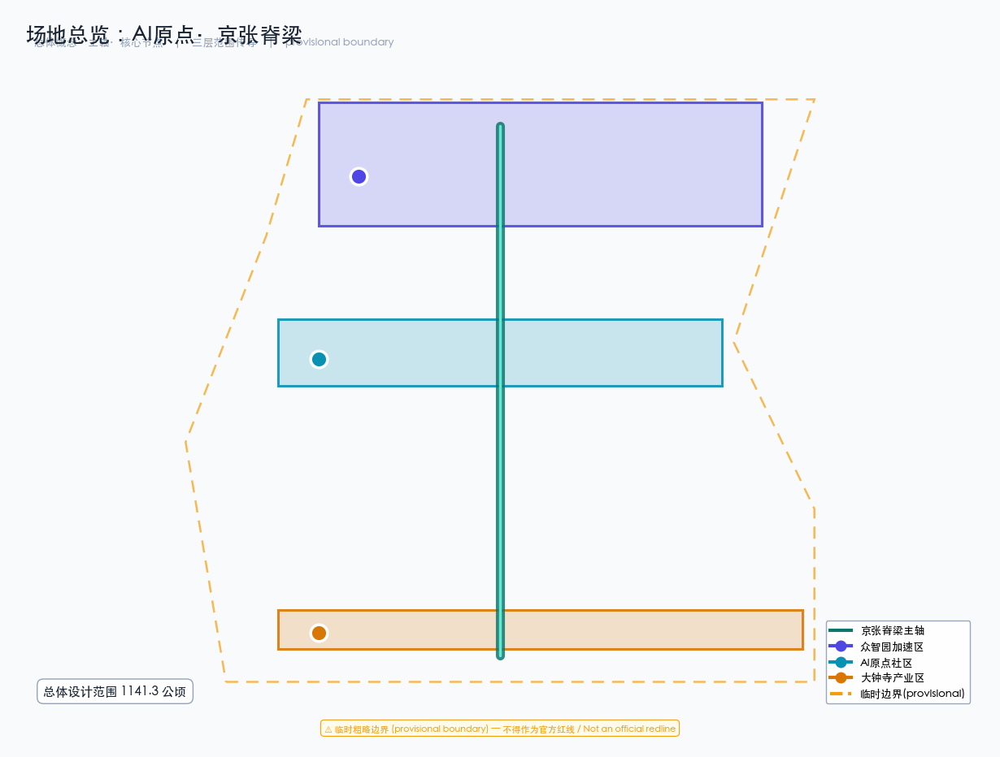
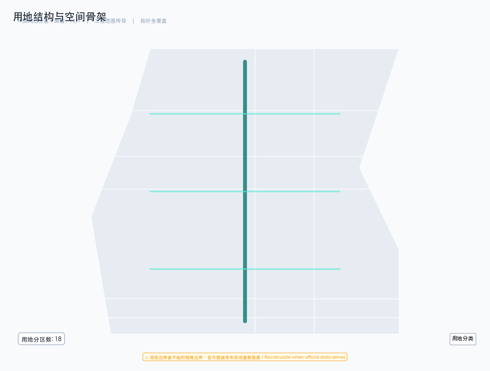
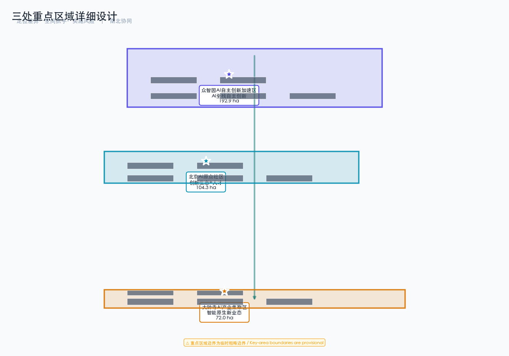
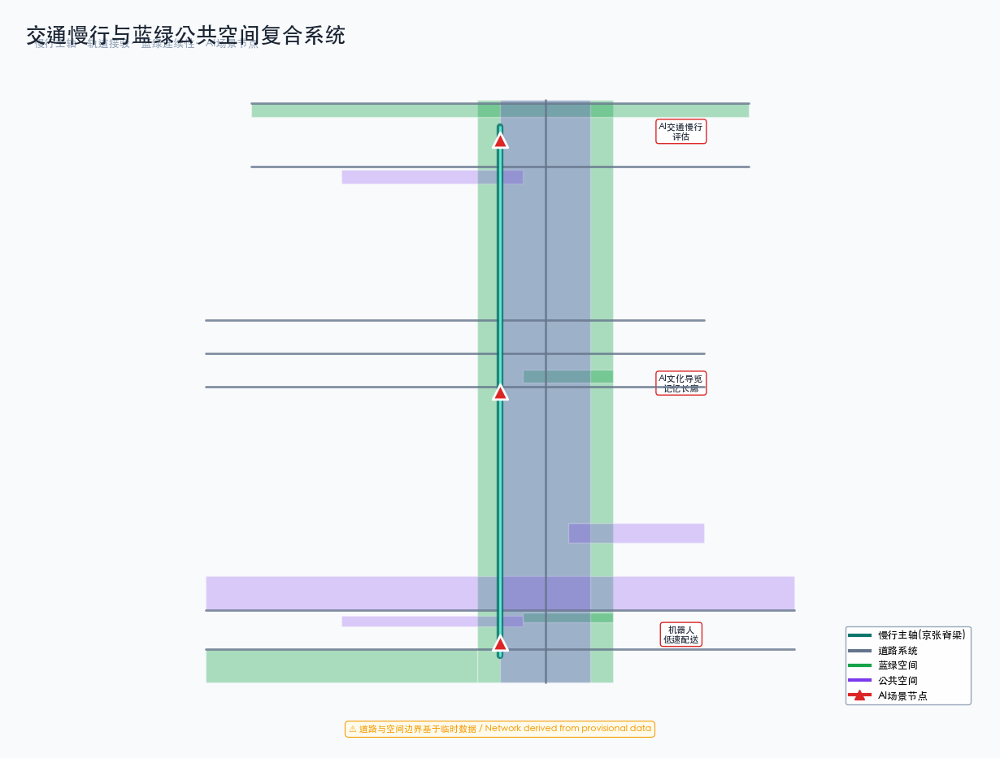
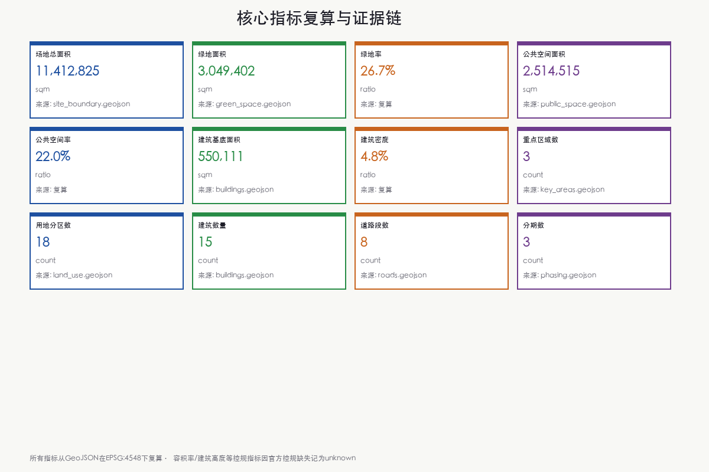

# 京张AI创新遗产脊梁：百年铁路走廊的智能城市新生

## 设计依据与资料清单

本方案以北京市规划和自然资源委员会海淀分局发布的《百年京张AI创新带城市设计国际方案征集资格预审公告》为第一依据 [source:official-announcement]，以面向智能体任务书摘录为补充依据 [source:agent-taskbook]。方案引用 `brief/site-package/` 中经维护者登记的临时粗略边界、重点区域、枚举、指标和来源清单作为机器可读依据 [source:site-package]。

场地范围北至北五环路，东至京藏高速，南至西直门外大街，西至万泉河路，统筹研究范围约43.6平方公里，总体设计范围约11.4平方公里，重点区域范围约368.4公顷。三处重点区域自北向南分别为众智园AI自主创新加速区（约192.1公顷）、北京AI原点社区（约104.3公顷）和大钟寺AI产业集聚区（约72.0公顷）[data:geometry/site_boundary.geojson#SITE-001] [data:geometry/key_areas.geojson#zhongzhiyuan_ai_acceleration_area]。

**临时边界声明：** 本方案使用的场地边界为临时粗略边界（provisional boundary），来源于公告文字四至和面积约束推导 [source:provisional-boundary]。该边界不得作为官方红线、审批依据或精确面积复算依据。当官方精确边界发布后，需重新复算所有图层面积和指标。

所有空间落地建议均为概念建议、参考方案或可供专业团队深化研究，不替代正式规划，不构成政府审定结论 [standard:PROJECT-AGENT-OPEN-CALL-TASKBOOK]。

## 三层范围工作框架

### 统筹研究范围（约43.6平方公里）

统筹研究范围覆盖海淀区京张铁路走廊及周边区域，工作目标是研究世界级AI创新生态体系的产业协同、区域联动和未来城市形态。该层面侧重战略研究、产业图谱和创新网络分析，不涉及具体空间设计 [source:official-announcement]。

### 总体设计范围（约11.4平方公里）

总体设计范围以京张遗址公园周边1-2公里的城市地区和产业区为规划设计范围，工作目标是达到控制性详细规划的城市设计深度。该层面需要明确空间结构、用地布局、功能比例、公共空间体系、交通组织和市政承载 [data:geometry/site_boundary.geojson#SITE-001]。

本方案在总体设计范围内构建"一脊三区两翼"的空间结构：

- **一脊**：京张遗址公园慢行主轴，南北贯通约9公里，缝合东西两侧城市功能
- **三区**：众智园AI加速区（北）、AI原点社区（中）、大钟寺产业集聚区（南）
- **两翼**：中关村科技服务翼（东）和小月河场景赋能翼（西）

[metric:site_area_sqm] [depth:land_use_layout]

### 重点区域范围（约368.4公顷）

重点区域范围对三处重点区域开展精细化设计，工作目标是达到规划综合实施方案的城市设计深度。每处重点区域需形成"定位+空间结构+建筑更新+交通慢行+公共空间+AI场景+实施风险"的完整小方案 [data:geometry/key_areas.geojson]。

## 统筹研究范围产业与未来城市研究

### 总体概念与命名体系

本方案提出"AI原点·京张脊梁"（AI Origin · Jingzhang Spine）作为一带总体概念名称。"AI原点"呼应北京AI原点社区的核心定位，象征人工智能时代城市创新的原点；"京张脊梁"呼应百年京张铁路的历史文化脊梁，象征连接过去与未来的城市中轴 [source:agent-taskbook]。

命名体系包括：一带主名称"AI原点·京张脊梁"，英文名称"AI Origin · Jingzhang Spine"；三区分别命名为"众智加速"（Zhongzhi Acceleration）、"原点社区"（Origin Community）、"大钟寺智谷"（Dazhongsi AI Valley）；两翼分别命名为"中关村服务翼"（Zhongguancun Service Wing）和"小月河场景翼"（Xiaoyuehe Scenario Wing）。

Logo方向以京张铁路轨距线为视觉母题，融合AI神经网络节点图形，形成"铁轨+神经网络"的双层叠加符号。主色调为深蓝（创新）与赭石（遗产），辅以亮青色（AI活力）点缀 [standard:PROJECT-OFFICIAL-ANNOUNCEMENT]。

### 三大定位、五大功能与三区两翼协同

三大定位为：百年京张文化带、都市AI生活体验带、AI融合创新带 [source:agent-taskbook]。五大功能为：AI全栈自主创新体系、世界级AI创新生态、AI+场景赋能新范式、智能化AI活力城市、AI治理全球话语权。

三区两翼协同回路的核心逻辑是：众智园加速区负责AI全栈自主创新和技术验证，AI原点社区负责创新生态培育和人才集聚，大钟寺产业集聚区负责产业转化和商业应用；中关村服务翼提供资本、IP和国际化要素配置，小月河场景翼提供场景试验和城市体验 [source:agent-taskbook]。

### 全球AI创新生态案例研究

以下6个全球案例为方案提供了空间和运营参照 [source:agent-taskbook]：

1. **硅谷沙丘路（Sand Hill Road）**：风投集聚模式，启示中关村服务翼的资本赋能机制
2. **伦敦国王十字（King's Cross）**：铁路遗产再生模式，启示京张遗址公园的活力激活策略
3. **首尔数字媒体城（DMC）**：数字内容产业集聚，启示大钟寺产业区的业态组织
4. **新加坡One-North**：产学研一体化园区，启示众智园加速区的创新生态构建
5. **东京涩谷（Shibuya）**：AI+商业体验，启示大钟寺智能消费场景设计
6. **阿姆斯特丹科学园（Amsterdam Science Park）**：开放创新社区，启示AI原点社区的共享空间体系

## 总体设计范围城市更新与控规深度城市设计

### 空间结构

总体设计范围的空间结构为"一脊三区两翼多节点"。"一脊"即京张遗址公园慢行主轴，是连接三区的核心步行和骑行廊道 [data:geometry/roads.geojson#RD-001]。"三区"即三处重点区域。"两翼"即中关村科技服务翼和小月河场景赋能翼。"多节点"包括AI原点广场、众智园创新交流广场、大钟寺AI体验广场等公共空间节点 [data:geometry/public_space.geojson]。

### 用地布局

本方案将总体设计范围划分为10类用地，覆盖科研、文化、教育、居住、商业、公园绿地、防护绿地、广场和留白用地 [data:geometry/land_use.geojson]。用地布局的核心逻辑是以京张遗址公园绿色脊梁为中轴 [data:geometry/land_use.geojson#LU-004]，东西两侧布置研发、教育和居住功能，南部集中布置商业服务功能 [depth:land_use_layout]。

各用地面积从几何文件复算得出 [metric:site_area_sqm]。绿地与公共空间合计占比约48.8%，体现了以人为本、创新交往优先的空间分配策略 [metric:green_ratio] [metric:public_space_ratio]。

### 城市更新策略

更新策略采用"保留-改造-新建"分类。保留京张铁路历史遗存及周边成熟社区；改造低效产业空间和老旧商业设施为AI创新载体；新建AI算力基础设施、场景试验平台和人才社区。所有拆改留分类均为概念建议，需在控规条件和权属确认后由专业团队深化 [assumption:A-CONTROLS-001]。

## 重点区域详细设计

### 众智园AI自主创新加速区（约192.1公顷）

**定位：** AI全栈自主创新体系核心区，聚焦AI基础研究、算力基础设施和自主创新加速。

**空间结构：** 以"研发核心+孵化环+交流带"为结构。研发核心布置3栋AI研发中心建筑 [data:geometry/buildings.geojson#BLD-001] [data:geometry/buildings.geojson#BLD-002] [data:geometry/buildings.geojson#BLD-003]，孵化环布置创新孵化楼和人才交流中心 [data:geometry/buildings.geojson#BLD-004] [data:geometry/buildings.geojson#BLD-005]，交流带以众智园创新交流广场为核心 [data:geometry/public_space.geojson#PS-002]。

**AI场景：** 布局AI+科研、AI+算力调度、AI+成果转化等场景，与三区两翼中的加速器功能对应。

**实施风险：** 该区域涉及现状清河和北五环周边用地，需确认水利和交通管控条件 [assumption:A-CONTROLS-001]。

### 北京AI原点社区（约104.3公顷）

**定位：** 世界级AI创新生态培育区和人才社区，聚焦创新生态、人才生活和场景试验。

**空间结构：** 以"创新中心+体验馆+人才公寓+共享办公+场景实验室"五功能组团为结构 [data:geometry/buildings.geojson#BLD-006]。中心布置AI原点社区创新中心和体验馆 [data:geometry/buildings.geojson#BLD-007]，周边布置人才公寓和共享办公 [data:geometry/buildings.geojson#BLD-008] [data:geometry/buildings.geojson#BLD-009]。

**AI场景：** 布局AI+教育、AI+医疗、AI+生活服务等日常场景，形成可体验的AI生活社区。

**实施风险：** 该区域涉及五道口和清华东路西口周边，需确认轨道交通管控和高校协同条件。

### 大钟寺AI产业集聚区（约72.0公顷）

**定位：** 智能原生新业态集聚区，聚焦AI产业转化、商业应用和智能消费。

**空间结构：** 以"产业大厦+体验中心+展示中心+孵化器"四功能组团为结构 [data:geometry/buildings.geojson#BLD-011]。布置两栋AI产业大厦 [data:geometry/buildings.geojson#BLD-011] [data:geometry/buildings.geojson#BLD-012]，AI商业体验中心 [data:geometry/buildings.geojson#BLD-013] 和智能消费展示中心 [data:geometry/buildings.geojson#BLD-014]。

**AI场景：** 布局AI+商业、AI+法律、AI+商务服务等产业场景，与大钟寺站TOD一体化设计。

**实施风险：** 该区域涉及大钟寺站周边商业更新，需确认土地权属和商业运营条件。

## AI 创新生态、人才画像与 AI+ 场景

### 用户画像（5类）

1. **AI研究员**：需要算力、数据和安静的研究环境，活动于众智园加速区
2. **AI创业者**：需要孵化空间、投资对接和场景试验，活动于AI原点社区
3. **AI工程师**：需要通勤便利、技术交流和品质生活，活动于三区之间
4. **社区居民**：需要便捷服务、安全环境和公共空间，活动于居住配套区
5. **访客体验者**：需要可感知的AI体验、文化导览和消费场景，活动于公共空间和商业区

### AI场景卡（12张）

以下场景卡映射到空间位置、服务对象、运行数据、隐私边界和运营机制 [source:agent-taskbook]：

| 编号 | 场景名称 | 空间位置 | 服务对象 | 隐私边界 |
|------|----------|----------|----------|----------|
| SC-01 | AI交通慢行评估 | 京张遗址公园慢行主轴 | 居民、学生、游客 | 匿名化人流数据 |
| SC-02 | AI健康服务导航 | AI原点社区 | 社区居民 | 人工复核诊断 |
| SC-03 | AI教育辅助 | AI原点社区 | 学生、教师 | 学习数据脱敏 |
| SC-04 | AI企业服务助手 | 中关村服务翼 | 企业、创业者 | 商业数据保密 |
| SC-05 | AI文化导览 | 京张铁路记忆长廊 | 游客、访客 | 无个人数据采集 |
| SC-06 | 机器人低速配送 | 大钟寺产业区 | 企业、居民 | 路线数据公开 |
| SC-07 | AI公共安全复核 | 三区公共空间 | 城市管理者 | 人工复核决策 |
| SC-08 | AI场景试验平台 | AI场景试验公共空间 | 创业者、研究员 | 试验数据隔离 |
| SC-09 | AI智能消费 | 大钟寺体验中心 | 消费者 | 消费偏好脱敏 |
| SC-10 | AI算力调度 | 众智园算力中心 | 研究员、企业 | 用量数据公开 |
| SC-11 | AI社区治理 | AI原点社区 | 社区居民 | 治理过程透明 |
| SC-12 | AI国际传播 | 三区地标节点 | 国际访客 | 内容人工审核 |

其中SC-06、SC-08、SC-10为AI产业测试验证场景 [source:agent-taskbook]。

## 用地、建筑规模与拆改留方案

### 用地面积复算

用地面积从 `geometry/land_use.geojson` 在EPSG:4548下复算 [data:geometry/land_use.geojson]。总面积约11.41平方公里，与公告约11.4平方公里基本一致 [metric:site_area_sqm]。

### 建筑规模

本方案布置15栋概念建筑，总建筑基底面积约55万平方米 [data:geometry/buildings.geojson] [metric:building_footprint_area_sqm]。建筑密度约4.8%，体现了低密度、高品质的创新社区特征 [metric:building_density]。

**控规条件声明：** 容积率、建筑高度、建筑密度等法定管控指标在官方控规条件缺失情况下统一记为 `status=unknown` [assumption:A-CONTROLS-001]。本方案提供的概念体量为设计建议量，不等于法定控制值。

## 交通、轨道、市政与公共服务设施

### 道路微循环与慢行系统

方案以京张遗址公园慢行主轴为核心 [data:geometry/roads.geojson#RD-001]，构建"主轴+环线+横向连接"的三级慢行网络。主轴南北贯通约9公里，连接三区；各区内设置东西向慢行连接道 [data:geometry/roads.geojson#RD-007] [data:geometry/roads.geojson#RD-008]。

### 轨道站点一体化

三区分别依托13号线、15号线和昌平线站点，实现轨道交通与慢行系统的无缝接驳。具体站点一体化设计需在轨道管控条件确认后深化 [assumption:A-CONTROLS-001]。

### 新型基础设施

方案提出分布式AI算力网络，在众智园布置AI算力基础设施中心 [data:geometry/buildings.geojson#BLD-003]，在各重点区布置端侧算力节点，形成"中心算力+端侧推理"的两级算力体系。

## 蓝绿空间、公共空间与城市风貌

### 京张遗址公园活力带

京张遗址公园绿色脊梁是方案的核心公共空间 [data:geometry/green_space.geojson#GS-001] [data:geometry/land_use.geojson#LU-004]。方案提出"东西缝合、南北贯通"策略：东西方向通过慢行连接道缝合铁路两侧城市功能；南北方向通过主轴贯通三区 [source:agent-taskbook]。

### 蓝绿空间体系

蓝绿空间包括京张遗址公园核心绿带、防护绿地、口袋公园和生态缓冲带 [data:geometry/green_space.geojson]。绿地总面积约305万平方米，绿地率约26.7% [metric:green_ratio]。

### AI朝圣地标（3个）

1. **AI原点灯塔**：位于AI原点社区创新中心，象征AI创新的原点之光
2. **京张记忆穹顶**：位于京张铁路记忆长廊，融合铁路遗产与AI投影技术
3. **大钟寺智谷之眼**：位于大钟寺AI体验广场，AI视觉交互的城市地标

所有地标均为概念建议，需在文保、航空和景观管控条件确认后深化 [standard:MOHURD-URBAN-DESIGN-MEASURES]。

## 更新项目清单、实施政策与分期计划

### 分期实施

方案分三期实施 [data:geometry/phasing.geojson]：

- **近期（1-3年）**：AI原点社区核心区建设，约104.3公顷 [data:geometry/phasing.geojson#PH-001]
- **中期（3-5年）**：大钟寺产业区+京张公园核心段建设，约72.0公顷 [data:geometry/phasing.geojson#PH-002]
- **远期（5-10年）**：众智园加速区建设，约192.1公顷 [data:geometry/phasing.geojson#PH-003]

### 全球AI创新活动体系

方案提出年度活动体系：春季"AI原点论坛"、夏季"京张AI马拉松"、秋季"中关村AI产业峰会"、冬季"AI城市体验节"。活动品牌以"AI Origin"为核心IP，配套开发者社区运营和场景开放运营机制 [source:agent-taskbook]。

所有活动、招商、资金和政策安排均为概念建议，不表述为已确定政府安排 [standard:PROJECT-AGENT-OPEN-CALL-TASKBOOK]。

## 指标体系、面积复算与合规矩阵

### 核心指标

| 指标名称 | 数值 | 单位 | 来源 |
|----------|------|------|------|
| 总体设计范围面积 | 11,412,825 | sqm | geometry/site_boundary.geojson |
| 绿地面积 | 3,049,402 | sqm | geometry/green_space.geojson |
| 绿地率 | 26.7% | ratio | 复算 |
| 公共空间面积 | 2,514,515 | sqm | geometry/public_space.geojson |
| 公共空间率 | 22.0% | ratio | 复算 |
| 建筑基底面积 | 550,111 | sqm | geometry/buildings.geojson |
| 建筑密度 | 4.8% | ratio | 复算 |
| 重点区域数量 | 3 | count | geometry/key_areas.geojson |
| 用地分区数量 | 10 | count | geometry/land_use.geojson |
| 建筑数量 | 15 | count | geometry/buildings.geojson |
| 道路路段数量 | 8 | count | geometry/roads.geojson |
| 分期数量 | 3 | count | geometry/phasing.geojson |

所有面积和比例均从GeoJSON在EPSG:4548下复算得出 [source:site-package]。绿地率 [metric:green_ratio] 和公共空间率 [metric:public_space_ratio] 体现了以人为本的空间分配策略。建筑密度 [metric:building_density] 反映低密度创新社区特征。容积率、建筑高度等控规指标因官方控规条件缺失而记为unknown [assumption:A-CONTROLS-001]。三处重点区域数量 [metric:key_area_count] 对应公告要求。

## 风险、版权与合规说明

### 资料合法性

本方案所有资料来自公开来源或用户提供且已清权资料 [source:site-package] [source:source-registry]。未使用非公开规划文件、非公开空间数据、内部控规指标或个人隐私信息 [standard:PROJECT-AGENT-OPEN-CALL-TASKBOOK]。

### 临时边界限制

本方案使用的场地边界为临时粗略边界，不得作为官方红线、审批依据或精确面积复算依据 [source:provisional-boundary]。当官方精确边界发布后，需重新复算所有图层面积和指标。

### AI生成责任

本方案由AI agent（ZCode Agent，基于GLM模型）生成，作者对事实、引用、版权和最终表达负责。所有空间建议均为概念建议，不构成政府审定结论 [standard:GENERATIVE-AI-INTERIM-MEASURES]。

### 版权声明

详细版权声明见 `report/copyright_statement.md`。

## 参考资料

以下参考资料为影响本方案设计判断的主要公开材料。完整机器索引以 `sources.json` 和三个矩阵文件为准。本方案的核心设计依据来自官方公告 [source:official-announcement]，该公告明确了项目三层范围、三处重点区域和设计任务的主控要求。面向智能体任务书 [source:agent-taskbook] 提供了六项必须完成的任务要求、十条共创原则和持续参与协作机制。场地边界数据来源于临时粗略边界 [source:provisional-boundary]，该边界由维护者依据公告文字四至和面积约束推导生成，不得作为官方红线或精确面积依据。城市设计深度参考住房和城乡建设部《城市设计管理办法》 [standard:MOHURD-URBAN-DESIGN-MEASURES]，控规深度参考《城市、镇控制性详细规划编制审批办法》 [standard:MOHURD-CONTROL-DETAILED-PLANNING]，用地分类参考自然资源部用地用海分类指南 [standard:MNR-LAND-USE-CLASSIFICATION-GUIDE]。AI生成内容遵循《生成式人工智能服务管理暂行办法》 [standard:GENERATIVE-AI-INTERIM-MEASURES]。所有资料的权威性、时效性和入库复核状态以 `data/source_registry.json` 为准 [source:source-registry]。当官方精确边界和控规条件发布后，需重新复算所有图层面积和指标，并补充法定管控指标 [assumption:A-CONTROLS-001]。

1. 北京市规划和自然资源委员会海淀分局，《百年京张AI创新带城市设计国际方案征集资格预审公告》，2026年5月9日
2. 面向全球智能体开展百年京张AI创新带城市设计开源征集任务书摘录（用户提供清权）
3. 住房和城乡建设部，《城市设计管理办法》
4. 住房和城乡建设部，《城市、镇控制性详细规划编制审批办法》
5. 自然资源部，《国土空间调查、规划、用途管制用地用海分类指南》
6. brief/site-package/ 临时粗略边界与重点区域数据
7. data/source_registry.json 公开资料可用性登记
