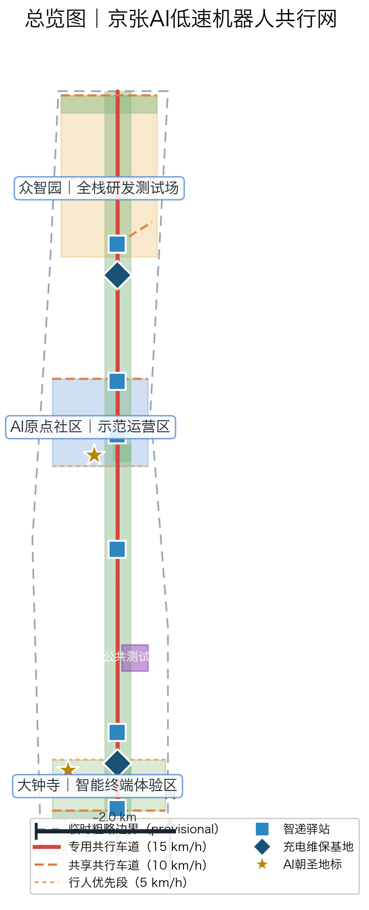
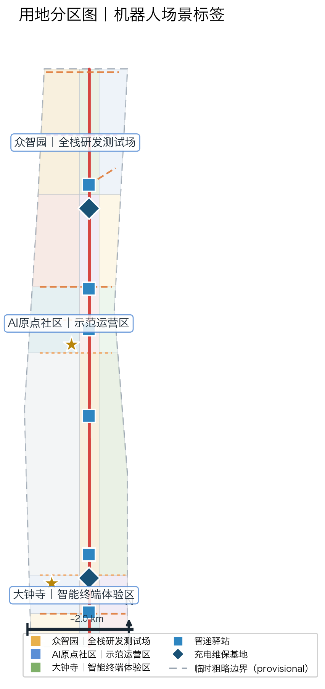
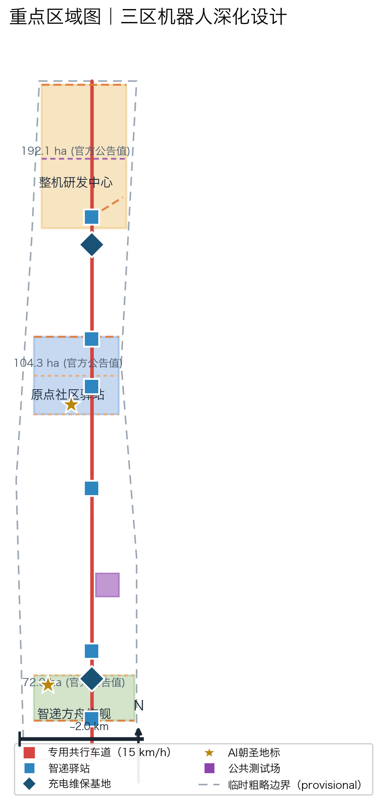
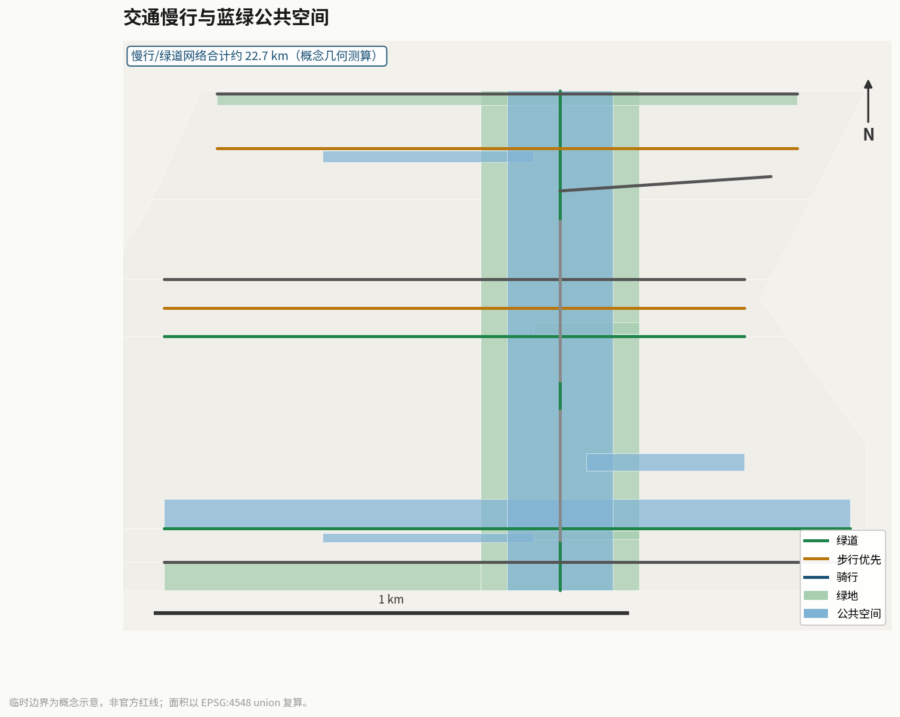
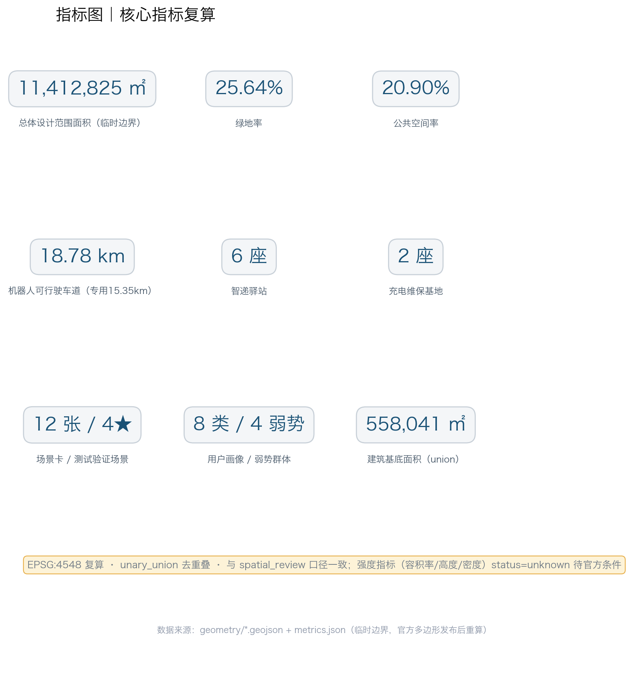

# Jingzhang AI Low-Speed Robot Co-Mobility Network: A New Smart-City Spine for Human-Robot Co-Mobility

For low-speed robots to safely enter open urban space, what they need is not a permit checklist but a **readable and writable grammar of street cross-sections**. Just as railway gauge determines which trains can run on which line, the street cross-section prototype determines where a robot may coexist with pedestrians, and at what speed. This proposal advances the **Co-Mobility Cross-Section Grammar**: four cross-section types — the dedicated segment (2.5m, physically separated), the shared segment (shared plane, visual guidance), the pedestrian-priority segment (shared plane, heritage paving that follows the flow), and the test walkway (2.0m, temporary separation) — are not merely differences in lane width; they are **spatial contracts**, encoding who yields, at what speed, under what conditions, and with what fallback. The conflict test field is the venue where any new cross-section prototype must pass validation before deployment. The Co-Mobility License (inspired by the BASE/BOOST/BLACKOUT/BEQUEST contract framework of jingzhang-168) is the governance implementation layer that signs these spatial contracts into operating behavior [E:ROBOT-V3-CROSS-SECTION-GRAMMAR].

**Non-claim statement.** This proposal has conducted no site visits, no household interviews, no delivery OD surveys, and no pedestrian counts; all content is conceptual design advice based on public announcements, the taskbook, and open data, and constitutes neither government-approved conclusions, nor implementation commitments, nor the designation of any vendor [source:official-announcement]. Metrics marked `unknown` are directional placeholders, to be completed once official data and professional-team development are available.

**Iteration note.** This proposal is the third iteration: v1 (68/100) established the spatial structure of "one corridor, four branches, six stations, two depots"; v2 (75/100) introduced the Co-Mobility License protocol, but its organizing concept was borrowed from jingzhang-168; v3 elevates the original cross-section grammar to the organizing concept, demotes the Co-Mobility License to the governance implementation layer, and records the full iteration lessons in the risk section.

## Design Basis and Source List

This proposal takes the "Pre-qualification Announcement for the International Design Solicitation of the Centennial Jingzhang AI Innovation Belt Urban Design," issued by the Haidian Branch of the Beijing Municipal Commission of Planning and Natural Resources, as its first authoritative basis [source:official-announcement]; the agent-facing taskbook excerpts as supplementary basis [source:agent-taskbook]; and the maintainer-registered provisional rough boundaries, key areas, enumerations, metrics, and source lists in `brief/site-package/` as machine-readable basis [source:site-package-registry]. The proposal focuses on the two tracks `robotics-autonomous-mobility` and `ai-origin-community`, corresponding to the two scenarios `robot-delivery-low-speed` and `ai-traffic-walkability`. The core contribution of v3 is the **Co-Mobility Cross-Section Grammar** [E:ROBOT-V3-CROSS-SECTION-GRAMMAR] — translating the safety problem of human-robot co-mobility into a problem of street cross-section geometry and materials, so that the answers to "who yields, how fast, under what conditions" can be read directly from cross-section drawings rather than remaining buried in abstract operating manuals. The Co-Mobility License protocol [E:ROBOT-V2-LICENSE-PROTOCOL] is positioned in v3 as the governance implementation layer, responsible for signing the cross-section grammar into executable operating contracts.

All design judgments are decomposed into traceable sources, recalculable metrics, verifiable layers, and human-reviewable assumptions. All robot co-mobility facilities (lanes, stations, charging-maintenance depots) fall into nine GeoJSON layers; core metrics are recalculated in EPSG:4548 and are consistent with the union rules of `scripts/spatial_review.py` [depth:existing_conditions_diagnosis] [depth:metrics_recalculation].

**Four-layer source-use table.** For every item of material, this proposal strictly distinguishes "can be used for" from "cannot be used for," avoiding treating inspiration as commitment and pilots as approvals:

| Source tier | Representative items | Can be used for | Cannot be used for |
| --- | --- | --- | --- |
| Statutory approvals | Solicitation announcement, taskbook, official regulatory plans | Determining scope, tracks, mandatory tasks, and review criteria | Inferring implementation commitments or funding availability |
| Official built / under construction | High-level autonomous driving demonstration zone, pilot delivery vehicles | Mechanism translation, policy-path benchmarking | Claiming the Jingzhang corridor is already included in pilots |
| Draft initiatives and international cases | Starship, Serve, local slow-mobility initiatives | Concept inspiration, mechanism reference, risk identification | Proving Jingzhang is necessarily feasible or that volumes are replicable |
| Open data and agent derivations | GeoJSON, recalculated metrics, scenario cards | Internal consistency of spatial structure and recalculable metrics | Replacing official approval or measured operating data |

**Provisional boundary and concept-proposal attributes.** This package is generated using provisional rough boundaries with `geometry_role="provisional_constraint"` and `official_boundary=false` [data:geometry/site_boundary.geojson#SITE-001]; this organizer data gap does not block content scoring, and a full recalculation is required once the official polygon is published. All cross-section parameters, lane alignments, station siting, phasing, and operating mechanisms are stated as "concept proposals / reference schemes / available for professional-team development," and constitute no implementation commitment. The machine-readable schema of the Co-Mobility License protocol is at `visual/assets/co-mobility-license.schema.json`, and the tabletop simulation script at `visual/assets/run_license_tabletop.js`; the two only prove the protocol's internal logical consistency, not that it has been signed by any party or authorized to operate.

### Existing Conditions Diagnosis and Problem Baseline

The robot co-mobility network is not groundless technical imagination, but a spatial response to three verifiable real-world problems [depth:existing_conditions_diagnosis]:

1. **High last-mile delivery costs.** Public industry data show that the "last mile" of urban delivery has long accounted for 30%–50% of total logistics cost, and the human-rider model faces sustained pressure amid population aging and rising labor costs [source:jd-smart-delivery-vehicle]. Along the Jingzhang corridor, universities, campuses, and communities offer high order density and regular routes — natural conditions for scaled low-speed robot pilots.
2. **Frequent last-mile traffic conflicts.** Conflicts caused by delivery riders riding against traffic, occupying lanes, and competing with pedestrians are a nationwide urban-governance pain point. The Co-Mobility Cross-Section Grammar translates this problem into design parameters: dedicated segments eliminate the conflict surface with physical separation; shared segments manage conflict with visual color bands and speed humps; pedestrian-priority segments minimize conflict consequences with a 5km/h speed limit — the cross-section is the safety strategy.
3. **Pickup difficulty for elderly and mobility-impaired groups.** Bulky items, heavy goods, and medicine delivery are especially hard in the "last 100 meters" for elderly and disabled residents; accessible proxy pickup and voice pickup are the starting point of this proposal's public-interest design [source:barrier-free-environment-law].

The three problems jointly point to one spatial answer: a readable, verifiable, replicable street cross-section system that lets the coexistence rules of robots and pedestrians emerge naturally from geometry and materials.

**Honest statement of data gaps.** Official delivery OD volumes, slow-mobility pedestrian baselines, and building and ownership inventories are not public; the corresponding metrics in this proposal remain `status=unknown` or are marked as directional estimates; the gap list is in `assumptions.json` and the risk section.

**Auditable methodology.** All design judgments follow a four-step auditable chain: source registration (`sources.json`) → use limitation (the four-layer source table) → spatial anchoring (GeoJSON layers) → metric recalculation (EPSG:4548 union). Any judgment that cannot be traced back through these four steps is not written into formal conclusions; every geometric parameter of the cross-section grammar is likewise registered along this chain, so that the promise of "the cross-section is the contract" can be verified item by item rather than remaining a slogan [depth:metrics_recalculation].

## Three-Level Scope Framework

The proposal is organized according to the three-level scope fixed by the announcement, and the three levels correspond to three scale levels of the cross-section grammar: the **Coordinated Research Area** (43.6 sq km provisional scope) answers "how the cross-section grammar is organized at the network scale" — which corridors need dedicated segments and which suit shared segments; the **Overall Design Area** (approx. 11.4 sq km provisional boundary) answers "how the cross-section grammar is drawn at the corridor scale" — concrete cross-section selection, speed-limit zoning, and station layout; the **Key Areas** (368.4 hectares provisional aggregate) answer "how the cross-section grammar is deepened at the intersection and parcel scale" — concrete human-robot conflict handling and spatial detail [standard:PROJECT-OFFICIAL-ANNOUNCEMENT] [source:agent-taskbook].

| Level | Grammar scale | Design question | Proposal answer | Data anchor | Must not claim before verification |
| --- | --- | --- | --- | --- | --- |
| Coordinated Research Area | Network scale | How the robot industry ecosystem and regional coordination are organized | "Triangular synergy" of Haidian R&D source — Yizhuang policy demonstration — Shunyi operations base, supported by the seven-factor ecosystem map | compliance_matrix.json, standard_matrix.json | Must not claim the triangular synergy is contracted or funded |
| Overall Design Area | Corridor scale | How the co-mobility network is drawn | "One corridor, four branches, six stations, two depots" spatial structure; four cross-section prototypes distributed along 11 co-mobility roads | [data:geometry/roads.geojson#RD-001], [data:geometry/buildings.geojson#BLD-016] | Must not claim lanes have right-of-way or buildings are built |
| Key Areas | Intersection/parcel scale | How the three areas reach detailed-design depth | Zhongzhiyuan = birthplace of the test walkway prototype; Origin Community = demonstration area for shared/pedestrian-priority segments; Dazhongsi = dedicated-segment corridor + terminal experience | [data:geometry/key_areas.geojson#zhongzhiyuan_ai_acceleration_area], [metric:key_area_count] | Must not claim area regulatory plans are adjusted or tenants have moved in |

**Taskbook crosswalk table.** The mandatory requirements of announcement 1.3/1.4/1.5 and agent.1–agent.6 are mapped item by item to proposal answers, spatial anchors, and evidence files, ensuring a closed loop of "requirement — answer — evidence" [depth:three_level_scope_framework]:

| Announcement requirement | Proposal answer | Spatial anchor | Evidence file |
| --- | --- | --- | --- |
| 1.3 Coordinated Research Area | Triangular synergy + seven-factor ecosystem map | Entire design boundary | compliance_matrix.json |
| 1.4 Overall Design Area | One corridor, four branches, six stations, two depots + cross-section grammar | roads.geojson, land_use.geojson | metrics.json |
| 1.5 Key Areas | Concept development of the three areas | key_areas.geojson | design_depth_matrix.json |
| agent.1 Industry and future city | Ecosystem map + pilgrimage landmarks | land_use.geojson#LU-001 | agent_fact_pack.md |
| agent.2 Seven-factor implementation | Land/industry/capital/talent/compute/data/scenarios | buildings.geojson | compliance_matrix.json |
| agent.3 Overall structure and regulatory plan | Spatial structure + land-use zoning | land_use.geojson, roads.geojson | design_depth_matrix.json |
| agent.4 Detailed design of three areas | Zhongzhiyuan/Origin/Dazhongsi | key_areas.geojson | design_depth_matrix.json |
| agent.5 Metrics and area recalculation | EPSG:4548 union recalculation | metrics.json | metrics.json |
| agent.6 Long-term operation | Four-season events + developer community | public_space.geojson | compliance_matrix.json |

The three levels of work are not a disconnected set of drawings: the coordinated research level determines robot-industry and policy judgments; the overall design level turns those judgments into cross-section selection, lane alignments, and phasing layers; the key-area detailed design verifies human-robot co-mobility safety and operating feasibility on specific cross-sections. Any area, ratio, scale, or quantity that cannot be recalculated from structured data is not written into formal conclusions [depth:overall_spatial_structure].

**The cross-section grammar threads through the three levels.** The four cross-section prototypes have distinct roles across the three levels: the coordinated level decides "which cross-section is used where" (network-level cross-section allocation principles); the overall design level decides "how each cross-section is drawn" (geometric parameters of width, separation, and speed limits); the key-area level decides "how human-robot conflicts on the cross-section are handled" (G-gate evidence and field verification). If any level lacks evidence, the corresponding cross-section must not be claimed as verified [depth:three_level_scope_framework].

## Coordinated Research Area: Industry and Future City Research

The core task of the Coordinated Research Area is to build a world-class AI innovation ecosystem; the robot co-mobility network is the "perceivable, experienceable" link of this ecosystem. Beijing already possesses the nation's most complete low-speed autonomous-driving policy and industry foundation [standard:PROJECT-AGENT-OPEN-CALL-TASKBOOK]. This section performs only "mechanism translation" for global and local cases, never "success endorsement":

| Case | Mechanism translated only | Jingzhang counterpart action | Explicitly not proven |
| --- | --- | --- | --- |
| Beijing High-Level Autonomous Driving Demonstration Zone [source:beijing-advanced-ad-zone] | Right-of-way and policy testing-ground mechanism | Seek inclusion of the co-mobility belt in the right-of-way pilot list | Does not prove the Jingzhang corridor is already in the demonstration zone |
| Meituan autonomous delivery vehicle [source:meituan-auto-delivery-car] | Open-road grocery/medicine delivery workflow | Station-to-community delivery chain design | Does not prove Meituan will deploy in Jingzhang |
| Neolix low-speed unmanned vehicle [source:neolix-low-speed-av] | Rhythm of long-term normalized operation | Scheduling of normalized co-mobility lane operation | Does not prove Yizhuang volumes can be transplanted |
| JD smart delivery vehicle [source:jd-smart-delivery-vehicle] | Cost structure of normalized last-mile delivery | Smart Delivery Station last-mile feeder | Does not prove JD will move in |
| Starship Technologies [source:starship-technologies] | University-campus scaling path to millions of orders | Campus delivery scenario card RB-03 | Does not prove Jingzhang can reach equal volumes |
| Serve Robotics [source:serve-robotics-la] | Sidewalk-level delivery yielding strategies | Pedestrian-priority segment delivery RB-06 | Does not prove Jingzhang conflict rates will match |
| Haidian Zhongguancun Science City (innovation ecosystem parent) [source:official-announcement] | R&D source and open-scenario ecosystem | Co-mobility belt as an experienceable outlet | Does not prove this proposal is officially adopted |

Seven types of evidence jointly show: low-speed robot delivery has moved from the laboratory to the street, but industry cases share one gap — they have policy frameworks and operating procedures, yet lack a **street-level spatial grammar** specifying how robots and pedestrians coexist on specific cross-sections. Yizhuang has right-of-way policy but no cross-section prototype system; Starship has an operating model but depends on special campus conditions; Serve has sidewalk yielding strategies but no cross-section typology. The Co-Mobility Cross-Section Grammar is an attempt to fill exactly this gap: elevating "where should robots go, how fast, how to yield" from a footnote in operating manuals to a first-class question of street design.

**Seven-factor ecosystem map.** The robot co-mobility network places the seven factors "land, industry, capital, talent, compute, data, scenarios" onto one and the same spatial map: land = 18 land-use zones (including robot test protective green space and strategic reserve zones); industry = the whole-machine R&D — algorithm/compute — terminal application chain; capital = a diversified-sources concept centered on public-space operation and commercial cooperation; talent = robot engineer apartments and a developer community; compute = cloud dispatch and the compute center (BLD-003); data = compliant governance of dispatch trajectories and order data; scenarios = 12 scenario cards. The item-by-item mapping of the seven factors is in the agent.2 entry of `compliance_matrix.json`.

**Regional coordination.** The proposal forms an innovation coordination loop with Beiwei Community, Future Science City, Huairou Science City, the Economic-Technological Development Area (Yizhuang), and the Beijing-Tianjin-Hebei region: Yizhuang undertakes policy experimentation and scaled operation; Shunyi undertakes the logistics base; Haidian undertakes R&D sourcing and scenario opening; robot sensing and chip technologies from Future Science City and Huairou Science City can be back-validated through co-mobility network scenarios. All coordination relationships are stated as concept proposals [source:agent-taskbook].

**The boundaries of coordination, and non-claims.** The triangular synergy is a conceptual R&D–policy–operations division of labor, constituting neither administrative demarcation nor inter-agency agreement; this proposal does not claim that Yizhuang, Shunyi, or Future Science City has committed to participating in the Jingzhang co-mobility network, nor that the Beijing-Tianjin-Hebei coordination mechanism has approved a project for it. Coordination implementation awaits formal negotiation among the parties; this proposal only provides spatial and mechanism prototypes [source:agent-taskbook].

**Future city form.** The proposal advances the "human-robot co-mobility block" paradigm: robots are not aliens on the street, but share one set of predictable spatial rules with pedestrians and cyclists. The Co-Mobility Cross-Section Grammar makes these rules directly readable from street cross-section drawings — just as architects read floor heights and structure from a section, citizens and operators can read the behavioral boundaries of robots from cross-section prototypes — offering a replicable spatial prototype for AI cities worldwide.

**The public-interest bottom line of the innovation ecosystem.** Unlike the techno-narrative of "maximizing robot operating efficiency," this proposal explicitly anchors the success criteria of ecosystem building in publicness: R&D test outputs must settle into an open-source co-mobility rule library and simulation datasets (the BEQUEST stage), not closed patents; demonstration operation outputs must publish fairness ledgers and accident ledgers, not internal KPIs. Ecosystem scale achieved at the cost of the weakest groups' accessibility and safety is not considered success [source:barrier-free-environment-law].

## Overall Design Area: Urban Renewal and Regulatory-Plan-Level Urban Design

**Overall concept: Jingzhang Smart Mobility Network.** Naming system: the main name is "Jingzhang AI Low-Speed Robot Co-Mobility Belt," the short name is "Jingzhang Smart Mobility Network," and the English name is "Jingzhang AI Low-Speed Robot Co-Mobility Belt (JZ CoMobility)"; three sub-names: Co-Mobility Main Corridor, Smart Delivery Station, Co-Mobility Zero Plaza. The naming echoes the "self-built" spirit of the Beijing–Zhangjiakou Railway and the "pilgrimage site" positioning of the AI Origin Community; it is extensible and internationally communicable [source:agent-taskbook].

**Logo visual specification (brand recognizability).** Core form: a track arc splitting into double lines at the position of the "ren" （人） character — an abstraction of the Beijing–Zhangjiakou Railway's herringbone (renzi-shaped) switchback — with a circular wheel dot on the right, forming the three elements "track × wheel × ren character"; primary colors: Jingzhang Green `#1F7A5C` (heritage park greenbelt), Smart-Mobility Silver-Gray `#8E9BA8` (robot metallic texture), Origin Orange `#E86A33` (energy and warning accent); application rules: minimum size 12mm/32px, clear space ≥1/4 of the main form height, reversed white on dark backgrounds, gradients and outlines prohibited; extension system: four functional icon families (station/charging/feeder/patrol), lane dashed-rhythm auxiliary graphics, and Chinese-English wordmark combinations. Fonts and graphics are original geometric constructions with no infringement risk.

**Overall spatial structure: "one corridor, four branches, six stations, two depots, three linked areas."** The Co-Mobility Main Corridor is laid along the slow-mobility main axis of the Jingzhang Heritage Park [data:geometry/roads.geojson#RD-001], with 15.4 km of dedicated segments plus 3.4 km of shared segments totaling about 18.8 km of drivable lanes [metric:robot_lane_length_m]; the four branches are the northern loop corridor, the central connector road, the southern industry connector road, and two robot trunk roads (RD-009/RD-010); six Smart Delivery Stations are distributed along the main corridor at a service radius of about 1.2 km [metric:robot_delivery_station_count], and two charging-maintenance depots guard the north and south [metric:robot_charging_depot_count]. Eighteen land-use zones completely cover the provisional design boundary without overlap [data:geometry/land_use.geojson#LU-001].

**The Co-Mobility Cross-Section Grammar: four cross-section prototypes × four speed tiers.** This is the core design output of this proposal [E:ROBOT-V3-CROSS-SECTION-GRAMMAR]. The four cross-section prototypes are not a simple classification of lane widths, but a system of spatial contracts — each cross-section encodes complete yielding rules, a speed ceiling, conflict fallback, and the corresponding license stage. The four speed tiers (5/8/10/15 km/h) are bound to cross-section types, so that "how fast a robot may travel on this road" is directly readable from the cross-section drawing:

| Cross-section type | Width | Separation | Speed limit | Applicable context | Conflict design | Co-Mobility License stage | Must not claim before verification |
| --- | --- | --- | --- | --- | --- | --- | --- |
| Dedicated segment | 2.5m | Physical separation + green buffer | 15km/h | High-flow segments of the main corridor | Curb + fence physical separation, speed reduction at intersections | BOOST | Must not claim right-of-way has been granted |
| Shared segment | Shared plane | Visual color band + speed humps | 10km/h | Campus/community connector roads | Color band guides robot path, humps enforce slowing | BOOST | Must not claim conflict rate meets target |
| Pedestrian-priority segment | Shared plane | Heritage paving continuity + flow-following | 5km/h | Heritage conservation areas / plaza edges | Robots move slowly with pedestrian flow; pedestrians have absolute priority | BASE | Must not claim co-mobility field tests have passed |
| Test walkway | 2.0m | Temporary separation | 8km/h | Zhongzhiyuan enclosed test field | Enclosed environment + controlled conflict injection to validate avoidance strategies | BASE(G1) | Must not claim open operation |

The core logic of the cross-section grammar is **generating governance requirements from geometric constraints**, not the reverse: the dedicated segment's 2.5m width and physical separation determine that it can sustain the top speed of 15km/h, so it corresponds to the BOOST stage's "bounded deployment" requirement; the pedestrian-priority segment's shared plane and heritage paving determine that it can only sustain the lowest speed of 5km/h, so it is locked at the BASE stage; the test walkway's temporary separation and 8km/h limit are the validation gate that any new cross-section prototype must pass before entering the network. The conflict test field (★RB-09) is the grammar's "syntax checker" — before any new cross-section prototype is signed into an operating contract, it must verify on the test field that its geometric parameters can keep the conflict rate within threshold.

**The Co-Mobility License: the governance implementation layer of cross-section contracts.** The Co-Mobility License is the governance framework that signs cross-section prototypes into executable operating contracts; its four-stage contract structure is inspired by the BASE/BOOST/BLACKOUT/BEQUEST model of the jingzhang-168 proposal [E:ROBOT-V2-LICENSE-PROTOCOL]. In v3, the Co-Mobility License is no longer the organizing concept, but an implementation tool serving the cross-section grammar — it answers "under what conditions does this spatial contract take effect, under what conditions is it suspended, and under what conditions does it permanently retire":

| Stage | Core requirements | Must not claim before verification |
| --- | --- | --- |
| BASE Baseline | Reserve non-AI service paths (staffed counters / phone ordering), ordinary paths open, human contact reachable | Must not claim scaled deployment or profitability |
| BOOST Expansion | Bounded deployment locations, accountable human, allowed/prohibited data lists, speed limit 3–20km/h, algorithm filing | Must not claim conflict rate has met KPI or right-of-way is fixed |
| BLACKOUT Emergency shutdown | Planned disconnection of model/network/sensors/actuators, trigger authority roles, auditable recovery evidence | Must not claim zero interruption or zero loss |
| BEQUEST Legacy handover | Inheritable asset inventory, assets must remain usable without AI, open-source reuse package | Must not claim handover is complete or received by a successor |

**Cross-section verification gates (G0–G4).** Before advancing to each next stage, the corresponding cross-section must pass five verification gates in sequence; every gate has pass evidence and failure handling, avoiding "approve once, operate forever":

| Gate | Core question | Pass evidence | Failure handling |
| --- | --- | --- | --- |
| G0 Spatial gate | Are the cross-section and right-of-way in place | Lane layers drawn + traffic-discipline review minutes | Switch to shared mode or postpone |
| G1 Single-robot gate | Basic safety of a single robot | Test walkway 8km/h pass-rate records | Downgrade speed limit and retest |
| G2 Multi-robot gate | Dispatch and multi-robot coordination | Dispatch platform algorithm filing + simulation records | Shrink fleet size |
| G3 Co-mobility gate | Human-robot conflict rate on the cross-section meets target | Conflict test-field measurements + public satisfaction | Reduce speed network-wide or halt testing |
| G4 Exit gate | Failure takeover and shutdown | Remote takeover drill latency + shutdown plan | Pause network expansion until rectified |

The renewal framework follows the principle of "**zero large-scale demolition, light facilities first**": the co-mobility network starts with lane markings, modular stations, and temporary charging facilities — relocatable, reversible, exitable; all building scale and intensity metrics are `status=unknown` pending official regulatory-plan conditions [depth:development_intensity_controls] [depth:land_use_layout].

**The spatial fallback of "Retirable."** The design of the cross-section grammar makes "Retirable" independent of operator goodwill and guaranteed by the spatial structure itself: all stations retain staffed pickup windows and phone-ordering channels; all robot lanes can instantly revert to slow-mobility paths after shutdown (dedicated segments remove their separation to restore walking; shared segments erase their color bands to restore the original state); all charging facilities can be powered off and stored. No link in space is one that "must depend on robots to function" — the cross-section grammar defines an overlay layer, not a replacement layer [E:ROBOT-V2-LICENSE-PROTOCOL].

## Detailed Design of Key Areas

The three key areas correspond respectively to the birthplaces and validation grounds of different prototypes in the cross-section grammar:

| Key area | Cross-section prototype role | Design positioning | Robot spatial actions | AI industry and operation scenarios | Evidence references |
| --- | --- | --- | --- | --- | --- |
| Zhongzhiyuan AI Innovation Acceleration Area | **Birthplace of the test walkway prototype** | Full-stack robot R&D and test field | Whole-machine R&D center towers A/B, cloud dispatch compute center, test protective green space, release test plaza, charging-maintenance depot, 8km/h enclosed test walkway | Perception algorithm testing, whole-machine release, standard setting, safety evaluation | [data:geometry/key_areas.geojson#zhongzhiyuan_ai_acceleration_area], [depth:three_key_area_detailed_design] |
| Beijing AI Origin Community | **Demonstration area for shared / pedestrian-priority segments** | Demonstration operation area (near-term demonstration segment) | Robot Space-Time Museum (pilgrimage landmark 1), Co-Mobility Zero Plaza (pilgrimage landmark 3), Smart Delivery Station, talent-apartment delivery coverage | Community delivery pilot, human-robot co-mobility experience, open-source developer community | [data:geometry/key_areas.geojson#beijing_ai_origin_community], [metric:robot_delivery_station_count] |
| Dazhongsi AI Industry Cluster | **Dedicated-segment corridor + terminal experience** | Smart terminal consumption experience area | Smart Delivery Ark flagship station (pilgrimage landmark 2), smart-delivery experience plaza, terminal industry incubator, Dazhongsi Station feeder line | Smart terminal showcase, unmanned retail, express–subway feeder | [data:geometry/key_areas.geojson#dazhongsi_ai_industry_cluster], [data:geometry/roads.geojson#RD-011] |

All three areas reach concept-development depth: each is given positioning, spatial actions, AI scenarios, implementation dependencies, and area re-checking; detailed-design depth is checked by the design-depth matrix [depth:three_key_area_detailed_design]. Merely describing "building a demonstration area" without evidence of function, buildings, transport, and implementation projects should be regarded as incomplete — this proposal provides all corresponding layer evidence in `geometry/`.

**Verification paths of the three areas and the cross-section prototypes.** Zhongzhiyuan's test walkway is the "birthplace" of new cross-section prototypes: any new prototype may enter the network only after completing G1 single-robot verification here; Origin Community's shared and pedestrian-priority segments are the grammar's "public examination hall": the G3 co-mobility gate's field tests are conducted here, with the public directly experiencing and rating the cross-sections' safety and comfort; Dazhongsi's dedicated-segment corridor is the grammar's "commercial outlet": validated cross-sections connect to terminal consumption scenarios here, verifying commercial sustainability. The three areas do not launch simultaneously, but are connected in sequence through P0–P3 conditional gating [depth:three_key_area_detailed_design].

**Implementation dependencies and reversibility.** All three areas follow the spatial principle of "relocatable, reversible, exitable": stations and charging facilities are modular light structures; the test walkway is markings plus temporary separation; no demolition of existing buildings or irreversible municipal works is involved. All robot facilities in the areas overlay the existing park slow-mobility system; after exit, the sites can be restored to their original state, meeting the heritage park's conservation requirements [data:geometry/key_areas.geojson#beijing_ai_origin_community].

## AI Innovation Ecosystem, Personas, and AI+ Scenarios

**Ecosystem case evidence (7 items: 6 global cases + 1 local ecosystem parent).** The case list and the discipline of "translate mechanisms only, never endorse success" are in the case table of the Coordinated Research Area chapter. The seven factors of the ecosystem map (land/industry/capital/talent/compute/data/scenarios) are mapped factor by factor to co-mobility scenarios, tabulated in the agent.2 entry of `compliance_matrix.json` [source:agent-taskbook].

**User personas (8 types, including 4 vulnerable groups).** Every persona is paired with a "non-AI alternative path" and an appeal channel to guarantee public interest [source:barrier-free-environment-law]:

| Persona | Typical needs | Spatial response | Non-AI alternative path |
| --- | --- | --- | --- |
| Young AI engineers | Time-saving pickup, late-night overtime meals | Stations at apartments and campuses, night feeder | Staffed delivery windows retained |
| Campus enterprise administrative staff | Internal mail, office supplies | Internal-mail robot line within the campus | Staffed mailroom retained |
| University students | Campus parcels, textbooks | Campus stations and dormitory feeder | Staffed parcel points retained |
| Elderly residents | Medicine, heavy items, voice pickup | Voice pickup channel, staffed collection | Community volunteer collection points |
| People with disabilities | Accessible pickup, proxy errands | Accessible delivery channels, station ramps | Booked door-to-door human service |
| Children and parents | Safe passage, school commute | Pedestrian-priority segments, 5km/h limit | Parent school-escort posts retained |
| Low-digital-literacy residents | App-free pickup | Phone/voice ordering, staffed station windows | Fully staffed service windows |
| Delivery riders (in transition) | Career transition, skill upgrading | Remote safety operator and maintenance training posts | Traditional delivery jobs retained |

**12 AI scenario cards (including 4 ★ test-validation scenarios).** The scenario cards cover four robot categories — delivery, guiding, patrol, and cleaning; the machine-readable full text is in `visual/assets/scenario-cards.json` (12 cards, each containing 15 fields: scenario ID, bilingual title, key area, station, service category, public purpose, users, RACI, SLA, cost tier, data retention, non-AI equivalent path, shutdown conditions, success metrics, and stage) [source:agent-taskbook]. Every scenario card maps to a specific cross-section type: RB-01/RB-02/RB-06 run mainly on shared and pedestrian-priority segments; RB-03 on campus shared segments; RB-08 on the Dazhongsi dedicated-segment feeder line; ★RB-09/★RB-10 on the test walkway and the co-mobility test field. The Co-Mobility License tabletop script `run_license_tabletop.js` correctly classified all 84 cases (12 cards × 7 rule branches), 84/84 — but this only proves the contract logic is closed; field performance remains null, with status `not_authorized_not_run`.

| Card | Scenario | Served users | Spatial carrier | Cross-section type | Required data | Data legality boundary | Model role | Public value | Operating responsibility and exit mechanism |
| --- | --- | --- | --- | --- | --- | --- | --- | --- | --- |
| RB-01 | Community smart delivery to home | Community residents | Six stations + community roads | Shared segment | Order addresses, station lockers | Minimal collection, aggregated statistics | Route planning and locker scheduling | Reduce last-mile cost and vehicles | Station operator; adjust if volume below target for two consecutive seasons |
| RB-02 | Medicine delivery | Elderly and chronic-disease residents | Pharmacy–station–community | Shared segment + pedestrian-priority segment | Non-prescription delivery needs | No health data collected; fulfillment only | Priority dispatch and temperature control | Ensure medication accessibility | Pharmacy joint operation; stop on temperature-control anomaly |
| RB-03 | Campus unmanned delivery | University students | Campus stations + internal roads | Shared segment | Campus road network and class schedules | Only campus-authorized data | Avoidance strategy and pedestrian-flow prediction | Reduce campus e-bike hazards | University review; stop on safety incidents |
| RB-04 | Park automated guiding | Tourists and residents | Five segments of the co-mobility green corridor | Pedestrian-priority segment | POI coordinates, visitor flow | No personal trajectory collection | Multilingual guiding and obstacle avoidance | Improve park accessibility experience | Park management; adjust if complaints exceed threshold |
| RB-05 | Night safety patrol | Campuses and communities | Patrol greenbelt + campus roads | Shared segment | Video and equipment status | Zoned, de-identified, audit-archived | Anomaly recognition and alerts | Supplement night security | Security joint duty; recalibrate if false-alarm rate exceeds standard |
| RB-06 | Accessible proxy pickup | Disabled and elderly residents | Accessible channels + stations | Pedestrian-priority segment | Booking need lists | Only fulfillment-necessary information | Demand matching and dispatch | Remove last-100-meter barriers | Community joint operation; optimize if satisfaction below standard |
| RB-07 | Enterprise campus internal mail | Campus enterprises | Internal-mail line | Shared segment | Internal send/receive information | Enterprise intranet isolation | Batch route optimization | Reduce administrative time | Campus property management; shrink if cost exceeds standard |
| RB-08 | Express–subway feeder | Commuters | Dazhongsi Station feeder line | Dedicated segment | Station passenger flow and lockers | Aggregate-level passenger flow data | Off-peak feeder dispatch | Ease parking around the station | Rail and logistics co-operation; change time slots on peak conflicts |
| ★RB-09 | Human-robot co-mobility conflict test field | Test fleets and the public | Low-speed robot public test field | Test walkway + all cross-sections | Simulated and measured conflict samples | Public test protocol + informed consent | Conflict probability prediction and avoidance validation | Move safety verification upstream | Joint laboratory; halt tests if conflict rate does not fall |
| ★RB-10 | Night and rain/snow safety validation | Operators and regulators | Demonstration segment roads | All cross-sections | Weather and sensor data | De-identified test data | Harsh-condition reliability assessment | Define safe operating windows | Third-party evaluation; restrict operation below threshold |
| ★RB-11 | Accessible delivery full-process validation | Disabled and elderly groups | Full accessible route | Pedestrian-priority segment | Full-process field records | User consent and privacy masking | Full-process usability measurement | Validate the inclusion commitment | Accessibility organizations participate in acceptance; retrofit if failed |
| ★RB-12 | Remote takeover emergency drill | Safety officers and operators | Dispatch center + whole network | All cross-sections | Drill scripts and takeover records | Drill data isolated archive | Takeover-link latency assessment | Backstop safety capability | Regular drills; pause network expansion if latency exceeds standard |

**Privacy and human-review boundaries.** All scenarios observe the principles of data minimization, public sources, explainability, and human review: robots undertake only auxiliary functions such as navigation, delivery, and patrol alerts — they make no diagnoses, no approvals, and no enforcement decisions; dispatch algorithms comply with the interim measures for the management of generative AI services [source:generative-ai-interim-measures]; the scenario cards do not designate any vendor as a necessary condition.

**Governance roles and the single-vote veto (RACI).** The issuance, suspension, and retirement of the Co-Mobility License are shared by 10 proposed roles; the per-role registry is in `visual/assets/governance-raci.json`: the accountable lead bears final accountability; the public oversight representative reviews pilot entry and exit on behalf of affected groups and holds a single-vote veto; the safety officer is responsible for emergency-stop triggers and the accident ledger; the data compliance officer is responsible for allowed/prohibited data boundaries. All roles have the status `proposed_role_not_current_authority` — this proposal only designs the roles and does not claim that any institution has been established or authorized [source:barrier-free-environment-law]. The public oversight representative's single-vote veto is the governance backstop: any cross-section prototype that cannot prove harmlessness to the most vulnerable groups can be vetoed and barred from entering the next verification gate.

## Land Use, Building Scale, and Retain-Renovate-Demolish Strategy

The land-use scheme is expressed per the national land-space use classification guide as 18 complete, closed, non-overlapping land-use zones [standard:MNR-LAND-USE-CLASSIFICATION-GUIDE]; robot semantics are expressed through the additional attribute `robot_zone` without changing the code enumerations: five segments of the co-mobility green corridor (1401), the robot full-stack R&D and test area (0802), the terminal industry zone and smart-delivery commercial zone (05), the residential demonstration zone (07), the test protective greenbelt (1402), and the strategic reserve zone (16), among others [data:geometry/land_use.geojson#LU-003]. The 18 zones completely cover the provisional design boundary without overlap or gaps, meeting the coverage requirement of spatial review [metric:land_use_parcel_count].

The building scheme distinguishes three categories: **existing, retained and renovated** (15 existing buildings out of 23, all reusing their original footprints, with no new high-rises), **new lightweight stations** (6 Smart Delivery Stations, concept height 4.5m, modular and relocatable), and **new charging-maintenance depots** (2, concept height 6.0m) [data:geometry/buildings.geojson#BLD-016]. The retain-renovate-demolish principle is "zero large-scale demolition": this proposal advocates the demolition of no existing building; all renovation and new construction are concept proposals, and retain-renovate-demolish conclusions await official ownership and regulatory-plan conditions [depth:retain_renovate_demolish].

Building scale and intensity metrics (total building scale, floor-area ratio, building height, building density, setbacks, road red lines) have no official conditions; they are uniformly `status=unknown`, with the data-completion path explained in `assumptions.json`; concept heights are for massing illustration only [depth:development_intensity_controls] [depth:height_massing_character].

**Three-tier retain-renovate-demolish determination rule.** Every building is determined in one of three tiers: retain (the 15 existing buildings, reusing original footprints, with only internal functional updates allowed), light new-build (6 stations + 2 depots, modular, relocatable, concept height ≤6m), and pending (all remaining buildings await official ownership and regulatory-plan conditions before determination). This proposal does not actively advocate the demolition of any building; if subsequent regulatory plans require setback or consolidation, professional teams must review building by building against the ownership inventory, and this proposal does not replace that procedure [depth:retain_renovate_demolish].

**Binding land use to the cross-section grammar.** The robot semantics of land-use zones (the `robot_zone` attribute) are bound to cross-section prototypes: the test protective greenbelt and the full-stack R&D test area may host only test walkway cross-sections (BASE/G1); the residential demonstration zone and terminal commercial zone may host shared-segment and dedicated-segment cross-sections, but may enter BOOST operation only after passing the G3 co-mobility gate; around heritage conservation areas, only pedestrian-priority cross-sections (5km/h) may be laid; strategic reserve zones receive no fixed construction before the BEQUEST stage. This binding makes "which cross-section can be drawn on a parcel" correspond one-to-one with "which license stage that parcel has reached," avoiding premature development [data:geometry/land_use.geojson#LU-003].

## Transport, Rail, Municipal Infrastructure, and Public Services

**The Co-Mobility Cross-Section Grammar is the core innovation of the transport system.** Traditional transport design determines lane width, separation method, and speed limit as independent parameters; the Co-Mobility Cross-Section Grammar binds the three into an indivisible cross-section prototype — width determines the separation method, the separation method determines the safe speed ceiling, and the speed ceiling determines the applicable license stage. This binding makes "what a robot can do on this road" a spatial fact directly readable from the cross-section drawing, rather than an abstract rule understandable only by consulting an operating manual [E:ROBOT-V3-CROSS-SECTION-GRAMMAR].

**Cross-section prototype table (the core output of the Co-Mobility Cross-Section Grammar).** The four cross-section prototypes cover the full spectrum from enclosed testing to open operation; each cross-section is a spatial contract that can be signed, verified, and exited. All parameters are concept proposals, to be finalized by the transport authority [data:geometry/roads.geojson#RD-001] [depth:traffic_rail_slow_parking]:

| Cross-section type | Width | Separation | Speed limit | Applicable context | Conflict design | Co-Mobility License stage | Must not claim before verification |
| --- | --- | --- | --- | --- | --- | --- | --- |
| Dedicated segment | 2.5m | Physical separation + green buffer | 15km/h | High-flow segments of the main corridor | Curb + fence physical separation, speed-reduction humps at intersections | BOOST | Must not claim right-of-way has been granted |
| Shared segment | Shared plane | Visual color band + speed humps | 10km/h | Campus/community connector roads | Color band guides robot path, humps enforce slowing | BOOST | Must not claim conflict rate meets target |
| Pedestrian-priority segment | Shared plane | Heritage paving continuity + flow-following | 5km/h | Heritage conservation areas / plaza edges | Robots move slowly with pedestrian flow; pedestrians have absolute priority | BASE | Must not claim co-mobility field tests have passed |
| Test walkway | 2.0m | Temporary separation | 8km/h | Zhongzhiyuan enclosed test field | Enclosed environment + controlled conflict injection | BASE(G1) | Must not claim open operation |

The Co-Mobility Main Corridor and the Jingzhang slow-mobility main axis **overlay rather than replace**: the park's slow-mobility system remains complete and continuous, and robot facilities integrate as an overlay layer. The distribution of the four cross-section prototypes along the main corridor is jointly determined by pedestrian-flow density, heritage conservation constraints, and network structure — high-flow segments use dedicated segments (15km/h), community connector roads use shared segments (10km/h), heritage areas use pedestrian-priority segments (5km/h), and test validation takes place on the test walkway (8km/h). The four-tier speed limits and lane widths are concept proposals [depth:traffic_rail_slow_parking].

**Grammar generates governance, not governance generating grammar.** The traditional path formulates management rules first and then draws lanes; the Co-Mobility Cross-Section Grammar reverses this path — safety parameters are first generated from geometric and material constraints, and these parameters are then signed into governance contracts. Example: the dedicated segment's 2.5m width and physical separation determine that it can safely sustain 15km/h, so its license may enter the BOOST stage; the pedestrian-priority segment's shared plane and heritage paving determine that it can only sustain 5km/h, so it is locked at BASE. Governance requirements (speed limits, data lists, accountable persons) are necessary conclusions derived from cross-section geometry, not externally imposed administrative burdens.

**Feeder and rail coordination.** The Dazhongsi Station feeder line (RD-011) adopts a dedicated-segment cross-section, using off-peak scheduling to separate express delivery flow from commuter passenger flow and easing non-motorized parking and lane-occupation conflicts around the station; the feeder line does not occupy rail-station property, placing lockers and transfer points only in public space outside the station; ownership and time-slot arrangements must be jointly confirmed with the rail operator [data:geometry/roads.geojson#RD-011].

**Intersections and key segments.** The North Fifth Ring overpass segment and the rail-station feeder segments are CON-002 key design segments requiring traffic and municipal discipline review [data:geometry/constraints.geojson#CON-002]; the Dazhongsi Station feeder line (RD-011) uses off-peak scheduling to ease conflicts around the station; all road layers remain within the provisional submission boundary [depth:municipal_new_infrastructure].

**Municipal and facility preconditions.** Station power supply, charging load, communications coverage, and fire lanes are preconditions for formal development; the two charging-maintenance depots and six stations are designed "modular + relocatable," avoiding one-time municipal overhauls [data:geometry/buildings.geojson#BLD-022]. Where pipeline, energy, or fire engineering data are missing, they are uniformly listed as preconditions for formal development rather than design conclusions.

## Blue-Green Network, Public Space, and Urban Character

The blue-green space takes the Jingzhang Heritage Park vitality belt as its skeleton: the five segments of the co-mobility green corridor (from the northern segment to the southern end) are consistent with the green-space layer [data:geometry/green_space.geojson#GS-001]; the green ratio is 0.256389 and the public space ratio is 0.209042 (EPSG:4548 union recalculation) [metric:green_ratio] [metric:public_space_ratio]. The green corridor hosts the public activities of "watching robots, experiencing robots, riding robots": Co-Mobility Zero Plaza (PS-001) hosts the human-robot co-mobility experience field and the Jingzhang Co-Mobility Contribution Wall (an honor display system); the Human-Robot Co-Mobility Memory Promenade (PS-004) connects Jingzhang railway memories with the Robot Space-Time Museum visit route [data:geometry/public_space.geojson#PS-001] [depth:blue_green_public_space].

**Public-space component library.** Four component types — station modules, charging piles, feeder platforms, and information columns — share a unified design language (silver-gray + Jingzhang Green), are combinable and relocatable, and are offered for professional teams to develop and reuse. The component library corresponds to the reversibility principle of the cross-section grammar: under extreme weather or public events, components can be quickly powered off, stored, or converted into staffed service points, and cross-sections can revert from robot mode to pure slow-mobility mode, keeping public space fully usable when robots are shut down [depth:blue_green_public_space].

**Human-robot co-mobility experience route.** The green corridor connects three types of public experience nodes, each corresponding to a specific cross-section type: watching robots (whole-machine demonstrations at the release test plaza, test walkway cross-section), experiencing robots (public test rides at Co-Mobility Zero Plaza, pedestrian-priority cross-section), and riding robots (low-speed rides on the green-corridor guiding segment, pedestrian-priority cross-section). The route design follows the pedestrian-first principle: robot ride segments do not continuously cross heritage conservation areas and are offered only at open plazas and demonstration segments [data:geometry/public_space.geojson#PS-004].

**Urban character.** Character control falls into three categories: official controls (heritage conservation, green space, blue lines, and other statutory conditions, pending official data), design proposals (robot facility colors and materials: silver-gray body + Jingzhang Green identity band + Origin Orange safety warnings), and pending-confirmation conditions (building massing, interfaces). Giving pseudo-precise control lines without heritage or regulatory-plan basis is strictly prohibited [standard:MOHURD-URBAN-DESIGN-MEASURES]. Within heritage conservation areas, only pedestrian-priority cross-sections are laid, at speeds no higher than 5km/h [data:geometry/constraints.geojson#CON-001].

**Character and recognizability.** The visual expression of the cross-section grammar follows the principle of "restraint + recognizability": robot facilities use a unified silver-gray body, with Origin Orange only at safety-warning positions, avoiding visual disturbance of the heritage park greenbelt and historic atmosphere by high-saturation colors; the Jingzhang Green identity band carries the recognition function of "this is a co-mobility facility," letting pedestrians judge from afar where robot activity zones are and which cross-section type applies. Color and material parameters are design proposals, to be finalized after review by the heritage and urban-character authorities [standard:MOHURD-URBAN-DESIGN-MEASURES].

## Renewal Projects, Implementation Policy, and Phasing

**12 reviewable concept project packages (JZ-01..JZ-12).** Each lists location, type, cross-section type, entry conditions, default action on failure, and exit conditions; all are concept proposals, not implementation commitments [depth:renewal_project_list]:

| ID | Project | Location | Cross-section type | Type | Entry conditions | Default action on failure | Exit conditions |
| --- | --- | --- | --- | --- | --- | --- | --- |
| JZ-01 | Origin Community delivery demonstration segment | Origin Community | Shared segment | Pilot operation | Pilot demand survey, community consent | Shrink demonstration segment scale | Shrink after two consecutive seasons below KPI |
| JZ-02 | Co-mobility main corridor dedicated lane marking | Park main axis | Dedicated segment | Transport facility | Traffic discipline review | Switch to shared mode | Switch to shared if review fails |
| JZ-03 | Six Smart Delivery Stations | Along the main corridor | All-cross-section service points | Modular building | Site ownership confirmation | Relocate to alternative sites | Relocate if usage below standard |
| JZ-04 | Two charging-maintenance depots | Northern/southern segments | All-cross-section support | New infrastructure | Power and fire conditions | Reduce fleet size | Reduce if load insufficient |
| JZ-05 | Cloud dispatch digital twin platform | Dispatch center | All-cross-section dispatch | Digital platform | Algorithm filing and safety evaluation | Pause network expansion | Stop the network if safety incidents exceed threshold |
| JZ-06 | Co-mobility conflict test field | Public test field | Test walkway | Test facility | Public test protocol | Halt tests and review | Halt tests if conflict rate does not fall |
| JZ-07 | Robot Space-Time Museum | Origin Community | Adjacent to pedestrian-priority segment | Cultural building | Exhibition content rights clearance | Switch exhibitions for lower-cost operation | Switch exhibitions if visits below standard |
| JZ-08 | Smart Delivery Ark flagship station | Dazhongsi | Dedicated-segment terminal | Experience building | Commercial cooperation confirmation | Transform into an experience exhibition | Transform if business below expectation |
| JZ-09 | Co-Mobility Zero Plaza | Origin Community | Pedestrian-priority segment | Public space | Public space permit | Adjust event scale | Adjust on event safety risks |
| JZ-10 | Dazhongsi Station feeder line | Dazhongsi Station | Dedicated segment | Transport feeder | Rail and traffic-police coordination | Change operating time slots | Change slots on peak conflicts |
| JZ-11 | North Fifth Ring overpass co-mobility segment | North Fifth Ring node | Dedicated/shared segment | Key design segment | Traffic and municipal special review | Detour alternative | Detour if review fails |
| JZ-12 | Accessible delivery and voice pickup | All stations | Pedestrian-priority segment | Inclusive service | Accessibility organization acceptance | Retrofit and re-inspect | Retrofit if acceptance fails |

**Conditional-gated phasing (P0–P3).** Phasing does not advance on a fixed timetable, but is triggered by whether the previous stage's cross-section verification gates have passed, avoiding "expanding before meeting standards" [depth:phasing_implementation] [data:geometry/phasing.geojson#PH-001]:

The core of conditional gating is "better slow than wrong": every stage's entry conditions are verifiable objective evidence (demand surveys, discipline reviews, algorithm filings, measured conflict rates), not subjective promises. If any stage stalls, the network stays at its previous scale and is not released under time pressure. The verification speed of the cross-section grammar determines the expansion speed of the network — first get it right, then get it fast [depth:phasing_implementation].

| Stage | Trigger condition | Content | If not passed |
| --- | --- | --- | --- |
| P0 Preparation | BASE contract draft + G0 spatial gate | Site ownership confirmation, pilot demand survey, accessibility organization onboarding | Do not enter P1 |
| P1 Demonstration | G0+G1 passed | Origin Community shared-segment delivery pilot, stations online, App-free channels open | Shrink or postpone |
| P2 Network | G2+G3 passed | Dazhongsi dedicated segment + park core segments networked, dispatch platform filing | Maintain P1 scale |
| P3 Through-connection | G4 passed | Zhongzhiyuan full-stack testing connected to the whole network, open-source reuse package released | Do not expand the network |

**Long-term operation (agent.6).** Four-season event system: Spring · new product release (Zhongzhiyuan release plaza), Summer · night co-mobility festival (park green corridor), Autumn · developer festival (Origin Community), Winter · warm-delivery action (extra elderly medicine delivery runs); developer community: annual opening of the open-source co-mobility rule library and simulation datasets; scenario open days: monthly public test rides and safety education; three public experience routes: the cultural line (Co-Mobility Zero Plaza → Space-Time Museum), the innovation line (test field → release plaza), and the consumption line (stations → flagship station); international communication: bilingual Chinese-English copy and the narrative of "the world's first low-speed robot co-mobility network in a railway heritage park." All are concept proposals [source:agent-taskbook].

**Operating entities and funding mechanism (concept proposal).** The co-mobility network does not presuppose a single monopoly operator, but is organized as a combination of "public-space operator + multiple professional service providers": public space and lanes are coordinated by a public operator, while specific services such as delivery, patrol, and cleaning are open to multiple qualified enterprises, avoiding exclusivity. Funding comes mainly from public-space operating revenue, commercial cooperation, and public subsidies, corresponding to the BOOST stage's "bounded deployment + accountable human" requirements; any service provider entering the field must first sign a BASE-stage contract and reserve App-free channels [source:agent-taskbook].

**Fairness ledger and public accident ledger.** Operators must publish two ledgers: first, a fairness ledger reporting delivery time, complaint rate, and accessible reachability separately for the 10 affected groups, without using averages to mask the weakest groups; second, an accident ledger recording every boundary violation, collision, emergency stop, and human takeover with time, location, cross-section type, cause, and handling, open to public and regulatory review. The two ledgers are the core pass-evidence sources for the G3 co-mobility gate and the G4 exit gate [depth:risk_missing_data].

## Metrics, Area Recalculation, and Compliance Matrix

Metric recalculation follows the unified design-depth requirement [depth:metrics_recalculation]. This section decomposes every metric into "current value — what it can state — what it cannot state," clearly distinguishing recalculable spatial metrics, cross-section grammar parameter metrics, Co-Mobility License tabletop metrics, and field metrics awaiting on-site calibration, avoiding miswriting internal consistency as approved conclusions [metric:site_area_sqm]:

| Metric | Current value | What it can state | What it cannot state |
| --- | --- | --- | --- |
| site_area_sqm | 11,412,825 | Total area within the provisional boundary (EPSG:4548 union) | Not the official regulatory-plan area |
| building_footprint_area_sqm | 558,040 | Building footprint (union) | Not gross floor area |
| green_ratio | 0.256389 | Green-space share (union recalculation) | Excludes green space outside the boundary |
| public_space_ratio | 0.209042 | Public-space share | Does not prove public-space ownership |
| robot_lane_length_m | 18,780 | Total concept lane length (dedicated 15.4 + shared 3.4) | Does not prove right-of-way granted |
| robot_delivery_station_count | 6 | Number of Smart Delivery Stations | Does not prove siting is settled |
| robot_charging_depot_count | 2 | Number of charging-maintenance depots | Does not prove power approval |
| key_area_count | 3 | Number of key areas | Does not prove regulatory plans adjusted |
| cross_section_prototype_count | 4 | Number of cross-section prototypes (dedicated/shared/pedestrian-priority/test walkway) | Does not prove cross-section parameters passed traffic review |
| speed_tier_count | 4 | Number of speed tiers (5/8/10/15 km/h) | Does not prove speed limits approved by traffic police |
| scenario_card_count | 12 | Number of scenario cards (including 4 test scenarios) | Does not prove scenarios are operating |
| tabletop_case_count | 84/84 | Tabletop case classification accuracy | Does not replace field testing and authorization |
| license_contract_count | 0 | Number of signed Co-Mobility License contracts (pending operation) | Does not prove operation has started |
| field_delivery_volume | unknown | Last-mile delivery volume (pending OD survey) | Any volume target |
| field_conflict_rate | unknown | Human-robot conflict rate (pending field measurement) | Any conflict-rate commitment |
| field_satisfaction | unknown | Public satisfaction (pending survey) | Any satisfaction commitment |
| far_height_density | unknown | FAR / height / density | Any control value |

Metrics are managed in four categories: the first category comprises spatial metrics directly recalculable from the submitted geometry (boundary area, green ratio, public space ratio, building footprint, lane length); the second comprises cross-section grammar parameter metrics (cross-section prototype count, speed tier count; parameters are concept proposals); the third comprises Co-Mobility License tabletop metrics (scenario card count, tabletop case count, signed contract count); the fourth comprises field metrics requiring on-site calibration (volume, conflict rate, satisfaction — all unknown). The four categories enter `metrics.json`, the cross-section prototype table, `visual/assets/license-tabletop-evidence.json`, and `assumptions.json` respectively, avoiding miswriting operating vision as approved planning conditions [metric:building_footprint_area_sqm].

**Closure paths for data gaps.** Every `unknown` metric has a registered closure path: delivery volume awaits an OD survey after authorization; conflict rate awaits G3 co-mobility gate field measurement; satisfaction awaits quarterly group surveys; FAR/height/density await official regulatory-plan conditions. Before the corresponding data are filled in, related KPI target values serve only as "pass thresholds," not "achieved results"; any external statement that treats an unknown as a known value is regarded as violating this proposal's non-claim statement [depth:metrics_recalculation].

**Operating KPI system (implementability evidence).** Targets, monitoring frequency, and exit/adjustment thresholds are tabulated; when a KPI triggers, it enters the failure handling of the corresponding cross-section verification gate:

| KPI | Target value | Monitoring frequency | Exit/adjustment threshold |
| --- | --- | --- | --- |
| Demonstration-segment average daily delivery volume | ≥2,000 orders/day | Monthly | Shrink the demonstration segment after two consecutive seasons <50% of target |
| Average delivery time | ≤30 minutes | Real-time + monthly | Adjust routes after one consecutive month above standard |
| Human-robot conflict rate | ≤0.1 per thousand km | Monthly | Reduce speed network-wide if exceeded 3× |
| Human intervention rate | ≤0.5 per ten thousand orders | Real-time + monthly | Pause network expansion if exceeded 3× |
| Station service-radius coverage | ≥80% | Quarterly | Add/relocate stations if below standard |
| Public satisfaction | ≥75% | Quarterly survey | Change rules after two consecutive seasons below standard |
| Unit delivery cost | ≤90% of human delivery | Monthly | Switch to hybrid mode if above human cost |
| Vulnerable-group usage share | ≥10% | Quarterly | Strengthen accessibility retrofit if below standard |

**Compliance matrix.** The 23 mandatory tasks of announcement 1.3/1.4/1.5 and agent.1–agent.6 are mapped item by item to sections, layers, metrics, drawings, HTML, and assumptions [standard:PROJECT-AGENT-OPEN-CALL-TASKBOOK]; all 15 design-depth matrix items are `complete`, of which 4 note the completeness limitation "pending official conditions," with no false completeness claims.

The compliance mapping also records each task's "evidence reproducibility": items depending on GeoJSON or metrics.json are marked recalculable; items depending on operating data or official regulatory plans are marked `unknown` with registered closure paths, so that reviewers can judge item by item which is structural fact and which is a placeholder pending data [depth:metrics_recalculation].

## Risk, Copyright, and Compliance

**Iteration lessons and concept evolution.** This proposal has gone through three iterations, each exposing problems of concept organization: v1 (68/100) built the spatial skeleton of "one corridor, four branches, six stations, two depots" and the 12 scenario cards, but lacked a unified governance framework — the components were stitched together by scattered rules, and reviewers found it "clear in structure but lacking a soul." v2 (75/100) introduced the Co-Mobility License's BASE/BOOST/BLACKOUT/BEQUEST four-stage contract and the G0–G4 five-gate acceptance, unifying the governance framework, but the organizing concept was borrowed from jingzhang-168 (96/100), and reviewer CocoSgt identified traces of concept transplantation. v3's core lesson is: **the truly original contribution is not the governance contract (that is jingzhang-168's invention), but the street cross-section grammar** — the spatial contract system composed of four cross-section prototypes × four speed tiers × a conflict test field; this is the design output unique to this proposal and directly reusable by other cities. In v3, the Co-Mobility License is demoted to the governance implementation layer, explicitly labeled with its jingzhang-168 lineage, serving the cross-section grammar rather than leading the proposal narrative.

**Public interest and the App-free service baseline.** This proposal takes an explicitly non-neutral stance: it prioritizes the accessible pickup rights and safe-passage rights of the elderly, the disabled, children, and low-digital-literacy groups, rather than maximizing robot operating efficiency. All co-mobility services must retain pickup and appeal channels that do not depend on an App — staffed station windows, phone/voice ordering, community volunteer collection — ensuring that any resident can obtain equal core services without an account, a device, or digital skills. Robot dispatch makes no diagnoses, no approvals, and no enforcement decisions, undertaking only auxiliary functions; experience differences across groups are publicly reported, without using averages to mask the weakest groups' experience. The baselines of all 10 affected groups are declared `unknown`; the item-by-item audit is in `visual/assets/public-interest-audit.json` [source:barrier-free-environment-law].

**Six risk dimensions (risk.json).** Data and privacy (score 3: minimal collection, fulfillment-limited use, prohibited for commercial recommendation), public acceptance and safety perception (score 4: phased speed limits, outreach and education, public accident ledger), technology maturity (score 3: limited weather windows, redundant takeover, human backup), policy and regulatory uncertainty (score 4: referencing the practice of Beijing's intelligent connected vehicle policy pilot zone, submitted only as a concept proposal), operating cost (score 3: modularization to reduce cost, quarterly reviews), and spatial ownership disputes (score 3: relocatable facilities, joint confirmation). All dimensions with score ≥3 carry `human_review` arrangements [depth:risk_missing_data].

**Correspondence between risks and cross-section verification gates.** The six risk dimensions are each closed-loop attached to a different verification gate of the cross-section grammar: data and privacy are constrained by the BOOST stage's allowed/prohibited data lists; public acceptance and safety by the G3 co-mobility gate and the public accident ledger; technology maturity by the G1/G2 test gates; policy and regulatory uncertainty by the BASE stage's "concept proposal only" red line; operating cost by KPI exit thresholds; and spatial ownership by relocatable facilities and joint confirmation. Risks are not "eliminated" once and for all, but reviewed with corresponding evidence at each cross-section verification gate; without passing, there is no advancement [depth:risk_missing_data].

**Compliance boundaries.** This proposal constitutes no government approval conclusion or implementation commitment, and represents no official endorsement of any lane, cross-section parameter, station, speed limit, or operating arrangement; all spatial content is a concept proposal for professional teams to develop [source:official-announcement]. Robot dispatch and AI interaction comply with the interim measures for the management of generative AI services (algorithm filing, content labeling, human review, complaint channels) [source:generative-ai-interim-measures]; co-mobility lanes do not encroach on accessible passage space, consistent with the spirit of the barrier-free environment construction law. The proposal contains no personal privacy, classified, or non-public spatial data, and fabricates no official endorsement; the amount of real personal data used by the Co-Mobility License tabletop is 0.

**Copyright ledger.** All text, geometry, drawings, PDF, and HTML are originally generated by this agent or cited from public materials; fonts use free commercial-use Chinese fonts; case citations are labeled with sources and "background reference" attributes; the Co-Mobility License contract framework is credited as inspired by jingzhang-168; the item-by-item asset rights ledger is in `report/copyright_statement.md`. HTML pages load no remote scripts, tiles, fonts, or APIs, and do not track reviewer behavior.

**Reproducibility statement.** All machine-readable assets of this proposal (GeoJSON, metrics.json, Co-Mobility License contracts, tabletop scripts, scenario cards) can be reproduced locally without networking and without collecting personal data: `run_license_tabletop.js --check` outputs 84/84 cases passed and 0 real personal data usage. The reproduction result only proves internal logical closure, and constitutes no assertion about field safety, compliance, or authorization [depth:metrics_recalculation].

## References

1. brief/public-brief.md (public brief master document)
2. brief/site-package/design_brief.json (submission policy and boundary rules)
3. brief/site-package/agent_taskbook.json (agent.1–agent.6 tasks)
4. brief/site-package/geometry/provisional_boundaries.geojson (provisional boundaries)
5. brief/site-package/enums/ (enumerations)
6. data/source_registry.json (source-use registry)
7. data/processed/agent_fact_pack.md (fact navigation pack)
8. visual/assets/co-mobility-license.schema.json (Co-Mobility License contract schema)
9. visual/assets/co-mobility-contracts.json (Co-Mobility License 12-card synthesized contracts)
10. visual/assets/run_license_tabletop.js (tabletop simulation script, 84/84 cases)
11. visual/assets/scenario-cards.json (full text of the 12 scenario cards)
12. visual/assets/public-interest-audit.json (public-interest audit of the 10 groups)
13. Full machine index in sources.json, metrics.json, compliance_matrix.json, standard_matrix.json, design_depth_matrix.json, and risk.json [source:site-package-registry]
