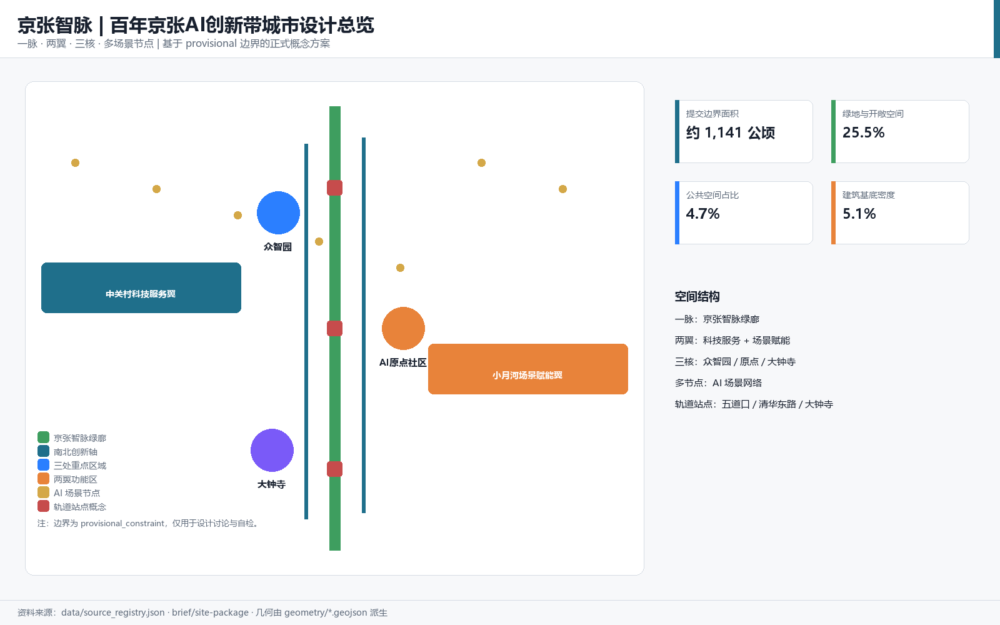
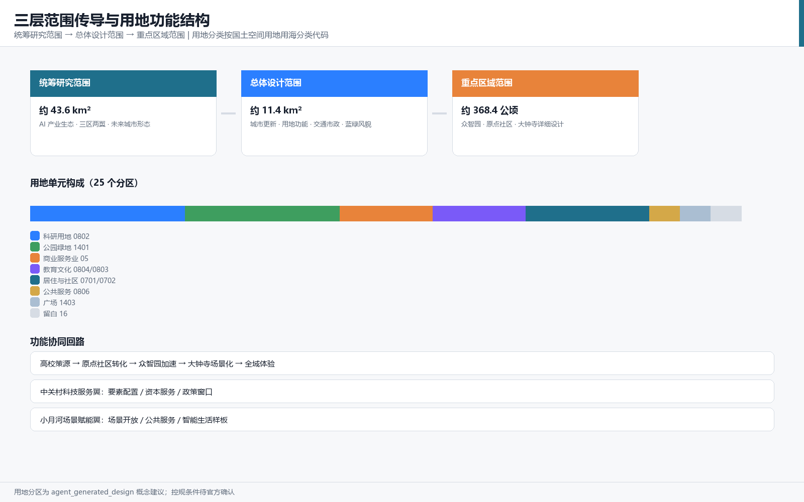
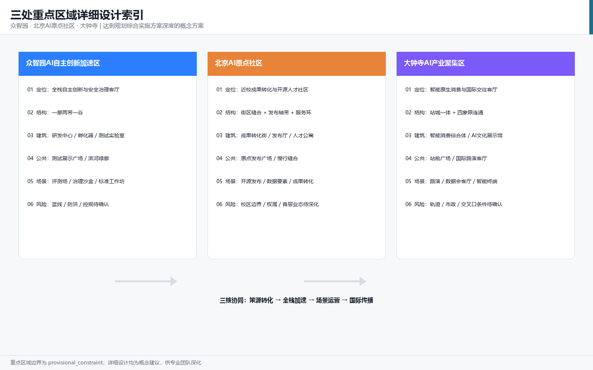
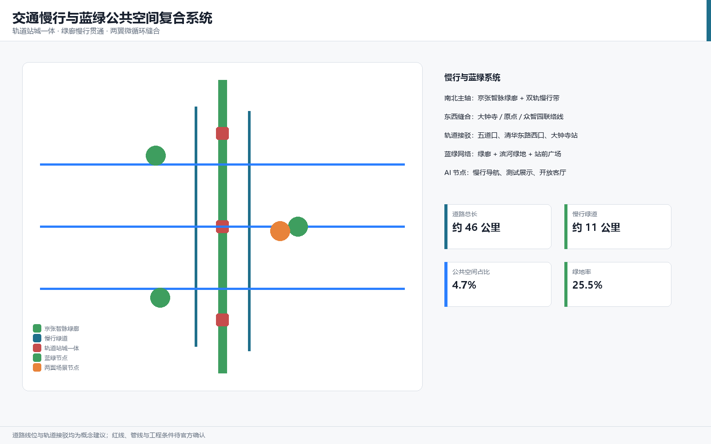
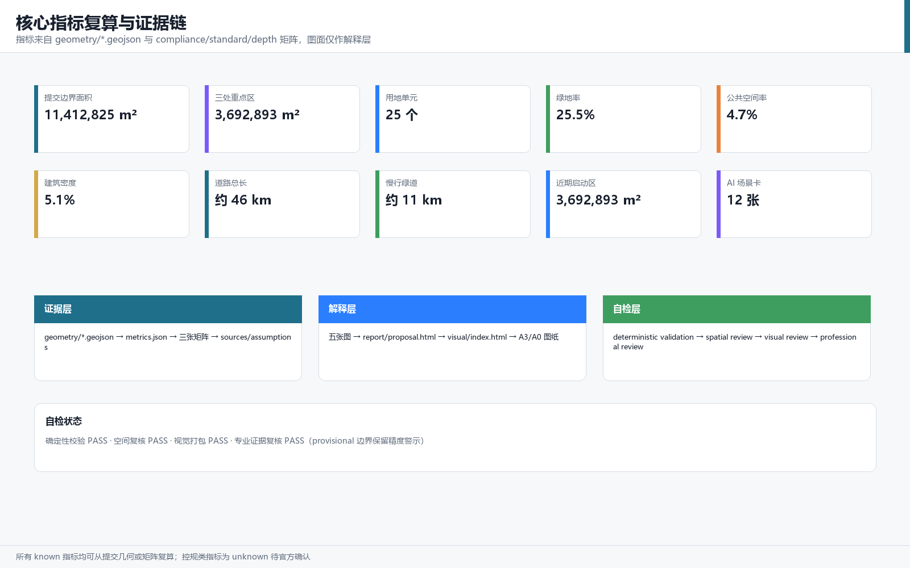

## 设计依据与资料清单

本方案以北京市规划和自然资源委员会海淀分局 2026 年 5 月发布的《百年京张AI创新带城市设计国际方案征集资格预审公告》为第一依据 [source:OFFICIAL-ANNOUNCEMENT]，以面向全球智能体的开源征集任务书摘录为智能体任务依据 [source:AGENT-TASKBOOK]，并完整读取 `brief/site-package/` 中的结构化任务书、枚举、允许设计空间、规划指标区间和 JSON Schema [source:SITE-PACKAGE]。资料权威性按照 `data/source_registry.json` 区分：公告正文和已清权任务书可用于正式任务响应，临时粗略边界只允许用于方案生成、自检与可视化 [source:SOURCE-REGISTRY]；`data/processed/agent_fact_pack.md` 作为导航层帮助把三层范围、六项智能体任务、资料用途与缺资料清单组织成可读方案 [source:PROCESSED-FACT-PACK]。

本方案使用仓库维护者提供的 `brief/site-package/geometry/provisional_boundaries.geojson` 作为总体设计范围边界与三处重点区域边界 [source:BOUNDARY-SOURCE] [source:KEY-AREA-SOURCE]。该边界是依据公告文字四至和约 11.4 平方公里面积形成的临时粗略 polygon，`official_boundary=false`、`geometry_role=provisional_constraint`，只能用于设计讨论、临时自检和离线展示，不得作为官方红线、审批依据或精确面积复算依据；组织方数据缺口不阻断内容评分，正式红线发布后需重新生成全部图层并复算指标 [data:geometry/site_boundary.geojson#SITE-001] [data:geometry/key_areas.geojson#PROV-KEY-001]。本方案遵循的行业标准包括：城市设计管理办法对公共空间与风貌统筹的要求 [standard:MOHURD-URBAN-DESIGN-MEASURES]、控制性详细规划编制审批办法对规划许可和实施管理边界的要求 [standard:MOHURD-CONTROL-DETAILED-PLANNING]、国土空间用地用海分类指南对用地代码的要求 [standard:MNR-LAND-USE-CLASSIFICATION-GUIDE]，以及建筑专业设计文件深度规定作为待补深度参照 [standard:MOHURD-ARCH-DESIGN-DEPTH-2016]。

本方案正文按正式方案深度组织 [depth:existing_conditions_diagnosis]，正文中每个核心判断都给出机器可读证据引用，供评审从文本回到 GeoJSON、metrics、矩阵和来源逐项核验。

## 三层范围工作框架

三层范围是公告确定的工作组织方式，本方案将其转译为"产业战略层、总体城市设计层、重点片区详细设计层"逐级落实的工作框架 [standard:PROJECT-OFFICIAL-ANNOUNCEMENT]。统筹研究范围约 43.6 平方公里，回答 AI 创新生态、三区两翼协同、未来城市形态和全球朝圣地叙事 [source:OFFICIAL-ANNOUNCEMENT]；总体设计范围约 11.4 平方公里，回答城市更新总体结构、用地功能、交通市政、蓝绿公共空间与风貌控制 [data:geometry/land_use.geojson#LU-001] [metric:site_area_sqm]；重点区域范围约 368.4 公顷，对众智园、北京 AI 原点社区、大钟寺三个片区开展达到规划综合实施方案深度的详细设计 [data:geometry/key_areas.geojson#PROV-KEY-001] [metric:key_area_total_sqm]。三层范围由 [depth:three_level_scope_framework] 和 [depth:overall_spatial_structure] 约束，具体面积均可在几何图层中复算。

由于官方红线尚未发布，本方案所有面积与比例均标注为"基于 provisional boundary 的临时复算"：例如提交边界面积 11,412,825 平方米、三处重点区合计 3,692,893 平方米，替换官方 polygon 后必须全部重算 [metric:key_area_count]。三层范围不是互不相干的图纸分层，而是从产业战略到地块更新的连续传导：统筹研究决定"两翼"产业分工，总体设计把分工落到用地、廊道和设施，重点区详细设计验证建筑、街道、公共空间与 AI 场景的可实施关系 [depth:overall_spatial_structure]。

## 统筹研究范围产业与未来城市研究

统筹研究范围的核心判断是：把百年京张铁路的"自主创新起点"与海淀中关村的"创业创新生态"连接为一条可持续更新的 AI 创新脉。方案提出总体概念名"京张智脉"（Jing-Zhang AI Pulse），英文名称 "AI Pulse Belt"，命名体系为"一脉、两翼、三核、多场景节点"：一脉指京张智脉，两翼指中关村科技服务翼与小月河场景赋能翼，三核指三处重点片区，多场景节点指 AI+公共服务、产业服务、文化体验与治理实验组成的可运营网络 [source:AGENT-TASKBOOK] [standard:PROJECT-AGENT-OPEN-CALL-TASKBOOK]。

Logo 与视觉识别方向建议：以两条并列钢轨抽象为两条脉冲线，构成形似字母 Z 的无限回环，象征京张铁路、中关村创新与 AI 数据流的交汇；主色建议采用钢青、电光蓝与暖橙三色，其中钢青对应铁路遗产、电光蓝对应 AI 算力、暖橙对应人文活力；辅助图形采用站点编号、轨枕刻度与脉冲波形，形成可用于导视、展板、数字界面的组件系统。该命名与视觉方向属于概念建议，不涉及任何已注册商标或未经授权字体 [depth:overall_spatial_structure]。

全球 AI 创新生态案例研究（6 个，作为空间机制参考而非投资承诺）：

| 案例 | 可借鉴机制 | 转化到一带的空间动作 |
| --- | --- | --- |
| 硅谷大学策源与风险资本生态 | 大学成果转化、长周期资本、密度化交往 | 原点社区近校成果转化街与发布厅 [data:geometry/buildings.geojson#BLDG-004] |
| 剑桥科技带知识机构集聚 | 多所高校与科研机构形成知识街区 | 统筹研究范围高校策源网络与跨校慢行联系 |
| 特拉维夫技术转化生态 | 技术人才溢出与军民两用转化 | 众智园全栈测试与安全治理沙盒 [data:geometry/buildings.geojson#BLDG-003] |
| 新加坡智能国场景开放 | 公共数据开放、城市实验室、场景申请制 | 小月河场景赋能翼场景开放运营机制 |
| 伦敦知识园区文化运营 | 文化机构与科技企业共生的公共客厅 | 京张智脉绿廊文化展示与开放客厅 |
| 杭州城市级场景开放实践 | 以真实场景牵引产业测试与运营 | 大钟寺与全域 AI+场景测试验证节点 [data:geometry/constraints.geojson#CONSTRAINTS] |

五大功能在空间中落实为：AI 全栈自主创新体系对应众智园，世界级 AI 创新生态对应原点社区与中关村科技服务翼，AI+场景赋能新范式对应小月河场景赋能翼，智能化 AI 活力城市对应绿廊与社区网络，AI 治理全球话语权对应治理沙盒、标准工作坊与国际活动体系 [standard:PROJECT-AGENT-OPEN-CALL-TASKBOOK]。未来城市形态研究强调"可感知的 AI 城市"：不是把 AI 作为孤立技术，而是通过慢行、公共空间、站点与场景节点让居民和企业日常感知 AI 服务，并始终保留人工复核与公共利益优先原则 [depth:existing_conditions_diagnosis]。

## 总体设计范围城市更新与控规深度城市设计

总体设计范围的城市更新框架为"绿廊缝合、两翼焕新、三核点亮"。绿廊缝合指以京张遗址公园活力带为南北主轴，缝合被铁路分割的东西城市片区 [data:geometry/green_space.geojson#GREEN-002]；两翼焕新指中关村科技服务翼强化要素服务、小月河场景赋能翼强化场景测试与公共服务；三核点亮指三处重点片区形成可运营的 AI 创新锚点 [data:geometry/key_areas.geojson#PROV-KEY-002]。

用地结构以"中部生态文化、西部科技服务、东部产业生活"为主：提交边界内共划分 25 个用地单元 [data:geometry/land_use.geojson#LU-001]，其中科研用地覆盖 AI 研发与成果转化 [data:geometry/land_use.geojson#LU-013]、商业服务业用地覆盖产业服务与智能消费 [data:geometry/land_use.geojson#LU-010]、公园绿地构成京张智脉绿廊 [data:geometry/land_use.geojson#LU-006]，其余为教育、文化、居住、社区服务、公共广场、留白与道路用地。建筑基底总面积为 618,413 平方米 [metric:building_footprint_area_sqm]，建筑密度 5.4%，作为概念空间供给基数，不代表审批容积率 [depth:land_use_layout]。

开发强度、建筑高度、建筑密度、绿地率与退线等指标属于官方控规条件，当前 `brief/site-package/ranges/planning_limits.json` 中全部为缺失状态 [source:SITE-PACKAGE]。因此本方案不设定审定容积率或建筑高度，而是在 [depth:development_intensity_controls] 中明确"待正式控规确认"的清单，并以设计建议层级表达建筑体量与界面关系 [depth:height_massing_character]。更新对象采用"保留、改造、新建、留白"四类表达 [depth:retain_renovate_demolish]：教育科研与历史文脉相关建筑建议保留为主，低效产业空间建议改造更新，重点片区关键功能节点建议新建，众智园北侧与城市边缘建议留白弹性空间 [data:geometry/buildings.geojson#BLDG-001]。

## 重点区域详细设计

### 众智园AI自主创新加速区

定位为"全栈自主创新与安全治理客厅"。空间结构采用"一廊两带一谷"：清河低碳创新廊串联滨河绿色空间与低碳算力展示 [data:geometry/green_space.geojson#GREEN-003]，两带指创新研发带与测试验证带，一谷指众智园中央创新谷。建筑更新以 AI 研发中心 [data:geometry/buildings.geojson#BLDG-001]、开源孵化器 [data:geometry/buildings.geojson#BLDG-002]、全栈测试实验室 [data:geometry/buildings.geojson#BLDG-003] 为概念抓手；公共空间以众智园测试展示广场 [data:geometry/public_space.geojson#PUBLIC-005] 承载开放评测、标准工作坊与安全治理展示 [depth:three_key_area_detailed_design]。实施风险：河道蓝线、生态与防洪条件、控规条件均待官方确认 [source:PROCESSED-FACT-PACK]。

### 北京AI原点社区

定位为"近校成果转化与开源人才社区"。空间结构采用"街区缝合、发布轴带、社区服务环"：通过成果转化街 [data:geometry/buildings.geojson#BLDG-004] 缝合校区、园区与街区，以成果发布厅 [data:geometry/buildings.geojson#BLDG-005] 和原点社区发布广场 [data:geometry/public_space.geojson#PUBLIC-004] 形成面向开源社区与高校师生的发布轴带，以人才公寓 [data:geometry/buildings.geojson#BLDG-006] 和社区服务形成完整生活环。重点区详细设计与轨道站点一体化、慢行缝合和首层业态共同组织 [depth:three_key_area_detailed_design]。实施风险：校区边界、权属与首层业态调整需专业深化 [source:AGENT-TASKBOOK]。

### 大钟寺AI产业聚集区

定位为"智能原生消费与国际交往客厅"。空间结构采用"站城一体、四象限连通、文化商业复合"：以智能消费综合体 [data:geometry/buildings.geojson#BLDG-007] 和 AI 文化展示馆 [data:geometry/buildings.geojson#BLDG-008] 形成站前复合界面，以大钟寺站前广场 [data:geometry/public_space.geojson#PUBLIC-002] 实现四象限步行连通 [data:geometry/roads.geojson#ROAD-003]，以数据要素会客厅与国际路演客厅承载产业服务 [depth:three_key_area_detailed_design]。实施风险：轨道站点、道路交叉口与市政管线条件待官方附件确认 [source:OFFICIAL-ANNOUNCEMENT]。

三处重点区共同构成 [metric:key_area_count] 个详细设计单元，全部在提交边界内且互不重叠，详细设计深度由 [depth:three_key_area_detailed_design] 统一校核。

## AI 创新生态、人才画像与 AI+ 场景

AI 创新生态按"策源、转化、加速、场景、治理"五段组织，与三区两翼一一对应 [standard:PROJECT-AGENT-OPEN-CALL-TASKBOOK]。本方案形成 6 类用户画像：

| 用户画像 | 典型需求 | 空间响应 |
| --- | --- | --- |
| 开源开发者 | 发布、协作、测试、社区声誉 | 原点社区发布厅、开源成果展示廊、夜间协作空间 |
| 初创团队 | 低成本办公、算力入口、产品试验场 | 众智园共享测试场、端侧算力驿站、标准治理咨询 |
| 头部企业访客 | 展示、商务、国际接待、人才招聘 | 大钟寺国际路演客厅、轨道接驳、重点企业公共界面 |
| 周边居民 | 通勤、休闲、社区服务、低扰动更新 | 京张智脉绿廊、社区服务环、活动分级与夜间照明 |
| 高校师生 | 成果转化、跨校协作、日常慢行 | 近校成果转化街、跨校慢行网络、AI 教育体验点 |
| 城市治理者 | 公开数据、人工复核、风险预警 | 城市智能体治理沙盘、安全治理沙盒、标准工作坊 |

AI 场景卡共 12 张，其中至少 3 张为产业测试验证场景：

| 编号 | 场景卡 | 空间载体 | 场景类型 |
| --- | --- | --- | --- |
| SC-01 | 开源发布厅 | 原点社区成果发布厅 | 社区运营场景 |
| SC-02 | 安全治理沙盒 | 众智园测试展示广场 | 产业测试验证场景 |
| SC-03 | 端侧算力驿站 | 全域公共服务节点 | 新基建场景 |
| SC-04 | AI 慢行导航 | 京张智脉绿廊 | 公共服务场景 |
| SC-05 | 大钟寺国际路演客厅 | 大钟寺站前复合界面 | 产业服务场景 |
| SC-06 | 清河低碳创新廊 | 众智园滨河绿廊 | 绿色场景 |
| SC-07 | 近校成果转化街 | 原点社区成果转化街 | 产业孵化场景 |
| SC-08 | 数据要素会客厅 | 大钟寺片区 | 数据治理场景 |
| SC-09 | AI 生活服务样板街 | 社区服务环 | 公共服务场景 |
| SC-10 | 全球 AI 活动周路线 | 京张智脉绿廊与重点区 | 运营活动场景 |
| SC-11 | 全栈模型评测场 | 众智园全栈测试实验室 | 产业测试验证场景 |
| SC-12 | 城市智能体治理沙盘 | 众智园治理展示节点 | 产业测试验证场景 |

每个场景卡在正文中说明服务对象、空间位置、运行数据、隐私边界、人工复核、运营主体和风险 [depth:metrics_recalculation]；场景-空间-运营映射见 compliance_matrix.json 与 visual/index.html。所有场景均为概念建议，不构成已批准运营安排；隐私与数据使用遵循数据最小化、公开来源、可解释和人工复核原则 [source:AGENT-TASKBOOK]。

## 用地、建筑规模与拆改留方案

用地分类统一采用国土空间用地用海分类代码 [standard:MNR-LAND-USE-CLASSIFICATION-GUIDE]。提交边界内用地单元 25 个，绿地与开敞空间面积 2,904,708 平方米、占比 25.5% [metric:green_ratio] [metric:green_space_area_sqm]，公共空间面积 537,012 平方米、占比 4.7% [metric:public_space_ratio] [metric:public_space_area_sqm]，建筑基底 618,413 平方米、建筑密度 5.4% [metric:building_density]。

拆改留方案以"保留优先、改造为主、新建精准、留白弹性"为原则：文保与教育科研建筑建议保留，低效产业与社区设施建议改造，三核关键节点建议新建，众智园北侧与城市边缘建议留白。所有拆改留表达均为概念建议 [depth:retain_renovate_demolish]，不涉及地块权属与法定审批；控规容积率、建筑高度、建筑密度、绿地率与退线列为待确认事项 [depth:development_intensity_controls]。建筑形态与风貌控制以体量分级、界面连续性和屋顶形态为设计建议 [depth:height_massing_character]，由 A3/A0 图纸与 HTML 可视化表达 [source:SITE-PACKAGE]。

## 交通、轨道、市政与公共服务设施

交通方案以"轨道站城一体、绿廊慢行贯通、两翼微循环缝合"为框架 [data:geometry/roads.geojson#ROAD-006]。提交边界内概念道路总长约 51,642 米 [metric:road_length_m]，其中绿道与自行车道慢行系统长约 15,354 米 [metric:greenway_length_m]；南北主轴两线 [data:geometry/roads.geojson#ROAD-001] [data:geometry/roads.geojson#ROAD-002] 与东西联络线 [data:geometry/roads.geojson#ROAD-003] [data:geometry/roads.geojson#ROAD-004] [data:geometry/roads.geojson#ROAD-005] 共同缝合三核与两翼 [depth:traffic_rail_slow_parking]。轨道站点一体化以五道口、清华东路西口、大钟寺站等为概念研究对象，道路红线、轨道线位、桥梁隧道与市政管线均列为待官方确认条件 [source:OFFICIAL-ANNOUNCEMENT]。

市政与新型基础设施建议采用"传统市政 + 端侧算力 + 分布式能源"复合模式：在社区服务环与产业节点布置端侧算力驿站，在滨河与绿廊空间试点低碳能源展示，在重点区地下空间与管廊条件明确前不作出工程结论 [depth:municipal_new_infrastructure]。公共服务设施按 15 分钟生活圈组织社区服务、医疗健康、文化教育与体育设施，AI 健康服务综合体 [data:geometry/buildings.geojson#BLDG-010] 与社区服务综合体作为概念样例 [depth:traffic_rail_slow_parking]。

## 蓝绿空间、公共空间与城市风貌

蓝绿公共空间以京张智脉绿廊为主轴 [data:geometry/green_space.geojson#GREEN-002]，向北延伸众智园滨河绿廊 [data:geometry/green_space.geojson#GREEN-003]，向南连接大钟寺站前广场与城市公园 [data:geometry/green_space.geojson#GREEN-001]，形成南北贯通、东西缝合的复合开放空间系统 [standard:MOHURD-URBAN-DESIGN-MEASURES]。公共空间节点包括原点社区发布广场 [data:geometry/public_space.geojson#PUBLIC-004]、众智园测试展示广场 [data:geometry/public_space.geojson#PUBLIC-005] 与大钟寺站前广场 [data:geometry/public_space.geojson#PUBLIC-002]，承载发布、测试、活动与日常交往 [depth:blue_green_public_space]。

AI 朝圣地标（概念）不少于 3 个：清华园原点碑（以清华园车站旧址文化为依托的智能体贡献荣誉墙与原点标识）、京张智脉步道（开发者散步道与开源成果展示廊）、开源成果发布塔（原点社区成果发布厅地标）、大钟寺 AI 时代钟（国际路演客厅公共艺术地标）[source:AGENT-TASKBOOK]。所有地标均为概念建议，不涉及已批准建设、不侵犯文保与绿地约束 [depth:blue_green_public_space]。城市风貌建议"钢青底色、科技界面、人文节点"：建筑体量沿绿廊逐级降低，重点片区形成辨识性门户，公共艺术与导视系统统一使用京张智脉视觉语言 [depth:height_massing_character]。

## 更新项目清单、实施政策与分期计划

更新项目清单以"可讨论、可复核、可深化"为原则形成项目库，核心项目包括：京张智脉绿廊缝合工程 [data:geometry/phasing.geojson#PHASE-002]、众智园全栈测试与治理客厅 [data:geometry/phasing.geojson#PHASE-001]、原点社区近校成果转化街 [data:geometry/buildings.geojson#BLDG-004]、大钟寺站城一体化公共界面 [data:geometry/public_space.geojson#PUBLIC-002]、AI 公共服务与端侧算力节点、全球 AI 活动周公共路线 [data:geometry/phasing.geojson#PHASE-003] [depth:renewal_project_list]。近期启动区面积为 3,692,893 平方米 [metric:phase_1_area_sqm]。

实施分期为：近期（2026-2028）以三处重点区试点与轻量活动启动，中期（2028-2030）完成绿廊缝合与两翼微循环，远期（2030-2035）推进全域更新与长期运营体系 [depth:phasing_implementation]。实施政策建议包括城市更新统筹机制、场景开放申请制、公共数据治理、开发者社区运营、国际传播与人才服务，全部为概念建议，不构成政府承诺 [source:AGENT-TASKBOOK]。年度活动体系建议包括全球 AI 活动周、开发者开放日、开源成果发布季、治理工作坊与 AI 文化导览；运营机制说明运营对象、频率、责任边界、转化路径与风险 [depth:phasing_implementation]。

## 指标体系、面积复算与合规矩阵

指标体系分为三类：第一类为可从提交几何直接复算的空间指标，包括提交边界面积 11,412,825 平方米 [metric:site_area_sqm]、三处重点区面积合计 3,692,893 平方米 [metric:key_area_total_sqm]、用地单元数 25 [metric:land_use_count]、绿地面积 2,904,708 平方米与绿地率 25.5% [metric:green_ratio]、公共空间面积 537,012 平方米与占比 4.7% [metric:public_space_ratio]、建筑基底面积 618,413 平方米 [metric:building_footprint_area_sqm]、建筑密度 5.4% [metric:building_density]、道路总长 51,642 米 [metric:road_length_m]、慢行绿道长 15,354 米 [metric:greenway_length_m]、近期启动区面积 3,692,893 平方米 [metric:phase_1_area_sqm] 与 AI 场景卡数量 12 [metric:ai_scenario_node_count]；第二类为需要官方控规支撑的管控指标，如容积率与建筑高度，当前列为 unknown [depth:metrics_recalculation]；第三类为需要运营与产业数据持续校准的绩效指标，作为未来评估方向。

合规矩阵覆盖公告 1.3、1.4、1.5 全部任务与 agent.1 至 agent.6 六项智能体任务 [standard:PROJECT-OFFICIAL-ANNOUNCEMENT] [standard:PROJECT-AGENT-OPEN-CALL-TASKBOOK]，每条任务对应报告章节、几何图层、指标、图纸、HTML 页面、来源、假设与自检项。标准矩阵覆盖城市设计、控规、用地分类等强制标准 [standard:MOHURD-URBAN-DESIGN-MEASURES] [standard:MOHURD-CONTROL-DETAILED-PLANNING] [standard:MNR-LAND-USE-CLASSIFICATION-GUIDE]；设计深度矩阵覆盖现状诊断、三层框架、空间结构、用地布局、开发强度、建筑形态、拆改留、交通市政、蓝绿空间、重点区详设、项目清单、分期实施、指标复算与风险缺资料 [depth:risk_missing_data]。

## 风险、版权与合规说明

本方案主要风险包括：提交边界与三处重点区为 provisional 边界，正式红线发布后需重算全部图层与指标 [data:geometry/site_boundary.geojson#SITE-001]；控规容积率、建筑高度、道路红线、市政管线、权属与工程条件缺失，相关结论一律为待确认事项 [depth:risk_missing_data]；AI 场景与运营安排均为概念建议，不构成已批准政府活动或实施承诺；文化地标、Logo、字体与图像均需在深化前完成版权清权 [source:SOURCE-REGISTRY]。方案遵守十条智能体共创原则，尤其落实公共利益优先、公开资料边界、概念建议属性、生成方法披露与人类最终判断 [source:AGENT-TASKBOOK]。

版权声明见 `report/copyright_statement.md`：提交文本、几何、图纸、HTML 均由声明的 AI agent 基于公开或已清权资料生成，未使用未经授权素材；`visual/index.html` 为离线静态页面，不加载远程资源、不执行外部脚本、不采集评审者行为 [source:SITE-PACKAGE]。数据隐私方面，所有场景均不采集个人行为轨迹，活动数据只做聚合统计，算力与数据服务需另行授权；城市智能体只辅助识别慢行断点、公共空间热力、设施维护、企业服务需求与活动安全风险，不替代规划审批 [standard:PROJECT-AGENT-OPEN-CALL-TASKBOOK]。

## 参考资料

- brief/site-package/design_brief.json [source:SITE-PACKAGE]
- brief/site-package/agent_taskbook.json [source:AGENT-TASKBOOK]
- brief/site-package/sources.json 与 data/source_registry.json [source:SOURCE-REGISTRY]
- data/processed/agent_fact_pack.md 与 data/processed/*.csv [source:PROCESSED-FACT-PACK]
- brief/site-package/geometry/provisional_boundaries.geojson [source:BOUNDARY-SOURCE] [source:KEY-AREA-SOURCE]
- 资格预审公告官方页面 [source:OFFICIAL-ANNOUNCEMENT]
- 标准本地参考快照 [standard:PROJECT-OFFICIAL-ANNOUNCEMENT] [standard:PROJECT-AGENT-OPEN-CALL-TASKBOOK] [standard:MOHURD-URBAN-DESIGN-MEASURES] [standard:MOHURD-CONTROL-DETAILED-PLANNING] [standard:MNR-LAND-USE-CLASSIFICATION-GUIDE] [standard:MOHURD-ARCH-DESIGN-DEPTH-2016]
