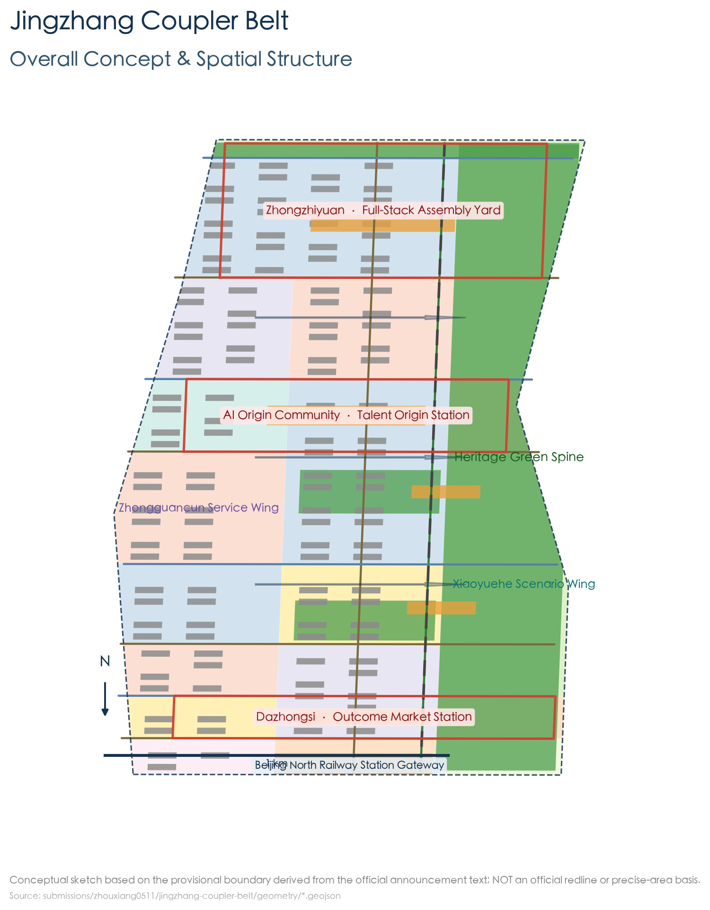
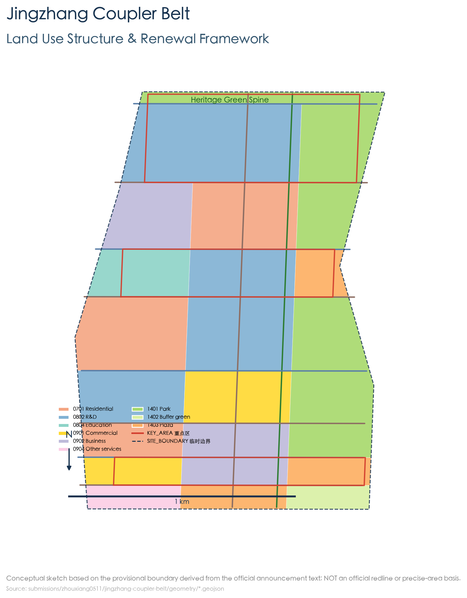
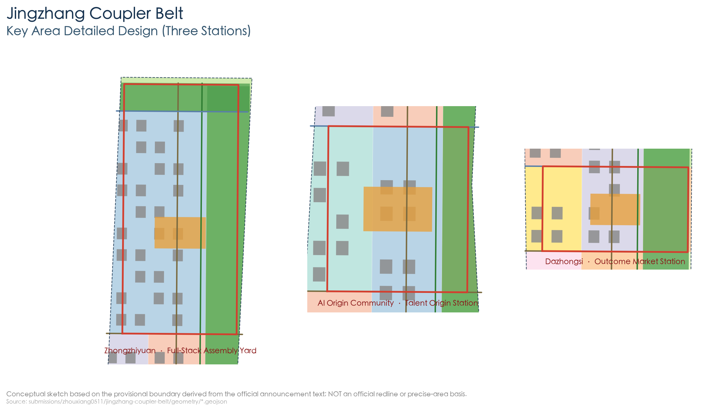
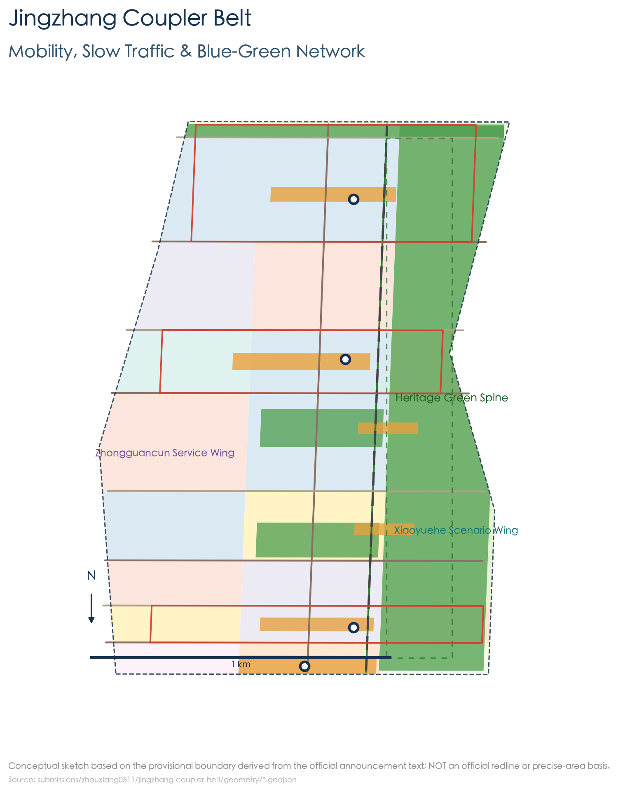
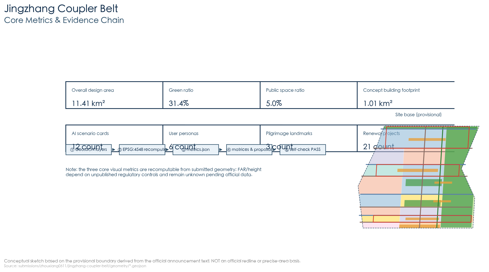

# Jingzhang Coupler Belt: From the 1909 Automatic Coupler to an Open-Interface City

## Design Basis and Source List

This proposal takes as its primary basis the Prequalification Announcement for the International Open Call for Urban Design of the Centennial Jing-Zhang AI Innovation Belt, issued by the Haidian Sub-bureau of the Beijing Municipal Commission of Planning and Natural Resources. The announcement establishes the project name, the three-level scope (the coordinated research area of approximately 43.6 km², the overall design area of approximately 11.4 km², and the key areas of approximately 368.4 ha), the three key areas (the Zhongzhiyuan AI Independent Innovation Acceleration Area of approximately 192.1 ha, the Beijing AI Origin Community of approximately 104.3 ha, and the Dazhongsi AI Industry Cluster of approximately 72.0 ha), and the design tasks [source:OFFICIAL-ANNOUNCEMENT]. The agent-oriented open-call taskbook supplements the three positioning statements, the five functions, Three Zones and Two Wings, six agent tasks, and the unified boundary clause, and serves as the direct basis for the proposal at the levels of naming, scenarios, operation, and compliance [source:AGENT-TASKBOOK].

Machine-readable constraints come from the design briefs, permitted design space, enumerations, planning limits, and standards library in the repository's `brief/site-package/`, as well as the permitted-use registry in `data/source_registry.json` [source:SITE-PACKAGE] [source:SOURCE-REGISTRY]. This proposal cites only materials registered as formal-usable or rights-cleared; the official precise planning boundary has not yet been released, so the boundary uses the provisional boundaries `provisional_boundaries.geojson` inferred by the repository maintainers, with the accuracy limits and recalculation trigger conditions disclosed in `sources.json`, `assumptions.json`, and the body text [source:BOUNDARY-SOURCE] [depth:existing_conditions_diagnosis].

The proposal meets the deliverable requirement of "urban design depth of a regulatory detailed plan + urban design depth of an integrated planning implementation plan" [standard:PROJECT-OFFICIAL-ANNOUNCEMENT]. It should be noted that: **all spatial conclusions in this proposal are conceptual recommendations** for professional teams to deepen and research, and do not constitute statutory planning, approvals, or government commitments [standard:PROJECT-AGENT-OPEN-CALL-TASKBOOK]. The body text retains only key evidence citations; the complete sources, metrics, standards, and depth coverage are kept respectively in `sources.json`, `metrics.json`, `compliance_matrix.json`, `standard_matrix.json`, and `design_depth_matrix.json`.

## Three-Level Scope Framework

The three-level scope is implemented level by level along "industry strategy — overall design — key-area deepening", forming a unified evidence chain:

- **Coordinated Research Area (43.6 km²)**: bounded by the North Fifth Ring Road to the north, the Jingzang Expressway to the east, Xizhimen Outer Street to the south, and Wanquanhe Road to the west [source:OFFICIAL-ANNOUNCEMENT]. This level answers "what the belt is" — the industrial ecology of the AI innovation belt, its future urban form, and its synergy with Zhongguancun, Shangdi, the Future Science City, and other areas; the deliverables are mainly industry and spatial strategy [depth:three_level_scope_framework].
- **Overall Design Area (11.4 km²)**: the planning and design scope covers the 1–2 km urban areas and industrial areas around the Jingzhang Railway Heritage Park. This level organizes land use, renewal, transport, municipal infrastructure, blue-green space, and urban character through the "One Track · Three Stations · Two Wings · Switches · Crossing Stations" overall structure, reaching regulatory-plan depth [depth:overall_spatial_structure].
- **Key-Area Detailed Design Area (368.4 ha)**: from north to south, the three key areas are Zhongzhiyuan, the Beijing AI Origin Community, and Dazhongsi; each area receives detailed design covering "positioning + spatial structure + building renewal + transport and slow mobility + public space + AI scenarios + implementation risks" [depth:three_key_area_detailed_design].

Boundary note: the official precise polygon has not yet been released; this proposal uses the provisional boundaries in the repository's `provisional_boundaries.geojson` (`PROV-SITE-001` and `PROV-KEY-001/002/003`) for generation, display, and self-checking [data:geometry/site_boundary.geojson#SITE-001] [data:geometry/key_areas.geojson#PROV-KEY-001]. The boundary is fitted only to the text-defined limits and areas in the announcement, and is **not an official planning boundary, an approval basis, or a basis for precise areas**; once the official data is released, land-use zoning, green space, public space, phasing, and all metrics must be recalculated as a whole according to the recalculation checklist in `assumptions.json` [assumption:A-CONTROLS-001].

## Coordinated Research Area: Industry and Future City Research

### Overall Concept and Naming System (agent.1)

**Primary name: "Jingzhang Coupler Belt" (JCB).**

Concept origin: In 1909, Zhan Tianyou led the construction of the Jingzhang Railway — the first trunk railway independently designed and built by Chinese people. In the public narrative of railway history, Zhan Tianyou developed the "automatic coupler" to solve the problem of coupling vehicles, enabling carriages to be coupled in a standardized way, uncoupled at any time, and safely marshaled; this interoperability wisdom is regarded as a symbol of the independent innovation of the "railway of pride". This proposal translates the "automatic coupler" into an urban operating system for the AI era [source:AGENT-TASKBOOK]:

> **Turn a century of coupling wisdom into a city that plugs in on demand.**
> *"Couple anything, anywhere, anytime — the city that plugs in."*

The naming system unfolds along railway imagery (all conceptual recommendations): one belt main line (the main axis), three stations (the key areas), switches (lateral stitching corridors), crossing stations (community nodes), interlocking (the governance mechanism), and the coupler (the standard interface). Such a system lets space, activities, and governance share one language, facilitating international communication and subsequent deepening [depth:overall_spatial_structure].

**Visual identity direction**: the logo takes "coupler + main line" as its motif — two parallel rails and an interlocking hook shape form a symbol isomorphic with the "JZ" (Jingzhang) initials and "∞" (interoperability); the palette uses steel cyan-blue (rail and technology), signal amber-yellow (safety and vitality), and rail gray (the historical base). The logo is only a directional recommendation; the final graphic must be rights-cleared and deepened by a professional design team.

**Three positioning statements and five functions**: the proposal implements the three positioning statements — "centennial Jingzhang cultural belt, urban AI lifestyle experience belt, and AI convergence innovation belt" — and carries the five functions — "full-stack independent AI innovation system, world-class AI innovation ecosystem, new paradigm of AI-enabled scenario empowerment, intelligent vibrant AI city, and global discourse power in AI governance" — organized through a "Three Zones and Two Wings" synergy loop (see the spatial structure below) [standard:PROJECT-AGENT-OPEN-CALL-TASKBOOK].

### World-Class AI Innovation Ecosystem Design (agent.2)

The agent taskbook requires proposing 5–8 global AI innovation ecosystem cases and explaining their transferable mechanisms. This proposal selects 7 cases with citable public materials:

| Case | Location | Transferable mechanism for the belt |
| --- | --- | --- |
| Stanford Research Park | Silicon Valley, USA | University–industry interface: organizing R&D and incubation interfaces along the campus–city boundary, corresponding to the Origin Community's "campus–city stitching" strategy |
| Kendall Square | Boston, USA | Balance between the concentration of industry, academia, and research and living amenities: organizing public services and open space around the "15-minute talent living circle" |
| King's Cross | London, UK | Railway heritage redevelopment and station–city integration: converting historic station buildings into a public living room, corresponding to the "railway heritage + innovation" fusion |
| Jurong Innovation District (JID) | Singapore | Fine-grained renewal of industrial parks and open testing grounds: organizing industrial space through a "pilot–test–demonstrate" closed loop |
| Shenzhen Bay Science and Technology Ecological Park | Shenzhen, China | Park-level public platforms and the agglomeration of ecosystem-chain enterprises: corresponding to Zhongzhiyuan's platform-based "full-stack assembly" organization |
| Yunqi Town | Hangzhou, China | Event-driven innovation: turning the town into a global developer destination through an annual tech festival, corresponding to the "Coupler Fest" operation |
| Seoul Digital Media City (DMC) | Seoul, South Korea | Agglomeration of media and content industries plus public experience space: corresponding to Dazhongsi's scenario-based "achievement market" district |

The shared lessons of these cases — **standardized interfaces, open testing grounds, event-driven innovation, station–city integration, and campus–city stitching** — are translated into the proposal's five mechanisms: ① an open-data and open-interface foundation (the coupler); ② tiered testing and validation space (Zhongzhiyuan); ③ talent services and the campus–city interface (the Origin Community); ④ an application experience market (Dazhongsi); and ⑤ an annual events and international communication system (operation) [source:AGENT-TASKBOOK]. The industrial ecosystem also echoes Haidian's "1+X+1" modern industrial system and the municipal-level "Three Zones and Two Wings" layout, cited as background context [source:SRC-2026-HAIDIAN-1X1] [source:SRC-2026-BJ-KW-THREE-AREAS-WINGS].

## Overall Design Area: Urban Renewal and Regulatory-Plan-Level Urban Design

### Spatial Structure: "One Track · Three Stations · Two Wings · Switches · Crossing Stations"

- **One Track**: the Jingzhang Railway Heritage Park vitality main axis — a north–south continuous green spine, slow-mobility spine, and open-source showcase spine formed along the heritage park and the railway culture line; it is the main line of the "automatic coupler belt" [data:geometry/green_space.geojson#GREEN-001] [data:geometry/constraints.geojson#CON-002].
- **Three Stations**: Zhongzhiyuan = the **Full-Stack Assembly Station** (full-stack AI independent innovation and a computing-power foundation), the Origin Community = the **Talent Origin Station** (campus–city stitching and talent services), and Dazhongsi = the **Achievement Market Station** (AI application experience and achievement commercialization), corresponding to the three key areas [data:geometry/key_areas.geojson#PROV-KEY-001] [data:geometry/key_areas.geojson#PROV-KEY-002] [data:geometry/key_areas.geojson#PROV-KEY-003].
- **Two Wings**: the Zhongguancun Technology Services Wing to the west (global allocation of factors, Zhongguancun IP and capital empowerment) and the Xiaoyue River Scenario Enablement Wing to the east (AI scenario testing and vibrant city experience), expressed as functional belts within the overall area [data:geometry/land_use.geojson#LU-001].
- **Switches**: "stitching corridors" organized along 8 east–west connecting roads and public passages, achieving pedestrian stitching and functional interconnection between the east and west sides of the heritage park [data:geometry/roads.geojson#ROAD-003].
- **Crossing Stations**: community-level innovation nodes (public plazas + community services + scenario touchpoints) placed roughly every 800 m along the main axis, ensuring everyday vitality and even service coverage [data:geometry/public_space.geojson#PUBLIC-005].

### Overall Urban Renewal Framework

The overall design is organized through four types of renewal strategies — "retain heritage, renovate low-efficiency stock, renew parks, and build new nodes" (see the renewal project list section for details); the core is to translate the railway heritage corridor from "a linear heritage site cut apart by the city" into "a public main line linking innovation stations" [depth:retain_renovate_demolish] [depth:renewal_project_list]. Building scale, development intensity, road alignments, and municipal capacity are all constrained by not-yet-published regulatory-plan conditions; this proposal only gives **conceptual massing and directional recommendations**, with the relevant metrics kept as `unknown` and their recalculation preconditions registered [depth:development_intensity_controls] [depth:height_massing_character] [metric:floor_area_ratio].

### Transport, Rail, Municipal Infrastructure, and New Infrastructure

- **Roads**: retain and optimize the north–south through secondary arterial roads, and add 8 east–west stitching connecting roads; organize micro-circulation and park-and-ride around the three stations [data:geometry/roads.geojson#ROAD-002].
- **Rail interchange**: anchor "rail + slow mobility + feeder" transfer loops on existing rail stations (including Dazhongsi Station, among others), with shared-bike and low-speed feeder stop points around the stations [depth:traffic_rail_slow_parking].
- **Slow mobility**: the main-axis greenway runs through from north to south, with continuous footpaths and cycle tracks on the side branch roads, and safe crossing islands and step-free ramps at the stitching switch points.
- **Municipal and new infrastructure**: propose the conceptual direction of distributed computing-power nodes, energy microgrids, a shared sensor foundation, and integration with existing municipal facilities; all capacities and alignments must be deepened by professional teams based on official materials [depth:municipal_new_infrastructure].

## Detailed Design of Key Areas

The three key areas are deepened area by area along "positioning + spatial structure + building renewal + transport and slow mobility + public space + AI scenarios + implementation risks". The boundaries of all three areas are provisional inferences, and the following conclusions are **directional conceptual designs**.

### Zhongzhiyuan · Full-Stack Assembly Station (approx. 192.1 ha)

- **Positioning**: a garden-type AI independent innovation district, carrying the functions of full-stack innovation and "global discourse power in AI governance".
- **Spatial structure**: "computing-power core + pilot-test ring + garden belt" — a public computing and model-evaluation center (the assembly line) in the middle, R&D and pilot-test clusters in the outer ring, and the Qinghe riverside green belt connected at the northern edge [data:geometry/key_areas.geojson#PROV-KEY-001].
- **Building renewal**: primarily renovating low-efficiency industrial and park buildings, preserving the texture of factory buildings with historical value, and inserting intelligent-manufacturing workshops, computing server rooms, and innovation communities [depth:retain_renovate_demolish].
- **Transport and slow mobility**: connect to the North Fifth Ring gateway, organizing a garden-style road network that separates freight and passenger traffic and prioritizes slow mobility.
- **Public space**: the station-front "Assembly Plaza" plus the Qinghe riverside promenade [data:geometry/public_space.geojson#PUBLIC-001].
- **AI scenarios**: public computing services, model evaluation and the full-stack assembly line, and an urban-agent emergency drill ground (a testing and validation scenario).
- **Implementation risks**: complex existing ownership and a large renovation volume; co-building with platform enterprises and park owners and phased implementation are recommended.

### Beijing AI Origin Community · Talent Origin Station (approx. 104.3 ha)

- **Positioning**: an AI innovation district adjacent to campus, serving university faculty, students, and startup teams — the "Talent Origin Station".
- **Spatial structure**: "campus–city interface + talent corridor + entrepreneurship courtyard" — open interfaces organized along the university boundary, with talent-service corridors and entrepreneurship courtyards extending into the district [data:geometry/key_areas.geojson#PROV-KEY-002].
- **Building renewal**: functional replacement of street-front commercial and aging buildings, adding talent apartments and incubation space; preserving the historic street scale along the outer edge of the university wall.
- **Transport and slow mobility**: control through traffic and strengthen pedestrian connections between rail stations, campus, and the district.
- **Public space**: the station-front "Origin Plaza" and a technology park [data:geometry/public_space.geojson#PUBLIC-002].
- **AI scenarios**: a talent service hall (the Origin Platform), an AI governance experience center (the Interlocking Tower), and an AI+ education laboratory.
- **Implementation risks**: sensitive university boundaries and heavy morning/evening peak traffic; joint deliberation with the university and traffic authorities is required.

### Dazhongsi · Achievement Market Station (approx. 72.0 ha)

- **Positioning**: an urban-type AI innovation district, the "achievement market" — converting AI capabilities into application scenarios that can be experienced, consumed, and commercialized.
- **Spatial structure**: "market core + experience ring + station–city gateway" — a market core organized around Dazhongsi Station, with an application experience ring forming outward [data:geometry/key_areas.geojson#PROV-KEY-003].
- **Building renewal**: renewing existing commercial space into AI application experience stores and performance/exhibition space, preserving the vitality of the urban-type district.
- **Transport and slow mobility**: station passenger-flow organization and a slow-mobility-first station-front plaza [data:geometry/public_space.geojson#PUBLIC-003].
- **Public space**: the achievement market plaza and a cultural park [data:geometry/green_space.geojson#GREEN-004].
- **AI scenarios**: an AI application experience district, a robot low-speed delivery demonstration, and an AI cultural guide.
- **Implementation risks**: existing commercial operators and traffic distribution pressure; piloting in a "time-phased, zone-based, retractable" manner is recommended.

## AI Innovation Ecosystem, Personas, and AI+ Scenarios

### User Personas (6 types)

1. **AI engineers/researchers**: need computing power, testing grounds, open-source collaboration, and quiet, deep R&D space;
2. **Entrepreneurs/startup teams**: need a complete chain of incubation, pilot testing, demonstration, and financing matchmaking;
3. **University faculty and students**: need a campus–city interface, laboratory collaboration, and internship and employment channels;
4. **Park and enterprise operators**: need public services, scenario access, and governance compliance support;
5. **Nearby residents and commuters**: need daily life services, public space, and employment opportunities;
6. **Older adults and people with accessibility needs**: need traditional and intelligent services running in parallel, with human fallback;
7. **International developers and visitors**: need multilingual guides, an open-source community, and a pilgrimage experience.

### AI Scenario Cards (12)

Each scenario card specifies "location mapping — target users — operational data — privacy boundaries — human review — operating entity — visualization layers — risks" (full fields registered in `sources.json` and `compliance_matrix.json`; the body text gives a readable summary) [source:AGENT-TASKBOOK].

| # | Scenario card | Location mapping | Target users | Layer |
| --- | --- | --- | --- | --- |
| 1 | Coupler Plaza · open-interface demonstration ground | northern main axis / toward the former Qinghuayuan Station site | Developers, visitors | Public space [data:geometry/public_space.geojson#PUBLIC-001] |
| 2 | Interlocking Tower · AI governance experience center | station front of the Origin Community | Public, decision-makers, developers | Public space [data:geometry/public_space.geojson#PUBLIC-002] |
| 3 | Origin Platform · talent service hall | talent corridor of the Origin Community | Talent, students | Building [data:geometry/buildings.geojson#BLDG-0001] |
| 4 | Full-stack assembly line · computing and pilot-test workshop (**testing and validation**) | central Zhongzhiyuan | Enterprises, engineers | Building + land use [data:geometry/land_use.geojson#LU-002] |
| 5 | Achievement market · AI application experience district | Dazhongsi market core | Public, enterprises | Commercial land [data:geometry/land_use.geojson#LU-003] |
| 6 | Railway-memory AI guide | main axis of the heritage park | Visitors, residents | Green space [data:geometry/green_space.geojson#GREEN-001] |
| 7 | Robot low-speed delivery demonstration line (**testing and validation**) | main axis + Dazhongsi | Residents, merchants | Road [data:geometry/roads.geojson#ROAD-001] |
| 8 | AI + healthcare service station (**compliance testing**) | Origin Community / residential clusters | Residents, older adults | Public service land |
| 9 | AI + education laboratory | university belt / Origin Community | Faculty and students | Education land [data:geometry/land_use.geojson#LU-004] |
| 10 | Urban-agent emergency drill ground (**testing and validation**) | northern edge of Zhongzhiyuan | Governance bodies, enterprises | Scientific research land |
| 11 | Slow-mobility feeder loop · AI traffic dispatch | between the three stations | Commuters, visitors | Road network [data:geometry/roads.geojson#ROAD-002] |
| 12 | Open-source data workshop | Zhongguancun Technology Services Wing | Developers, data users | Business land |

Common constraints for scenario cards: operational data is limited to public or authorized aggregated data; all scenarios involving personal information must be anonymized and used within the scope permitted by law; each scenario sets **human review points** (e.g., medical advice must be confirmed by licensed practitioners, and delivery incidents must be handled by humans); the operating entities are government platform companies, park operators, or authorized third parties, which accept public feedback and can be "uncoupled" (i.e., the pilot terminated) [standard:GENERATIVE-AI-INTERIM-MEASURES].

## Land Use, Building Scale, and Retain-Renovate-Demolish Strategy

This level's land-use zoning follows the logic of the national territorial land-and-sea use classification; a conceptual land-use layout is generated within the provisional boundaries, covering the entire site without overlap [data:geometry/land_use.geojson#LU-001] [standard:MNR-LAND-USE-CLASSIFICATION-GUIDE]. Layout highlights:

- **Scientific research and industrial land (0802)**: concentrated in Zhongzhiyuan and the Origin Community, forming full-stack innovation and R&D clusters;
- **Education land (0804)**: laid out along the university boundaries, serving campus–city stitching;
- **Commercial and business land (0901/0902/0904)**: concentrated in Dazhongsi and the Zhongguancun wing, organizing the market and factor services;
- **Residential land (0701)**: distributed in clusters west of the main axis, serving talent and residents nearby;
- **Parks and green space (1401/1402)**: the main-axis green belt + the Qinghe riverside belt + community parks, forming the blue-green network [data:geometry/green_space.geojson#GREEN-001];
- **Plaza land (1403)**: station-front plazas of the three stations and gateway plazas [data:geometry/public_space.geojson#PUBLIC-001];
- **Reserved (blank) land (16)**: reserving flexibility for future functions.

**Demolish–Renovate–Retain**: following the principle of "retain heritage, renovate low-efficiency stock, renew parks, and build new nodes", the plot-level demolish–renovate–retain scheme must be deepened by professional teams based on official existing-condition and ownership materials; this proposal does not give plot-level demolition conclusions [depth:retain_renovate_demolish]. Building footprints are **conceptual massing**, used only to express spatial organization and public-space relationships, and do not represent building height, floor area ratio, or statutory scale [metric:building_footprint_area_sqm]; control metrics such as floor area ratio and building height depend on undisclosed regulatory-plan conditions and remain `unknown` [metric:floor_area_ratio] [metric:building_height_m].

## Transport, Rail, Municipal Infrastructure, and Public Services

- **Road network structure**: north–south through secondary arterials + 8 east–west stitching connecting roads + branch-road micro-circulation [data:geometry/roads.geojson#ROAD-002] [data:geometry/roads.geojson#ROAD-003].
- **Walking and cycling network**: the main-axis greenway + slow mobility on the side branch roads + slow-mobility-first zones at station fronts, with safe crossing facilities at stitching points [data:geometry/roads.geojson#ROAD-001].
- **Rail interchange**: organize "rail + slow mobility + low-speed feeder" transfers around existing rail stations, with shared mobility and logistics service points within an 800 m radius of stations [depth:traffic_rail_slow_parking].
- **Public services**: allocate innovation services (computing power, pilot testing, legal services, financing), living services (education, healthcare, culture and sports), and public governance services (scenario applications, compliance consultation) according to the "15-minute talent living circle".
- **New infrastructure**: distributed computing-power nodes, energy microgrids, a sensing foundation, and integration with existing municipal facilities — all conceptual directions, with capacities and alignments pending professional deepening [depth:municipal_new_infrastructure].

## Blue-Green Network, Public Space, and Urban Character

### Blue-Green Network

The blue-green space is organized as "one spine, two waterways, multiple nodes": the **one spine** is the vitality main-axis green belt of the Jingzhang Railway Heritage Park [data:geometry/green_space.geojson#GREEN-001]; the **two waterways** are the Qinghe riverside belt to the north and the Xiaoyue River ecological corridor to the east [data:geometry/constraints.geojson#CON-003] [data:geometry/constraints.geojson#CON-004]; the **multiple nodes** are community parks and corner green spaces. Green space and open space account for approximately 31% of the overall design area, and public space (station-front plazas, community plazas) accounts for approximately 5% [metric:green_ratio] [metric:public_space_ratio].

### AI Public Space, AI-Native New Business Forms, and Pilgrimage Landmarks (agent.4)

**Three pilgrimage landmarks** (conceptual recommendations; all require professional deepening and rights clearance):

1. **Coupler Plaza**: located in the northern section of the main axis (toward the former Qinghuayuan Station site), commemorating the interoperability wisdom of China's first independently built trunk railway with a physical "coupler + rail" installation, and serving as a long-term showcase for open interfaces and developer achievements — echoing the project's memorial system in which "outstanding contributions are preserved long-term through inscribed monuments";
2. **Interlocking Tower**: located at the station-front plaza of the Origin Community, displaying the real-time review status of agents connecting to public scenarios through a readable "signal-light" interface (conceptual), becoming an urban living room for transparent AI governance;
3. **Origin Platform**: located at the gateway plaza of Beijing North Railway Station, telling the narrative "from the railway of pride to the belt of intelligence" through a timeline installation of "1909 departure from here → 2026 AI departure from here" [data:geometry/public_space.geojson#PUBLIC-004].

Supporting elements include an **agent contribution honor wall** (placed along the main axis, recording the names of agents and contributors, linked to the project's permanent memorial system) and a **public space component library** (standardized, reusable components such as coupler-shaped seating, signal-light posts, and open-source exhibition galleries) [metric:pilgrimage_landmark_count].

### Urban Character

The character tone is a fusion of the "steel cyan-blue + signal amber" railway cultural imagery with an AI-tech feel: buildings on both sides of the main axis form a continuous frontage dominated by mid- and low-rise massing; railway heritage elements (old station buildings, rails, and ballast paving) are retained and activated as public art; massing rhythm is controlled to form a differentiated skyline from north to south of "garden — campus — market"; and green and photovoltaic-integrated roofs and fifth façades are encouraged as a conceptual direction [depth:height_massing_character] [standard:MOHURD-URBAN-DESIGN-MEASURES].

## Renewal Projects, Implementation Policy, and Phasing

### Renewal Project List (21 items, conceptual list)

Organized into four categories per "retain heritage, renovate low-efficiency stock, renew parks, and build new nodes": 3 heritage-activation items (main-axis revitalization of the heritage park, display of the former Qinghuayuan Station site, and the old-rail public art belt); 7 renovation items (functional replacement of aging commercial buildings, street-front interface renewal, talent apartment renovation, etc.); 6 park-renewal items (renovation of low-efficiency factory buildings in Zhongzhiyuan, incubation courtyards in the Origin Community, renewal of commercial space in Dazhongsi, etc.); and 5 new-node items (station-front plazas of the three stations, the Interlocking Tower, the Coupler Plaza, the Beijing North Railway Station gateway, and the open-source data workshop) [depth:renewal_project_list] [metric:renewal_project_count].

### Phasing Plan

- **Short term (0–2 years)**: pilot the Origin Community + the main-axis green belt + the Coupler Plaza, starting with low-cost, retractable lightweight projects [data:geometry/phasing.geojson#PHASE-001];
- **Medium term (2–5 years)**: renewal of Zhongzhiyuan and the Zhongguancun wing, and the Dazhongsi market core [data:geometry/phasing.geojson#PHASE-002] [data:geometry/phasing.geojson#PHASE-003];
- **Long term (5+ years)**: full stitching of the two wings and realization of functions on reserved plots [data:geometry/phasing.geojson#PHASE-004] [depth:phasing_implementation].

Implementation policy recommendations (conceptual directions): a closed loop of "application — review — testing — exit" for scenario access, open public data and open-source licensing, co-building of the developer community, and public participation and human review systems. All policy and funding arrangements are directions for deepening and do not constitute confirmed government arrangements [source:AGENT-TASKBOOK].

### Global AI Innovation Events System and Long-Term Operation (agent.6)

- **Annual events system**: "Coupler Fest" every September (a global festival for developers and the public, echoing the project's September implementation start), "Jingzhang Interop Week" (an open-source and interoperability standards week), the "AI Origin Forum" (talent and academia), and the "Achievement Market Season" (application and consumption experiences).
- **Event branding and communication**: a unified visual identity built on the "coupler symbol + main-line color palette", with multilingual content and international media outreach.
- **Developer community operation**: operate a global developer community through the open-source repository, hackathons, crowdsourced mapping, and the contributor honor system.
- **Scenario access operation**: a scenario access platform that centrally receives applications, evaluates compliance (interlocking), and organizes pilots and exits.
- **Public experience and landmark operation**: include the Coupler Plaza, the Interlocking Tower, and the Origin Platform in public tour and study routes.
- **International communication and attraction conversion**: digital-twin exhibition halls plus overseas developer events, forming a "testing → incubation → headquarters" attraction and conversion path.

## Metrics, Area Recalculation, and Compliance Matrix

Core metrics are recalculated from the submitted geometry under EPSG:4548, with formulas, source files, and assumptions registered in `metrics.json` [metric:site_area_sqm] [metric:green_ratio] [metric:public_space_ratio]. Key readings:

- The overall design area is approximately 11.41 km² (recalculated from the provisional boundaries, consistent with the announcement's approximately 11.4 km²) [metric:site_area_sqm];
- Green space and open space are approximately 3.58 km², with a green ratio of approximately 31.4% [metric:green_ratio];
- Public space is approximately 0.57 km², with a public space ratio of approximately 5.0% [metric:public_space_ratio];
- The conceptual building footprint is approximately 1.01 km² (illustrating spatial organization only) [metric:building_footprint_area_sqm];
- The three key areas total approximately 3.69 km² [metric:key_area_total_sqm];
- Proposal outputs: 12 AI scenario cards [metric:ai_scenario_card_count], 6 user persona types [metric:user_persona_count], 3 pilgrimage landmarks [metric:pilgrimage_landmark_count], 4 industry testing and validation scenarios [metric:industry_test_scenario_count], and 21 renewal projects [metric:renewal_project_count].

Metrics that depend on undisclosed regulatory-plan conditions, such as floor area ratio and building height, remain `unknown`, with their recalculation preconditions registered [metric:floor_area_ratio] [metric:building_height_m].

Task coverage matrix: all mandatory items of announcement tasks 1.3/1.4/1.5 and agent tasks agent.1–agent.6 are mapped one by one to sections, layers, metrics, drawings, HTML pages, sources, standards, and self-check items, registered in `compliance_matrix.json`; professional standards responses are registered in `standard_matrix.json`; deliverable depth coverage is registered in `design_depth_matrix.json` (all core depth items are `complete`) [depth:metrics_recalculation].

## Risk, Copyright, and Compliance

- **Material compliance**: only public or rights-cleared materials are used; the provisional boundary is explicitly marked as `provisional_constraint` and does not serve as an official planning boundary, a precise area, or a scoring basis [source:BOUNDARY-SOURCE].
- **Boundary clause**: all spatial implementation, event operations, brand communication, and policy mechanisms are "conceptual suggestions / reference schemes / materials for professional teams to deepen", and do not constitute statutory planning, approval conclusions, or government commitments [standard:PROJECT-AGENT-OPEN-CALL-TASKBOOK].
- **Privacy and ethics**: scenario operational data is limited to public or authorized aggregated data, and personal information must be anonymized; the author is responsible for the facts, citations, copyright, and expression of AI-generated content [standard:GENERATIVE-AI-INTERIM-MEASURES].
- **Copyright**: the text and figures of this proposal are generated by AI agents, and the author is responsible for the content; the logo and landmark designs provide only directions and contain no unauthorized trademarks, typefaces, images, or portraits; see `report/copyright_statement.md` for the copyright statement [depth:risk_missing_data].
- **Accessibility and inclusion**: following the spirit of Article 39 of the Barrier-Free Environment Construction Law, public service venues retain on-site guidance and manual service channels; intelligent and traditional services run in parallel [standard:BARRIER-FREE-ENVIRONMENT-LAW].
- **Materials to be supplemented**: official boundary, regulatory-plan conditions, road red lines, ownership, municipal, and engineering materials are to be recalculated as a whole once official/rights-cleared documents are available (see the checklists in `assumptions.json` and `risk.json`).

## References

The following materials directly inform this proposal's judgments (complete machine-readable index in `sources.json` and the three matrix files) [source:OFFICIAL-ANNOUNCEMENT]:

1. Haidian Sub-bureau, Beijing Municipal Commission of Planning and Natural Resources: *Prequalification Announcement for the International Open Call for Urban Design of the Centennial Jing-Zhang AI Innovation Belt* (2026-05-09), https://ghzrzyw.beijing.gov.cn/zhengwuxinxi/tzgg/hd/202605/t20260509_4643047.html
2. Excerpt of the taskbook for the "Centennial Jing-Zhang AI Innovation Belt Urban Design Open Call" addressed to global agents (rights-cleared materials provided by the user, 2026-05-18)
3. Ministry of Housing and Urban-Rural Development: *Measures for the Administration of Urban Design* (2017)
4. Ministry of Housing and Urban-Rural Development: *Measures for the Formulation and Approval of Regulatory Detailed Plans for Cities and Towns*
5. Ministry of Natural Resources: *Guidelines for the Classification of Land and Sea Use in Territorial Spatial Survey, Planning, and Use Control* (No. 234 [2023] of the Ministry of Natural Resources)
6. Beijing Municipal Science & Technology Commission and the Administrative Commission of Zhongguancun Science Park: *"Three Zones and Two Wings" to Build a World-Class AI Agglomeration* (2026-04-03)
7. People's Government of Haidian District, Beijing: *Haidian District Releases the "1+X+1" Modern Industrial System Construction and Layout* (2026-03-02)
8. Cyberspace Administration of China and six other departments: *Interim Measures for the Management of Generative Artificial Intelligence Services* (2023)
9. Standing Committee of the National People's Congress: *Barrier-Free Environment Construction Law of the People's Republic of China* (2023)
10. General Office of the State Council: *Implementation Plan on Effectively Solving the Difficulties of the Elderly in Using Intelligent Technologies* (No. 45 [2020] of the General Office of the State Council)
11. Public taskbook, provisional boundaries, source registry, and validation rules of the open-city-ai/haidian repository (https://github.com/open-city-ai/haidian)
12. OpenStreetMap contributors (© OpenStreetMap, ODbL 1.0, background verification only)
