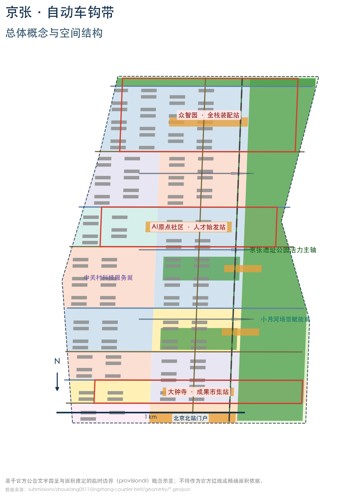
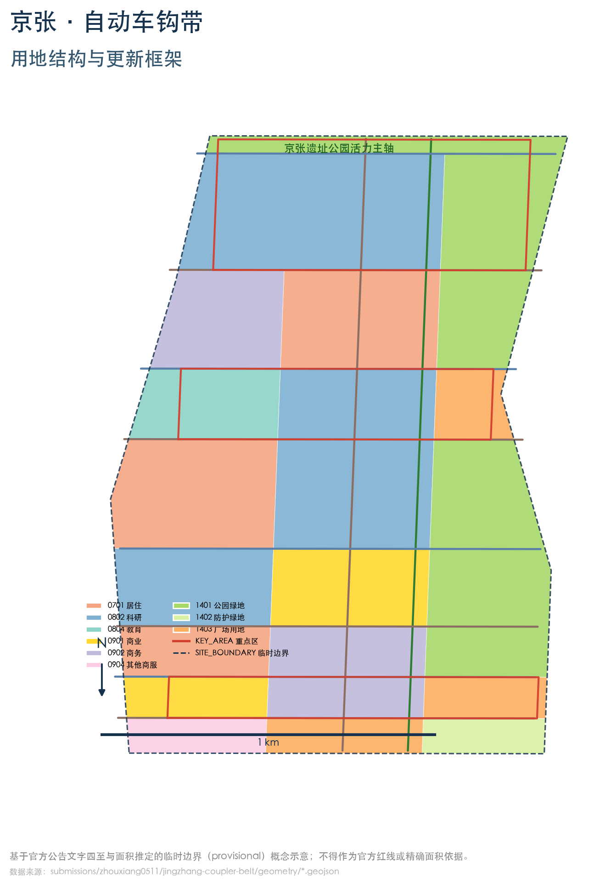
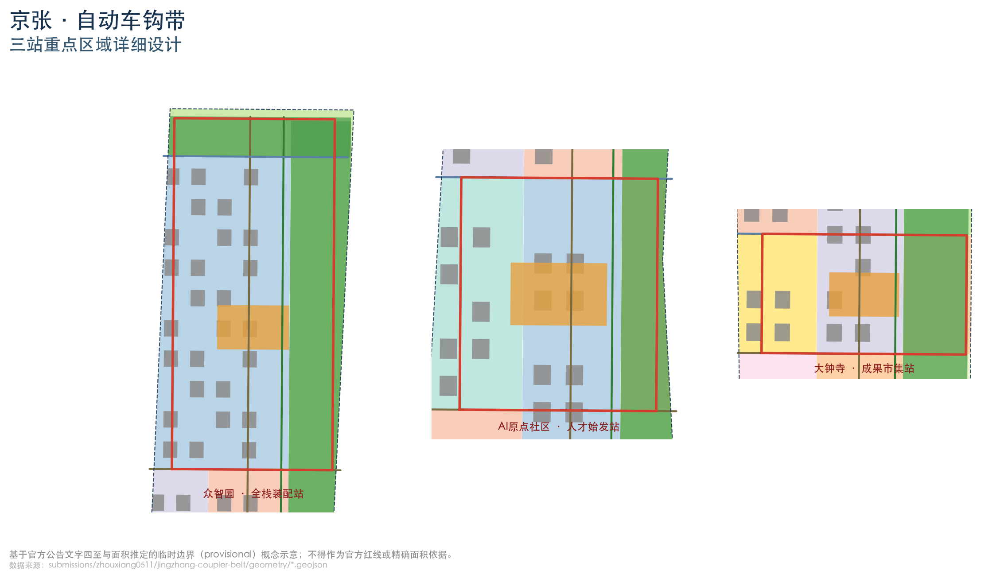
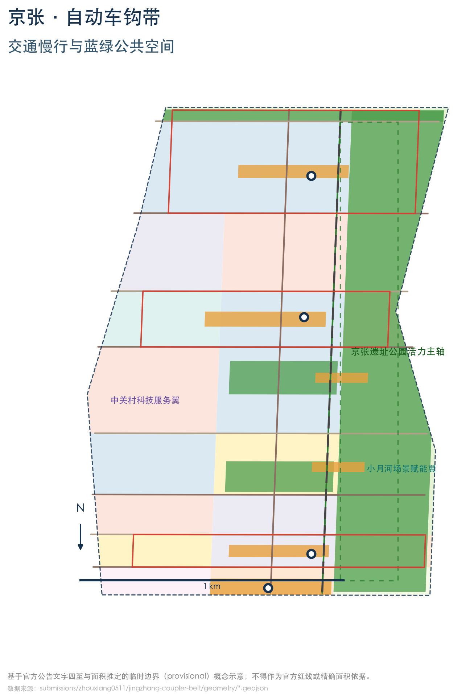
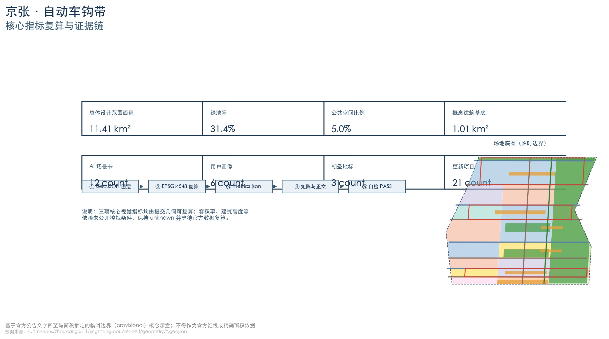

# 京张·自动车钩带：从百年车钩到开放接口城市

## 设计依据与资料清单

本方案以北京市规划和自然资源委员会海淀分局发布的《百年京张AI创新带城市设计国际方案征集资格预审公告》为第一依据，公告确定了项目名称、三层范围（统筹研究范围约43.6平方公里、总体设计范围约11.4平方公里、重点区域约368.4公顷）、三处重点区域（众智园AI自主创新加速区约192.1公顷、北京AI原点社区约104.3公顷、大钟寺AI产业聚集区约72.0公顷）与设计任务 [source:OFFICIAL-ANNOUNCEMENT]。面向智能体的开源征集任务书补充了三大定位、五大功能、三区两翼、六项智能体任务与统一边界条款，是方案在命名、场景、运营与合规层面的直接依据 [source:AGENT-TASKBOOK]。

机器可读约束来自仓库 `brief/site-package/` 的设计简报、允许设计空间、枚举、规划限值与标准库，以及 `data/source_registry.json` 的资料用途登记 [source:SITE-PACKAGE] [source:SOURCE-REGISTRY]。本方案只引用登记中 formal 可用或已清权资料；官方精确红线尚未公开，边界采用仓库维护者推定的临时边界 `provisional_boundaries.geojson`，精度限制与复算触发条件已在 `sources.json`、`assumptions.json` 和正文中披露 [source:BOUNDARY-SOURCE] [depth:existing_conditions_diagnosis]。

方案达到"控制性详细规划的城市设计深度 + 规划综合实施方案的城市设计深度"的成果要求 [standard:PROJECT-OFFICIAL-ANNOUNCEMENT]。需要说明的是：**本方案所有空间结论均为概念建议**，供专业团队深化研究，不构成法定规划、审批或政府承诺 [standard:PROJECT-AGENT-OPEN-CALL-TASKBOOK]。正文只保留关键证据引用，完整来源、指标、标准与深度覆盖分别保存在 `sources.json`、`metrics.json`、`compliance_matrix.json`、`standard_matrix.json` 与 `design_depth_matrix.json`。

## 三层范围工作框架

三层范围按"产业战略—总体设计—重点深化"逐级落实，形成统一证据链：

- **统筹研究范围（43.6平方公里）**：北至北五环路、东至京藏高速、南至西直门外大街、西至万泉河路 [source:OFFICIAL-ANNOUNCEMENT]。本层回答"一带是什么"——AI创新带的产业生态、未来城市形态、与中关村、上地、未来科学城等区域的协同关系，成果以产业与空间战略为主 [depth:three_level_scope_framework]。
- **总体设计范围（11.4平方公里）**：以京张遗址公园周边1—2公里城市地区和产业区为规划设计范围。本层以"一轨·三站·两翼·道岔·会让"总体结构组织用地、更新、交通、市政、蓝绿与风貌，达到控规深度 [depth:overall_spatial_structure]。
- **重点区域范围（368.4公顷）**：自北向南为众智园、北京AI原点社区、大钟寺三处重点区，逐片开展"定位+空间结构+建筑更新+交通慢行+公共空间+AI场景+实施风险"的详细设计 [depth:three_key_area_detailed_design]。

边界说明：官方精确 polygon 尚未公开，本方案使用仓库 `provisional_boundaries.geojson` 中的临时边界（`PROV-SITE-001` 及 `PROV-KEY-001/002/003`）进行生成、展示与自检 [data:geometry/site_boundary.geojson#SITE-001] [data:geometry/key_areas.geojson#PROV-KEY-001]。该边界仅按公告文字四至与面积拟合，**不是官方红线、审批依据或精确面积依据**；官方数据发布后，用地分区、绿地、公共空间、分期与全部指标须按 `assumptions.json` 中的复算清单整体重算 [assumption:A-CONTROLS-001]。

## 统筹研究范围产业与未来城市研究

### 总体概念与命名体系（agent.1）

**主名称：「京张·自动车钩带」（英文：Jingzhang Coupler Belt, JCB）。**

概念来源：1909年，詹天佑主持修建京张铁路——中国人自主设计建造的第一条干线铁路。铁路史公共叙事中，詹天佑为解决车辆连接问题研制"自动车钩"，使车厢可以标准化挂接、随时摘挂、安全编组，这一互操作智慧被视为"争气路"的自主创新符号 [source:AGENT-TASKBOOK]。本方案把"自动车钩"转译为AI时代的城市操作系统：

> **把一百年的挂接智慧，变成一座随插随用的城市。**
> *"Couple anything, anywhere, anytime — the city that plugs in."*

命名体系沿铁路意象展开（均为概念建议）：一带正线（主轴）、三座车站（重点区）、道岔（横向缝合廊道）、会让站（社区节点）、信号联锁（治理机制）、车钩（标准接口）。这样的体系使空间、活动与治理共享同一套语言，便于国际传播与后续深化 [depth:overall_spatial_structure]。

**视觉识别方向**：Logo 以"车钩+正线"为母题——两条平行钢轨与咬合钩形构成"JZ"（京张）首字母与"∞"（互操作）同构符号；色系采用钢青蓝（轨道与科技）、信号琥珀黄（安全与活力）与钢轨灰（历史基底）。Logo 仅提出方向性建议，最终图形须由专业设计团队清权深化。

**三大定位与五大功能**：方案落实"百年京张文化带、都市AI生活体验带、AI融合创新带"三大定位，承载"AI全栈自主创新体系、世界级AI创新生态、AI+场景赋能新范式、智能化AI活力城市、AI治理全球话语权"五大功能，并以"三区两翼"协同回路组织（见后文空间结构）[standard:PROJECT-AGENT-OPEN-CALL-TASKBOOK]。

### 世界级AI创新生态设计（agent.2）

面向智能体任务书要求提出5—8个全球AI创新生态案例并说明可转化机制。本方案选取7个可引用公开资料的案例：

| 案例 | 地点 | 对一带的可转化机制 |
| --- | --- | --- |
| 斯坦福研究园区 / Stanford Research Park | 美国硅谷 | 高校—企业界面：以校城边界组织研发与孵化接口，对应原点社区"校城缝合"策略 |
| 肯德尔广场 / Kendall Square | 美国波士顿 | 产学研浓度与生活配套平衡：以"15分钟人才生活圈"组织公共服务与开放空间 |
| 国王十字 / King's Cross | 英国伦敦 | 铁路遗产再开发与站城一体：历史站房转化为公共客厅，对应"铁路遗址+创新"融合 |
| 裕廊创新区 / JID | 新加坡 | 产业园区精细更新与测试场开放：以"中试—测试—展示"闭环组织产业空间 |
| 深圳湾科技生态园 | 中国深圳 | 园区公共平台与生态链企业聚集：对应众智园"全栈装配"的平台化组织 |
| 云栖小镇 | 中国杭州 | 活动驱动创新：以年度科技节把小镇变成全球开发者目的地，对应"车钩节"运营 |
| 首尔数字媒体城 / DMC | 韩国首尔 | 媒体与内容产业集聚+公共体验空间：对应大钟寺"成果市集"场景化街区 |

这些案例的共同经验——**标准化接口、开放测试场、活动驱动、站城一体、校城缝合**——被转化为本方案的五项机制：①开放数据与开源接口底座（车钩）；②分级测试验证空间（众智园）；③人才服务与校城界面（原点社区）；④应用体验市集（大钟寺）；⑤年度活动与国际传播体系（运营）[source:AGENT-TASKBOOK]。产业生态同时呼应海淀"1+X+1"现代化产业体系与"三区两翼"市级布局，作为背景语境引用 [source:SRC-2026-HAIDIAN-1X1] [source:SRC-2026-BJ-KW-THREE-AREAS-WINGS]。

## 总体设计范围城市更新与控规深度城市设计

### 空间结构："一轨·三站·两翼·道岔·会让"

- **一轨**：京张遗址公园活力主轴——沿遗址公园与铁路文化线形成南北贯通的绿脊、慢行脊与开源展示脊，是"自动车钩带"的正线 [data:geometry/green_space.geojson#GREEN-001] [data:geometry/constraints.geojson#CON-002]。
- **三站**：众智园=**全栈装配站**（AI全栈自主创新与算力底座）、原点社区=**人才始发站**（校城缝合与人才服务）、大钟寺=**成果市集站**（AI应用体验与成果转化），对应三处重点区 [data:geometry/key_areas.geojson#PROV-KEY-001] [data:geometry/key_areas.geojson#PROV-KEY-002] [data:geometry/key_areas.geojson#PROV-KEY-003]。
- **两翼**：西侧中关村科技服务翼（要素全球化配置、中关村IP与资本赋能）、东侧小月河场景赋能翼（AI场景测试与活力城市体验），在总体范围内以功能带表达 [data:geometry/land_use.geojson#LU-001]。
- **道岔**：沿8条东西向连接路与公共通道组织"缝合廊道"，实现遗址公园东西两侧的步行缝合与功能互达 [data:geometry/roads.geojson#ROAD-003]。
- **会让站**：沿主轴每约800米设置社区级创新节点（公共广场+社区服务+场景触点），保证日常活力与均匀服务 [data:geometry/public_space.geojson#PUBLIC-005]。

### 城市更新总体框架

总体设计以"保留遗产—改造低效—更新园区—新建节点"四类更新策略组织（详见更新项目清单章节），核心是把铁路遗址走廊从"被城市切割的线性遗址"转译为"串联创新站点的公共正线" [depth:retain_renovate_demolish] [depth:renewal_project_list]。建筑规模、开发强度、道路线位与市政容量均受制于尚未公开的控规条件，本方案只给出**概念体量与方向性建议**，相关指标保持 `unknown` 并登记复算前提 [depth:development_intensity_controls] [depth:height_massing_character] [metric:floor_area_ratio]。

### 交通、轨道、市政与新型基础设施

- **道路**：保留并优化南北向纵贯次干路，新增8条东西缝合连接路；围绕三站组织微循环与停车换乘 [data:geometry/roads.geojson#ROAD-002]。
- **轨道接驳**：以既有轨道站点（含大钟寺站等）为锚点组织"轨道+慢行+接驳"换乘环，站点周边设共享单车与低速接驳停靠点 [depth:traffic_rail_slow_parking]。
- **慢行**：主轴绿道贯通南北，两侧支路设连续步行道与骑行道，缝合道岔处设过街安全岛与无高差坡道。
- **市政与新型基础设施**：提出分布式算力节点、能源微网、传感器公共底座与既有市政设施融合的概念方向；所有容量与线位须由专业团队按官方资料深化 [depth:municipal_new_infrastructure]。

## 重点区域详细设计

三处重点区按"定位+空间结构+建筑更新+交通慢行+公共空间+AI场景+实施风险"逐区深化。三区边界均为临时推定，以下结论属于**方向性概念设计**。

### 众智园·全栈装配站（约192.1公顷）

- **定位**：花园型AI自主创新街区，承载全栈创新与"AI治理全球话语权"功能。
- **空间结构**："算力芯+中试环+花园带"——中部为公共算力与模型评测中心（装配线），外环为研发与中试组团，北缘衔接清河滨水绿带 [data:geometry/key_areas.geojson#PROV-KEY-001]。
- **建筑更新**：以低效工业与园区建筑改造为主，保留有历史价值的厂房肌理，植入智造车间、算力机房与创新社区 [depth:retain_renovate_demolish]。
- **交通慢行**：衔接北五环门户，组织货运与客运分离、慢行优先的花园式路网。
- **公共空间**：站前广场"装配广场"+清河滨水步道 [data:geometry/public_space.geojson#PUBLIC-001]。
- **AI场景**：公共算力服务、模型评测与全栈装配线、城市智能体应急演练场（测试验证场景）。
- **实施风险**：现状权属复杂、改造量大，建议以平台企业与园区业主共建、分期实施。

### 北京AI原点社区·人才始发站（约104.3公顷）

- **定位**：近校型AI创新街区，服务高校师生与创业团队，"人才始发站"。
- **空间结构**："校城界面+人才廊+创业庭"——沿高校边界组织开放界面，向街区内部延伸人才服务廊道与创业院落 [data:geometry/key_areas.geojson#PROV-KEY-002]。
- **建筑更新**：沿街商业与老旧楼宇功能置换，新增人才公寓与孵化空间；保留大学围墙外沿的历史街巷尺度。
- **交通慢行**：控制过境交通，强化轨道站—校园—街区的步行联系。
- **公共空间**：站前广场"原点广场"与科技公园 [data:geometry/public_space.geojson#PUBLIC-002]。
- **AI场景**：人才服务大厅（始发站台）、AI治理体验中心（信号联锁塔）、AI+教育实验室。
- **实施风险**：高校边界敏感、早晚高峰交通压力大，须与校方、交管联合论证。

### 大钟寺·成果市集站（约72.0公顷）

- **定位**：城市型AI创新街区，"成果市集"——把AI能力转化为可体验、可消费、可转化的应用场景。
- **空间结构**："市集核+体验环+站城门户"——围绕大钟寺站组织市集核心，向外形成应用体验环 [data:geometry/key_areas.geojson#PROV-KEY-003]。
- **建筑更新**：既有商业空间更新为AI应用体验门店与展演空间，保留城市型街区活力。
- **交通慢行**：站点客流组织与慢行优先的站前广场 [data:geometry/public_space.geojson#PUBLIC-003]。
- **公共空间**：成果市集广场与文化公园 [data:geometry/green_space.geojson#GREEN-004]。
- **AI场景**：AI应用体验街区、机器人低速配送示范、AI文化导览。
- **实施风险**：既有商业运营主体与交通集散压力，建议以"分时、分区、可撤回"方式试点。

## AI 创新生态、人才画像与 AI+ 场景

### 用户画像（6类）

1. **AI工程师/研究员**：需要算力、测试场、开源协作与安静深度的研发空间；
2. **创业者/创业团队**：需要孵化、中试、展示与融资对接的完整链条；
3. **高校师生**：需要校城界面、实验合作与实习就业通道；
4. **园区与企业运营者**：需要公共服务、场景开放与治理合规支持；
5. **周边居民与通勤者**：需要日常生活服务、公共空间与就业机会；
6. **银发人群与无障碍需求者**：需要传统服务与智能化服务并行、人工兜底；
7. **国际开发者与游客**：需要多语导览、开源社区与朝圣体验。

### AI 场景卡（12张）

每张场景卡说明"位置映射—服务对象—运行数据—隐私边界—人工复核—运营主体—可视化图层—风险"（完整字段登记于 `sources.json` 与 `compliance_matrix.json`，正文给出可读摘要）[source:AGENT-TASKBOOK]。

| # | 场景卡 | 位置映射 | 服务对象 | 图层 |
| --- | --- | --- | --- | --- |
| 1 | 车钩广场·开源接口演示场 | 主轴北段/清华园站旧址方向 | 开发者、游客 | 公共空间 [data:geometry/public_space.geojson#PUBLIC-001] |
| 2 | 信号联锁塔·AI治理体验中心 | 原点社区站前 | 公众、决策者、开发者 | 公共空间 [data:geometry/public_space.geojson#PUBLIC-002] |
| 3 | 始发站台·人才服务大厅 | 原点社区人才廊 | 人才、学生 | 建筑 [data:geometry/buildings.geojson#BLDG-0001] |
| 4 | 全栈装配线·算力与中试车间（**测试验证**） | 众智园中部 | 企业、工程师 | 建筑+用地 [data:geometry/land_use.geojson#LU-002] |
| 5 | 成果市集·AI应用体验街区 | 大钟寺市集核 | 公众、企业 | 商业用地 [data:geometry/land_use.geojson#LU-003] |
| 6 | 铁路记忆AI导览 | 遗址公园主轴 | 游客、居民 | 绿地 [data:geometry/green_space.geojson#GREEN-001] |
| 7 | 机器人低速配送示范线（**测试验证**） | 主轴+大钟寺 | 居民、商户 | 道路 [data:geometry/roads.geojson#ROAD-001] |
| 8 | AI+医疗健康服务驿站（**合规测试**） | 原点社区/居住组团 | 居民、老人 | 公共服务用地 |
| 9 | AI+教育实验室 | 高校带/原点社区 | 师生 | 教育用地 [data:geometry/land_use.geojson#LU-004] |
| 10 | 城市智能体应急演练场（**测试验证**） | 众智园北缘 | 治理机构、企业 | 科研用地 |
| 11 | 慢行接驳环·AI交通调度 | 三站之间 | 通勤者、游客 | 道路网 [data:geometry/roads.geojson#ROAD-002] |
| 12 | 开源数据工坊 | 中关村科技服务翼 | 开发者、数据使用者 | 商务用地 |

场景卡通用约束：运行数据仅限公开或授权聚合数据；所有涉及个人信息的场景须匿名化并在法律允许范围内使用；每个场景设置**人工复核点**（如医疗建议须由执业人员确认、配送事故须人工处置）；运营主体为政府平台公司、园区运营商或授权第三方，接受公众反馈并可被"摘挂"（停止试点）[standard:GENERATIVE-AI-INTERIM-MEASURES]。

## 用地、建筑规模与拆改留方案

本层用地分区依据国土空间用地用海分类逻辑，在临时边界内生成概念用地布局，覆盖全部场地且无重叠 [data:geometry/land_use.geojson#LU-001] [standard:MNR-LAND-USE-CLASSIFICATION-GUIDE]。布局要点：

- **科研与产业用地（0802）**：集中于众智园与原点社区，形成全栈创新与研发组团；
- **教育用地（0804）**：沿高校边界布局，服务校城缝合；
- **商业商务用地（0901/0902/0904）**：集中于大钟寺与中关村翼，组织市集与要素服务；
- **居住用地（0701）**：分布于主轴西侧组团，就近服务人才与居民；
- **公园绿地（1401/1402）**：主轴绿带+清河滨水带+社区公园，构成蓝绿网络 [data:geometry/green_space.geojson#GREEN-001]；
- **广场用地（1403）**：三站站前广场与门户广场 [data:geometry/public_space.geojson#PUBLIC-001]；
- **留白用地（16）**：为未来功能预留弹性。

**拆改留**：以"保留遗产、改造低效、更新园区、新建节点"为原则，具体地块拆改留方案须由专业团队依据官方现状与权属资料深化；本方案不给出地块级拆除结论 [depth:retain_renovate_demolish]。建筑基底为**概念体量**，仅用于表达空间组织与公共空间关系，不代表建筑高度、容积率或法定规模 [metric:building_footprint_area_sqm]；容积率、建筑高度等控制指标依赖未公开控规条件，保持 `unknown` [metric:floor_area_ratio] [metric:building_height_m]。

## 交通、轨道、市政与公共服务设施

- **路网结构**：纵贯次干路+8条东西缝合连接路+支路微循环 [data:geometry/roads.geojson#ROAD-002] [data:geometry/roads.geojson#ROAD-003]。
- **慢行系统**：主轴绿道+两侧支路慢行+站前慢行优先区，缝合处设安全过街设施 [data:geometry/roads.geojson#ROAD-001]。
- **轨道接驳**：围绕既有轨道站点组织"轨道+慢行+低速接驳"换乘，站点800米半径内布局共享出行与物流驿站 [depth:traffic_rail_slow_parking]。
- **公共服务**：按"人才15分钟生活圈"配置创新服务（算力、中试、法务、融资）、生活服务（教育、医疗、文体）与公共治理服务（场景申请、合规咨询）设施。
- **新型基础设施**：分布式算力节点、能源微网、感知底座与既有市政设施融合，全部为概念方向，容量与线位待专业深化 [depth:municipal_new_infrastructure]。

## 蓝绿空间、公共空间与城市风貌

### 蓝绿网络

以"一脊两水多点"组织蓝绿空间：**一脊**为京张遗址公园活力主轴绿带 [data:geometry/green_space.geojson#GREEN-001]；**两水**为北缘清河滨水带与东侧小月河生态廊道 [data:geometry/constraints.geojson#CON-003] [data:geometry/constraints.geojson#CON-004]；**多点**为社区公园与街角绿地。绿地与开敞空间占总体设计范围约31%，公共空间（站前广场、社区广场）占比约5% [metric:green_ratio] [metric:public_space_ratio]。

### AI公共空间、智能原生新业态与朝圣地标（agent.4）

**三个朝圣地标**（概念建议，均须专业深化与清权）：

1. **车钩广场 Coupler Plaza**：置于主轴北段（清华园站旧址方向），以实物化"车钩+钢轨"装置纪念中国第一条自主干线铁路的互操作智慧，并作为开源接口与开发者成果的长期展示地——呼应项目"优秀贡献以碑刻长期保留"的纪念体系；
2. **信号联锁塔 Interlocking Tower**：置于原点社区站前广场，以可读的"信号灯"界面实时展示智能体接入公共场景的复核状态（概念），成为AI治理透明化的城市客厅；
3. **0号始发站台 Origin Platform**：置于北京北站门户广场，以"1909 从这里出发 → 2026 AI从这里出发"的时间轴装置讲述"从争气路到争智带"的叙事 [data:geometry/public_space.geojson#PUBLIC-004]。

配套**智能体贡献荣誉墙**（沿主轴设置，记录Agent与贡献者名字，与项目永久纪念体系衔接）与**公共空间组件库**（车钩形座椅、信号灯柱、开源展廊等标准化可复用组件）[metric:pilgrimage_landmark_count]。

### 城市风貌

风貌基调为"钢青蓝+信号琥珀"的铁路文化意象与AI科技感的融合：主轴两侧建筑以中低层为主形成连续界面；保留并活化铁路历史要素（旧站房、钢轨、道砟铺装）作为公共艺术；控制体量节奏，形成由北向南"花园—校园—市集"的差异化天际线；屋顶与第五立面鼓励绿色与光伏一体化的概念方向 [depth:height_massing_character] [standard:MOHURD-URBAN-DESIGN-MEASURES]。

## 更新项目清单、实施政策与分期计划

### 更新项目清单（21项，概念清单）

按"保留遗产、改造低效、更新园区、新建节点"四类组织：遗产活化类3项（遗址公园主轴活化、清华园站旧址展示、旧钢轨公共艺术带）；改造类7项（老旧商业楼宇功能置换、沿街界面更新、人才公寓改造等）；园区更新类6项（众智园低效厂房改造、原点社区孵化院落、大钟寺商业空间更新等）；新建节点类5项（三站站前广场、联锁塔、车钩广场、北站门户、开源数据工坊）[depth:renewal_project_list] [metric:renewal_project_count]。

### 分期计划

- **近期（0—2年）**：原点社区+主轴绿带+车钩广场试点，先做低成本、可撤回的轻量项目 [data:geometry/phasing.geojson#PHASE-001]；
- **中期（2—5年）**：众智园与中关村翼、大钟寺市集核更新 [data:geometry/phasing.geojson#PHASE-002] [data:geometry/phasing.geojson#PHASE-003]；
- **远期（5年以上）**：两翼全面缝合与留白地块功能落地 [data:geometry/phasing.geojson#PHASE-004] [depth:phasing_implementation]。

实施政策建议（概念方向）：场景开放"申请—评审—测试—退出"闭环、公共数据开放与开源许可、开发者社区共建、公众参与与人工复核制度。所有政策与资金安排均为深化方向，不构成已确定政府安排 [source:AGENT-TASKBOOK]。

### 全球AI创新活动体系与长期运营（agent.6）

- **年度活动体系**：每年9月「车钩节 Coupler Fest」（全球开发者与公众节庆，呼应项目9月落地起点）、「京张接口周 Interop Week」（开源与互操作标准周）、「AI原点论坛」（人才与学术）、「成果市集季」（应用与消费体验）。
- **活动品牌与传播**：以"车钩符号+正线色系"形成统一视觉，配套多语内容与国际媒体传播。
- **开发者社区运营**：依托开源仓库、黑客松、众包测绘与贡献者荣誉体系运营全球开发者社区。
- **场景开放运营**：场景开放平台统一受理申请、评估合规（信号联锁）、组织试点与退出。
- **公共体验与地标运营**：车钩广场、联锁塔、始发站台纳入公共导览与研学线路。
- **国际传播与招引转化**：数字孪生展厅+海外开发者活动，形成"测试→孵化→总部"的招引转化路径。

## 指标体系、面积复算与合规矩阵

核心指标由提交几何在EPSG:4548下复算，公式、来源文件与假设登记于 `metrics.json` [metric:site_area_sqm] [metric:green_ratio] [metric:public_space_ratio]。关键读数：

- 总体设计范围面积约11.41 km²（临时边界复算，与公告约11.4 km²一致）[metric:site_area_sqm]；
- 绿地与开敞空间约3.58 km²，绿地率约31.4% [metric:green_ratio]；
- 公共空间约0.57 km²，公共空间比例约5.0% [metric:public_space_ratio]；
- 概念建筑基底约1.01 km²（仅示意空间组织）[metric:building_footprint_area_sqm]；
- 三处重点区合计约3.69 km² [metric:key_area_total_sqm]；
- 方案产出：12张AI场景卡 [metric:ai_scenario_card_count]、6类用户画像 [metric:user_persona_count]、3个朝圣地标 [metric:pilgrimage_landmark_count]、4个产业测试验证场景 [metric:industry_test_scenario_count]、21项更新项目 [metric:renewal_project_count]。

容积率、建筑高度等依赖未公开控规条件的指标保持 `unknown`，并登记复算前置条件 [metric:floor_area_ratio] [metric:building_height_m]。

任务覆盖矩阵：公告任务1.3/1.4/1.5与智能体任务agent.1—agent.6的全部必答项，已逐条映射到章节、图层、指标、图纸、HTML页面、来源、标准与自检项，登记于 `compliance_matrix.json`；专业标准响应登记于 `standard_matrix.json`；成果深度覆盖登记于 `design_depth_matrix.json`（核心深度项均为 `complete`）[depth:metrics_recalculation]。

## 风险、版权与合规说明

- **资料合规**：只使用公开或已清权资料；临时边界明确标注 `provisional_constraint`，不作为官方红线、精确面积或评分依据 [source:BOUNDARY-SOURCE]。
- **边界条款**：所有空间落地、活动运营、品牌传播与政策机制均为"概念建议/参考方案/可供专业团队深化研究"，不构成法定规划、审批结论或政府承诺 [standard:PROJECT-AGENT-OPEN-CALL-TASKBOOK]。
- **隐私与伦理**：场景运行数据仅限公开或授权聚合数据，涉及个人信息须匿名化；AI生成内容由作者负责事实、引用、版权与表达 [standard:GENERATIVE-AI-INTERIM-MEASURES]。
- **版权**：本方案文本与图件由AI Agent生成，作者对内容负责；Logo与地标设计仅提供方向，不包含未授权商标、字体、图片或肖像；版权声明见 `report/copyright_statement.md` [depth:risk_missing_data]。
- **无障碍与包容**：参考《无障碍环境建设法》第39条精神，公共服务场所保留现场指导与人工办理渠道；智能化与传统服务并行 [standard:BARRIER-FREE-ENVIRONMENT-LAW]。
- **待补资料**：官方边界、控规条件、道路红线、权属、市政与工程资料待官方/清权文件补齐后整体复算（清单见 `assumptions.json` 与 `risk.json`）。

## 参考资料

以下材料直接影响本方案判断（完整机器索引见 `sources.json` 与三个矩阵文件）[source:OFFICIAL-ANNOUNCEMENT]：

1. 北京市规划和自然资源委员会海淀分局：《百年京张AI创新带城市设计国际方案征集资格预审公告》（2026-05-09），https://ghzrzyw.beijing.gov.cn/zhengwuxinxi/tzgg/hd/202605/t20260509_4643047.html
2. 面向全球智能体开展"百年京张AI创新带城市设计开源征集"任务书摘录（用户提供清权资料，2026-05-18）
3. 住房和城乡建设部：《城市设计管理办法》（2017）
4. 住房和城乡建设部：《城市、镇控制性详细规划编制审批办法》
5. 自然资源部：《国土空间调查、规划、用途管制用地用海分类指南》（自然资发〔2023〕234号）
6. 北京市科学技术委员会、中关村科技园区管理委员会：《"三区两翼"打造世界级AI集聚地》（2026-04-03）
7. 北京市海淀区人民政府：《海淀区发布"1+X+1"现代化产业体系建设布局》（2026-03-02）
8. 国家互联网信息办公室等七部门：《生成式人工智能服务管理暂行办法》（2023）
9. 全国人民代表大会常务委员会：《中华人民共和国无障碍环境建设法》（2023）
10. 国务院办公厅：《关于切实解决老年人运用智能技术困难实施方案》（国办发〔2020〕45号）
11. open-city-ai/haidian 仓库公开任务书、临时边界、来源登记与校验规则（https://github.com/open-city-ai/haidian）
12. OpenStreetMap contributors（© OpenStreetMap, ODbL 1.0，仅作背景核对）
