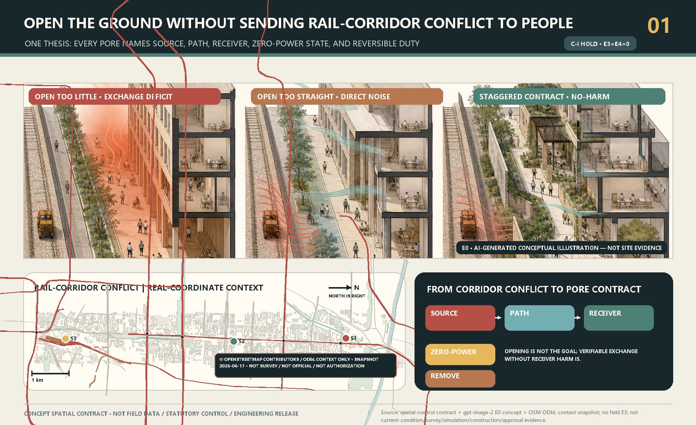
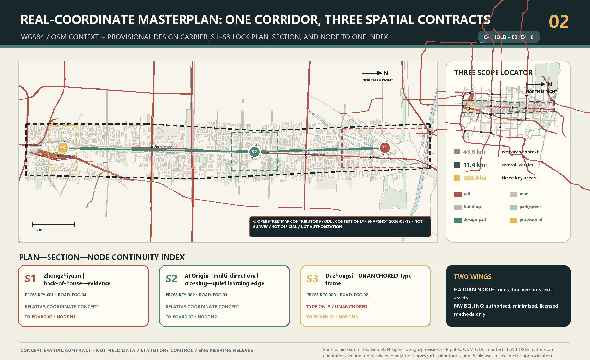
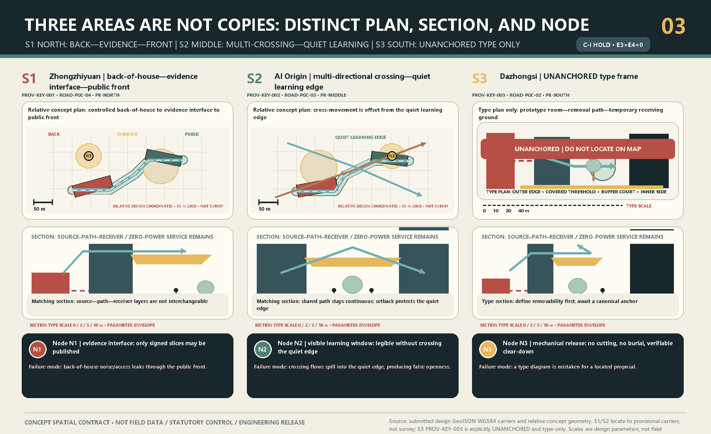
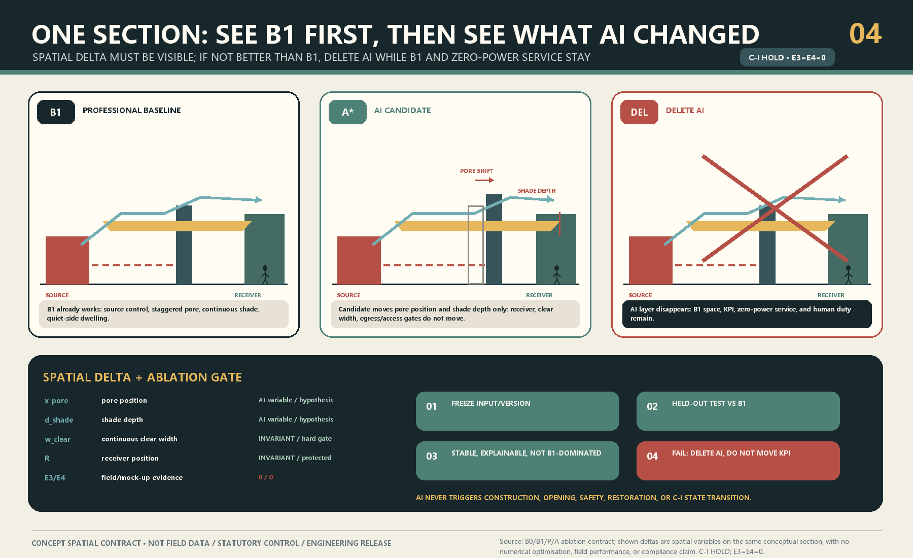
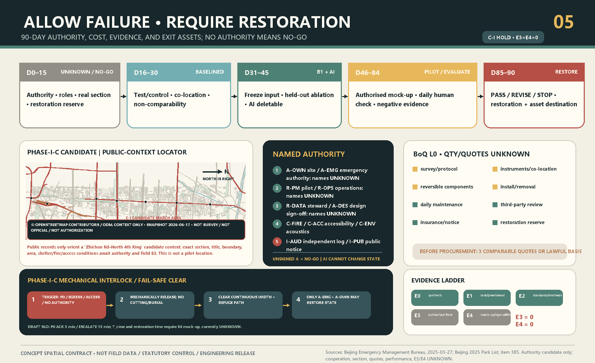

# JINGZHANG BREATHES — THE POROUS GROUND CONTRACT

> **OPEN THE GROUND, NOT A DIRECT NOISE PATH.** Draw the source, path and human receiver surface before deciding where to open, turn, shade and dwell. Sensors only verify; AI only compares design-time alternatives. With power, network and model off, the path, shade, staggered porosity and quiet side must still work.

**Honest current status:** `C-S` is a formal-v2 concept-spatial candidate; machine gates and independent blind review must read the exact packet records and cannot be replaced by this status sentence. `C-I` is `HOLD`. There is no real transect, written authority, E3 site baseline or E4 mock-up/restoration evidence. The package claims no validation, implementation, annual effect, health outcome, statutory compliance or government commitment. Repository geometry is provisional; `PROV-KEY-003` is not reliably anchored to real Dazhongsi station-city conditions.

**Five falsifiable clauses:** (1) Opening too little can retain heat or limit exchange; an opening too straight creates a direct path that transmits noise to an occupied receiver. (2) `B0 / B1 / P / A`: B0 is read-only baseline, B1 is the manual rule baseline, P is the drawable parameter family, and A is design-time AI search; held-out ablation that is unstable or does not outperform B1 removes the AI. (3) `PROV-KEY-003` is an unanchored rough provisional polygon, not a real Dazhongsi site. (4) E0 is concept, E1 provisional material, E2 public method, E3 authorised field baseline, and E4 reversible mock-up plus restoration evidence; current E3/E4 do not exist and `C-I HOLD`. (5) AI has no authority to approve openings, construction, state transitions, safety release, or restoration. With zero power or power failure, network failure and model removal, the path, shade, staggered porosity and quiet side remain in service.[metric:e3_site_evidence_count] [metric:e4_implementation_evidence_count]

## Design Basis and Source List

The proposal answers the official three levels, three areas/two wings and agent.1—agent.6 through one non-portable spatial proposition. Along the former-rail innovation corridor, the northern R&D/test edge, central campus-neighbourhood passage and southern arrival interface each need opening without transmitting noise directly to people. If replacing Jing-Zhang and the three areas leaves the causal sequence unchanged, the design has failed.[source:OFFICIAL-ANNOUNCEMENT] [source:AGENT-TASKBOOK] [source:SITE-PACKAGE]

The overall and key-area geometries are rough provisional carriers. `SITE-001` is not an official redline; the rectangles are not parcels, roads or engineering boundaries; Dazhongsi supports a named type study only, not station-exit, quadrant, distance or capacity claims.[source:BOUNDARY-SOURCE] [source:KEY-AREA-SOURCE] [data:geometry/key_areas.geojson#PROV-KEY-003]

Urban design, regulatory-plan boundaries and land classification are controlled by the local matrices. With no official controls, building survey, roads, title or utilities, the partition is a non-statutory research overlay and retain/renovate/demolish, FAR and height remain `UNKNOWN`.[standard:MOHURD-URBAN-DESIGN-MEASURES] [standard:MOHURD-CONTROL-DETAILED-PLANNING] [standard:MNR-LAND-USE-CLASSIFICATION-GUIDE]

Air, climate and noise sources define professional method boundaries; they prove no local condition or effect. Acoustics uses source-path-receiver logic, while real wind, heat, air and sound variables require an authorised transect and qualified professionals.[source:MEE-GB3095-2026] [source:MEE-GB3096-2008] [source:MEE-HJ24-2021]

The package also registers a public ODbL OSM background snapshot with `3,653` features: railway 283, road 1,065, named context 55, station 24, water 96, park 147, building 1,911 and land use 72. It supports orientation and section indexing only. It is **not** a current survey, official/canonical boundary, title record, accessible route, fire condition, sound/heat/emission source inventory, operating fact or authority; every feature still requires verification before professional use.[source:OSM-CORRIDOR-CONTEXT-2026] [metric:osm_context_feature_count]

## Three-Level Scope Framework

| Level | Irreplaceable question | Delivery | Forbidden inference |
| --- | --- | --- | --- |
| 43.6 km² coordinated study | Which expertise, tools, regional context and wings support a reproducible method? | Source-path-receiver framework, versioned B1 rules, professional review and transfer gate | No parcel plan or official ventilation corridor |
| 11.4 km² overall design | How can the former-rail corridor open without direct transmission? | Causal learning spine, three sections, shaded path, quiet sides and evidence nodes | Not a real rail/road/access route |
| 368.4 ha key areas | How do three conflicts become non-interchangeable prototypes? | Source-public, passage-dwell and arrival-quiet-side types | No real condition from rough rectangles |

The levels are not scale copies. The coordinated level governs method and transfer eligibility; the overall level governs the contract network; each key area attempts to falsify it through a reviewable section.[depth:three_level_scope_framework] [depth:overall_spatial_structure] [data:geometry/roads.geojson#ROAD-PGC-01]

The taskbook's three positions and five functions are not eight extra slogans; the same contract makes each reviewable. The Centennial Jing-Zhang Cultural Belt admits railway engineering history, public dimensions and maintenance records only after source registration and review as curatorial input. The Metropolitan AI Life Experience Belt requires phone-free and zero-power shaded passage and quiet sides. The AI-Integrated Innovation Belt runs north constraints → central comparison/translation → southern authorised adoption or exit. The full-stack function is `B0→B1→P→A→ablate/delete`; the world-class ecosystem function is six cases/eight elements with apply—allocate—record—exit gates; the AI+ paradigm is 12 stoppable scenario cards; the active AI city begins with passive form and human operation; global AI-governance voice is only a bilingual, replayable Open Section Protocol that publishes negative results, not a government position or international standard.[source:AGENT-TASKBOOK]

## Coordinated Research Area: Industry and Future City Research

“Full-stack AI” is a design-production chain in which AI can be removed. B0 is a read-only authorised baseline. B1 is the manual rule solution by planning, architecture, landscape, environment, acoustics, fire and accessibility professionals. P converts opening position, offset, buffer depth, shade continuity, receiver surface and maintenance access into drawable parameters. A searches Pareto alternatives only on frozen inputs and held-out scenarios. If AI cannot stably and explainably find an alternative not dominated by B1, AI is deleted while the B1 public service remains.[source:LADYBUG-TOOLS-METHOD] [source:OPENFOAM-METHOD] [source:NOISEMODELLING-METHOD]

The Zhongguancun Technology Service Wing exchanges versioned rules, tool manifests, professional methods and failure/replay assets. The Xiaoyue River Scenario Empowerment Wing exchanges only authorised, de-identified scenario methods and ordinary-maintenance lessons. Every transfer repeats B1, provenance, authority and no-harm review; geometry, thresholds and effects never transfer automatically.[source:AGENT-TASKBOOK] [depth:existing_conditions_diagnosis]

### agent.2: Six Mechanism Cases, Not a Brand Ranking

| Case | Verifiable mechanism | Do not copy | Spatial consequence for Jing-Zhang |
| --- | --- | --- | --- |
| one-north / LaunchPad | Public master development, modular space, ground-floor showcase, organised testbed and one-stop service | JTC land/master-developer powers, estate scale and future projects; the Punggol platform is not at one-north | Divide the ground floor into time-limited modules, an evidence window and controlled test space; separately clear egress/access/sound/heat/restoration [source:CASE-SG-JTC-LAUNCHPAD-2026] |
| Paris-Saclay / DATAIA / Jean Zay | Public development, research/education network and application-based compute/data allocation | National research system, supercomputer scale, France 2030 and heat network | Keep compute backstage/off-site; the ground floor shows request-allocation-energy/provenance-result-delete/archive only [source:CASE-FR-IDRIS-ALLOCATIONS] [source:CASE-FR-GENCI-JEAN-ZAY] |
| MaRS / Vector | Heritage building and common atrium beside wet/dry labs, restricted research and talent/adoption service | Co-location and self-reported scale do not prove spillover; labs cannot become boundaryless | Draw public frontstage—observable boundary—authorised backstage with distinct access, air, data and closure controls [source:CASE-CA-MARS-CENTRE] [source:CASE-CA-VECTOR-ABOUT] |
| Brainport / HTCE | Annual triple-helix agenda, shared lab/cleanroom/pilot-production facilities and space-talent linkage | National funding, anchor firms and supply chain; official sources acknowledge housing/transport/energy pressure | Wing services use booking, qualification, maintenance and exit fields; tests also record housing/commute/grid/logistics/public-path burdens [source:CASE-NL-BRAINPORT-AGENDA] [source:CASE-NL-GOV-BEETHOVEN] |
| Hazelwood Green / CMU | Brownfield regeneration, reconfigurable indoor/outdoor test ground, limited public commons and community-benefit goals | Community goals do not prove delivered benefit; foundation/university/federal funding does not transfer | First separate public route, controlled test field, emergency stop zone and PARK/restoration location; the public route is not a machine buffer [source:CASE-US-CMU-RIC] [source:CASE-US-HG-NEIGHBORHOOD-PLAN] |
| Barcelona 22@ | Long industrial-land transition, infrastructure burdens, factory reuse and later inclusion correction | No proven equivalent Jing-Zhang rezoning/value-capture power; 22@ is not an AI-stack performance template | Obligations follow each time-limited opening right: no release without public path, quiet side, maintenance, data, safety and restoration [source:CASE-ES-BCN-IMU-2024] [source:CASE-ES-22AT-2008] |

The cases prove only that the relevant first-party institutions publicly describe these mechanisms. They do not prove causal success or generate Jing-Zhang firms, funding, compute, policy or targets. Thirty first-party records include publisher/title/URL/date/use/limits/licence. Except the explicitly CC BY 4.0 2008 22@ record, they are factually paraphrased without copied figures.[metric:global_case_study_count] [metric:global_case_first_party_source_count]

### Seven Designated Neighbours: Five-Field Non-Substitutability

| Neighbour | Claim difference | Mechanism difference | Spatial-consequence difference | Evidence difference | Exit difference |
| --- | --- | --- | --- | --- | --- |
| THE BREATHING LINE | No broad breathing/climate corridor; only “exchange opening must not directly transmit noise” | Per-opening source-path-receiver plus six vetoes, not spine/courts/gaps+sensing | Every opening draws source, bend, human receiver and zero-power state | Authorised matched B0/B1 multi-physics transect, not sensing calibration alone | Beyond AI-off: failed opening SX→remove/delete→S10 [source:PEER-THE-BREATHING-LINE] |
| Urban-Form-First V6 | Form-first/open ground is not the distinction; the three-physics conflict is | AI only searches frozen P and is deleted if not better than B1; no algorithmic line/surface/phasing authority | Offset backstage—evidence boundary—frontstage plus quiet side | Six hard gates+B1/A equal-budget ablation, not aggregate value passport | Delete A→B1/CLEAR; Day 90 needs S10 or new authority [source:PEER-URBAN-FORM-FIRST-V6] |
| THE SEASON LINE | No seasonal/annual public-room promise | Fixed passive B1+per-use authority; no runtime seasonal switching | Shade/rain cover is a non-offsettable constraint, not branded node | Matched weather/source pairing; no annual extrapolation from 90 days | Without limited PASS, remove, restore and close data [source:PEER-THE-SEASON-LINE] |
| SHADE THE CLOUD | No compute-for-coolth exchange; shade serves zero-power path/heat gate | Resource allocation/cost provenance+offset sound-heat section, not heat-budget commons | No spine/three cool islands; each opening clears sound/passage/emergency/maintenance | Heat, sound, air and energy ledgers cannot offset one another | Isolated reserve closes components, surface, data and acceptance [source:PEER-SHADE-THE-CLOUD] |
| Smart Waiting | No smart waiting/dynamic comfort, only fixed passive minimum service | AI design-time only; humans/mechanics own opening, emergency and transition | Zero-power path+offset+quiet side+C-CLEAR, not six-state waiting gate | Test B1 zero-power, signed transitions and mechanical clear, not AI switch rate | Delete A→freeze P→B1→CLEAR/close→remove→RESTORED [source:PEER-SMART-WAITING] |
| Sonic Commons | No sonic commons; sound only vetoes direct-noise openings | No machine listening; physical offset/source control/quiet side+paired measure | Sound changes opening position, bend and receiver, not a soundscape network | Sound joins heat/air/access/fire/maintenance hard gates | Complaint conflict stops first; instruments cannot dismiss it; remove/restore [source:PEER-SONIC-COMMONS] |
| THE SECOND SURVEY | Sections/open ground/90 days are not unique; only multi-physics opening acceptance is | No aggregate worst-section siting; first authority/source-path-receiver, then gates/ablation | No general opening of low-score fronts; offset/shade/quiet/emergency-maintenance must all clear P | Freeze source/weather/error; one exceedance fails; AI must beat B1 held-out | Not reprioritisation only; no PASS or any harm gives SX→S10 [source:PEER-THE-SECOND-SURVEY] |

The machine-readable authority is `simulation.json#design_evidence.nearest_neighbor_difference`; every row has `claim_difference / mechanism_difference / spatial_consequence_difference / evidence_difference / exit_difference`. It contains exactly these seven neighbours and no expanded set.[metric:nearest_neighbor_difference_count]

### Eight-Element Ecosystem Map: Every Arrow Has a Gate

| Element | Ground/corridor carrier | Exchange asset | Minimum responsibility and release gate | Current state |
| --- | --- | --- | --- | --- |
| Land | Former-rail corridor, station/under-bridge and provisional carriers | Authority boundary, no-touch list and term | A-OWN/R-PM; title, return, heritage/public passage | `UNKNOWN/HOLD` |
| Space | Opening, shaded walk, court, quiet side and backstage | Source-path-receiver section, front/interface/backstage, zero-power state | A-DES/R-OPS plus fire/access/environment veto | `E0 only` |
| Industry | North invention—central translation—south adoption/exit | Real problem, B1, prototype and adoption/exit condition | Named demand and a simpler non-AI baseline first | No firm commitment |
| Finance | Service-wing audit desk and authorised work package | Purpose, Gate, ceiling, conflict and restoration reserve | A-OWN/I-AUD; failure, maintenance and restoration funded | `UNKNOWN/unfunded` |
| Talent | Campus-park-community path and accountable duty shift | Qualification, hours, responsible role and scenario destination | Training converts to an authorised accountable role | `UNKNOWN` |
| Compute | Controlled backstage/off-site node; audit window only at ground | Job ID, quota, versions, energy, result, delete/archive | R-DATA/I-AUD; need, provenance and disposition reviewable | No resource/agreement |
| Data | Controlled capture, de-identified evidence window and registry | Purpose, minimum fields, access, retention and deletion proof | R-DATA; refusal, no prohibited personal data, signed deletion evidence required before closure | No field authority |
| Scenario | Authorised reversible test field and public experience path | Owner, time, safety radius, stop and restoration receipt | A-OWN/R-OPS; real demand, complaint and RESTORED | `E3=0/E4=0 NO-GO` |

The production loop is land authority → controlled space → real industry problem → data contract → compute allocation → B1/prototype → authorised scenario → positive and negative evidence → human adoption/modification/exit. The public loop begins with everyday burden, passes through minimum data and a reversible mock-up, then returns complaints, maintenance and negative results to the human Gate. The north therefore **invents/contains**, the centre **translates/compares**, and the south **adopts/exits**. The Zhongguancun wing supplies IP/finance/talent/compute/professional review; the Xiaoyue River wing supplies authorised scenario/feedback/maintenance/negative evidence. Neither can release space.[metric:ecosystem_element_count]

The identity is an offset bracket/turn, not a wind arrow, sensor or luminous green line. The international line—`OPEN THE GROUND, NOT A DIRECT NOISE PATH.`—turns AI governance into a visible promise of comparison, deletion and restoration.

## Overall Design Area: Urban Renewal and Regulatory-Plan-Level Urban Design

The minimum spatial service atom is a continuous, zero-power-legible, accessible shaded passage between two authorised controls; a title/fire-checked air path; a quiet dwell surface not directly aimed at a source; and test/control, duty, stop and restore evidence. It is not a sensor pole or environmental score.[data:geometry/green_space.geojson#GREEN-PGC-01] [data:geometry/public_space.geojson#PUBLIC-PGC-01] [metric:passive_service_required_ratio]

Every opening passes six no-harm dimensions: air exchange, heat exposure, noise, accessibility, fire/evacuation and maintenance. Improvement in one cannot offset harm in another; averages cannot hide midday, heatwave, source-full-load, event-release or night envelopes. GB/T 37529 and QX/T 437 show that climate/ventilation claims require data and analysis; this proposal declares no official ventilation corridor.[standard:CMA-GBT37529-2019] [source:CMA-QXT437-2018]

Five land polygons provide complete package topology only; six building footprints diagram source and receiver interfaces. Retain/renovate/demolish remains `UNKNOWN`. Canonical geometry triggers full regeneration of nine layers, metrics, figures, PDFs and HTML.[data:geometry/land_use.geojson#LU-PGC-01] [data:geometry/buildings.geojson#BLDG-PGC-01] [metric:land_use_partition_ratio]

## Detailed Design of Key Areas

### A Northern Zhongzhiyuan: source to public

Real equipment, activity, heat/emission sources and operating boundaries are unknown. The grammar is source-side control first, staggered porosity, continuous shaded public walk and a quiet review pocket, with test points separated from the public route. Zhongzhiyuan remains a non-interchangeable type prototype, not the priority real evidence segment. Phase I Section C is a separate authorisation lead and cannot retroactively anchor Zhongzhiyuan's temporary rectangle as a real site.[data:geometry/roads.geojson#ROAD-PGC-04] [data:geometry/public_space.geojson#PUBLIC-PGC-03]

### B Central AI Origin: passage to dwell

The ground stays permeable in multiple directions, but openings are offset; a shared shaded court turns the path; the learning edge sits on the quiet side; night and day do not depend on screens or access apps. A straight acoustic tube, re-sealing for quiet, or paywalled shade is failure. Title, schedule and campus/community authority remain `UNKNOWN`.[data:geometry/roads.geojson#ROAD-PGC-03] [data:geometry/public_space.geojson#PUBLIC-PGC-02]

### C Southern Dazhongsi type: arrival to quiet side

Only a type—outer arrival edge, covered threshold, turning buffer court and quiet inner side—is drawn. `PROV-KEY-003` is unanchored, so `PHASE-PGC-01` stays NO-GO until canonical geometry, transport/source evidence, title and management authority exist.[data:geometry/phasing.geojson#PHASE-PGC-01] [metric:dazhongsi_geometry_anchor]

The three types are not copied nodes: the north controls source-public exposure, the middle holds passage and dwell together, and the south grades a strong arrival source into a quiet side. If all three collapse to trees, pavilions and sensors, the proposal stops.[depth:three_key_area_detailed_design]

## AI Innovation Ecosystem, Personas, and AI+ Scenarios

Six personas describe spatial failure burdens only; no person or health status is identified. Each is traceable to scenarios, space and operating/exit duty.[metric:persona_count] [source:BARRIER-FREE-ENVIRONMENT-LAW]

| Persona | Minimum right and scenarios | Spatial placement | Operation / exit duty |
| --- | --- | --- | --- |
| P01 mobility-limited traveller/caregiver | SC03/04/06: continuous phone-free, zero-power passage | central clear width, shade and visible path | C-ACC accompanied audit; one barrier closes/restores |
| P02 outdoor/night worker | SC02/07/11: truthful conditions and quiet rest edge | northern source screen; southern type quiet side | R-OPS daily check; complaint/harm cannot be offset |
| P03 learner | SC04/05/11: passage must not turn learning into noise receiver | central turn court and quiet learning edge | authorised campus/community body + acoustics; stop if quiet side worsens |
| P04 R&D/test worker | SC01/02/10: exchange without exposing the public | northern back—evidence—public layering | A-DES/C-ENV source+B1 record; delete AI if no gain |
| P05 transfer/international visitor | SC05/07/08: legible arrival without surveillance/App | southern threshold—buffer—quiet-side type only | NO-GO before canonical anchor; retract if shown as real site |
| P06 maintenance/professional reviewer | SC03/09/10/12: auditable duty, missing data, negatives and restoration | maintenance access, PARK, ledger/restore table | primary+alternate+independent record; Day90 restores absent new authority |

| Scenario | Conflict | B1 / AI | Human gate and stop |
| --- | --- | --- | --- |
| 01 Unknown northern source | No inventory | B1=NO-GO; no AI | Named inventory; stop if separation fails |
| 02 Source exchange/public quiet (industry) | Too closed/too straight | B1 offset+shade; AI non-dominated alternatives only | Multi-professional no-harm |
| 03 Power/network outage | Digital layer zero | Full B1; delete AI | Zero-power walk |
| 04 Central passage peak | Movement pressure | Multi-direction B1; AI compares trade-offs | Authority+accessible accompanied walk |
| 05 Direct path to learning edge (industry) | Acoustic tube | B1 turn court; AI cannot certify | Paired acoustic method |
| 06 Child/caregiver walk | Visibility/shade/access | Human walk first | Stop on any barrier |
| 07 Southern arrival/wait | Arrival versus quiet side | Type B1 only | No siting before canonical geometry |
| 08 Unanchored Dazhongsi | Displaced polygon risk | Disable AI siting | Stop on exit/quadrant claim |
| 09 Sensor drift | Incomparable evidence | Suspend claims | Return UNKNOWN |
| 10 No AI gain (industry) | Held-out/perturbation failure | Delete AI, keep B1 | Never change KPI to save AI |
| 11 Complaint/adverse result | Multi-physics harm | Human closure/restoration | No offsetting harm with one benefit |
| 12 Day-90 exit | Pilot lock-in | Signed decision then restore | No extension without new authority |

The authoritative 12-card, six-persona and three-industry-test structure is in `simulation.json`.[metric:scenario_card_count] [metric:industry_test_count]

Three pilgrimage nodes expose AI limits rather than celebrate an algorithm: Zhongzhiyuan’s Opening Ledger displays B1, AI alternatives, rejection and uncertainty; AI Origin’s Turn Court makes passage and quiet side physically legible; the Dazhongsi-type Restore Table records stopping, restoration and asset destination and remains unanchored.[data:geometry/public_space.geojson#PUBLIC-PGC-06] [metric:pilgrimage_node_count]

The honour system is not a celebrity wall. It publishes only verifiable contribution units: rule versions, replay records, rejected options, negative results, repair duty and restoration receipt; people or institutions appear only with permission. The component library has five reversible obligation types—offset gate, continuous shade, quiet-side edge, evidence window and mechanical PARK/clear-down piece. Each carries clear-width, fire/access, maintenance, removal and return fields and cannot be procured from a concept drawing. Nodes, contribution units and obligation components answer agent.4 without trading publicness for consumption or screens.[source:AGENT-TASKBOOK]

## Land Use, Building Scale, and Retain-Renovate-Demolish Strategy

The land-use map is a non-statutory programme-study partition; complete coverage serves topology and narrative only. Building features express source/receiver morphology, not current or planned buildings. FAR, height, density, current area, title and each retain/renovate/demolish decision remain `UNKNOWN`. The building-environment code is a deepening interface, not an outdoor compliance claim.[standard:MOHURD-GB55016-2021] [metric:floor_area_ratio]

A future professional team must build the asset register from surveys, title/lease, fire, structure, MEP, heritage and operations. Each opening needs its own structural, enclosure, fire and source review; this diagram produces no construction quantity.[depth:height_massing_character] [depth:retain_renovate_demolish]

## Transport, Rail, Municipal Infrastructure, and Public Services

`ROAD-PGC-01` is a north-middle-south causal learning spine, not rail, road, station connection or accessible route. The three turning transects are drawable parameters, not proof of terrain, slope, right-of-way, fire or traffic safety. Transport, rail, parking, municipal, energy and digital infrastructure await professional data.[data:geometry/roads.geojson#ROAD-PGC-01] [depth:traffic_rail_slow_parking] [depth:municipal_new_infrastructure]

Environmental instruments and local compute serve co-location, design comparison and evidence archiving only. They never open/close space, control building/equipment, issue health advice or statutory findings. Paper notices, ordinary maintenance, route, shade and quiet side survive power/network failure.

## Blue-Green Network, Public Space, and Urban Character

The blue-green layer diagrams passive shade, ordinary planting maintenance and a quiet-side interface. It claims no canopy, cooling, pollutant reduction, stormwater or statutory green-space supply. Public space stays non-commercial, continuously accessible and phone-free.[data:geometry/green_space.geojson#GREEN-PGC-01] [metric:green_ratio] [metric:public_space_ratio]

Culture turns public dimensions, sections, checking and maintenance—not copied railway imagery—into AI culture. A qualified curator must first build a register of artefact/date/source/licence/display scope; Zhongguancun culture is carried by open methods, replay and learning from failure, not corporate logos or portraits. Wayfinding has three layers: belt identity uses only pore/bend/receiver abstractions; spatial signs mark source, public front, quiet side and maintenance/egress; evidence signs show version, E-level, UNKNOWN, duty and exit state. The bilingual communication line is “Open the ground, not a direct noise path / 让地面打开，不让噪声直送到人”; it is not the belt logo, a standard or official endorsement.[standard:PROJECT-AGENT-OPEN-CALL-TASKBOOK] [depth:blue_green_public_space]

Annual operation is a loop, not an event list. Spring's Centennial Section Open Class curates registered-source history and proposed sections, with factual status kept explicit. Summer's Porosity Blind-Test Week lets a developer community submit B1/AI options against one frozen input; professionals may reject all. Autumn's Negative Results Exhibition publishes missing data, complaints, non-transfer and deletion. Winter's Restore and Sign-off Day closes temporary occupation and records asset destinations. Developers maintain versions, reproducibility and issues, never field control. Scenario access follows application—authority—B1—ablation—reversible mock-up—exit. The public route reads the Opening Ledger—Turn Court—Restore Table causal chain. The bilingual Open Section Protocol transfers only clearly licensed methods; any international or attraction conversion must pass source licence, applicability, named authority, public no-harm, cost/maintenance and exit gates. Failure creates a research record, never a recruitment, funding or government promise.[metric:culture_operation_count]

## Renewal Projects, Implementation Policy, and Phasing

Official public records make the authority path more concrete than guessing a point. Beijing’s emergency register identifies Jing-Zhang Railway Heritage Park Phase I Section C (Zhichun Road to the North Fourth Ring, 118,300 m²) as a Type III emergency shelter considering other hazards. The 2025 park directory lists the same address range and Haidian District Park Management Center as competent unit. The government portal records the 2023 Phase-I opening and under-bridge/limited rail-opening connectivity. The 2026 Haidian report says corridor regulatory planning passed technical review, while approval and implementation remain a next step; it also says main works in implementable Phase-II areas were completed. It is not the final approved plan.[source:BEIJING-EMERGENCY-JZ-C-2025] [source:BEIJING-PARK-DIRECTORY-2025] [source:BEIJING-JZ-PARK-OPEN-2023]

Section C is therefore an evidence-segment candidate for requesting written authority and a real transect. It is not a canonical key-area site and not an approved pilot. The real transect is `UNKNOWN`, performance is `UNKNOWN`, and written authorization is `UNKNOWN`. The listed Park Management Center is a candidate contact, not consent, funding or a duty assignment. Any study must not weaken emergency shelter capacity, must not obstruct egress, must not obstruct accessibility, and must not impede fire access; qualified emergency/fire/access review outranks environmental optimisation. The current state remains `UNKNOWN / NO-GO`.[source:HAIDIAN-GOV-REPORT-2026] [metric:authorized_real_pilot_site_count]

| Days | State | Named delivery | Failure default |
| --- | --- | --- | --- |
| 0–15 | UNKNOWN/NO-GO | Authority, RACI, real transect, source inventory, fire/access/privacy, restoration budget | Concept only |
| 16–30 | BASELINED | Paired B0, co-location/calibration and signed data quality | Return UNKNOWN |
| 31–45 | B1_READY / AI_COMPARED | B1, frozen inputs, held-out ablation and rejection reasons | Delete AI or redraw |
| 46–70 | MOCKUP_AUTHORIZED / PILOT_OPEN | Authorised reversible mock-up and daily human opening check | Close and restore |
| 71–84 | EVALUATING | Matched remeasurement, missingness, complaints and negative results | No causal claim |
| 85–90 | PASS/REVISE/STOP → RESTORED | Named decision, removal/retention authority, asset destination and restoration | No pilot lock-in |

### Unsigned State-by-State RACI and SLOs

Everything below is a contract-admission target, **not an appointment, observed response performance or service commitment**. Excluding the public channel `I-PUB`, the primary and alternate for all 11 signable seats among the 12 seats are `UNKNOWN / UNSIGNED`. If both primary and alternate are vacant, the seat's fail-closed consequence applies. AI is not a RACI seat.[source:CONTROL-CONTRACT-V2] [metric:unsigned_signable_raci_seat_count]

| Seat | Primary / alternate | Vacancy consequence |
| --- | --- | --- |
| A-OWN asset/site | `UNKNOWN / UNKNOWN` | No site action |
| A-EMG emergency release | `UNKNOWN / UNKNOWN` | Section C permanently NO-GO |
| A-DES design freeze | `UNKNOWN / UNKNOWN` | B0 only |
| R-PM contract/state ledger | `UNKNOWN / UNKNOWN` | No state advance |
| R-OPS open/stop/maintain | `UNKNOWN / UNKNOWN` | Closed or CLEAR |
| R-MEAS measurement/error | `UNKNOWN / UNKNOWN` | No performance conclusion |
| R-DATA minimise/delete | `UNKNOWN / UNKNOWN` | Stop collection and delete |
| C-FIRE / C-ACC / C-ENV | all three `UNKNOWN / UNKNOWN` | Relevant hard gate cannot release |
| I-AUD independent witness | `UNKNOWN / UNKNOWN` | C-I remains HOLD |
| I-PUB accessible notice/appeal | public channel, not appointment | No PASS without an appeal loop |

| Transition | A | R | Minimum gate; failure |
| --- | --- | --- | --- |
| S0→S1 | A-OWN | R-PM/R-DATA | E4 acquisition authority, signed RACI, privacy/complaint; otherwise S0 |
| S1→S2 | A-DES | R-MEAS/R-DATA | E3 real transect, calibration/pairing/freeze; otherwise invalidate and return S1 |
| S2→S3 | A-DES | R-PM | B1 drawings, six no-harm dimensions and maintenance/restoration; otherwise S2/STOP |
| S3→S4 | A-DES | R-PM | P domain, constraint intersection and distinct sections; otherwise S3 |
| S4→S5 | A-DES | R-PM/R-DATA | Held-out/perturbation/ablation versus B1; otherwise delete A and return S4/S3 |
| S3/S4/S5→S6 | A-OWN | R-PM/R-OPS | E4 permission, insurance, BoQ/budget/reserve, duty/spares and C interlock; otherwise no installation |
| S6→S7 | A-OWN | R-OPS | 100% daily pre-open and mechanical-clear check; otherwise closed |
| S7→S8 | A-DES | R-PM/R-MEAS/R-DATA | Freeze data/complaints/negatives and stop tuning; otherwise REVISE/STOP |
| S8→S9 | A-OWN | R-PM | All hard gates, preregistered benefit at MDE and independent review; otherwise REVISE/STOP |
| Any→SX | A-OWN after event | first observer/R-OPS/R-PM | Any stop trigger; no prior approval; stay B1/CLEAR/closed |
| SX→S10 | A-OWN | R-OPS/R-PM/R-DATA | E4 removal, restoration, independent acceptance and data deletion; otherwise closed |

| Level | Immediate action | Primary acknowledgement target | Alternate/escalation target |
| --- | --- | --- | --- |
| P0 life safety/emergency/prohibited data/lost authority | Immediate STOP, CLEAR/close, stop collection | ≤5 min | Call alternate at 5 min; escalate A-OWN/A-EMG ≤15 min |
| P1 no-harm exceedance/credible safety complaint | Return B1; close if B1 uncertain | ≤15 min while open | ≤30 min; on-site assessment ≤2 h |
| P2 maintenance/drift/non-critical missingness | Suspend conclusion; use only a B1 admitted by the signed state gate, otherwise close | ≤4 operating h | Before next opening; signed MTTR governs repair |
| P3 document/ordinary complaint | Log and acknowledge | ≤1 working day | Escalate ≤2 days; disposition/investigation note ≤5 days |

No response only extends closure, and meeting a target never auto-clears risk. Duty, MTTR and drills are unsigned, so these SLOs are not feasibility or performance evidence.

### N1–N10, Level-0 BoQ and Section-C Mechanical Interlock

| Negative test | Injection | Required result |
| --- | --- | --- |
| N1 | No stable AI net value versus B1 | Delete A; return S4/S3 |
| N2 | Instrument disconnect/drift/critical missingness | Suspend conclusion; B1 or close |
| N3 | Any no-harm exceedance | SX, remove and restore |
| N4 | Credible complaint conflicts with instrument | Stop first; investigate independently |
| N5 | Primary absent and alternate does not take over | Do not open or SX |
| N6 | Real Section-C activation/drill/false trigger | Force C-CLEAR |
| N7 | Extreme weather/network/power failure | B1 persists or close |
| N8 | Prohibited personal data appears | Stop, isolate, delete and escalate |
| N9 | Component jam/no spare | Section C fails acceptance; elsewhere B1/close |
| N10 | No PASS at Day 90/active exit | SX→S10 with removal, restoration and deletion |

N1–N10 must be genuinely run and evidenced; listing them is not a passed result.[metric:negative_test_count]

| WP | Level-0 scope | Unit variables | Current quantity/price |
| --- | --- | --- | --- |
| 00 | Authority, legal, insurance, notice/accessible channel | item, policy term, batch, labour-hour | `UNKNOWN / UNKNOWN` |
| 01 | Real transect, title/emergency/fire/access/source-receiver survey | transect, point, m, sqm, person-day | `UNKNOWN / UNKNOWN` |
| 02 | B0/B1 instruments, rental, calibration, co-location, QA | station-day, device, calibration, sample | `UNKNOWN / UNKNOWN` |
| 03 | Multi-professional design and review | hour, drawing, review | `UNKNOWN / UNKNOWN` |
| 04 | Reversible passive components and mechanical interlock | m, sqm, set, module, key-set | `UNKNOWN / UNKNOWN` |
| 05 | Installation, protection, transport, safety and opening checks | hour, trip, shift, day | `UNKNOWN / UNKNOWN` |
| 06 | Operations, cleaning, planting, inspection, spares, storage | shift, hour, item-month, sqm-visit | `UNKNOWN / UNKNOWN` |
| 07 | Data, log, audit, complaint and negative test | hour, audit, drill | `UNKNOWN / UNKNOWN` |
| 08 | Section-C remove-clear-accept-reset interlock/drills | key-set, component, drill, hour | `UNKNOWN / UNKNOWN` |
| 09 | Removal, transport, disposal, restoration and acceptance | item, trip, sqm, hour, acceptance | `UNKNOWN / UNKNOWN` |

The symbolic ceiling is `CAPEX_upper = CAPEX_direct,H × (1+c_CAPEX,E4)`. Annual OPEX is the high-scenario sum of frequency×quantity×unit price, labour, calibration, spares, storage, insurance and audit, multiplied by `(1+e_y,E4)`. The restoration reserve is the high-scenario sum of removal, transport, storage/disposal, site restoration, independent acceptance and data closeout, multiplied by `(1+c_restore,E4)`. S6 requires `CAPEX_upper≤B_CAPEX`, `OPEX_y,upper≤B_OPEX,y`, isolated `R_funded≥R_restore,upper`, and all E4 signatures. Any UNKNOWN blocks release; future sponsorship, residual value and AI prediction cannot offset the reserve.[metric:level_0_boq_work_package_count]

Section C defaults to `C-CLEAR`, but the package has no real Section-C boundary, hardware or drill. The concept sequence is: `K_EMG` releases component removal keys → a module locked in approved out-of-clearance `PARK_i` releases `C_i` → all `C_i` release `KEY_CLEAR` and mechanically lock reinstall keys → only named A-EMG stand-down, fire/access/damage review and `KEY_STANDDOWN` reverse the sequence. Digital logs may mirror but never override mechanical fact. A module that cannot meet E4-signed `T_C-clear` is permanently excluded. Daylight, low light, absent primary/alternate takeover, power/comms loss, jam/lost key, false trigger, mobility-limited user and rejection of unauthorised reset all require independent witnessing; until then Section C is physically NO-GO.[source:CONTROL-CONTRACT-V2]

AI never triggers a transition. Stops include obstruction, component risk, noise/wind/other harm, failed calibration/comparability, unauthorised data, absent duty holder, maintenance failure, unresolved complaint or scope overrun.[data:geometry/phasing.geojson#PHASE-PGC-03] [depth:phasing_implementation]

Cost is not a fabricated total. It contains professional survey/protocol, instrument rental/co-location, reversible elements, installation/removal, daily maintenance, independent review, insurance/notice and restoration reserve. Comparable quotes or the applicable procurement basis follow an authorised scope before a monetary ceiling.[metric:pilot_cost_cny]

Exit assets include B1 rules, model/dependency manifest or deletion record, rejected alternatives, a no-personal-data dictionary, negative-result/complaint ledger, component disposition and restoration receipt. Missing ordinary maintenance means closure; AI is not staff cover.[depth:renewal_project_list]

## Metrics, Area Recalculation, and Compliance Matrix

Known package facts are six mechanism cases/30 first-party sources, eight ecosystem elements, three taskbook names, 12 scenarios, six personas, three industry tests, three conceptual landmarks, 12 RACI seat definitions, N1–N10, WP00–09, a 90-day protocol and three provisional context constraints.[metric:global_case_study_count] [metric:ecosystem_element_count]

The OSM snapshot contains 3,653 features, E3=0 and E4=0. These and the concept geometry's own topology/area are package-content facts, not ecosystem outcomes, appointments, performance or release.[metric:osm_context_feature_count] [metric:e3_site_evidence_count] [metric:e4_implementation_evidence_count]

Unknowns include real site, effect, AI net value, cost, FAR, current green/public space and the Dazhongsi anchor.[metric:ai_net_value]

EPSG:4548 areas only check internal consistency of the submitted provisional polygons. Sources, assumptions, nine GeoJSON layers, three matrices and self-check are authoritative; figures/HTML/generated illustration are explanatory.[metric:site_area_sqm] [depth:metrics_recalculation]

## Risk, Copyright, and Compliance

The primary risks are treating provisional geometry as site fact, averages as no-harm, AI advice as approval, 90 days as annual proof, a reversible pilot as permanent occupation, or maintenance labour as invisible. Three provisional/context features in `constraints.geojson` expose the missing canonical base and unanchored PROV-KEY-003.[depth:risk_missing_data] [data:geometry/constraints.geojson#CONSTRAINT-PGC-01] [data:geometry/constraints.geojson#CONSTRAINT-PGC-02]

The third feature exposes absent E3/E4. All three are non-engineering-release blockers, not a Section-C boundary; each risk requires downgrade, stop or restoration.[data:geometry/constraints.geojson#CONSTRAINT-PGC-03]

The minimum data model has no name, phone, account, face, image, health, precise individual location, employer identity or continuous trajectory. Public feedback is object-level and time-aggregated. A forbidden field triggers stop, deletion and accountable handling.[source:SOURCE-REGISTRY]

Text, structured data and concept geometry are generated by zyaoii with OpenAI Codex. `porous-ground-cutaway-concept-v1` used no input/reference image and is E0 only; caption it “AI-generated conceptual illustration / AI生成概念示意，不作为场地证据”. No geometry, dimension or effect comes from pixels.[source:IMAGEGEN-PGC-001]

All spatial proposals are open co-creation concepts, reference schemes or material for professional deepening. They do not replace statutory planning and are not government approval, implementation, funding, procurement, permission, safety or environmental findings.

## References

- Official announcement, agent taskbook and processed navigation.[source:OFFICIAL-ANNOUNCEMENT] [source:AGENT-TASKBOOK] [source:PROCESSED-FACT-PACK]

- Air, noise, legal responsibility and acoustic-method boundaries.[source:MEE-GB3095-2026] [source:MEE-GB3096-2008] [source:MEE-NOISE-LAW-2021]

- Climate/ventilation and building-environment deepening.[source:CMA-GBT37529-2019] [source:CMA-QXT437-2018] [source:MOHURD-GB55016-2021]

- Open tools are method references only; no model/default/conclusion is transferred.[source:PYTHERMALCOMFORT-METHOD] [source:LADYBUG-TOOLS-METHOD] [source:NOISEMODELLING-METHOD]

- The 30 first-party records for six cases are in `sources.json`; the Asian, French and Canadian cases transfer only mechanisms and failure boundaries.[source:CASE-SG-JTC-LAUNCHPAD-2026] [source:CASE-FR-IDRIS-ALLOCATIONS] [source:CASE-CA-VECTOR-ABOUT]

- The Dutch, US and Spanish cases likewise transfer no scale, authority or performance claim.[source:CASE-NL-GOV-BEETHOVEN] [source:CASE-US-CMU-RIC] [source:CASE-ES-22AT-2008]

- Public OSM background/provenance/ODbL limits and the unsigned E0 v2 control template.[source:OSM-CORRIDOR-CONTEXT-2026] [source:CONTROL-CONTRACT-V2]
