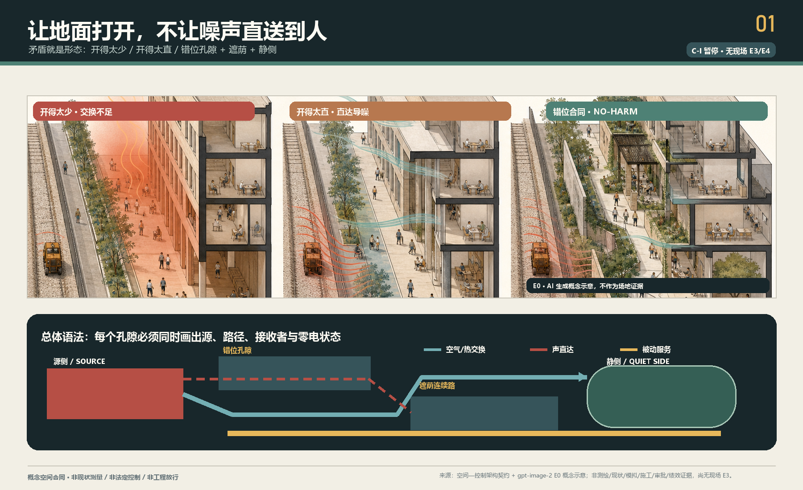
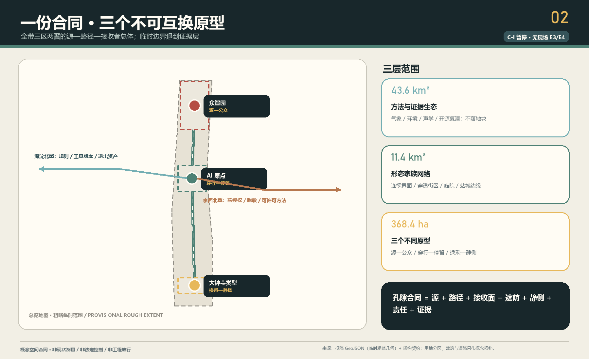
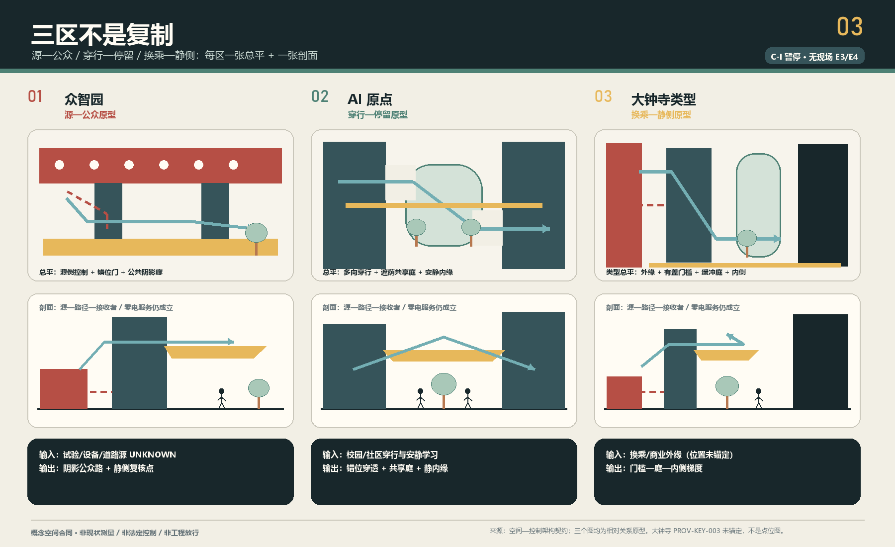
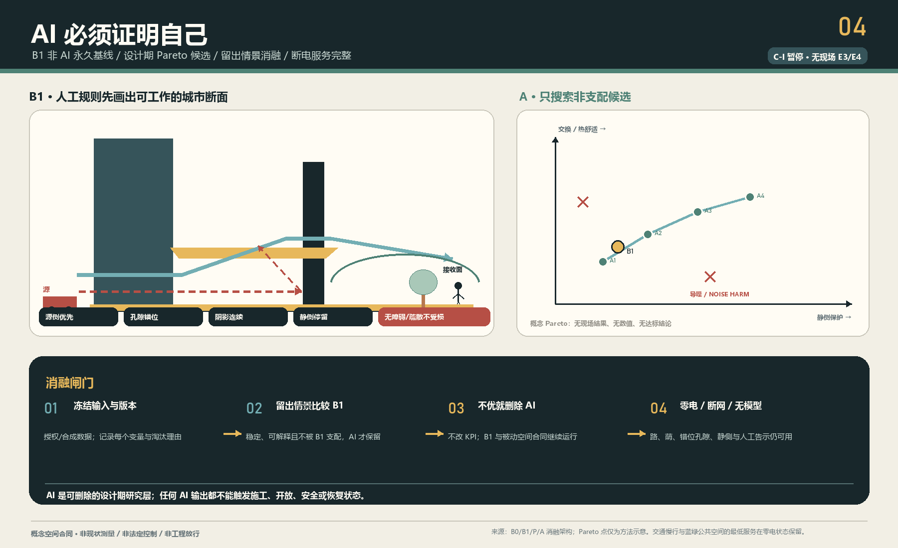
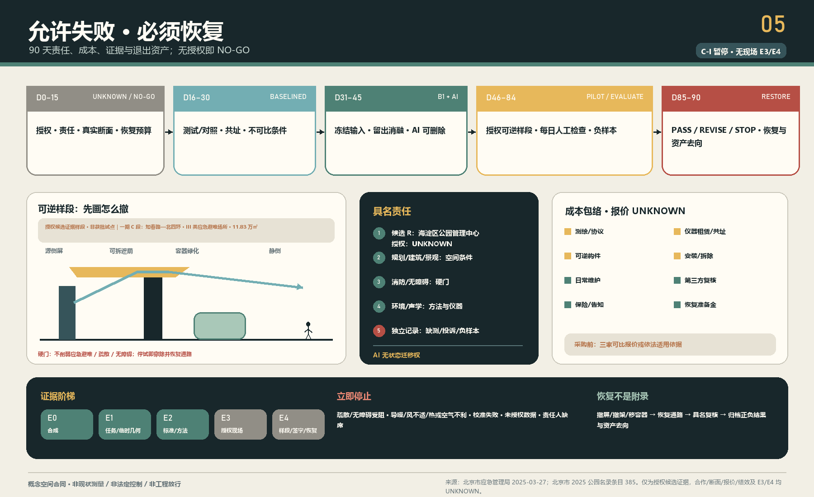

# 京张会呼吸——首层孔隙性能合同 / THE POROUS GROUND CONTRACT

> **让地面打开，不让噪声直送到人。** 先画源、传播路径与人的接收面，再决定哪里开、怎样折、何处遮荫、哪一侧可停留。传感器只验证，AI只在设计期比较候选；关掉电、网和模型，路、荫、错位孔隙与静侧仍必须成立。

**当前诚实状态：** `C-S` 是 formal v2 概念空间合同候选；机器门和独立盲审必须读取本包的确切记录，不能由状态文字代替。`C-I` 为 `HOLD`。本包没有真实断面、书面授权、E3现场基线或E4样段/恢复证据，不声称“已验证、已落地、全年改善、健康收益、法定达标或政府承诺”。仓库临时几何只支撑概念自洽；尤其 `PROV-KEY-003` 未可靠锚定大钟寺站城关系。

**五条可证伪合同：** ① 开口太少会积热或限制空气交换；开口太直会把噪声沿直达路径传到人的停留接收面。② `B0 / B1 / P / A`：B0是只读基线，B1是人工规则基线，P是可画参数族，A是设计期AI搜索；留出消融不稳定或不优于B1，就删除AI。③ `PROV-KEY-003` 是未锚定的临时粗略 polygon，不是大钟寺真实点位。④ E0是概念，E1是临时资料，E2是公开方法，E3是授权现场基线，E4是可逆样段与恢复证据；当前E3/E4不存在，`C-I HOLD`。⑤ AI无权批准开口、施工、状态迁移、安全放行或恢复；零电或断电、断网、模型退出后，路径、遮荫、错位孔隙与静侧仍继续服务。[metric:e3_site_evidence_count] [metric:e4_implementation_evidence_count]

## 设计依据与资料清单

本案响应官方三层范围、三区两翼和 agent.1—agent.6，但只提出一个不可移植的空间命题：京张原铁路创新走廊从北部研发/试验边缘，经中部近校日常穿行，到南部站城到达界面，连续面对“需要打开”与“不能直送噪声”的不同冲突。替换城市和三区名称后因果链若仍不变，方案即失败。[source:OFFICIAL-ANNOUNCEMENT] [source:AGENT-TASKBOOK] [source:SITE-PACKAGE]

总体与三处重点区均使用仓库粗略 provisional geometry。`SITE-001` 不是 official redline；三处矩形不是地块、道路或工程边界；大钟寺仅保留任务书名称和类型研究，不能下推站口、象限、距离与容量。[source:BOUNDARY-SOURCE] [source:KEY-AREA-SOURCE] [data:geometry/key_areas.geojson#PROV-KEY-003]

城市设计、控规边界和用地分类分别受本地标准矩阵约束；没有官方控规、建筑、道路、权属与市政条件时，分区只是非 statutory 研究覆盖，拆改留、FAR与高度保持 `UNKNOWN`。[standard:MOHURD-URBAN-DESIGN-MEASURES] [standard:MOHURD-CONTROL-DETAILED-PLANNING] [standard:MNR-LAND-USE-CLASSIFICATION-GUIDE]

空气、气候与声环境来源只定义专业方法边界，不证明京张现状或效果。声学采用源—路径—接收者分析逻辑；风、热、空气与声的真实变量必须在获授权断面上由适格人员确定。[source:MEE-GB3095-2026] [source:MEE-GB3096-2008] [source:MEE-HJ24-2021]

## 三层范围工作框架

| 层级 | 不可替代的问题 | 本案交付 | 禁止下推 |
| --- | --- | --- | --- |
| 43.6 km²统筹研究 | 哪些专业、工具、区域背景与两翼能支持可复核方法 | 源—路径—接收者证据框架、版本化B1规则、专业复核与转移门 | 不画地块，不宣称官方通风廊道 |
| 11.4 km²总体设计 | 原铁路走廊的连续界面如何“开而不直送” | 一条因果学习脊、三类断面、阴影路径、静侧与证据节点 | 不把概念脊当真实铁路/道路/无障碍路线 |
| 368.4 ha重点区 | 三种冲突怎样形成不可互换的空间原型 | 众智园源—公众、AI原点穿行—停留、大钟寺类型换乘—静侧 | 不从粗略矩形推断真实条件 |

三层不是一张图的缩放。统筹层管理方法和转移资格；总体层管理空间合同网络；重点区用一张可验收断面反证合同。[depth:three_level_scope_framework] [depth:overall_spatial_structure] [data:geometry/roads.geojson#ROAD-PGC-01]

## 统筹研究范围产业与未来城市研究

本案把“AI全栈”理解为一条可删除AI的城市设计生产链，而非设备平台：B0只读基线；B1由规划、建筑、景观、环境、声学、消防和无障碍专业人员给出人工规则方案；P把开口位置、错位关系、缓冲深度、遮荫连续、接收面与维护通路转成可画参数；A只在冻结输入和留出情景中搜索Pareto候选。AI若不能稳定、可解释地找到不被B1支配的方案，就删除AI，B1公共服务不变。[source:LADYBUG-TOOLS-METHOD] [source:OPENFOAM-METHOD] [source:NOISEMODELLING-METHOD]

中关村科技服务翼只交换规则版本、工具清单、专业方法、失败与复演资产；小月河场景赋能翼只交换获授权、已脱敏的场景方法和普通维护经验。任何跨区复制必须重新做B1、来源登记、责任确认和no-harm审查，不能平移几何、阈值或效果。[source:AGENT-TASKBOOK] [depth:existing_conditions_diagnosis]

品牌以“错位开口”的括号/折线为识别，不以风的箭头、传感器或绿色发光线为主体。国际表达固定为 `OPEN THE GROUND, NOT A DIRECT NOISE PATH.`，把AI治理转成可见的“可比较、可删除、可恢复”。

## 总体设计范围城市更新与控规深度城市设计

最小空间服务原子是：两个经授权控制点之间，一条零电可识别、连续无障碍的阴影通路，一个经权属/消防核验的空气路径，一个不被声源直线瞄准的静侧停留面，以及测试/对照、责任、停止与恢复证据。不是测量柱，也不是环境分数。[data:geometry/green_space.geojson#GREEN-PGC-01] [data:geometry/public_space.geojson#PUBLIC-PGC-01] [metric:passive_service_required_ratio]

所有开口先过六项no-harm：空气交换、热暴露、噪声、无障碍、消防疏散、维护。改善一项而伤害任一项即淘汰；平均值不能掩盖中午、热浪、源满负荷、活动散场和夜间等最差包络。GB/T 37529与QX/T 437只用于说明气候/通风判断需要资料与分析，本案不认定官方通风廊道。[standard:CMA-GBT37529-2019] [source:CMA-QXT437-2018]

五个用地 polygon 只完成包内完整覆盖，名称说明研究问题而非法定用途；六个建筑 footprint 只画源侧/接收侧关系，拆改留均为 `UNKNOWN`。取得 canonical geometry 后九图层、指标、图件、PDF和HTML必须整体重算。[data:geometry/land_use.geojson#LU-PGC-01] [data:geometry/buildings.geojson#BLDG-PGC-01] [metric:land_use_partition_ratio]

## 重点区域详细设计

### A 北部众智园：源—公众

真实设备、活动、热/排放和运营边界均未知。空间语法是“源侧控制优先—错位孔隙—连续公共阴影廊—静侧复核袋”，测试点与公众路径分离。禁止把开放展示等同于通风，禁止让临时构件占用无障碍/疏散。众智园本轮只保留不可互换的类型原型，不作为优先真实样段；一期C段是另行申请授权的证据候选，也不能反向把众智园临时矩形锚定为真实点位。[data:geometry/roads.geojson#ROAD-PGC-04] [data:geometry/public_space.geojson#PUBLIC-PGC-03]

### B 中部AI原点：穿行—停留

地面层需多方向穿透，但开口错位；共享庭提供遮荫和转折，安静学习面退到静侧，日夜不依赖屏幕或门禁。为了“通透”做成声学直筒、为了“安静”重新封闭地面、让遮荫成为消费门槛，均判失败。真实校地/社区权属、开放时段和日程仍为 `UNKNOWN`。[data:geometry/roads.geojson#ROAD-PGC-03] [data:geometry/public_space.geojson#PUBLIC-PGC-02]

### C 南部大钟寺类型：换乘—静侧

只画“外缘到达面—有盖门槛—折转缓冲庭—安静内侧”类型，不落真实站口。当前 `PROV-KEY-003` 未锚定，故 `PHASE-PGC-01` 为NO-GO；canonical geometry、交通/声源、权属和管理主体缺一不可。[data:geometry/phasing.geojson#PHASE-PGC-01] [metric:dazhongsi_geometry_anchor]

三处不是同一节点复制：北部先管源与公众边界，中部同时保障穿行和停留，南部构造强到达源到静侧的梯度。三区若最终都变成树阵、凉亭和传感器，本案应停止。[depth:three_key_area_detailed_design]

## AI 创新生态、人才画像与 AI+ 场景

六类画像覆盖行动不便/照护者、户外/夜班劳动者、高校与社区学习者、研发试验人员、换乘/国际访客、维护与专业复核人员。画像只描述空间失败负担，不识别人、不推断健康与身份。[metric:persona_count] [source:BARRIER-FREE-ENVIRONMENT-LAW]

| 场景 | 空间冲突 | B1/AI关系 | 人工门与停止 |
| --- | --- | --- | --- |
| 01 北部源未知 | 无源清单 | B1=NO-GO；AI不运行 | 具名源清单；无法分离即停 |
| 02 源侧交换/公众安静（产业测试） | 开太少/开太直 | B1错位+阴影；AI只找非支配解 | 多专业no-harm，任一恶化即停 |
| 03 断电断网 | 数字层归零 | B1全服务；删除AI | 零电走查失败即停 |
| 04 中部穿行高峰 | 通路压力 | B1多向连续通路；AI比较权衡 | 主体+无障碍同行走查 |
| 05 学习面被导噪（产业测试） | 直线声路径 | B1弯折庭；AI不可认证 | 配对声学方案；静侧恶化即停 |
| 06 儿童/照护同行 | 可见/遮荫/无障碍 | 人工走查优先 | 任一障碍即停 |
| 07 南部到达/等待 | 到达源与静侧 | 类型B1；AI仅类型搜索 | canonical geometry前不落点 |
| 08 大钟寺未锚定 | polygon可能错位 | 禁用AI选址 | 声称站口/象限即停 |
| 09 传感器漂移 | 数据不可比 | 停结论，空间不自动调 | 共址/校准失败退UNKNOWN |
| 10 AI无增益（产业测试） | 留出/扰动失败 | 删除AI，保留B1 | 不得改KPI保AI |
| 11 投诉/负向结果 | 多物理伤害 | 人工关闭并恢复 | 单项收益不可抵消伤害 |
| 12 第90日退出 | 临时占用固化 | 签PASS/REVISE/STOP后复原 | 无新授权不得续占 |

12张卡、6类画像和3个产业测试的权威结构在 `simulation.json`；这里给人读，不把矩阵当正文。[metric:scenario_card_count] [metric:industry_test_count]

三个朝圣节点不是纪念算法，而是公开AI边界：众智园“开口账本”展示B1、AI候选、淘汰理由与不确定性；AI原点“弯折庭”让人直接读懂通路和静侧；大钟寺类型“复原签收台”公开停止、恢复与资产去向，位置仍未锚定。[data:geometry/public_space.geojson#PUBLIC-PGC-06] [metric:pilgrimage_node_count]

## 用地、建筑规模与拆改留方案

用地图是非statutory功能研究分区，完整覆盖只为拓扑和空间叙事；建筑图只表达三类断面的源侧/接收侧质量，不代表现状或拟建。FAR、高度、密度、现状面积、产权与每一栋拆改留保持 `UNKNOWN`。建筑环境规范只作为专业深化接口，不把室内标准直接当室外达标结论。[standard:MOHURD-GB55016-2021] [metric:floor_area_ratio]

未来专业团队应以真实建筑测绘、权属/租约、消防、结构、机电、文保和运营调查建立 retain/renovate/demolish 台账；任何孔隙都需单独核查结构、围护、消防和噪声源，不能从本图自动出施工量。[depth:height_massing_character] [depth:retain_renovate_demolish]

## 交通、轨道、市政与公共服务设施

`ROAD-PGC-01` 只是北—中—南因果学习脊，不是铁路、道路、站口接驳或无障碍路线。三条弯折 transect 是可画参数，不证明地形、坡度、路权、消防或交通安全。真实交通、轨道、停车、市政、能源与新基建在获取资料后由专业团队深化。[data:geometry/roads.geojson#ROAD-PGC-01] [depth:traffic_rail_slow_parking] [depth:municipal_new_infrastructure]

环境仪器与本地计算只能服务共址校准、设计比较和证据归档；它们不能实时开合空间、控制建筑/设备、发布健康建议或法定环境结论。断电/断网时纸面告示、普通维护、路线、阴影和静侧不丢失。

## 蓝绿空间、公共空间与城市风貌

蓝绿层只表达“公共阴影+普通植物维护+静侧”的被动接口，不宣称树冠、降温、污染削减、雨洪或法定绿地。公共空间必须保持非消费性、连续无障碍和零手机可用。[data:geometry/green_space.geojson#GREEN-PGC-01] [metric:green_ratio] [metric:public_space_ratio]

文化叙事不复制铁路图像，而把百年工程文化中的“公开尺度、断面、复核、长期维护”转成AI新文化：春季“百年断面公开课”、夏季“开合盲测周”、秋季“负样本展”、冬季“复原签收日”，以及双语“开放断面协议”。历史内容须策展核验；活动只是运营建议，不是政府安排。[standard:PROJECT-AGENT-OPEN-CALL-TASKBOOK] [depth:blue_green_public_space]

## 更新项目清单、实施政策与分期计划

官方公开资料使授权路径比“猜一个点”更具体：北京市应急管理局登记京张铁路遗址公园一期C段（知春路至北四环、11.83万㎡）为兼顾其他灾种的III类应急避难场所；2025公园名录将该段地址列为四环路至知春路，并列海淀区公园管理中心为主管单位；首都之窗确认一期2023年开放及桥下空间/少量铁轨开口的公共连通背景；2026海淀政府报告说明沿线控规已通过技术审查，“获批实施”仍是下一步，并称二期可实施区域主体已建设完成；它不是最终批准文本。[source:BEIJING-EMERGENCY-JZ-C-2025] [source:BEIJING-PARK-DIRECTORY-2025] [source:BEIJING-JZ-PARK-OPEN-2023]

因此一期C段可作为“申请书面授权与真实断面的证据样段候选”，不是三区中的 canonical 正式点位、不是获批试点。真实断面 `UNKNOWN`、环境性能 `UNKNOWN`、书面授权 `UNKNOWN`。名录中的海淀区公园管理中心只是需联系的候选责任入口，不代表同意、经费或承担本试点。任何样段不得削弱应急避难功能，不得阻塞疏散通道，不得阻塞无障碍通路，且不得妨碍消防通行；应急/消防/无障碍专业复核是比环境优化更高的硬门。当前仍为 `UNKNOWN / NO-GO`。[source:HAIDIAN-GOV-REPORT-2026] [metric:authorized_real_pilot_site_count]

| 天数 | 状态 | 具名交付 | 失败默认 |
| --- | --- | --- | --- |
| 0—15 | UNKNOWN/NO-GO | 授权、RACI、真实断面、源清单、消防/无障碍/隐私、复原预算 | 只做概念 |
| 16—30 | BASELINED | 测试/对照B0，共址/校准和数据质量签字 | 退UNKNOWN |
| 31—45 | B1_READY / AI_COMPARED | B1、冻结输入、留出消融、淘汰理由 | 删AI或重画 |
| 46—70 | MOCKUP_AUTHORIZED / PILOT_OPEN | 经批准可逆样段，每日人工开放检查 | 关闭并复原 |
| 71—84 | EVALUATING | 匹配复测、缺测、投诉和负结果 | 不作因果结论 |
| 85—90 | PASS/REVISE/STOP → RESTORED | 具名决定、撤除/保留授权、资产去向和复原证据 | 不得以试点名义续占 |

AI永不触发状态迁移。立即停止包括：通路/疏散受阻、构件风险、噪声/风不适或其他维度恶化、校准/可比性失败、未授权数据、责任人缺席、维护失败、投诉无法关闭、越出授权范围。[data:geometry/phasing.geojson#PHASE-PGC-03] [depth:phasing_implementation]

成本不伪造总价。先锁定专业测绘与协议、仪器租赁/共址、可逆构件、安装拆除、日常维护、第三方复核、保险告知和恢复准备金；真实断面与数量明确后取得可比报价或适用采购依据，再批货币上限。[metric:pilot_cost_cny]

退出资产包括B1规则、模型/依赖清单或删除记录、被淘汰方案、无个人数据的数据字典、负样本/投诉账本、构件去向与复原签收。普通维护缺席即关闭；AI不能顶班。[depth:renewal_project_list]

## 指标体系、面积复算与合规矩阵

包内可知的是：三处任务书名称、12场景、6画像、3产业测试、3概念地标、90日协议长度、E3=0、E4=0，以及概念几何自身的拓扑和面积。不可知的是：真实点位、实际性能、AI净增益、费用、FAR、现状绿地/公共空间和大钟寺锚点。[metric:e3_site_evidence_count] [metric:e4_implementation_evidence_count] [metric:ai_net_value]

面积以EPSG:4548对提交临时 polygon 内部复算，仅用于包内一致性；不能作为精确规划指标。来源、假设、九GeoJSON、三矩阵和self_check构成权威层，图件/HTML/生成插画只是解释层。[metric:site_area_sqm] [depth:metrics_recalculation]

## 风险、版权与合规说明

最主要的风险不是“模型不准”，而是把临时几何当真实场地、把多指标平均当no-harm、把AI建议当批准、把90天当全年、把可逆试点变长期占用、或让维护劳动隐形。任何一项都要求降级、停止或复原。[depth:risk_missing_data] [data:geometry/constraints.geojson#CONSTRAINTS]

最小数据不含姓名、手机号、账号、脸、图像、健康、精确个人定位、单位身份或连续轨迹。公众反馈只做对象级问题和聚合时段；专业数据按授权保存。发现禁用字段立即停止、删除并由责任主体处理。[source:SOURCE-REGISTRY]

文字、结构化数据和概念几何由zyaoii与OpenAI Codex生成。`porous-ground-cutaway-concept-v1` 无输入/参考图，仅为E0空间假设，必须标注“AI生成概念示意，不作为场地证据”；像素不推导geometry、尺寸或效果。[source:IMAGEGEN-PGC-001]

所有空间落地建议均为开放共创建议、概念建议、参考方案或可供专业团队深化研究；不替代正式规划，不构成政府审定、实施、资金、采购、许可、安全或环境结论。

## 参考资料

- 官方公告、agent任务书、场地包与处理索引。[source:OFFICIAL-ANNOUNCEMENT] [source:AGENT-TASKBOOK] [source:PROCESSED-FACT-PACK]
- 环境空气、声环境、噪声责任与声学方法边界。[source:MEE-GB3095-2026] [source:MEE-GB3096-2008] [source:MEE-NOISE-LAW-2021]
- 气候/通风和建筑环境专业深化入口。[source:CMA-GBT37529-2019] [source:CMA-QXT437-2018] [source:MOHURD-GB55016-2021]
- 可复核工具只作方法库，不移植模型、默认数据或结论。[source:PYTHERMALCOMFORT-METHOD] [source:LADYBUG-TOOLS-METHOD] [source:NOISEMODELLING-METHOD]
