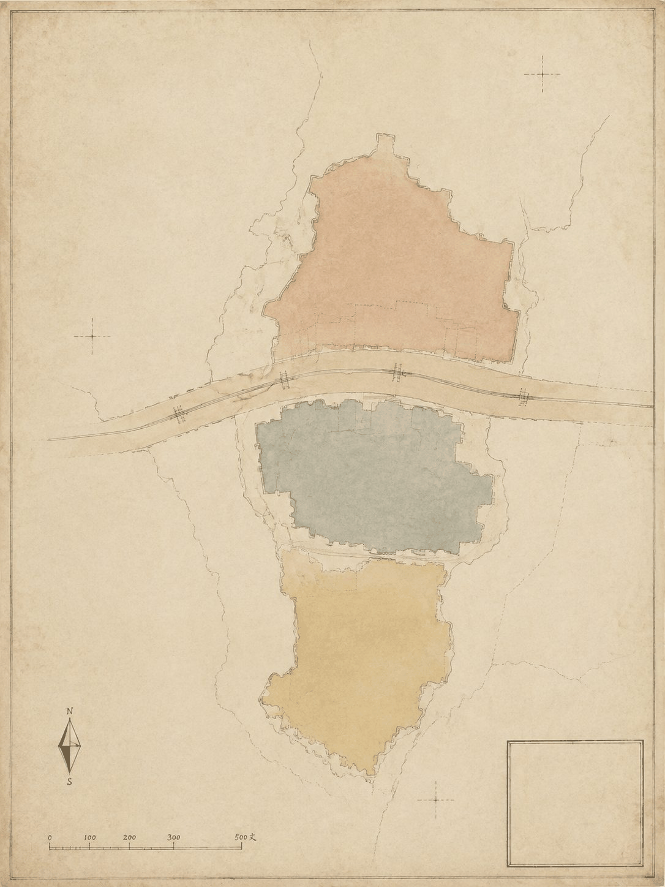
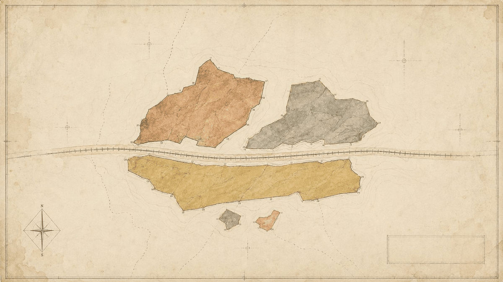
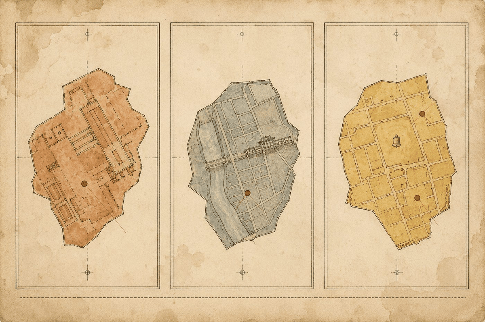
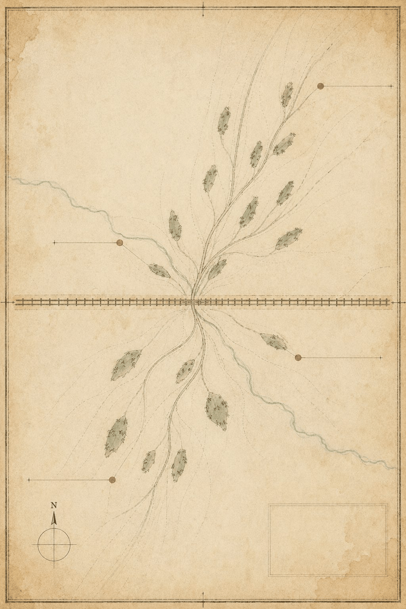
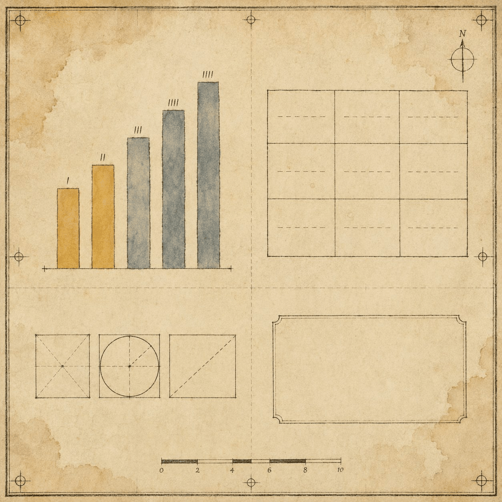

# Jing-Zhang Natural History: AI Life-Scenarios and City Governance under the Five-Bo System

> **Preface to the Annals**: In the year the Jing-Zhang Railway opened, the authorities commissioned Tan Jintang to photograph the entire line — bridges, tunnels, stations, rolling stock — compiled as *The Jing-Zhang Railway Works Photographic Record*, now part of the China Documentary Heritage. More than a century later, AI travels the same line. In the same spirit, this proposal keeps a record, a collection, and a plate for every AI service on this line. **To study broadly (bo) is to observe all things and distill their essence; to write annals (zhi) is to record what is real, examine what it does, and transmit it to posterity.** The city is the annals; AI is the new species; humans are the final editors.

## Design Basis and Materials Checklist

This formal proposal takes the *Prequalification Announcement for the International Urban Design Solicitation of the Centennial Jing-Zhang AI Innovation Belt* issued by the Haidian Branch of the Beijing Municipal Commission of Planning and Natural Resources as its primary basis, and the machine-readable provisional boundary, key areas, enums, metrics, and source registry maintained under `brief/site-package/` as its structured basis. Before generating any content, an AI agent must read `design_brief.json`, `allowed_design_space.json`, `sources.json`, `enums/`, `ranges/`, `schemas/`, `data/source_registry.json`, and `data/processed/agent_fact_pack.md`, and must build the task, scope, material-usage, and data-gap checklist from `project_scope_summary.csv`, `agent_task_requirements.csv`, `source_use_matrix.csv`, and `missing_data_checklist.csv`. Every design judgment must decompose into a traceable source, a recomputable metric, a verifiable layer, and a human-reviewable assumption. The announcement requires urban-design depth equivalent to regulatory detailed planning, so narrative text cannot replace the GeoJSON layers, metrics tables, A3 booklet, A0 boards, and HTML presentation [source:OFFICIAL-ANNOUNCEMENT]. The editorial conventions of these annals additionally follow the agent taskbook [source:AGENT-TASKBOOK], with deliverable depth constrained by the existing-conditions diagnosis item [depth:existing_conditions_diagnosis].

This proposal is not a standalone vision essay but an organization of deliverables from the announcement, the agent taskbook, and the site package; this section places only the most critical basis beside the judgment. Full source and standard coverage is kept in `sources.json`, `standard_matrix.json`, and `design_depth_matrix.json`, not repeated in the body [source:SOURCE-REGISTRY].

The usage boundary of the registry is as follows [source:SOURCE-REGISTRY]:

- `data/source_registry.json` registers the permitted use of public, cleared, and provisional materials.
- Current summary: 7 formal-use items, 1 background item, 1 provisional-only item.
- The agent must not upgrade background-only or provisional-only materials into official boundary, statutory regulatory plans, formal scoring evidence, or government implementation commitments.

`data/processed/agent_fact_pack.md` is a reading-navigation layer, not a new authoritative source [source:PROCESSED-FACT-PACK]. It helps the agent organize the three-level scope, three key areas, announcement tasks, agent.1–agent.6, material availability, and data gaps into a readable proposal; factual judgments must still return to the registered primary materials [source:OFFICIAL-ANNOUNCEMENT] [source:AGENT-TASKBOOK].

Where official `SITE_BOUNDARY` or `KEY_AREA` polygons are not yet available, this proposal uses `brief/site-package/geometry/provisional_boundaries.geojson` to generate the temporary formal package. `geometry/site_boundary.geojson` and `geometry/key_areas.geojson` are labeled `provisional_constraint`, `official_boundary=false`, and are for proposal generation, self-check, visualization, and design discussion only — not as official redline, approval basis, precise area basis, or statutory control conclusions. This organizer-side data gap does not block content scoring; once official polygons are issued, site boundary, key areas, land use, roads, green space, public space, buildings, phasing, and metrics must all be recomputed [data:geometry/site_boundary.geojson#SITE-001]. The site area is cross-checked against [metric:site_area_sqm], the three key areas against [data:geometry/key_areas.geojson#PROV-KEY-001], and their count against [metric:key_area_count].

## Three-Level Scope Working Framework

The proposal organizes work at the three levels defined by the announcement: the coordinated research area (43.6 km²) for AI-industry ecology, strategic positioning, the innovation chain, and future urban form; the overall design area (11.4 km²) covering the 1–2 km city and industry belt around the Jing-Zhang Heritage Park; and the key detailed design area (368.4 ha) for the three detailed-design districts. Every requirement in announcement clauses 1.3, 1.4, 1.5 and agent.1–agent.6 maps to a section, layer, metric, drawing, and HTML evidence in `compliance_matrix.json`. Its depth is constrained by [depth:three_level_scope_framework] and [depth:overall_spatial_structure], task authority by [standard:PROJECT-OFFICIAL-ANNOUNCEMENT], and scope indexing by [source:PROCESSED-FACT-PACK].

These annals adopt three vistas corresponding to the three levels, as a naturalist toward a specimen — **survey the whole, trace the lineage, examine the detail**:

| Level | Vistas | Design question | Proposal answer | Data anchor |
| --- | --- | --- | --- | --- |
| Coordinated research area (43.6 km²) | Survey the whole | How to organize the AI-industry ecology and future urban form | Establish the Five-Bo master concept; build the "university seeding—open-source collaboration—enterprise conversion—public experience—global communication" innovation chain | compliance_matrix.json, standard_matrix.json |
| Overall design area (11.4 km²) | Trace the lineage | How to map industry space, urban renewal, transport, and urban character | Five-volume spatial structure (Gameplay/Imagery/Greatness/Erudition/Benevolence), expressed jointly by land-use, building, road, green, public-space, and phasing layers | [data:geometry/land_use.geojson#LU-001], [data:geometry/roads.geojson#ROAD-001] |
| Key detailed design area (368.4 ha) | Examine the detail | How to reach detailed-design depth in the three districts | Volume assignment, positioning, spatial moves, AI scenarios, and implementation dependencies per district | [data:geometry/key_areas.geojson#PROV-KEY-001], [data:geometry/key_areas.geojson#PROV-KEY-002], [data:geometry/key_areas.geojson#PROV-KEY-003] |

The three levels are not separate drawing sets. The coordinated research level decides the industry-chain and urban-form judgment; the overall design level translates the judgment into renewal projects, spatial structure, and facility capacity; the key-area level verifies implementability of plots, buildings, transport, public space, and AI application scenarios. The agent must first lock the official or provisional boundary and constraints used in the current commit, then generate land-use, building, road, green-space, public-space, phasing, and AI-service layers, finally recomputing metrics from these layers and explaining in the body which conclusions remain limited by the provisional boundary. Any area, ratio, scale, or project count that cannot be recomputed from structured data must not be written as a formal conclusion.

## Coordinated Research Area: Industry Ecology and Future Urban Form — The Five-Bo Master Concept

### Naming Examination: Jing-Zhang Natural History

The master concept of this proposal is **「京张博物志」** — **THE JING-ZHANG NATURAL HISTORY**.

- The Chinese name derives from Zhang Hua's *Bowu Zhi* (Records of the Investigation of Things, Jin Dynasty), the source book of Chinese natural history; the English name translates Pliny the Elder's *Naturalis Historia*, the source book of Western natural history.
- The Jing-Zhang Railway is itself a product of Sino-Western technical convergence — Zhan Tianyou studied surveying in the United States and returned to survey mountains, draw maps, and build the railway by Western methods. The paired naming is not ornament but a faithful translation of railway history.
- "Zhi" (志) denotes the record genre. When the railway was completed, the official *Jing-Zhang Railway Works Photographic Record* archive was compiled; keeping annals for the AI services running on the same line today continues that archival spirit [source:AGENT-TASKBOOK].

### The Five-Bo Pillars

The character "Bo" (博) carries five meanings, established here as five pillars, each with its textual authority and its design function:

| Bo | Source | Meaning | Design correspondence |
| --- | --- | --- | --- |
| **Greatness (Boda)** | *The Doctrine of the Mean*: "Being broad and thick, it can carry all things" | Broad, weighty, bearing all things | Spatial structure: the 43.6 km² expanse, the three-area-two-wing organization, room for R&D, industry, living, and recreation |
| **Erudition (Bolan)** | The idiom "bo lan qun shu" (reading widely) | Broad reading, gathering of talents | Knowledge network: the intellectual density of Haidian as a national academic center, the convergence of global developers |
| **Benevolence (Boai)** | Han Yu's *On the Way*: "Broad love is called benevolence" | Loving all people | Ethical baseline: age-friendly and accessibility services, human fallback, public-interest priority |
| **Gameplay (Boyi)** | *The Analects*: "Are there not games of chess? To play them is still better than doing nothing" | Chess-like contest; today, mechanism design | Operating mechanism: human-machine collaboration, review competition, transparent rules |
| **Multi-metaphor (Boyu)** | *The Book of Rites·Record on Learning*: "Only one who can explain by many metaphors is fit to be a teacher" | Explaining one principle through many metaphors; the capacity of a teacher | Narrative system: five metaphors — railway, annals, plates, chessboard, apprenticeship — for one principle: what the AI innovation belt is |

Among the five, **Multi-metaphor (Boyu) is the master key**. A city that can teach by many metaphors is fit to be AI's teacher — AI must pass collection and identification (accession review) before it may be exhibited (put into service). The historical evidence for Gameplay is equally firm: a century ago the Qing government preserved autonomy in the contest with Britain and Russia over railway rights, giving us the Jing-Zhang Railway; today the city must preserve human primacy in the contest with technology — **the accession-review authority is humanity's piece on the board**.

### Translation of the Five Functions and the Three-Area-Two-Wing System

The announcement requires responses to the five functions (AI full-stack independent innovation system, world-class AI innovation ecology, a new paradigm of AI+ scenario empowerment, an intelligent vibrant AI city, and global discourse power in AI governance) and the three-area-two-wing synergy [source:AGENT-TASKBOOK]. This proposal translates them into five volumes:

| Spatial unit | Volume | Main Bo | Translated role | Five-function correspondence |
| --- | --- | --- | --- | --- |
| Zhongzhiyuan AI Acceleration Area | Gameplay Volume | Gameplay | Test ground: AI competes, tests, and iterates here, as play on a board | AI full-stack independent innovation; AI-governance discourse power |
| Beijing AI Origin Community | Imagery Volume | Multi-metaphor | Main gallery: railway×AI dialogue in time; master-apprentice pairing | World-class AI innovation ecology |
| Dazhongsi AI Industry Cluster | Greatness Volume | Greatness | Application district: AI-native consumption and industry, closure of the grand pattern | New paradigm of AI+ scenario empowerment |
| Zhongguancun Technology Service Wing | Erudition Volume | Erudition | Knowledge services, talent, and capital hub | Global factor allocation, Zhongguancun IP and capital empowerment |
| Xiaoyuehe Scenario Empowerment Wing | Benevolence Volume | Benevolence | Civic life scenarios, public experience, fallback services | AI scenario empowerment; intelligent vibrant AI city |

The naming system and visual-identity direction serve the overall recognizability of "Centennial Jing-Zhang Culture Belt, Urban AI Life Experience Belt, AI-Integrated Innovation Belt": the logo is a "Bo"-character seal paired with a railway spike, in the form of a museum specimen tag (number + name + provenance); each of the three areas and two wings carries one "volume seal" forming a complete set with the master seal, designed for extension. Task requirements come from [source:AGENT-TASKBOOK], standards from [standard:PROJECT-AGENT-OPEN-CALL-TASKBOOK]; spatial coordination returns to [standard:MOHURD-URBAN-DESIGN-MEASURES], with [data:geometry/land_use.geojson#LU-001] and [data:geometry/public_space.geojson#PUBLIC-001] as mapping layers and depth constrained by [depth:overall_spatial_structure]. All brands, typefaces, images, portraits, and enterprise marks are rights-cleared.

### Logo Visual Direction: The Bo Seal and the Railway Spike

The visual identity serves the overall recognizability of "Centennial Jing-Zhang Culture Belt, Urban AI Life Experience Belt, AI-Integrated Innovation Belt"; direction below is conceptual, pending professional design [source:AGENT-TASKBOOK]:

- **Master seal**: "Bo" character in seal-script carving, strokes taking the cross-section of a rail - horizontal strokes as rails, vertical strokes as spikes; the semantic of "bridging past and present" in one seal; base lined with the abstracted Jing-Zhang Heritage Park main axis
- **Accessory**: the railway spike - head as circle, body as bar; combined with the Bo seal into a "nailing time" narrative symbol (the railway once nailed a line's time; AI is nailing an era)
- **Volume-seal system**: each of the three areas and two wings carries a volume seal (Gameplay/Imagery/Greatness/Erudition/Benevolence), used as a set with the master seal, extensible; strokes share the master's lineage
- **Specimen-tag format**: all official displays use the museum tag layout "number + name + provenance + date", unified with the honor system (Accession Roster Wall)
- **Extension rules**: master seal for belt-wide brand; volume seals for zonal wayfinding; specimen tags for service nodes; colors follow the Five-Bo mineral palette (ochre/blue-grey/gamboge/grey-brown/madder), ground in rice-paper tone
- **Compliance**: all typefaces and marks are original design directions using no unauthorized materials; the final logo is deepened and rights-cleared by professional teams per this direction

### Future Urban Form: The Lifecycle of AI Services

How does artificial intelligence change work, life, socializing, learning, transport, and public services? The answer of this proposal is a lifecycle methodology — **the five steps of classical learning equal the five steps of AI** — drawn from *The Doctrine of the Mean*: "Study broadly (bo xue), question carefully, think carefully, distinguish clearly, act resolutely."

| Classical step | AI correspondence | Proposal anchor |
| --- | --- | --- |
| Study broadly | Collect data / gather cases | Scenario collection mechanism (two-wing field trips) |
| Question carefully | Define problems / analyze needs | Persona and needs research |
| Think carefully | Train and reason / design | Scenario-card design |
| **Distinguish clearly** | Evaluate / review | **Accession Review Committee (humans decide)** |
| Act resolutely | Deploy / operate | Operation and human fallback |

Every AI service must enter the collection through these five steps: without collection there is no broad study; without identification there is no accession; without accession there is no exhibition; an exhibition without resolute operation is removed. This is the general rule of the annals. Any proposal for global AI events, developer communities, open scenarios, or pilgrimage routes is worded as a "conceptual suggestion / reference scheme / material for professional teams to deepen," never as a confirmed government activity or implementation arrangement.

## Overall Design Area: Urban Renewal and Urban Design at Regulatory-Detailed Depth

The overall design area requires urban-design depth equivalent to regulatory detailed planning: overall renewal spatial structure, identification of low-efficiency space, a renewal project list, implementation policy suggestions, industrial function ratios, spatial organization models, total building scale, and comprehensive capacity assessment [standard:MOHURD-CONTROL-DETAILED-PLANNING]. `geometry/land_use.geojson` fully covers the design boundary without overlap, `geometry/buildings.geojson` expresses retained or renewed building footprints, `geometry/roads.geojson` expresses microcirculation, slow-mobility, and rail-interchange relations, and `metrics.json` recomputes core areas, ratios, and layer counts. Land-use evidence is at [data:geometry/land_use.geojson#LU-001], building evidence at [data:geometry/buildings.geojson#BLDG-001], transport evidence at [data:geometry/roads.geojson#ROAD-001]; building footprint area is verified against [metric:building_footprint_area_sqm], with depth constrained by [depth:land_use_layout] and [depth:development_intensity_controls].

The spatial structure is mapped in five volumes: the **Gameplay Volume** in the north (Zhongzhiyuan — testing and competition), the **Imagery Volume** in the center (Origin Community — exhibition and dialogue), and the **Greatness Volume** in the south (Dazhongsi — application and closure), with the **Erudition Volume** and the **Benevolence Volume** as the eastern and western wings (knowledge services and civic life). The five volumes are connected along the Jing-Zhang Heritage Park activity belt as the spine, with slow-mobility and blue-green systems as the veins, forming a "**one spine, five volumes, multiple nodes, composite ring**" organization — the spine is the historical and public-space axis of the park, the five volumes are the spatial translation of the three areas and two wings, the nodes are AI scenario points, and the composite ring links slow mobility, green space, public space, and event routes.

Matters of building height, development intensity, road redlines, setbacks, and facility standards — where official control conditions do not yet exist — are uniformly stated as "pending confirmation of official regulatory conditions," and agent-inferred values are never presented as approved indicators [data:geometry/land_use.geojson#LU-001] [depth:land_use_layout] [depth:development_intensity_controls].

## Key Detailed Design Areas

Key-area detailed design is mandatory. The three key areas are established under three of the Five-Bo volumes, examined in detail — layers at [data:geometry/key_areas.geojson#PROV-KEY-001], [data:geometry/key_areas.geojson#PROV-KEY-002], and [data:geometry/key_areas.geojson#PROV-KEY-003], with depth checked by [depth:three_key_area_detailed_design]:

| Key area | Volume | Design positioning | Spatial moves | AI industry and operation scenarios | Evidence |
| --- | --- | --- | --- | --- | --- |
| Zhongzhiyuan AI Acceleration Area | Gameplay | Full-stack independent-innovation test ground | Strengthen the Qinghe frontage, industry display, low-carbon innovation exchange, and external transport; use green space for open testing and governance-standards display | Identification Station (accession review), independent model testing, standards workshops, safety-governance display | [data:geometry/key_areas.geojson#PROV-KEY-001], [depth:three_key_area_detailed_design] |
| Beijing AI Origin Community | Imagery | Campus-adjacent conversion and talent community | Organize campus-park-street slow-mobility stitching; supply result-release, talent-service, living, and open-source collaboration space | Bowugu Corridor, Field-Pairing Ground (master-apprentice), open-source release, result exhibition | [data:geometry/key_areas.geojson#PROV-KEY-002], [source:AGENT-TASKBOOK] |
| Dazhongsi AI Industry Cluster | Greatness | Urban intelligent economy and international exchange block | Around Dazhongsi station integration, four-quadrant pedestrian connectivity, commercial services, and public-environment renewal near key enterprises | Boji Hall, agent and smart-terminal display, content consumption, data elements, international roadshow | [data:geometry/key_areas.geojson#PROV-KEY-003], [metric:key_area_count] |

The detailed design must cite the provisional layers above and state that they cannot serve as formal scoring or approval basis. The design expression covers function and use, building scale, building form, retain-renovate-demolish classification, the public-space system, transport organization, slow-mobility connectivity, and implementation projects; `compliance_matrix.json` covers announcement clauses 1.5.3.1, 1.5.3.2, and 1.5.3.3. The HTML page allows switching between the three key areas; the A3 booklet and A0 boards contain at least a master plan, detail drawings, and metric tables per key area.

## AI Innovation Ecology, Personas, and AI+ Scenarios

### Collection: Five Personas

Personas are established by the method of field collection — as a naturalist records a species' ecological niche, recording only observable habits and never fabricating interior detail. Each persona lists typical needs, spatial responses, and self-check boundaries [source:AGENT-TASKBOOK]:

| Persona | Typical needs | Spatial response | Self-check boundary |
| --- | --- | --- | --- |
| New graduate job seeker | Wants to enter AI industry; lacks practical entry | Bo School (intergenerational learning center), Bo Harvest Field (co-creation space) | No personal behavioral tracking; event data aggregated only |
| Independent developer | Wants to start a venture; needs scenarios and partners | Bo Harvest Field, Field-Pairing Ground, open-source release hall | Code and compute usage require separate authorization |
| Elderly resident | Fears being left behind; needs someone to help | Bo Love Station (age-friendly assistance), senior volunteer docents at Bo School | No persona use for commercial recommendation |
| Traditional merchant | Wants to use AI but cannot, and dares not | Bo Ji Hall (public-service hub), Bo Tong Bridge (human-machine collaboration) | Business data de-identified, aggregate use only |
| Civic service window staff | Must hold the responsibility boundary of AI services | Identification Station, Specimen Repair Room | Government data authorized; audit trails kept |

### Identification: Ten AI Scenario Cards (Annals Entries)

Ten scenario cards are arranged as two per Bo, each written in the annals format — **name (shiming), form (xingzhi), function (xingyong), examination (kao)**. The "kao" section carries the required assessment indicators, human review, error disclosure, and exit mechanism — one card, four items; without examination there is no accession [source:AGENT-TASKBOOK]:

| Plate | Card (volume) | Name | Form (spatial carrier) | Function (service) | Examination (four items) |
| --- | --- | --- | --- | --- | --- |
| SC-01 | Natural-History Garden (Greatness) | AI service "species" exhibition garden | Core segment of the Jing-Zhang Heritage Park activity belt | Plate-style exhibition: each AI service enters as a specimen plate with annotations, numbered and traceable | Metric: exhibition completeness and update frequency; Fallback: human docents; Disclosure: change log; Exit: de-exhibition mechanism |
| SC-02 | Panorama Terrace (Greatness) | City eye | Qinghe high point in Zhongzhiyuan | Panoramic observation: public data visualization, urban operations dashboard | Metric: aggregation accuracy; Fallback: human release review; Disclosure: indicator definitions; Exit: halt on data-source failure |
| SC-03 | Erudition Kiosk (Erudition) | AI inquiry and wayfinding kiosk | Station-city nodes such as Wudaokou and East Qinghua West Road | Broad knowledge at hand: neighborhood wayfinding, policy Q&A, service guidance | Metric: answer-consistency sampling; Fallback: one-touch human transfer; Disclosure: correction log; Exit: disabled when no human on duty |
| SC-04 | Bo School (Erudition) | Intergenerational AI learning center | Boundary between Origin Community and campuses | Seniors and youth learn AI in pairs; senior volunteers serve as "volunteer docents" | Metric: course completion; Fallback: offline instructors; Disclosure: student work exhibitions; Exit: re-pairing on pair failure |
| SC-05 | Bo Love Station (Benevolence) | Age-friendly and accessibility AI service point | Community and park edges, barrier-free accessible | Voice/large-type/sign-language multimodal services; **an AI-free parallel path always available** | Metric: accessibility compliance; Fallback: permanent human desk; Disclosure: annual service statistics; Exit: human takeover on failure |
| SC-06 | Bo Ji Hall (Benevolence) | Public-service hub | Dazhongsi community center | AI-assisted public services: medical registration, education counseling, legal Q&A | Metric: referral accuracy; Fallback: professional human windows; Disclosure: open review of error cases; Exit: unapproved services never deployed |
| SC-07 | Bo Harvest Field (Gameplay) | Developer co-creation space | Open-source collaboration zone in Origin Community | Open-source contribution, scenario solicitation, code wall, roadshow competition | Metric: auditable contributions; Fallback: community council; Disclosure: contribution and review records; Exit: rule-violating projects removed |
| SC-08 | Bo Tong Bridge (Gameplay) | Human-machine collaboration station | Industry nodes between Zhongzhiyuan and Dazhongsi | Cross-party negotiation: demand matching, transparent interfaces, verifiable responsibility boundaries | Metric: closed-loop rate; Fallback: human coordinators; Disclosure: de-identified collaboration records; Exit: disconnection on agreement termination |
| SC-09 | Bowugu Corridor (Imagery) | Railway × AI dialogue promenade | Heritage nodes along the Jing-Zhang Heritage Park | Dual-line narrative: physical railway relics as warp, AI knowledge as weft | Metric: annual content review; Fallback: physical signage; Disclosure: source annotations; Exit: removal on copyright dispute |
| SC-10 | Bo Yi Hall (Imagery) | AI art and culture space | Exhibition node in Origin Community | Exhibition and discussion of AI-generated art and copyright dialogue | Metric: complete work authorizations; Fallback: curator system; Disclosure: generation methods; Exit: unlicensed works refused |

### Examination Reinforcement: Responsible Parties, Launch Conditions, and Assessment Thresholds

Each scenario card's "Examination" section adds three items to the four-item contract, forming six: responsible party (category-level), launch condition, assessment threshold. Examples below are proposed values pending professional and operator confirmation [depth:metrics_recalculation]:

| Card | Responsible party (category) | Launch condition | Assessment threshold (proposed) |
| --- | --- | --- | --- |
| SC-01 Garden | Park authority + annals committee | First 3 AI services pass accession review | Exhibit refresh >=2/year; annual annals publication |
| SC-02 Terrace | Data authority + third-party audit | All data sources registered, definitions public | Aggregation accuracy >=98%; 100% definition disclosure |
| SC-03 Kiosk | Operation consortium + merchants | Footfall reaches launch threshold | Answer consistency >=90%; correction within 24h |
| SC-04 School | University partners + community org | Paired instructors >=80% in place | Completion rate >=60%; senior docents >=30/year |
| SC-05 Love Stn | Civil affairs/disability dept + community | Accessibility acceptance passed | Accessibility compliance >=95%; human response <=3 min |
| SC-06 Public Hub | Public-service dept + professional orgs | Duty-window system established | Referral accuracy >=95%; 100% error review disclosure |
| SC-07 Harvest Field | Open-source council + operator | Council charter effective | 100% auditable contributions; violation removal <=7 days |
| SC-08 Bridge | Industry promotion dept + trade orgs | Collaboration agreement template released | Closed-loop rate >=80%; 100% de-identified records |
| SC-09 Corridor | Heritage dept + cultural orgs | All sources rights-cleared | Annual content review; dispute removal <=7 days |
| SC-10 Art Hall | Curator committee + copyright orgs | Generation-disclosure rules effective | 100% authorized works; 100% unlicensed refusal |

### Public-Interest Details: Age-Friendliness, Accessibility, and the Intergenerational Digital Divide

The Benevolence Volume is governed by "broad love benefiting all"; public interest is made measurable (proposed values) [source:AGENT-TASKBOOK]:

- **Age-friendliness**: Bo Love Station provides large-type, voice, and one-touch-human channels; "senior volunteer docents" target >=30/year; age-friendly scenarios cover >=80% of seniors' high-frequency daily matters
- **Accessibility**: every AI service point keeps an "AI-free parallel path" always available; accessibility compliance target >=95%; quarterly accessibility inspection
- **Intergenerational digital divide**: Bo School pairing (youth x senior) target >=200 pairs/year; digital-literacy courses cover >=1000 person-times/year
- **Privacy boundary**: all scenarios follow data minimization; resident personas aggregate-only, never for commercial recommendation; retention periods disclosed

### Three Industrial Test-and-Validation Scenario Cards

| Plate | Name | Volume | Description | Validation goal |
| --- | --- | --- | --- | --- |
| T-01 | Identification Station | Gameplay | AI services undergo identification by the "Accession Review Committee" before licensing (the distinguish-clearly step) | Validate an organizational process that realizes the "human final judgment" charter |
| T-02 | Specimen Repair Room | Gameplay | An AI bug is a damaged specimen; the full repair process is public — errors become specimens | Validate the operability of error-disclosure and review mechanisms |
| T-03 | Field-Pairing Ground | Imagery | Senior engineers take AI on "field collection" in human-machine pairs — "only one who can explain by many metaphors is fit to be a teacher," turned from rhetoric into institution | Validate efficiency and boundaries of paired human-machine real-data collection |

### Scenario–Space–Operation Mapping

All scenarios must anchor to spatial and governance boundaries: public-space scenarios cite [data:geometry/public_space.geojson#PUBLIC-001], slow-mobility and transport scenarios cite [data:geometry/roads.geojson#ROAD-001], open-space scenarios cite [data:geometry/green_space.geojson#GREEN-001] and [metric:public_space_ratio], [metric:green_ratio]. At the operation level, each scenario card states its operator, responsible party, data sources, privacy boundary, human-review mechanism, and exit conditions; all scenario nodes enter the `geometry/AI_SERVICE_ZONE` and `geometry/SCENARIO_NODE` layers or the compliance matrix. AI-governance suggestions follow the principles of data minimization, public sources, explainability, and human review; they do not replace planning approval, do not output unauthorized personal profiles, and do not claim official implementation commitments.

## AI Pilgrimage Landmarks and Honor System (agent.4 response)

agent.4 requires at least 3 AI pilgrimage landmarks and an honor-display system. These annals establish three sanctuaries under the Five-Bo system, sited at SCENARIO_NODE layer nodes; spatial form and operation are conceptual suggestions [source:AGENT-TASKBOOK] [data:geometry/public_space.geojson#SC-01] [data:geometry/public_space.geojson#SC-02] [data:geometry/public_space.geojson#SC-03]:

| Sanctuary | Volume | Site | Spatial form | Narrative | Operation |
| --- | --- | --- | --- | --- | --- |
| Natural-History Garden (Plate Sanctuary) | Greatness | Heritage Park core (SC-01) | Open-air plate gallery: AI services exhibited as numbered specimen plates | "Every AI service is a new species collected and identified" | Quarterly exhibit refresh, annual annals editing; permanent human docents |
| Identification Station (Review Sanctuary) | Gameplay | Zhongzhiyuan (near SC-02) | Public review hall: accession reviews held openly, public seats | "Accession authority rests with humans - AI's graduation rite" | Quarterly review congress; results inscribed publicly |
| Specimen Repair Room (Error-Disclosure Sanctuary) | Gameplay | Zhongzhiyuan (near SC-08) | Open repair workshop: AI errors shown as "damaged specimens" with public repair | "An error is not a stain; it is a specimen" | Disclosure within 24h; quarterly public review |

The honor system links to the official "Agent Contribution Honor Wall / AI Milestones" mechanism: this proposal suggests merging the Five-Bo system with the official wall into an **"Accession Roster Wall"** - every AI service that passes Identification Station review is inscribed with name, developer (including Agent identity), accession date, and review conclusion, displayed alongside railway heritage, forming a two-layer time narrative of "industrial heritage - AI species." Conceptual suggestion, to be deepened by professional teams [depth:three_key_area_detailed_design].

## Global AI Event System and Long-Term Operation (agent.6 response)

agent.6 requires an annual event system, developer-community operation, and long-term brand mechanism. This proposal organizes events under the master concept of "annual annals editing"; all are conceptual suggestions [source:AGENT-TASKBOOK]:

| Event | Frequency | Spatial carrier | Target | Conversion path |
| --- | --- | --- | --- | --- |
| Accession Review Congress | Quarterly | Identification Station | Developers, enterprises, public | Passed review > Roster Wall > plate publication |
| Plate Release (Annual Editing Ceremony) | Annual | Natural-History Garden | Global developers, media | Annual annals publication > international material |
| Developer Graduation Festival | Annual | Bo School, Bo Harvest Field | Developers, students | Certification > Bo Harvest Field membership |
| Specimen Repair Open Day | Monthly | Specimen Repair Room | Citizens, students | Error review > trust capital |

Developer-community operation (at Bo Harvest Field): contribution points (code, scenarios, review, docent - four contribution types), review-seat system (high-point developers enter the Accession Review Committee observer seats), apprenticeship levels (apprentice - assistant - graduate - master). The operator is suggested as a "belt operation consortium" (government-led, professional operator executed, community self-governance), pending professional deepening; not stated as a confirmed arrangement [depth:renewal_project_list] [depth:phasing_implementation].

## Multi-Agent Collaboration and Urban AI Governance Mechanisms (AI-planning innovation)

This proposal is generated by an AI Agent, so it writes "how multi-agents are governed" into the proposal itself, forming original depth. Three mechanisms, all conceptual:

**Mechanism I: Accession Review Committee (institutionalizing the distinguish-clearly step)**
- Composition: planning/operation/ethics/technology experts + public representatives + developer representatives; human members hold the majority and the final vote
- Process: study broadly (collection) - question (inquiry) - think (independent assessment) - distinguish (vote) - act (license / reject / de-exhibit)
- Rules: one-vote veto items (privacy violation, no human fallback, fabricated evidence); review records de-identified and public

**Mechanism II: Field-Pairing Human-Machine Contract (institutionalizing the multi-metaphor teacher)**
- Pairing: one human engineer + one AI service, signing a pairing card (data boundary, human-review checkpoints, exit conditions)
- Process: joint real-site collection; human handles on-site judgment, AI records and pre-filters
- Output: pairing report archived as evidence for accession review

**Mechanism III: Error-Disclosure Regime (Specimen Repair Room)**
- Format: error description, impact scope, repair process, review conclusion, improvement measures
- Timeliness: initial disclosure within 24h, full review within 7 days
- Boundary: privacy/safety/copyright content disclosed after de-identification

The three mechanisms form a "minimum closed loop of city-level AI governance": collection has a contract, review has a committee, errors have a regime. This is the core innovation distinguishing this proposal from "scenario-listing" approaches [depth:risk_missing_data] [depth:metrics_recalculation].

## Land Use, Building Scale, and Retain–Renovate–Demolish

The land-use plan follows public standards of national territorial survey, planning, and use classification, forming a complete, closed, seamless land-use partition. Classification follows [standard:MNR-LAND-USE-CLASSIFICATION-GUIDE] with codes from `enums/land_use_codes.json` (07 residential / 08 public administration and service / 05 commercial / 14 green and open space / 16 reserved), drawn in `geometry/land_use.geojson` [data:geometry/land_use.geojson#LU-001]. The building plan distinguishes retained, renovated, renewed, new, or to-be-confirmed objects, with suggested levels of footprint, function, scale, character, roof, massing, and height control; height, massing, character, and facade control is managed by [depth:height_massing_character], and retain-renovate-demolish methods by [depth:retain_renovate_demolish] [data:geometry/buildings.geojson#BLDG-001] [metric:building_footprint_area_sqm].

Where existing buildings, ownership, regulatory plans, and engineering conditions are absent, the proposal provides only methods and a calibration checklist, never fabricated retain-renovate-demolish conclusions. Building scale and intensity indicators must be consistent with `metrics.json` and the layers; where total building scale, FAR, height, density, green ratio, setbacks, and building control lines lack official conditions, `status=unknown` is used uniformly, with the pending conditions, current assumptions, and recomputation path after official data in `reason`/`assumptions` — fixed values are never used to manufacture precision. The A3 booklet provides the renewal project list and indicator review tables; the A0 boards express the key spatial structure and key areas; the HTML page links indicators and layers.

## Transport, Rail, Municipal Works, and Public-Service Facilities

The transport plan responds to the announcement's requirements for station-area integration, road microcirculation, slow-mobility gaps, external transport, parking, non-motorized vehicle parking, and green transport systems, covering the North Fifth Ring Road, the cross-ring-expressway node of the Jing-Zhang Heritage Park, Wudaokou, East Qinghua West Road, Dazhongsi station, and transport links around key enterprises. Transport and municipal depth are constrained respectively by [depth:traffic_rail_slow_parking] and [depth:municipal_new_infrastructure]; layer evidence cites [data:geometry/roads.geojson#ROAD-001], [data:geometry/public_space.geojson#PUBLIC-001], and [data:geometry/constraints.geojson#CONSTRAINTS]. Where road redlines, pipelines, fire-safety, and municipal conditions are absent, assumptions state the pending items rather than presenting strategy as approved conditions.

Municipal and public-service facilities cover AI-industry service facilities, innovation service platforms, talent-life service facilities, new infrastructure, distributed energy, edge compute, and integration with conventional municipal facilities, stating facility standards, spatial layout, service radius, operation models, and phasing logic. Where pipeline, energy, drainage, flood-control, and fire-safety engineering data are absent, they are listed as preconditions for formal deepening.

## Blue-Green Space, Public Space, and Urban Character

The blue-green plan takes the Jing-Zhang Heritage Park activity belt as its spine, coordinating Qinghe, Xiaoyuehe, and travel needs of surrounding campuses, enterprises, and communities, proposing a north-south through and east-west connected network of pedestrian paths, cycleways, and green space; it identifies slow-mobility gaps, overpass nodes, and landscape nodes at the park's south and north ends, and proposes composite strategies for parking, sports, innovation exchange, technology testing, application display, and public services [depth:blue_green_public_space] [data:geometry/green_space.geojson#GREEN-001] [data:geometry/public_space.geojson#PUBLIC-001]. Green and public-space ratios are explained for design meaning in the body, with full recomputation in `metrics.json`; the coordination of urban character, public space, and building control returns to the professional standard matrix [standard:MOHURD-URBAN-DESIGN-MEASURES].

The urban-character plan fuses Jing-Zhang railway heritage, Zhongguancun innovation culture, and AI innovation culture through the **Multi-metaphor (Boyu)** method: railway relics are the "warp" (physical history), AI knowledge the "weft" (future exhibition), and cultural wayfinding the "annotation" (human-readable interpretation). Using cultural resources including Qinghua Garden Station and the Beijing Film Academy site, it proposes urban keynote, building character, roof forms, massing, interfaces, and public-art guidance; wayfinding takes the form of classical annotations — large type, open spacing, explicit labels — with the signage system forming a set with the "Bo" seal. AI pilgrimage landmarks, the honor wall, and the honor-display system follow the museum specimen-tag format (number + name + contributor + date); all brands, typefaces, images, portraits, and enterprise marks are rights-cleared. Character control distinguishes official controls, design suggestions, and to-be-confirmed conditions; no pseudo-precise control lines are given without heritage or regulatory basis.

## Renewal Project List, Implementation Policy, and Phasing

The implementation plan forms a reviewable renewal project list stating location, type, function, responsible party, dependencies, phase, risks, and evaluation indicators; policy suggestions cover coordinated urban renewal implementation, space supply, operation mechanisms, industry services, public participation, data governance, and property-right coordination. Project-list and phasing depth is managed by [depth:renewal_project_list] and [depth:phasing_implementation], with phasing spatial evidence at [data:geometry/phasing.geojson#PHASE-001]. Without ownership, funding, implementing entities, and approval paths, the proposal must state these as implementation risks, not commitments.

| No. | Project | Type | Key dependencies | Evidence |
| --- | --- | --- | --- | --- |
| JZ-01 | Jing-Zhang Heritage Park slow-mobility gap stitching (Bowugu Corridor segment) | Public space / transport | Road redlines, underpass space, transport organization review | [data:geometry/roads.geojson#ROAD-001] |
| JZ-02 | Zhongzhiyuan Qinghe innovation frontage (Panorama Terrace) | Blue-green space / industry display | River blue lines, ecology and flood-control conditions | [data:geometry/green_space.geojson#GREEN-001] |
| JZ-03 | Origin Community campus-adjacent conversion street (Bo Harvest Field) | Urban renewal / industry service | Campus boundary, ownership, ground-floor use | [data:geometry/buildings.geojson#BLDG-001] |
| JZ-04 | Dazhongsi station four-quadrant pedestrian connectivity (Bo Ji Hall) | Station integration / slow mobility | Station, intersections, municipal pipelines | [data:geometry/public_space.geojson#PUBLIC-001] |
| JZ-05 | AI public services and edge-compute nodes (Bo Love Station) | New infrastructure / public service | Energy, compute, safety, operator | [data:geometry/constraints.geojson#CONSTRAINTS] |
| JZ-06 | Global AI activity-week public route (Natural-History Garden to Bo Yi Hall) | Operation / brand | Public-space permits, event safety, copyright clearance | [data:geometry/phasing.geojson#PHASE-001] |

Phasing is distinguished from the 100-day solicitation cycle: the solicitation cycle is the time requirement for submitting results; implementation phasing is the path of urban renewal and construction. The proposal sets a near-term pilot (the three test scenarios — Identification Station, Specimen Repair Room, Field-Pairing Ground — first), a mid-term renewal (main scenarios of the five volumes enter the collection progressively), and a long-term governance framework (an annual editing mechanism: annual review of the AI-service roster, continuing the annals). For the annual event system, developer-community operation, scenario open days, public experience routes, and international communication mechanisms, the body states operating targets, frequency, responsibility boundaries, conversion paths, and risks — not slogans.

## Indicator System, Area Recalculation, and Compliance Matrix

The indicator system includes at least: overall design area, key-area area, green and public-space ratios, building footprint, renewal project count, AI scenario nodes, slow-mobility connectivity indicators, industry-space indicators, talent-service indicators, and self-check status. All known indicators must be recomputable from GeoJSON or trusted sources; unknown indicators must state the reason and preconditions for formal submission [depth:metrics_recalculation] [metric:site_area_sqm] [data:geometry/green_space.geojson#GREEN-001]. Results of `scripts/spatial_review.py` and `scripts/visual_review.py` are important evidence for the formal self-check.

Indicators are recorded in three classes, like an annals' separation of plates, tables, and examinations: first, spatial indicators directly recomputable from submitted geometry (boundary area, green ratio, public-space ratio, building footprint area, phasing area); second, control indicators requiring official regulatory plans or taskbook annexes (FAR, building height, density, setbacks, road redlines, facility standards); third, performance indicators requiring continuous calibration with operations or industry data (AI innovation index, talent density, service satisfaction, slow-mobility accessibility, event participation, scenario usage frequency). The three classes enter `metrics.json`, `assumptions.json`, and `compliance_matrix.json` respectively, avoiding operational visions being mistaken for statutory planning conditions.

The compliance matrix is the master control for task responsiveness. Every announcement task and agent-taskbook task maps to report sections, layers, indicators, drawings, HTML pages, sources, assumptions, and self-check items. If any mandatory task in announcement clauses 1.3, 1.4, 1.5 or agent.1–agent.6 is uncovered, the proposal cannot enter formal professional scoring.

## Risks, Copyright, and Compliance

**Bilingual contract.** The main proposal is written in Chinese; `proposal.en.md` provides the full counterpart translation. A3/A0, HTML, and text-bearing figures each provide `.en` counterparts, preferring the translations recommended in `docs/terminology-glossary.md`. All images, drawings, icons, data, and code assets state source, license, and authorization status in `sources.json` or `report/copyright_statement.md`. HTML pages load no remote scripts, remote map tiles, remote fonts, iframes, forms, or external APIs, and do not track reviewers.

The risk and missing-data list is jointly checked by the risk depth item, the constraints layer, and the site package [depth:risk_missing_data] [data:geometry/constraints.geojson#CONSTRAINTS] [source:SITE-PACKAGE]. Gaps listed in `missing_data_checklist.csv` — official boundary, key areas, regulatory plans, roads, plots, buildings, municipal works, heritage protection, and public services — enter `assumptions.json`, the self-check, and the body's risk section; any conclusion lacking official regulatory, road-redline, ownership, municipal, fire-safety, or heritage conditions is downgraded to a to-be-confirmed item.

This proposal does not claim official approval, approved regulatory plans, final land ownership, final construction scale, or guaranteed implementation. All entries in these annals are **conceptual suggestions and reference schemes for professional teams to deepen**; the AI agent is responsible for facts, sources, copyright, spatial data, indicators, and expression; maintainers and professional reviewers may require revision or rejection based on self-check results, spatial review, and the compliance matrix.

## References

- brief/public-brief.md
- brief/site-package/design_brief.json
- brief/site-package/allowed_design_space.json
- brief/site-package/enums/
- brief/site-package/ranges/planning_limits.json
- data/processed/agent_fact_pack.md
- data/processed/project_scope_summary.csv
- data/processed/agent_task_requirements.csv
- data/processed/source_use_matrix.csv
- data/processed/missing_data_checklist.csv
- Historical basis: *The Jing-Zhang Railway Works Photographic Record* (China Documentary Heritage, 2002), publicly available biography of Zhan Tianyou, *Illustrated Century of the Jing-Zhang Railway* (Wenjin Publishing, 2023), materials compiled by the National Library of China map collection
- Classical basis: *The Doctrine of the Mean*; *The Analects*; *The Book of Rites·Record on Learning*; Zhang Hua's *Records of the Investigation of Things*; Han Yu's *On the Way*; Su Shi's *Letter on Sending Zhang Hu off to Farm*; Ban Gu's *History of the Han·Biography of the Prince of Chuyuan*
- Full machine index: see `sources.json`, `metrics.json`, `compliance_matrix.json`, `standard_matrix.json`, and `design_depth_matrix.json` [source:SITE-PACKAGE]

<!-- five-bo-lf2 -->
