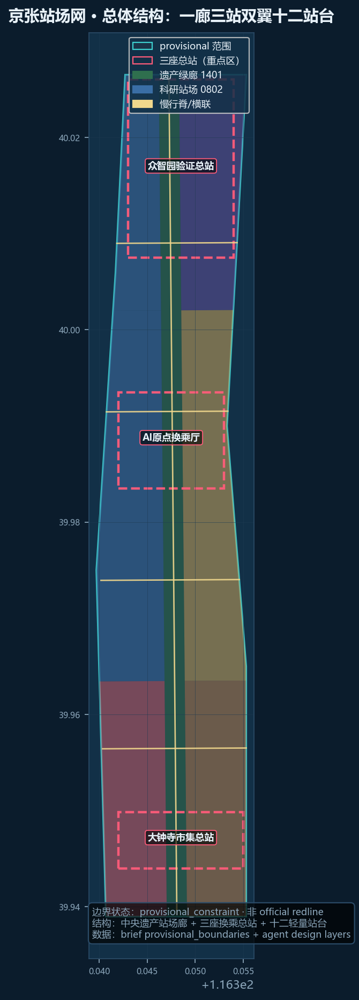
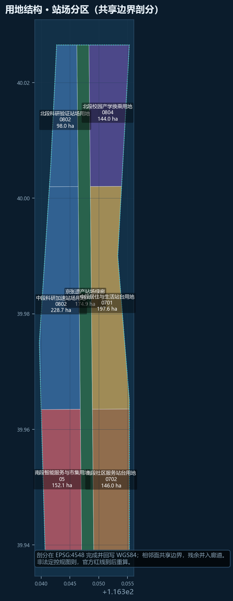
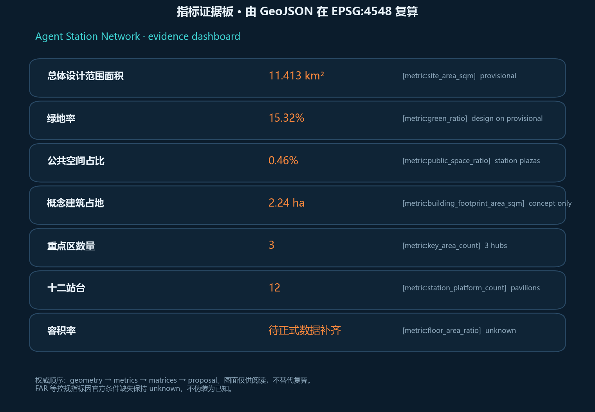

# Agent Station Network: A Multi-Agent Transfer Urban Design for the Jing-Zhang AI Belt

## Design basis and source inventory

This package responds to the Haidian open call for the Centennial Jing-Zhang AI Innovation Belt. It relies on the public announcement, the agent taskbook, the site package, and formal-ready rows in `data/source_registry.json`. Provisional boundaries are used only for generation, display, and intake checks—never as an official redline [source:OFFICIAL-ANNOUNCEMENT] [source:AGENT-TASKBOOK] [source:SOURCE-REGISTRY].

Complete source, standard, and task coverage lives in the JSON matrices. Prose keeps only claim-adjacent anchors [depth:existing_conditions_diagnosis] [data:geometry/site_boundary.geojson#SITE-001].

## Three-level scope framework

The coordinated research area (~43.6 km²) holds industry and future-city strategy. The overall design area (~11.4 km²) is represented with provisional geometry (recomputed ≈ 11.413 km²) [metric:site_area_sqm]. The three key areas are reinterpreted as hubs: Verification Terminal, Origin Interchange, and Market Terminal [data:geometry/key_areas.geojson].

## Coordinated research: industry and future city

**Agent Station Network** treats public AI services as timed trains: published, boardable, transferable, auditable, and reversible. The naming system uses Hub / Platform / Service Train / Boarding Compact. The three positionings map to the heritage spine, daily-life platforms, and innovation hubs; the five functions are organized by the same station protocol [source:AGENT-TASKBOOK] [depth:overall_spatial_structure].

Eight global references (Barcelona Superblocks, Singapore Smart Nation, the Sidewalk Toronto cautionary case, Kalasatama, Seoul DMC, UnternehmerTUM, X-Road, Takeshiba) are translated into station rules rather than copied forms [standard:PROJECT-AGENT-OPEN-CALL-TASKBOOK].

## Overall design area at regulatory urban-design depth

One heritage spine, three hubs, two wings (Zhongguancun service wing and Xiaoyuehe scenario wing), and twelve lightweight platforms structure the corridor [data:geometry/buildings.geojson#BLD-PLAT-01]. Renewal prefers reversible interfaces over mass demolition. FAR remains unknown without official controls [metric:floor_area_ratio] [standard:MOHURD-URBAN-DESIGN-MEASURES].

## Detailed design of key areas

**Verification Terminal** hosts full-stack testing, open evaluation tracks, and governance experiments. **Origin Interchange** connects campus, community, and builders. **Market Terminal** hosts intelligent retail/services and east–west mending links [depth:three_key_area_detailed_design] [data:geometry/key_areas.geojson].

## AI ecosystem, personas, and AI+ scenarios

Personas: residents, students, developers, small merchants, street-level coordinators. Twelve scenario cards cover mobility safety, accessibility, elder care scheduling, shop copilots, public model evaluation, shared lab booking, crowd resilience, heritage interpretation, compliance assistants, hackathon trains, microclimate, and public-art workshops—each mapped to a hub or platform and marked conceptual [source:AGENT-TASKBOOK].

## Land use, building scale, and retain/renovate/demolish strategy

Land use is partitioned in EPSG:4548 with shared edges [data:geometry/land_use.geojson] [metric:green_ratio]. Concept footprints total about 2.24 ha [metric:building_footprint_area_sqm]. No parcel-level demolition verdict is claimed.

## Transport, rail, utilities, public facilities

The mobility framework uses a central active spine plus east–west transfer links so pedestrians, cyclists, and low-speed service vehicles can move between three hubs and twelve platforms without rewriting city expressway redlines [data:geometry/roads.geojson#RD-SPINE] [data:geometry/roads.geojson#RD-X01]. The spine carries north–south continuity and heritage walking; the cross links mend east–west daily life severed by the historic rail cut. Rail is treated as an information-transfer and last-mile interface at the hubs, not as an approved station reconstruction. Modular utilities favor sensors that can be switched off, platform power, and open-data cabinets. Public services at platforms support elder care scheduling, night-safe student routes, and shared merchant logistics, tied to the public-space ratio [metric:public_space_ratio]. Missing official road/rail/utility controls keep these moves conceptual for professional deepening [source:SOURCE-REGISTRY] [depth:mobility_and_municipal_systems].

## Blue-green space, public space, character

Green ratio ≈ 15.32% [metric:green_ratio]; public-space ratio ≈ 0.46% [metric:public_space_ratio]. Pilgrimage landmarks: Verification Clocktower, Origin Transfer Ring, Market Bell—conceptual narrative nodes [depth:blue_green_public_space].

## Projects, policy hints, phasing

Near term: three-hub opening package and spine continuity. Medium term: twelve platforms and wing interfaces. Long term: global timetable operations. Annual program: spring pilgrimage week, summer junior station-master camp, autumn evaluation cup, winter governance roundtable.

## Indicator system, area recomputation, and compliance matrix

Known metrics are recomputed from this package’s GeoJSON in EPSG:4548; unknowns stay explicit. Matrices cover announcement tasks and agent.1–6. Organizer data gaps do not block content scoring, but precision claims must be recomputed later [metric:site_area_sqm] [depth:metrics_recalculation].

## Risk, copyright, compliance

Main risks are provisional geometry precision and over-claiming. Areas and ratios must be recomputed after official redlines [data:geometry/site_boundary.geojson#SITE-001] [metric:site_area_sqm] [source:SOURCE-REGISTRY]. Conceptual station ideas are not approved plans or investment commitments [source:AGENT-TASKBOOK].

No secret maps, no forged approvals, no upgrade of provisional geometry to official redlines, no investment promises. See `report/copyright_statement.md`. Humans and professional teams retain final judgment.

## References

Aligned with `sources.json` and the registry [source:SOURCE-REGISTRY] [source:OFFICIAL-ANNOUNCEMENT].

1. Public prequalification announcement for the Centennial Jing-Zhang AI Innovation Belt
2. `brief/site-package/agent_taskbook.json`
3. `data/source_registry.json`
4. `brief/site-package/geometry/provisional_boundaries.geojson`
5. Local standard snapshots under `brief/site-package/standards/`
6. https://haidian.open-city.ai/
